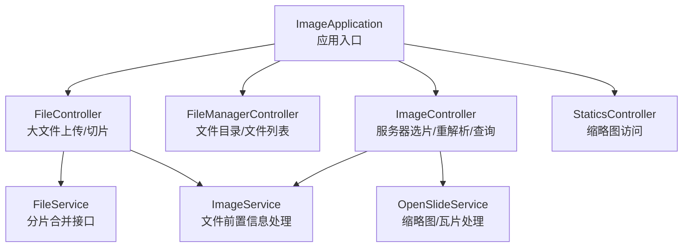
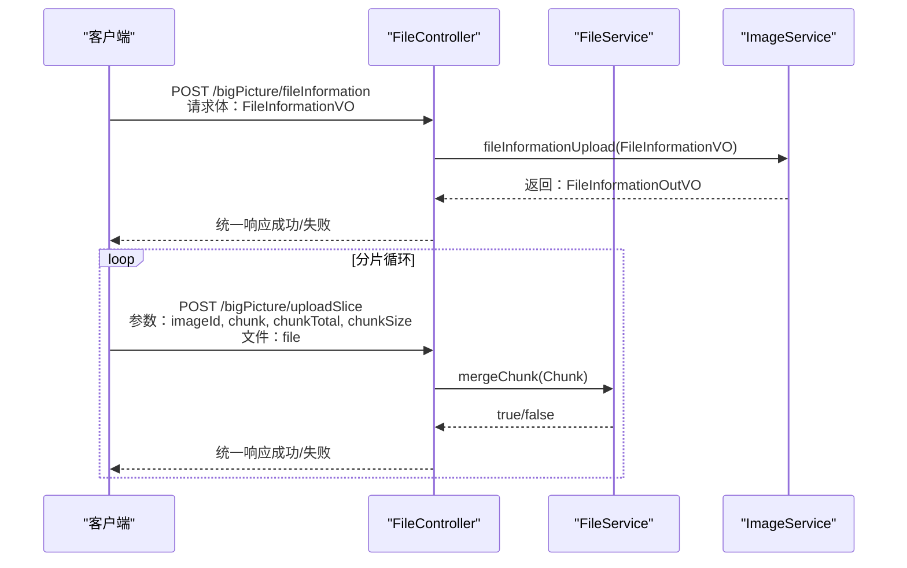
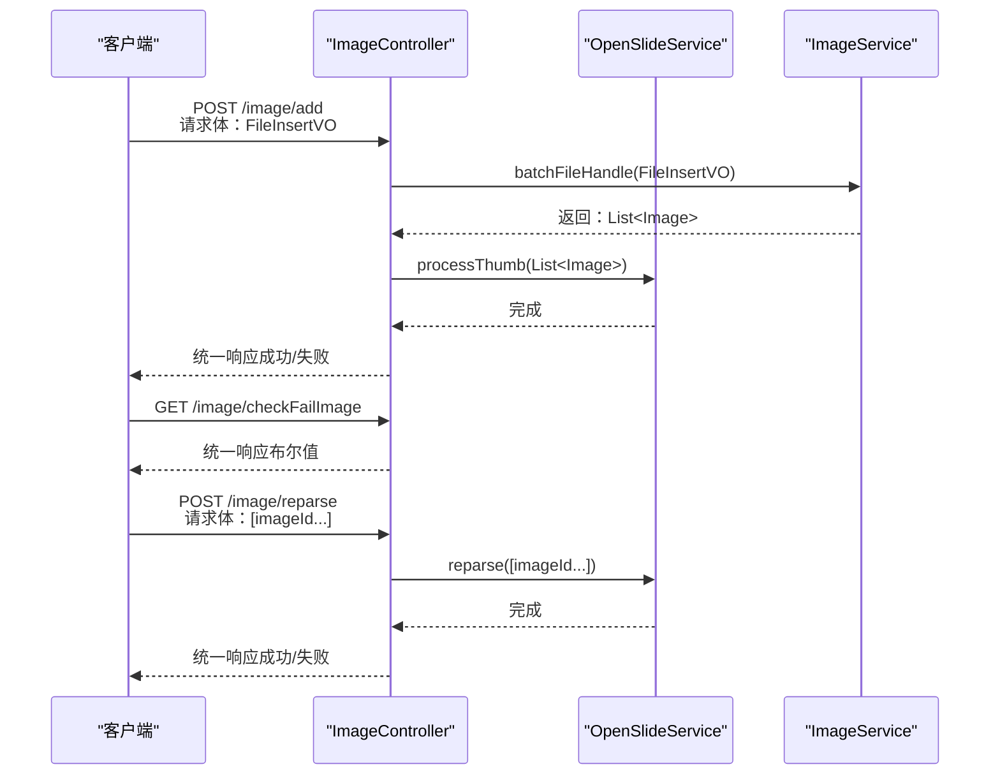
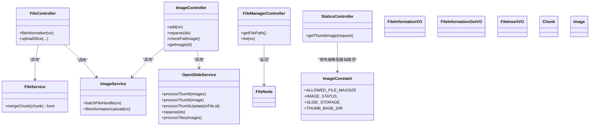

# API接口文档

<cite>
**本文引用的文件**
- [ImageApplication.java](file://src/main/java/cn/staitech/ImageApplication.java)
- [FileController.java](file://src/main/java/cn/staitech/file/controller/FileController.java)
- [FileManagerController.java](file://src/main/java/cn/staitech/file/controller/FileManagerController.java)
- [ImageController.java](file://src/main/java/cn/staitech/file/controller/ImageController.java)
- [StaticsController.java](file://src/main/java/cn/staitech/file/controller/StaticsController.java)
- [FileService.java](file://src/main/java/cn/staitech/file/service/FileService.java)
- [ImageService.java](file://src/main/java/cn/staitech/file/service/ImageService.java)
- [OpenSlideService.java](file://src/main/java/cn/staitech/file/service/OpenSlideService.java)
- [ImageConstant.java](file://src/main/java/cn/staitech/file/constant/ImageConstant.java)
- [bootstrap.yml](file://src/main/resources/bootstrap.yml)
- [FileInformationVO.java](file://src/main/java/cn/staitech/file/vo/FileInformationVO.java)
- [FileInformationOutVO.java](file://src/main/java/cn/staitech/file/vo/FileInformationOutVO.java)
- [FileInsertVO.java](file://src/main/java/cn/staitech/file/vo/FileInsertVO.java)
- [Chunk.java](file://src/main/java/cn/staitech/file/vo/Chunk.java)
- [Image.java](file://src/main/java/cn/staitech/file/domain/Image.java)
</cite>

## 目录
1. [简介](#简介)
2. [项目结构](#项目结构)
3. [核心组件](#核心组件)
4. [架构总览](#架构总览)
5. [详细组件分析](#详细组件分析)
6. [依赖关系分析](#依赖关系分析)
7. [性能与并发特性](#性能与并发特性)
8. [故障排查指南](#故障排查指南)
9. [结论](#结论)
10. [附录](#附录)

## 简介
本文件为 PACMVS 项目“图像服务模块”的完整 API 接口文档，覆盖文件管理、图像处理与系统管理相关接口。文档面向客户端开发者，提供接口的 HTTP 方法、URL 模式、请求/响应格式、认证方式、参数校验规则、错误码说明与调用示例，并给出最佳实践建议。

## 项目结构
后端基于 Spring Boot 构建，启用调度、WebSocket、安全注解、Feign 客户端、Nacos 注册与配置中心、事务管理与指标监控等能力。应用启动类位于根包下，控制器按功能划分为文件上传与切片、文件管理器、图像处理与选片、静态资源（缩略图）四类。

图表来源
- [ImageApplication.java:37-52](file://src/main/java/cn/staitech/ImageApplication.java#L37-L52)
- [FileController.java:38-129](file://src/main/java/cn/staitech/file/controller/FileController.java#L38-L129)
- [FileManagerController.java:25-118](file://src/main/java/cn/staitech/file/controller/FileManagerController.java#L25-L118)
- [ImageController.java:26-71](file://src/main/java/cn/staitech/file/controller/ImageController.java#L26-L71)
- [StaticsController.java:23-45](file://src/main/java/cn/staitech/file/controller/StaticsController.java#L23-L45)

章节来源
- [ImageApplication.java:37-52](file://src/main/java/cn/staitech/ImageApplication.java#L37-L52)

## 核心组件
- 控制器层：负责接收请求、参数校验、调用服务层并返回统一响应包装对象。
- 服务层：封装业务逻辑，如文件前置信息入库、分片合并、图像批量处理、缩略图生成与重解析。
- 常量与配置：集中定义图像状态码、切片存储目录、最大文件大小、缩略图基础路径等。
- 统一响应：所有接口返回统一包装结构，便于前端处理。

章节来源
- [FileController.java:38-129](file://src/main/java/cn/staitech/file/controller/FileController.java#L38-L129)
- [ImageController.java:26-71](file://src/main/java/cn/staitech/file/controller/ImageController.java#L26-L71)
- [ImageConstant.java:9-66](file://src/main/java/cn/staitech/file/constant/ImageConstant.java#L9-L66)
- [bootstrap.yml:1-37](file://src/main/resources/bootstrap.yml#L1-L37)

## 架构总览
以下序列图展示典型的大文件上传与切片合并流程，以及服务器选片与缩略图生成流程。

图表来源
- [FileController.java:58-127](file://src/main/java/cn/staitech/file/controller/FileController.java#L58-L127)
- [FileService.java:6-9](file://src/main/java/cn/staitech/file/service/FileService.java#L6-L9)
- [ImageService.java:17-23](file://src/main/java/cn/staitech/file/service/ImageService.java#L17-L23)

图表来源
- [ImageController.java:42-69](file://src/main/java/cn/staitech/file/controller/ImageController.java#L42-L69)
- [OpenSlideService.java:14-39](file://src/main/java/cn/staitech/file/service/OpenSlideService.java#L14-L39)
- [ImageService.java:17-23](file://src/main/java/cn/staitech/file/service/ImageService.java#L17-L23)

## 详细组件分析

### 文件管理 API
- 基础路径：/filePath
- 功能：获取服务器切片根目录、列出指定路径下的目录与文件，并进行过滤与排序。

接口一览
- 获取根目录
  - 方法：POST
  - 路径：/filePath/getFilePath
  - 参数：无
  - 响应：统一响应，数据为字符串（文件根路径）
  - 示例：见“使用示例”章节

- 列出目录内容
  - 方法：POST
  - 路径：/filePath/list
  - 请求体：PathVO（包含 path、filter）
  - 响应：统一响应，数据为 FileNode 列表（name、absolutePath、type、size）
  - 过滤规则：当 filter 非空时仅返回以 filter 结尾的文件
  - 排序规则：先按 type（dir 在前），再按名称排序
  - 示例：见“使用示例”章节

参数与数据模型
- PathVO
  - 字段：path（必填）、filter（可选）
- FileNode
  - 字段：name、absolutePath、type（dir 或 file）、size

错误与边界
- 若传入路径不存在或为文件而非目录，返回失败提示
- Windows 路径自动转换为 Linux 风格（含盘符映射）

章节来源
- [FileManagerController.java:33-89](file://src/main/java/cn/staitech/file/controller/FileManagerController.java#L33-L89)
- [FileNode.java](file://src/main/java/cn/staitech/file/vo/FileNode.java)

### 图像处理 API
- 基础路径：/image
- 功能：服务器选片、重解析失败切片、检查是否存在解析失败的切片、查询原始切片信息。

接口一览
- 服务器选片
  - 方法：POST
  - 路径：/image/add
  - 请求体：FileInsertVO（fileList、organizationId、roundId、bizType）
  - 响应：统一响应（成功/失败）
  - 行为：批量处理文件，生成缩略图与瓦片

- 重新解析失败数据
  - 方法：POST
  - 路径：/image/reparse
  - 请求体：imageId 数组
  - 响应：统一响应（成功/失败）

- 检查是否存在解析失败的切片
  - 方法：GET
  - 路径：/image/checkFailImage
  - 响应：统一响应（布尔值，true 表示存在失败项）

- 查询原始切片
  - 方法：GET
  - 路径：/image/getImage/{id}
  - 路径参数：id（Long）
  - 响应：统一响应，数据为 Image 对象

数据模型
- FileInsertVO
  - 字段：fileList（必填，字符串数组）、organizationId（必填）、roundId（可选）、bizType（可选，默认原始切片）
- Image
  - 字段：imageId、fileName、imageName、imagePath、imageUrl、thumbUrl、macroUrl、labelUrl、cacheUrl、multiple、format、width、height、depth、size、globalSize、resolvingPower、tileCountList、levelCount、chunkTotal、md5、resolutionX、resolutionY、sourceLens、createBy、createTime、updateBy、updateTime、imageCode、topicId、topicName、status、bizType、source、organizationId、animalCode、waxCode、groupCode、sexFlag、analyzeStatus、period

章节来源
- [ImageController.java:42-69](file://src/main/java/cn/staitech/file/controller/ImageController.java#L42-L69)
- [FileInsertVO.java:14-25](file://src/main/java/cn/staitech/file/vo/FileInsertVO.java#L14-L25)
- [Image.java:26-216](file://src/main/java/cn/staitech/file/domain/Image.java#L26-L216)

### 大文件上传与切片 API
- 基础路径：/bigPicture
- 功能：上传文件前置信息、分片上传与合并。

接口一览
- 添加文件前置信息（大小文件共用）
  - 方法：POST
  - 路径：/bigPicture/fileInformation
  - 请求体：FileInformationVO（imageName、md5、chunkTotal、size、organizationId、projectTypeId、uuid、userId、imageId 可选）
  - 校验规则：
    - 文件大小不超过 5GB
    - 扩展名允许（由工具类判定）
    - 可选重复校验（受配置开关控制）
  - 响应：统一响应，数据为 FileInformationOutVO（imageId、hostId）

- 每一分片文件上传
  - 方法：POST
  - 路径：/bigPicture/uploadSlice
  - 查询参数：imageId（Long，必填）、chunk（Integer，必填）、chunkTotal（Integer，必填）、chunkSize（Long，必填）
  - 文件字段：file（MultipartFile，必填）
  - 响应：统一响应（成功/失败）

数据模型
- FileInformationVO
  - 字段：imageId（可选）、imageName（必填，1-100 字符）、md5（必填）、chunkTotal（可选）、size（必填）、organizationId（必填）、projectTypeId（可选）、uuid（可选）、userId（可选）
- FileInformationOutVO
  - 字段：imageId（必填）、hostId（必填）
- Chunk
  - 字段：chunkNumber、chunkSize、filename、totalChunks、imageId、file

章节来源
- [FileController.java:58-127](file://src/main/java/cn/staitech/file/controller/FileController.java#L58-L127)
- [FileInformationVO.java:14-45](file://src/main/java/cn/staitech/file/vo/FileInformationVO.java#L14-L45)
- [FileInformationOutVO.java:6-14](file://src/main/java/cn/staitech/file/vo/FileInformationOutVO.java#L6-L14)
- [Chunk.java:11-47](file://src/main/java/cn/staitech/file/vo/Chunk.java#L11-L47)

### 系统管理 API
- 基础路径：/statics
- 功能：通过静态资源方式访问缩略图。

接口一览
- 获取缩略图
  - 方法：GET
  - 路径：/statics/thumbnail/**
  - 行为：将请求路径中的 /statics 替换为配置的文件根路径，读取对应缩略图文件并返回字节流
  - 响应：图片字节流（JPEG/PNG）
  - 错误：找不到文件时记录日志并返回空内容

章节来源
- [StaticsController.java:31-44](file://src/main/java/cn/staitech/file/controller/StaticsController.java#L31-L44)
- [bootstrap.yml:28-34](file://src/main/resources/bootstrap.yml#L28-L34)

## 依赖关系分析
- 控制器依赖服务接口，服务接口进一步依赖领域模型与常量配置。
- 统一响应包装对象贯穿各层，保证客户端一致的错误与成功处理体验。
- 配置文件提供端口、多部件上传限制、Nacos 注册与配置中心参数。

图表来源
- [FileController.java:38-129](file://src/main/java/cn/staitech/file/controller/FileController.java#L38-L129)
- [ImageController.java:26-71](file://src/main/java/cn/staitech/file/controller/ImageController.java#L26-L71)
- [FileManagerController.java:25-118](file://src/main/java/cn/staitech/file/controller/FileManagerController.java#L25-L118)
- [StaticsController.java:23-45](file://src/main/java/cn/staitech/file/controller/StaticsController.java#L23-L45)
- [FileService.java:6-9](file://src/main/java/cn/staitech/file/service/FileService.java#L6-L9)
- [ImageService.java:17-23](file://src/main/java/cn/staitech/file/service/ImageService.java#L17-L23)
- [OpenSlideService.java:14-39](file://src/main/java/cn/staitech/file/service/OpenSlideService.java#L14-L39)
- [ImageConstant.java:9-66](file://src/main/java/cn/staitech/file/constant/ImageConstant.java#L9-L66)
- [FileInformationVO.java:14-45](file://src/main/java/cn/staitech/file/vo/FileInformationVO.java#L14-L45)
- [FileInformationOutVO.java:6-14](file://src/main/java/cn/staitech/file/vo/FileInformationOutVO.java#L6-L14)
- [FileInsertVO.java:14-25](file://src/main/java/cn/staitech/file/vo/FileInsertVO.java#L14-L25)
- [Chunk.java:11-47](file://src/main/java/cn/staitech/file/vo/Chunk.java#L11-L47)
- [Image.java:26-216](file://src/main/java/cn/staitech/file/domain/Image.java#L26-L216)

## 性能与并发特性
- 上传限制：单文件最大 500MB，请求整体大小 500MB（由配置文件设定）。
- 并发策略：分片上传采用独立分片参数与文件流，服务层负责合并与持久化；缩略图与瓦片生成由 OpenSlideService 异步处理。
- 资源访问：缩略图通过静态资源直接读取文件系统，避免额外中间层开销。

章节来源
- [bootstrap.yml:6-10](file://src/main/resources/bootstrap.yml#L6-L10)

## 故障排查指南
常见错误与定位
- 文件大小超限：当文件大小超过 5GB 时，前置信息接口直接返回失败。
- 扩展名不被允许：当扩展名不在允许列表时，前置信息接口返回失败。
- 重复文件检测：当开启重复校验且同名文件已存在时，前置信息接口返回失败。
- 缩略图缺失：静态资源接口在找不到文件时记录错误日志并返回空内容，需确认路径映射与文件存在性。

章节来源
- [FileController.java:61-84](file://src/main/java/cn/staitech/file/controller/FileController.java#L61-L84)
- [ImageConstant.java:13-18](file://src/main/java/cn/staitech/file/constant/ImageConstant.java#L13-L18)
- [StaticsController.java:38-43](file://src/main/java/cn/staitech/file/controller/StaticsController.java#L38-L43)

## 结论
本接口文档覆盖了 PACMVS 图像服务模块的核心 API，包括文件管理、图像处理与系统管理三类接口。通过统一的响应包装、严格的参数校验与清晰的错误码，客户端可以稳定地完成大文件分片上传、服务器选片与缩略图访问等操作。建议在生产环境中结合 Nacos 配置中心与注册发现机制，确保服务高可用与可运维性。

## 附录

### 统一响应结构
- 成功：包含状态码与数据
- 失败：包含状态码与错误信息
- 本项目使用统一包装对象，具体字段以实际返回为准

章节来源
- [FileController.java:14](file://src/main/java/cn/staitech/file/controller/FileController.java#L14)
- [ImageController.java:3](file://src/main/java/cn/staitech/file/controller/ImageController.java#L3)

### 使用示例

- 获取服务器切片根目录
  - 请求：POST http://host:port/filePath/getFilePath
  - 响应：统一响应，数据为字符串（文件根路径）

- 列出目录内容
  - 请求：POST http://host:port/filePath/list
  - 请求体：
    - path：目标路径
    - filter：可选，文件后缀过滤
  - 响应：统一响应，数据为 FileNode 列表

- 服务器选片
  - 请求：POST http://host:port/image/add
  - 请求体：
    - fileList：文件绝对路径数组
    - organizationId：机构 ID
    - roundId：轮次 ID（可选）
    - bizType：业务类型（1 原始切片，2 预测切片，可选）
  - 响应：统一响应（成功/失败）

- 重新解析失败数据
  - 请求：POST http://host:port/image/reparse
  - 请求体：[imageId...]
  - 响应：统一响应（成功/失败）

- 检查是否存在解析失败的切片
  - 请求：GET http://host:port/image/checkFailImage
  - 响应：统一响应（布尔值）

- 查询原始切片
  - 请求：GET http://host:port/image/getImage/{id}
  - 响应：统一响应，数据为 Image 对象

- 添加文件前置信息
  - 请求：POST http://host:port/bigPicture/fileInformation
  - 请求体：FileInformationVO
  - 响应：统一响应，数据为 FileInformationOutVO

- 分片上传
  - 请求：POST http://host:port/bigPicture/uploadSlice
  - 查询参数：
    - imageId：图片 ID
    - chunk：当前分片编号
    - chunkTotal：分片总数
    - chunkSize：分片大小
  - 文件字段：file
  - 响应：统一响应（成功/失败）

- 访问缩略图
  - 请求：GET http://host:port/statics/thumbnail/{相对路径}
  - 响应：图片字节流（JPEG/PNG）

章节来源
- [FileManagerController.java:33-89](file://src/main/java/cn/staitech/file/controller/FileManagerController.java#L33-L89)
- [ImageController.java:42-69](file://src/main/java/cn/staitech/file/controller/ImageController.java#L42-L69)
- [FileController.java:58-127](file://src/main/java/cn/staitech/file/controller/FileController.java#L58-L127)
- [StaticsController.java:31-44](file://src/main/java/cn/staitech/file/controller/StaticsController.java#L31-L44)