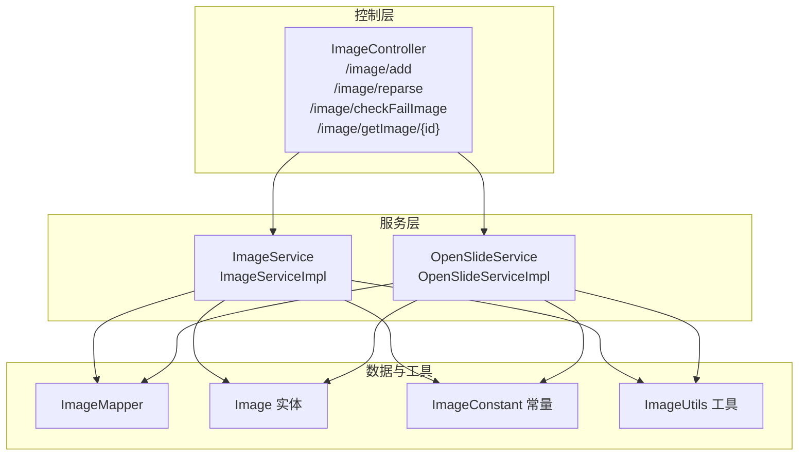
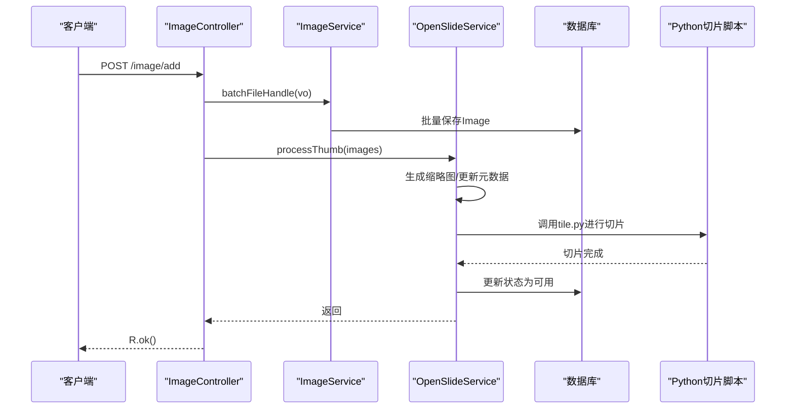
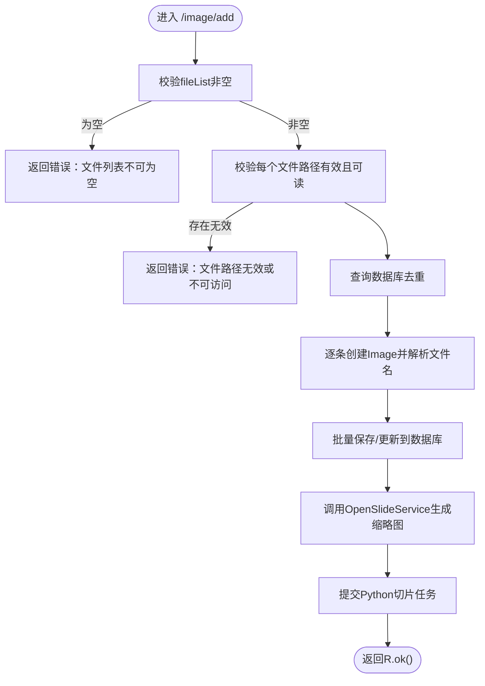
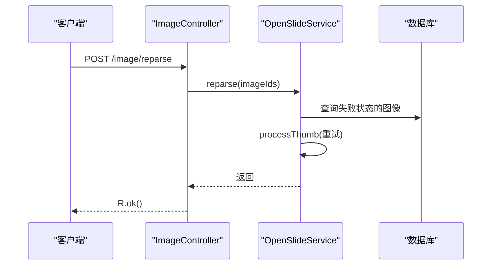
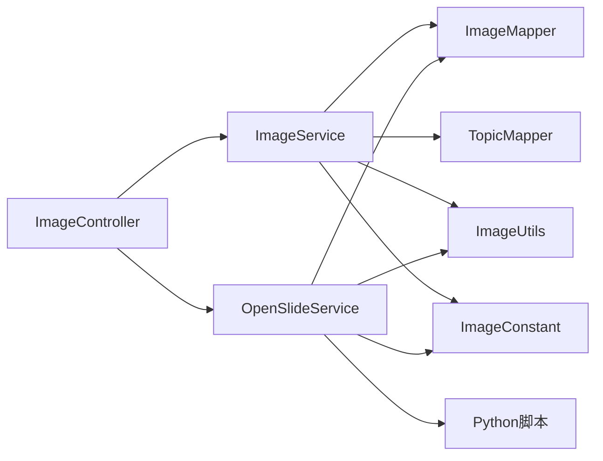

# 图像处理API

<cite>
**本文引用的文件**
- [ImageController.java](file://src/main/java/cn/staitech/file/controller/ImageController.java)
- [ImageService.java](file://src/main/java/cn/staitech/file/service/ImageService.java)
- [ImageServiceImpl.java](file://src/main/java/cn/staitech/file/service/impl/ImageServiceImpl.java)
- [OpenSlideService.java](file://src/main/java/cn/staitech/file/service/OpenSlideService.java)
- [OpenSlideServiceImpl.java](file://src/main/java/cn/staitech/file/service/impl/OpenSlideServiceImpl.java)
- [Image.java](file://src/main/java/cn/staitech/file/domain/Image.java)
- [ImageConstant.java](file://src/main/java/cn/staitech/file/constant/ImageConstant.java)
- [FileInsertVO.java](file://src/main/java/cn/staitech/file/vo/FileInsertVO.java)
- [FileInformationVO.java](file://src/main/java/cn/staitech/file/vo/FileInformationVO.java)
- [FileInformationOutVO.java](file://src/main/java/cn/staitech/file/vo/FileInformationOutVO.java)
- [ImageUtils.java](file://src/main/java/cn/staitech/file/util/ImageUtils.java)
- [bootstrap.yml](file://src/main/resources/bootstrap.yml)
</cite>

## 目录
1. [简介](#简介)
2. [项目结构](#项目结构)
3. [核心组件](#核心组件)
4. [架构总览](#架构总览)
5. [详细组件分析](#详细组件分析)
6. [依赖分析](#依赖分析)
7. [性能考虑](#性能考虑)
8. [故障排查指南](#故障排查指南)
9. [结论](#结论)
10. [附录](#附录)

## 简介
本文件为图像处理相关API的完整接口文档，覆盖“服务器选片”、“重新解析失败切片”、“检查解析失败切片”、“查询原始切片”等核心功能。文档详细说明各接口的请求参数、响应格式、处理流程、状态管理与失败重试机制，并给出调用时序与业务逻辑说明，帮助开发者快速集成与排障。

## 项目结构
- 控制层：提供REST接口，负责接收请求、调用服务层并返回统一响应。
- 服务层：封装业务逻辑，包括文件插入、信息解析、切片处理与状态管理。
- 数据模型：定义图像实体及状态常量。
- 工具与配置：提供图像工具方法、线程池配置与运行参数。

图表来源
- [ImageController.java:27-71](file://src/main/java/cn/staitech/file/controller/ImageController.java#L27-L71)
- [ImageService.java:17-23](file://src/main/java/cn/staitech/file/service/ImageService.java#L17-L23)
- [ImageServiceImpl.java:42-140](file://src/main/java/cn/staitech/file/service/impl/ImageServiceImpl.java#L42-L140)
- [OpenSlideService.java:14-39](file://src/main/java/cn/staitech/file/service/OpenSlideService.java#L14-L39)
- [OpenSlideServiceImpl.java:47-312](file://src/main/java/cn/staitech/file/service/impl/OpenSlideServiceImpl.java#L47-L312)
- [Image.java:27-216](file://src/main/java/cn/staitech/file/domain/Image.java#L27-L216)
- [ImageConstant.java:9-67](file://src/main/java/cn/staitech/file/constant/ImageConstant.java#L9-L67)
- [ImageUtils.java:20-148](file://src/main/java/cn/staitech/file/util/ImageUtils.java#L20-L148)

章节来源
- [ImageController.java:27-71](file://src/main/java/cn/staitech/file/controller/ImageController.java#L27-L71)
- [bootstrap.yml:1-37](file://src/main/resources/bootstrap.yml#L1-L37)

## 核心组件
- 控制器：提供四个核心接口，分别对应“服务器选片”、“重新解析失败数据”、“检查是否存在解析失败的切片”、“查询原始切片”。
- 服务接口与实现：
  - ImageService：负责批量文件处理、文件信息上传、解析文件名并生成图像元数据。
  - OpenSlideService：负责缩略图生成、切片任务提交、失败重试与日志审计。
- 数据模型与常量：
  - Image：承载图像元数据、状态、来源、解析状态等。
  - ImageConstant：集中定义图像状态、来源、文件名校验状态、解剖期限常量等。
- VO与工具：
  - FileInsertVO：服务器选片请求体。
  - FileInformationVO/FileInformationOutVO：文件信息上传的输入与输出。
  - ImageUtils：路径生成、目录检查、格式转换、文件名校验等。

章节来源
- [ImageController.java:30-71](file://src/main/java/cn/staitech/file/controller/ImageController.java#L30-L71)
- [ImageService.java:17-23](file://src/main/java/cn/staitech/file/service/ImageService.java#L17-L23)
- [ImageServiceImpl.java:42-548](file://src/main/java/cn/staitech/file/service/impl/ImageServiceImpl.java#L42-L548)
- [OpenSlideService.java:14-39](file://src/main/java/cn/staitech/file/service/OpenSlideService.java#L14-L39)
- [OpenSlideServiceImpl.java:47-563](file://src/main/java/cn/staitech/file/service/impl/OpenSlideServiceImpl.java#L47-L563)
- [Image.java:27-216](file://src/main/java/cn/staitech/file/domain/Image.java#L27-L216)
- [ImageConstant.java:9-67](file://src/main/java/cn/staitech/file/constant/ImageConstant.java#L9-L67)
- [FileInsertVO.java:14-26](file://src/main/java/cn/staitech/file/vo/FileInsertVO.java#L14-L26)
- [FileInformationVO.java:14-46](file://src/main/java/cn/staitech/file/vo/FileInformationVO.java#L14-L46)
- [FileInformationOutVO.java:6-14](file://src/main/java/cn/staitech/file/vo/FileInformationOutVO.java#L6-L14)
- [ImageUtils.java:20-148](file://src/main/java/cn/staitech/file/util/ImageUtils.java#L20-L148)

## 架构总览
系统采用“控制器-服务-数据/工具”的分层架构。控制器接收请求并调用服务层；服务层协调数据持久化与外部处理（缩略图生成、Python切片脚本），并通过日志审计模块记录操作轨迹。

图表来源
- [ImageController.java:42-48](file://src/main/java/cn/staitech/file/controller/ImageController.java#L42-L48)
- [ImageServiceImpl.java:63-140](file://src/main/java/cn/staitech/file/service/impl/ImageServiceImpl.java#L63-L140)
- [OpenSlideServiceImpl.java:277-339](file://src/main/java/cn/staitech/file/service/impl/OpenSlideServiceImpl.java#L277-L339)

## 详细组件分析

### 服务器选片接口
- 接口描述：将服务器上的切片文件加入系统，自动解析文件名并生成缩略图，随后异步切片处理。
- 请求方式：POST
- 请求路径：/image/add
- 请求头：Content-Type: application/json
- 请求体：FileInsertVO
  - fileList：字符串数组，元素为切片文件的绝对路径（必填）
  - organizationId：机构ID（必填）
  - roundId：轮次ID（可选）
  - bizType：业务类型（默认1原始切片，可选）
- 成功响应：R.ok()，返回标准统一响应体
- 失败场景：
  - 文件路径无效或不可读
  - 文件列表为空
  - 重复文件（已在同机构下存在）
- 处理流程：
  1) 校验文件列表与路径有效性
  2) 去重：过滤已在数据库中的文件
  3) 逐条创建Image对象，设置初始状态与来源
  4) 解析文件名（支持两种格式），填充专题、动物号、蜡块号、组别与性别、解剖期限等
  5) 保存或更新至数据库
  6) 调用OpenSlideService生成缩略图并提交切片任务

图表来源
- [ImageController.java:42-48](file://src/main/java/cn/staitech/file/controller/ImageController.java#L42-L48)
- [ImageServiceImpl.java:63-140](file://src/main/java/cn/staitech/file/service/impl/ImageServiceImpl.java#L63-L140)
- [OpenSlideServiceImpl.java:277-312](file://src/main/java/cn/staitech/file/service/impl/OpenSlideServiceImpl.java#L277-L312)

章节来源
- [ImageController.java:42-48](file://src/main/java/cn/staitech/file/controller/ImageController.java#L42-L48)
- [FileInsertVO.java:14-26](file://src/main/java/cn/staitech/file/vo/FileInsertVO.java#L14-L26)
- [ImageServiceImpl.java:63-140](file://src/main/java/cn/staitech/file/service/impl/ImageServiceImpl.java#L63-L140)
- [ImageConstant.java:20-31](file://src/main/java/cn/staitech/file/constant/ImageConstant.java#L20-L31)

### 重新解析所有失败数据接口
- 接口描述：对指定的图像ID集合执行失败重试，仅针对解析失败或切片处理失败的图像。
- 请求方式：POST
- 请求路径：/image/reparse
- 请求体：Long数组（图像ID列表）
- 成功响应：R.ok()
- 处理流程：
  1) 校验ID列表非空
  2) 查询状态为“解析失败/信息解析失败/切片处理失败”的图像
  3) 调用OpenSlideService.processThumb批量重试

图表来源
- [ImageController.java:50-55](file://src/main/java/cn/staitech/file/controller/ImageController.java#L50-L55)
- [OpenSlideServiceImpl.java:259-268](file://src/main/java/cn/staitech/file/service/impl/OpenSlideServiceImpl.java#L259-L268)

章节来源
- [ImageController.java:50-55](file://src/main/java/cn/staitech/file/controller/ImageController.java#L50-L55)
- [OpenSlideServiceImpl.java:259-268](file://src/main/java/cn/staitech/file/service/impl/OpenSlideServiceImpl.java#L259-L268)

### 检查是否存在解析失败的切片接口
- 接口描述：检查当前机构是否存在解析失败的切片（解析失败或信息解析失败）。
- 请求方式：GET
- 请求路径：/image/checkFailImage
- 成功响应：R.ok(布尔值)，true表示存在失败项
- 处理流程：
  1) 查询当前机构下状态非“可用”或“信息解析失败”的图像数量
  2) 返回是否存在大于0的结果

章节来源
- [ImageController.java:56-63](file://src/main/java/cn/staitech/file/controller/ImageController.java#L56-L63)
- [ImageServiceImpl.java:99-122](file://src/main/java/cn/staitech/file/service/impl/ImageServiceImpl.java#L99-L122)

### 查询原始切片接口
- 接口描述：按图像ID查询原始切片信息。
- 请求方式：GET
- 请求路径：/image/getImage/{id}
- 路径参数：id（图像ID）
- 成功响应：R.ok(图像对象)
- 处理流程：直接查询数据库并返回

章节来源
- [ImageController.java:65-69](file://src/main/java/cn/staitech/file/controller/ImageController.java#L65-L69)
- [ImageServiceImpl.java:137-140](file://src/main/java/cn/staitech/file/service/impl/ImageServiceImpl.java#L137-L140)

### 文件信息上传接口（补充说明）
- 接口描述：当文件以分片形式上传后，补充文件信息（如文件名、MD5、大小等）以便后续解析。
- 请求方式：POST
- 请求路径：/image/fileInfo/upload（由ImageService定义）
- 请求体：FileInformationVO
  - imageName：文件名（必填）
  - md5：文件MD5（必填）
  - chunkTotal：分片总数（可选）
  - size：文件大小（必填）
  - organizationId：机构ID（必填）
  - 其他可选字段
- 成功响应：R.ok(FileInformationOutVO)
- 处理流程：
  1) 校验输入参数
  2) 解析文件名，设置默认状态与来源
  3) 生成组织与主题路径
  4) 插入数据库并返回imageId

章节来源
- [ImageService.java:21](file://src/main/java/cn/staitech/file/service/ImageService.java#L21)
- [ImageServiceImpl.java:173-232](file://src/main/java/cn/staitech/file/service/impl/ImageServiceImpl.java#L173-L232)
- [FileInformationVO.java:14-46](file://src/main/java/cn/staitech/file/vo/FileInformationVO.java#L14-L46)
- [FileInformationOutVO.java:6-14](file://src/main/java/cn/staitech/file/vo/FileInformationOutVO.java#L6-L14)

## 依赖分析
- 控制器依赖服务层：ImageController依赖ImageService与OpenSlideService。
- 服务层依赖数据层与工具：ImageServiceImpl依赖ImageMapper、TopicMapper、ImageUtils、ImageConstant；OpenSlideServiceImpl依赖ImageMapper、ImageUtils、ImageConstant。
- 线程池与外部脚本：OpenSlideServiceImpl使用两个线程池（openSlideTaskExecutor、pythonTaskExecutor）并发处理缩略图与切片任务，并通过ProcessBuilder调用Python脚本。

图表来源
- [ImageController.java:30-34](file://src/main/java/cn/staitech/file/controller/ImageController.java#L30-L34)
- [ImageServiceImpl.java:46-49](file://src/main/java/cn/staitech/file/service/impl/ImageServiceImpl.java#L46-L49)
- [OpenSlideServiceImpl.java:67-72](file://src/main/java/cn/staitech/file/service/impl/OpenSlideServiceImpl.java#L67-L72)

章节来源
- [ImageController.java:30-34](file://src/main/java/cn/staitech/file/controller/ImageController.java#L30-L34)
- [ImageServiceImpl.java:46-49](file://src/main/java/cn/staitech/file/service/impl/ImageServiceImpl.java#L46-L49)
- [OpenSlideServiceImpl.java:67-72](file://src/main/java/cn/staitech/file/service/impl/OpenSlideServiceImpl.java#L67-L72)

## 性能考虑
- 并发处理：缩略图与切片任务分别在独立线程池中异步执行，提升吞吐量。
- 批量操作：批量保存与批量更新减少数据库往返次数。
- 资源释放：OpenSlide对象在finally中关闭，避免资源泄漏。
- 外部脚本：通过ProcessBuilder启动Python脚本，建议在容器内预热环境并限制超时。

章节来源
- [OpenSlideServiceImpl.java:277-339](file://src/main/java/cn/staitech/file/service/impl/OpenSlideServiceImpl.java#L277-L339)
- [ImageServiceImpl.java:137-140](file://src/main/java/cn/staitech/file/service/impl/ImageServiceImpl.java#L137-L140)

## 故障排查指南
- 常见错误码与含义（基于ImageConstant与服务层逻辑）：
  - 上传中：0
  - 上传失败：1
  - 解析中：2
  - 解析失败：3
  - 可用：4
  - 信息解析中：5
  - 信息解析失败：6
  - 处理中：7
  - 处理失败：8
- 常见问题定位：
  - 文件路径无效：检查fileList中的绝对路径是否真实存在且可读。
  - 重复文件：确认同一机构下是否已存在相同路径的图像。
  - 缩略图生成失败：检查OpenSlide库与Python脚本环境，查看日志中的异常堆栈。
  - 切片处理失败：确认Python脚本返回码为0，目标目录可写。
- 重试机制：
  - 通过“重新解析所有失败数据”接口对失败图像进行重试。
  - 失败图像会被移动到失败目录，便于人工复核与二次处理。

章节来源
- [ImageConstant.java:20-31](file://src/main/java/cn/staitech/file/constant/ImageConstant.java#L20-L31)
- [OpenSlideServiceImpl.java:259-268](file://src/main/java/cn/staitech/file/service/impl/OpenSlideServiceImpl.java#L259-L268)
- [OpenSlideServiceImpl.java:399-454](file://src/main/java/cn/staitech/file/service/impl/OpenSlideServiceImpl.java#L399-L454)

## 结论
本接口体系围绕“服务器选片”为核心，结合“重新解析失败数据”“检查失败状态”“查询原始切片”形成闭环。通过统一的状态管理与失败重试机制，保障大规模切片入库与处理的稳定性。建议在生产环境中配合日志审计与监控告警，持续优化线程池与外部脚本执行效率。

## 附录

### API清单与规范
- 服务器选片
  - 方法：POST
  - 路径：/image/add
  - 请求体：FileInsertVO
  - 成功：R.ok()
  - 失败：参数校验失败或文件处理异常
- 重新解析失败数据
  - 方法：POST
  - 路径：/image/reparse
  - 请求体：图像ID数组
  - 成功：R.ok()
- 检查是否存在解析失败的切片
  - 方法：GET
  - 路径：/image/checkFailImage
  - 成功：R.ok(boolean)
- 查询原始切片
  - 方法：GET
  - 路径：/image/getImage/{id}
  - 成功：R.ok(Image)

章节来源
- [ImageController.java:42-69](file://src/main/java/cn/staitech/file/controller/ImageController.java#L42-L69)

### 状态与字段说明
- 图像状态（status）
  - 0：上传中
  - 1：上传失败
  - 2：解析中
  - 3：解析失败
  - 4：可用
  - 5：信息解析中
  - 6：信息解析失败
  - 7：处理中
  - 8：处理失败
- 解析状态（analyzeStatus）
  - 0：失败
  - 1：成功
- 来源（source）
  - 1：手动上传
  - 2：服务器读取
- 关键字段（示例）
  - imageId：图像ID
  - fileName：无扩展名文件名
  - imageName：文件名
  - imagePath：绝对路径
  - imageUrl：URL地址
  - format：文件格式
  - width/height：图像尺寸
  - levelCount：层级数
  - tileCountList：每层切片数列表
  - topicName/animalCode/waxCode/groupCode/sexFlag/period：文件名解析字段

章节来源
- [Image.java:27-216](file://src/main/java/cn/staitech/file/domain/Image.java#L27-L216)
- [ImageConstant.java:20-67](file://src/main/java/cn/staitech/file/constant/ImageConstant.java#L20-L67)

### 请求与响应示例（路径指引）
- 服务器选片请求体（FileInsertVO）
  - 字段：fileList（字符串数组）、organizationId（必填）、roundId（可选）、bizType（可选）
  - 示例路径：[FileInsertVO.java:14-26](file://src/main/java/cn/staitech/file/vo/FileInsertVO.java#L14-L26)
- 文件信息上传请求体（FileInformationVO）
  - 字段：imageName、md5、chunkTotal、size、organizationId等
  - 示例路径：[FileInformationVO.java:14-46](file://src/main/java/cn/staitech/file/vo/FileInformationVO.java#L14-L46)
- 文件信息上传响应体（FileInformationOutVO）
  - 字段：imageId、hostId
  - 示例路径：[FileInformationOutVO.java:6-14](file://src/main/java/cn/staitech/file/vo/FileInformationOutVO.java#L6-L14)

章节来源
- [FileInsertVO.java:14-26](file://src/main/java/cn/staitech/file/vo/FileInsertVO.java#L14-L26)
- [FileInformationVO.java:14-46](file://src/main/java/cn/staitech/file/vo/FileInformationVO.java#L14-L46)
- [FileInformationOutVO.java:6-14](file://src/main/java/cn/staitech/file/vo/FileInformationOutVO.java#L6-L14)

### 运行参数与环境
- 服务器端口：bootstrap.yml中server.port
- 上传限制：multipart.max-file-size、max-request-size
- Python脚本路径与可执行命令：OpenSlideServiceImpl中pythonScriptPath、pythonExecutable

章节来源
- [bootstrap.yml:1-37](file://src/main/resources/bootstrap.yml#L1-L37)
- [OpenSlideServiceImpl.java:53-58](file://src/main/java/cn/staitech/file/service/impl/OpenSlideServiceImpl.java#L53-L58)