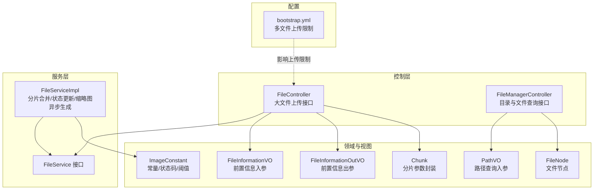
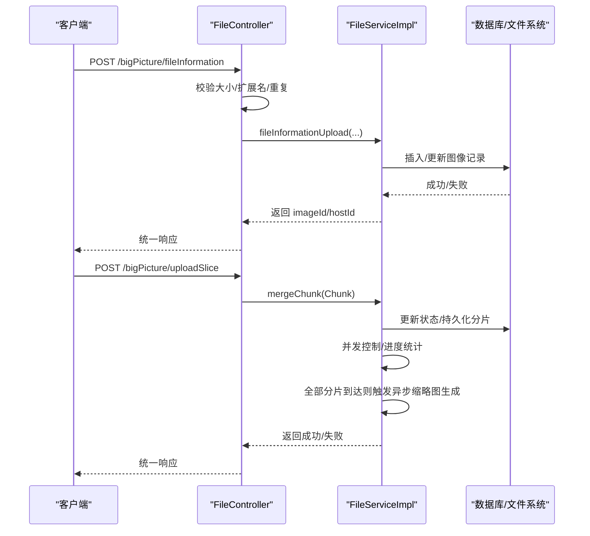
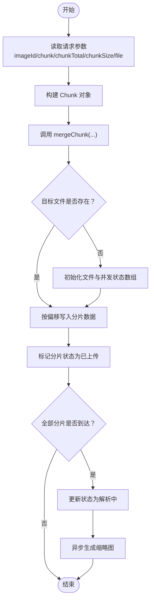
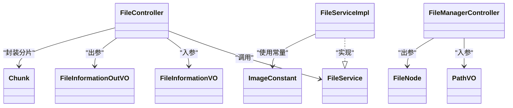

# 文件管理API

<cite>
**本文引用的文件**
- [FileController.java](file://src/main/java/cn/staitech/file/controller/FileController.java)
- [FileManagerController.java](file://src/main/java/cn/staitech/file/controller/FileManagerController.java)
- [FileService.java](file://src/main/java/cn/staitech/file/service/FileService.java)
- [FileServiceImpl.java](file://src/main/java/cn/staitech/file/service/impl/FileServiceImpl.java)
- [ImageConstant.java](file://src/main/java/cn/staitech/file/constant/ImageConstant.java)
- [Chunk.java](file://src/main/java/cn/staitech/file/vo/Chunk.java)
- [FileInformationVO.java](file://src/main/java/cn/staitech/file/vo/FileInformationVO.java)
- [FileInformationOutVO.java](file://src/main/java/cn/staitech/file/vo/FileInformationOutVO.java)
- [FileNode.java](file://src/main/java/cn/staitech/file/vo/FileNode.java)
- [PathVO.java](file://src/main/java/cn/staitech/file/vo/PathVO.java)
- [bootstrap.yml](file://src/main/resources/bootstrap.yml)
</cite>

## 目录
1. [简介](#简介)
2. [项目结构](#项目结构)
3. [核心组件](#核心组件)
4. [架构总览](#架构总览)
5. [详细组件分析](#详细组件分析)
6. [依赖分析](#依赖分析)
7. [性能考虑](#性能考虑)
8. [故障排查指南](#故障排查指南)
9. [结论](#结论)
10. [附录](#附录)

## 简介
本文件面向文件管理相关API，聚焦于大文件上传（分片/断点续传）、文件前置信息登记、服务器侧切片目录与文件查询等能力。文档覆盖以下接口：
- 文件前置信息登记（大小文件通用）
- 分片上传（断点续传）
- 服务器切片目录与文件查询
- 响应统一格式与错误处理机制
- 常见使用场景与最佳实践

## 项目结构
围绕文件管理的核心模块包括：
- 控制层：FileController（大文件上传）、FileManagerController（目录与文件查询）
- 服务层：FileService 接口与 FileServiceImpl 实现（分片合并、状态更新、缩略图异步生成）
- VO/常量：Chunk、FileInformationVO、FileInformationOutVO、FileNode、PathVO、ImageConstant
- 配置：bootstrap.yml（Spring Servlet 多文件上传限制）

图表来源
- [FileController.java:38-129](file://src/main/java/cn/staitech/file/controller/FileController.java#L38-L129)
- [FileManagerController.java:28-118](file://src/main/java/cn/staitech/file/controller/FileManagerController.java#L28-L118)
- [FileService.java:6-9](file://src/main/java/cn/staitech/file/service/FileService.java#L6-L9)
- [FileServiceImpl.java:31-177](file://src/main/java/cn/staitech/file/service/impl/FileServiceImpl.java#L31-L177)
- [Chunk.java:11-47](file://src/main/java/cn/staitech/file/vo/Chunk.java#L11-L47)
- [FileInformationVO.java:14-45](file://src/main/java/cn/staitech/file/vo/FileInformationVO.java#L14-L45)
- [FileInformationOutVO.java:7-14](file://src/main/java/cn/staitech/file/vo/FileInformationOutVO.java#L7-L14)
- [FileNode.java:12-19](file://src/main/java/cn/staitech/file/vo/FileNode.java#L12-L19)
- [PathVO.java:8-12](file://src/main/java/cn/staitech/file/vo/PathVO.java#L8-L12)
- [ImageConstant.java:9-66](file://src/main/java/cn/staitech/file/constant/ImageConstant.java#L9-L66)
- [bootstrap.yml:1-37](file://src/main/resources/bootstrap.yml#L1-L37)

章节来源
- [FileController.java:38-129](file://src/main/java/cn/staitech/file/controller/FileController.java#L38-L129)
- [FileManagerController.java:28-118](file://src/main/java/cn/staitech/file/controller/FileManagerController.java#L28-L118)
- [bootstrap.yml:1-37](file://src/main/resources/bootstrap.yml#L1-L37)

## 核心组件
- 控制层接口
  - FileController：提供“文件前置信息登记”和“分片上传”两个接口，均位于 /bigPicture 前缀下
  - FileManagerController：提供“获取切片根目录”和“列出目录下文件/文件夹”两个接口，位于 /filePath 前缀下
- 服务层
  - FileService：定义分片合并接口
  - FileServiceImpl：实现分片合并、并发状态控制、超时清理、状态流转与缩略图异步生成
- VO/常量
  - Chunk：封装分片参数（分片号、分片大小、总分片数、文件名、imageId、文件体）
  - FileInformationVO：文件前置信息入参（文件名、md5、分片数、大小、机构ID、项目分类ID、uuid、userId）
  - FileInformationOutVO：前置信息登记返回（imageId、hostId）
  - FileNode：文件/目录节点（name、path、type、size）
  - PathVO：目录查询入参（path、filter）
  - ImageConstant：状态码、阈值、默认存储目录等常量

章节来源
- [FileController.java:38-129](file://src/main/java/cn/staitech/file/controller/FileController.java#L38-L129)
- [FileManagerController.java:28-118](file://src/main/java/cn/staitech/file/controller/FileManagerController.java#L28-L118)
- [FileService.java:6-9](file://src/main/java/cn/staitech/file/service/FileService.java#L6-L9)
- [FileServiceImpl.java:31-177](file://src/main/java/cn/staitech/file/service/impl/FileServiceImpl.java#L31-L177)
- [Chunk.java:11-47](file://src/main/java/cn/staitech/file/vo/Chunk.java#L11-L47)
- [FileInformationVO.java:14-45](file://src/main/java/cn/staitech/file/vo/FileInformationVO.java#L14-L45)
- [FileInformationOutVO.java:7-14](file://src/main/java/cn/staitech/file/vo/FileInformationOutVO.java#L7-L14)
- [FileNode.java:12-19](file://src/main/java/cn/staitech/file/vo/FileNode.java#L12-L19)
- [PathVO.java:8-12](file://src/main/java/cn/staitech/file/vo/PathVO.java#L8-L12)
- [ImageConstant.java:9-66](file://src/main/java/cn/staitech/file/constant/ImageConstant.java#L9-L66)

## 架构总览
文件管理API采用典型的分层架构：
- 控制层接收请求，进行参数校验与业务编排
- 服务层负责分片合并、状态管理与异步任务调度
- VO/常量用于参数传递与规则约束
- 配置文件影响上传限制与运行环境

图表来源
- [FileController.java:58-127](file://src/main/java/cn/staitech/file/controller/FileController.java#L58-L127)
- [FileServiceImpl.java:53-146](file://src/main/java/cn/staitech/file/service/impl/FileServiceImpl.java#L53-L146)

## 详细组件分析

### 文件前置信息登记（大小文件通用）
- 功能概述
  - 接收文件前置信息，进行大小限制、扩展名白名单、重复性检查（可配置），随后登记到图像表并返回 imageId/hostId
- HTTP 方法与路径
  - POST /bigPicture/fileInformation
- 请求参数（JSON）
  - 字段：imageName（必填，1~100字符）、md5（必填）、chunkTotal（可选）、size（必填，字符串形式表示字节）、organizationId（必填，Long）、projectTypeId（可选）、uuid（可选）、userId（可选）
  - 参考路径：[FileInformationVO.java:14-45](file://src/main/java/cn/staitech/file/vo/FileInformationVO.java#L14-L45)
- 响应格式
  - 统一响应结构（成功/失败），成功时携带 imageId、hostId
  - 参考路径：[FileInformationOutVO.java:7-14](file://src/main/java/cn/staitech/file/vo/FileInformationOutVO.java#L7-L14)
- 错误处理
  - 超过最大允许大小（5GB）：返回“不允许上传5G以上的文件”
  - 扩展名不在允许列表：返回“上传的图像格式暂不支持”
  - 重复文件名（可配置开关）：返回“该文件已经存在，请重新上传”
  - 参考路径：[ImageConstant.java:13-18](file://src/main/java/cn/staitech/file/constant/ImageConstant.java#L13-L18)，[FileController.java:61-84](file://src/main/java/cn/staitech/file/controller/FileController.java#L61-L84)
- 使用场景
  - 大文件上传前预热：先登记前置信息，再进行分片上传
  - 小文件直传：同样可复用该接口登记元信息

章节来源
- [FileController.java:58-84](file://src/main/java/cn/staitech/file/controller/FileController.java#L58-L84)
- [FileInformationVO.java:14-45](file://src/main/java/cn/staitech/file/vo/FileInformationVO.java#L14-L45)
- [FileInformationOutVO.java:7-14](file://src/main/java/cn/staitech/file/vo/FileInformationOutVO.java#L7-L14)
- [ImageConstant.java:13-18](file://src/main/java/cn/staitech/file/constant/ImageConstant.java#L13-L18)

### 分片上传（断点续传）
- 功能概述
  - 接收单个分片，按 imageId 与分片号定位目标文件，写入对应偏移位置，维护并发状态数组，全部分片完成后触发异步缩略图生成
- HTTP 方法与路径
  - POST /bigPicture/uploadSlice
- 请求参数（表单）
  - 参数：imageId（Long，必填）、chunk（Integer，必填，从0开始）、chunkTotal（Integer，必填）、chunkSize（Long，必填，当前分片大小）、file（MultipartFile，必填）
  - 参考路径：[Chunk.java:11-47](file://src/main/java/cn/staitech/file/vo/Chunk.java#L11-L47)
- 响应格式
  - 统一响应结构（成功/失败）
  - 成功消息：参考常量“文件分片上传成功”
  - 失败消息：参考常量“文件分片上传失败”
  - 参考路径：[ImageConstant.java:17-18](file://src/main/java/cn/staitech/file/constant/ImageConstant.java#L17-L18)
- 断点续传机制
  - 通过 imageId 与分片号定位目标文件与写入偏移，支持重复上传同一分片而不破坏已有进度
  - 并发状态数组确保仅当全部分片到达后才进入最终处理阶段
  - 参考路径：[FileServiceImpl.java:53-146](file://src/main/java/cn/staitech/file/service/impl/FileServiceImpl.java#L53-L146)
- 使用场景
  - 网络不稳定或中断恢复：客户端可跳过已上传分片，仅重传缺失分片
  - 大文件传输：将大文件拆分为多个小分片，提升稳定性与可控性

图表来源
- [FileController.java:97-127](file://src/main/java/cn/staitech/file/controller/FileController.java#L97-L127)
- [FileServiceImpl.java:53-146](file://src/main/java/cn/staitech/file/service/impl/FileServiceImpl.java#L53-L146)

章节来源
- [FileController.java:97-127](file://src/main/java/cn/staitech/file/controller/FileController.java#L97-L127)
- [Chunk.java:11-47](file://src/main/java/cn/staitech/file/vo/Chunk.java#L11-L47)
- [ImageConstant.java:17-18](file://src/main/java/cn/staitech/file/constant/ImageConstant.java#L17-L18)
- [FileServiceImpl.java:53-146](file://src/main/java/cn/staitech/file/service/impl/FileServiceImpl.java#L53-L146)

### 服务器切片目录与文件查询
- 功能概述
  - 提供切片根目录查询与目录树遍历，支持过滤特定后缀文件
- HTTP 方法与路径
  - POST /filePath/getFilePath
  - POST /filePath/list
- 请求参数
  - getFilePath：无请求体，返回配置的文件根路径
    - 参考路径：[bootstrap.yml:30](file://src/main/resources/bootstrap.yml#L30)
  - list：JSON 请求体，包含 path（必填）、filter（可选，文件后缀过滤）
    - 参考路径：[PathVO.java:8-12](file://src/main/java/cn/staitech/file/vo/PathVO.java#L8-L12)
- 响应格式
  - 统一响应结构，成功时返回 FileNode 列表（name、path、type、size）
  - 参考路径：[FileNode.java:12-19](file://src/main/java/cn/staitech/file/vo/FileNode.java#L12-L19)
- 过滤与排序
  - 支持按 filter 后缀过滤文件
  - 默认按 type（dir/file）排序，优先显示目录，再显示文件
  - 参考路径：[FileManagerController.java:46-89](file://src/main/java/cn/staitech/file/controller/FileManagerController.java#L46-L89)
- 使用场景
  - 管理员或前端展示切片目录结构
  - 定位特定后缀的切片文件

章节来源
- [FileManagerController.java:33-89](file://src/main/java/cn/staitech/file/controller/FileManagerController.java#L33-L89)
- [PathVO.java:8-12](file://src/main/java/cn/staitech/file/vo/PathVO.java#L8-L12)
- [FileNode.java:12-19](file://src/main/java/cn/staitech/file/vo/FileNode.java#L12-L19)
- [bootstrap.yml:30](file://src/main/resources/bootstrap.yml#L30)

## 依赖分析
- 控制层依赖
  - FileController 依赖 FileService、ImageService、ImageUtils、ImageConstant、Chunk、FileInformationVO、FileInformationOutVO
  - FileManagerController 依赖 PathVO、FileNode、ImageConstant
- 服务层依赖
  - FileServiceImpl 依赖 ImageMapper、OpenSlideService、ImageUtils、ImageConstant、Chunk
- 配置依赖
  - bootstrap.yml 中的 multipart.max-file-size/max-request-size 影响上传限制

图表来源
- [FileController.java:38-129](file://src/main/java/cn/staitech/file/controller/FileController.java#L38-L129)
- [FileManagerController.java:28-118](file://src/main/java/cn/staitech/file/controller/FileManagerController.java#L28-L118)
- [FileService.java:6-9](file://src/main/java/cn/staitech/file/service/FileService.java#L6-L9)
- [FileServiceImpl.java:31-177](file://src/main/java/cn/staitech/file/service/impl/FileServiceImpl.java#L31-L177)
- [FileInformationVO.java:14-45](file://src/main/java/cn/staitech/file/vo/FileInformationVO.java#L14-L45)
- [FileInformationOutVO.java:7-14](file://src/main/java/cn/staitech/file/vo/FileInformationOutVO.java#L7-L14)
- [Chunk.java:11-47](file://src/main/java/cn/staitech/file/vo/Chunk.java#L11-L47)
- [FileNode.java:12-19](file://src/main/java/cn/staitech/file/vo/FileNode.java#L12-L19)
- [PathVO.java:8-12](file://src/main/java/cn/staitech/file/vo/PathVO.java#L8-L12)
- [ImageConstant.java:9-66](file://src/main/java/cn/staitech/file/constant/ImageConstant.java#L9-L66)

章节来源
- [FileController.java:38-129](file://src/main/java/cn/staitech/file/controller/FileController.java#L38-L129)
- [FileManagerController.java:28-118](file://src/main/java/cn/staitech/file/controller/FileManagerController.java#L28-L118)
- [FileService.java:6-9](file://src/main/java/cn/staitech/file/service/FileService.java#L6-L9)
- [FileServiceImpl.java:31-177](file://src/main/java/cn/staitech/file/service/impl/FileServiceImpl.java#L31-L177)
- [ImageConstant.java:9-66](file://src/main/java/cn/staitech/file/constant/ImageConstant.java#L9-L66)
- [bootstrap.yml:1-37](file://src/main/resources/bootstrap.yml#L1-L37)

## 性能考虑
- 分片大小与并发
  - 合理设置 chunkSize 与 chunkTotal，避免过大导致内存压力或过小导致网络开销增大
- I/O 写入策略
  - 使用随机访问文件按偏移写入，减少磁盘寻址成本
- 并发控制
  - 基于 imageId 的并发状态数组，避免重复写入与竞态条件
- 异步处理
  - 全部分片到达后异步生成缩略图，降低主流程阻塞
- 上传限制
  - 通过 bootstrap.yml 的 multipart.max-file-size/max-request-size 控制上传体积，避免资源耗尽

章节来源
- [FileServiceImpl.java:53-146](file://src/main/java/cn/staitech/file/service/impl/FileServiceImpl.java#L53-L146)
- [bootstrap.yml:7-10](file://src/main/resources/bootstrap.yml#L7-L10)

## 故障排查指南
- 常见错误与定位
  - “不允许上传5G以上的文件”：检查 size 字段与 ImageConstant.ALLOWED_FILE_MAXSIZE
    - 参考路径：[ImageConstant.java:52](file://src/main/java/cn/staitech/file/constant/ImageConstant.java#L52)
  - “上传的图像格式暂不支持”：确认文件扩展名是否在允许列表
    - 参考路径：[FileController.java:69-71](file://src/main/java/cn/staitech/file/controller/FileController.java#L69-L71)
  - “该文件已经存在，请重新上传”：重复文件名检查开启时触发
    - 参考路径：[FileController.java:75-77](file://src/main/java/cn/staitech/file/controller/FileController.java#L75-L77)
  - 分片写入异常：检查目标文件路径、权限与磁盘空间
    - 参考路径：[FileServiceImpl.java:117-120](file://src/main/java/cn/staitech/file/service/impl/FileServiceImpl.java#L117-L120)
- 超时与清理
  - 上传中超过2小时未更新状态将自动置为失败并清理文件与并发状态
    - 参考路径：[FileServiceImpl.java:152-176](file://src/main/java/cn/staitech/file/service/impl/FileServiceImpl.java#L152-L176)

章节来源
- [ImageConstant.java:13-18](file://src/main/java/cn/staitech/file/constant/ImageConstant.java#L13-L18)
- [FileController.java:61-84](file://src/main/java/cn/staitech/file/controller/FileController.java#L61-L84)
- [FileServiceImpl.java:117-120](file://src/main/java/cn/staitech/file/service/impl/FileServiceImpl.java#L117-L120)
- [FileServiceImpl.java:152-176](file://src/main/java/cn/staitech/file/service/impl/FileServiceImpl.java#L152-L176)

## 结论
本文档梳理了文件管理API的核心能力与实现要点，重点覆盖：
- 大文件上传的前置登记与分片上传流程
- 断点续传与并发控制机制
- 服务器侧切片目录与文件查询
- 统一响应格式与错误处理策略
建议在生产环境中结合配置项合理设置上传限制，并在客户端实现分片断点续传与重试逻辑，以获得更稳定的上传体验。

## 附录
- 统一响应结构
  - 成功：包含数据与消息
  - 失败：包含错误消息
  - 参考路径：各控制器返回 R<T> 统一结构（由 cn.staitech.common.core.domain.R 提供）
- 关键常量
  - 最大文件大小：5GB
  - 状态码：上传中/上传失败/解析中/解析失败/可用/信息解析中/信息解析失败/处理中/处理失败
  - 参考路径：[ImageConstant.java:20-31](file://src/main/java/cn/staitech/file/constant/ImageConstant.java#L20-L31)，[ImageConstant.java:52](file://src/main/java/cn/staitech/file/constant/ImageConstant.java#L52)