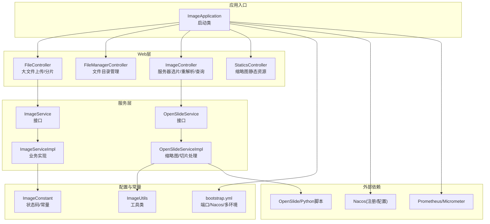
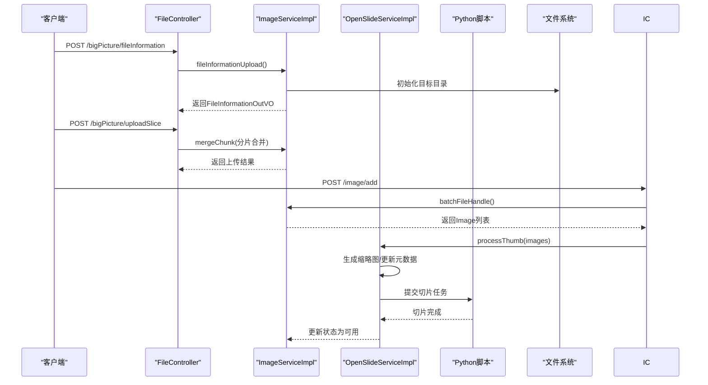
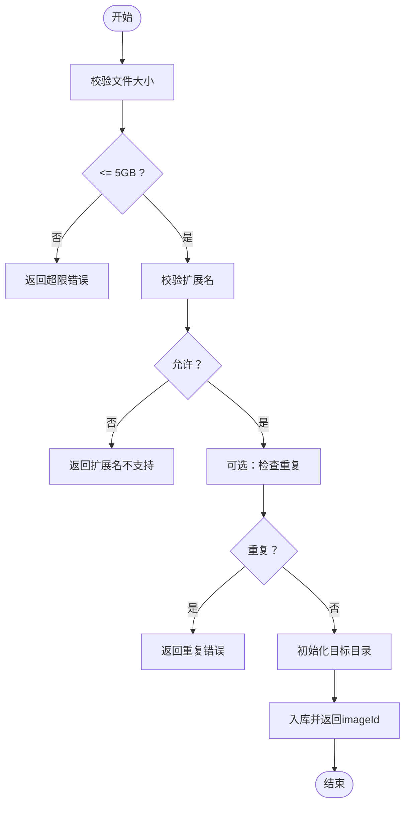
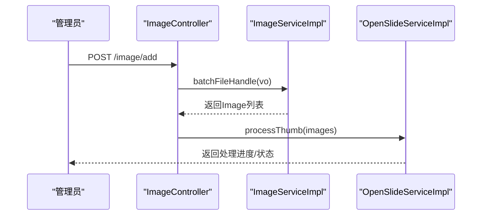
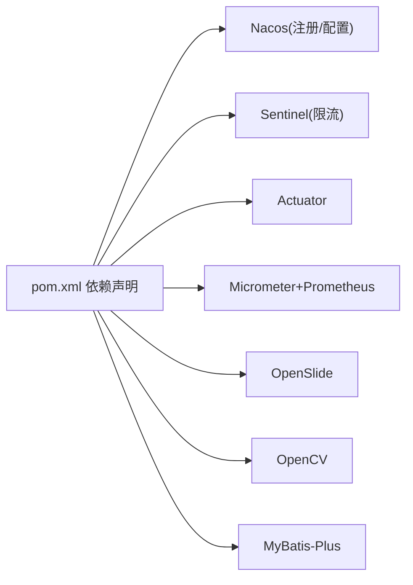

# 系统管理API

<cite>
**本文引用的文件**
- [ImageApplication.java](file://src/main/java/cn/staitech/ImageApplication.java)
- [FileController.java](file://src/main/java/cn/staitech/file/controller/FileController.java)
- [FileManagerController.java](file://src/main/java/cn/staitech/file/controller/FileManagerController.java)
- [ImageController.java](file://src/main/java/cn/staitech/file/controller/ImageController.java)
- [StaticsController.java](file://src/main/java/cn/staitech/file/controller/StaticsController.java)
- [ImageServiceImpl.java](file://src/main/java/cn/staitech/file/service/impl/ImageServiceImpl.java)
- [OpenSlideServiceImpl.java](file://src/main/java/cn/staitech/file/service/impl/OpenSlideServiceImpl.java)
- [ImageService.java](file://src/main/java/cn/staitech/file/service/ImageService.java)
- [ImageConstant.java](file://src/main/java/cn/staitech/file/constant/ImageConstant.java)
- [ImageUtils.java](file://src/main/java/cn/staitech/file/util/ImageUtils.java)
- [FileInformationVO.java](file://src/main/java/cn/staitech/file/vo/FileInformationVO.java)
- [FileInformationOutVO.java](file://src/main/java/cn/staitech/file/vo/FileInformationOutVO.java)
- [bootstrap.yml](file://src/main/resources/bootstrap.yml)
- [pom.xml](file://pom.xml)
</cite>

## 目录
1. [简介](#简介)
2. [项目结构](#项目结构)
3. [核心组件](#核心组件)
4. [架构总览](#架构总览)
5. [详细组件分析](#详细组件分析)
6. [依赖分析](#依赖分析)
7. [性能考虑](#性能考虑)
8. [故障排查指南](#故障排查指南)
9. [结论](#结论)
10. [附录](#附录)

## 简介
本文件面向系统管理员与集成开发者，系统性梳理“原始切片解析服务”的管理类API，覆盖以下能力：
- 系统状态查询与健康检查
- 系统运行状态监控与性能指标采集
- 切片上传与文件管理（目录浏览、缩略图访问）
- 切片解析与切片任务调度
- 配置参数管理（文件路径、Python脚本路径、线程池等）

文档以“接口规范 + 流程图 + 最佳实践”三位一体的方式呈现，帮助快速定位接口、理解调用条件、权限要求与返回格式。

## 项目结构
系统采用Spring Boot微服务架构，结合Nacos注册与配置中心、Sentinel限流、Actuator监控、Micrometer+Prometheus指标采集等能力，形成完整的管理与监控闭环。

图表来源
- [ImageApplication.java:37-52](file://src/main/java/cn/staitech/ImageApplication.java#L37-L52)
- [FileController.java:38-129](file://src/main/java/cn/staitech/file/controller/FileController.java#L38-L129)
- [FileManagerController.java:28-118](file://src/main/java/cn/staitech/file/controller/FileManagerController.java#L28-L118)
- [ImageController.java:27-71](file://src/main/java/cn/staitech/file/controller/ImageController.java#L27-L71)
- [StaticsController.java:24-45](file://src/main/java/cn/staitech/file/controller/StaticsController.java#L24-L45)
- [ImageServiceImpl.java:42-547](file://src/main/java/cn/staitech/file/service/impl/ImageServiceImpl.java#L42-L547)
- [OpenSlideServiceImpl.java:47-562](file://src/main/java/cn/staitech/file/service/impl/OpenSlideServiceImpl.java#L47-L562)
- [bootstrap.yml:1-37](file://src/main/resources/bootstrap.yml#L1-L37)
- [ImageConstant.java:9-67](file://src/main/java/cn/staitech/file/constant/ImageConstant.java#L9-L67)
- [ImageUtils.java:20-148](file://src/main/java/cn/staitech/file/util/ImageUtils.java#L20-L148)

章节来源
- [ImageApplication.java:37-52](file://src/main/java/cn/staitech/ImageApplication.java#L37-L52)
- [bootstrap.yml:1-37](file://src/main/resources/bootstrap.yml#L1-L37)

## 核心组件
- Web控制器：提供上传、文件管理、服务器选片、缩略图访问等HTTP接口。
- 服务实现：封装业务逻辑，包括文件信息入库、切片解析、缩略图生成、切片任务提交、失败文件归档等。
- 配置与常量：统一管理状态码、文件路径、最大文件大小、允许扩展名等。
- 工具类：提供文件路径生成、OpenSlide验证与转换、目录检查等辅助能力。
- 监控与指标：通过Actuator暴露端点，Micrometer注册Prometheus指标。

章节来源
- [ImageServiceImpl.java:42-547](file://src/main/java/cn/staitech/file/service/impl/ImageServiceImpl.java#L42-L547)
- [OpenSlideServiceImpl.java:47-562](file://src/main/java/cn/staitech/file/service/impl/OpenSlideServiceImpl.java#L47-L562)
- [ImageConstant.java:9-67](file://src/main/java/cn/staitech/file/constant/ImageConstant.java#L9-L67)
- [ImageUtils.java:20-148](file://src/main/java/cn/staitech/file/util/ImageUtils.java#L20-L148)

## 架构总览
系统管理API围绕“上传-解析-切片-监控”主线展开，下图展示典型调用链路与职责边界：

图表来源
- [FileController.java:58-127](file://src/main/java/cn/staitech/file/controller/FileController.java#L58-L127)
- [ImageController.java:42-48](file://src/main/java/cn/staitech/file/controller/ImageController.java#L42-L48)
- [ImageServiceImpl.java:173-232](file://src/main/java/cn/staitech/file/service/impl/ImageServiceImpl.java#L173-L232)
- [OpenSlideServiceImpl.java:277-339](file://src/main/java/cn/staitech/file/service/impl/OpenSlideServiceImpl.java#L277-L339)

## 详细组件分析

### 1) 系统状态与健康检查
- 端点：/actuator/health
- 功能：返回应用健康状态（包含磁盘空间、数据库连接、缓存等）
- 访问方式：通过Actuator暴露，建议仅内网访问或配合安全网关
- 返回示例：包含status、details等字段，具体以Actuator默认格式为准

章节来源
- [ImageApplication.java:47-50](file://src/main/java/cn/staitech/ImageApplication.java#L47-L50)
- [pom.xml:47-51](file://pom.xml#L47-L51)

### 2) 性能指标与监控
- 端点：/actuator/prometheus
- 功能：导出Micrometer指标，供Prometheus抓取
- 指标类别：JVM内存、GC、HTTP请求耗时、线程池活跃度、自定义标签（application=staitech-image）
- 最佳实践：
  - 在Prometheus中配置job，抓取/actuator/prometheus
  - 结合Grafana构建仪表盘，关注CPU/IO瓶颈与任务堆积

章节来源
- [ImageApplication.java:47-50](file://src/main/java/cn/staitech/ImageApplication.java#L47-L50)
- [pom.xml:192-194](file://pom.xml#L192-L194)

### 3) 切片上传与分片合并
- 接口一：POST /bigPicture/fileInformation
  - 功能：上传文件前置信息（文件名、MD5、大小、机构ID等），校验扩展名与大小，初始化入库
  - 请求体：FileInformationVO
  - 返回：FileInformationOutVO（含imageId等）
  - 条件：文件大小不超过5GB；扩展名在允许列表；可选重复校验开关
  - 错误：超限、扩展名不支持、重复文件、目录创建失败、入库失败
- 接口二：POST /bigPicture/uploadSlice
  - 功能：上传单个分片，服务端进行合并
  - 参数：imageId、chunk、chunkTotal、chunkSize、file
  - 返回：标准响应包装（成功/失败）
  - 条件：分片参数合法；文件存在且可读

图表来源
- [FileController.java:58-85](file://src/main/java/cn/staitech/file/controller/FileController.java#L58-L85)
- [ImageServiceImpl.java:173-232](file://src/main/java/cn/staitech/file/service/impl/ImageServiceImpl.java#L173-L232)
- [ImageConstant.java:52](file://src/main/java/cn/staitech/file/constant/ImageConstant.java#L52)
- [ImageUtils.java:105-114](file://src/main/java/cn/staitech/file/util/ImageUtils.java#L105-L114)

章节来源
- [FileController.java:58-127](file://src/main/java/cn/staitech/file/controller/FileController.java#L58-L127)
- [FileInformationVO.java:14-45](file://src/main/java/cn/staitech/file/vo/FileInformationVO.java#L14-L45)
- [FileInformationOutVO.java:6-14](file://src/main/java/cn/staitech/file/vo/FileInformationOutVO.java#L6-L14)
- [ImageServiceImpl.java:173-232](file://src/main/java/cn/staitech/file/service/impl/ImageServiceImpl.java#L173-L232)
- [ImageConstant.java:13-18](file://src/main/java/cn/staitech/file/constant/ImageConstant.java#L13-L18)

### 4) 服务器选片与重解析
- 接口：POST /image/add
  - 功能：批量服务器选片，解析文件名字段，生成缩略图与元数据，提交切片任务
  - 请求体：FileInsertVO（文件绝对路径数组、组织ID等）
  - 返回：标准响应
  - 条件：文件路径存在且可读；去重处理；解析失败标记
- 接口：POST /image/reparse
  - 功能：针对指定imageId列表，重解析失败数据
  - 请求体：imageIds[]
  - 返回：标准响应
- 接口：GET /image/checkFailImage
  - 功能：检查当前机构是否存在解析失败的切片
  - 返回：布尔值
- 接口：GET /image/getImage/{id}
  - 功能：按ID查询原始切片信息
  - 返回：Image实体

图表来源
- [ImageController.java:42-69](file://src/main/java/cn/staitech/file/controller/ImageController.java#L42-L69)
- [ImageServiceImpl.java:63-140](file://src/main/java/cn/staitech/file/service/impl/ImageServiceImpl.java#L63-L140)
- [OpenSlideServiceImpl.java:277-312](file://src/main/java/cn/staitech/file/service/impl/OpenSlideServiceImpl.java#L277-L312)

章节来源
- [ImageController.java:42-69](file://src/main/java/cn/staitech/file/controller/ImageController.java#L42-L69)
- [ImageServiceImpl.java:63-140](file://src/main/java/cn/staitech/file/service/impl/ImageServiceImpl.java#L63-L140)
- [OpenSlideServiceImpl.java:277-339](file://src/main/java/cn/staitech/file/service/impl/OpenSlideServiceImpl.java#L277-L339)

### 5) 文件管理与目录浏览
- 接口：POST /filePath/getFilePath
  - 功能：获取原始切片根目录
  - 返回：标准响应（data为路径字符串）
- 接口：POST /filePath/list
  - 功能：列出指定路径下的目录与文件，支持过滤后缀
  - 请求体：PathVO（path、filter）
  - 返回：FileNode列表（name、type、absolutePath、size）
  - 条件：路径必须位于基础目录之下；仅返回非缓存目录；文件名可按filter过滤

章节来源
- [FileManagerController.java:33-89](file://src/main/java/cn/staitech/file/controller/FileManagerController.java#L33-L89)

### 6) 缩略图访问
- 接口：GET /statics/thumbnail/**
  - 功能：静态访问缩略图（支持JPEG/PNG）
  - 规则：将/statics前缀替换为配置的基础路径，读取对应文件
  - 返回：字节数组（图片内容）
  - 异常：文件不存在时记录错误日志

章节来源
- [StaticsController.java:31-44](file://src/main/java/cn/staitech/file/controller/StaticsController.java#L31-L44)

### 7) 配置参数管理
- 关键配置项（来自bootstrap.yml与应用内部配置）
  - server.port：服务端口
  - spring.servlet.multipart.max-file-size/max-request-size：上传限制
  - spring.cloud.nacos.discovery/config：注册与配置中心地址、命名空间、分组
  - 自定义配置：file.path（文件根目录）、pythonScriptPath（Python脚本路径）、pythonExecutable（Python可执行命令）
- 状态码与常量：集中于ImageConstant，涵盖上传/解析/切片处理各阶段状态

章节来源
- [bootstrap.yml:1-37](file://src/main/resources/bootstrap.yml#L1-L37)
- [ImageConstant.java:20-31](file://src/main/java/cn/staitech/file/constant/ImageConstant.java#L20-L31)

## 依赖分析
- Spring Cloud Alibaba生态：Nacos（注册/配置）、Sentinel（限流）
- 监控体系：Actuator + Micrometer + Prometheus
- 图像处理：OpenSlide + Python脚本（tile.py）
- 数据持久化：MyBatis-Plus
- 工具库：Hutool、Lombok、Apache Commons IO/Collection等

图表来源
- [pom.xml:23-200](file://pom.xml#L23-L200)

章节来源
- [pom.xml:23-200](file://pom.xml#L23-L200)

## 性能考虑
- 并发与异步
  - 缩略图与切片处理采用线程池异步执行，避免阻塞请求线程
  - 切片任务通过Python脚本异步执行，完成后更新状态
- I/O优化
  - 缩略图生成尺寸分级（256/1024），减少带宽与存储压力
  - 目录提前创建，避免运行时I/O抖动
- 资源限制
  - 上传文件大小上限与扩展名校验，防止异常流量
  - 分片上传降低单次请求体积，提升稳定性
- 监控告警
  - 通过Prometheus抓取指标，结合Grafana可视化
  - 关注任务队列长度、失败率、磁盘空间、Python脚本执行耗时

## 故障排查指南
- 常见问题与定位
  - 缩略图为空或解析失败：检查OpenSlide是否能打开文件，必要时触发重解析
  - 切片任务失败：查看Python脚本执行日志，确认tile.py路径与可执行权限
  - 文件移动失败：确认Failed目录可写，检查磁盘空间
  - 上传失败：核对文件大小、扩展名、重复校验开关
- 日志审计
  - OpenSlideServiceImpl会向日志审计服务上报操作记录，便于追踪
- 健康检查
  - 通过/actuator/health确认服务健康状态

章节来源
- [OpenSlideServiceImpl.java:399-454](file://src/main/java/cn/staitech/file/service/impl/OpenSlideServiceImpl.java#L399-L454)
- [OpenSlideServiceImpl.java:487-535](file://src/main/java/cn/staitech/file/service/impl/OpenSlideServiceImpl.java#L487-L535)
- [FileController.java:80-84](file://src/main/java/cn/staitech/file/controller/FileController.java#L80-L84)

## 结论
本系统管理API围绕“上传-解析-切片-监控”闭环设计，具备完善的错误处理、日志审计与性能监控能力。建议在生产环境中：
- 严格控制上传参数与目录范围
- 配置Prometheus/Grafana进行持续监控
- 为Python脚本与OpenSlide环境准备充足的磁盘与计算资源
- 通过Nacos统一管理配置，按环境隔离

## 附录

### A. 接口清单与规范

- GET /actuator/health
  - 功能：健康检查
  - 返回：JSON（包含status与details）
  - 权限：建议内网访问
- GET /actuator/prometheus
  - 功能：导出Prometheus指标
  - 返回：文本（Prometheus格式）
  - 权限：建议内网访问
- POST /bigPicture/fileInformation
  - 请求体：FileInformationVO
  - 返回：R<FileInformationOutVO>
  - 条件：文件大小≤5GB；扩展名允许；可选重复校验
- POST /bigPicture/uploadSlice
  - 参数：imageId、chunk、chunkTotal、chunkSize、file
  - 返回：R<String>
  - 条件：分片参数合法
- POST /image/add
  - 请求体：FileInsertVO
  - 返回：R
  - 条件：文件路径存在且可读；去重处理
- POST /image/reparse
  - 请求体：imageIds[]
  - 返回：R
- GET /image/checkFailImage
  - 返回：R<Boolean>
- GET /image/getImage/{id}
  - 返回：R<Image>
- POST /filePath/getFilePath
  - 返回：R<String>
- POST /filePath/list
  - 请求体：PathVO
  - 返回：R<List<FileNode>>
- GET /statics/thumbnail/**
  - 返回：图片字节流（JPEG/PNG）

章节来源
- [FileController.java:58-127](file://src/main/java/cn/staitech/file/controller/FileController.java#L58-L127)
- [ImageController.java:42-69](file://src/main/java/cn/staitech/file/controller/ImageController.java#L42-L69)
- [FileManagerController.java:33-89](file://src/main/java/cn/staitech/file/controller/FileManagerController.java#L33-L89)
- [StaticsController.java:31-44](file://src/main/java/cn/staitech/file/controller/StaticsController.java#L31-L44)

### B. 配置项参考
- server.port：服务端口
- spring.servlet.multipart.max-file-size/max-request-size：上传大小限制
- spring.cloud.nacos.discovery.server-addr：注册中心地址
- spring.cloud.nacos.config.server-addr：配置中心地址
- 自定义：file.path、pythonScriptPath、pythonExecutable

章节来源
- [bootstrap.yml:1-37](file://src/main/resources/bootstrap.yml#L1-L37)