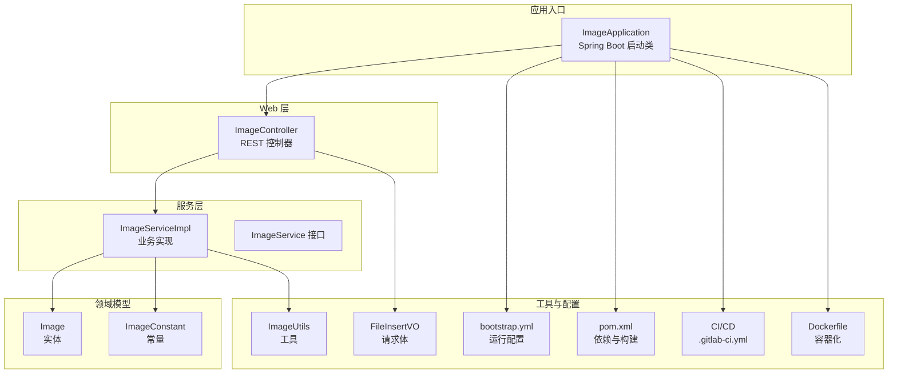
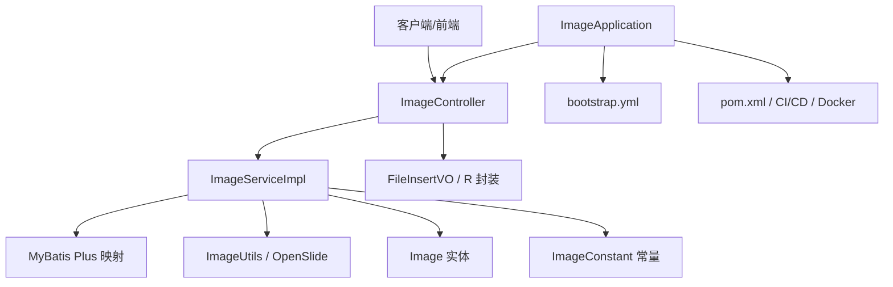
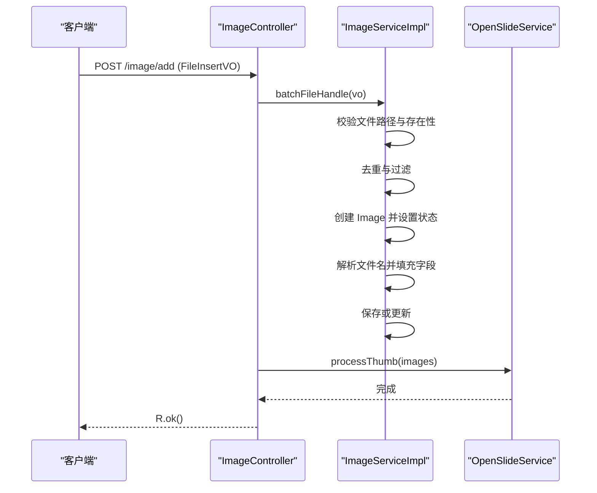
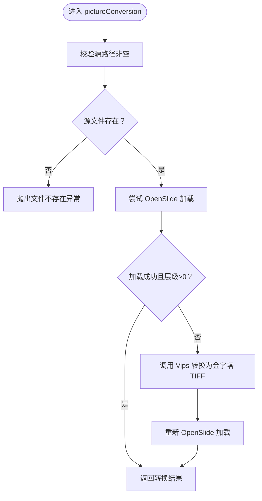
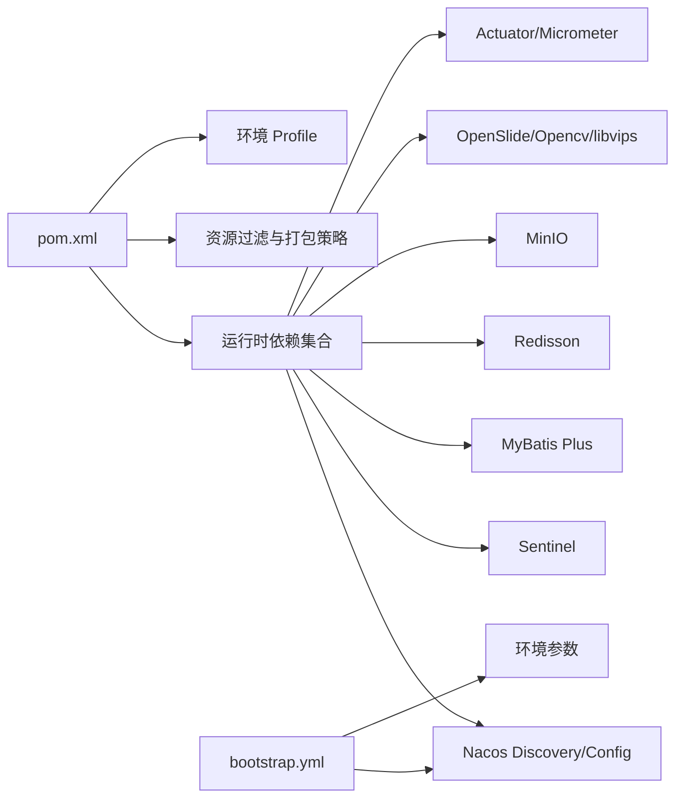

# 代码规范

<cite>
**本文引用的文件**
- [ImageApplication.java](file://src/main/java/cn/staitech/ImageApplication.java)
- [ImageController.java](file://src/main/java/cn/staitech/file/controller/ImageController.java)
- [ImageServiceImpl.java](file://src/main/java/cn/staitech/file/service/impl/ImageServiceImpl.java)
- [Image.java](file://src/main/java/cn/staitech/file/domain/Image.java)
- [ImageConstant.java](file://src/main/java/cn/staitech/file/constant/ImageConstant.java)
- [ImageUtils.java](file://src/main/java/cn/staitech/file/util/ImageUtils.java)
- [FileInsertVO.java](file://src/main/java/cn/staitech/file/vo/FileInsertVO.java)
- [ImageService.java](file://src/main/java/cn/staitech/file/service/ImageService.java)
- [bootstrap.yml](file://src/main/resources/bootstrap.yml)
- [pom.xml](file://pom.xml)
- [.gitlab-ci.yml](file://.gitlab-ci.yml)
- [Dockerfile](file://docker/staitech/modules/image/Dockerfile)
- [README.md](file://README.md)
- [CONTRIBUTING.md](file://CONTRIBUTING.md)
</cite>

## 目录
1. 引言
2. 项目结构
3. 核心组件
4. 架构总览
5. 详细组件分析
6. 依赖分析
7. 性能考虑
8. 故障排查指南
9. 结论
10. 附录

## 引言
本指南面向 PACMVS 项目的 Java 后端团队，旨在统一编码风格、注释规范、提交与评审流程以及架构约束，提升代码一致性、可维护性与协作效率。文档以现有代码库为依据，提炼出可落地的规范与最佳实践。

## 项目结构
项目采用 Spring Boot 多模块结构，核心模块为“原始切片解析服务”，包含控制器、服务、持久层、工具与 VO/Domain 层，配合 Nacos 配置与发现、Actuator、Prometheus 监控、MyBatis Plus、Redisson、MinIO/FastDFS 等基础设施。

图表来源
- [ImageApplication.java:37-52](file://src/main/java/cn/staitech/ImageApplication.java#L37-L52)
- [ImageController.java:30-71](file://src/main/java/cn/staitech/file/controller/ImageController.java#L30-L71)
- [ImageServiceImpl.java:42-42](file://src/main/java/cn/staitech/file/service/impl/ImageServiceImpl.java#L42-L42)
- [Image.java:27-216](file://src/main/java/cn/staitech/file/domain/Image.java#L27-L216)
- [ImageConstant.java:9-66](file://src/main/java/cn/staitech/file/constant/ImageConstant.java#L9-L66)
- [ImageUtils.java:20-148](file://src/main/java/cn/staitech/file/util/ImageUtils.java#L20-L148)
- [FileInsertVO.java:14-25](file://src/main/java/cn/staitech/file/vo/FileInsertVO.java#L14-L25)
- [bootstrap.yml:1-37](file://src/main/resources/bootstrap.yml#L1-L37)
- [pom.xml:1-385](file://pom.xml#L1-L385)
- [.gitlab-ci.yml:16-49](file://.gitlab-ci.yml#L16-L49)
- [Dockerfile:1-46](file://docker/staitech/modules/image/Dockerfile#L1-L46)

章节来源
- [README.md:1-11](file://README.md#L1-L11)
- [pom.xml:1-385](file://pom.xml#L1-L385)
- [bootstrap.yml:1-37](file://src/main/resources/bootstrap.yml#L1-L37)

## 核心组件
- 应用入口与装配：启动类启用调度、WebSocket、自定义配置、Swagger、Feign、事务管理、Elasticsearch 仓库、服务注册与发现等，统一设置 JVM 时区。
- 控制器：提供“服务器选片”“重解析失败数据”“检查失败切片”“查询原始切片”等接口，使用 Swagger 注解标注接口含义与版本标签。
- 服务实现：批量处理文件插入、文件信息上传、文件名解析、路径初始化、通用字段处理、OpenSlide/转换逻辑等。
- 领域模型：Image 实体映射 tb_image，包含切片元数据、状态、来源、组织与专题等字段。
- 常量与工具：集中定义状态码、来源、解析状态、允许扩展名、最大尺寸、路径前缀等；提供文件名提取、目录检查、OpenSlide 验证与转换等工具方法。
- 配置与构建：bootstrap.yml 管理端口、Nacos 发现与配置、共享配置；pom.xml 管理依赖、资源过滤与打包策略；CI/CD 三阶段流水线；Dockerfile 容器化。

章节来源
- [ImageApplication.java:27-52](file://src/main/java/cn/staitech/ImageApplication.java#L27-L52)
- [ImageController.java:30-71](file://src/main/java/cn/staitech/file/controller/ImageController.java#L30-L71)
- [ImageServiceImpl.java:63-140](file://src/main/java/cn/staitech/file/service/impl/ImageServiceImpl.java#L63-L140)
- [Image.java:27-216](file://src/main/java/cn/staitech/file/domain/Image.java#L27-L216)
- [ImageConstant.java:9-66](file://src/main/java/cn/staitech/file/constant/ImageConstant.java#L9-L66)
- [ImageUtils.java:20-148](file://src/main/java/cn/staitech/file/util/ImageUtils.java#L20-L148)
- [bootstrap.yml:1-37](file://src/main/resources/bootstrap.yml#L1-L37)
- [pom.xml:229-346](file://pom.xml#L229-L346)
- [.gitlab-ci.yml:16-49](file://.gitlab-ci.yml#L16-L49)
- [Dockerfile:1-46](file://docker/staitech/modules/image/Dockerfile#L1-L46)

## 架构总览
系统采用分层架构：Web 层（Controller）负责请求接入与响应封装；Service 层承载业务逻辑；DAO 层由 MyBatis Plus 提供；工具层提供通用能力；配置层通过 Nacos 与 bootstrap.yml 管理环境与参数；CI/CD 保障构建与部署；容器化便于跨环境一致运行。

图表来源
- [ImageController.java:30-71](file://src/main/java/cn/staitech/file/controller/ImageController.java#L30-L71)
- [ImageServiceImpl.java:42-42](file://src/main/java/cn/staitech/file/service/impl/ImageServiceImpl.java#L42-L42)
- [Image.java:27-216](file://src/main/java/cn/staitech/file/domain/Image.java#L27-L216)
- [ImageConstant.java:9-66](file://src/main/java/cn/staitech/file/constant/ImageConstant.java#L9-L66)
- [ImageUtils.java:20-148](file://src/main/java/cn/staitech/file/util/ImageUtils.java#L20-L148)
- [FileInsertVO.java:14-25](file://src/main/java/cn/staitech/file/vo/FileInsertVO.java#L14-L25)
- [ImageApplication.java:27-52](file://src/main/java/cn/staitech/ImageApplication.java#L27-L52)
- [bootstrap.yml:1-37](file://src/main/resources/bootstrap.yml#L1-L37)
- [pom.xml:229-346](file://pom.xml#L229-L346)
- [.gitlab-ci.yml:16-49](file://.gitlab-ci.yml#L16-L49)
- [Dockerfile:1-46](file://docker/staitech/modules/image/Dockerfile#L1-L46)

## 详细组件分析

### Java 编码标准与命名约定
- 类名：使用 PascalCase（如 ImageApplication、ImageController、ImageServiceImpl、Image、ImageConstant、ImageUtils）。
- 方法名：使用 camelCase（如 batchFileHandle、fileInformationUpload、processImageCommon、pictureConversion、isAllowedExtension）。
- 常量：使用 UPPER_SNAKE_CASE（如 IMAGE_STATUS_PARSING、SLIDE_STORAGE_RETRY、DEFAULT_ALLOWED_EXTENSION）。
- 包名：全小写，按模块分层（如 cn.staitech.file.controller）。
- 字段与局部变量：使用 camelCase（如 organizationId、imageId、localFilePath）。
- 接口与抽象类：遵循类名规范；枚举使用 UPPER_SNAKE_CASE。
- 注解与注释：使用 Javadoc 标准格式，包含作者、版本、描述、日期等；Swagger 注解用于接口说明。

章节来源
- [ImageApplication.java:37-52](file://src/main/java/cn/staitech/ImageApplication.java#L37-L52)
- [ImageController.java:30-71](file://src/main/java/cn/staitech/file/controller/ImageController.java#L30-L71)
- [ImageServiceImpl.java:42-42](file://src/main/java/cn/staitech/file/service/impl/ImageServiceImpl.java#L42-L42)
- [Image.java:27-216](file://src/main/java/cn/staitech/file/domain/Image.java#L27-L216)
- [ImageConstant.java:9-66](file://src/main/java/cn/staitech/file/constant/ImageConstant.java#L9-L66)
- [ImageUtils.java:20-148](file://src/main/java/cn/staitech/file/util/ImageUtils.java#L20-L148)
- [FileInsertVO.java:14-25](file://src/main/java/cn/staitech/file/vo/FileInsertVO.java#L14-L25)

### 缩进与格式化规则
- 统一使用 4 空格缩进，不使用 Tab。
- 方法体、控制块、Lambda 表达式保持一致缩进层级。
- 一行只声明一个变量，避免链式声明。
- 方法参数与返回类型与方法名在同一行，若过长则分行对齐。
- 逻辑分组使用空行分隔，增强可读性。
- 注释与代码之间留空行，区分逻辑段落。

章节来源
- [ImageServiceImpl.java:63-140](file://src/main/java/cn/staitech/file/service/impl/ImageServiceImpl.java#L63-L140)
- [ImageController.java:36-71](file://src/main/java/cn/staitech/file/controller/ImageController.java#L36-L71)

### 注释规范
- 类注释：包含作者、版本、简要描述、创建日期，位于类上方 Javadoc 注释块。
- 方法注释：包含方法目的、参数说明、返回值说明、异常说明（如有），位于方法上方 Javadoc 注释块。
- 参数注释：使用 @param 标注每个参数含义与约束。
- 返回值注释：使用 @return 标注返回值语义。
- 特殊注释：使用 @ApiOperation、@Api 等 Swagger 注解标注接口用途与版本标签。
- 行内注释：仅在必要处使用，解释复杂逻辑或边界条件。

章节来源
- [ImageController.java:20-25](file://src/main/java/cn/staitech/file/controller/ImageController.java#L20-L25)
- [ImageServiceImpl.java:53-62](file://src/main/java/cn/staitech/file/service/impl/ImageServiceImpl.java#L53-L62)
- [ImageServiceImpl.java:142-151](file://src/main/java/cn/staitech/file/service/impl/ImageServiceImpl.java#L142-L151)
- [ImageServiceImpl.java:165-172](file://src/main/java/cn/staitech/file/service/impl/ImageServiceImpl.java#L165-L172)
- [ImageUtils.java:22-25](file://src/main/java/cn/staitech/file/util/ImageUtils.java#L22-L25)

### Git 提交消息规范
- 提交类型（type）
  - feat：新增功能
  - fix：修复缺陷
  - docs：文档更新
  - style：格式调整（不影响逻辑）
  - refactor：重构（既不修复缺陷也不新增功能）
  - perf：性能优化
  - test：测试相关
  - chore：构建过程或辅助工具变动
- 主题行（subject）
  - 限制在 50 字符以内
  - 首字母小写，不以句号结尾
  - 使用祈使语气，描述做了什么
- 描述（body）
  - 说明动机与对比行为
  - 可包含相关 Issue/PR 链接
- 说明（footer）
  - 关联问题编号（如 Closes #123）
  - Breaking Change 说明

章节来源
- [.gitlab-ci.yml:16-49](file://.gitlab-ci.yml#L16-L49)

### 代码审查标准与 Pull Request 流程
- PR 要求
  - 必须关联 Issue 或需求背景
  - 通过本地单元测试与静态检查
  - 新增功能需配套单元测试
  - 修改涉及公共常量或工具需评估影响范围
- 审查要点
  - 命名一致性与可读性
  - 异常处理与日志记录
  - 并发安全与事务边界
  - 性能与资源占用
  - 配置与环境变量的安全性
- CI/CD
  - 构建阶段：编译与打包
  - 测试阶段：单元测试与扫描
  - 部署阶段：生产环境发布

章节来源
- [.gitlab-ci.yml:16-49](file://.gitlab-ci.yml#L16-L49)
- [CONTRIBUTING.md:1-41](file://CONTRIBUTING.md#L1-L41)

### 项目特定架构约束与设计模式
- 分层架构
  - Web 层：Controller 负责请求接入与响应封装（R 封装）
  - 服务层：Service 承载业务逻辑，事务边界清晰
  - 持久层：MyBatis Plus 简化 CRUD 与条件构造
- 设计模式
  - 工厂/工具类：ImageUtils 提供文件名提取、路径生成、OpenSlide 验证与转换
  - 值对象：FileInsertVO 封装请求参数，保证入参校验
  - 常量集中：ImageConstant 统一状态码与来源定义
- 架构约束
  - 严格使用 Swagger 注解标注接口用途与版本
  - 统一使用 R 封装响应结构
  - 事务注解仅作用于业务方法，避免横切污染
  - 依赖注入使用 @Resource/@Autowired，避免硬编码

章节来源
- [ImageController.java:30-71](file://src/main/java/cn/staitech/file/controller/ImageController.java#L30-L71)
- [ImageServiceImpl.java:42-42](file://src/main/java/cn/staitech/file/service/impl/ImageServiceImpl.java#L42-L42)
- [Image.java:27-216](file://src/main/java/cn/staitech/file/domain/Image.java#L27-L216)
- [ImageConstant.java:9-66](file://src/main/java/cn/staitech/file/constant/ImageConstant.java#L9-L66)
- [ImageUtils.java:20-148](file://src/main/java/cn/staitech/file/util/ImageUtils.java#L20-L148)
- [FileInsertVO.java:14-25](file://src/main/java/cn/staitech/file/vo/FileInsertVO.java#L14-L25)

### 关键流程示例（序列图）

#### 服务器选片流程

图表来源
- [ImageController.java:42-48](file://src/main/java/cn/staitech/file/controller/ImageController.java#L42-L48)
- [ImageServiceImpl.java:63-140](file://src/main/java/cn/staitech/file/service/impl/ImageServiceImpl.java#L63-L140)

#### OpenSlide 验证与转换流程

图表来源
- [ImageUtils.java:52-97](file://src/main/java/cn/staitech/file/util/ImageUtils.java#L52-L97)

## 依赖分析
- 运行时依赖
  - Spring Cloud Alibaba（Nacos、Sentinel）
  - MyBatis Plus 与 Join Starter
  - Redisson、MinIO、FastDFS
  - OpenSlide、OpenCV、libvips
  - Swagger UI、Actuator、Micrometer-Prometheus
- 构建与打包
  - Maven 资源过滤与二进制文件保留
  - Spring Boot Maven Plugin 重打包
  - 本地 lib 目录打包至 BOOT-INF/lib
- 配置与环境
  - bootstrap.yml 管理端口、Nacos 地址、共享配置
  - pom.xml profiles 定义多环境参数

图表来源
- [pom.xml:23-205](file://pom.xml#L23-L205)
- [pom.xml:229-346](file://pom.xml#L229-L346)
- [bootstrap.yml:1-37](file://src/main/resources/bootstrap.yml#L1-L37)

章节来源
- [pom.xml:23-205](file://pom.xml#L23-L205)
- [pom.xml:229-346](file://pom.xml#L229-L346)
- [bootstrap.yml:1-37](file://src/main/resources/bootstrap.yml#L1-L37)

## 性能考虑
- IO 与并发
  - 批量处理时注意内存占用与流式处理，避免一次性加载大文件
  - OpenSlide/转换操作建议异步化与限流，结合 Sentinel 保护
- 数据库
  - 使用 MyBatis Plus 条件构造器与批量插入，减少往返
  - 对高频查询建立必要索引（如组织ID、状态、文件名）
- 缓存与存储
  - Redisson 用于分布式锁与缓存，注意键空间与过期策略
  - MinIO/FastDFS 存储大文件，关注网络带宽与分片策略
- 监控与可观测性
  - Actuator + Prometheus 指标采集，结合告警策略

## 故障排查指南
- 启动与配置
  - 确认 bootstrap.yml 中 Nacos 地址、命名空间、分组正确
  - 检查 pom.xml 中共享配置是否生效
- 依赖与打包
  - 确认本地 lib 目录 jar 已复制至 BOOT-INF/lib
  - 检查资源过滤是否排除了二进制文件
- OpenSlide/转换
  - 若 OpenSlide 加载失败，检查容器内 Python 依赖与 JNI 库路径
  - 转换后重新加载，确认层级大于 0
- 日志与审计
  - 使用统一日志输出与审计日志模块，定位异常堆栈与上下文

章节来源
- [bootstrap.yml:1-37](file://src/main/resources/bootstrap.yml#L1-L37)
- [pom.xml:229-346](file://pom.xml#L229-L346)
- [Dockerfile:1-46](file://docker/staitech/modules/image/Dockerfile#L1-L46)
- [ImageUtils.java:64-97](file://src/main/java/cn/staitech/file/util/ImageUtils.java#L64-L97)

## 结论
本规范以现有代码库为蓝本，明确了命名、注释、提交与评审流程及架构约束，建议团队在日常开发中严格执行，持续改进。对于新增模块，应遵循相同的设计原则与命名约定，确保整体一致性与可维护性。

## 附录
- 常用路径与职责
  - 启动类：cn.staitech.ImageApplication
  - 控制器：cn.staitech.file.controller.ImageController
  - 服务实现：cn.staitech.file.service.impl.ImageServiceImpl
  - 领域模型：cn.staitech.file.domain.Image
  - 常量：cn.staitech.file.constant.ImageConstant
  - 工具：cn.staitech.file.util.ImageUtils
  - 请求体：cn.staitech.file.vo.FileInsertVO
  - 配置：bootstrap.yml
  - 构建：pom.xml
  - CI/CD：.gitlab-ci.yml
  - 容器：docker/staitech/modules/image/Dockerfile