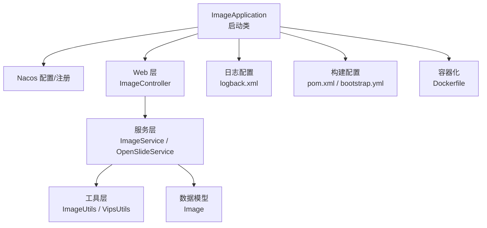
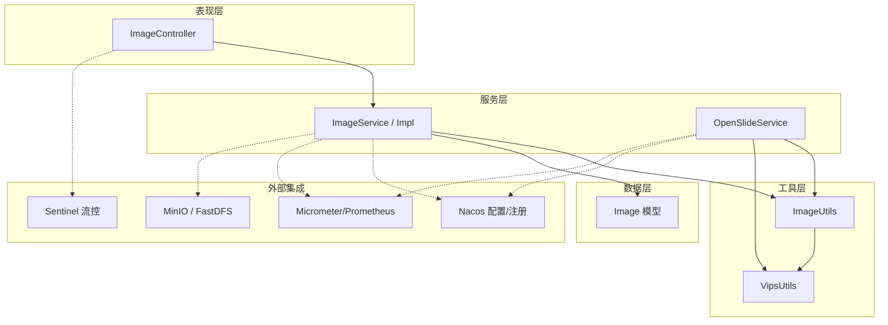
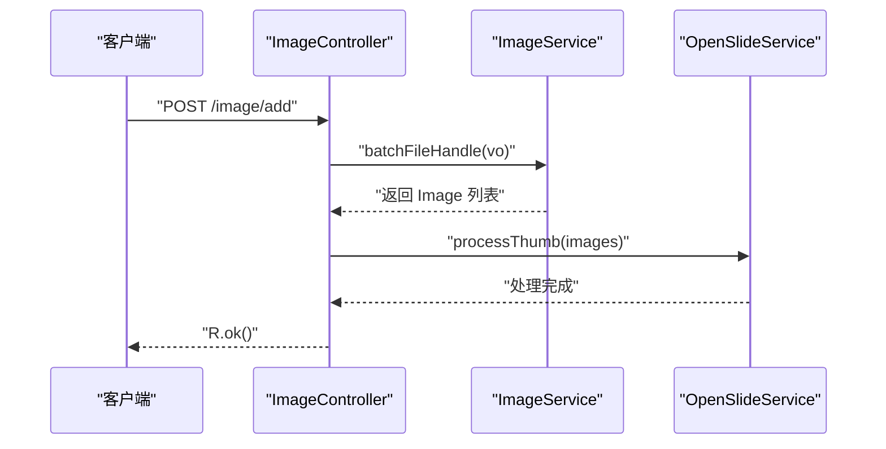
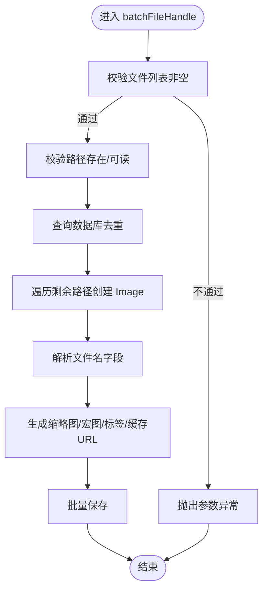
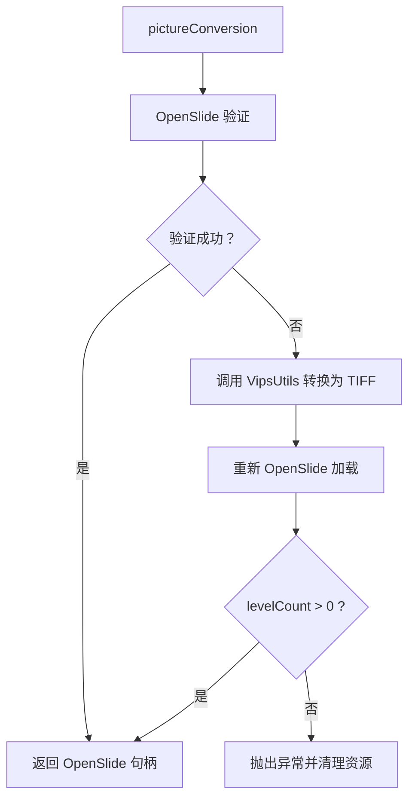
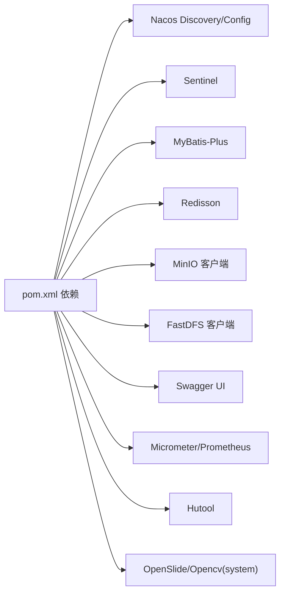

# 开发指南

<cite>
**本文引用的文件**
- [README.md](file://README.md)
- [CONTRIBUTING.md](file://CONTRIBUTING.md)
- [pom.xml](file://pom.xml)
- [Dockerfile](file://Dockerfile)
- [.gitlab-ci.yml](file://.gitlab-ci.yml)
- [src/main/java/cn/staitech/ImageApplication.java](file://src/main/java/cn/staitech/ImageApplication.java)
- [src/main/resources/bootstrap.yml](file://src/main/resources/bootstrap.yml)
- [src/main/resources/logback.xml](file://src/main/resources/logback.xml)
- [src/main/java/cn/staitech/file/controller/ImageController.java](file://src/main/java/cn/staitech/file/controller/ImageController.java)
- [src/main/java/cn/staitech/file/service/ImageService.java](file://src/main/java/cn/staitech/file/service/ImageService.java)
- [src/main/java/cn/staitech/file/service/impl/ImageServiceImpl.java](file://src/main/java/cn/staitech/file/service/impl/ImageServiceImpl.java)
- [src/main/java/cn/staitech/file/service/OpenSlideService.java](file://src/main/java/cn/staitech/file/service/OpenSlideService.java)
- [src/main/java/cn/staitech/file/util/ImageUtils.java](file://src/main/java/cn/staitech/file/util/ImageUtils.java)
- [src/main/java/cn/staitech/file/util/VipsUtils.java](file://src/main/java/cn/staitech/file/util/VipsUtils.java)
- [src/main/java/cn/staitech/file/domain/Image.java](file://src/main/java/cn/staitech/file/domain/Image.java)
</cite>

## 目录
1. [简介](#简介)
2. [项目结构](#项目结构)
3. [核心组件](#核心组件)
4. [架构总览](#架构总览)
5. [详细组件分析](#详细组件分析)
6. [依赖分析](#依赖分析)
7. [性能考虑](#性能考虑)
8. [故障排查指南](#故障排查指南)
9. [结论](#结论)
10. [附录](#附录)

## 简介
本指南面向 PACMVS 图像模块（Java）的贡献者与维护者，提供从开发环境搭建、代码规范、测试要求到 API 接口开发与第三方集成的完整实践参考。项目基于 Spring Boot 与 Maven，采用 Nacos 注册与配置中心、Sentinel 流控、MyBatis-Plus、Redisson、MinIO/FastDFS 等技术栈，支持多环境构建与容器化部署。

## 项目结构
- 应用入口与配置
  - 启动类位于 cn.staitech 包，启用调度、WebSocket、安全配置、Feign 客户端、事务管理、服务发现等能力。
  - 配置通过 bootstrap.yml 指定端口、应用名、Nacos 服务地址与命名空间、共享配置等；日志由 logback.xml 统一管理。
- 控制器与服务层
  - 控制器层提供图像相关接口，如“服务器选片”“重解析失败切片”“检查失败切片”“查询原始切片”等。
  - 服务层定义接口与实现，包含批量文件处理、文件信息上传、OpenSlide 切片处理、缩略图生成与瓦片化等。
- 工具与模型
  - ImageUtils 封装文件名校验、路径生成、OpenSlide 验证与转换等。
  - VipsUtils 调用系统 vips 可执行程序生成金字塔 TIFF。
  - Image 数据模型映射 tb_image 表，涵盖切片元数据、状态、URL 字段等。
- 构建与部署
  - Maven POM 定义依赖、资源过滤策略、多环境 Profile、打包插件与仓库。
  - Dockerfile 提供多阶段构建镜像。
  - .gitlab-ci.yml 定义构建-测试-部署流水线。

图表来源
- [src/main/java/cn/staitech/ImageApplication.java:37-52](file://src/main/java/cn/staitech/ImageApplication.java#L37-L52)
- [src/main/resources/bootstrap.yml:1-37](file://src/main/resources/bootstrap.yml#L1-L37)
- [src/main/resources/logback.xml:1-116](file://src/main/resources/logback.xml#L1-L116)
- [src/main/java/cn/staitech/file/controller/ImageController.java:27-71](file://src/main/java/cn/staitech/file/controller/ImageController.java#L27-L71)
- [src/main/java/cn/staitech/file/service/ImageService.java:17-23](file://src/main/java/cn/staitech/file/service/ImageService.java#L17-L23)
- [src/main/java/cn/staitech/file/service/OpenSlideService.java:14-39](file://src/main/java/cn/staitech/file/service/OpenSlideService.java#L14-L39)
- [src/main/java/cn/staitech/file/util/ImageUtils.java:20-148](file://src/main/java/cn/staitech/file/util/ImageUtils.java#L20-L148)
- [src/main/java/cn/staitech/file/util/VipsUtils.java:11-37](file://src/main/java/cn/staitech/file/util/VipsUtils.java#L11-L37)
- [src/main/java/cn/staitech/file/domain/Image.java:27-216](file://src/main/java/cn/staitech/file/domain/Image.java#L27-L216)
- [pom.xml:229-346](file://pom.xml#L229-L346)
- [Dockerfile:1-16](file://Dockerfile#L1-L16)

章节来源
- [README.md:1-11](file://README.md#L1-L11)
- [src/main/java/cn/staitech/ImageApplication.java:37-52](file://src/main/java/cn/staitech/ImageApplication.java#L37-L52)
- [src/main/resources/bootstrap.yml:1-37](file://src/main/resources/bootstrap.yml#L1-L37)
- [src/main/resources/logback.xml:1-116](file://src/main/resources/logback.xml#L1-L116)

## 核心组件
- 启动类与装配
  - 启用调度、WebSocket、自定义安全配置、Swagger、Feign 客户端、服务发现、事务管理、Elasticsearch 仓库等。
  - 设置 JVM 时区为 Asia/Shanghai，统一日志标签 application=staitech-image。
- 控制器
  - 提供 /image/add（服务器选片）、/image/reparse（重解析）、/image/checkFailImage（检查失败切片）、/image/getImage/{id}（查询原始切片）等接口。
- 服务层
  - ImageService：定义批量文件处理与文件信息上传接口。
  - OpenSlideService：定义缩略图落盘、瓦片化、重解析等接口。
  - ImageServiceImpl：实现批量处理、文件名校验与解析、路径生成、URL 构造、专题信息同步、数据库持久化等。
- 工具层
  - ImageUtils：文件名校验、路径创建、OpenSlide 验证与转换（失败时调用 VipsUtils 转换为金字塔 TIFF）、组织路径格式化等。
  - VipsUtils：调用 vips 可执行命令生成大图金字塔 TIFF（tile、pyramid、LZW 压缩）。
- 数据模型
  - Image：映射 tb_image，包含切片元数据、状态、URL、组织与专题关联、解析状态等字段。

章节来源
- [src/main/java/cn/staitech/ImageApplication.java:27-52](file://src/main/java/cn/staitech/ImageApplication.java#L27-L52)
- [src/main/java/cn/staitech/file/controller/ImageController.java:27-71](file://src/main/java/cn/staitech/file/controller/ImageController.java#L27-L71)
- [src/main/java/cn/staitech/file/service/ImageService.java:17-23](file://src/main/java/cn/staitech/file/service/ImageService.java#L17-L23)
- [src/main/java/cn/staitech/file/service/OpenSlideService.java:14-39](file://src/main/java/cn/staitech/file/service/OpenSlideService.java#L14-L39)
- [src/main/java/cn/staitech/file/service/impl/ImageServiceImpl.java:42-140](file://src/main/java/cn/staitech/file/service/impl/ImageServiceImpl.java#L42-L140)
- [src/main/java/cn/staitech/file/util/ImageUtils.java:20-148](file://src/main/java/cn/staitech/file/util/ImageUtils.java#L20-L148)
- [src/main/java/cn/staitech/file/util/VipsUtils.java:11-37](file://src/main/java/cn/staitech/file/util/VipsUtils.java#L11-L37)
- [src/main/java/cn/staitech/file/domain/Image.java:27-216](file://src/main/java/cn/staitech/file/domain/Image.java#L27-L216)

## 架构总览
系统采用分层架构：表现层（控制器）、领域服务层（服务接口与实现）、工具与基础设施层（OpenSlide/Vips、文件系统/对象存储）、数据访问层（MyBatis-Plus 映射）与外部集成（Nacos、Sentinel、Prometheus Micrometer、MinIO/FastDFS）。日志统一由 Logback 输出至控制台与滚动文件，指标通过 Micrometer 导出 Prometheus。

图表来源
- [src/main/java/cn/staitech/file/controller/ImageController.java:27-71](file://src/main/java/cn/staitech/file/controller/ImageController.java#L27-L71)
- [src/main/java/cn/staitech/file/service/ImageService.java:17-23](file://src/main/java/cn/staitech/file/service/ImageService.java#L17-L23)
- [src/main/java/cn/staitech/file/service/impl/ImageServiceImpl.java:42-140](file://src/main/java/cn/staitech/file/service/impl/ImageServiceImpl.java#L42-L140)
- [src/main/java/cn/staitech/file/service/OpenSlideService.java:14-39](file://src/main/java/cn/staitech/file/service/OpenSlideService.java#L14-L39)
- [src/main/java/cn/staitech/file/util/ImageUtils.java:20-148](file://src/main/java/cn/staitech/file/util/ImageUtils.java#L20-L148)
- [src/main/java/cn/staitech/file/util/VipsUtils.java:11-37](file://src/main/java/cn/staitech/file/util/VipsUtils.java#L11-L37)
- [src/main/java/cn/staitech/file/domain/Image.java:27-216](file://src/main/java/cn/staitech/file/domain/Image.java#L27-L216)
- [pom.xml:23-205](file://pom.xml#L23-L205)

## 详细组件分析

### 控制器：ImageController
- 职责
  - 接收客户端请求，调用服务层执行业务逻辑，返回统一响应包装 R。
- 关键接口
  - POST /image/add：批量服务器选片，先入库解析，再触发缩略图与瓦片处理。
  - POST /image/reparse：针对指定失败切片 ID 列表进行重解析。
  - GET /image/checkFailImage：统计当前机构下解析失败或解析失败的切片数量。
  - GET /image/getImage/{id}：按 ID 查询原始切片记录。
- 错误处理
  - 对空参、非法路径、解析失败等情况进行参数校验与异常捕获，返回统一错误码与消息。

图表来源
- [src/main/java/cn/staitech/file/controller/ImageController.java:42-48](file://src/main/java/cn/staitech/file/controller/ImageController.java#L42-L48)
- [src/main/java/cn/staitech/file/service/ImageService.java:19-19](file://src/main/java/cn/staitech/file/service/ImageService.java#L19-L19)
- [src/main/java/cn/staitech/file/service/OpenSlideService.java:25-25](file://src/main/java/cn/staitech/file/service/OpenSlideService.java#L25-L25)

章节来源
- [src/main/java/cn/staitech/file/controller/ImageController.java:27-71](file://src/main/java/cn/staitech/file/controller/ImageController.java#L27-L71)

### 服务层：ImageServiceImpl
- 批量文件处理 batchFileHandle
  - 校验文件路径合法性与可读性；去重（按路径与组织 ID）；逐条创建 Image 并解析文件名字段；构造缩略图/宏图/标签/缓存缩略图 URL；批量保存。
- 文件信息上传 fileInformationUpload
  - 校验输入参数与文件名格式；解析专题、动物号、蜡块号、组号与性别；生成组织路径与文件路径；创建目录；入库并返回结果。
- 文件名校验与解析
  - 支持两种格式：以空格分隔的“专题 动物-蜡块 组别性别 尾缀_时间戳”与以波浪号分隔的“专题号~动物号~蜡块号~组别性别~其他尾缀”。
  - 若解析失败，回退到字段解析策略；若仍失败，标记解析状态为失败。
- 路径与 URL 生成
  - 基于雪花 ID 生成唯一文件名；组织路径按固定规则生成；thumbUrl/macroUrl/labelUrl/cacheUrl 等字段按类型拼接。
- 专题信息同步
  - 若专题不存在则自动创建并写入数据库。

图表来源
- [src/main/java/cn/staitech/file/service/impl/ImageServiceImpl.java:63-140](file://src/main/java/cn/staitech/file/service/impl/ImageServiceImpl.java#L63-L140)
- [src/main/java/cn/staitech/file/util/ImageUtils.java:136-145](file://src/main/java/cn/staitech/file/util/ImageUtils.java#L136-L145)

章节来源
- [src/main/java/cn/staitech/file/service/impl/ImageServiceImpl.java:63-140](file://src/main/java/cn/staitech/file/service/impl/ImageServiceImpl.java#L63-L140)
- [src/main/java/cn/staitech/file/util/ImageUtils.java:136-145](file://src/main/java/cn/staitech/file/util/ImageUtils.java#L136-L145)

### 工具层：ImageUtils 与 VipsUtils
- ImageUtils
  - 支持的扩展名集合、默认最大文件大小、目录检查、文件名去扩展名、组织路径格式化（四位数前缀）。
  - pictureConversion：优先使用 OpenSlide 验证切片；若失败则调用 VipsUtils 转换为金字塔 TIFF 并重新验证；确保 levelCount > 0。
- VipsUtils
  - 通过 Runtime.exec 调用 vips 可执行程序，生成 bigtiff、tile=256、pyramid、LZW 压缩的 TIFF。

图表来源
- [src/main/java/cn/staitech/file/util/ImageUtils.java:52-97](file://src/main/java/cn/staitech/file/util/ImageUtils.java#L52-L97)
- [src/main/java/cn/staitech/file/util/VipsUtils.java:22-35](file://src/main/java/cn/staitech/file/util/VipsUtils.java#L22-L35)

章节来源
- [src/main/java/cn/staitech/file/util/ImageUtils.java:20-148](file://src/main/java/cn/staitech/file/util/ImageUtils.java#L20-L148)
- [src/main/java/cn/staitech/file/util/VipsUtils.java:11-37](file://src/main/java/cn/staitech/file/util/VipsUtils.java#L11-L37)

### 数据模型：Image
- 字段覆盖切片元数据（宽高深度、分辨率、层级数、总切片数、MD5）、状态与来源、组织与专题关联、文件名解析状态、解剖期限等。
- 与 MyBatis-Plus 注解配合，映射 tb_image 表。

章节来源
- [src/main/java/cn/staitech/file/domain/Image.java:27-216](file://src/main/java/cn/staitech/file/domain/Image.java#L27-L216)

## 依赖分析
- 核心依赖
  - Spring Cloud Alibaba：Nacos Discovery/Config、Sentinel。
  - Spring Boot：Actuator、WebSocket、Test。
  - MyBatis-Plus 与 MyBatis-Plus Join：简化 ORM 与联表查询。
  - Redisson：分布式能力（如锁/限流）。
  - MinIO、FastDFS 客户端：对象存储集成。
  - Swagger UI、Swagger Bootstrap UI：接口文档。
  - Micrometer + Prometheus：监控指标导出。
  - Hutool：常用工具集。
  - OpenSlide、OpenCV（system scope）：第三方库本地依赖。
- 构建与资源
  - Maven 资源过滤排除二进制文件，同时将本地 lib 下 jar 打包进 BOOT-INF/lib。
  - 多环境 Profile：pacmvsdev/testpvcmvs/pathmedics，分别绑定 Nacos 地址与命名空间。
  - Docker 多阶段构建：Maven 构建产物复制到 JRE 镜像运行。

图表来源
- [pom.xml:23-205](file://pom.xml#L23-L205)

章节来源
- [pom.xml:229-346](file://pom.xml#L229-L346)
- [pom.xml:349-384](file://pom.xml#L349-L384)
- [Dockerfile:1-16](file://Dockerfile#L1-L16)

## 性能考虑
- I/O 与并发
  - 批量处理时建议分批提交，避免单次超大事务导致锁竞争与内存压力。
  - OpenSlide/Vips 转换为 CPU/I-O 密集型操作，建议在独立线程池或异步任务中执行，避免阻塞 Web 线程。
- 存储与缓存
  - 金字塔 TIFF 的 LZW 压缩与 256×256 瓦片尺寸平衡了存储与渲染性能；可根据硬件条件调整压缩与瓦片大小。
  - 缩略图/宏图/标签 URL 分离，便于 CDN 缓存与就近分发。
- 监控与限流
  - 结合 Sentinel 对关键接口进行限流与熔断；Micrometer 指标暴露便于 Prometheus 抓取与告警。
- 配置与资源
  - 合理设置 Nacos 命名空间与组，避免配置冲突；共享配置 application-${profile}.yml 降低重复配置成本。

## 故障排查指南
- 启动与配置
  - 检查 bootstrap.yml 中 Nacos 地址、命名空间、组与共享配置是否正确；确认激活 profile 与端口。
  - 日志路径 logs/staitech-image 下 info/warn/error/debug 文件滚动正常。
- OpenSlide/Vips
  - 若 OpenSlide 验证失败，查看转换日志与 vips 命令输出；确认 vips 可执行文件路径与权限。
- 文件名校验
  - 若解析失败，检查文件名格式是否符合“空格分隔”或“波浪号分隔”的约定；确认专题是否存在且归属当前组织。
- 接口问题
  - 使用 Swagger UI 或 Postman 调试 /image/add、/image/reparse、/image/checkFailImage；关注返回状态与错误信息。
- CI/CD
  - GitLab CI 的 build/test/deploy 阶段按模板执行；如需自定义，可在 .gitlab-ci.yml 中扩展脚本。

章节来源
- [src/main/resources/bootstrap.yml:1-37](file://src/main/resources/bootstrap.yml#L1-L37)
- [src/main/resources/logback.xml:1-116](file://src/main/resources/logback.xml#L1-L116)
- [src/main/java/cn/staitech/file/util/ImageUtils.java:52-97](file://src/main/java/cn/staitech/file/util/ImageUtils.java#L52-L97)
- [src/main/java/cn/staitech/file/util/VipsUtils.java:22-35](file://src/main/java/cn/staitech/file/util/VipsUtils.java#L22-L35)
- [.gitlab-ci.yml:16-50](file://.gitlab-ci.yml#L16-L50)

## 结论
本指南提供了 PACMVS 图像模块的开发全链路实践：从环境搭建、代码规范、测试要求到 API 开发与第三方集成。建议在开发中遵循统一的日志与监控策略、严格的参数校验与异常处理、合理的异步与缓存设计，并结合 CI/CD 自动化保障交付质量。

## 附录

### 开发环境搭建
- JDK 8、Maven、Git、Docker（可选）
- IDE：推荐 IntelliJ IDEA，启用 Lombok 插件
- 运行方式
  - 本地直接运行：启动 ImageApplication
  - 容器运行：使用 Dockerfile 构建镜像并运行
- 配置准备
  - 在 ../conf/devCommons 目录放置共享配置 application.yml
  - 确认 Nacos 地址、命名空间、组与共享配置项

章节来源
- [src/main/java/cn/staitech/ImageApplication.java:37-52](file://src/main/java/cn/staitech/ImageApplication.java#L37-L52)
- [Dockerfile:1-16](file://Dockerfile#L1-L16)
- [src/main/resources/bootstrap.yml:1-37](file://src/main/resources/bootstrap.yml#L1-L37)

### 代码规范与注释规范
- 类与方法注释
  - 使用标准 JavaDoc 注释类与方法，描述职责、参数、返回值与异常
- 字段注释
  - 使用 Swagger 注解标注字段含义与用途
- 日志规范
  - 使用 SLF4J 记录 INFO/WARN/ERROR/DEBUG 级别日志，包含必要上下文（如路径、ID、状态）
- 命名规范
  - 包名小写，类名 PascalCase，方法与变量 camelCase，常量 UPPER_SNAKE_CASE

### Git 工作流程
- 分支策略
  - develop：主开发分支；feature/*：功能开发；hotfix/*：紧急修复；release/*：发布准备
- 提交规范
  - 使用清晰的提交信息，说明变更目的与影响范围
- 合并与审查
  - 通过 Merge Request 进行代码审查，确保通过单元测试与静态检查

章节来源
- [.gitlab-ci.yml:16-50](file://.gitlab-ci.yml#L16-L50)
- [CONTRIBUTING.md:1-41](file://CONTRIBUTING.md#L1-L41)

### 新功能开发流程
- 需求评审 → 设计接口与数据模型 → 编写控制器与服务层 → 实现工具与第三方集成 → 编写单元测试 → 提交 MR → CI/CD 自动化测试与部署

### API 接口开发
- 控制器层：定义 REST 接口，使用 Swagger 注解标注接口说明与参数
- 服务层：实现业务逻辑，保证幂等与一致性
- 数据层：使用 MyBatis-Plus 简化 CRUD，复杂查询使用 XML 或 QueryWrapper
- 第三方集成：OpenSlide/Vips 通过工具类封装，对象存储通过 MinIO/FastDFS 客户端接入

章节来源
- [src/main/java/cn/staitech/file/controller/ImageController.java:27-71](file://src/main/java/cn/staitech/file/controller/ImageController.java#L27-L71)
- [src/main/java/cn/staitech/file/service/ImageService.java:17-23](file://src/main/java/cn/staitech/file/service/ImageService.java#L17-L23)
- [src/main/java/cn/staitech/file/util/ImageUtils.java:20-148](file://src/main/java/cn/staitech/file/util/ImageUtils.java#L20-L148)
- [src/main/java/cn/staitech/file/util/VipsUtils.java:11-37](file://src/main/java/cn/staitech/file/util/VipsUtils.java#L11-L37)

### 第三方集成方法
- OpenSlide
  - 通过 ImageUtils 的 OpenSlide 验证与转换，确保切片可读
- Vips
  - 通过 VipsUtils 调用 vips 命令生成金字塔 TIFF
- 对象存储
  - 使用 MinIO/FastDFS 客户端上传/下载，结合 URL 字段对外提供访问
- 配置中心与服务发现
  - Nacos Discovery/Config 提供动态配置与服务注册

章节来源
- [src/main/java/cn/staitech/file/util/ImageUtils.java:52-97](file://src/main/java/cn/staitech/file/util/ImageUtils.java#L52-L97)
- [src/main/java/cn/staitech/file/util/VipsUtils.java:22-35](file://src/main/java/cn/staitech/file/util/VipsUtils.java#L22-L35)
- [pom.xml:23-205](file://pom.xml#L23-L205)
- [src/main/resources/bootstrap.yml:17-37](file://src/main/resources/bootstrap.yml#L17-L37)

### 测试要求
- 单元测试
  - 使用 JUnit 与 Spring Boot Test，覆盖关键业务逻辑（文件名校验、路径生成、OpenSlide/Vips 调用）
- 集成测试
  - 通过 GitLab CI 的 test 阶段执行，建议包含依赖扫描与代码覆盖率检查
- 接口测试
  - 使用 Swagger UI 或 Postman 验证新增接口行为与边界条件

章节来源
- [pom.xml:104-124](file://pom.xml#L104-L124)
- [.gitlab-ci.yml:30-43](file://.gitlab-ci.yml#L30-L43)

### 调试技巧
- 日志定位
  - 查看 logs/staitech-image 下滚动日志，定位 OpenSlide/Vips 调用与解析失败原因
- 断点调试
  - 在 ImageServiceImpl 的关键节点（解析、保存、URL 生成）设置断点
- 监控观测
  - 通过 Actuator 与 Micrometer/Prometheus 观察接口耗时、错误率与资源占用

章节来源
- [src/main/resources/logback.xml:1-116](file://src/main/resources/logback.xml#L1-L116)
- [src/main/java/cn/staitech/file/service/impl/ImageServiceImpl.java:275-305](file://src/main/java/cn/staitech/file/service/impl/ImageServiceImpl.java#L275-L305)