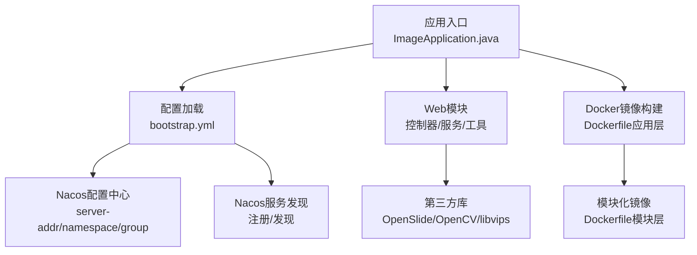
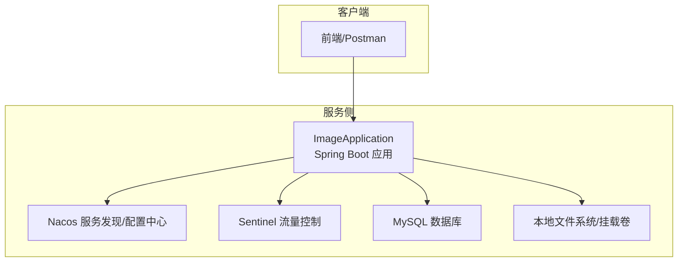
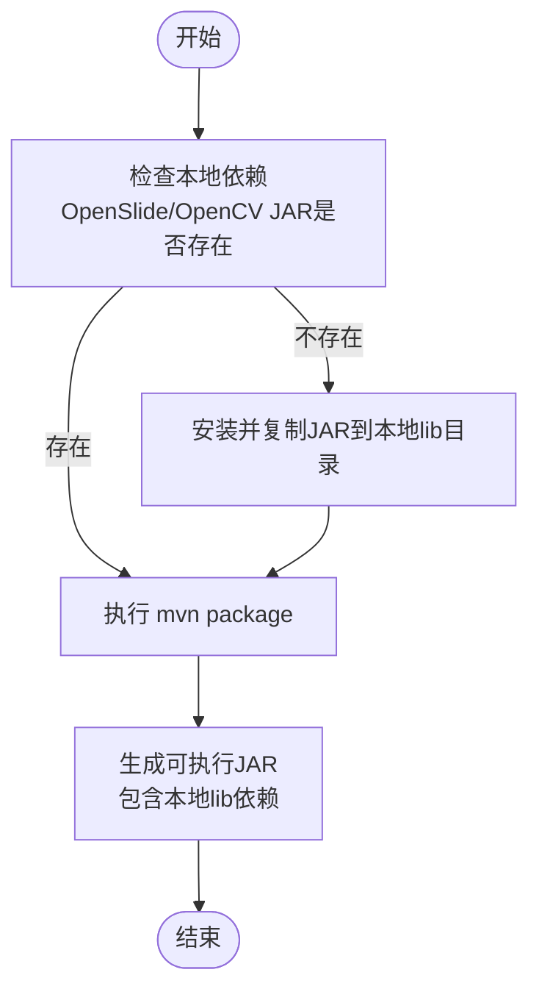
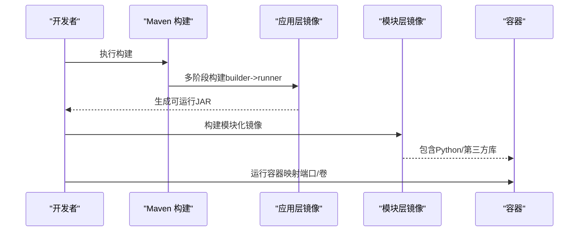
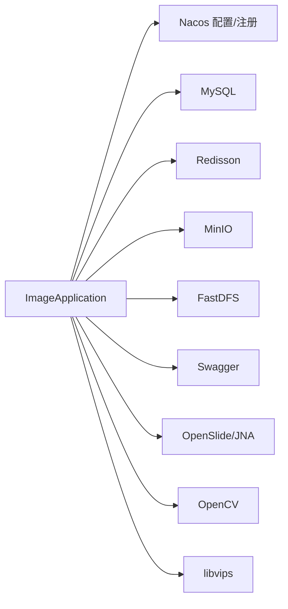

# 开发环境搭建

<cite>
**本文引用的文件**
- [pom.xml](file://pom.xml)
- [bootstrap.yml](file://src/main/resources/bootstrap.yml)
- [Dockerfile（应用层）](file://Dockerfile)
- [Dockerfile（模块层）](file://docker/staitech/modules/image/Dockerfile)
- [ImageApplication.java](file://src/main/java/cn/staitech/ImageApplication.java)
- [update_v2.5.2.sql](file://sql/update_v2.5.2.sql)
- [RestTemplateConfig.java](file://src/main/java/cn/staitech/file/config/RestTemplateConfig.java)
- [ResourcesConfig.java](file://src/main/java/cn/staitech/file/config/ResourcesConfig.java)
- [README.md](file://README.md)
</cite>

## 目录
1. [简介](#简介)
2. [项目结构](#项目结构)
3. [核心组件](#核心组件)
4. [架构总览](#架构总览)
5. [详细组件分析](#详细组件分析)
6. [依赖分析](#依赖分析)
7. [性能考虑](#性能考虑)
8. [故障排查指南](#故障排查指南)
9. [结论](#结论)
10. [附录](#附录)

## 简介
本指南面向PACMVS图像模块（Java后端）的开发者，提供从零开始的开发环境搭建步骤，涵盖以下方面：
- Java与IDE环境要求（JDK版本、IDE配置）
- Maven构建工具配置与依赖安装
- 数据库环境准备（MySQL安装与初始化）
- 第三方库本地安装（OpenSlide、OpenCV、libvips）
- Docker容器化开发环境（镜像构建与容器运行）
- Spring Cloud Alibaba组件（Nacos服务发现、Sentinel流量控制）本地部署
- 开发工具推荐（IntelliJ IDEA、Postman等）与调试配置

## 项目结构
该模块基于Spring Boot，使用Maven管理依赖，并通过Nacos进行配置与服务发现，同时集成Sentinel实现流量控制。项目包含：
- 核心应用入口与配置
- Spring Cloud Alibaba相关依赖与配置
- Docker多阶段构建与模块化镜像
- SQL脚本用于数据库表结构升级

图表来源
- [ImageApplication.java:37-52](file://src/main/java/cn/staitech/ImageApplication.java#L37-L52)
- [bootstrap.yml:17-37](file://src/main/resources/bootstrap.yml#L17-L37)
- [Dockerfile（应用层）:1-16](file://Dockerfile#L1-L16)
- [Dockerfile（模块层）:1-46](file://docker/staitech/modules/image/Dockerfile#L1-L46)

章节来源
- [README.md:1-11](file://README.md#L1-L11)
- [pom.xml:1-385](file://pom.xml#L1-L385)
- [bootstrap.yml:1-37](file://src/main/resources/bootstrap.yml#L1-L37)
- [Dockerfile（应用层）:1-16](file://Dockerfile#L1-L16)
- [Dockerfile（模块层）:1-46](file://docker/staitech/modules/image/Dockerfile#L1-L46)

## 核心组件
- 应用入口与功能开关
  - 启用调度、WebSocket、自定义安全配置、Swagger、Feign客户端、事务管理、Elasticsearch仓库等
  - 默认时区设置为“亚洲/上海”
- 配置加载
  - 通过bootstrap.yml加载Nacos配置中心与服务发现地址、命名空间、分组
  - 激活的环境由Maven Profile注入
- 构建与打包
  - Maven插件配置支持资源过滤、本地lib目录打包、Spring Boot重打包
  - 多环境Profile（开发/测试/生产）分别指向不同Nacos地址与命名空间

章节来源
- [ImageApplication.java:27-52](file://src/main/java/cn/staitech/ImageApplication.java#L27-L52)
- [bootstrap.yml:17-37](file://src/main/resources/bootstrap.yml#L17-L37)
- [pom.xml:229-385](file://pom.xml#L229-L385)

## 架构总览
系统采用微服务架构，前端通过Nacos进行服务注册与配置拉取，Sentinel负责流量治理，应用内部通过RestTemplate进行服务间通信，文件上传与静态资源映射通过资源配置类完成。

图表来源
- [ImageApplication.java:37-52](file://src/main/java/cn/staitech/ImageApplication.java#L37-L52)
- [bootstrap.yml:17-37](file://src/main/resources/bootstrap.yml#L17-L37)
- [pom.xml:29-45](file://pom.xml#L29-L45)

## 详细组件分析

### Java与IDE环境
- JDK版本
  - 应用层基础镜像使用openjdk:8-jre，建议本地开发使用JDK 8以保证一致性
- IDE配置
  - 推荐使用IntelliJ IDEA
  - 启用Lombok插件与Maven自动导入
  - 设置默认时区为“亚洲/上海”，与应用入口一致

章节来源
- [Dockerfile（应用层）:8-16](file://Dockerfile#L8-L16)
- [ImageApplication.java:41-43](file://src/main/java/cn/staitech/ImageApplication.java#L41-L43)

### Maven构建与依赖安装
- 依赖范围
  - Spring Cloud Alibaba：Nacos服务发现、Nacos配置、Sentinel
  - MySQL驱动、MyBatis-Plus、Redisson、FastDFS、MinIO、Swagger等
  - OpenSlide、OpenCV以system方式引入，需本地lib目录存在对应JAR
- 资源与打包
  - 资源过滤排除二进制文件，本地lib目录被打包至BOOT-INF/lib
  - Spring Boot插件配置要求解压OpenCV依赖
- 仓库与版本
  - 自定义Maven仓库与OSGeo仓库，确保依赖可下载

图表来源
- [pom.xml:164-205](file://pom.xml#L164-L205)
- [pom.xml:229-344](file://pom.xml#L229-L344)

章节来源
- [pom.xml:23-205](file://pom.xml#L23-L205)
- [pom.xml:229-344](file://pom.xml#L229-L344)

### 数据库环境准备（MySQL）
- 初始化步骤
  - 使用提供的SQL脚本对tb_image表进行字段扩展与修改
  - 更新process_flag默认值与字段类型，调整时间字段默认值
- 建议
  - 在本地或测试环境创建数据库与用户，赋予相应权限
  - 结合Spring配置（如application.yml中的数据源）完成连接

章节来源
- [update_v2.5.2.sql:1-10](file://sql/update_v2.5.2.sql#L1-L10)

### 第三方库本地安装（OpenSlide、OpenCV、libvips）
- OpenSlide
  - 依赖以system方式引入，需将openslide.jar放置于src/main/resources/lib
- OpenCV
  - 依赖以system方式引入，需将opencv-420.jar放置于src/main/resources/lib
- libvips
  - 模块化镜像中包含libvips库与二进制文件，可直接复制至/usr/lib与/usr/bin
  - 需要ldconfig刷新动态链接缓存
- 本地开发建议
  - 将上述JAR与库文件放置于项目指定路径
  - 确保操作系统已安装Python3与pip，以便运行切片脚本

章节来源
- [pom.xml:164-190](file://pom.xml#L164-L190)
- [Dockerfile（模块层）:31-36](file://docker/staitech/modules/image/Dockerfile#L31-L36)

### Docker容器化开发环境
- 应用层镜像（多阶段构建）
  - 基于maven:3-jdk-8-alpine构建，再拷贝至openjdk:8-jre-alpine运行
  - 暴露端口8080，入口为java -jar
- 模块层镜像（模块化）
  - 基于openjdk:8-jre，安装Python3与pip，安装openslide-bin
  - 复制OpenCV、OpenSlide、libvips至系统路径，设置权限与动态链接缓存
  - 暴露端口9083，入口为java -jar（与bootstrap.yml端口一致）

图表来源
- [Dockerfile（应用层）:1-16](file://Dockerfile#L1-L16)
- [Dockerfile（模块层）:1-46](file://docker/staitech/modules/image/Dockerfile#L1-L46)

章节来源
- [Dockerfile（应用层）:1-16](file://Dockerfile#L1-L16)
- [Dockerfile（模块层）:1-46](file://docker/staitech/modules/image/Dockerfile#L1-L46)

### Spring Cloud Alibaba组件配置（Nacos与Sentinel）
- Nacos服务发现与配置
  - 通过bootstrap.yml配置server-addr、namespace、group
  - 激活的环境由Maven Profile注入（开发/测试/生产）
- Sentinel流量控制
  - 引入spring-cloud-starter-alibaba-sentinel依赖
  - 本地可通过Sentinel Dashboard进行规则配置与监控

章节来源
- [bootstrap.yml:17-37](file://src/main/resources/bootstrap.yml#L17-L37)
- [pom.xml:29-45](file://pom.xml#L29-L45)
- [pom.xml:349-384](file://pom.xml#L349-L384)

### 开发工具与调试配置
- IntelliJ IDEA
  - 导入Maven项目，自动下载依赖
  - 设置JDK 8，启用Lombok
  - 运行ImageApplication主类启动应用
- Postman
  - 用于接口调试，结合Swagger UI查看接口文档
- 文件上传与静态资源
  - 通过ResourcesConfig配置本地文件映射与跨域访问
  - RestTemplateConfig启用负载均衡与JSON转换器

章节来源
- [ImageApplication.java:37-52](file://src/main/java/cn/staitech/ImageApplication.java#L37-L52)
- [ResourcesConfig.java:17-51](file://src/main/java/cn/staitech/file/config/ResourcesConfig.java#L17-L51)
- [RestTemplateConfig.java:22-49](file://src/main/java/cn/staitech/file/config/RestTemplateConfig.java#L22-L49)

## 依赖分析
- 组件耦合
  - 应用入口启用多个功能开关，与配置中心、服务发现、Sentinel形成松耦合
  - 文件上传与静态资源映射通过配置类解耦
- 外部依赖
  - Nacos、MySQL、Redisson、MinIO、FastDFS、OpenSlide、OpenCV、libvips
- 可能的循环依赖
  - 当前结构以配置类与组件扫描为主，未见明显循环依赖迹象

图表来源
- [pom.xml:29-205](file://pom.xml#L29-L205)
- [ImageApplication.java:37-52](file://src/main/java/cn/staitech/ImageApplication.java#L37-L52)

章节来源
- [pom.xml:23-205](file://pom.xml#L23-L205)

## 性能考虑
- 资源过滤与打包
  - 排除二进制文件参与过滤，避免不必要的编码转换
  - 本地lib目录直接打包，减少运行时查找成本
- 连接与超时
  - RestTemplate配置连接、读取、请求超时，提升网络调用稳定性
- 监控与指标
  - Micrometer Prometheus集成，便于生产环境观测

章节来源
- [pom.xml:229-344](file://pom.xml#L229-L344)
- [RestTemplateConfig.java:24-48](file://src/main/java/cn/staitech/file/config/RestTemplateConfig.java#L24-L48)

## 故障排查指南
- 无法找到本地JAR或库
  - 确认OpenSlide与OpenCV的JAR是否放置于src/main/resources/lib
  - 确认libvips库与二进制已复制至/usr/lib与/usr/bin，并执行ldconfig
- Nacos连接失败
  - 检查bootstrap.yml中的server-addr、namespace、group是否正确
  - 确认激活的Profile与目标环境匹配
- 端口占用
  - 应用默认端口与容器端口分别为9083与8080，确认未被占用
- 文件上传异常
  - 检查ResourcesConfig中file.path与file.prefix配置，确保路径存在且可写

章节来源
- [bootstrap.yml:1-37](file://src/main/resources/bootstrap.yml#L1-L37)
- [Dockerfile（模块层）:31-36](file://docker/staitech/modules/image/Dockerfile#L31-L36)
- [ResourcesConfig.java:17-51](file://src/main/java/cn/staitech/file/config/ResourcesConfig.java#L17-L51)

## 结论
本指南提供了从JDK、Maven、数据库到第三方库与Docker化的完整开发环境搭建路径，并结合Spring Cloud Alibaba组件给出本地部署要点。按照此流程，开发者可在本地快速复现生产环境行为，保障后续功能开发与联调工作的顺利进行。

## 附录
- 快速检查清单
  - JDK 8已安装并配置
  - Maven可正常下载依赖
  - MySQL已初始化并可连接
  - OpenSlide、OpenCV、libvips本地库就绪
  - Nacos与Sentinel本地可访问
  - Docker已安装，镜像可构建与运行
  - IntelliJ IDEA已导入项目并可启动