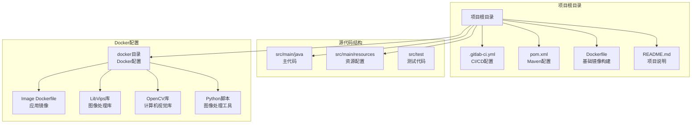
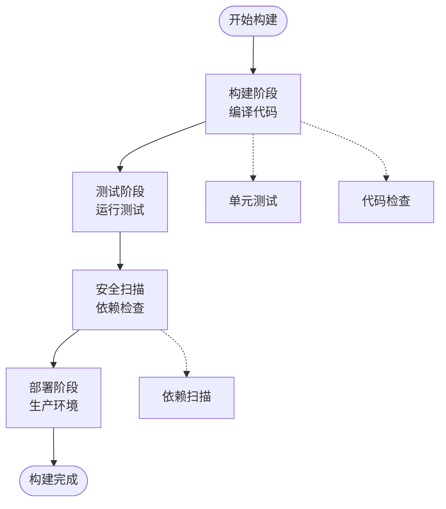
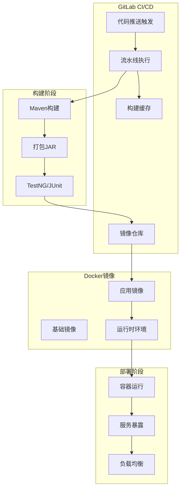
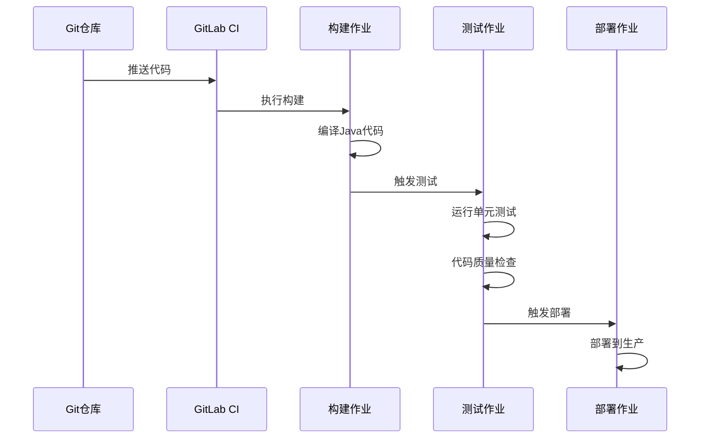
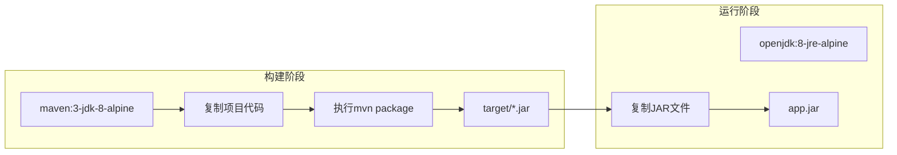
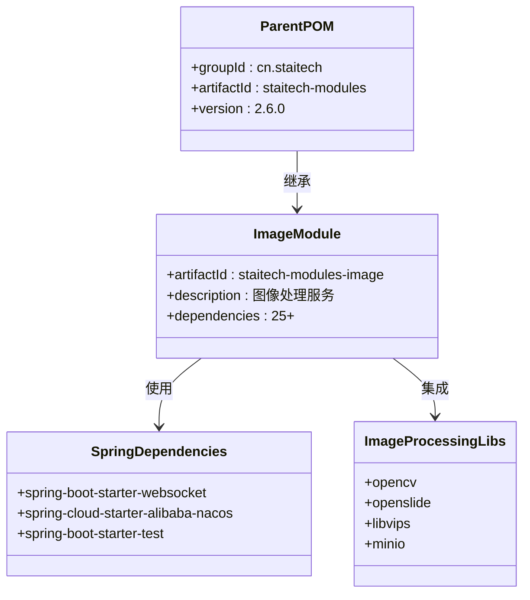
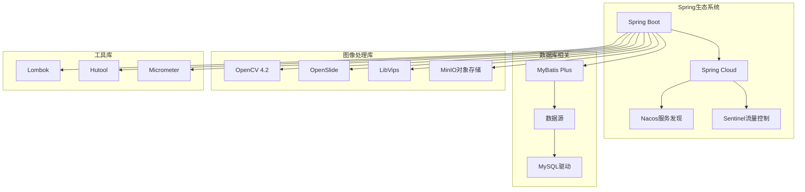

# CI/CD流水线配置

<cite>
**本文档引用的文件**
- [.gitlab-ci.yml](file://.gitlab-ci.yml)
- [pom.xml](file://pom.xml)
- [Dockerfile](file://Dockerfile)
- [docker/staitech/modules/image/Dockerfile](file://docker/staitech/modules/image/Dockerfile)
- [README.md](file://README.md)
- [src/main/resources/bootstrap.yml](file://src/main/resources/bootstrap.yml)
</cite>

## 目录
1. [简介](#简介)
2. [项目结构](#项目结构)
3. [核心组件](#核心组件)
4. [架构概览](#架构概览)
5. [详细组件分析](#详细组件分析)
6. [依赖关系分析](#依赖关系分析)
7. [性能考虑](#性能考虑)
8. [故障排查指南](#故障排查指南)
9. [结论](#结论)

## 简介

PACMVS项目是一个基于Spring Boot的Java图像处理服务项目，采用GitLab CI/CD进行持续集成和部署。该项目实现了标准的三阶段CI/CD流水线，包括构建、测试和部署阶段，并集成了安全扫描功能。

该项目基于GitLab项目模板，支持Auto DevOps功能，提供了完整的容器化部署解决方案，包含OpenCV、OpenSlide等图像处理库的集成。

## 项目结构

项目采用标准的Maven多模块结构，主要包含以下关键组件：

**图表来源**
- [.gitlab-ci.yml:1-50](file://.gitlab-ci.yml#L1-L50)
- [pom.xml:1-385](file://pom.xml#L1-L385)
- [Dockerfile:1-16](file://Dockerfile#L1-L16)

**章节来源**
- [.gitlab-ci.yml:1-50](file://.gitlab-ci.yml#L1-L50)
- [pom.xml:1-385](file://pom.xml#L1-L385)
- [README.md:1-11](file://README.md#L1-L11)

## 核心组件

### CI/CD流水线配置

项目使用GitLab CI/CD模板创建了标准的三阶段流水线：

1. **构建阶段 (Build Stage)**：编译Java代码，生成可执行JAR文件
2. **测试阶段 (Test Stage)**：运行单元测试和代码质量检查
3. **部署阶段 (Deploy Stage)**：将应用部署到生产环境

**图表来源**
- [.gitlab-ci.yml:16-49](file://.gitlab-ci.yml#L16-L49)

### Maven构建配置

项目使用Maven作为构建工具，配置了多个环境配置文件：

- **开发环境 (pacmvsdev)**：用于本地开发和测试
- **测试环境 (testpvcmvs)**：用于质量保证测试
- **生产环境 (pathmedics)**：用于生产部署

**章节来源**
- [pom.xml:348-385](file://pom.xml#L348-L385)
- [src/main/resources/bootstrap.yml:14-37](file://src/main/resources/bootstrap.yml#L14-L37)

## 架构概览

项目采用分层架构设计，结合容器化部署：

**图表来源**
- [.gitlab-ci.yml:21-22](file://.gitlab-ci.yml#L21-L22)
- [Dockerfile:1-16](file://Dockerfile#L1-L16)
- [docker/staitech/modules/image/Dockerfile:1-46](file://docker/staitech/modules/image/Dockerfile#L1-L46)

## 详细组件分析

### GitLab CI/CD流水线配置

#### 流水线阶段定义

项目定义了标准的三阶段流水线结构：

**图表来源**
- [.gitlab-ci.yml:16-49](file://.gitlab-ci.yml#L16-L49)

#### 安全扫描集成

项目集成了GitLab的安全扫描模板：

- **依赖扫描**：自动检测依赖中的安全漏洞
- **代码质量检查**：确保代码符合最佳实践

**章节来源**
- [.gitlab-ci.yml:21-22](file://.gitlab-ci.yml#L21-L22)

### Docker容器化配置

#### 多阶段构建

项目使用Docker多阶段构建优化镜像大小：

**图表来源**
- [Dockerfile:1-16](file://Dockerfile#L1-L16)

#### 自定义镜像配置

项目还提供了自定义的Dockerfile，包含完整的图像处理环境：

- **Python环境**：安装Python3和相关依赖
- **OpenCV库**：计算机视觉库集成
- **OpenSlide库**：WSI图像处理支持
- **LibVips库**：高性能图像处理库

**章节来源**
- [docker/staitech/modules/image/Dockerfile:1-46](file://docker/staitech/modules/image/Dockerfile#L1-L46)

### Maven构建系统

#### 依赖管理

项目使用Maven管理复杂的依赖关系：

**图表来源**
- [pom.xml:5-10](file://pom.xml#L5-L10)
- [pom.xml:23-205](file://pom.xml#L23-L205)

#### 环境配置

项目支持多环境配置，通过Maven Profiles实现：

**章节来源**
- [pom.xml:348-385](file://pom.xml#L348-L385)
- [src/main/resources/bootstrap.yml:14-37](file://src/main/resources/bootstrap.yml#L14-L37)

## 依赖关系分析

### 外部依赖关系

项目依赖关系复杂，主要包括：

**图表来源**
- [pom.xml:23-205](file://pom.xml#L23-L205)

### 内部模块依赖

项目采用模块化架构，主要模块间的关系：

**章节来源**
- [pom.xml:1-385](file://pom.xml#L1-L385)

## 性能考虑

### 构建性能优化

1. **多阶段构建**：减少最终镜像大小，提高部署效率
2. **缓存策略**：利用Docker层缓存和Maven本地缓存
3. **并行执行**：测试阶段的作业可以并行运行

### 部署性能优化

1. **容器化部署**：快速启动和扩展
2. **环境隔离**：通过Maven Profiles实现环境隔离
3. **资源管理**：合理的内存和CPU资源配置

## 故障排查指南

### 常见构建错误

#### Maven构建失败

**症状**：构建过程中出现依赖下载失败或编译错误

**解决方案**：
1. 检查网络连接和Maven仓库配置
2. 清理本地Maven缓存
3. 验证Java版本兼容性

#### Docker构建失败

**症状**：Docker镜像构建过程中出现错误

**解决方案**：
1. 检查Dockerfile语法
2. 验证依赖文件完整性
3. 确认磁盘空间充足

#### 测试失败

**症状**：单元测试或集成测试失败

**解决方案**：
1. 检查测试环境配置
2. 验证测试数据准备
3. 查看详细的测试日志

### 日志分析

#### 构建日志分析

建议关注以下关键信息：
- 构建时间统计
- 依赖下载进度
- 编译错误详情
- 测试结果摘要

#### 运行时日志分析

重点关注：
- 应用启动日志
- 错误堆栈跟踪
- 性能指标监控
- 业务逻辑日志

### 重试策略

1. **自动重试**：对于临时性网络问题，建议启用自动重试
2. **分阶段重试**：构建失败后，优先重试构建阶段
3. **环境重试**：测试失败后，检查环境配置后再重试

**章节来源**
- [.gitlab-ci.yml:24-49](file://.gitlab-ci.yml#L24-L49)

## 结论

PACMVS项目的CI/CD流水线配置体现了现代DevOps的最佳实践，具有以下特点：

1. **标准化流程**：采用GitLab CI/CD标准模板，流程清晰
2. **安全性保障**：集成安全扫描功能，确保代码质量
3. **容器化部署**：支持多阶段构建，优化镜像大小
4. **环境管理**：通过Maven Profiles实现多环境配置
5. **可扩展性**：模块化设计，便于功能扩展

该配置为图像处理服务提供了可靠的自动化构建和部署解决方案，能够满足生产环境的稳定性要求。