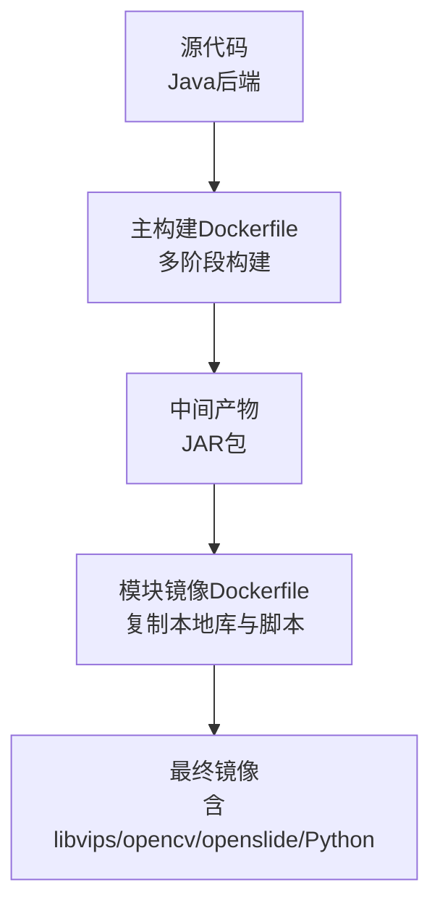
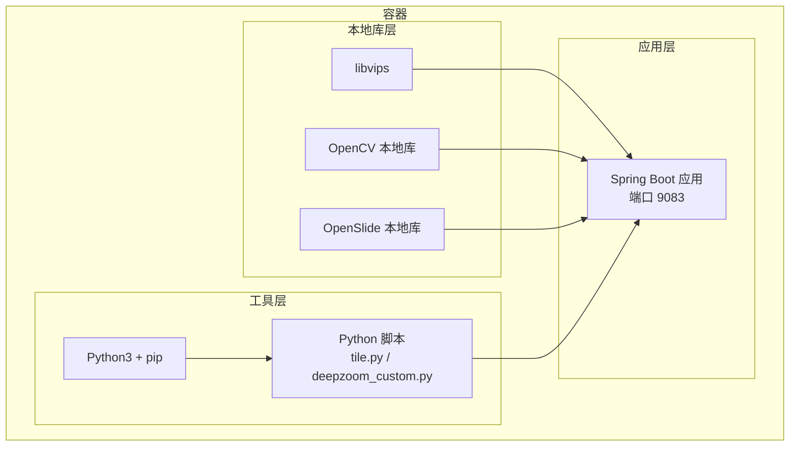
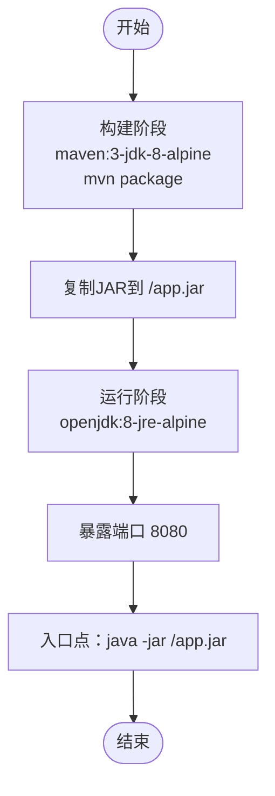
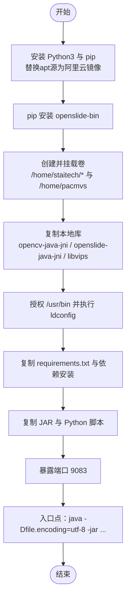
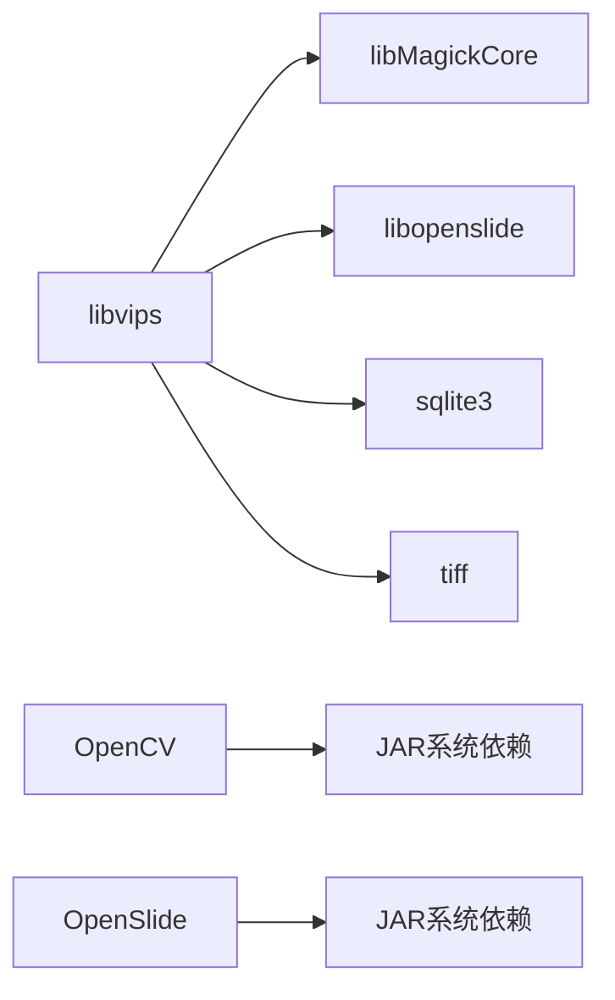
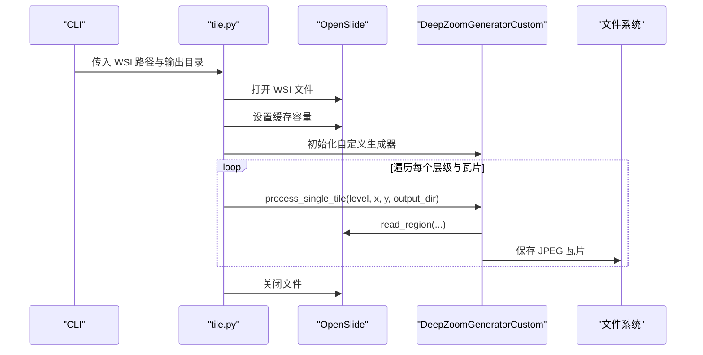
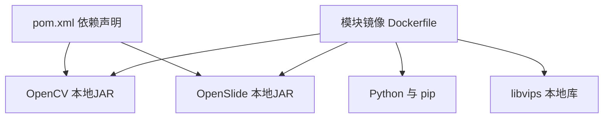

# Docker容器化

<cite>
**本文引用的文件**
- [Dockerfile（模块镜像）](file://docker/staitech/modules/image/Dockerfile)
- [Dockerfile（主构建）](file://Dockerfile)
- [pom.xml](file://pom.xml)
- [bootstrap.yml](file://src/main/resources/bootstrap.yml)
- [deepzoom_custom.py](file://docker/staitech/modules/image/script/deepzoom_custom.py)
- [tile.py](file://docker/staitech/modules/image/script/tile.py)
- [requirements.txt](file://docker/staitech/modules/image/script/requirements.txt)
- [.gitlab-ci.yml](file://.gitlab-ci.yml)
- [libvips.la](file://docker/staitech/modules/image/libvips/lib/libvips.la)
</cite>

## 目录
1. [简介](#简介)
2. [项目结构](#项目结构)
3. [核心组件](#核心组件)
4. [架构总览](#架构总览)
5. [详细组件分析](#详细组件分析)
6. [依赖关系分析](#依赖关系分析)
7. [性能考量](#性能考量)
8. [故障排查指南](#故障排查指南)
9. [结论](#结论)
10. [附录](#附录)

## 简介
本文件面向PACMVS项目的容器化部署，聚焦于Docker镜像构建与运行配置，涵盖以下主题：
- Dockerfile构建配置：基础镜像选择、多阶段构建策略、依赖库安装
- 本地库依赖处理：libvips、OpenCV、OpenSlide等本地库的集成方式
- 容器运行时配置：JVM参数设置、内存限制、端口映射
- 健康检查与服务发现：应用启动检测、依赖服务验证、Nacos配置
- 容器网络配置：服务发现、负载均衡、跨容器通信
- 容器化最佳实践：镜像优化、安全加固、监控配置

## 项目结构
该项目包含两套Dockerfile：
- 主构建Dockerfile用于多阶段构建Java应用镜像
- 模块镜像Dockerfile用于封装图像处理所需的本地库与Python工具

图表来源
- [Dockerfile（主构建）:1-16](file://Dockerfile#L1-L16)
- [Dockerfile（模块镜像）:1-46](file://docker/staitech/modules/image/Dockerfile#L1-L46)

章节来源
- [Dockerfile（主构建）:1-16](file://Dockerfile#L1-L16)
- [Dockerfile（模块镜像）:1-46](file://docker/staitech/modules/image/Dockerfile#L1-L46)

## 核心组件
- Java应用镜像（多阶段构建）
  - 构建阶段使用Maven Alpine镜像，编译并打包生成JAR
  - 运行阶段使用Alpine OpenJDK JRE，减少镜像体积
- 图像处理模块镜像
  - 安装Python3与pip，配置阿里云镜像源加速
  - 安装openslide-bin并通过pip安装依赖
  - 复制本地库：libvips、opencv-java-jni、openslide-java-jni
  - 暴露端口并以Java命令启动JAR
- 本地库与脚本
  - libvips、OpenCV、OpenSlide本地库通过系统依赖方式集成
  - Python脚本用于WSI瓦片生成，配合OpenSlide与Pillow

章节来源
- [Dockerfile（主构建）:1-16](file://Dockerfile#L1-L16)
- [Dockerfile（模块镜像）:1-46](file://docker/staitech/modules/image/Dockerfile#L1-L46)
- [requirements.txt:1-58](file://docker/staitech/modules/image/script/requirements.txt#L1-L58)
- [libvips.la:1-42](file://docker/staitech/modules/image/libvips/lib/libvips.la#L1-L42)

## 架构总览
容器化部署涉及三层：
- 应用层：Spring Boot微服务，端口9083
- 本地库层：libvips、OpenCV、OpenSlide本地库
- 工具层：Python脚本与依赖，用于瓦片生成

图表来源
- [Dockerfile（模块镜像）:6-44](file://docker/staitech/modules/image/Dockerfile#L6-L44)
- [bootstrap.yml:1-37](file://src/main/resources/bootstrap.yml#L1-L37)
- [tile.py:1-99](file://docker/staitech/modules/image/script/tile.py#L1-L99)
- [deepzoom_custom.py:1-177](file://docker/staitech/modules/image/script/deepzoom_custom.py#L1-L177)

## 详细组件分析

### 组件A：多阶段构建（Java应用镜像）
- 构建阶段
  - 基础镜像：maven:3-jdk-8-alpine
  - 工作目录：/usr/src/app
  - 复制源码并执行mvn package
- 运行阶段
  - 基础镜像：openjdk:8-jre-alpine
  - 复制JAR至/app.jar
  - 暴露端口8080
  - 入口点：java -jar /app.jar

图表来源
- [Dockerfile（主构建）:1-16](file://Dockerfile#L1-L16)

章节来源
- [Dockerfile（主构建）:1-16](file://Dockerfile#L1-L16)

### 组件B：模块镜像（图像处理与本地库）
- 基础镜像与维护者信息
  - 基础镜像：openjdk:8-jre
  - 维护者：staitech
- 本地库与Python安装
  - 替换apt源为阿里云镜像，更新包列表
  - 安装python3、python3-pip，软链接python3为python
  - pip安装openslide-bin
- 卷挂载与工作目录
  - 挂载卷：/home/staitech/attachment、/home/staitech/uploadPath、/home/staitech/Slides、/home/pacmvs
  - 创建目录并设置工作目录
- 本地库复制与权限
  - 复制opencv-java-jni、openslide-java-jni、libvips至/usr/lib与/usr/bin
  - 授予/usr/bin可执行权限，执行ldconfig
- 脚本与JAR复制
  - 复制requirements.txt并安装依赖
  - 复制JAR、Python脚本至/home/staitech
- 端口与启动
  - 暴露端口9083
  - 入口点：java -Dfile.encoding=utf-8 -jar staitech-modules-image.jar

图表来源
- [Dockerfile（模块镜像）:1-46](file://docker/staitech/modules/image/Dockerfile#L1-L46)

章节来源
- [Dockerfile（模块镜像）:1-46](file://docker/staitech/modules/image/Dockerfile#L1-L46)

### 组件C：本地库依赖处理（libvips、OpenCV、OpenSlide）
- libvips
  - 通过复制libvips/lib与libvips/bin至容器内/usr/lib与/usr/bin实现集成
  - 在Dockerfile中执行ldconfig以更新动态链接缓存
  - 可通过libvips.la查看依赖链，确认对libMagickCore、libopenslide、sqlite3、tiff等库的依赖
- OpenCV
  - 通过系统依赖方式在pom.xml中声明，scope为system，指向本地jar路径
  - Maven插件配置要求解压该依赖以便打包
- OpenSlide
  - 通过系统依赖方式在pom.xml中声明，scope为system，指向本地jar路径
  - 模块镜像中复制openslide-java-jni目录至/usr/lib

图表来源
- [Dockerfile（模块镜像）:31-36](file://docker/staitech/modules/image/Dockerfile#L31-L36)
- [libvips.la:19-20](file://docker/staitech/modules/image/libvips/lib/libvips.la#L19-L20)
- [pom.xml:164-180](file://pom.xml#L164-L180)

章节来源
- [Dockerfile（模块镜像）:31-36](file://docker/staitech/modules/image/Dockerfile#L31-L36)
- [libvips.la:1-42](file://docker/staitech/modules/image/libvips/lib/libvips.la#L1-L42)
- [pom.xml:164-180](file://pom.xml#L164-L180)

### 组件D：容器运行时配置（JVM参数、内存限制、端口映射）
- JVM参数
  - 模块镜像入口点设置了字符集参数-Dfile.encoding=utf-8
- 端口映射
  - 模块镜像暴露9083端口；主构建镜像暴露8080端口
  - 应用配置文件bootstrap.yml中server.port为9083
- 内存限制
  - 当前Dockerfile未显式设置JVM内存参数或容器内存限制
  - 建议在运行时通过JVM参数与容器资源限制进行调优

章节来源
- [Dockerfile（模块镜像）:42-44](file://docker/staitech/modules/image/Dockerfile#L42-L44)
- [bootstrap.yml:1-37](file://src/main/resources/bootstrap.yml#L1-L37)

### 组件E：健康检查与依赖验证
- 应用启动检测
  - 当前未配置HEALTHCHECK
  - 建议在容器启动后访问应用健康端点（如Actuator健康检查）进行探测
- 依赖服务验证
  - Nacos服务发现与配置中心已在bootstrap.yml中配置
  - 建议在容器启动后验证Nacos连接状态与配置拉取

章节来源
- [bootstrap.yml:18-37](file://src/main/resources/bootstrap.yml#L18-L37)

### 组件F：容器网络配置（服务发现、负载均衡、跨容器通信）
- 服务发现
  - 通过Nacos Discovery与Config实现服务注册与配置中心
  - 需要正确配置server-addr、namespace、group等参数
- 负载均衡
  - Spring Cloud Alibaba Sentinel可用于流量治理与限流
- 跨容器通信
  - 通过Nacos地址与组配置实现服务间通信
  - 建议使用内部网络与服务名进行通信

章节来源
- [pom.xml:29-45](file://pom.xml#L29-L45)
- [bootstrap.yml:18-37](file://src/main/resources/bootstrap.yml#L18-L37)

### 组件G：Python脚本与图像处理流程
- tile.py
  - 使用OpenSlide读取WSI文件，设置缓存容量
  - 使用ThreadPoolExecutor并发生成瓦片，控制最大待处理任务数
  - 调用自定义DeepZoomGenerator生成Zoomify格式瓦片
- deepzoom_custom.py
  - 自定义DeepZoomGenerator，改造级别计算逻辑，适配tile_size
  - 处理透明度与颜色配置文件，保存为JPEG

图表来源
- [tile.py:1-99](file://docker/staitech/modules/image/script/tile.py#L1-L99)
- [deepzoom_custom.py:1-177](file://docker/staitech/modules/image/script/deepzoom_custom.py#L1-L177)

章节来源
- [tile.py:1-99](file://docker/staitech/modules/image/script/tile.py#L1-L99)
- [deepzoom_custom.py:1-177](file://docker/staitech/modules/image/script/deepzoom_custom.py#L1-L177)

## 依赖关系分析
- Maven依赖与本地库
  - OpenCV与OpenSlide通过系统依赖引入本地JAR
  - Maven资源过滤排除二进制文件，同时保留本地lib目录中的JAR
  - Spring Boot插件配置要求解包特定依赖
- Docker镜像依赖
  - 模块镜像依赖Python与openslide-bin
  - 本地库复制至/usr/lib与/usr/bin，执行ldconfig更新缓存

图表来源
- [pom.xml:164-180](file://pom.xml#L164-L180)
- [Dockerfile（模块镜像）:6-36](file://docker/staitech/modules/image/Dockerfile#L6-L36)

章节来源
- [pom.xml:164-180](file://pom.xml#L164-L180)
- [Dockerfile（模块镜像）:6-36](file://docker/staitech/modules/image/Dockerfile#L6-L36)

## 性能考量
- 并发与内存
  - Python脚本使用线程池并发生成瓦片，最大工作者数与待处理任务数可调
  - 建议根据CPU核数与内存容量调整线程池大小与缓存容量
- 动态库加载
  - 复制本地库后执行ldconfig，确保动态链接正常
- 镜像体积
  - 主构建采用Alpine基础镜像，减少体积
  - 模块镜像包含大量本地库与Python，建议按需裁剪

## 故障排查指南
- 本地库加载失败
  - 检查/usr/lib与/usr/bin中本地库是否存在
  - 确认已执行ldconfig
- Python依赖问题
  - 检查requirements.txt与pip安装日志
  - 确认阿里云镜像源可用
- 应用无法启动
  - 检查端口占用与防火墙
  - 查看应用日志与Nacos连接状态
- Nacos连接异常
  - 校验server-addr、namespace、group配置
  - 确认网络连通性与命名空间正确性

章节来源
- [Dockerfile（模块镜像）:6-36](file://docker/staitech/modules/image/Dockerfile#L6-L36)
- [bootstrap.yml:18-37](file://src/main/resources/bootstrap.yml#L18-L37)

## 结论
本项目通过双Dockerfile策略实现了Java应用与图像处理本地库的分离部署。模块镜像整合了libvips、OpenCV、OpenSlide与Python工具，适合独立运行与分发；主构建镜像采用多阶段策略，便于CI/CD流水线集成。建议后续补充健康检查、JVM参数与资源限制配置，以及Nacos与Prometheus监控集成，以提升生产可用性与可观测性。

## 附录
- CI/CD参考
  - 仓库包含GitLab CI模板，可作为流水线起点进行扩展

章节来源
- [.gitlab-ci.yml:1-50](file://.gitlab-ci.yml#L1-L50)