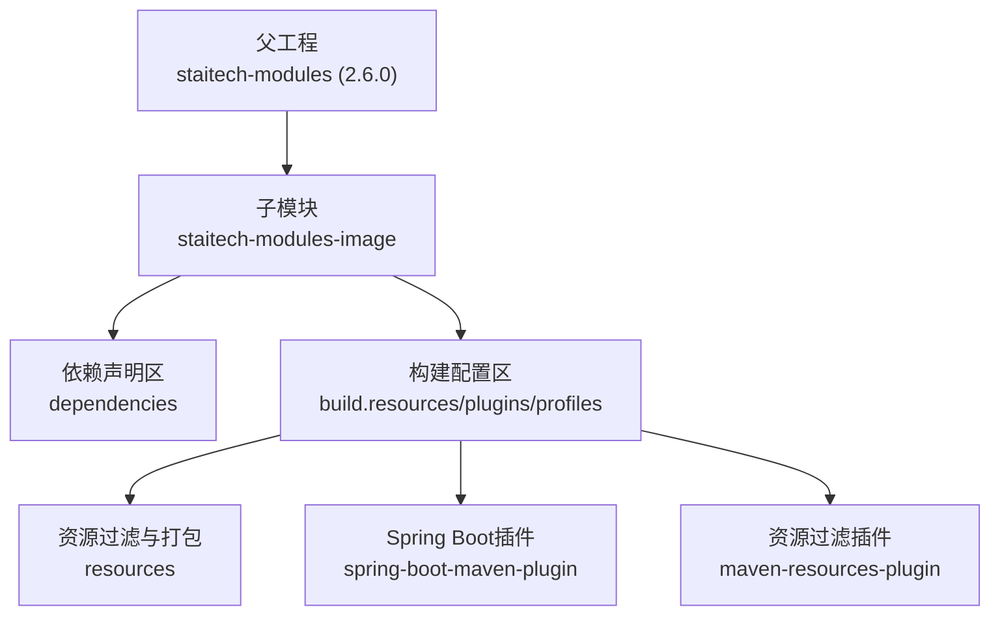
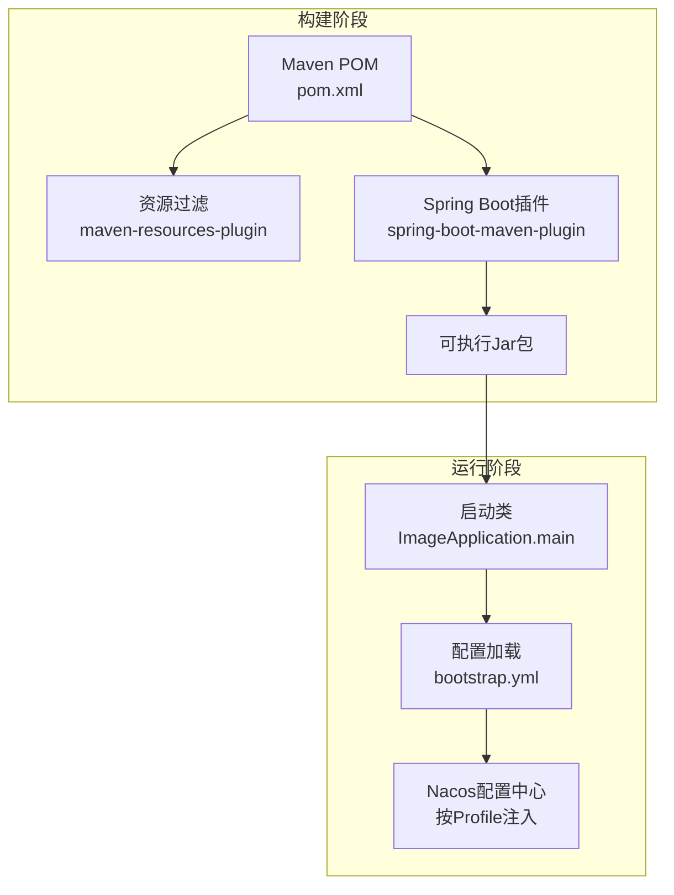
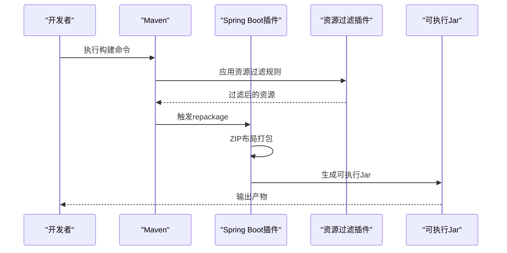
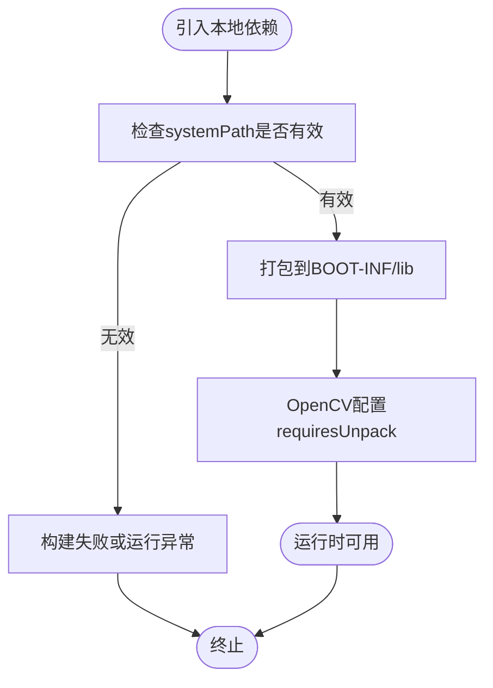
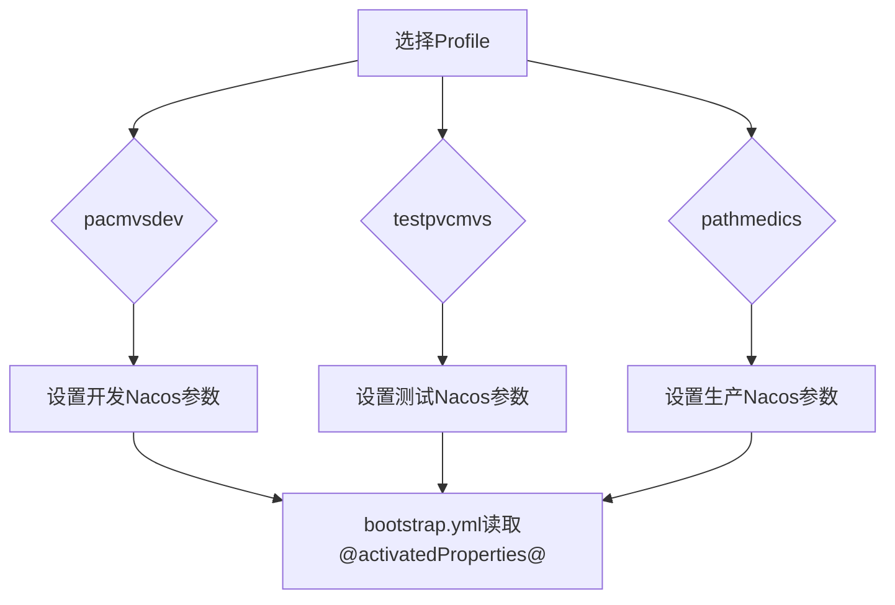
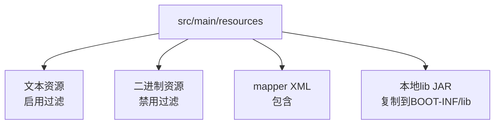
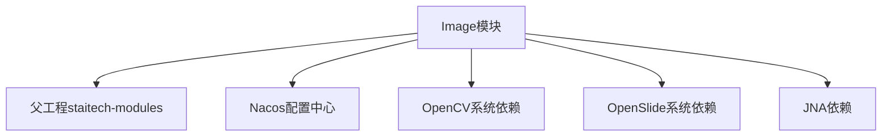

# Maven构建配置

<cite>
**本文引用的文件**
- [pom.xml](file://pom.xml)
- [ImageApplication.java](file://src/main/java/cn/staitech/ImageApplication.java)
- [bootstrap.yml](file://src/main/resources/bootstrap.yml)
- [Dockerfile（应用）](file://Dockerfile)
- [Dockerfile（镜像构建）](file://docker/staitech/modules/image/Dockerfile)
- [mvnw.cmd](file://mvnw.cmd)
- [.mvn/wrapper/maven-wrapper.properties](file://.mvn/wrapper/maven-wrapper.properties)
</cite>

## 目录
1. [简介](#简介)
2. [项目结构](#项目结构)
3. [核心组件](#核心组件)
4. [架构总览](#架构总览)
5. [详细组件分析](#详细组件分析)
6. [依赖关系分析](#依赖关系分析)
7. [性能考虑](#性能考虑)
8. [故障排查指南](#故障排查指南)
9. [结论](#结论)
10. [附录](#附录)

## 简介
本文件面向PACMVS图像模块（staitech-modules-image）的Maven构建配置，系统性说明以下方面：
- 依赖管理策略、版本控制与冲突解决
- Spring Boot插件配置（打包方式、启动类、资源过滤）
- 自定义依赖配置（OpenSlide与OpenCV本地JAR包的系统依赖）
- Maven Profiles配置（开发、测试、生产环境差异化）
- 资源处理（二进制文件过滤、本地库文件打包）
- 命令行构建示例（含不同环境的构建参数与打包选项）

## 项目结构
该模块基于父工程（staitech-modules）进行继承，采用标准Spring Boot多模块布局，核心构建配置集中在根目录的POM中。

图表来源
- [pom.xml:5-17](file://pom.xml#L5-L17)
- [pom.xml:229-346](file://pom.xml#L229-L346)

章节来源
- [pom.xml:1-385](file://pom.xml#L1-L385)

## 核心组件
- 依赖管理与版本控制
  - 继承父工程统一版本管理，确保模块间一致性与可维护性。
  - 关键依赖版本通过属性占位符集中管理，便于升级与替换。
- Spring Boot插件
  - 使用ZIP布局，支持repackage目标生成可执行包。
  - 针对特定系统依赖（OpenCV）配置解包要求，确保JNI库在运行前被正确展开。
- 资源处理
  - 分层资源过滤：文本文件启用过滤，二进制文件禁用过滤，避免破坏二进制完整性。
  - 显式包含mapper XML与本地lib目录下的JAR，确保打包完整。
- 自定义系统依赖
  - OpenSlide与OpenCV以system scope引入，并指定本地JAR路径，满足跨平台本地库需求。
- Profiles环境
  - 提供开发、测试、生产三套环境，分别映射不同的Nacos命名空间、地址与分组，实现环境隔离。

章节来源
- [pom.xml:23-205](file://pom.xml#L23-L205)
- [pom.xml:325-344](file://pom.xml#L325-L344)
- [pom.xml:229-302](file://pom.xml#L229-L302)
- [pom.xml:164-180](file://pom.xml#L164-L180)
- [pom.xml:348-384](file://pom.xml#L348-L384)

## 架构总览
下图展示Maven构建与运行的关键交互：POM定义依赖与构建行为，Spring Boot插件负责打包，资源过滤插件保障二进制完整性，Profiles与bootstrap.yml共同决定运行时配置。

图表来源
- [pom.xml:305-344](file://pom.xml#L305-L344)
- [ImageApplication.java:37-45](file://src/main/java/cn/staitech/ImageApplication.java#L37-L45)
- [bootstrap.yml:14-37](file://src/main/resources/bootstrap.yml#L14-L37)

## 详细组件分析

### 依赖管理与版本控制
- 版本策略
  - 通过父工程统一管理版本，子模块直接使用坐标，减少重复与冲突。
  - 局部版本通过属性占位符集中管理，便于升级与替换。
- 冲突解决
  - 优先遵循“就近原则”：子模块显式声明的版本优先于父工程传递的版本。
  - 对于第三方库，建议在父工程锁定版本，子模块避免重复声明相同坐标的不同版本。
- 关键依赖类别
  - Spring Cloud Alibaba生态（Nacos发现、配置、Sentinel）
  - 数据访问（MyBatis-Plus、Join Starter）
  - 存储（FastDFS客户端、MinIO）
  - 工具与监控（Hutool、Micrometer Prometheus）
  - 测试与开发（JUnit、Lombok、Swagger UI）

章节来源
- [pom.xml:23-205](file://pom.xml#L23-L205)

### Spring Boot插件配置
- 打包方式
  - 使用ZIP布局，便于容器化与部署。
- 启动类配置
  - 运行入口由启动类指定，插件repackage目标生成可执行Jar。
- 资源过滤规则
  - 通过maven-resources-plugin配置非过滤扩展名集合，确保二进制文件不被过滤。
- OpenCV解包要求
  - 针对OpenCV系统依赖配置requiresUnpack，确保JNI库在运行前被解压至可执行环境。

图表来源
- [pom.xml:305-344](file://pom.xml#L305-L344)
- [pom.xml:308-324](file://pom.xml#L308-L324)

章节来源
- [pom.xml:325-344](file://pom.xml#L325-L344)
- [ImageApplication.java:37-45](file://src/main/java/cn/staitech/ImageApplication.java#L37-L45)

### 自定义依赖配置（OpenSlide与OpenCV）
- OpenSlide
  - 以system scope引入，指向本地JAR路径，满足Windows/Linux平台的本地库集成。
- OpenCV
  - 同样以system scope引入，配合requiresUnpack确保运行时JNI库可用。
- JNA依赖
  - 引入JNA与JNA Platform，用于底层系统调用与平台适配。

图表来源
- [pom.xml:164-180](file://pom.xml#L164-L180)
- [pom.xml:330-335](file://pom.xml#L330-L335)

章节来源
- [pom.xml:164-190](file://pom.xml#L164-L190)

### Maven Profiles配置
- 开发环境（pacmvsdev）
  - 激活属性：pacmvsdev
  - Nacos命名空间、地址、分组均指向开发集群
- 测试环境（testpvcmvs）
  - 激活属性：testpvcmvs
  - Nacos命名空间、地址、分组指向测试集群
- 生产环境（pathmedics）
  - 激活属性：pathmedics
  - Nacos命名空间、地址、分组指向生产集群

图表来源
- [pom.xml:348-384](file://pom.xml#L348-L384)
- [bootstrap.yml:14-37](file://src/main/resources/bootstrap.yml#L14-L37)

章节来源
- [pom.xml:348-384](file://pom.xml#L348-L384)
- [bootstrap.yml:14-37](file://src/main/resources/bootstrap.yml#L14-L37)

### 资源处理配置
- 文本文件过滤
  - 对resources目录启用过滤，排除常见二进制扩展名，避免破坏二进制文件。
- 二进制文件保护
  - 单独配置资源项，禁用过滤，确保DLL/SO/DYLIB/JAR/压缩包与图片等不被修改。
- Mapper XML与本地库
  - 包含mapper XML以便编译期打包；显式包含本地lib目录下的JAR，复制到BOOT-INF/lib，确保运行时可加载。

图表来源
- [pom.xml:240-302](file://pom.xml#L240-L302)

章节来源
- [pom.xml:229-302](file://pom.xml#L229-L302)

### 启动类与运行入口
- 启动类位于应用主包下，标注Spring Boot启动注解，包含服务发现、Feign、定时任务、WebSocket等能力。
- 运行时默认时区设置为Asia/Shanghai，确保日志与业务时间一致性。

章节来源
- [ImageApplication.java:37-53](file://src/main/java/cn/staitech/ImageApplication.java#L37-L53)

## 依赖关系分析
- 组件耦合
  - 模块与父工程强耦合，通过继承获得版本与插件管理。
  - 与Nacos配置中心耦合，通过Profile与bootstrap.yml动态注入配置。
- 外部依赖
  - OpenSlide与OpenCV通过system scope引入，需确保宿主机具备相应本地库。
  - JNA用于跨平台系统调用，降低平台差异带来的复杂度。

图表来源
- [pom.xml:5-9](file://pom.xml#L5-L9)
- [pom.xml:164-190](file://pom.xml#L164-L190)

章节来源
- [pom.xml:5-9](file://pom.xml#L5-L9)
- [pom.xml:164-190](file://pom.xml#L164-L190)

## 性能考虑
- 资源过滤开销
  - 仅对必要文件进行过滤，避免对大量二进制文件的I/O影响。
- 插件执行顺序
  - 资源过滤插件先于Spring Boot插件执行，确保最终产物正确。
- 本地库加载
  - OpenCV解包与JNA配合，减少运行时动态加载失败的概率。

## 故障排查指南
- 本地JAR缺失
  - 症状：构建时报错无法解析OpenSlide/OpenCV依赖。
  - 排查：确认systemPath指向的JAR是否存在，路径是否正确。
- 二进制文件被错误过滤
  - 症状：运行时图片或本地库加载失败。
  - 排查：检查资源过滤配置，确保二进制扩展名未被纳入过滤。
- Profile未生效
  - 症状：运行时连接错误的Nacos地址或命名空间。
  - 排查：确认激活的Profile与bootstrap.yml中的@activatedProperties@一致。
- 容器运行异常
  - 症状：容器内找不到本地库或Python依赖。
  - 排查：参考镜像构建脚本，确认本地库与Python依赖已正确拷贝与初始化。

章节来源
- [pom.xml:164-180](file://pom.xml#L164-L180)
- [pom.xml:240-302](file://pom.xml#L240-L302)
- [bootstrap.yml:14-37](file://src/main/resources/bootstrap.yml#L14-L37)
- [Dockerfile（镜像构建）:31-44](file://docker/staitech/modules/image/Dockerfile#L31-L44)

## 结论
本Maven配置通过继承父工程、明确资源过滤策略、合理配置Spring Boot插件与Profiles，实现了对OpenSlide与OpenCV等本地依赖的稳定集成。建议在团队内统一版本管理策略，规范本地JAR的放置与命名，确保跨平台一致性与可维护性。

## 附录

### 命令行构建示例
- 使用Maven Wrapper构建（推荐）
  - 在项目根目录执行构建命令，自动下载所需Maven版本。
  - 参考文件：[mvnw.cmd:1-144](file://mvnw.cmd#L1-L144)，[maven-wrapper.properties:1-2](file://.mvn/wrapper/maven-wrapper.properties#L1-L2)
- 不同环境构建
  - 开发环境：mvn clean package -P pacmvsdev
  - 测试环境：mvn clean package -P testpvcmvs
  - 生产环境：mvn clean package -P pathmedics
- 指定属性覆盖（可选）
  - 示例：mvn clean package -DskipTests -P pacmvsdev
- 容器化构建
  - 使用Dockerfile进行多阶段构建，先在Maven镜像中打包，再复制到JRE镜像运行。
  - 参考文件：[Dockerfile（应用）:1-16](file://Dockerfile#L1-L16)，[Dockerfile（镜像构建）:1-46](file://docker/staitech/modules/image/Dockerfile#L1-L46)

章节来源
- [mvnw.cmd:1-144](file://mvnw.cmd#L1-L144)
- [.mvn/wrapper/maven-wrapper.properties:1-2](file://.mvn/wrapper/maven-wrapper.properties#L1-L2)
- [pom.xml:348-384](file://pom.xml#L348-L384)
- [Dockerfile:1-16](file://Dockerfile#L1-L16)
- [docker/staitech/modules/image/Dockerfile:1-46](file://docker/staitech/modules/image/Dockerfile#L1-L46)