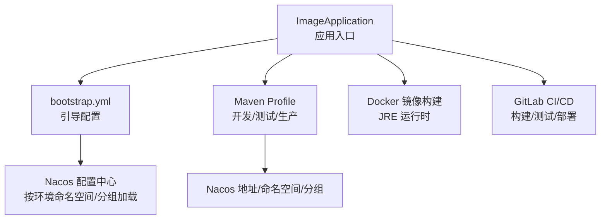
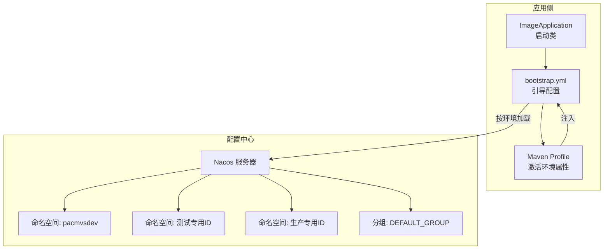
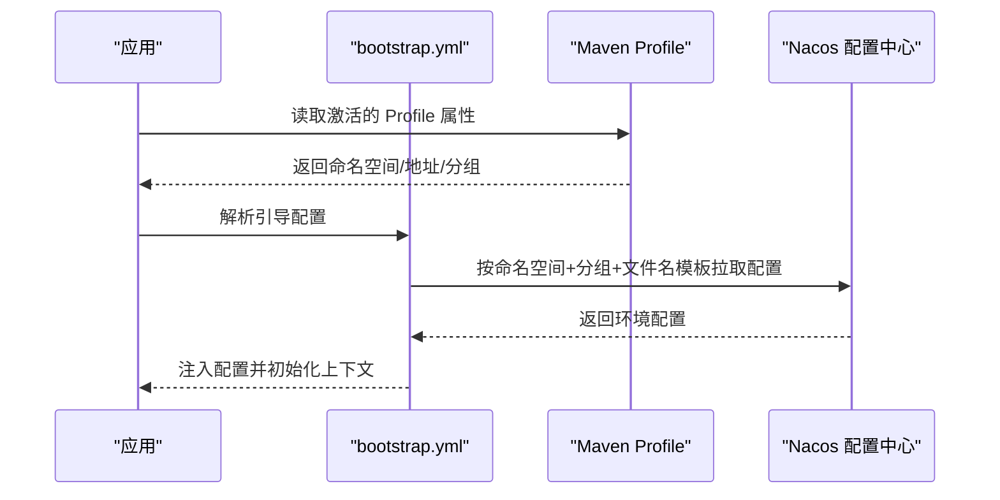
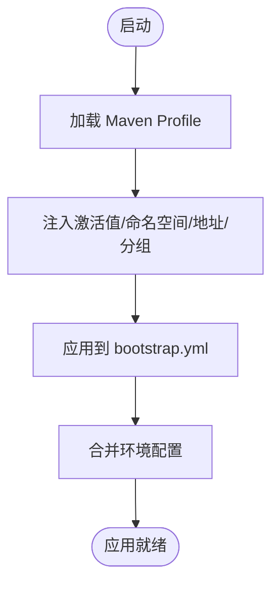
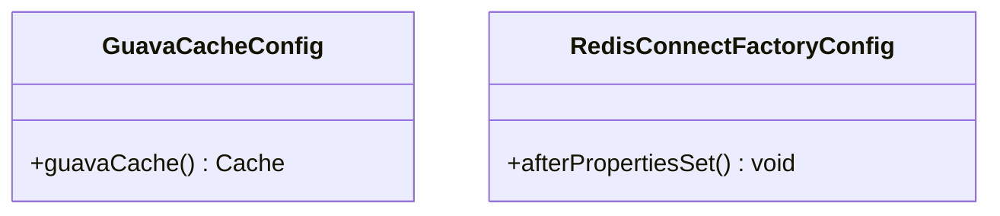
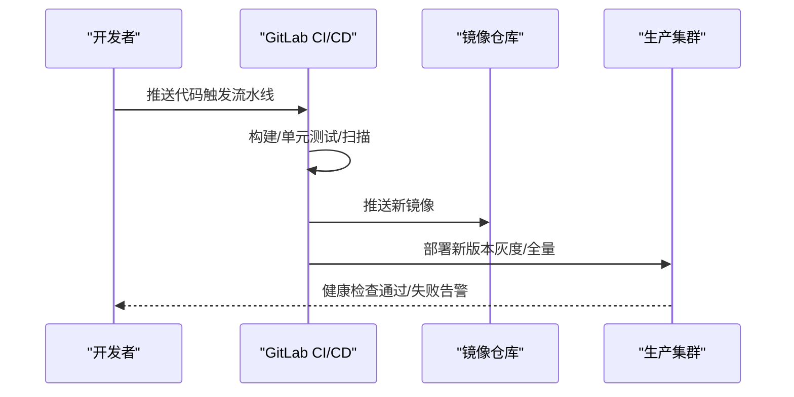
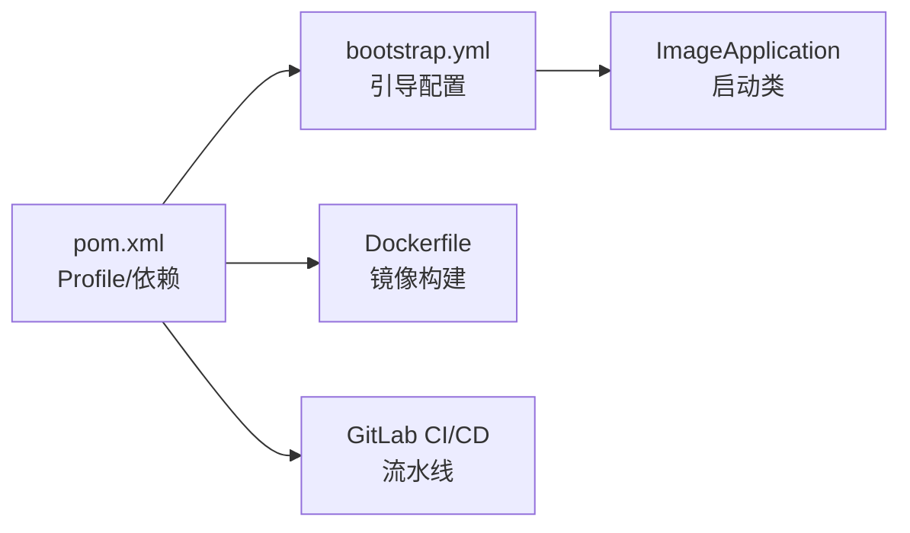

# 多环境部署

<cite>
**本文引用的文件**
- [ImageApplication.java](file://src/main/java/cn/staitech/ImageApplication.java)
- [bootstrap.yml](file://src/main/resources/bootstrap.yml)
- [pom.xml](file://pom.xml)
- [Dockerfile](file://Dockerfile)
- [.gitlab-ci.yml](file://.gitlab-ci.yml)
- [GuavaCacheConfig.java](file://src/main/java/cn/staitech/file/config/GuavaCacheConfig.java)
- [RedisConnectFactoryConfig.java](file://src/main/java/cn/staitech/file/config/RedisConnectFactoryConfig.java)
- [ResourcesConfig.java](file://src/main/java/cn/staitech/file/config/ResourcesConfig.java)
- [RestTemplateConfig.java](file://src/main/java/cn/staitech/file/config/RestTemplateConfig.java)
- [ThreadPoolConfig.java](file://src/main/java/cn/staitech/file/config/ThreadPoolConfig.java)
</cite>

## 目录
1. [引言](#引言)
2. [项目结构](#项目结构)
3. [核心组件](#核心组件)
4. [架构总览](#架构总览)
5. [详细组件分析](#详细组件分析)
6. [依赖分析](#依赖分析)
7. [性能考虑](#性能考虑)
8. [故障排查指南](#故障排查指南)
9. [结论](#结论)
10. [附录](#附录)

## 引言
本文件面向 PACMVS 图像模块（staitech-modules-image）的多环境部署，系统性阐述开发、测试、生产三类环境的配置差异与落地实践，涵盖以下主题：
- Nacos 配置中心：配置文件管理、动态配置更新、环境隔离策略
- Spring Profiles：配置文件激活、属性覆盖、条件配置
- 环境变量管理：敏感信息保护、密钥轮换、配置加密
- 部署策略：部署方式、回滚策略、灰度发布
- 环境切换指南：配置验证、服务测试、故障转移

## 项目结构
该模块采用 Spring Boot + Spring Cloud Alibaba 的标准工程结构，核心入口为应用主类，资源配置通过 bootstrap.yml 与 Maven Profile 协作完成；同时包含若干业务配置类用于缓存、线程池、资源映射等。

图表来源
- [ImageApplication.java:37-45](file://src/main/java/cn/staitech/ImageApplication.java#L37-L45)
- [bootstrap.yml:14-37](file://src/main/resources/bootstrap.yml#L14-L37)
- [pom.xml:348-384](file://pom.xml#L348-L384)
- [Dockerfile:1-16](file://Dockerfile#L1-L16)
- [.gitlab-ci.yml:16-49](file://.gitlab-ci.yml#L16-L49)

章节来源
- [ImageApplication.java:37-45](file://src/main/java/cn/staitech/ImageApplication.java#L37-L45)
- [bootstrap.yml:14-37](file://src/main/resources/bootstrap.yml#L14-L37)
- [pom.xml:348-384](file://pom.xml#L348-L384)
- [Dockerfile:1-16](file://Dockerfile#L1-L16)
- [.gitlab-ci.yml:16-49](file://.gitlab-ci.yml#L16-L49)

## 核心组件
- 应用入口与装配
  - 启动类启用调度、WebSocket、Swagger、Feign 客户端、事务管理、发现客户端等能力，并设置 JVM 时区。
- 引导配置（bootstrap.yml）
  - 指定应用名、Tomcat 端口、Spring Profile 激活占位符、Nacos 注册与配置中心地址、命名空间、分组以及共享配置文件模板。
- Maven Profile（pom.xml）
  - 定义开发、测试、生产三套 Profile，分别注入激活值、Nacos 命名空间、地址与分组，实现环境隔离。
- Docker 构建
  - 使用 Maven 构建产物，基于 JRE 运行时镜像，暴露容器端口并以 Java -jar 方式运行。
- CI/CD 流水线
  - 定义构建、测试、部署阶段，部署阶段默认指向 production 环境。

章节来源
- [ImageApplication.java:37-45](file://src/main/java/cn/staitech/ImageApplication.java#L37-L45)
- [bootstrap.yml:14-37](file://src/main/resources/bootstrap.yml#L14-L37)
- [pom.xml:348-384](file://pom.xml#L348-L384)
- [Dockerfile:1-16](file://Dockerfile#L1-L16)
- [.gitlab-ci.yml:16-49](file://.gitlab-ci.yml#L16-L49)

## 架构总览
下图展示应用如何通过 bootstrap.yml 与 Maven Profile 结合 Nacos 实现多环境配置加载与服务注册/发现。

图表来源
- [bootstrap.yml:14-37](file://src/main/resources/bootstrap.yml#L14-L37)
- [pom.xml:350-382](file://pom.xml#L350-L382)

章节来源
- [bootstrap.yml:14-37](file://src/main/resources/bootstrap.yml#L14-L37)
- [pom.xml:350-382](file://pom.xml#L350-L382)

## 详细组件分析

### Nacos 配置中心与环境隔离
- 配置文件管理
  - 通过共享配置模板加载当前环境的配置文件，文件扩展名为 yml，命名空间与分组由 Profile 注入。
- 动态配置更新
  - Spring Cloud Alibaba Nacos Config 提供动态刷新能力，建议结合 @RefreshScope 或监听变更事件实现配置热更新。
- 环境隔离策略
  - 不同环境使用独立命名空间与地址，避免配置互相污染；分组统一为 DEFAULT_GROUP，便于集中管理。

图表来源
- [bootstrap.yml:14-37](file://src/main/resources/bootstrap.yml#L14-L37)
- [pom.xml:350-382](file://pom.xml#L350-L382)

章节来源
- [bootstrap.yml:14-37](file://src/main/resources/bootstrap.yml#L14-L37)
- [pom.xml:350-382](file://pom.xml#L350-L382)

### Spring Profiles 使用与属性覆盖
- 配置文件激活
  - 通过 Profile ID 激活不同环境，ID 与命名空间、地址、分组一一对应。
- 属性覆盖
  - 在各 Profile 中定义激活值与 Nacos 参数，最终由 bootstrap.yml 注入到运行时。
- 条件配置
  - 可在业务代码中使用 @Profile 或 @ConditionalOnProperty 等条件注解实现按环境启用/禁用特定 Bean 或逻辑。

图表来源
- [pom.xml:348-384](file://pom.xml#L348-L384)
- [bootstrap.yml:14-16](file://src/main/resources/bootstrap.yml#L14-L16)

章节来源
- [pom.xml:348-384](file://pom.xml#L348-L384)
- [bootstrap.yml:14-16](file://src/main/resources/bootstrap.yml#L14-L16)

### 环境变量管理与安全
- 敏感信息保护
  - 将数据库密码、第三方密钥等放入 Nacos 环境配置中，避免硬编码在代码或镜像中。
- 密钥轮换
  - 通过 Nacos 配置中心进行密钥替换与滚动更新，配合健康检查与灰度发布降低风险。
- 配置加密
  - 建议在 Nacos 侧启用配置加密功能（如使用 KMS），并在应用侧配置解密器以透明解密。

章节来源
- [bootstrap.yml:18-34](file://src/main/resources/bootstrap.yml#L18-L34)

### 缓存与连接配置
- Guava 本地缓存
  - 提供本地缓存 Bean，适用于轻量场景；注意在分布式环境中需关注缓存一致性。
- Redis 连接工厂
  - 针对 Lettuce 连接工厂开启连接校验，提升连接稳定性。

图表来源
- [GuavaCacheConfig.java:17-26](file://src/main/java/cn/staitech/file/config/GuavaCacheConfig.java#L17-L26)
- [RedisConnectFactoryConfig.java:10-25](file://src/main/java/cn/staitech/file/config/RedisConnectFactoryConfig.java#L10-L25)

章节来源
- [GuavaCacheConfig.java:17-26](file://src/main/java/cn/staitech/file/config/GuavaCacheConfig.java#L17-L26)
- [RedisConnectFactoryConfig.java:10-25](file://src/main/java/cn/staitech/file/config/RedisConnectFactoryConfig.java#L10-L25)

### 资源映射与跨域
- 本地文件资源映射
  - 通过 @Value 注入文件路径与前缀，将静态资源映射到本地文件系统。
- 跨域支持
  - 针对静态资源开放跨域访问，限定方法为 GET。

章节来源
- [ResourcesConfig.java:17-50](file://src/main/java/cn/staitech/file/config/ResourcesConfig.java#L17-L50)

### 线程池与异步任务
- OpenSlide 处理线程池
  - 基于 CPU 核数动态调整线程规模，阻塞队列容量大，拒绝策略采用调用者线程执行兜底。
- Python 脚本执行线程池
  - 线程规模更小，拒绝策略同样兜底，适合 IO 密集型任务。

章节来源
- [ThreadPoolConfig.java:10-65](file://src/main/java/cn/staitech/file/config/ThreadPoolConfig.java#L10-L65)

### RestTemplate 与负载均衡
- 负载均衡
  - 通过 @LoadBalanced 注解启用服务名直连与客户端负载均衡。
- 超时与消息转换
  - 统一设置连接/读取/请求超时，配置 JSON 转换器支持 UTF-8。

章节来源
- [RestTemplateConfig.java:21-49](file://src/main/java/cn/staitech/file/config/RestTemplateConfig.java#L21-L49)

### 部署策略与流水线
- 部署方式
  - 使用 Docker 镜像运行，容器暴露端口并通过 CMD 启动应用。
- 回滚策略
  - 建议采用蓝绿/滚动回滚，保留上一个版本镜像以便快速回退。
- 灰度发布
  - 通过网关或服务网格进行流量切分，先对小部分用户放量，再逐步扩大比例。

图表来源
- [.gitlab-ci.yml:16-49](file://.gitlab-ci.yml#L16-L49)
- [Dockerfile:1-16](file://Dockerfile#L1-L16)

章节来源
- [.gitlab-ci.yml:16-49](file://.gitlab-ci.yml#L16-L49)
- [Dockerfile:1-16](file://Dockerfile#L1-L16)

### 环境切换指南
- 配置验证
  - 启动后检查日志是否正确加载了目标环境的 Nacos 配置；可通过 Actuator 暴露的配置端点核对生效值。
- 服务测试
  - 执行接口测试与集成测试，确保数据库连接、缓存、外部服务调用均按预期工作。
- 故障转移
  - 若 Nacos 不可用，建议提供本地 fallback 配置或降级策略；同时监控服务注册状态与健康检查指标。

章节来源
- [bootstrap.yml:14-37](file://src/main/resources/bootstrap.yml#L14-L37)
- [ImageApplication.java:37-45](file://src/main/java/cn/staitech/ImageApplication.java#L37-L45)

## 依赖分析
- 应用与配置
  - 应用启动类依赖 Spring Boot 自动装配与 Nacos Discovery/Config；bootstrap.yml 与 Maven Profile 共同决定运行时配置。
- 构建与运行
  - Maven Profile 注入 Nacos 地址与命名空间；Dockerfile 基于 JRE 运行时镜像；CI/CD 定义流水线阶段。

图表来源
- [pom.xml:348-384](file://pom.xml#L348-L384)
- [bootstrap.yml:14-37](file://src/main/resources/bootstrap.yml#L14-L37)
- [ImageApplication.java:37-45](file://src/main/java/cn/staitech/ImageApplication.java#L37-L45)
- [Dockerfile:1-16](file://Dockerfile#L1-L16)
- [.gitlab-ci.yml:16-49](file://.gitlab-ci.yml#L16-L49)

章节来源
- [pom.xml:348-384](file://pom.xml#L348-L384)
- [bootstrap.yml:14-37](file://src/main/resources/bootstrap.yml#L14-L37)
- [ImageApplication.java:37-45](file://src/main/java/cn/staitech/ImageApplication.java#L37-L45)
- [Dockerfile:1-16](file://Dockerfile#L1-L16)
- [.gitlab-ci.yml:16-49](file://.gitlab-ci.yml#L16-L49)

## 性能考虑
- 线程池规模
  - OpenSlide 与 Python 任务线程池根据 CPU 核数自适应，建议结合实际任务类型与资源限制微调。
- 缓存策略
  - 本地缓存适用于热点数据，分布式场景建议引入 Redis 并开启持久化与过期策略。
- 超时与重试
  - 对外调用设置合理超时与指数退避重试，避免雪崩效应。

## 故障排查指南
- Nacos 连接失败
  - 检查 Profile 是否正确注入地址与命名空间；确认网络可达与鉴权配置。
- 配置未生效
  - 核对共享配置文件名模板与命名空间；确认分组一致；必要时手动刷新或重启应用。
- 缓存/连接异常
  - 检查 Redis 连接工厂配置与连接池参数；观察线程池拒绝策略日志。
- 部署失败
  - 查看 CI 日志与容器健康检查；核对镜像版本与环境变量。

章节来源
- [bootstrap.yml:18-34](file://src/main/resources/bootstrap.yml#L18-L34)
- [RedisConnectFactoryConfig.java:18-24](file://src/main/java/cn/staitech/file/config/RedisConnectFactoryConfig.java#L18-L24)
- [ThreadPoolConfig.java:28-38](file://src/main/java/cn/staitech/file/config/ThreadPoolConfig.java#L28-L38)
- [.gitlab-ci.yml:24-49](file://.gitlab-ci.yml#L24-L49)

## 结论
本项目通过 Maven Profile 与 Nacos 配置中心实现了清晰的多环境隔离与动态配置管理；结合 Docker 与 CI/CD 形成标准化的交付流程。建议在生产环境进一步完善配置加密、密钥轮换与灰度发布机制，持续优化线程池与缓存策略，确保高可用与可运维性。

## 附录
- 环境参数速览
  - 开发环境：命名空间与地址由开发机 Nacos 提供
  - 测试环境：命名空间与地址指向测试 Nacos
  - 生产环境：命名空间与地址指向生产 Nacos
- 建议补充
  - 在 Nacos 中为各环境建立只读备份与审计日志
  - 为敏感配置启用 KMS 加密与最小权限访问控制
  - 在 CI 中增加部署后健康检查与自动回滚策略