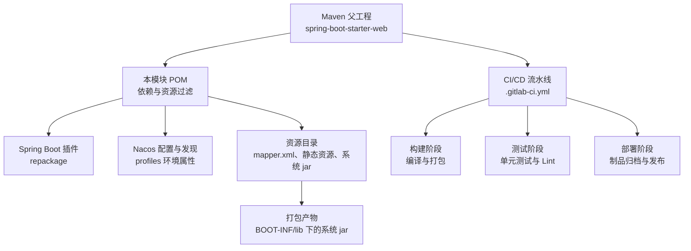
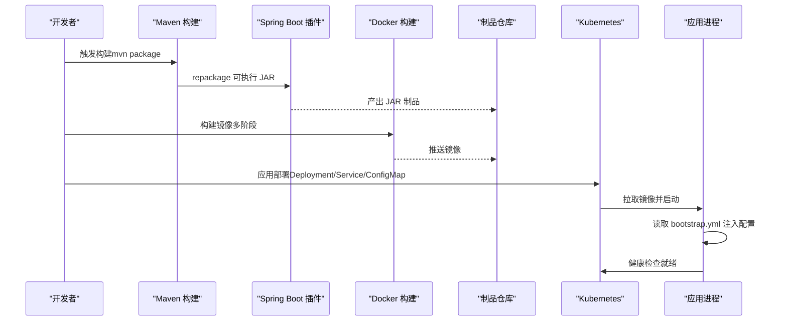
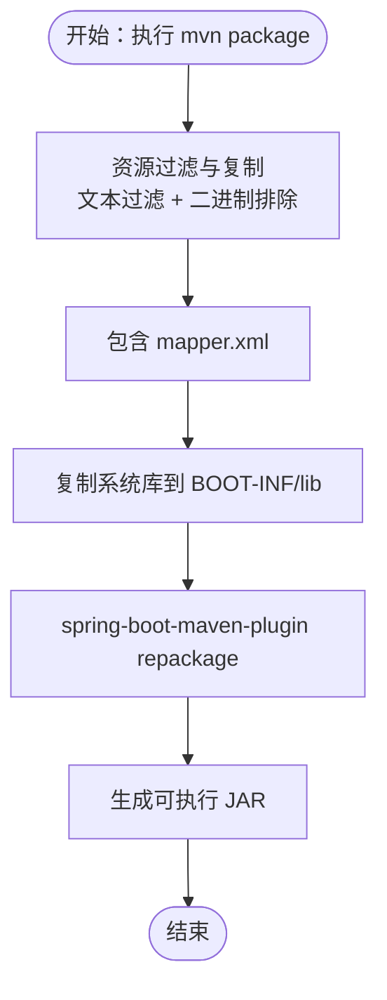
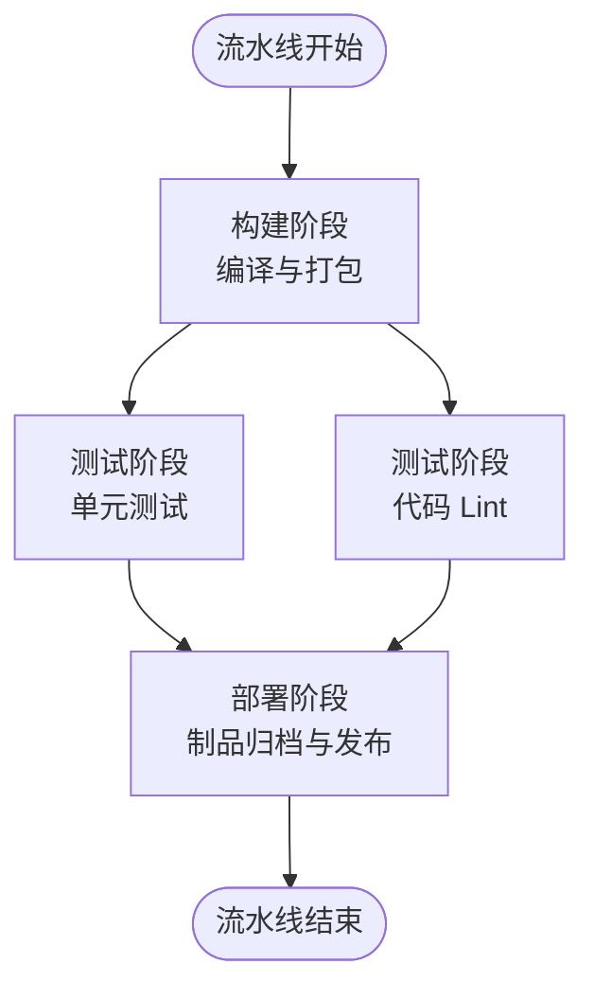
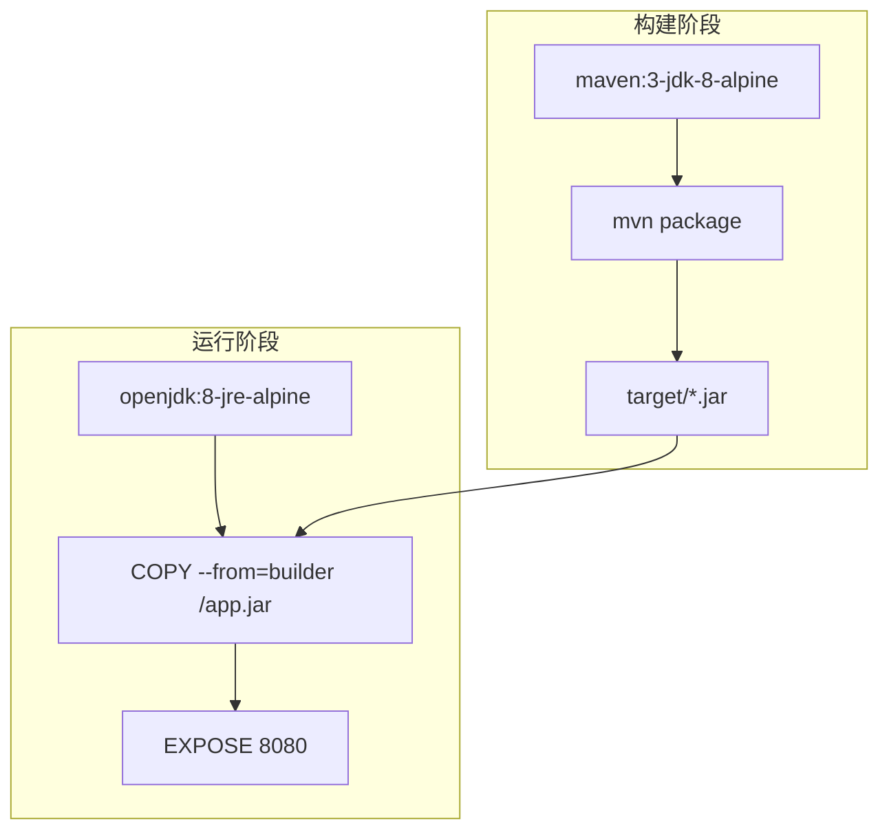
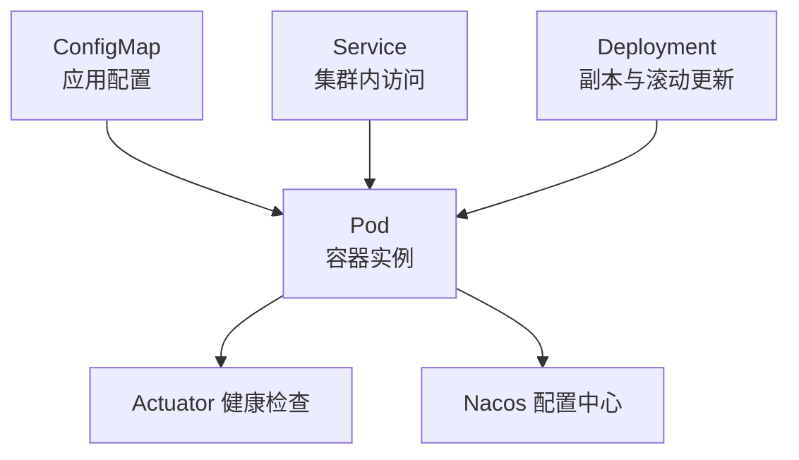
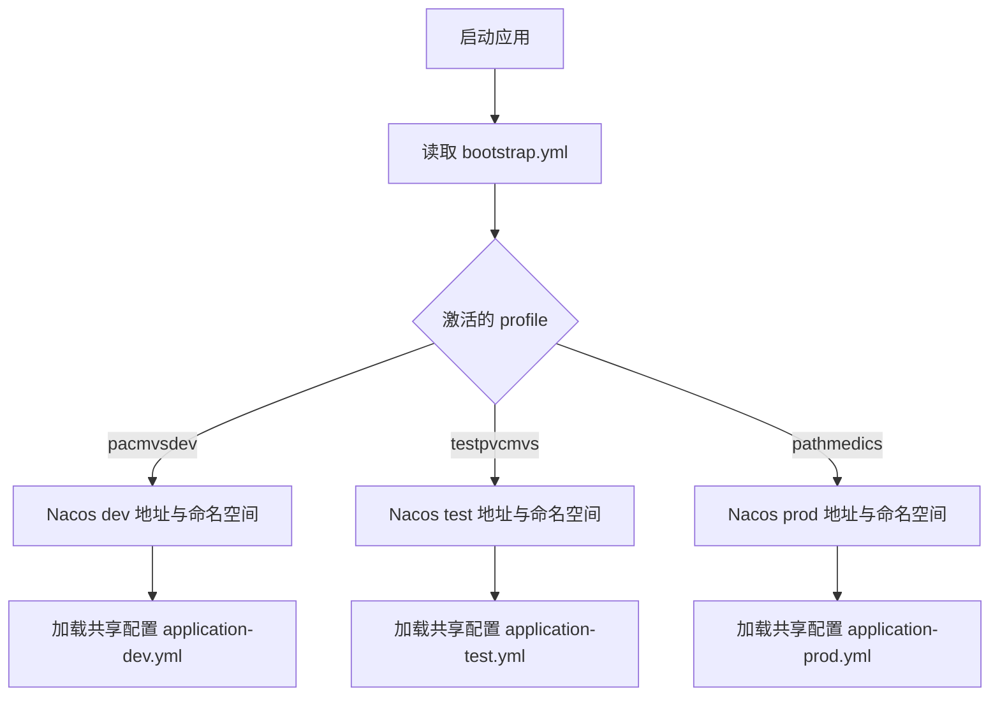
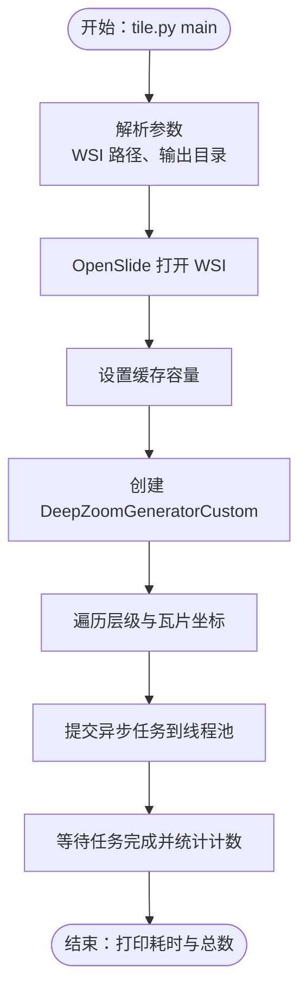
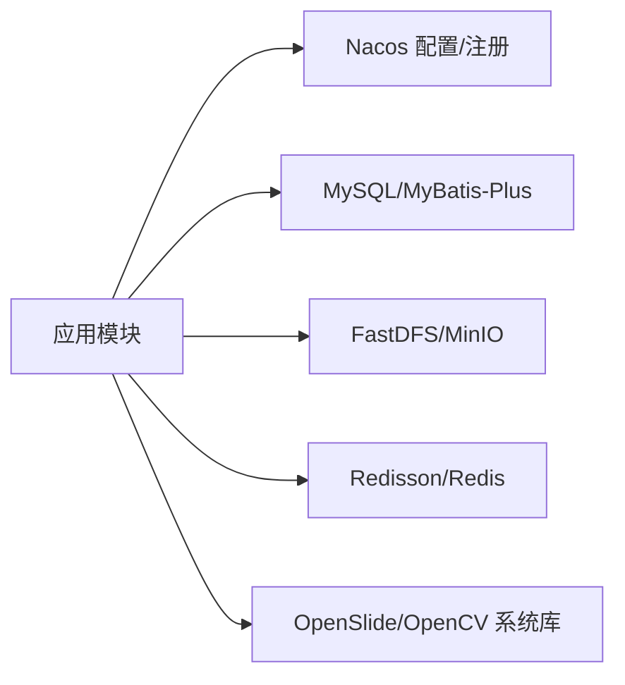

# 构建与部署

<cite>
**本文引用的文件**
- [pom.xml](file://pom.xml)
- [.gitlab-ci.yml](file://.gitlab-ci.yml)
- [Dockerfile](file://Dockerfile)
- [docker\staitech\modules\image\Dockerfile](file://docker\staitech\modules\image\Dockerfile)
- [src\main\resources\bootstrap.yml](file://src\main\resources\bootstrap.yml)
- [.mvn\wrapper\maven-wrapper.properties](file://.mvn\wrapper\maven-wrapper.properties)
- [mvnw.cmd](file://mvnw.cmd)
- [docker\staitech\modules\image\script\deepzoom_custom.py](file://docker\staitech\modules\image\script\deepzoom_custom.py)
- [docker\staitech\modules\image\script\tile.py](file://docker\staitech\modules\image\script\tile.py)
- [python-script\deepzoom_custom.py](file://python-script\deepzoom_custom.py)
- [python-script\tile.py](file://python-script\tile.py)
</cite>

## 目录
1. [简介](#简介)
2. [项目结构](#项目结构)
3. [核心组件](#核心组件)
4. [架构总览](#架构总览)
5. [详细组件分析](#详细组件分析)
6. [依赖关系分析](#依赖关系分析)
7. [性能考虑](#性能考虑)
8. [故障排查指南](#故障排查指南)
9. [结论](#结论)
10. [附录](#附录)

## 简介
本指南面向 PACMVS 图像模块后端服务的构建与部署，覆盖 Maven 构建配置、CI/CD 流水线、Docker 镜像构建、Kubernetes 部署要点、环境配置管理以及部署脚本与回滚策略建议。文档以仓库现有配置为基础，结合实际代码结构给出可操作的实践步骤与最佳实践。

## 项目结构
该模块为基于 Spring Boot 的微服务，采用 Maven 多模块父工程，核心特性包括：
- 通过 Spring Cloud Alibaba Nacos 进行服务注册与配置中心集成
- 使用 MyBatis-Plus 与自定义 Mapper XML 实现数据访问
- 内嵌静态资源与系统库（OpenSlide、OpenCV）支持 WSI 切片处理
- 提供 Python 脚本用于瓦片生成与颜色空间转换
- 提供基础 Dockerfile 与增强版 Dockerfile（含 Python、JNI 库）

图表来源
- [pom.xml:1-385](file://pom.xml#L1-L385)
- [.gitlab-ci.yml:1-50](file://.gitlab-ci.yml#L1-L50)

章节来源
- [pom.xml:1-385](file://pom.xml#L1-L385)
- [.gitlab-ci.yml:1-50](file://.gitlab-ci.yml#L1-L50)

## 核心组件
- Maven 构建与生命周期
  - 使用 Maven Wrapper 与 maven-wrapper.properties 固定版本，确保团队一致性
  - 通过 spring-boot-maven-plugin 进行 repackage，生成可执行 JAR
  - 资源过滤策略区分文本与二进制文件，避免破坏本地 JNI/动态库
  - 通过 profiles 定义开发、测试、生产三套环境变量（Nacos 地址、命名空间、分组）
- CI/CD 流水线
  - 包含 build、test、deploy 三个阶段，引入依赖扫描模板
  - 当前示例脚本为占位符，建议替换为真实构建、测试与制品上传命令
- Docker 镜像
  - 基础 Dockerfile：多阶段构建，先在 Maven 基础镜像中编译，再拷贝至最小运行时镜像
  - 增强 Dockerfile：安装 Python3、pip、openslide-bin，复制系统库与脚本，暴露服务端口并启动 Java 应用
- 环境配置
  - bootstrap.yml 通过占位符注入激活的 profile 与 Nacos 地址，实现环境解耦
  - 资源目录包含共享配置目录，便于统一管理

章节来源
- [pom.xml:229-346](file://pom.xml#L229-L346)
- [pom.xml:348-385](file://pom.xml#L348-L385)
- [.gitlab-ci.yml:16-50](file://.gitlab-ci.yml#L16-L50)
- [Dockerfile:1-16](file://Dockerfile#L1-L16)
- [docker\staitech\modules\image\Dockerfile:1-46](file://docker\staitech\modules\image\Dockerfile#L1-L46)
- [src\main\resources\bootstrap.yml:1-37](file://src\main\resources\bootstrap.yml#L1-L37)

## 架构总览
下图展示从代码到容器再到运行时的整体流程，包括 Maven 构建、Docker 多阶段构建、Nacos 配置注入与服务启动。

图表来源
- [pom.xml:325-344](file://pom.xml#L325-L344)
- [Dockerfile:1-16](file://Dockerfile#L1-L16)
- [src\main\resources\bootstrap.yml:1-37](file://src\main\resources\bootstrap.yml#L1-L37)

## 详细组件分析

### Maven 构建配置
- 依赖管理
  - 引入 Spring Cloud Alibaba Nacos Discovery/Config、Sentinel、Actuator、Swagger、MyBatis-Plus、Redisson、FastDFS、MinIO、OpenSlide、OpenCV、JNA、Micrometer-Prometheus、Hutool 等
  - 本地系统库通过 systemPath 方式打包进 BOOT-INF/lib，避免外部依赖缺失
- 资源过滤与打包
  - 文本资源启用过滤，二进制资源（DLL/SO/DYLIB/JAR/图片等）排除过滤，防止损坏
  - 显式包含 mapper.xml，确保 SQL 映射文件被打包
  - 引入通用共享配置目录，便于跨环境复用
- 插件配置
  - spring-boot-maven-plugin：repackage 生成可执行 JAR；对特定依赖（如 OpenCV）标记需要解包
  - maven-resources-plugin：显式声明非过滤扩展名，保证二进制文件正确复制
- 构建生命周期
  - 使用 Maven Wrapper（mvnw.cmd/.mvn/wrapper）确保一致的构建环境
- 环境配置
  - 通过 profiles 定义 pacmvsdev/testpvcmvs/pathmedics 三套环境，分别注入 Nacos 地址、命名空间、分组与激活属性

图表来源
- [pom.xml:229-302](file://pom.xml#L229-L302)
- [pom.xml:305-344](file://pom.xml#L305-L344)

章节来源
- [pom.xml:23-205](file://pom.xml#L23-L205)
- [pom.xml:229-302](file://pom.xml#L229-L302)
- [pom.xml:305-344](file://pom.xml#L305-L344)
- [pom.xml:348-385](file://pom.xml#L348-L385)
- [.mvn\wrapper\maven-wrapper.properties:1-2](file://.mvn\wrapper\maven-wrapper.properties#L1-L2)
- [mvnw.cmd:1-144](file://mvnw.cmd#L1-L144)

### CI/CD 流水线配置
- 阶段划分
  - build：编译与打包（建议替换为真实构建命令）
  - test：单元测试与 Lint（建议替换为真实测试命令）
  - deploy：生产环境部署（当前为占位）
- 安全扫描
  - 引入 Dependency-Scanning 模板，建议在 CI 中启用并配置报告输出
- 环境变量与制品
  - 建议在流水线中注入 Maven/Gradle 构建所需的环境变量（如 JAVA_HOME、MAVEN_OPTS）
  - 将构建产物（JAR/镜像）上传至制品库或镜像仓库

图表来源
- [.gitlab-ci.yml:16-50](file://.gitlab-ci.yml#L16-L50)

章节来源
- [.gitlab-ci.yml:1-50](file://.gitlab-ci.yml#L1-L50)

### Docker 镜像构建
- 基础 Dockerfile（多阶段）
  - 构建阶段：基于 maven:3-jdk-8-alpine，复制源码并执行 mvn package
  - 运行阶段：基于 openjdk:8-jre-alpine，复制 JAR 至 /app.jar，暴露 8080，入口为 java -jar
- 增强 Dockerfile（含 Python 与系统库）
  - 安装 Python3、pip，配置国内镜像源，安装 openslide-bin
  - 复制 OpenCV、OpenSlide、libvips 的 JNI 与二进制库至 /usr/lib，设置权限并刷新库缓存
  - 暴露 9083 端口，挂载附件、上传、切片与工作目录，启动 Java 应用
- 优化建议
  - 减少层数：合并 RUN 指令，清理包管理器缓存
  - 安全扫描：在 CI 中集成镜像漏洞扫描
  - 运行用户：以非 root 用户运行应用，降低攻击面
  - 健康检查：添加 HEALTHCHECK 指令，结合 Actuator 健康端点

图表来源
- [Dockerfile:1-16](file://Dockerfile#L1-L16)

章节来源
- [Dockerfile:1-16](file://Dockerfile#L1-L16)
- [docker\staitech\modules\image\Dockerfile:1-46](file://docker\staitech\modules\image\Dockerfile#L1-L46)

### Kubernetes 部署配置
以下为常用 YAML 组件的编写要点（概念性说明，非具体文件映射）：
- Deployment
  - 设置副本数、滚动更新策略（maxUnavailable、maxSurge）
  - 挂载 ConfigMap 与 Secret，注入环境变量
  - 健康检查：livenessProbe/readinessProbe
- Service
  - ClusterIP/NodePort/LoadBalancer 类型选择，暴露端口与协议
- ConfigMap
  - 存放应用配置（如 bootstrap.yml 中的 Nacos 地址、命名空间、分组）
- Pod 安全与资源
  - 设置资源请求与限制，启用 PodSecurityContext
- 蓝绿/金丝雀发布
  - 通过标签区分新旧版本，逐步切换流量

（本图为概念图，无需图表来源）

### 环境配置管理
- bootstrap.yml
  - 激活 profile：@activatedProperties@
  - Nacos 发现与配置中心：@serverAddr@、@nacosNamespace@、@nacosGroup@
  - 共享配置：application-${spring.profiles.active}.${spring.cloud.nacos.config.file-extension}
- Maven Profiles
  - pacmvsdev/testpvcmvs/pathmedics 三套环境，分别注入不同 Nacos 地址与命名空间
- 资源目录
  - 引入 ../conf/devCommons 下的共享 yml 文件，便于统一管理

图表来源
- [src\main\resources\bootstrap.yml:1-37](file://src\main\resources\bootstrap.yml#L1-L37)
- [pom.xml:348-385](file://pom.xml#L348-L385)

章节来源
- [src\main\resources\bootstrap.yml:1-37](file://src\main\resources\bootstrap.yml#L1-L37)
- [pom.xml:348-385](file://pom.xml#L348-L385)

### Python 脚本与瓦片生成
- 功能概述
  - 基于 openslide 与 PIL，实现 WSI 切片生成与颜色空间转换
  - 通过线程池并发处理瓦片，控制并发度与内存占用
- 关键脚本
  - deepzoom_custom.py：自定义 DeepZoom 生成器，适配前端需求与颜色转换
  - tile.py：主流程脚本，接收 WSI 路径与输出目录参数，设置缓存容量并生成瓦片
- 集成方式
  - 在增强 Dockerfile 中复制脚本并在容器内调用
  - 也可通过外部卷挂载或远程调用的方式集成到业务流程

图表来源
- [docker\staitech\modules\image\script\tile.py:1-99](file://docker\staitech\modules\image\script\tile.py#L1-L99)
- [docker\staitech\modules\image\script\deepzoom_custom.py:1-177](file://docker\staitech\modules\image\script\deepzoom_custom.py#L1-L177)

章节来源
- [docker\staitech\modules\image\script\tile.py:1-99](file://docker\staitech\modules\image\script\tile.py#L1-L99)
- [docker\staitech\modules\image\script\deepzoom_custom.py:1-177](file://docker\staitech\modules\image\script\deepzoom_custom.py#L1-L177)
- [python-script\tile.py:1-103](file://python-script\tile.py#L1-L103)
- [python-script\deepzoom_custom.py:1-153](file://python-script\deepzoom_custom.py#L1-L153)

## 依赖关系分析
- 组件耦合
  - 应用通过 Nacos 进行配置与服务发现，与数据库、对象存储（MinIO/FastDFS）、缓存（Redisson/Redis）存在运行时耦合
  - 本地系统库（OpenSlide、OpenCV）通过 Maven 资源打包进入 JAR，减少外部依赖复杂度
- 外部依赖
  - Spring Cloud Alibaba 生态（Nacos、Sentinel）、MyBatis-Plus、Micrometer-Prometheus、Hutool 等
- 潜在风险
  - systemPath 依赖需确保目标平台一致
  - Python 依赖与系统库版本需与容器环境匹配

（本图为概念图，无需图表来源）

## 性能考虑
- 构建性能
  - 使用 Maven Wrapper 固定版本，避免构建漂移
  - 合理配置并行度与内存参数（MAVEN_OPTS），提升 CI 并行构建效率
- 运行性能
  - 通过 Micrometer-Prometheus 暴露指标，结合 Grafana/Loki 监控
  - 合理设置线程池大小与缓存容量，避免内存溢出
- 镜像体积
  - 多阶段构建减少运行时镜像体积
  - 清理包管理器缓存与临时文件，合并 RUN 指令

（本节为通用指导，无需章节来源）

## 故障排查指南
- 构建失败
  - 检查 JAVA_HOME 是否配置，Maven 版本是否与 wrapper 一致
  - 确认 systemPath 的本地库路径是否存在且可读
- 配置无法生效
  - 确认 bootstrap.yml 中占位符已被正确替换（Maven filter）
  - 检查 Nacos 地址、命名空间、分组是否与 profiles 一致
- 服务启动异常
  - 查看 Actuator 健康检查端点与日志
  - 确认端口未被占用，网络策略允许访问
- 镜像运行问题
  - 确认 /usr/lib 下系统库已复制并可加载（ldconfig）
  - 检查 Python 依赖与 openslide-bin 版本兼容性

章节来源
- [mvnw.cmd:58-78](file://mvnw.cmd#L58-L78)
- [.mvn\wrapper\maven-wrapper.properties:1-2](file://.mvn\wrapper\maven-wrapper.properties#L1-L2)
- [src\main\resources\bootstrap.yml:1-37](file://src\main\resources\bootstrap.yml#L1-L37)
- [docker\staitech\modules\image\Dockerfile:31-36](file://docker\staitech\modules\image\Dockerfile#L31-L36)

## 结论
本指南基于仓库现有配置，给出了从 Maven 构建、CI/CD 流水线、Docker 镜像到 Kubernetes 部署的完整实践路径。建议在现有基础上补充真实构建与测试命令、完善安全扫描与镜像优化，并结合监控与告警体系持续改进。

## 附录
- 部署脚本与回滚策略建议
  - 蓝绿部署：准备两套 Deployment（green/blue），通过 Service 标签切换流量，回滚时只需切换标签
  - 滚动更新：设置 maxUnavailable 与 maxSurge，结合 readinessProbe 保障平滑过渡
  - 回滚：利用 Kubernetes 历史版本回滚（rollout undo），并保留配置备份
- 配置清单参考
  - Deployment：副本数、滚动更新策略、健康检查、资源限制
  - Service：端口映射、类型选择
  - ConfigMap：应用配置与 Nacos 参数
  - Secret：敏感信息（数据库密码、MinIO 密钥等）

（本节为通用指导，无需章节来源）