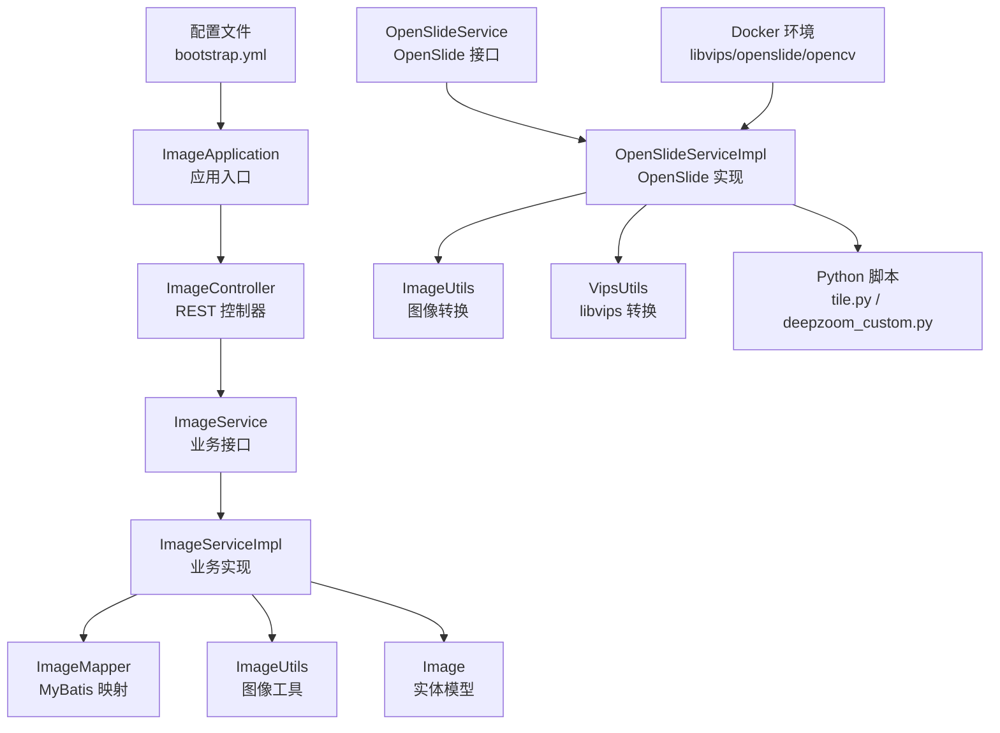
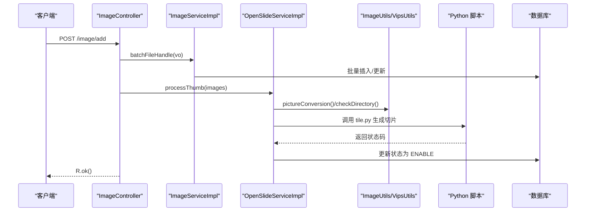
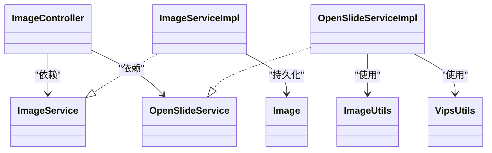

# 测试指南

<cite>
**本文引用的文件**
- [pom.xml](file://pom.xml)
- [.gitlab-ci.yml](file://.gitlab-ci.yml)
- [ImageApplication.java](file://src/main/java/cn/staitech/ImageApplication.java)
- [ImageController.java](file://src/main/java/cn/staitech/file/controller/ImageController.java)
- [ImageService.java](file://src/main/java/cn/staitech/file/service/ImageService.java)
- [ImageServiceImpl.java](file://src/main/java/cn/staitech/file/service/impl/ImageServiceImpl.java)
- [OpenSlideService.java](file://src/main/java/cn/staitech/file/service/OpenSlideService.java)
- [OpenSlideServiceImpl.java](file://src/main/java/cn/staitech/file/service/impl/OpenSlideServiceImpl.java)
- [ImageUtils.java](file://src/main/java/cn/staitech/file/util/ImageUtils.java)
- [VipsUtils.java](file://src/main/java/cn/staitech/file/util/VipsUtils.java)
- [Image.java](file://src/main/java/cn/staitech/file/domain/Image.java)
- [ImageConstant.java](file://src/main/java/cn/staitech/file/constant/ImageConstant.java)
- [bootstrap.yml](file://src/main/resources/bootstrap.yml)
- [ImageMapper.java](file://src/main/java/cn/staitech/file/mapper/ImageMapper.java)
- [ImageMapper.xml](file://src/main/resources/mapper/ImageMapper.xml)
- [docker/Dockerfile](file://docker/staitech/modules/image/Dockerfile)
- [docker/libvips/bin/vips-8.7](file://docker/staitech/modules/image/libvips/bin/vips-8.7)
- [docker/opencv-java-jni](file://docker/staitech/modules/image/opencv-java-jni)
- [docker/openslide-java-jni](file://docker/staitech/modules/image/openslide-java-jni)
- [python-script/deepzoom_custom.py](file://python-script/deepzoom_custom.py)
- [python-script/tile.py](file://python-script/tile.py)
</cite>

## 目录
1. [简介](#简介)
2. [项目结构](#项目结构)
3. [核心组件](#核心组件)
4. [架构总览](#架构总览)
5. [详细组件分析](#详细组件分析)
6. [依赖关系分析](#依赖关系分析)
7. [性能考量](#性能考量)
8. [故障排查指南](#故障排查指南)
9. [结论](#结论)
10. [附录](#附录)

## 简介
本测试指南面向 PACMVS 图像模块（原始切片解析服务），围绕单元测试、集成测试、图像处理功能测试、测试数据准备与清理、覆盖率与质量门禁、以及测试工具配置等方面，提供系统化、可落地的测试实践建议。文档以仓库现有代码为依据，结合 Spring Boot、MyBatis Plus、OpenSlide、OpenCV、libvips、Python 切片脚本等技术栈，给出可直接参考的测试策略与实施步骤。

## 项目结构
该模块采用 Spring Boot 应用结构，核心由控制器、服务、工具类、Mapper/XML、常量与配置组成；同时包含 Docker 化的 libvips、OpenSlide、OpenCV 依赖与 Python 切片脚本，便于在容器环境中复现真实运行环境。

图表来源
- [ImageApplication.java:37-52](file://src/main/java/cn/staitech/ImageApplication.java#L37-L52)
- [ImageController.java:30-71](file://src/main/java/cn/staitech/file/controller/ImageController.java#L30-L71)
- [ImageServiceImpl.java:42-140](file://src/main/java/cn/staitech/file/service/impl/ImageServiceImpl.java#L42-L140)
- [OpenSlideServiceImpl.java:47-378](file://src/main/java/cn/staitech/file/service/impl/OpenSlideServiceImpl.java#L47-L378)
- [ImageUtils.java:20-97](file://src/main/java/cn/staitech/file/util/ImageUtils.java#L20-L97)
- [VipsUtils.java:11-36](file://src/main/java/cn/staitech/file/util/VipsUtils.java#L11-L36)
- [Image.java:27-216](file://src/main/java/cn/staitech/file/domain/Image.java#L27-L216)
- [bootstrap.yml](file://src/main/resources/bootstrap.yml)

章节来源
- [ImageApplication.java:37-52](file://src/main/java/cn/staitech/ImageApplication.java#L37-L52)
- [ImageController.java:30-71](file://src/main/java/cn/staitech/file/controller/ImageController.java#L30-L71)
- [ImageServiceImpl.java:42-140](file://src/main/java/cn/staitech/file/service/impl/ImageServiceImpl.java#L42-L140)
- [OpenSlideServiceImpl.java:47-378](file://src/main/java/cn/staitech/file/service/impl/OpenSlideServiceImpl.java#L47-L378)
- [ImageUtils.java:20-97](file://src/main/java/cn/staitech/file/util/ImageUtils.java#L20-L97)
- [VipsUtils.java:11-36](file://src/main/java/cn/staitech/file/util/VipsUtils.java#L11-L36)
- [Image.java:27-216](file://src/main/java/cn/staitech/file/domain/Image.java#L27-L216)
- [bootstrap.yml](file://src/main/resources/bootstrap.yml)

## 核心组件
- 控制器层：提供对外 REST 接口，负责接收请求并协调服务层完成业务处理。
- 业务层：
  - ImageService：定义图像入库、文件信息上传、批量处理等核心业务。
  - OpenSlideService：负责 OpenSlide 解析、缩略图生成、切片任务提交与状态管理。
- 工具层：
  - ImageUtils：文件名校验、目录检查、OpenSlide 可用性检测与非金字塔 TIFF 转换。
  - VipsUtils：基于 libvips 的 JPEG 到金字塔 TIFF 转换。
- 数据层：MyBatis Plus 映射与 XML，配合 Image 实体完成持久化。
- 配置与环境：Dockerfile 与依赖库、Python 脚本、Nacos/配置中心等。

章节来源
- [ImageController.java:30-71](file://src/main/java/cn/staitech/file/controller/ImageController.java#L30-L71)
- [ImageService.java](file://src/main/java/cn/staitech/file/service/ImageService.java)
- [ImageServiceImpl.java:42-140](file://src/main/java/cn/staitech/file/service/impl/ImageServiceImpl.java#L42-L140)
- [OpenSlideService.java](file://src/main/java/cn/staitech/file/service/OpenSlideService.java)
- [OpenSlideServiceImpl.java:47-378](file://src/main/java/cn/staitech/file/service/impl/OpenSlideServiceImpl.java#L47-L378)
- [ImageUtils.java:20-97](file://src/main/java/cn/staitech/file/util/ImageUtils.java#L20-L97)
- [VipsUtils.java:11-36](file://src/main/java/cn/staitech/file/util/VipsUtils.java#L11-L36)
- [Image.java:27-216](file://src/main/java/cn/staitech/file/domain/Image.java#L27-L216)
- [ImageMapper.java](file://src/main/java/cn/staitech/file/mapper/ImageMapper.java)
- [ImageMapper.xml](file://src/main/resources/mapper/ImageMapper.xml)

## 架构总览
下图展示从控制器到服务、工具与外部依赖的整体交互，突出 OpenSlide 解析、libvips 转换、Python 切片脚本调用与日志审计的关键链路。

图表来源
- [ImageController.java:42-48](file://src/main/java/cn/staitech/file/controller/ImageController.java#L42-L48)
- [ImageServiceImpl.java:63-140](file://src/main/java/cn/staitech/file/service/impl/ImageServiceImpl.java#L63-L140)
- [OpenSlideServiceImpl.java:277-312](file://src/main/java/cn/staitech/file/service/impl/OpenSlideServiceImpl.java#L277-L312)
- [ImageUtils.java:52-97](file://src/main/java/cn/staitech/file/util/ImageUtils.java#L52-L97)
- [VipsUtils.java:22-35](file://src/main/java/cn/staitech/file/util/VipsUtils.java#L22-L35)
- [python-script/tile.py](file://python-script/tile.py)

## 详细组件分析

### 单元测试编写规范
- 测试框架与依赖
  - 使用 JUnit 与 Spring Boot Test Starter，确保测试环境与生产一致。
  - Maven 依赖已在 POM 中声明，无需额外引入。
- Mock 对象与断言
  - 使用 Mockito 进行依赖注入与行为模拟（如 ImageMapper、RestTemplate、OpenSlide、线程池）。
  - 断言推荐使用 AssertJ 或 JUnit 断言，覆盖返回值、异常、状态码、日志级别等。
- 测试隔离与事务
  - 使用 @Transactional + @Rollback 确保数据库变更回滚。
  - 使用 @MockBean/@SpyBean 替换外部依赖，避免真实网络/文件系统 IO。
- 示例场景
  - ImageServiceImpl.batchFileHandle：校验空参、非法路径、重复文件、文件名解析失败等边界条件。
  - OpenSlideServiceImpl.processThumb/processTiles：模拟 OpenSlide 对象、线程池、Python 脚本返回码，断言状态迁移与失败目录移动。
  - ImageUtils.pictureConversion：验证 OpenSlide 可用性、非金字塔 TIFF 转换、目录创建与异常分支。

章节来源
- [pom.xml:108-124](file://pom.xml#L108-L124)
- [ImageServiceImpl.java:63-140](file://src/main/java/cn/staitech/file/service/impl/ImageServiceImpl.java#L63-L140)
- [OpenSlideServiceImpl.java:277-378](file://src/main/java/cn/staitech/file/service/impl/OpenSlideServiceImpl.java#L277-L378)
- [ImageUtils.java:52-97](file://src/main/java/cn/staitech/file/util/ImageUtils.java#L52-L97)

### 集成测试策略
- 数据库测试
  - 使用 Testcontainers 或嵌入式数据库（H2/HSQLDB）在测试容器中运行，确保 SQL 与 MyBatis XML 正确。
  - 针对 ImageMapper 的查询/更新进行端到端验证，覆盖状态机迁移与并发场景。
- 外部服务模拟
  - 使用 WireMock/RestAssured 模拟日志审计服务（HTTP 地址）与 Nacos 配置中心。
  - 使用 @LoadBalanced 的 RestTemplate 在测试中替换为 Mock 实现。
- API 接口测试
  - 使用 Spring Boot Test + @WebMvcTest 或 @Import 测试控制器层，验证请求参数、响应结构与状态码。
  - 针对 /image/add、/image/reparse、/image/checkFailImage 等接口构造多场景请求体与期望响应。

章节来源
- [.gitlab-ci.yml:30-42](file://.gitlab-ci.yml#L30-L42)
- [OpenSlideServiceImpl.java:479-535](file://src/main/java/cn/staitech/file/service/impl/OpenSlideServiceImpl.java#L479-L535)
- [ImageController.java:42-69](file://src/main/java/cn/staitech/file/controller/ImageController.java#L42-L69)

### 图像处理功能测试
- OpenSlide 集成测试
  - 使用 Testcontainers 启动包含 openslide-java-jni 的镜像，或在本地准备 openslide.jar 与动态库。
  - 验证不同格式（SVS、NDPI、TIF、PNG/JPG）的 OpenSlide 可用性与元数据读取（分辨率、层级数）。
  - 断言缩略图生成尺寸、缓存图生成、失败目录移动逻辑。
- 图像转换测试
  - 验证 ImageUtils.pictureConversion 在 OpenSlide 可用与不可用两种分支的行为差异。
  - 验证 VipsUtils.convertToPyramidalTIFF 的命令拼接与返回状态。
- 性能基准测试
  - 使用 JMH 或 Spring Perf 测试 OpenSlide 解析耗时、缩略图生成耗时、Python 脚本执行耗时。
  - 针对多线程池（OPEN_SLIDE_TASK_EXECUTOR、PYTHON_TASK_EXECUTOR）进行并发压力测试，观察吞吐与延迟。

章节来源
- [OpenSlideServiceImpl.java:140-202](file://src/main/java/cn/staitech/file/service/impl/OpenSlideServiceImpl.java#L140-L202)
- [ImageUtils.java:52-97](file://src/main/java/cn/staitech/file/util/ImageUtils.java#L52-L97)
- [VipsUtils.java:22-35](file://src/main/java/cn/staitech/file/util/VipsUtils.java#L22-L35)
- [docker/openslide-java-jni](file://docker/staitech/modules/image/openslide-java-jni)
- [docker/libvips/bin/vips-8.7](file://docker/staitech/modules/image/libvips/bin/vips-8.7)

### 测试数据准备与清理
- 测试环境隔离
  - 使用独立的测试数据库实例或容器，避免与开发/生产数据冲突。
  - 通过 profiles（pacmvsdev/testpvcmvs/pathmedics）切换测试配置，确保 Nacos/配置中心参数可控。
- 数据重置
  - 在 @BeforeEach 清理测试表数据；在 @AfterEach 回滚事务或删除临时文件。
  - 对于 OpenSlide/Python 生成的磁盘文件，使用临时目录并在测试结束后递归删除。
- 配置与资源
  - 在 bootstrap.yml 中为测试环境设置专用 file.path、pythonScriptPath、pythonExecutable 等参数。
  - Docker 化测试：构建包含 openslide、opencv、libvips 的镜像，统一测试运行环境。

章节来源
- [bootstrap.yml](file://src/main/resources/bootstrap.yml)
- [OpenSlideServiceImpl.java:53-58](file://src/main/java/cn/staitech/file/service/impl/OpenSlideServiceImpl.java#L53-L58)
- [docker/Dockerfile](file://docker/staitech/modules/image/Dockerfile)

### 测试覆盖率与质量门禁
- 覆盖率目标
  - 行覆盖率：≥ 80%
  - 分支覆盖率：≥ 70%
  - 指标采集：使用 JaCoCo 插件在 CI 中统计覆盖率。
- 质量门禁
  - 代码异味扫描：启用 SonarQube/SpotBugs/Checkstyle，在合并请求中强制通过。
  - 单元测试通过率：100%；集成测试通过率：≥ 95%。
  - CI 阶段：build → test（含覆盖率）→ deploy。

章节来源
- [.gitlab-ci.yml:30-42](file://.gitlab-ci.yml#L30-L42)
- [pom.xml:229-346](file://pom.xml#L229-L346)

### 测试用例示例与工具配置
- 单元测试示例（路径指引）
  - ImageServiceImpl.batchFileHandle：[ImageServiceImpl.java:63-140](file://src/main/java/cn/staitech/file/service/impl/ImageServiceImpl.java#L63-L140)
  - OpenSlideServiceImpl.processThumb：[OpenSlideServiceImpl.java:277-312](file://src/main/java/cn/staitech/file/service/impl/OpenSlideServiceImpl.java#L277-L312)
  - ImageUtils.pictureConversion：[ImageUtils.java:52-97](file://src/main/java/cn/staitech/file/util/ImageUtils.java#L52-L97)
  - VipsUtils.convertToPyramidalTIFF：[VipsUtils.java:22-35](file://src/main/java/cn/staitech/file/util/VipsUtils.java#L22-L35)
- 集成测试示例（路径指引）
  - 控制器接口测试：[ImageController.java:42-69](file://src/main/java/cn/staitech/file/controller/ImageController.java#L42-L69)
  - 日志审计调用：[OpenSlideServiceImpl.java:487-535](file://src/main/java/cn/staitech/file/service/impl/OpenSlideServiceImpl.java#L487-L535)
- 工具配置
  - Maven 依赖与插件：[pom.xml:229-346](file://pom.xml#L229-L346)
  - CI 配置：[.gitlab-ci.yml:16-49](file://.gitlab-ci.yml#L16-L49)
  - Docker 环境：[docker/Dockerfile](file://docker/staitech/modules/image/Dockerfile)

章节来源
- [ImageServiceImpl.java:63-140](file://src/main/java/cn/staitech/file/service/impl/ImageServiceImpl.java#L63-L140)
- [OpenSlideServiceImpl.java:277-378](file://src/main/java/cn/staitech/file/service/impl/OpenSlideServiceImpl.java#L277-L378)
- [ImageUtils.java:52-97](file://src/main/java/cn/staitech/file/util/ImageUtils.java#L52-L97)
- [VipsUtils.java:22-35](file://src/main/java/cn/staitech/file/util/VipsUtils.java#L22-L35)
- [ImageController.java:42-69](file://src/main/java/cn/staitech/file/controller/ImageController.java#L42-L69)
- [pom.xml:229-346](file://pom.xml#L229-L346)
- [.gitlab-ci.yml:16-49](file://.gitlab-ci.yml#L16-L49)
- [docker/Dockerfile](file://docker/staitech/modules/image/Dockerfile)

## 依赖关系分析
- 组件耦合
  - ImageController 依赖 ImageService 与 OpenSlideService，体现清晰的控制反转。
  - OpenSlideServiceImpl 依赖 ImageUtils、VipsUtils、Python 脚本与线程池，关注点分离良好。
- 外部依赖
  - OpenSlide、OpenCV、libvips 通过系统依赖或 Docker 镜像提供，需在测试环境中保证可用。
  - Python 脚本路径与可执行文件需在测试配置中显式指定。
- 循环依赖
  - 当前结构未见循环依赖，服务间通过接口解耦。

图表来源
- [ImageController.java:30-71](file://src/main/java/cn/staitech/file/controller/ImageController.java#L30-L71)
- [ImageService.java](file://src/main/java/cn/staitech/file/service/ImageService.java)
- [ImageServiceImpl.java:42-140](file://src/main/java/cn/staitech/file/service/impl/ImageServiceImpl.java#L42-L140)
- [OpenSlideService.java](file://src/main/java/cn/staitech/file/service/OpenSlideService.java)
- [OpenSlideServiceImpl.java:47-378](file://src/main/java/cn/staitech/file/service/impl/OpenSlideServiceImpl.java#L47-L378)
- [ImageUtils.java:20-97](file://src/main/java/cn/staitech/file/util/ImageUtils.java#L20-L97)
- [VipsUtils.java:11-36](file://src/main/java/cn/staitech/file/util/VipsUtils.java#L11-L36)
- [Image.java:27-216](file://src/main/java/cn/staitech/file/domain/Image.java#L27-L216)

章节来源
- [ImageController.java:30-71](file://src/main/java/cn/staitech/file/controller/ImageController.java#L30-L71)
- [ImageServiceImpl.java:42-140](file://src/main/java/cn/staitech/file/service/impl/ImageServiceImpl.java#L42-L140)
- [OpenSlideServiceImpl.java:47-378](file://src/main/java/cn/staitech/file/service/impl/OpenSlideServiceImpl.java#L47-L378)
- [ImageUtils.java:20-97](file://src/main/java/cn/staitech/file/util/ImageUtils.java#L20-L97)
- [VipsUtils.java:11-36](file://src/main/java/cn/staitech/file/util/VipsUtils.java#L11-L36)
- [Image.java:27-216](file://src/main/java/cn/staitech/file/domain/Image.java#L27-L216)

## 性能考量
- 并发与线程池
  - OpenSlide 与 Python 切片任务分别使用独立线程池，需在测试中评估任务排队与饱和策略。
- I/O 与磁盘
  - 缩略图与金字塔切片生成涉及大量磁盘写入，建议在 SSD 或临时挂载卷上进行测试。
- 外部进程
  - Python 脚本与 libvips 命令执行可能成为瓶颈，建议在容器内预热并缓存中间产物。
- 监控与指标
  - 结合 Micrometer 与 Prometheus，记录 OpenSlide 解析耗时、切片生成耗时、状态迁移计数。

## 故障排查指南
- OpenSlide 解析失败
  - 检查 openslide.jar 与动态库版本匹配；确认文件路径与权限。
  - 观察日志中 levelCount ≤ 0 的情况，必要时触发非金字塔 TIFF 转换。
- Python 脚本执行失败
  - 校验 pythonExecutable 与 pythonScriptPath 配置；捕获非零退出码并记录详细日志。
- 失败目录移动异常
  - 检查目标目录可写性与磁盘空间；若原子移动不支持，回退到复制+删除策略。
- 状态机异常
  - 核对 Image.status 与 analyzeStatus 的迁移规则，确保数据库更新顺序与幂等性。

章节来源
- [OpenSlideServiceImpl.java:188-200](file://src/main/java/cn/staitech/file/service/impl/OpenSlideServiceImpl.java#L188-L200)
- [OpenSlideServiceImpl.java:457-477](file://src/main/java/cn/staitech/file/service/impl/OpenSlideServiceImpl.java#L457-L477)
- [OpenSlideServiceImpl.java:399-454](file://src/main/java/cn/staitech/file/service/impl/OpenSlideServiceImpl.java#L399-L454)
- [ImageConstant.java](file://src/main/java/cn/staitech/file/constant/ImageConstant.java)

## 结论
本测试指南基于现有代码与依赖，给出了覆盖单元测试、集成测试、图像处理专项测试、数据准备与清理、覆盖率与质量门禁的完整方案。建议在 CI 中强制执行覆盖率与静态扫描，并通过 Docker 化环境确保测试一致性与可复现性。

## 附录
- Python 切片脚本
  - tile.py：生成金字塔切片目录结构
  - deepzoom_custom.py：深度视图定制化处理
- Docker 依赖
  - openslide-java-jni、opencv-java-jni、libvips：确保测试环境与生产一致
- 配置要点
  - file.path：本地文件根目录
  - pythonScriptPath/pythonExecutable：Python 脚本路径与可执行文件
  - Nacos/配置中心：按环境 profile 切换

章节来源
- [python-script/tile.py](file://python-script/tile.py)
- [python-script/deepzoom_custom.py](file://python-script/deepzoom_custom.py)
- [docker/openslide-java-jni](file://docker/staitech/modules/image/openslide-java-jni)
- [docker/opencv-java-jni](file://docker/staitech/modules/image/opencv-java-jni)
- [docker/libvips/bin/vips-8.7](file://docker/staitech/modules/image/libvips/bin/vips-8.7)
- [OpenSlideServiceImpl.java:53-58](file://src/main/java/cn/staitech/file/service/impl/OpenSlideServiceImpl.java#L53-L58)
- [bootstrap.yml](file://src/main/resources/bootstrap.yml)