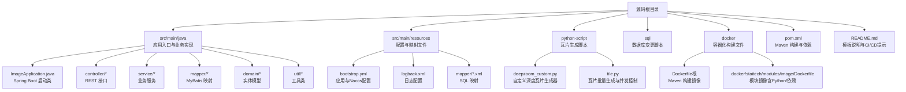
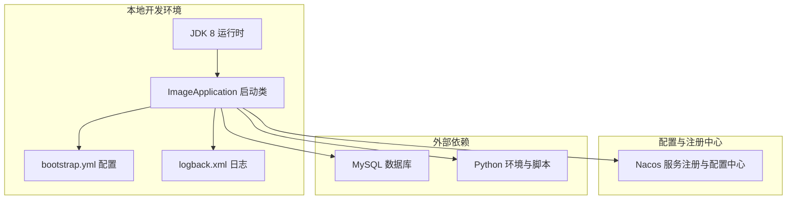
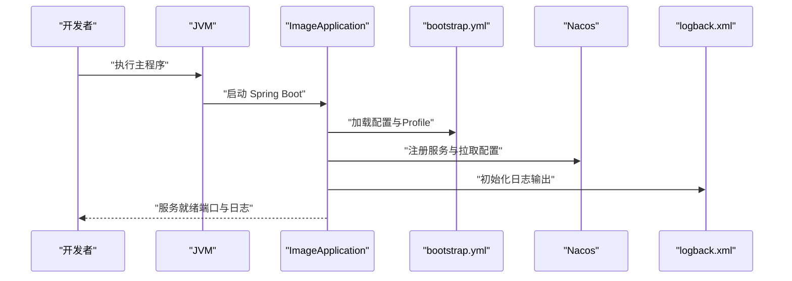
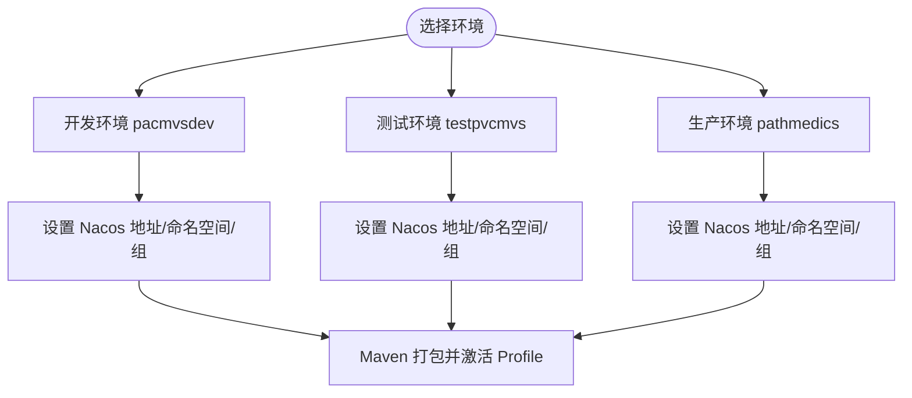
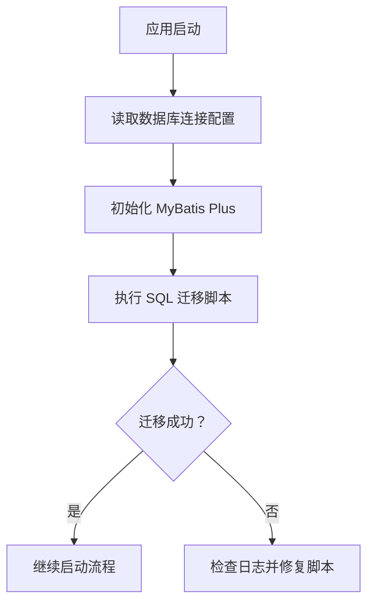
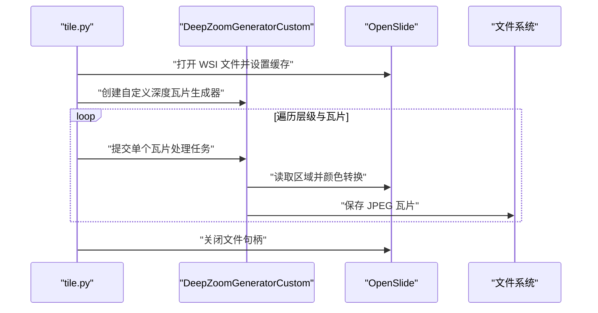
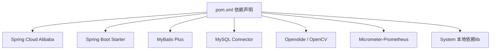

# 快速开始

<cite>
**本文引用的文件**
- [README.md](file://README.md)
- [pom.xml](file://pom.xml)
- [bootstrap.yml](file://src/main/resources/bootstrap.yml)
- [ImageApplication.java](file://src/main/java/cn/staitech/ImageApplication.java)
- [logback.xml](file://src/main/resources/logback.xml)
- [Dockerfile（根）](file://Dockerfile)
- [Dockerfile（模块镜像）](file://docker/staitech/modules/image/Dockerfile)
- [deepzoom_custom.py](file://python-script/deepzoom_custom.py)
- [tile.py](file://python-script/tile.py)
- [update_v2.5.2.sql](file://sql/update_v2.5.2.sql)
</cite>

## 目录
1. [简介](#简介)
2. [项目结构](#项目结构)
3. [核心组件](#核心组件)
4. [架构总览](#架构总览)
5. [详细组件分析](#详细组件分析)
6. [依赖分析](#依赖分析)
7. [性能考虑](#性能考虑)
8. [故障排查指南](#故障排查指南)
9. [结论](#结论)
10. [附录](#附录)

## 简介
本指南面向初学者，帮助你在本地快速搭建 PACMVS 图像解析服务（Java 模块）的开发与运行环境，并提供容器化部署的基础示例。你将获得完整的环境准备、依赖安装、配置说明、启动运行流程以及常见问题的解决方案。

## 项目结构
该仓库是一个基于 Spring Boot 的多模块工程中的图像处理子模块，主要职责是提供 WSI（全切片成像）图像的解析、瓦片生成与管理能力，并通过 Nacos 进行服务注册与配置中心集成，同时内置 Prometheus 指标导出与日志配置。

图表来源
- [pom.xml:1-385](file://pom.xml#L1-L385)
- [bootstrap.yml:1-37](file://src/main/resources/bootstrap.yml#L1-L37)
- [ImageApplication.java:1-53](file://src/main/java/cn/staitech/ImageApplication.java#L1-L53)
- [logback.xml:1-116](file://src/main/resources/logback.xml#L1-L116)
- [Dockerfile（根）:1-16](file://Dockerfile#L1-L16)
- [Dockerfile（模块镜像）:1-46](file://docker/staitech/modules/image/Dockerfile#L1-L46)
- [deepzoom_custom.py:1-153](file://python-script/deepzoom_custom.py#L1-L153)
- [tile.py:1-103](file://python-script/tile.py#L1-L103)

章节来源
- [pom.xml:1-385](file://pom.xml#L1-L385)
- [README.md:1-11](file://README.md#L1-L11)

## 核心组件
- 应用入口与启动
  - 启动类位于 [ImageApplication.java:37-45](file://src/main/java/cn/staitech/ImageApplication.java#L37-L45)，启用调度、WebSocket、Swagger、Feign、事务管理等特性，并设置时区为中国标准时间。
- 配置与环境
  - 应用端口、Nacos 注册与配置中心地址、共享配置等在 [bootstrap.yml:1-37](file://src/main/resources/bootstrap.yml#L1-L37) 中定义；Maven Profile 用于切换不同环境（开发/测试/生产）。
- 日志
  - 日志输出到控制台与滚动文件，按级别分文件存储，便于定位问题。参见 [logback.xml:1-116](file://src/main/resources/logback.xml#L1-L116)。
- 数据库与迁移
  - 数据库连接与 MyBatis Plus 集成由父 POM 提供；数据库表结构变更脚本见 [update_v2.5.2.sql:1-10](file://sql/update_v2.5.2.sql#L1-L10)。
- 瓦片生成
  - Python 脚本提供基于 OpenSlide 的深度瓦片生成与并发控制，参见 [deepzoom_custom.py:1-153](file://python-script/deepzoom_custom.py#L1-L153) 与 [tile.py:1-103](file://python-script/tile.py#L1-L103)。

章节来源
- [ImageApplication.java:1-53](file://src/main/java/cn/staitech/ImageApplication.java#L1-L53)
- [bootstrap.yml:1-37](file://src/main/resources/bootstrap.yml#L1-L37)
- [logback.xml:1-116](file://src/main/resources/logback.xml#L1-L116)
- [update_v2.5.2.sql:1-10](file://sql/update_v2.5.2.sql#L1-L10)
- [deepzoom_custom.py:1-153](file://python-script/deepzoom_custom.py#L1-L153)
- [tile.py:1-103](file://python-script/tile.py#L1-L103)

## 架构总览
下图展示了应用启动、配置加载、服务注册与外部依赖的关系。

图表来源
- [ImageApplication.java:37-45](file://src/main/java/cn/staitech/ImageApplication.java#L37-L45)
- [bootstrap.yml:1-37](file://src/main/resources/bootstrap.yml#L1-L37)
- [logback.xml:1-116](file://src/main/resources/logback.xml#L1-L116)

## 详细组件分析

### 启动流程与验证
- 启动顺序
  1) 设置时区与启动 Spring Boot 应用。
  2) 读取 bootstrap.yml 中的端口、Nacos 地址与共享配置。
  3) 初始化日志、Actuator、Prometheus 指标等。
- 验证步骤
  - 访问应用端口确认服务已启动。
  - 查看日志文件是否正常滚动与输出。
  - 在 Nacos 控制台确认服务已注册。

图表来源
- [ImageApplication.java:37-45](file://src/main/java/cn/staitech/ImageApplication.java#L37-L45)
- [bootstrap.yml:1-37](file://src/main/resources/bootstrap.yml#L1-L37)
- [logback.xml:1-116](file://src/main/resources/logback.xml#L1-L116)

章节来源
- [ImageApplication.java:37-45](file://src/main/java/cn/staitech/ImageApplication.java#L37-L45)
- [bootstrap.yml:1-37](file://src/main/resources/bootstrap.yml#L1-L37)
- [logback.xml:1-116](file://src/main/resources/logback.xml#L1-L116)

### 配置与环境切换
- 环境变量与 Profile
  - Maven Profile 提供开发、测试、生产三套环境参数，包括 Nacos 命名空间、地址与组信息。
  - 应用通过激活属性加载对应配置。
- 关键配置项
  - 端口、文件上传大小、Nacos 服务地址、命名空间、组、共享配置等。

图表来源
- [pom.xml:349-384](file://pom.xml#L349-L384)
- [bootstrap.yml:14-37](file://src/main/resources/bootstrap.yml#L14-L37)

章节来源
- [pom.xml:349-384](file://pom.xml#L349-L384)
- [bootstrap.yml:14-37](file://src/main/resources/bootstrap.yml#L14-L37)

### 数据库与迁移
- 连接与 ORM
  - 通过父 POM 引入数据源与 MyBatis Plus，结合 XML 映射文件进行数据库访问。
- 表结构变更
  - 新增字段与修改字段类型，确保与业务状态一致。

图表来源
- [update_v2.5.2.sql:1-10](file://sql/update_v2.5.2.sql#L1-L10)

章节来源
- [update_v2.5.2.sql:1-10](file://sql/update_v2.5.2.sql#L1-L10)

### 瓦片生成流程
- 流程概览
  - 使用 OpenSlide 加载 WSI 文件，基于自定义深度瓦片生成器逐级生成瓦片。
  - 通过线程池并发处理，限制待处理任务数量以控制内存占用。
- 关键参数
  - 瓦片尺寸、缓存容量、线程池大小等。

图表来源
- [tile.py:17-83](file://python-script/tile.py#L17-L83)
- [deepzoom_custom.py:127-153](file://python-script/deepzoom_custom.py#L127-L153)

章节来源
- [tile.py:1-103](file://python-script/tile.py#L1-L103)
- [deepzoom_custom.py:1-153](file://python-script/deepzoom_custom.py#L1-L153)

## 依赖分析
- 核心依赖
  - Spring Cloud Alibaba：Nacos 注册与配置、Sentinel 熔断限流。
  - Spring Boot：Web、Actuator、WebSocket、测试。
  - MyBatis Plus：ORM 与分页查询。
  - MySQL Connector：数据库驱动。
  - Openslide 与 OpenCV：WSI 解析与图像处理。
  - Prometheus Micrometer：指标导出。
- 资源与打包
  - 本地系统依赖以 system 方式引入，Maven 打包时复制至 BOOT-INF/lib。
  - 资源目录包含二进制文件与 XML 映射，避免被过滤。

图表来源
- [pom.xml:23-205](file://pom.xml#L23-L205)

章节来源
- [pom.xml:23-205](file://pom.xml#L23-L205)

## 性能考虑
- 并发与内存
  - 瓦片生成采用线程池与有界队列控制并发，建议根据 CPU 核心数与内存容量调整最大工作线程数与缓存大小。
- I/O 与磁盘
  - 瓦片生成涉及大量磁盘写入，建议使用高性能磁盘与合理的输出目录规划。
- 指标监控
  - 启用 Actuator 与 Prometheus 导出，便于观察应用健康与性能指标。

## 故障排查指南
- 启动失败或端口占用
  - 检查端口占用情况，必要时修改端口配置。
  - 参考 [bootstrap.yml:2-4](file://src/main/resources/bootstrap.yml#L2-L4)。
- Nacos 连接异常
  - 确认 Nacos 地址、命名空间与组配置正确，参考 [bootstrap.yml:17-34](file://src/main/resources/bootstrap.yml#L17-L34)。
  - 检查网络连通性与防火墙策略。
- 日志无法输出或路径异常
  - 检查日志路径与权限，参考 [logback.xml:3-6](file://src/main/resources/logback.xml#L3-L6)。
- OpenCV/Openslide 本地依赖缺失
  - 确保本地 lib 目录存在对应 JAR，参考 [pom.xml:164-180](file://pom.xml#L164-L180)。
- 瓦片生成卡顿或内存不足
  - 调整线程池大小与缓存容量，参考 [tile.py:32-39](file://python-script/tile.py#L32-L39) 与 [tile.py:95-97](file://python-script/tile.py#L95-L97)。

章节来源
- [bootstrap.yml:1-37](file://src/main/resources/bootstrap.yml#L1-L37)
- [logback.xml:1-116](file://src/main/resources/logback.xml#L1-L116)
- [pom.xml:164-180](file://pom.xml#L164-L180)
- [tile.py:32-39](file://python-script/tile.py#L32-L39)
- [tile.py:95-97](file://python-script/tile.py#L95-L97)

## 结论
通过本指南，你可以完成本地开发环境的搭建、依赖安装、配置与数据库迁移，并成功启动应用。对于生产部署，可参考根目录与模块镜像的 Dockerfile 进行容器化打包与发布。

## 附录

### 环境要求
- JDK 8
- Maven（用于本地构建）
- Python 3（用于瓦片生成脚本）
- MySQL（数据库）
- Nacos（服务注册与配置中心）

章节来源
- [pom.xml:1-385](file://pom.xml#L1-L385)
- [Dockerfile（根）:1-16](file://Dockerfile#L1-L16)
- [Dockerfile（模块镜像）:1-46](file://docker/staitech/modules/image/Dockerfile#L1-L46)

### 安装与启动步骤
- 步骤 1：克隆仓库并进入项目根目录
- 步骤 2：安装依赖（Maven 与 Python 依赖）
  - Maven：执行构建命令以下载依赖并打包。
  - Python：安装脚本所需依赖（如 openslide-bin），参考 [Dockerfile（模块镜像）:6-14](file://docker/staitech/modules/image/Dockerfile#L6-L14)。
- 步骤 3：准备数据库与迁移
  - 执行数据库迁移脚本，参考 [update_v2.5.2.sql:1-10](file://sql/update_v2.5.2.sql#L1-L10)。
- 步骤 4：配置应用
  - 修改 [bootstrap.yml:1-37](file://src/main/resources/bootstrap.yml#L1-L37) 中的端口、Nacos 地址与共享配置。
  - 如需切换环境，使用 Maven Profile（开发/测试/生产），参考 [pom.xml:349-384](file://pom.xml#L349-L384)。
- 步骤 5：启动应用
  - 运行 [ImageApplication.java:37-45](file://src/main/java/cn/staitech/ImageApplication.java#L37-L45) 启动主程序。
- 步骤 6：验证
  - 访问应用端口，查看日志输出，确认服务注册与配置拉取成功。

章节来源
- [bootstrap.yml:1-37](file://src/main/resources/bootstrap.yml#L1-L37)
- [pom.xml:349-384](file://pom.xml#L349-L384)
- [update_v2.5.2.sql:1-10](file://sql/update_v2.5.2.sql#L1-L10)
- [ImageApplication.java:37-45](file://src/main/java/cn/staitech/ImageApplication.java#L37-L45)

### Docker 容器化部署（基础示例）
- 使用根镜像构建
  - 基于 Maven 与 JDK 8 的多阶段构建，最终运行 JAR 包。
  - 参考 [Dockerfile（根）:1-16](file://Dockerfile#L1-L16)。
- 使用模块镜像构建
  - 预装 Python 与相关依赖，复制本地 JAR 与脚本，暴露应用端口。
  - 参考 [Dockerfile（模块镜像）:1-46](file://docker/staitech/modules/image/Dockerfile#L1-L46)。

章节来源
- [Dockerfile（根）:1-16](file://Dockerfile#L1-L16)
- [Dockerfile（模块镜像）:1-46](file://docker/staitech/modules/image/Dockerfile#L1-L46)