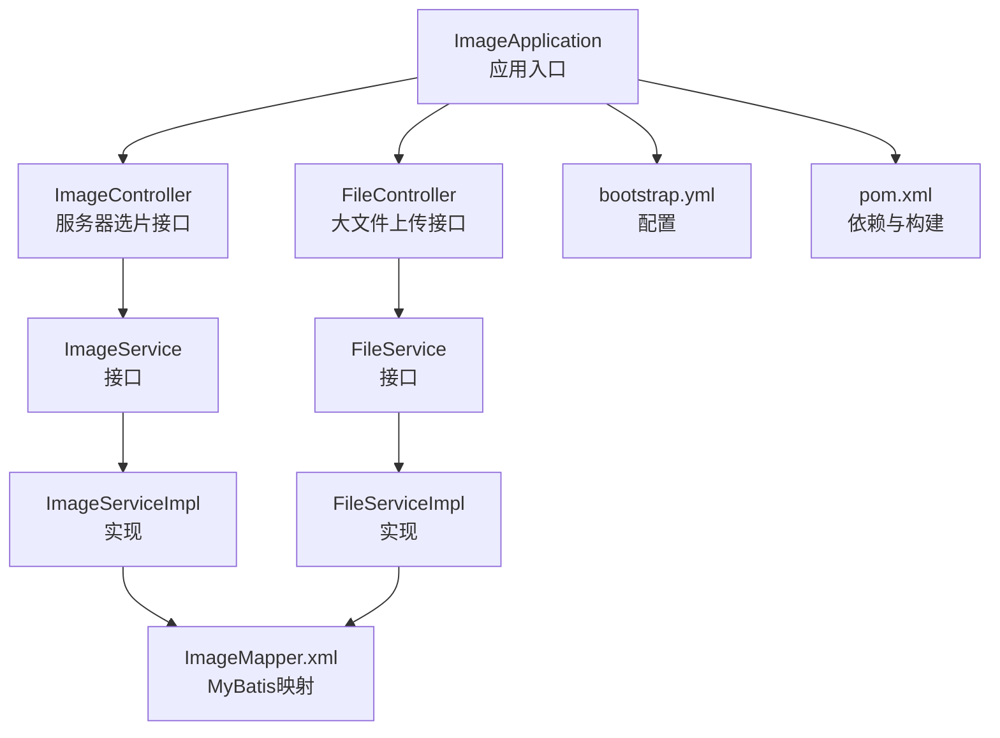
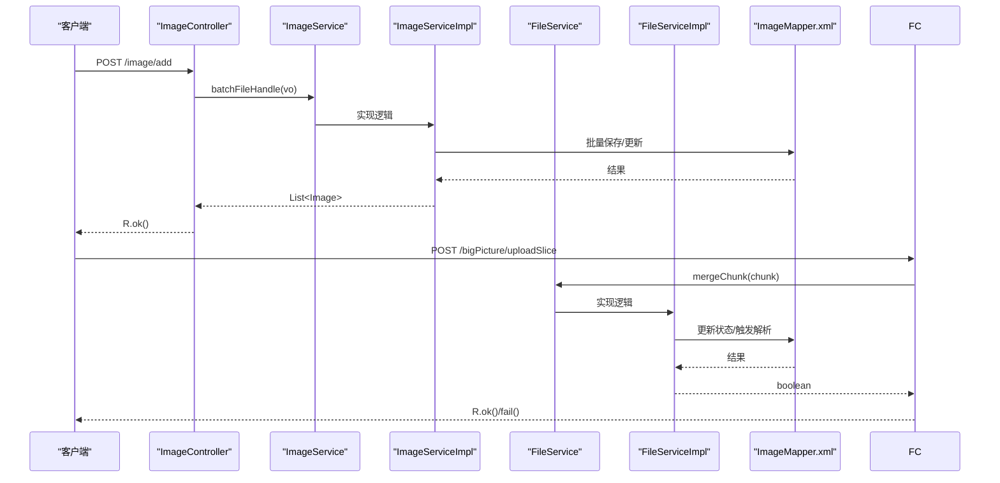
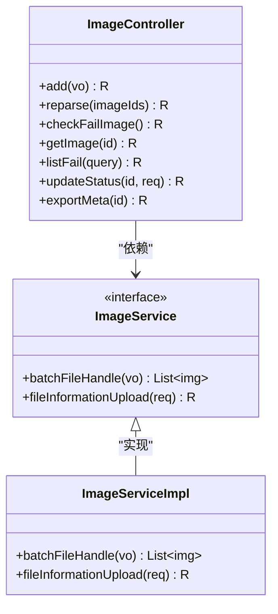
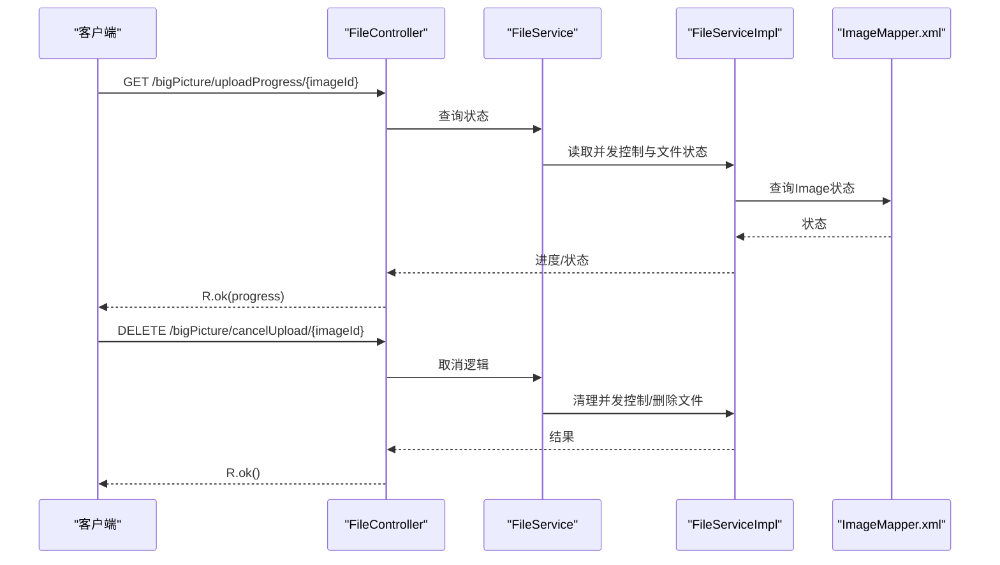
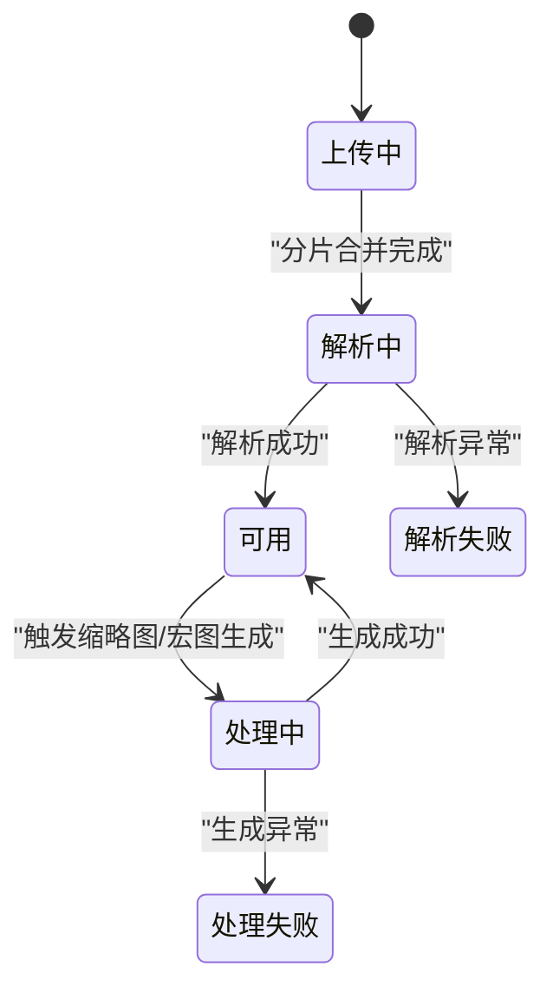
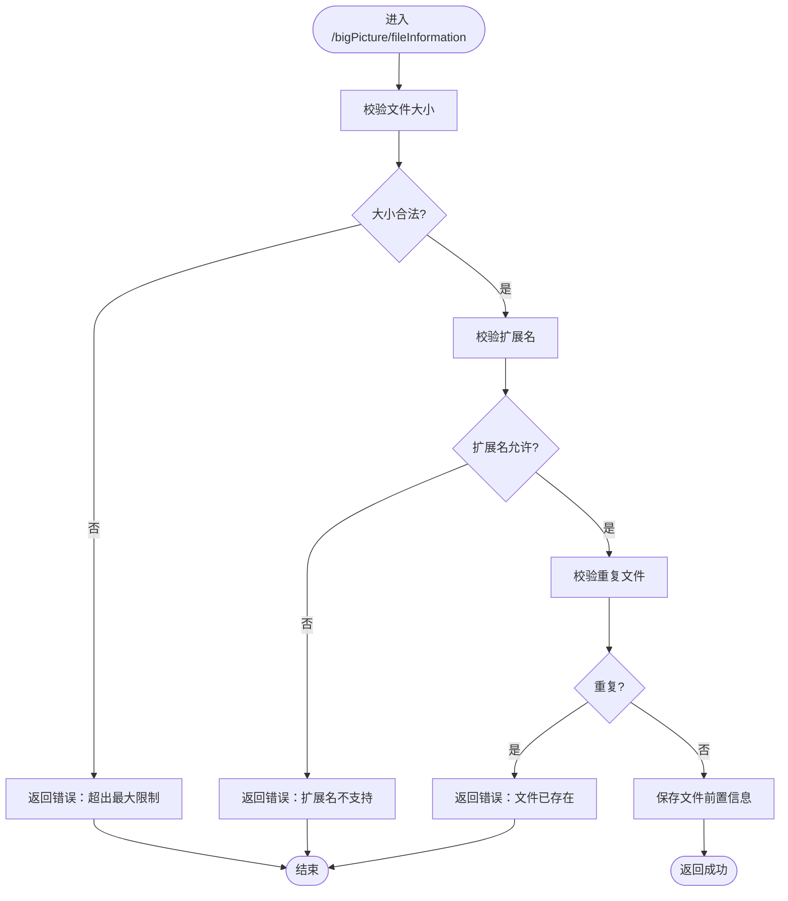
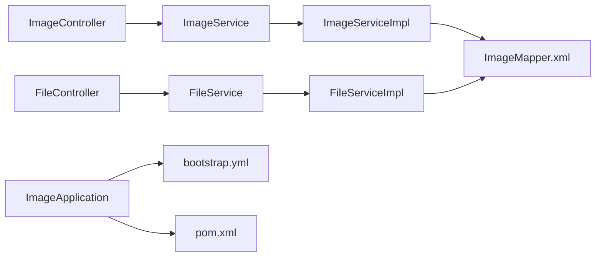

# API接口扩展

<cite>
**本文引用的文件**
- [ImageApplication.java](file://src/main/java/cn/staitech/ImageApplication.java)
- [ImageController.java](file://src/main/java/cn/staitech/file/controller/ImageController.java)
- [FileController.java](file://src/main/java/cn/staitech/file/controller/FileController.java)
- [ImageService.java](file://src/main/java/cn/staitech/file/service/ImageService.java)
- [FileService.java](file://src/main/java/cn/staitech/file/service/FileService.java)
- [ImageServiceImpl.java](file://src/main/java/cn/staitech/file/service/impl/ImageServiceImpl.java)
- [FileServiceImpl.java](file://src/main/java/cn/staitech/file/service/impl/FileServiceImpl.java)
- [Image.java](file://src/main/java/cn/staitech/file/domain/Image.java)
- [ImageConstant.java](file://src/main/java/cn/staitech/file/constant/ImageConstant.java)
- [FileInformationVO.java](file://src/main/java/cn/staitech/file/vo/FileInformationVO.java)
- [FileInsertVO.java](file://src/main/java/cn/staitech/file/vo/FileInsertVO.java)
- [Chunk.java](file://src/main/java/cn/staitech/file/vo/Chunk.java)
- [ImageMapper.xml](file://src/main/resources/mapper/ImageMapper.xml)
- [bootstrap.yml](file://src/main/resources/bootstrap.yml)
- [pom.xml](file://pom.xml)
</cite>

## 目录
1. [简介](#简介)
2. [项目结构](#项目结构)
3. [核心组件](#核心组件)
4. [架构概览](#架构概览)
5. [详细组件分析](#详细组件分析)
6. [依赖分析](#依赖分析)
7. [性能考虑](#性能考虑)
8. [故障排查指南](#故障排查指南)
9. [结论](#结论)
10. [附录](#附录)

## 简介
本文件面向PACMVS项目的API接口扩展，基于现有的RESTful控制器与服务层，提供新增接口的设计规范、最佳实践与实施步骤。重点覆盖以下方面：
- 在现有ImageController与FileController上扩展新接口的方法论
- HTTP方法与URL路径设计原则
- 请求/响应格式规范与参数校验策略
- API版本管理、错误处理与安全控制建议
- 完整接口设计示例、客户端调用示例与API测试方法

## 项目结构
项目采用Spring Boot微服务架构，核心模块位于cn.staitech.file包下，包含控制器、服务、持久层、工具与VO模型。应用入口类负责启用监控、发现、事务与WebSocket等功能。

**图表来源**
- [ImageApplication.java:37-52](file://src/main/java/cn/staitech/ImageApplication.java#L37-L52)
- [ImageController.java:26-71](file://src/main/java/cn/staitech/file/controller/ImageController.java#L26-L71)
- [FileController.java:37-129](file://src/main/java/cn/staitech/file/controller/FileController.java#L37-L129)
- [ImageService.java:17-23](file://src/main/java/cn/staitech/file/service/ImageService.java#L17-L23)
- [FileService.java:6-9](file://src/main/java/cn/staitech/file/service/FileService.java#L6-L9)
- [ImageServiceImpl.java:42-140](file://src/main/java/cn/staitech/file/service/impl/ImageServiceImpl.java#L42-L140)
- [FileServiceImpl.java:31-146](file://src/main/java/cn/staitech/file/service/impl/FileServiceImpl.java#L31-L146)
- [ImageMapper.xml:4-64](file://src/main/resources/mapper/ImageMapper.xml#L4-L64)
- [bootstrap.yml:1-37](file://src/main/resources/bootstrap.yml#L1-L37)
- [pom.xml:1-385](file://pom.xml#L1-L385)

**章节来源**
- [ImageApplication.java:37-52](file://src/main/java/cn/staitech/ImageApplication.java#L37-L52)
- [bootstrap.yml:1-37](file://src/main/resources/bootstrap.yml#L1-L37)
- [pom.xml:1-385](file://pom.xml#L1-L385)

## 核心组件
- 控制器层
  - ImageController：提供服务器选片、重解析失败切片、检查失败切片、查询原始切片等接口
  - FileController：提供文件前置信息上传、分片上传等接口
- 服务层
  - ImageService：定义批量文件处理与文件前置信息上传能力
  - FileService：定义分片合并能力
- 实现层
  - ImageServiceImpl：实现批量处理、文件信息上传、文件名解析、URL生成等
  - FileServiceImpl：实现分片合并、并发控制、超时清理、缩略图触发等
- 数据模型与常量
  - Image：数据库实体映射
  - ImageConstant：状态码、来源、尺寸限制等常量
  - VO类：FileInformationVO、FileInsertVO、Chunk等

**章节来源**
- [ImageController.java:26-71](file://src/main/java/cn/staitech/file/controller/ImageController.java#L26-L71)
- [FileController.java:37-129](file://src/main/java/cn/staitech/file/controller/FileController.java#L37-L129)
- [ImageService.java:17-23](file://src/main/java/cn/staitech/file/service/ImageService.java#L17-L23)
- [FileService.java:6-9](file://src/main/java/cn/staitech/file/service/FileService.java#L6-L9)
- [ImageServiceImpl.java:42-140](file://src/main/java/cn/staitech/file/service/impl/ImageServiceImpl.java#L42-L140)
- [FileServiceImpl.java:31-146](file://src/main/java/cn/staitech/file/service/impl/FileServiceImpl.java#L31-L146)
- [Image.java:27-216](file://src/main/java/cn/staitech/file/domain/Image.java#L27-L216)
- [ImageConstant.java:9-67](file://src/main/java/cn/staitech/file/constant/ImageConstant.java#L9-L67)
- [FileInformationVO.java:14-46](file://src/main/java/cn/staitech/file/vo/FileInformationVO.java#L14-L46)
- [FileInsertVO.java:14-26](file://src/main/java/cn/staitech/file/vo/FileInsertVO.java#L14-L26)
- [Chunk.java:11-47](file://src/main/java/cn/staitech/file/vo/Chunk.java#L11-L47)

## 架构概览
下图展示控制器到服务再到持久层的数据流与职责边界：

**图表来源**
- [ImageController.java:42-48](file://src/main/java/cn/staitech/file/controller/ImageController.java#L42-L48)
- [ImageService.java:19-21](file://src/main/java/cn/staitech/file/service/ImageService.java#L19-L21)
- [ImageServiceImpl.java:63-140](file://src/main/java/cn/staitech/file/service/impl/ImageServiceImpl.java#L63-L140)
- [FileController.java:105-127](file://src/main/java/cn/staitech/file/controller/FileController.java#L105-L127)
- [FileService.java:8-8](file://src/main/java/cn/staitech/file/service/FileService.java#L8-L8)
- [FileServiceImpl.java:53-146](file://src/main/java/cn/staitech/file/service/impl/FileServiceImpl.java#L53-L146)
- [ImageMapper.xml:4-64](file://src/main/resources/mapper/ImageMapper.xml#L4-L64)

## 详细组件分析

### ImageController 接口扩展
- 现有接口
  - POST /image/add：服务器选片，批量处理文件并生成缩略图
  - POST /image/reparse：重解析失败切片
  - GET /image/checkFailImage：检查是否存在解析失败的切片
  - GET /image/getImage/{id}：按ID查询原始切片
- 扩展建议
  - 新增“查询失败切片列表”接口：GET /image/listFail
  - 新增“标记切片状态”接口：PUT /image/status/{id}
  - 新增“导出切片元数据”接口：GET /image/exportMeta

**图表来源**
- [ImageController.java:26-71](file://src/main/java/cn/staitech/file/controller/ImageController.java#L26-L71)
- [ImageService.java:17-23](file://src/main/java/cn/staitech/file/service/ImageService.java#L17-L23)
- [ImageServiceImpl.java:63-140](file://src/main/java/cn/staitech/file/service/impl/ImageServiceImpl.java#L63-L140)

**章节来源**
- [ImageController.java:26-71](file://src/main/java/cn/staitech/file/controller/ImageController.java#L26-L71)
- [ImageService.java:17-23](file://src/main/java/cn/staitech/file/service/ImageService.java#L17-L23)
- [ImageServiceImpl.java:63-140](file://src/main/java/cn/staitech/file/service/impl/ImageServiceImpl.java#L63-L140)

### FileController 接口扩展
- 现有接口
  - POST /bigPicture/fileInformation：文件前置信息上传
  - POST /bigPicture/uploadSlice：分片上传
- 扩展建议
  - 新增“查询上传进度”接口：GET /bigPicture/uploadProgress/{imageId}
  - 新增“取消上传任务”接口：DELETE /bigPicture/cancelUpload/{imageId}
  - 新增“批量删除切片”接口：DELETE /bigPicture/batchDelete

**图表来源**
- [FileController.java:58-85](file://src/main/java/cn/staitech/file/controller/FileController.java#L58-L85)
- [FileController.java:97-127](file://src/main/java/cn/staitech/file/controller/FileController.java#L97-L127)
- [FileService.java:8-8](file://src/main/java/cn/staitech/file/service/FileService.java#L8-L8)
- [FileServiceImpl.java:53-146](file://src/main/java/cn/staitech/file/service/impl/FileServiceImpl.java#L53-L146)
- [ImageMapper.xml:4-64](file://src/main/resources/mapper/ImageMapper.xml#L4-L64)

**章节来源**
- [FileController.java:37-129](file://src/main/java/cn/staitech/file/controller/FileController.java#L37-L129)
- [FileServiceImpl.java:53-146](file://src/main/java/cn/staitech/file/service/impl/FileServiceImpl.java#L53-L146)

### 数据模型与状态机
- Image实体包含切片元数据、状态、来源、组织ID等字段
- ImageConstant定义了上传、解析、处理等状态码及来源类型
- 状态流转遵循“上传中→解析中→可用/失败”的流程

**图表来源**
- [Image.java:183-184](file://src/main/java/cn/staitech/file/domain/Image.java#L183-L184)
- [ImageConstant.java:20-31](file://src/main/java/cn/staitech/file/constant/ImageConstant.java#L20-L31)

**章节来源**
- [Image.java:27-216](file://src/main/java/cn/staitech/file/domain/Image.java#L27-L216)
- [ImageConstant.java:9-67](file://src/main/java/cn/staitech/file/constant/ImageConstant.java#L9-L67)

### 处理流程与错误处理
- 分片上传流程
  - 校验文件大小与扩展名
  - 校验重复文件（可配置）
  - 写入分片并更新并发控制
  - 全部分片完成后更新状态并触发解析

**图表来源**
- [FileController.java:58-85](file://src/main/java/cn/staitech/file/controller/FileController.java#L58-L85)
- [ImageConstant.java:13-18](file://src/main/java/cn/staitech/file/constant/ImageConstant.java#L13-L18)

**章节来源**
- [FileController.java:58-85](file://src/main/java/cn/staitech/file/controller/FileController.java#L58-L85)
- [ImageConstant.java:9-67](file://src/main/java/cn/staitech/file/constant/ImageConstant.java#L9-L67)

## 依赖分析
- 控制器依赖服务接口，服务实现依赖MyBatis映射与工具类
- 配置文件控制Tomcat端口、文件上传大小与Nacos注册
- POM文件声明了Spring Cloud、Nacos、Sentinel、Swagger、MySQL、MyBatis-Plus等依赖

**图表来源**
- [ImageController.java:26-71](file://src/main/java/cn/staitech/file/controller/ImageController.java#L26-L71)
- [FileController.java:37-129](file://src/main/java/cn/staitech/file/controller/FileController.java#L37-L129)
- [ImageServiceImpl.java:42-140](file://src/main/java/cn/staitech/file/service/impl/ImageServiceImpl.java#L42-L140)
- [FileServiceImpl.java:31-146](file://src/main/java/cn/staitech/file/service/impl/FileServiceImpl.java#L31-L146)
- [ImageMapper.xml:4-64](file://src/main/resources/mapper/ImageMapper.xml#L4-L64)
- [bootstrap.yml:1-37](file://src/main/resources/bootstrap.yml#L1-L37)
- [pom.xml:1-385](file://pom.xml#L1-L385)

**章节来源**
- [pom.xml:1-385](file://pom.xml#L1-L385)
- [bootstrap.yml:1-37](file://src/main/resources/bootstrap.yml#L1-L37)

## 性能考虑
- 分片上传采用随机访问写入与原子状态控制，减少锁竞争
- 超时清理机制避免长时间占用资源
- 并发控制使用原子引用数组记录分片完成状态
- 建议：合理设置分片大小、开启压缩传输、使用CDN加速静态资源

## 故障排查指南
- 常见错误与定位
  - 文件大小超限：检查bootstrap.yml中的multipart配置与ImageConstant中的最大值
  - 扩展名不支持：检查ImageUtils中的允许扩展名列表
  - 重复文件：根据FileController中的重复校验逻辑定位
  - 分片合并失败：查看FileServiceImpl的日志与异常堆栈
- 日志与监控
  - 控制器层使用日志注解记录业务操作
  - 应用入口启用Actuator与Prometheus指标

**章节来源**
- [bootstrap.yml:6-10](file://src/main/resources/bootstrap.yml#L6-L10)
- [ImageConstant.java:52-53](file://src/main/java/cn/staitech/file/constant/ImageConstant.java#L52-L53)
- [ImageUtils.java:105-114](file://src/main/java/cn/staitech/file/util/ImageUtils.java#L105-L114)
- [FileController.java:74-77](file://src/main/java/cn/staitech/file/controller/FileController.java#L74-L77)
- [FileServiceImpl.java:117-141](file://src/main/java/cn/staitech/file/service/impl/FileServiceImpl.java#L117-L141)
- [ImageApplication.java:47-50](file://src/main/java/cn/staitech/ImageApplication.java#L47-L50)

## 结论
通过在现有控制器与服务层之上引入统一的参数校验、状态管理与错误处理机制，可以稳定地扩展API能力。建议优先从“查询类接口”和“状态变更类接口”入手，逐步引入“导出/批处理/取消任务”等增强功能，确保接口幂等、可追踪与可观测。

## 附录

### API版本管理最佳实践
- 版本前缀：/api/v{N}/（例如 /api/v1/image）
- 文档与契约：通过Swagger/SpringDoc维护接口契约
- 向后兼容：新增字段使用可选参数，避免破坏既有客户端
- 升级策略：灰度发布与回滚预案

### 参数验证与错误处理规范
- 参数校验
  - 必填字段使用@NotBlank/@NotNull
  - 长度与范围使用@Size/@Min/@Max
  - 自定义校验可结合@Validated与全局异常处理器
- 错误码与消息
  - 统一使用R<T>包装响应，包含code/message/data
  - 错误码枚举化，便于前端统一处理
- 异常处理
  - 全局异常拦截器捕获参数校验、业务异常与系统异常
  - 记录上下文信息（用户ID、组织ID、请求ID）

### 安全控制建议
- 认证与授权：基于Spring Security或网关层鉴权
- 速率限制：结合Sentinel或Redis限流
- 参数净化：防止注入与越权访问
- 日志脱敏：敏感字段（如路径、MD5）脱敏输出

### 接口设计示例（路径与方法）
- 查询失败切片列表
  - 方法：GET
  - 路径：/api/v1/image/listFail
  - 查询参数：organizationId、status、pageNum、pageSize
  - 响应：分页结果，包含Image字段
- 标记切片状态
  - 方法：PUT
  - 路径：/api/v1/image/status/{id}
  - 路径参数：id
  - 请求体：{ status: "4" | "3" | "7" | "8" }
  - 响应：R.ok()
- 查询上传进度
  - 方法：GET
  - 路径：/api/v1/bigPicture/uploadProgress/{imageId}
  - 响应：{ progress: number, status: string }

### 客户端调用示例
- 使用curl调用“查询失败切片列表”
  - curl -X GET "http://localhost:9083/api/v1/image/listFail?organizationId=1&status=3&pageNum=1&pageSize=20"
- 使用curl调用“标记切片状态”
  - curl -X PUT "http://localhost:9083/api/v1/image/status/123" -H "Content-Type: application/json" -d '{"status":"4"}'
- 使用curl调用“查询上传进度”
  - curl -X GET "http://localhost:9083/api/v1/bigPicture/uploadProgress/123"

### API测试方法
- 单元测试：针对服务层方法编写Mock测试
- 集成测试：使用Testcontainers启动MySQL与Nacos，模拟真实环境
- 压力测试：JMeter/LoadRunner模拟高并发分片上传与查询
- 监控观测：Prometheus+Grafana观察接口耗时、错误率与资源使用