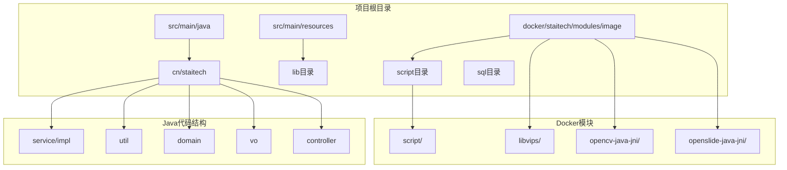
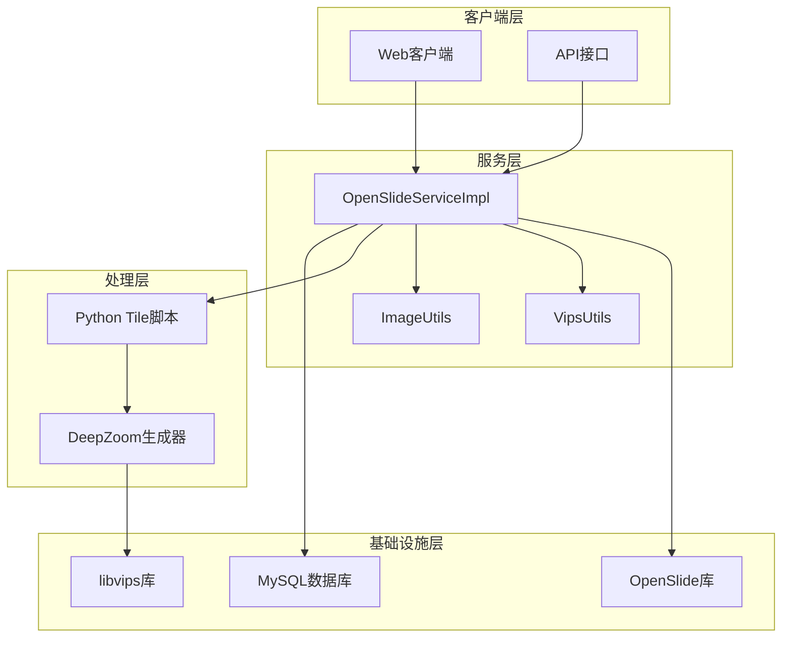
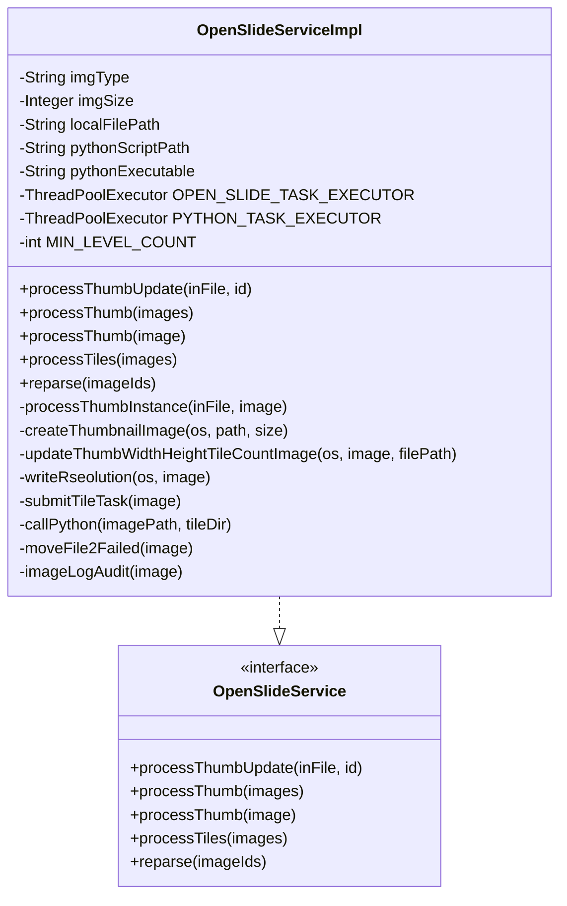
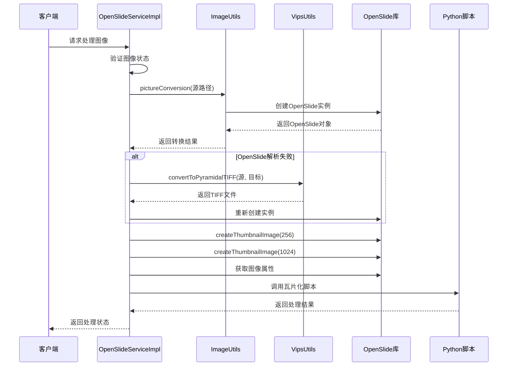
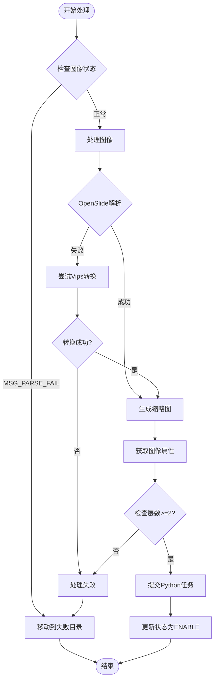
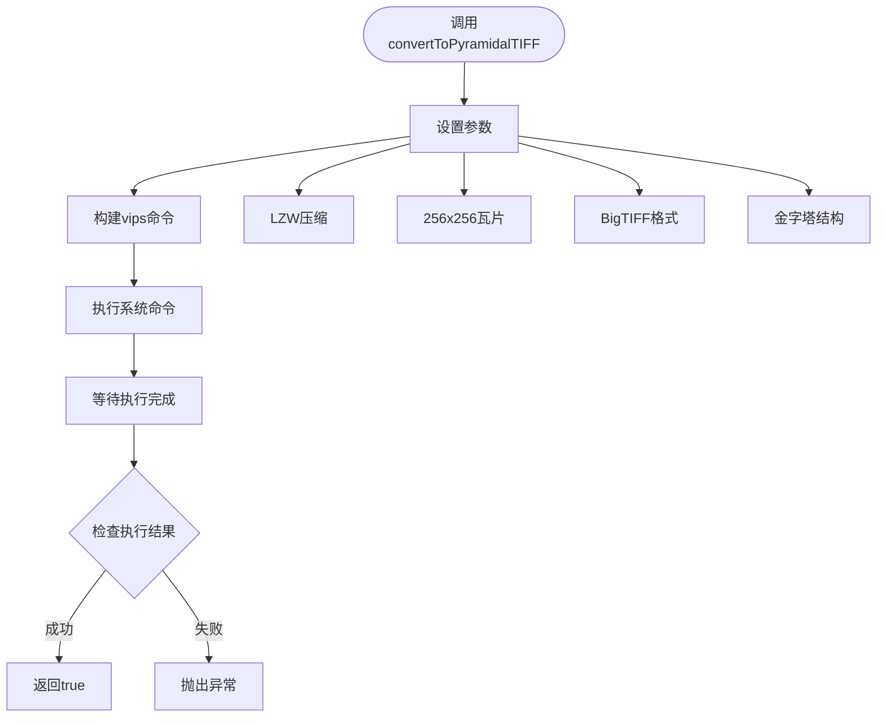
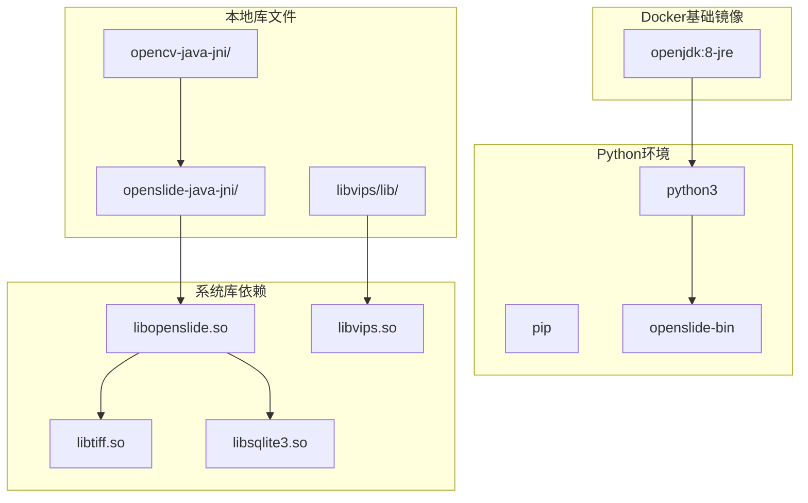
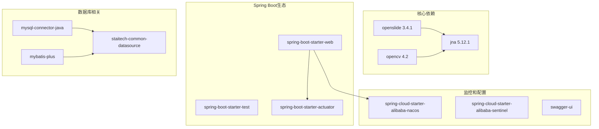
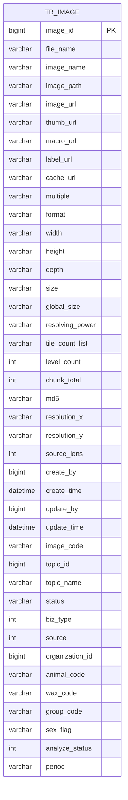
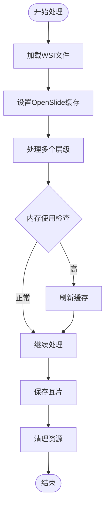

# OpenSlide扩展

<cite>
**本文档引用的文件**
- [OpenSlideServiceImpl.java](file://src/main/java/cn/staitech/file/service/impl/OpenSlideServiceImpl.java)
- [OpenSlideService.java](file://src/main/java/cn/staitech/file/service/OpenSlideService.java)
- [VipsUtils.java](file://src/main/java/cn/staitech/file/util/VipsUtils.java)
- [ImageUtils.java](file://src/main/java/cn/staitech/file/util/ImageUtils.java)
- [Dockerfile](file://docker/staitech/modules/image/Dockerfile)
- [vips.pc](file://docker/staitech/modules/image/libvips/lib/pkgconfig/vips.pc)
- [libopenslide.la](file://docker/staitech/modules/image/openslide-java-jni/libopenslide.la)
- [tile.py](file://docker/staitech/modules/image/script/tile.py)
- [deepzoom_custom.py](file://docker/staitech/modules/image/script/deepzoom_custom.py)
- [pom.xml](file://pom.xml)
- [Image.java](file://src/main/java/cn/staitech/file/domain/Image.java)
- [update_v2.5.2.sql](file://sql/update_v2.5.2.sql)
- [bootstrap.yml](file://src/main/resources/bootstrap.yml)
</cite>

## 目录
1. [简介](#简介)
2. [项目结构](#项目结构)
3. [核心组件](#核心组件)
4. [架构概览](#架构概览)
5. [详细组件分析](#详细组件分析)
6. [依赖关系分析](#依赖关系分析)
7. [性能考虑](#性能考虑)
8. [故障排除指南](#故障排除指南)
9. [结论](#结论)
10. [附录](#附录)

## 简介

PACMVS项目的OpenSlide扩展模块是一个专门用于处理数字病理切片图像的服务模块。该模块基于OpenSlide库实现了对多种WSI（Whole Slide Image）格式的支持，包括SVS、NDPI、TIF等格式，并集成了Vips图像处理库和Python深度学习脚本，为医疗影像分析提供了完整的解决方案。

该扩展文档详细说明了如何扩展OpenSlide库的功能，包括新的图像格式支持、自定义处理算法和性能优化策略，以及在Docker环境中的依赖管理方案。

## 项目结构

该项目采用标准的Spring Boot Maven项目结构，主要包含以下关键目录：



**图表来源**
- [OpenSlideServiceImpl.java:1-563](file://src/main/java/cn/staitech/file/service/impl/OpenSlideServiceImpl.java#L1-L563)
- [Dockerfile:1-46](file://docker/staitech/modules/image/Dockerfile#L1-L46)

**章节来源**
- [OpenSlideServiceImpl.java:1-563](file://src/main/java/cn/staitech/file/service/impl/OpenSlideServiceImpl.java#L1-L563)
- [Dockerfile:1-46](file://docker/staitech/modules/image/Dockerfile#L1-L46)

## 核心组件

### OpenSlideServiceImpl - 主要服务实现

OpenSlideServiceImpl是整个模块的核心服务类，负责处理WSI图像的完整生命周期：

- **缩略图生成**：支持不同尺寸的缩略图创建
- **图像格式转换**：自动检测并转换不支持的图像格式
- **瓦片化处理**：将大图像分割为可管理的小瓦片
- **多线程处理**：使用异步线程池提高处理效率
- **错误处理**：完善的异常捕获和恢复机制

### VipsUtils - 图像处理工具

VipsUtils封装了libvips库的调用，提供高性能的图像转换功能：

- **pyramidal TIFF转换**：生成金字塔结构的TIFF文件
- **压缩选项配置**：支持多种压缩算法
- **瓦片设置**：自定义瓦片大小和布局

### ImageUtils - 工具类集合

ImageUtils提供各种辅助功能：

- **文件扩展名验证**：支持多种医学图像格式
- **目录管理**：自动创建必要的文件夹结构
- **OpenSlide集成**：与OpenSlide库的无缝对接

**章节来源**
- [OpenSlideServiceImpl.java:47-563](file://src/main/java/cn/staitech/file/service/impl/OpenSlideServiceImpl.java#L47-L563)
- [VipsUtils.java:11-37](file://src/main/java/cn/staitech/file/util/VipsUtils.java#L11-L37)
- [ImageUtils.java:20-148](file://src/main/java/cn/staitech/file/util/ImageUtils.java#L20-L148)

## 架构概览

系统采用分层架构设计，结合Java后端服务和Python脚本处理：



**图表来源**
- [OpenSlideServiceImpl.java:22-29](file://src/main/java/cn/staitech/file/service/impl/OpenSlideServiceImpl.java#L22-L29)
- [VipsUtils.java:22-35](file://src/main/java/cn/staitech/file/util/VipsUtils.java#L22-L35)
- [tile.py:1-99](file://docker/staitech/modules/image/script/tile.py#L1-L99)

## 详细组件分析

### OpenSlideServiceImpl详细分析

#### 类结构图



**图表来源**
- [OpenSlideServiceImpl.java:47-563](file://src/main/java/cn/staitech/file/service/impl/OpenSlideServiceImpl.java#L47-L563)
- [OpenSlideService.java:14-40](file://src/main/java/cn/staitech/file/service/OpenSlideService.java#L14-L40)

#### 图像处理流程序列图



**图表来源**
- [OpenSlideServiceImpl.java:140-202](file://src/main/java/cn/staitech/file/service/impl/OpenSlideServiceImpl.java#L140-L202)
- [ImageUtils.java:52-97](file://src/main/java/cn/staitech/file/util/ImageUtils.java#L52-L97)
- [VipsUtils.java:22-35](file://src/main/java/cn/staitech/file/util/VipsUtils.java#L22-L35)

#### 错误处理流程图



**图表来源**
- [OpenSlideServiceImpl.java:277-312](file://src/main/java/cn/staitech/file/service/impl/OpenSlideServiceImpl.java#L277-L312)
- [OpenSlideServiceImpl.java:399-454](file://src/main/java/cn/staitech/file/service/impl/OpenSlideServiceImpl.java#L399-L454)

**章节来源**
- [OpenSlideServiceImpl.java:140-378](file://src/main/java/cn/staitech/file/service/impl/OpenSlideServiceImpl.java#L140-L378)

### VipsUtils集成分析

#### Vips命令执行流程



**图表来源**
- [VipsUtils.java:22-35](file://src/main/java/cn/staitech/file/util/VipsUtils.java#L22-L35)

**章节来源**
- [VipsUtils.java:11-37](file://src/main/java/cn/staitech/file/util/VipsUtils.java#L11-L37)

### Docker环境依赖管理

#### 依赖库结构



**图表来源**
- [Dockerfile:1-46](file://docker/staitech/modules/image/Dockerfile#L1-L46)
- [vips.pc:1-15](file://docker/staitech/modules/image/libvips/lib/pkgconfig/vips.pc#L1-L15)
- [libopenslide.la:1-42](file://docker/staitech/modules/image/openslide-java-jni/libopenslide.la#L1-L42)

**章节来源**
- [Dockerfile:1-46](file://docker/staitech/modules/image/Dockerfile#L1-L46)

## 依赖关系分析

### Maven依赖配置

项目使用Maven管理依赖，关键依赖包括：



**图表来源**
- [pom.xml:164-199](file://pom.xml#L164-L199)

### 数据模型关系



**图表来源**
- [Image.java:27-216](file://src/main/java/cn/staitech/file/domain/Image.java#L27-L216)

**章节来源**
- [pom.xml:23-205](file://pom.xml#L23-L205)
- [Image.java:27-216](file://src/main/java/cn/staitech/file/domain/Image.java#L27-L216)

## 性能考虑

### 多线程处理架构

系统采用双线程池设计来优化性能：

1. **OpenSlide线程池**：处理OpenSlide相关的图像操作
2. **Python线程池**：执行Python瓦片化脚本

### 内存管理策略



**图表来源**
- [tile.py:82-99](file://docker/staitech/modules/image/script/tile.py#L82-L99)

### 性能优化建议

1. **缓存策略**：合理设置OpenSlide缓存容量（默认1GB）
2. **并发控制**：根据CPU核心数调整线程池大小
3. **内存监控**：监控JVM内存使用情况
4. **磁盘I/O优化**：使用SSD存储临时文件

## 故障排除指南

### 常见问题及解决方案

#### OpenSlide解析失败

**症状**：图像状态显示解析失败
**原因**：
- 文件格式不受支持
- 文件损坏
- 权限问题

**解决方案**：
1. 检查文件扩展名是否在支持列表中
2. 尝试使用Vips进行格式转换
3. 验证文件权限和磁盘空间

#### Python脚本执行失败

**症状**：瓦片化过程中断
**原因**：
- Python环境缺失
- 依赖包未安装
- 内存不足

**解决方案**：
1. 确认Python 3和pip已安装
2. 检查openslide-bin依赖
3. 增加容器内存限制

#### Docker依赖问题

**症状**：运行时库缺失错误
**原因**：
- 动态链接库未正确挂载
- 版本不兼容

**解决方案**：
1. 确保所有lib目录都正确复制到容器
2. 检查ldconfig配置
3. 验证库版本兼容性

**章节来源**
- [OpenSlideServiceImpl.java:188-200](file://src/main/java/cn/staitech/file/service/impl/OpenSlideServiceImpl.java#L188-L200)
- [OpenSlideServiceImpl.java:457-477](file://src/main/java/cn/staitech/file/service/impl/OpenSlideServiceImpl.java#L457-L477)

## 结论

PACMVS项目的OpenSlide扩展模块提供了一个完整的WSI图像处理解决方案。通过合理的架构设计、完善的错误处理机制和高效的性能优化策略，该模块能够稳定地处理各种医学影像格式。

主要优势包括：
- **多格式支持**：支持SVS、NDPI、TIF等多种医学图像格式
- **高性能处理**：利用多线程和缓存机制提升处理速度
- **灵活扩展**：模块化设计便于添加新的图像格式和处理算法
- **容器化部署**：Docker环境确保了依赖的一致性和可移植性

未来可以进一步优化的方向包括：
- 添加更多图像格式支持
- 实现更智能的缓存策略
- 增强监控和日志功能
- 优化内存使用效率

## 附录

### 新图像格式适配方法

#### 适配步骤

1. **格式验证**：在ImageUtils中添加新的扩展名支持
2. **OpenSlide集成**：确保OpenSlide库支持该格式
3. **转换逻辑**：如需转换，修改VipsUtils参数
4. **测试验证**：编写单元测试验证功能

#### 配置示例

```java
// 在ImageUtils中添加新的支持格式
public static final String[] DEFAULT_ALLOWED_EXTENSION = {
    "svs", "ndpi", "tiff", "tif", "zvi", "scn", "bmp", "gif", "jpg", "jpeg", "png", "newformat"
};
```

### 自定义处理算法实现

#### 扩展点识别

1. **OpenSlideServiceImpl**：主要业务逻辑扩展点
2. **VipsUtils**：图像处理算法扩展点
3. **Python脚本**：复杂算法处理扩展点

#### 实现建议

1. **保持向后兼容**：确保新算法不影响现有功能
2. **性能测试**：充分测试新算法的性能表现
3. **错误处理**：完善异常处理和回退机制

### 第三方库集成方案

#### 集成策略

1. **系统库集成**：通过Dockerfile复制本地库文件
2. **Java包装器**：使用JNI或系统路径引用本地库
3. **Python脚本**：通过ProcessBuilder调用外部脚本

#### 配置管理

```yaml
# 在bootstrap.yml中配置
pythonScriptPath: /home/staitech/tile.py
pythonExecutable: python3
```

### 测试方法

#### 单元测试

```java
@Test
public void testOpenSlideIntegration() {
    // 测试OpenSlide库集成
    OpenSlide slide = new OpenSlide(testFile);
    assertNotNull(slide);
    assertTrue(slide.getLevelCount() > 0);
    slide.close();
}
```

#### 集成测试

```java
@Test
public void testFullWorkflow() {
    // 测试完整处理流程
    Image image = createTestImage();
    service.processThumb(Collections.singletonList(image));
    assertEquals("ENABLE", image.getStatus());
}
```

### 部署注意事项

#### 环境要求

1. **硬件要求**：至少8GB内存，推荐16GB以上
2. **存储空间**：预留足够的临时存储空间
3. **网络配置**：确保Nacos服务可达

#### 监控指标

1. **内存使用率**：监控JVM堆内存使用
2. **CPU利用率**：监控多线程处理性能
3. **磁盘I/O**：监控瓦片化过程的磁盘使用

#### 日志配置

```yaml
logging:
  level:
    cn.staitech.file: INFO
    org.openslide: WARN
```