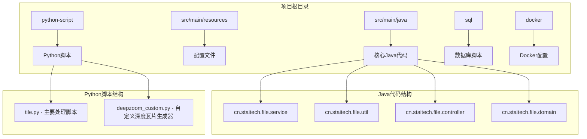
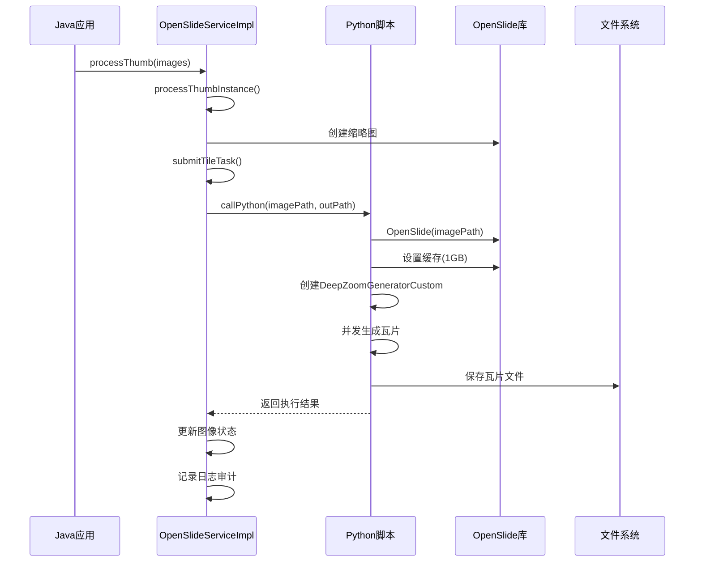
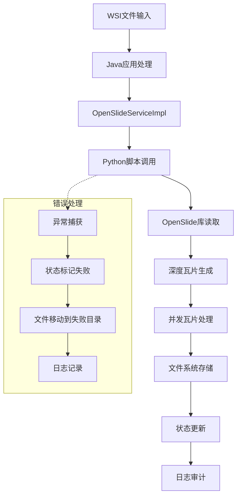
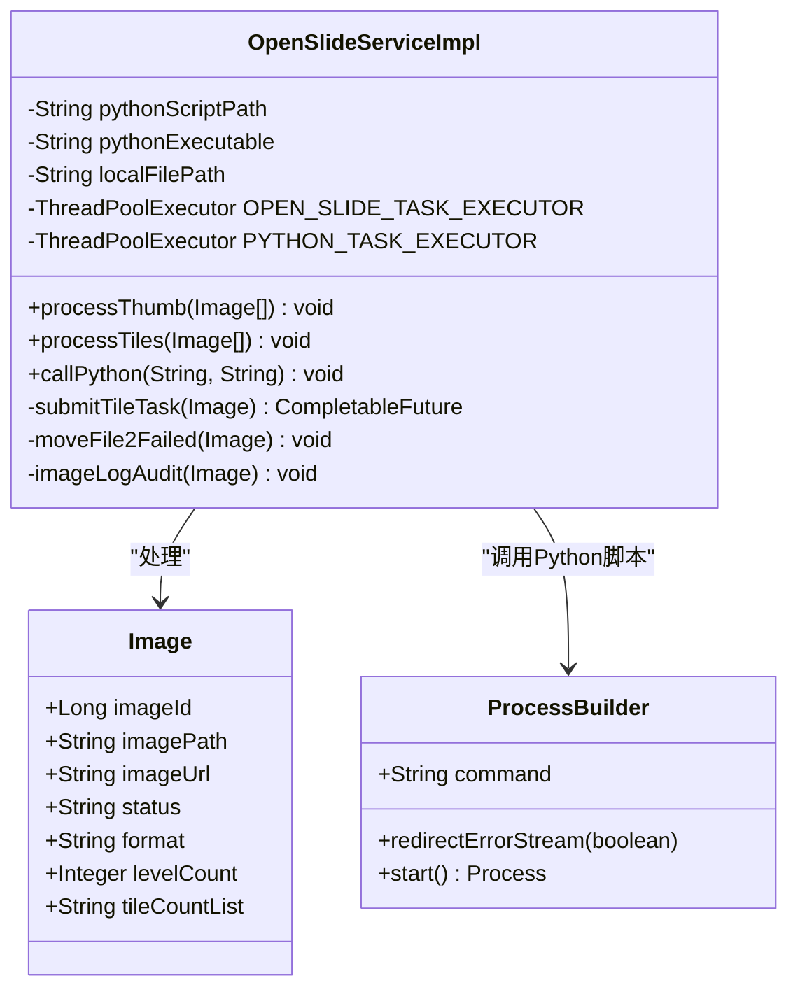
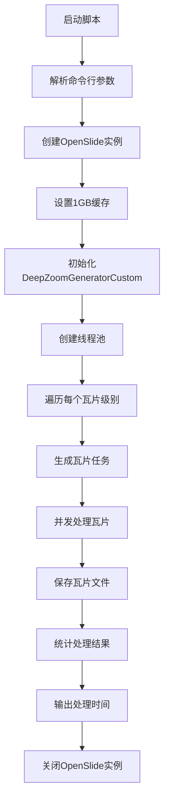
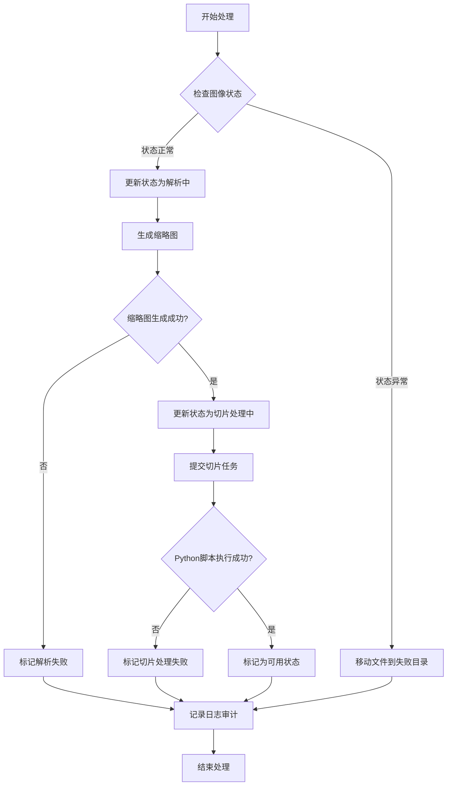
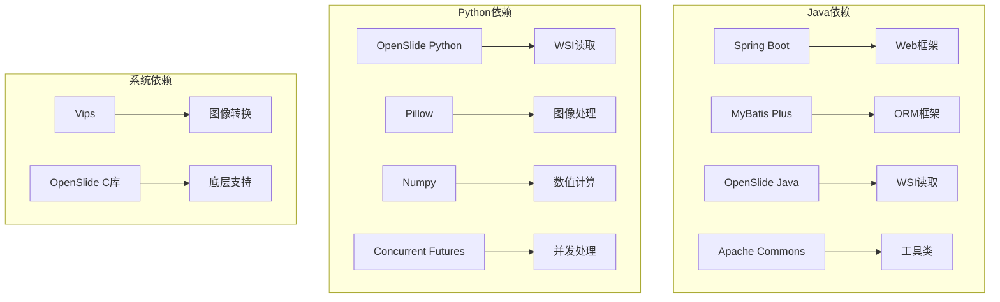
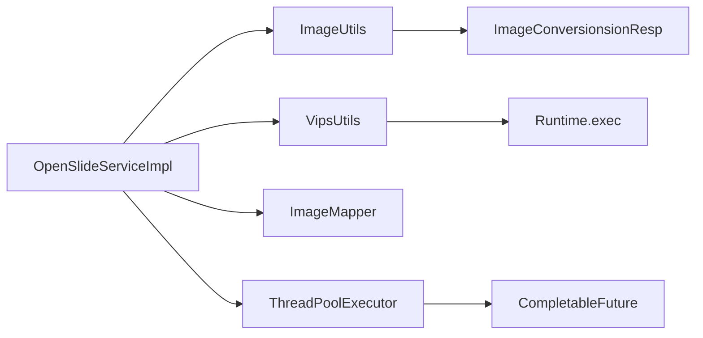

# Python脚本集成

<cite>
**本文档引用的文件**
- [OpenSlideServiceImpl.java](file://src/main/java/cn/staitech/file/service/impl/OpenSlideServiceImpl.java)
- [deepzoom_custom.py](file://python-script/deepzoom_custom.py)
- [tile.py](file://python-script/tile.py)
- [deepzoom_custom.py](file://docker/staitech/modules/image/script/deepzoom_custom.py)
- [tile.py](file://docker/staitech/modules/image/script/tile.py)
- [ImageUtils.java](file://src/main/java/cn/staitech/file/util/ImageUtils.java)
- [VipsUtils.java](file://src/main/java/cn/staitech/file/util/VipsUtils.java)
- [bootstrap.yml](file://src/main/resources/bootstrap.yml)
- [pom.xml](file://pom.xml)
- [update_v2.5.2.sql](file://sql/update_v2.5.2.sql)
</cite>

## 目录
1. [简介](#简介)
2. [项目结构](#项目结构)
3. [核心组件](#核心组件)
4. [架构概览](#架构概览)
5. [详细组件分析](#详细组件分析)
6. [依赖关系分析](#依赖关系分析)
7. [性能考虑](#性能考虑)
8. [故障排除指南](#故障排除指南)
9. [结论](#结论)

## 简介

PACMVS项目是一个基于Java Spring Boot的医学影像处理系统，专门用于处理WSI（Whole Slide Image）数字病理切片。该项目的核心功能之一是将Python脚本集成到Java应用中，通过OpenSlide库进行WSI切片的深度瓦片化处理。

本指南详细说明了如何将Python图像处理脚本集成到Java应用中，包括脚本调用机制、参数传递、结果处理和异常管理。重点解释了`tile.py`和`deepzoom_custom.py`脚本的功能和使用方法，以及与`OpenSlideServiceImpl`的集成方式。

## 项目结构

PACMVS项目采用标准的Spring Boot Maven项目结构，主要包含以下关键目录：

**图表来源**
- [OpenSlideServiceImpl.java:1-563](file://src/main/java/cn/staitech/file/service/impl/OpenSlideServiceImpl.java#L1-L563)
- [tile.py:1-103](file://python-script/tile.py#L1-L103)
- [deepzoom_custom.py:1-153](file://python-script/deepzoom_custom.py#L1-L153)

**章节来源**
- [OpenSlideServiceImpl.java:1-563](file://src/main/java/cn/staitech/file/service/impl/OpenSlideServiceImpl.java#L1-L563)
- [pom.xml:1-385](file://pom.xml#L1-L385)

## 核心组件

### OpenSlideServiceImpl - Java集成核心

`OpenSlideServiceImpl`是Java应用与Python脚本集成的核心组件，负责协调整个WSI切片处理流程。

#### 主要职责
- **脚本调用管理**：通过`callPython`方法执行Python脚本
- **参数传递**：向Python脚本传递WSI文件路径和输出目录
- **状态管理**：跟踪图像处理状态并更新数据库
- **异常处理**：捕获并处理Python脚本执行过程中的异常
- **日志审计**：记录详细的处理日志和审计信息

#### 关键配置属性
- `pythonScriptPath`: Python脚本路径，默认值为`/home/staitech/tile.py`
- `pythonExecutable`: Python可执行文件，默认值为`python`
- `localFilePath`: 本地文件存储路径

**章节来源**
- [OpenSlideServiceImpl.java:55-72](file://src/main/java/cn/staitech/file/service/impl/OpenSlideServiceImpl.java#L55-L72)
- [OpenSlideServiceImpl.java:457-477](file://src/main/java/cn/staitech/file/service/impl/OpenSlideServiceImpl.java#L457-L477)

### Python脚本组件

#### tile.py - 主要处理脚本

`tile.py`是Python脚本的主要入口点，负责：
- **参数解析**：从命令行接收WSI文件路径和输出目录
- **缓存管理**：设置OpenSlide缓存容量为1GB
- **并发处理**：使用ThreadPoolExecutor进行多线程瓦片生成
- **进度监控**：实时输出处理进度和时间统计

#### deepzoom_custom.py - 自定义深度瓦片生成器

`deepzoom_custom.py`提供了增强的DeepZoom功能：
- **自定义级别计算**：使用`tile_size`计算瓦片级别
- **颜色管理**：支持ICC颜色配置文件转换
- **边界限制**：可选择性地限制瓦片生成范围
- **透明度处理**：正确处理RGBA格式的透明瓦片

**章节来源**
- [tile.py:1-103](file://python-script/tile.py#L1-L103)
- [deepzoom_custom.py:1-153](file://python-script/deepzoom_custom.py#L1-L153)

## 架构概览

PACMVS项目采用分层架构设计，实现了Java应用与Python脚本的无缝集成：

**图表来源**
- [OpenSlideServiceImpl.java:319-339](file://src/main/java/cn/staitech/file/service/impl/OpenSlideServiceImpl.java#L319-L339)
- [tile.py:84-103](file://python-script/tile.py#L84-L103)

### 数据流架构

**图表来源**
- [OpenSlideServiceImpl.java:277-312](file://src/main/java/cn/staitech/file/service/impl/OpenSlideServiceImpl.java#L277-L312)
- [tile.py:17-83](file://python-script/tile.py#L17-L83)

## 详细组件分析

### OpenSlideServiceImpl集成机制

#### 脚本调用流程

**图表来源**
- [OpenSlideServiceImpl.java:47-72](file://src/main/java/cn/staitech/file/service/impl/OpenSlideServiceImpl.java#L47-L72)
- [OpenSlideServiceImpl.java:457-477](file://src/main/java/cn/staitech/file/service/impl/OpenSlideServiceImpl.java#L457-L477)

#### 参数传递机制

Java应用通过命令行参数向Python脚本传递必要信息：

| 参数 | 类型 | 描述 | 示例值 |
|------|------|------|--------|
| imagePath | String | WSI文件的完整路径 | `/data/slides/001.svs` |
| out_path | String | 瓦片输出目录路径 | `/data/output/001/TileGroup0` |

Python脚本通过`sys.argv[1:]`接收这些参数，并在`main()`函数中进行解析。

**章节来源**
- [OpenSlideServiceImpl.java:319-339](file://src/main/java/cn/staitech/file/service/impl/OpenSlideServiceImpl.java#L319-L339)
- [tile.py:84-98](file://python-script/tile.py#L84-L98)

### Python脚本功能详解

#### tile.py核心功能

`tile.py`实现了高效的WSI瓦片化处理：

**图表来源**
- [tile.py:17-83](file://python-script/tile.py#L17-L83)

#### deepzoom_custom.py增强功能

`deepzoom_custom.py`提供了多个关键增强：

1. **自定义级别计算**：使用`tile_size`参数精确控制瓦片级别
2. **颜色管理**：支持ICC颜色配置文件转换
3. **边界处理**：可选择性限制瓦片生成范围
4. **透明度处理**：正确处理RGBA格式的透明瓦片

**章节来源**
- [deepzoom_custom.py:8-153](file://python-script/deepzoom_custom.py#L8-L153)

### 错误处理和异常管理

#### Java端异常处理

OpenSlideServiceImpl实现了多层次的异常处理机制：

**图表来源**
- [OpenSlideServiceImpl.java:277-312](file://src/main/java/cn/staitech/file/service/impl/OpenSlideServiceImpl.java#L277-L312)

#### Python端异常处理

Python脚本在瓦片处理过程中实施了完善的错误处理：

- **单个瓦片异常**：使用`try-catch`捕获单个瓦片处理异常
- **缓存管理**：设置合理的缓存容量避免内存溢出
- **进度监控**：定期输出处理进度和时间统计
- **资源清理**：确保OpenSlide实例正确关闭

**章节来源**
- [tile.py:127-153](file://python-script/tile.py#L127-L153)
- [deepzoom_custom.py:129-177](file://python-script/deepzoom_custom.py#L129-L177)

## 依赖关系分析

### 外部依赖

PACMVS项目依赖多个关键组件：

**图表来源**
- [pom.xml:164-180](file://pom.xml#L164-L180)

### 内部组件依赖

**图表来源**
- [OpenSlideServiceImpl.java:61-72](file://src/main/java/cn/staitech/file/service/impl/OpenSlideServiceImpl.java#L61-L72)
- [ImageUtils.java:52-97](file://src/main/java/cn/staitech/file/util/ImageUtils.java#L52-L97)

**章节来源**
- [pom.xml:23-205](file://pom.xml#L23-L205)
- [OpenSlideServiceImpl.java:1-563](file://src/main/java/cn/staitech/file/service/impl/OpenSlideServiceImpl.java#L1-L563)

## 性能考虑

### Java端性能优化

#### 线程池配置

项目使用了两个独立的线程池来优化性能：

1. **OPEN_SLIDE_TASK_EXECUTOR**：用于OpenSlide相关操作
2. **PYTHON_TASK_EXECUTOR**：专门用于Python脚本执行

#### 缓存策略

- **OpenSlide缓存**：Python脚本设置了1GB的缓存容量
- **图像转换缓存**：Java端使用ImageUtils进行图像格式转换

### Python端性能优化

#### 并发处理

Python脚本采用了多线程并发处理策略：

- **CPU核心数**：`max_workers = os.cpu_count()*2 + 1`
- **任务队列控制**：使用有界队列限制最大待处理任务数
- **动态调整**：根据已完成任务动态调整处理进度

#### 内存管理

- **缓存容量**：合理设置OpenSlide缓存避免内存溢出
- **渐进式处理**：使用流式处理减少内存占用
- **资源清理**：及时释放图像资源和线程资源

**章节来源**
- [OpenSlideServiceImpl.java:68-72](file://src/main/java/cn/staitech/file/service/impl/OpenSlideServiceImpl.java#L68-L72)
- [tile.py:32-39](file://python-script/tile.py#L32-L39)

## 故障排除指南

### 常见问题及解决方案

#### Python脚本执行失败

**问题症状**：
- Java应用记录"Python script executed failed"错误
- 图像状态标记为"切片处理失败"

**排查步骤**：
1. 检查Python可执行文件路径配置
2. 验证Python脚本文件权限
3. 确认OpenSlide库安装正确
4. 检查磁盘空间和文件权限

**解决方案**：
- 更新`pythonExecutable`配置项
- 确保Python虚拟环境正确激活
- 检查OpenSlide库版本兼容性

#### WSI文件解析失败

**问题症状**：
- OpenSlide抛出解析异常
- 图像状态标记为"解析失败"

**排查步骤**：
1. 检查WSI文件完整性
2. 验证文件格式支持性
3. 确认文件路径正确性

**解决方案**：
- 使用VipsUtils进行格式转换
- 检查文件编码和元数据
- 验证文件未损坏

#### 内存不足问题

**问题症状**：
- Python脚本抛出内存溢出异常
- 处理过程中断

**解决方案**：
- 调整OpenSlide缓存容量
- 减少并发线程数
- 优化瓦片尺寸设置

**章节来源**
- [OpenSlideServiceImpl.java:472-476](file://src/main/java/cn/staitech/file/service/impl/OpenSlideServiceImpl.java#L472-L476)
- [tile.py:92-98](file://python-script/tile.py#L92-L98)

### 日志记录和监控

#### Java端日志配置

项目使用SLF4J进行统一的日志管理：

- **INFO级别**：处理流程和状态变更
- **ERROR级别**：异常和错误信息
- **WARN级别**：警告和潜在问题

#### Python端日志输出

Python脚本提供详细的处理进度信息：

- **瓦片处理计数**：每100个瓦片输出一次进度
- **时间戳记录**：显示当前处理时间
- **错误详情**：记录具体的瓦片处理错误

**章节来源**
- [OpenSlideServiceImpl.java:487-535](file://src/main/java/cn/staitech/file/service/impl/OpenSlideServiceImpl.java#L487-L535)
- [tile.py:61-67](file://python-script/tile.py#L61-L67)

## 结论

PACMVS项目成功实现了Java应用与Python脚本的深度集成，为WSI数字病理切片处理提供了高效、可靠的解决方案。通过精心设计的架构和完善的错误处理机制，该系统能够稳定处理大规模的医学影像数据。

### 主要优势

1. **模块化设计**：清晰分离Java业务逻辑和Python图像处理功能
2. **高性能并发**：利用多线程技术实现高效的瓦片生成
3. **完善的错误处理**：多层次的异常捕获和恢复机制
4. **可扩展性**：灵活的配置选项支持不同环境需求

### 未来改进方向

1. **容器化部署**：进一步优化Docker配置以提高部署效率
2. **监控增强**：添加更详细的性能指标和监控告警
3. **自动化测试**：建立完整的测试套件确保代码质量
4. **文档完善**：补充更多的使用示例和技术文档

该集成方案为类似的大规模图像处理项目提供了良好的参考模板，展示了如何有效地结合Java的稳定性和Python的灵活性来构建高性能的应用系统。