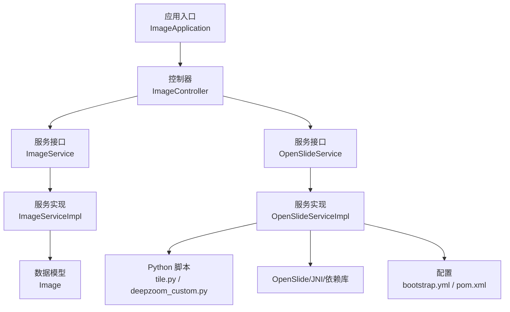
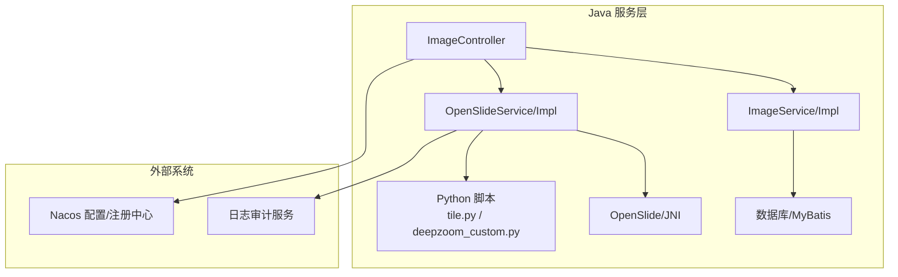
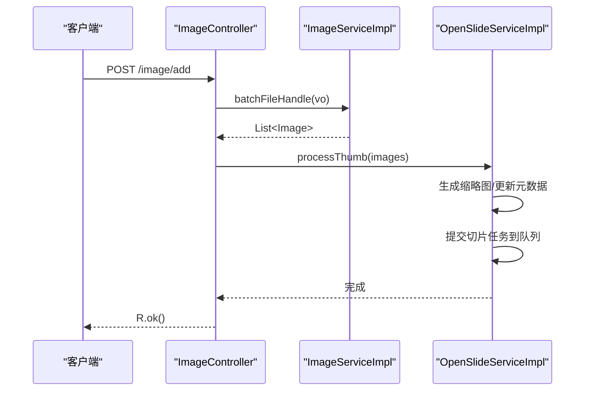
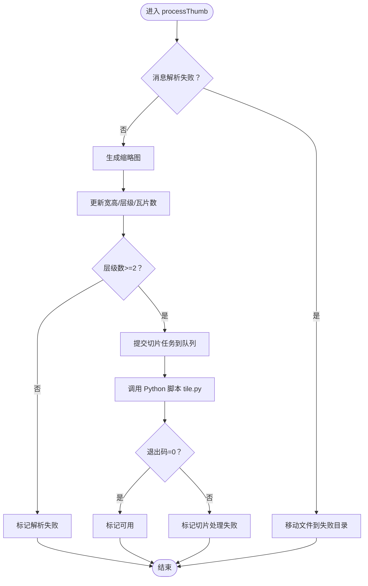
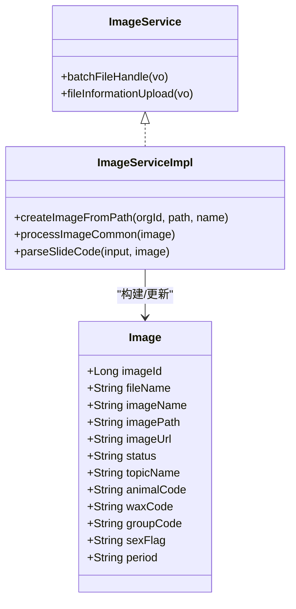
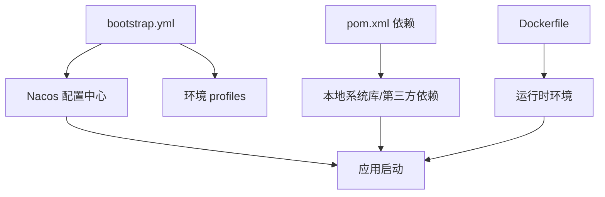
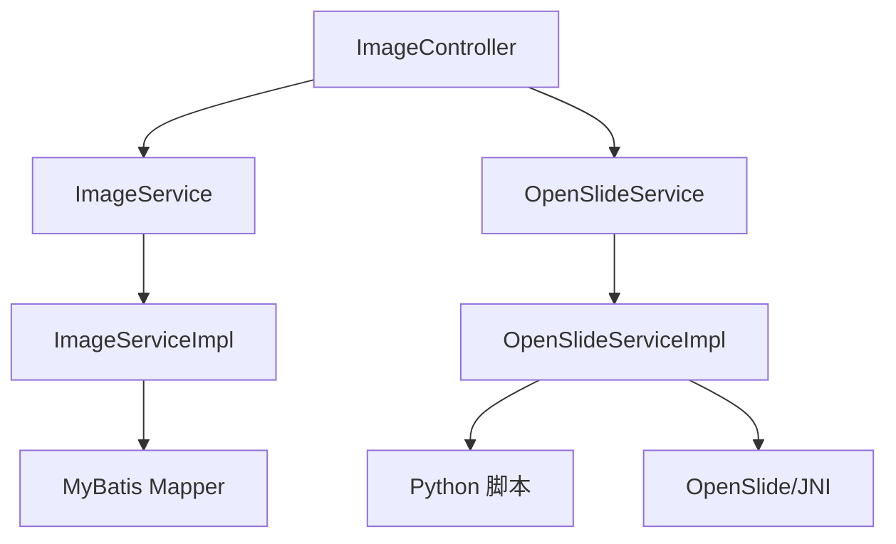

# 扩展开发

<cite>
**本文引用的文件**
- [ImageApplication.java](file://src/main/java/cn/staitech/ImageApplication.java)
- [ImageController.java](file://src/main/java/cn/staitech/file/controller/ImageController.java)
- [OpenSlideService.java](file://src/main/java/cn/staitech/file/service/OpenSlideService.java)
- [OpenSlideServiceImpl.java](file://src/main/java/cn/staitech/file/service/impl/OpenSlideServiceImpl.java)
- [ImageService.java](file://src/main/java/cn/staitech/file/service/ImageService.java)
- [ImageServiceImpl.java](file://src/main/java/cn/staitech/file/service/impl/ImageServiceImpl.java)
- [Image.java](file://src/main/java/cn/staitech/file/domain/Image.java)
- [ImageUtils.java](file://src/main/java/cn/staitech/file/util/ImageUtils.java)
- [ImageConstant.java](file://src/main/java/cn/staitech/file/constant/ImageConstant.java)
- [bootstrap.yml](file://src/main/resources/bootstrap.yml)
- [pom.xml](file://pom.xml)
- [Dockerfile](file://Dockerfile)
- [docker/staitech/modules/image/Dockerfile](file://docker/staitech/modules/image/Dockerfile)
- [docker/staitech/modules/image/script/deepzoom_custom.py](file://docker/staitech/modules/image/script/deepzoom_custom.py)
- [docker/staitech/modules/image/script/tile.py](file://docker/staitech/modules/image/script/tile.py)
- [python-script/deepzoom_custom.py](file://python-script/deepzoom_custom.py)
- [python-script/tile.py](file://python-script/tile.py)
</cite>

## 目录
1. [简介](#简介)
2. [项目结构](#项目结构)
3. [核心组件](#核心组件)
4. [架构总览](#架构总览)
5. [详细组件分析](#详细组件分析)
6. [依赖分析](#依赖分析)
7. [性能考虑](#性能考虑)
8. [故障排查指南](#故障排查指南)
9. [结论](#结论)
10. [附录](#附录)

## 简介
本扩展开发文档面向高级开发者，围绕 PACMVS 的“原始切片解析服务”模块，系统阐述如何进行新功能开发、API 扩展、配置扩展、Python 脚本集成、OpenSlide 扩展以及第三方系统对接。文档同时给出插件化扩展点识别、集成模式、扩展开发示例、测试方法与部署指南，帮助读者在不破坏现有架构的前提下，安全、可维护地进行二次开发与定制。

## 项目结构
该模块采用 Spring Boot + MyBatis Plus 的典型分层架构，核心目录与职责如下：
- 应用入口与配置：应用启动类、Spring Cloud/Nacos 配置、Docker 配置
- 控制层：REST API 控制器，负责接收请求、编排业务
- 服务层：业务接口与实现，包含 OpenSlide 解析、缩略图生成、切片任务调度
- 数据模型：实体类与常量定义
- 工具与资源：图像工具、OpenSlide/JNI/依赖库、Python 脚本与 Docker 镜像构建

图表来源
- [ImageApplication.java:37-52](file://src/main/java/cn/staitech/ImageApplication.java#L37-L52)
- [ImageController.java:30-71](file://src/main/java/cn/staitech/file/controller/ImageController.java#L30-L71)
- [ImageServiceImpl.java:42-140](file://src/main/java/cn/staitech/file/service/impl/ImageServiceImpl.java#L42-L140)
- [OpenSlideServiceImpl.java:47-563](file://src/main/java/cn/staitech/file/service/impl/OpenSlideServiceImpl.java#L47-L563)
- [Image.java:27-216](file://src/main/java/cn/staitech/file/domain/Image.java#L27-L216)
- [bootstrap.yml:1-37](file://src/main/resources/bootstrap.yml#L1-L37)
- [pom.xml:23-205](file://pom.xml#L23-L205)

章节来源
- [ImageApplication.java:37-52](file://src/main/java/cn/staitech/ImageApplication.java#L37-L52)
- [bootstrap.yml:1-37](file://src/main/resources/bootstrap.yml#L1-L37)
- [pom.xml:23-205](file://pom.xml#L23-L205)

## 核心组件
- 应用入口与装配
  - 启动类启用定时、WebSocket、安全、Swagger、Feign、事务、Elasticsearch 等能力，统一注册与配置管理由 Nacos 提供。
- 控制器
  - 提供“服务器选片”、“重新解析失败数据”、“检查失败切片”、“查询原始切片”等接口，编排 ImageService 与 OpenSlideService。
- 服务层
  - ImageService：批量处理文件插入、补充文件信息上传、生成路径与 URL、解析文件名字段。
  - OpenSlideService：缩略图生成、切片任务提交、重解析失败数据、失败文件迁移。
- 数据模型与常量
  - Image：切片元数据、状态、尺寸、分辨率、组织与专题关联等。
  - ImageConstant：状态码、来源、扩展名、目录常量等。
- 工具类
  - ImageUtils：文件扩展名校验、目录创建、JPG/PNG 转 TIF、OpenSlide 验证与回退。
- 配置与依赖
  - bootstrap.yml：端口、Nacos 注册与配置中心、多环境 profiles。
  - pom.xml：依赖管理、本地系统 jar（OpenSlide/Opencv）、Docker 打包策略、仓库配置。

章节来源
- [ImageController.java:30-71](file://src/main/java/cn/staitech/file/controller/ImageController.java#L30-L71)
- [ImageService.java:17-23](file://src/main/java/cn/staitech/file/service/ImageService.java#L17-L23)
- [ImageServiceImpl.java:42-548](file://src/main/java/cn/staitech/file/service/impl/ImageServiceImpl.java#L42-L548)
- [OpenSlideService.java:14-38](file://src/main/java/cn/staitech/file/service/OpenSlideService.java#L14-L38)
- [OpenSlideServiceImpl.java:47-563](file://src/main/java/cn/staitech/file/service/impl/OpenSlideServiceImpl.java#L47-L563)
- [Image.java:27-216](file://src/main/java/cn/staitech/file/domain/Image.java#L27-L216)
- [ImageConstant.java:9-67](file://src/main/java/cn/staitech/file/constant/ImageConstant.java#L9-L67)
- [ImageUtils.java:20-148](file://src/main/java/cn/staitech/file/util/ImageUtils.java#L20-L148)
- [bootstrap.yml:1-37](file://src/main/resources/bootstrap.yml#L1-L37)
- [pom.xml:23-205](file://pom.xml#L23-L205)

## 架构总览
整体架构以“Java 服务 + Python 脚本 + OpenSlide/JNI”协同工作，Java 负责业务编排与状态管理，Python 负责瓦片生成与颜色空间处理，OpenSlide 提供 WSI 解析能力。

图表来源
- [ImageController.java:30-71](file://src/main/java/cn/staitech/file/controller/ImageController.java#L30-L71)
- [ImageServiceImpl.java:42-140](file://src/main/java/cn/staitech/file/service/impl/ImageServiceImpl.java#L42-L140)
- [OpenSlideServiceImpl.java:47-563](file://src/main/java/cn/staitech/file/service/impl/OpenSlideServiceImpl.java#L47-L563)
- [bootstrap.yml:17-37](file://src/main/resources/bootstrap.yml#L17-L37)

## 详细组件分析

### 组件一：控制器与 API 扩展
- 功能点
  - 服务器选片：批量导入文件，生成缩略图，触发切片任务。
  - 重解析失败数据：针对指定切片 ID 列表，重新解析缩略图与切片。
  - 检查失败切片：统计当前机构下解析失败的切片数量。
  - 查询原始切片：按 ID 查询切片元数据。
- 扩展建议
  - 新增接口：在控制器新增注解路由与 Swagger 文档，遵循现有命名与权限约定。
  - 参数校验：复用现有 VO/DTO 与校验注解，保持一致性。
  - 状态机：结合 ImageConstant 的状态码，确保状态流转清晰。

图表来源
- [ImageController.java:44-48](file://src/main/java/cn/staitech/file/controller/ImageController.java#L44-L48)
- [ImageServiceImpl.java:64-140](file://src/main/java/cn/staitech/file/service/impl/ImageServiceImpl.java#L64-L140)
- [OpenSlideServiceImpl.java:277-312](file://src/main/java/cn/staitech/file/service/impl/OpenSlideServiceImpl.java#L277-L312)

章节来源
- [ImageController.java:30-71](file://src/main/java/cn/staitech/file/controller/ImageController.java#L30-L71)
- [ImageServiceImpl.java:64-140](file://src/main/java/cn/staitech/file/service/impl/ImageServiceImpl.java#L64-L140)
- [OpenSlideServiceImpl.java:277-312](file://src/main/java/cn/staitech/file/service/impl/OpenSlideServiceImpl.java#L277-L312)

### 组件二：OpenSlide 服务与 Python 集成
- 核心职责
  - 缩略图生成：基于 OpenSlide 生成 256×256 与 1024×1024 缩略图，更新宽高、层级数、瓦片计数与倍数。
  - 切片任务：调用 Python 脚本 tile.py，传入 WSI 路径与输出目录，异步执行并更新状态。
  - 失败处理：将失败文件移动至失败目录，记录审计日志。
- Python 脚本
  - tile.py：并发遍历层级与瓦片，使用 OpenSlideCache 与线程池，输出 Zoomify 格式瓦片。
  - deepzoom_custom.py：自定义 DeepZoom 生成器，修正层级计算逻辑与颜色空间转换。
- 扩展建议
  - 新增切片格式：在 Python 层新增格式适配器，修改 OpenSlideServiceImpl 中的调用参数。
  - 并发策略：根据硬件资源调整线程池大小与队列容量，避免内存峰值过高。
  - 日志审计：统一审计字段映射，便于跨系统追踪。

图表来源
- [OpenSlideServiceImpl.java:149-202](file://src/main/java/cn/staitech/file/service/impl/OpenSlideServiceImpl.java#L149-L202)
- [OpenSlideServiceImpl.java:277-312](file://src/main/java/cn/staitech/file/service/impl/OpenSlideServiceImpl.java#L277-L312)
- [OpenSlideServiceImpl.java:319-339](file://src/main/java/cn/staitech/file/service/impl/OpenSlideServiceImpl.java#L319-L339)
- [OpenSlideServiceImpl.java:457-477](file://src/main/java/cn/staitech/file/service/impl/OpenSlideServiceImpl.java#L457-L477)

章节来源
- [OpenSlideServiceImpl.java:47-563](file://src/main/java/cn/staitech/file/service/impl/OpenSlideServiceImpl.java#L47-L563)
- [docker/staitech/modules/image/script/tile.py:1-99](file://docker/staitech/modules/image/script/tile.py#L1-L99)
- [docker/staitech/modules/image/script/deepzoom_custom.py:1-177](file://docker/staitech/modules/image/script/deepzoom_custom.py#L1-L177)
- [python-script/tile.py:1-103](file://python-script/tile.py#L1-L103)
- [python-script/deepzoom_custom.py:1-153](file://python-script/deepzoom_custom.py#L1-L153)

### 组件三：图像服务与文件名解析
- 批量处理
  - 校验文件路径有效性与可读性，去重，设置初始状态，解析文件名字段（专题号、动物号、蜡块号、组别与性别、解剖期限），生成路径与 URL。
- 文件信息上传
  - 校验输入，提取文件名，解析字段，初始化存储路径，插入数据库。
- 扩展建议
  - 新增字段：在 Image 实体与解析逻辑中增加字段映射，确保数据库与状态一致。
  - 解析规则：将复杂解析规则抽象为策略/工厂，便于扩展不同命名规范。

图表来源
- [Image.java:27-216](file://src/main/java/cn/staitech/file/domain/Image.java#L27-L216)
- [ImageService.java:17-23](file://src/main/java/cn/staitech/file/service/ImageService.java#L17-L23)
- [ImageServiceImpl.java:152-342](file://src/main/java/cn/staitech/file/service/impl/ImageServiceImpl.java#L152-L342)

章节来源
- [ImageService.java:17-23](file://src/main/java/cn/staitech/file/service/ImageService.java#L17-L23)
- [ImageServiceImpl.java:64-548](file://src/main/java/cn/staitech/file/service/impl/ImageServiceImpl.java#L64-L548)
- [Image.java:27-216](file://src/main/java/cn/staitech/file/domain/Image.java#L27-L216)

### 组件四：配置扩展与环境管理
- Nacos 集成
  - 通过 bootstrap.yml 配置服务注册、配置中心、命名空间与分组，支持多环境 profiles。
- 本地依赖与系统库
  - pom.xml 中通过 systemPath 引入本地 OpenSlide/Opencv jar，确保运行时 JNI 可用。
- Docker 化
  - 提供两套 Dockerfile：标准 Java 镜像与包含 Python/依赖库的镜像，便于在容器内直接运行。

图表来源
- [bootstrap.yml:17-37](file://src/main/resources/bootstrap.yml#L17-L37)
- [pom.xml:164-190](file://pom.xml#L164-L190)
- [Dockerfile:1-16](file://Dockerfile#L1-L16)
- [docker/staitech/modules/image/Dockerfile:1-46](file://docker/staitech/modules/image/Dockerfile#L1-L46)

章节来源
- [bootstrap.yml:1-37](file://src/main/resources/bootstrap.yml#L1-L37)
- [pom.xml:164-190](file://pom.xml#L164-L190)
- [Dockerfile:1-16](file://Dockerfile#L1-L16)
- [docker/staitech/modules/image/Dockerfile:1-46](file://docker/staitech/modules/image/Dockerfile#L1-L46)

## 依赖分析
- 外部依赖
  - OpenSlide：WSI 解析核心，需配合 JNI 库与系统库。
  - Opencv：图像处理能力（通过 systemPath 引入）。
  - Nacos/Sentinel/Swagger/Actuator：微服务基础设施。
- 内部依赖
  - 控制器依赖服务接口；服务实现依赖工具类与常量；服务层依赖数据库映射。

图表来源
- [ImageController.java:30-71](file://src/main/java/cn/staitech/file/controller/ImageController.java#L30-L71)
- [ImageServiceImpl.java:42-140](file://src/main/java/cn/staitech/file/service/impl/ImageServiceImpl.java#L42-L140)
- [OpenSlideServiceImpl.java:47-563](file://src/main/java/cn/staitech/file/service/impl/OpenSlideServiceImpl.java#L47-L563)

章节来源
- [pom.xml:23-205](file://pom.xml#L23-L205)

## 性能考虑
- 并发与队列
  - OpenSlide 任务与 Python 任务分别使用独立线程池，避免阻塞；合理设置最大并发与队列长度，防止内存峰值。
- 缓存与 IO
  - OpenSlideCache 设置合理容量，减少重复读取；缩略图生成与瓦片输出目录提前创建，降低 IO 延迟。
- Python 脚本
  - 使用有界队列与线程池，控制待处理任务数量；批量打印进度，便于监控。
- 状态机与失败回退
  - 明确的状态码与失败迁移策略，保证系统可观测与可恢复。

## 故障排查指南
- 常见问题
  - OpenSlide 解析失败：检查文件格式与系统库是否正确安装；必要时触发转 TIF 回退。
  - Python 脚本执行失败：确认 Python 可执行路径与脚本路径配置；查看退出码与日志。
  - 失败文件迁移：若原子移动不支持，自动降级为复制+删除，确保数据安全。
  - 审计日志：调用日志审计服务失败不影响主流程，但需关注错误日志。
- 排查步骤
  - 检查 ImageConstant 的状态码与流程节点，定位失败阶段。
  - 查看 OpenSlideServiceImpl 的日志与异常分支。
  - 核对 Nacos 配置与环境变量，确认文件路径与 Python 脚本路径。

章节来源
- [OpenSlideServiceImpl.java:399-454](file://src/main/java/cn/staitech/file/service/impl/OpenSlideServiceImpl.java#L399-L454)
- [OpenSlideServiceImpl.java:457-477](file://src/main/java/cn/staitech/file/service/impl/OpenSlideServiceImpl.java#L457-L477)
- [ImageUtils.java:52-97](file://src/main/java/cn/staitech/file/util/ImageUtils.java#L52-L97)
- [ImageConstant.java:20-31](file://src/main/java/cn/staitech/file/constant/ImageConstant.java#L20-L31)

## 结论
本模块通过“Java 服务 + Python 脚本 + OpenSlide”的组合，实现了 WSI 切片的自动化解析与切片生成。扩展开发应遵循现有分层与状态机设计，优先通过配置与接口扩展实现功能增强，其次在 Python 层引入新特性，最后在服务层进行编排与审计。通过合理的并发与缓存策略、完善的失败回退与日志审计，可确保系统的稳定性与可维护性。

## 附录

### 扩展开发示例（步骤）
- 新增 API 接口
  - 在控制器新增方法，使用 Swagger 注解描述接口用途与参数。
  - 在服务层新增接口与实现，遵循现有参数校验与状态机。
  - 在 ImageConstant 中定义新的状态码，确保前后端一致。
- 扩展 Python 脚本
  - 在 docker/staitech/modules/image/script 或 python-script 下新增脚本或适配器。
  - 在 OpenSlideServiceImpl 中新增调用入口，传入必要的参数与输出目录。
- 配置扩展
  - 在 bootstrap.yml 中新增配置项，或通过 Nacos 动态配置。
  - 在 pom.xml 中引入必要的依赖或系统库。
- 测试与部署
  - 单元测试覆盖关键分支（成功/失败/回退）。
  - 使用 Dockerfile 构建镜像，确保 Python 与系统库可用。
  - 在目标环境中验证 OpenSlide/JNI 与 Python 依赖。

### 测试方法
- 单元测试
  - 针对 ImageServiceImpl 的文件名解析、路径生成、状态设置进行断言。
  - 针对 OpenSlideServiceImpl 的缩略图生成、失败迁移、审计日志进行模拟测试。
- 集成测试
  - 搭建最小化环境（Nacos、数据库、Python 依赖），验证端到端流程。
- 性能测试
  - 使用不同规模的 WSI 文件，评估并发与缓存策略的效果。

### 部署指南
- 本地部署
  - 确保安装 OpenSlide/JNI 与 Python 依赖，配置文件路径与 Nacos 地址。
- 容器化部署
  - 使用 docker/staitech/modules/image/Dockerfile 构建镜像，挂载必要卷，暴露端口。
  - 在生产环境使用 Nacos 管理配置，按需切换 profiles。