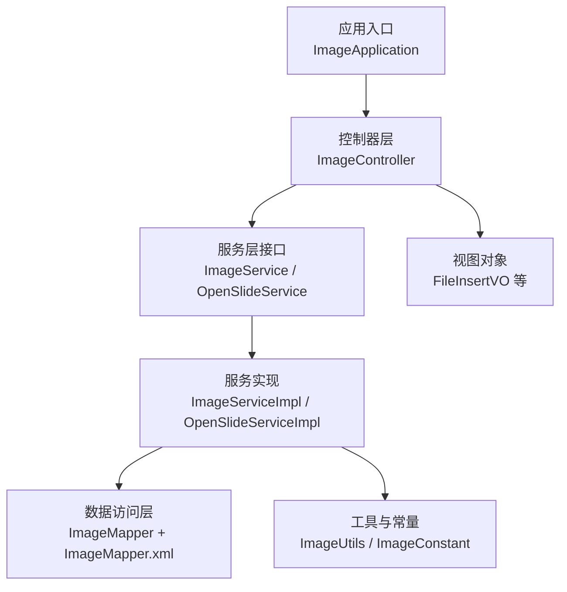
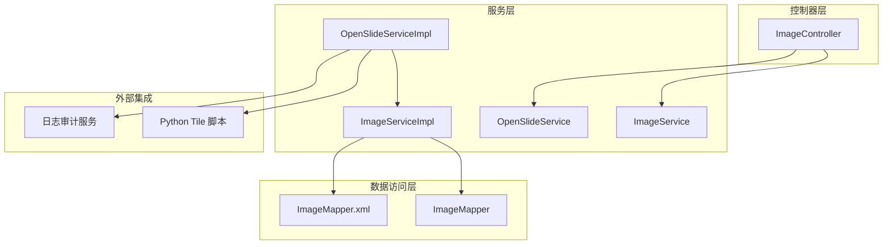
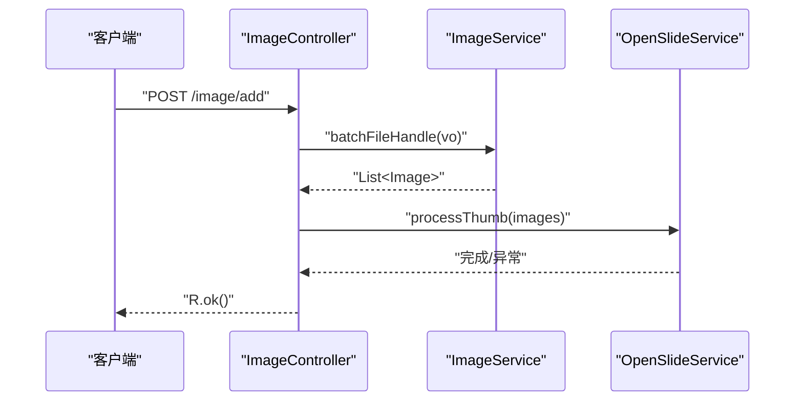
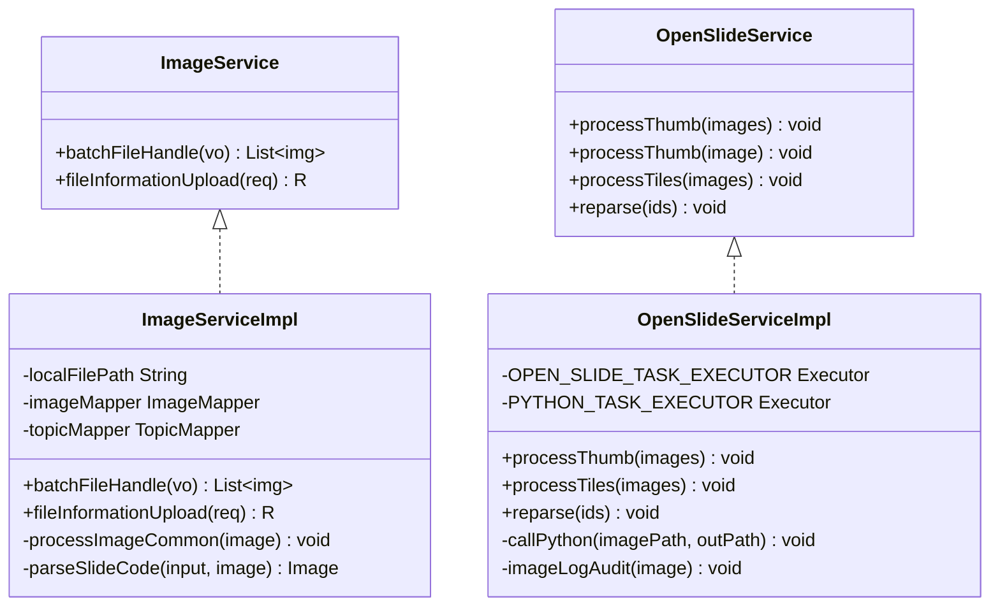
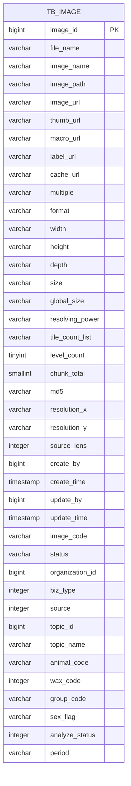
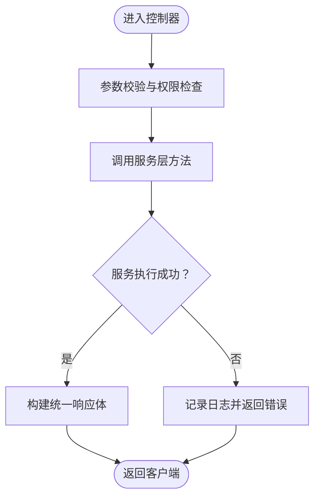
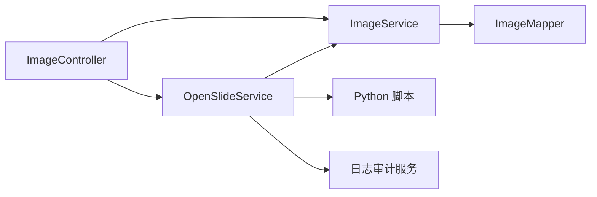

# 新功能开发

<cite>
**本文引用的文件**
- [ImageApplication.java](file://src/main/java/cn/staitech/ImageApplication.java)
- [ImageController.java](file://src/main/java/cn/staitech/file/controller/ImageController.java)
- [ImageService.java](file://src/main/java/cn/staitech/file/service/ImageService.java)
- [ImageServiceImpl.java](file://src/main/java/cn/staitech/file/service/impl/ImageServiceImpl.java)
- [OpenSlideService.java](file://src/main/java/cn/staitech/file/service/OpenSlideService.java)
- [OpenSlideServiceImpl.java](file://src/main/java/cn/staitech/file/service/impl/OpenSlideServiceImpl.java)
- [Image.java](file://src/main/java/cn/staitech/file/domain/Image.java)
- [ImageMapper.java](file://src/main/java/cn/staitech/file/mapper/ImageMapper.java)
- [ImageMapper.xml](file://src/main/resources/mapper/ImageMapper.xml)
- [ImageConstant.java](file://src/main/java/cn/staitech/file/constant/ImageConstant.java)
- [ImageUtils.java](file://src/main/java/cn/staitech/file/util/ImageUtils.java)
- [FileInsertVO.java](file://src/main/java/cn/staitech/file/vo/FileInsertVO.java)
</cite>

## 目录
1. [简介](#简介)
2. [项目结构](#项目结构)
3. [核心组件](#核心组件)
4. [架构总览](#架构总览)
5. [详细组件分析](#详细组件分析)
6. [依赖分析](#依赖分析)
7. [性能考虑](#性能考虑)
8. [故障排查指南](#故障排查指南)
9. [结论](#结论)
10. [附录](#附录)

## 简介
本指南面向在 PACMVS 图像服务（Image Service）上新增功能模块的开发者，围绕现有三层架构（控制器层、服务层、数据访问层）给出可复用的开发流程与最佳实践。重点解释如何扩展现有的 ImageService 与 ImageController，添加新的 API 接口与业务逻辑，并确保与微服务架构的集成一致性、可扩展性与可维护性。

## 项目结构
- 应用入口与装配：Spring Boot 启动类负责开启调度、WebSocket、安全配置、Feign 客户端、事务管理、发现客户端与指标注册等能力。
- 控制器层：位于 file.controller 包，提供 REST API，如“服务器选片”、“重新解析”、“检查失败切片”、“查询原始切片”等。
- 服务层：位于 file.service 与 file.service.impl，包含 ImageService、OpenSlideService 及其实现，承担业务编排与跨组件协作。
- 数据访问层：MyBatis Mapper 与 XML 映射，对应 Image 实体表结构。
- 工具与常量：ImageUtils、ImageConstant 等支撑文件校验、路径生成、状态码与常量定义。
- VO 层：FileInsertVO 等输入输出载体，保证 API 与内部处理解耦。

图表来源
- [ImageApplication.java:37-51](file://src/main/java/cn/staitech/ImageApplication.java#L37-L51)
- [ImageController.java:30-71](file://src/main/java/cn/staitech/file/controller/ImageController.java#L30-L71)
- [ImageService.java:17-23](file://src/main/java/cn/staitech/file/service/ImageService.java#L17-L23)
- [ImageServiceImpl.java:42-42](file://src/main/java/cn/staitech/file/service/impl/ImageServiceImpl.java#L42-L42)
- [OpenSlideService.java:14-39](file://src/main/java/cn/staitech/file/service/OpenSlideService.java#L14-L39)
- [OpenSlideServiceImpl.java:47-47](file://src/main/java/cn/staitech/file/service/impl/OpenSlideServiceImpl.java#L47-L47)
- [ImageMapper.java:13-16](file://src/main/java/cn/staitech/file/mapper/ImageMapper.java#L13-L16)
- [ImageMapper.xml:4-46](file://src/main/resources/mapper/ImageMapper.xml#L4-L46)
- [ImageUtils.java:20-148](file://src/main/java/cn/staitech/file/util/ImageUtils.java#L20-L148)
- [ImageConstant.java:9-67](file://src/main/java/cn/staitech/file/constant/ImageConstant.java#L9-L67)
- [FileInsertVO.java:14-26](file://src/main/java/cn/staitech/file/vo/FileInsertVO.java#L14-L26)

章节来源
- [ImageApplication.java:37-51](file://src/main/java/cn/staitech/ImageApplication.java#L37-L51)
- [ImageController.java:30-71](file://src/main/java/cn/staitech/file/controller/ImageController.java#L30-L71)

## 核心组件
- 应用入口与装配：启用调度、WebSocket、安全、Swagger、Feign、事务、Elasticsearch 仓库、服务发现与指标标签。
- 控制器层：集中暴露 REST 接口，统一返回 R<T> 结构，职责清晰。
- 服务层接口与实现：职责分离，便于替换与扩展；实现中包含幂等、重试、状态机推进与异步任务编排。
- 数据访问层：基于 MyBatis Plus 的 BaseMapper 与 XML 映射，支持复杂查询与批量操作。
- 工具与常量：统一文件名校验、路径生成、状态码与扩展名白名单等。

章节来源
- [ImageApplication.java:37-51](file://src/main/java/cn/staitech/ImageApplication.java#L37-L51)
- [ImageController.java:30-71](file://src/main/java/cn/staitech/file/controller/ImageController.java#L30-L71)
- [ImageService.java:17-23](file://src/main/java/cn/staitech/file/service/ImageService.java#L17-L23)
- [ImageServiceImpl.java:42-42](file://src/main/java/cn/staitech/file/service/impl/ImageServiceImpl.java#L42-L42)
- [OpenSlideService.java:14-39](file://src/main/java/cn/staitech/file/service/OpenSlideService.java#L14-L39)
- [OpenSlideServiceImpl.java:47-47](file://src/main/java/cn/staitech/file/service/impl/OpenSlideServiceImpl.java#L47-L47)
- [ImageMapper.java:13-16](file://src/main/java/cn/staitech/file/mapper/ImageMapper.java#L13-L16)
- [ImageMapper.xml:4-46](file://src/main/resources/mapper/ImageMapper.xml#L4-L46)
- [ImageUtils.java:20-148](file://src/main/java/cn/staitech/file/util/ImageUtils.java#L20-L148)
- [ImageConstant.java:9-67](file://src/main/java/cn/staitech/file/constant/ImageConstant.java#L9-L67)
- [FileInsertVO.java:14-26](file://src/main/java/cn/staitech/file/vo/FileInsertVO.java#L14-L26)

## 架构总览
下图展示控制器、服务与数据访问层之间的交互关系，以及与外部组件（Python 切片脚本、日志审计服务）的集成点。

图表来源
- [ImageController.java:30-71](file://src/main/java/cn/staitech/file/controller/ImageController.java#L30-L71)
- [ImageService.java:17-23](file://src/main/java/cn/staitech/file/service/ImageService.java#L17-L23)
- [OpenSlideService.java:14-39](file://src/main/java/cn/staitech/file/service/OpenSlideService.java#L14-L39)
- [ImageServiceImpl.java:42-42](file://src/main/java/cn/staitech/file/service/impl/ImageServiceImpl.java#L42-L42)
- [OpenSlideServiceImpl.java:47-47](file://src/main/java/cn/staitech/file/service/impl/OpenSlideServiceImpl.java#L47-L47)
- [ImageMapper.java:13-16](file://src/main/java/cn/staitech/file/mapper/ImageMapper.java#L13-L16)
- [ImageMapper.xml:4-46](file://src/main/resources/mapper/ImageMapper.xml#L4-L46)

## 详细组件分析

### 控制器层：ImageController 扩展
- 现有接口
  - 服务器选片：POST /image/add
  - 重新解析：POST /image/reparse
  - 检查失败切片：GET /image/checkFailImage
  - 查询原始切片：GET /image/getImage/{id}
- 扩展建议
  - 新增接口命名以 /image 前缀，遵循现有风格。
  - 使用统一返回体 R<T>，并在 Swagger 注解中明确接口含义与版本标记。
  - 在控制器中仅做参数校验、鉴权与调用服务层，不直接操作数据库。

图表来源
- [ImageController.java:42-48](file://src/main/java/cn/staitech/file/controller/ImageController.java#L42-L48)
- [ImageServiceImpl.java:63-140](file://src/main/java/cn/staitech/file/service/impl/ImageServiceImpl.java#L63-L140)
- [OpenSlideServiceImpl.java:277-312](file://src/main/java/cn/staitech/file/service/impl/OpenSlideServiceImpl.java#L277-L312)

章节来源
- [ImageController.java:30-71](file://src/main/java/cn/staitech/file/controller/ImageController.java#L30-L71)

### 服务层：ImageService 与 OpenSlideService 扩展
- ImageService
  - 负责文件插入批处理、文件信息上传、文件名解析与组织路径初始化等。
  - 扩展点：新增业务方法（如按条件统计、批量状态更新、文件名规则扩展），保持幂等与事务边界清晰。
- OpenSlideService
  - 负责缩略图生成、切片任务提交、失败文件迁移、日志审计上报等。
  - 扩展点：新增切片策略、多线程任务编排、失败重试策略、外部服务集成。

图表来源
- [ImageService.java:17-23](file://src/main/java/cn/staitech/file/service/ImageService.java#L17-L23)
- [ImageServiceImpl.java:42-42](file://src/main/java/cn/staitech/file/service/impl/ImageServiceImpl.java#L42-L42)
- [OpenSlideService.java:14-39](file://src/main/java/cn/staitech/file/service/OpenSlideService.java#L14-L39)
- [OpenSlideServiceImpl.java:47-47](file://src/main/java/cn/staitech/file/service/impl/OpenSlideServiceImpl.java#L47-L47)

章节来源
- [ImageService.java:17-23](file://src/main/java/cn/staitech/file/service/ImageService.java#L17-L23)
- [ImageServiceImpl.java:63-232](file://src/main/java/cn/staitech/file/service/impl/ImageServiceImpl.java#L63-L232)
- [OpenSlideService.java:14-39](file://src/main/java/cn/staitech/file/service/OpenSlideService.java#L14-L39)
- [OpenSlideServiceImpl.java:277-378](file://src/main/java/cn/staitech/file/service/impl/OpenSlideServiceImpl.java#L277-L378)

### 数据访问层：ImageMapper 与 XML 映射
- 基于 MyBatis Plus 的 BaseMapper，提供通用 CRUD 能力。
- XML 中定义了完整的字段映射与列清单，便于复杂查询与批量操作。
- 扩展建议：新增查询方法时，优先使用 LambdaQueryWrapper 与条件构造器，减少 SQL 字符串拼接风险。

图表来源
- [ImageMapper.xml:4-46](file://src/main/resources/mapper/ImageMapper.xml#L4-L46)
- [Image.java:27-216](file://src/main/java/cn/staitech/file/domain/Image.java#L27-L216)

章节来源
- [ImageMapper.java:13-16](file://src/main/java/cn/staitech/file/mapper/ImageMapper.java#L13-L16)
- [ImageMapper.xml:4-65](file://src/main/resources/mapper/ImageMapper.xml#L4-L65)
- [Image.java:27-216](file://src/main/java/cn/staitech/file/domain/Image.java#L27-L216)

### 实体类设计与 VO 设计
- 实体类 Image：完整映射 tb_image 表，包含状态、分辨率、层级、切片数量、专题与生物信息等字段。
- VO 类 FileInsertVO：承载“服务器选片”的输入参数，包含文件路径数组、组织ID等。
- 扩展建议：新增业务字段时，先在实体类中声明，再在 XML 中补齐 resultMap 与列清单，最后在服务层与控制器中补充相应逻辑。

章节来源
- [Image.java:27-216](file://src/main/java/cn/staitech/file/domain/Image.java#L27-L216)
- [FileInsertVO.java:14-26](file://src/main/java/cn/staitech/file/vo/FileInsertVO.java#L14-L26)

### Mapper 配置与 SQL 扩展
- 命名空间与实体映射：确保 namespace 与接口一致，resultMap 字段覆盖完整。
- 扩展查询：新增方法时，优先使用条件构造器与分页插件，避免硬编码 SQL。
- 批量操作：利用 MyBatis Plus 的批量方法，提升性能与可读性。

章节来源
- [ImageMapper.xml:4-65](file://src/main/resources/mapper/ImageMapper.xml#L4-L65)

### 控制器实现与 API 流程
- 统一返回体：控制器返回 R<T>，便于前端统一处理。
- 参数校验：使用 @Validated 与 VO 层约束，结合全局异常处理。
- 业务编排：控制器只负责编排，具体逻辑下沉至服务层实现。

图表来源
- [ImageController.java:42-69](file://src/main/java/cn/staitech/file/controller/ImageController.java#L42-L69)
- [ImageServiceImpl.java:63-140](file://src/main/java/cn/staitech/file/service/impl/ImageServiceImpl.java#L63-L140)

章节来源
- [ImageController.java:30-71](file://src/main/java/cn/staitech/file/controller/ImageController.java#L30-L71)

### 单元测试编写建议
- 控制器层：使用 Spring Boot Test 与 MockMvc，模拟请求与断言响应。
- 服务层：Mock Mapper 与外部依赖（如 Python 脚本、RestTemplate），验证核心业务分支与异常场景。
- 数据访问层：使用 H2 内存库或嵌入式数据库，执行 XML 映射与条件查询。
- 并发与异步：针对 OpenSlideServiceImpl 的异步任务，使用 CountDownLatch 或 CompletableFuture.allOf 等方式验证完成态。

章节来源
- [OpenSlideServiceImpl.java:277-378](file://src/main/java/cn/staitech/file/service/impl/OpenSlideServiceImpl.java#L277-L378)

## 依赖分析
- 组件内聚与耦合
  - 控制器仅依赖服务接口，降低对实现细节的耦合。
  - 服务实现依赖 Mapper 与工具类，通过常量与 VO 解耦配置与输入输出。
- 外部依赖
  - Python 切片脚本：通过进程调用执行，需关注退出码与日志输出。
  - 日志审计服务：通过 RestTemplate 调用，需考虑超时与降级策略。
- 循环依赖
  - 当前结构无循环依赖，扩展时应避免在服务实现中反向注入控制器。

图表来源
- [ImageController.java:30-71](file://src/main/java/cn/staitech/file/controller/ImageController.java#L30-L71)
- [OpenSlideServiceImpl.java:457-477](file://src/main/java/cn/staitech/file/service/impl/OpenSlideServiceImpl.java#L457-L477)

章节来源
- [OpenSlideServiceImpl.java:479-535](file://src/main/java/cn/staitech/file/service/impl/OpenSlideServiceImpl.java#L479-L535)

## 性能考虑
- 异步与并发
  - 使用线程池执行缩略图与切片任务，避免阻塞主线程。
  - 使用 CompletableFuture 并行处理多个图像，提高吞吐量。
- 批量操作
  - 批量保存与更新，减少数据库往返次数。
- I/O 优化
  - 缓存常用路径与组织ID格式化结果，减少重复计算。
- 外部调用
  - Python 脚本与日志审计服务采用异步上报，避免阻塞主流程。

章节来源
- [OpenSlideServiceImpl.java:277-312](file://src/main/java/cn/staitech/file/service/impl/OpenSlideServiceImpl.java#L277-L312)
- [OpenSlideServiceImpl.java:347-378](file://src/main/java/cn/staitech/file/service/impl/OpenSlideServiceImpl.java#L347-L378)

## 故障排查指南
- 常见问题
  - 文件路径无效或不可读：检查 FileInsertVO 中的 fileList 与本地路径配置。
  - OpenSlide 解析失败：确认文件格式与依赖库，必要时进行格式转换。
  - 切片任务失败：查看 Python 脚本日志与退出码，定位具体环节。
  - 失败文件迁移：确认失败目录可写，必要时回退到复制+删除策略。
- 日志与审计
  - OpenSlideServiceImpl 中的日志审计调用，可用于追踪状态变更与异常。
- 状态机
  - 依据 ImageConstant 中的状态码，定位当前处于哪个阶段，有助于快速定位问题。

章节来源
- [ImageServiceImpl.java:63-140](file://src/main/java/cn/staitech/file/service/impl/ImageServiceImpl.java#L63-L140)
- [OpenSlideServiceImpl.java:399-454](file://src/main/java/cn/staitech/file/service/impl/OpenSlideServiceImpl.java#L399-L454)
- [OpenSlideServiceImpl.java:487-535](file://src/main/java/cn/staitech/file/service/impl/OpenSlideServiceImpl.java#L487-L535)
- [ImageConstant.java:20-31](file://src/main/java/cn/staitech/file/constant/ImageConstant.java#L20-L31)

## 结论
在现有 PACMVS 图像服务架构上新增功能模块，应严格遵循“控制器层只编排、服务层做业务、数据访问层保稳定”的原则。通过接口抽象、统一返回体、幂等设计与异步并发处理，既能满足功能扩展需求，又能保证系统的可扩展性与可维护性。同时，借助完善的日志与审计机制，能够快速定位问题并持续优化性能。

## 附录
- 开发步骤清单
  - 设计实体类与 VO，完善 XML 映射与列清单。
  - 新增服务接口与实现，补充状态机推进与异常处理。
  - 在控制器中新增 API，统一返回体与 Swagger 注解。
  - 编写单元测试，覆盖正常与异常分支。
  - 集成外部依赖（Python 脚本、日志审计），评估性能与可靠性。
  - 提交 MR 前进行回归测试与性能压测。