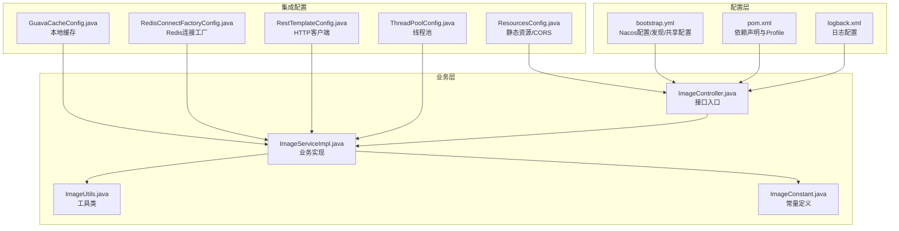
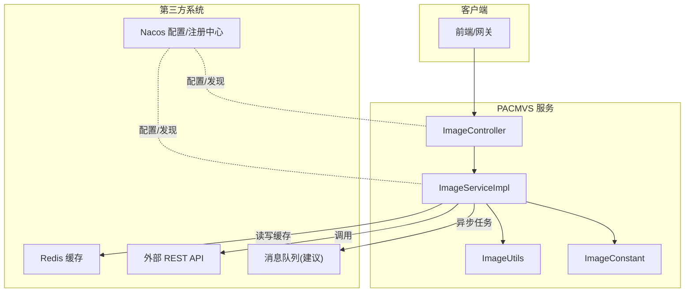
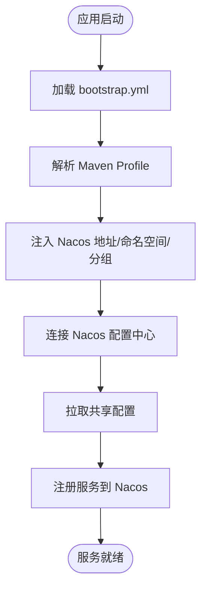
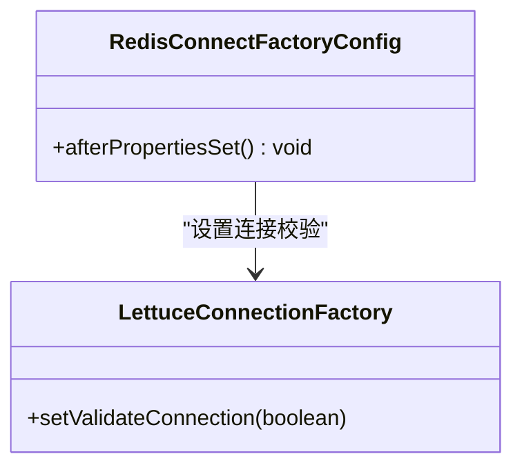
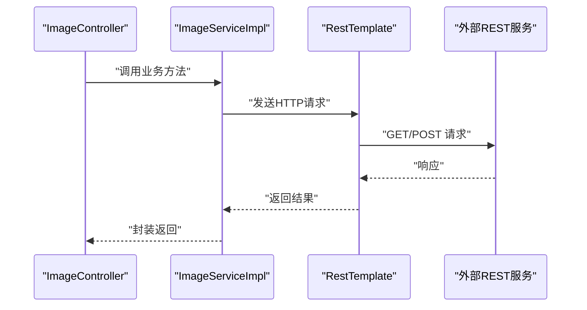
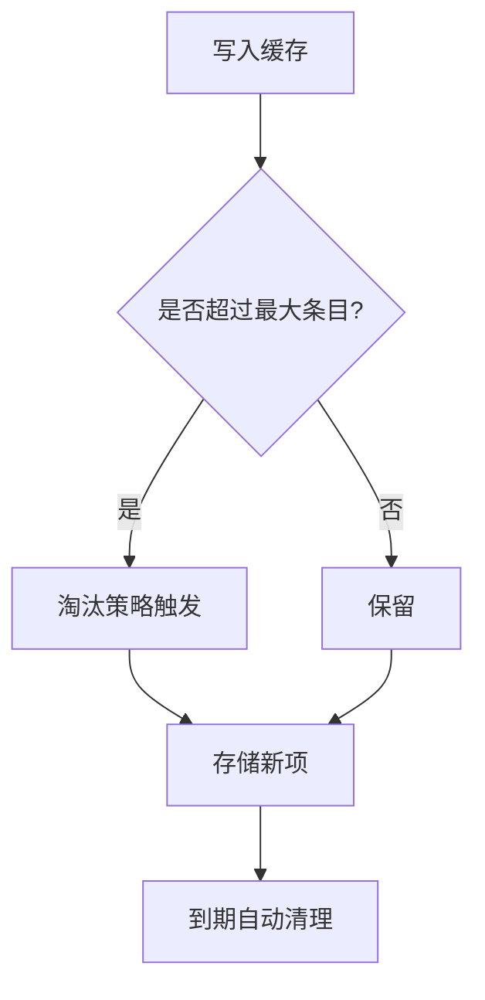
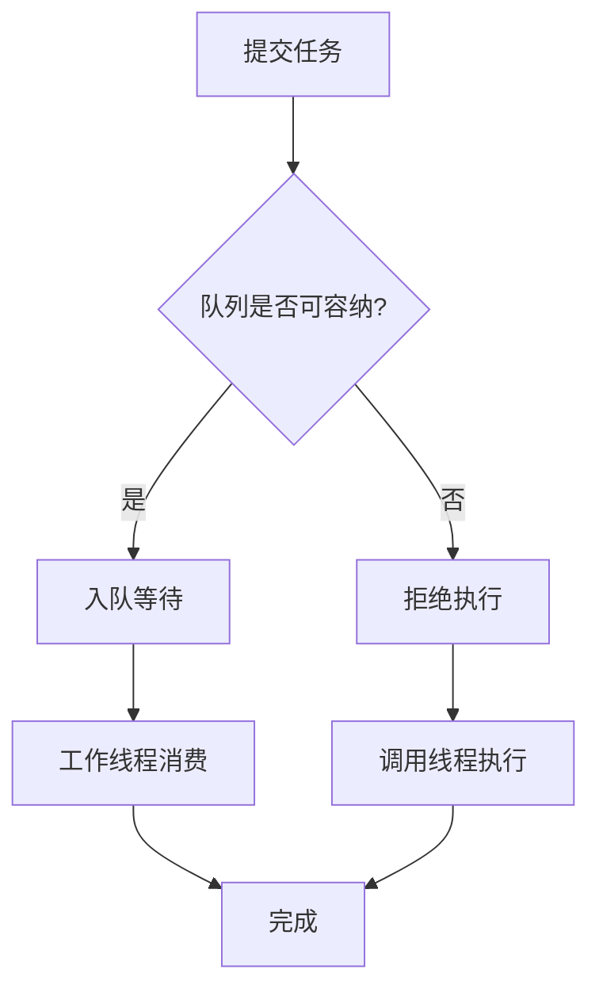
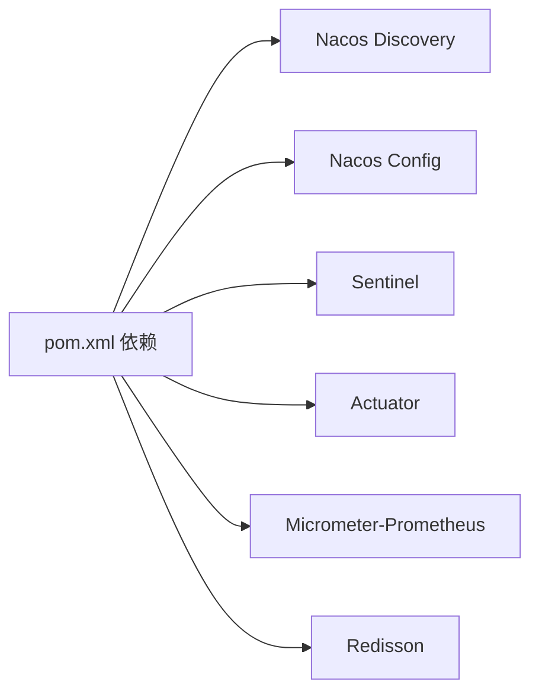

# 第三方系统集成

<cite>
**本文引用的文件**
- [bootstrap.yml](file://src/main/resources/bootstrap.yml)
- [pom.xml](file://pom.xml)
- [GuavaCacheConfig.java](file://src/main/java/cn/staitech/file/config/GuavaCacheConfig.java)
- [RedisConnectFactoryConfig.java](file://src/main/java/cn/staitech/file/config/RedisConnectFactoryConfig.java)
- [RestTemplateConfig.java](file://src/main/java/cn/staitech/file/config/RestTemplateConfig.java)
- [ThreadPoolConfig.java](file://src/main/java/cn/staitech/file/config/ThreadPoolConfig.java)
- [ResourcesConfig.java](file://src/main/java/cn/staitech/file/config/ResourcesConfig.java)
- [logback.xml](file://src/main/resources/logback.xml)
- [ImageController.java](file://src/main/java/cn/staitech/file/controller/ImageController.java)
- [ImageServiceImpl.java](file://src/main/java/cn/staitech/file/service/impl/ImageServiceImpl.java)
- [ImageUtils.java](file://src/main/java/cn/staitech/file/util/ImageUtils.java)
- [ImageConstant.java](file://src/main/java/cn/staitech/file/constant/ImageConstant.java)
</cite>

## 目录
1. [简介](#简介)
2. [项目结构](#项目结构)
3. [核心组件](#核心组件)
4. [架构总览](#架构总览)
5. [详细组件分析](#详细组件分析)
6. [依赖分析](#依赖分析)
7. [性能考虑](#性能考虑)
8. [故障排查指南](#故障排查指南)
9. [结论](#结论)
10. [附录](#附录)

## 简介
本指南面向在 PACMVS 微服务架构下进行第三方系统集成的工程师，重点覆盖以下方面：
- Nacos 配置中心与服务注册发现的接入方式与参数说明
- Redis 缓存系统的连接工厂配置与验证策略
- RestTemplate 客户端的超时、消息转换器与负载均衡配置
- Guava 缓存的本地内存缓存策略
- 微服务集成模式：服务发现、负载均衡、熔断与可观测性
- 外部 API 集成、数据同步与消息队列的实现建议
- 集成测试、监控告警与故障恢复的配置方法

## 项目结构
项目采用 Spring Boot + Spring Cloud Alibaba 的微服务架构，核心模块围绕“图像切片解析”展开，包含配置、控制器、服务层、工具类与常量定义。第三方系统集成主要体现在配置层与运行时依赖中。

图表来源
- [bootstrap.yml:1-37](file://src/main/resources/bootstrap.yml#L1-L37)
- [pom.xml:23-205](file://pom.xml#L23-L205)
- [GuavaCacheConfig.java:16-26](file://src/main/java/cn/staitech/file/config/GuavaCacheConfig.java#L16-L26)
- [RedisConnectFactoryConfig.java:10-26](file://src/main/java/cn/staitech/file/config/RedisConnectFactoryConfig.java#L10-L26)
- [RestTemplateConfig.java:21-49](file://src/main/java/cn/staitech/file/config/RestTemplateConfig.java#L21-L49)
- [ThreadPoolConfig.java:10-65](file://src/main/java/cn/staitech/file/config/ThreadPoolConfig.java#L10-L65)
- [ResourcesConfig.java:16-51](file://src/main/java/cn/staitech/file/config/ResourcesConfig.java#L16-L51)
- [ImageController.java:26-72](file://src/main/java/cn/staitech/file/controller/ImageController.java#L26-L72)
- [ImageServiceImpl.java:39-548](file://src/main/java/cn/staitech/file/service/impl/ImageServiceImpl.java#L39-L548)
- [ImageUtils.java:19-148](file://src/main/java/cn/staitech/file/util/ImageUtils.java#L19-L148)
- [ImageConstant.java:9-67](file://src/main/java/cn/staitech/file/constant/ImageConstant.java#L9-L67)

章节来源
- [bootstrap.yml:1-37](file://src/main/resources/bootstrap.yml#L1-L37)
- [pom.xml:23-205](file://pom.xml#L23-L205)

## 核心组件
- Nacos 配置与服务发现：通过 bootstrap.yml 中的 discovery/config 字段启用，支持命名空间、分组与共享配置。
- Redis 连接工厂：通过 RedisConnectFactoryConfig 在 LettuceConnectionFactory 上开启连接校验。
- RestTemplate 客户端：启用 @LoadBalanced，配置连接/读取/请求超时与 JSON 转换器。
- Guava 本地缓存：提供简单易用的本地内存缓存，适用于轻量场景。
- 线程池：为 OpenSlide 与 Python 脚本处理提供异步执行能力。
- 静态资源与 CORS：统一映射本地文件路径并开放 GET 跨域访问。

章节来源
- [bootstrap.yml:17-37](file://src/main/resources/bootstrap.yml#L17-L37)
- [RedisConnectFactoryConfig.java:10-26](file://src/main/java/cn/staitech/file/config/RedisConnectFactoryConfig.java#L10-L26)
- [RestTemplateConfig.java:21-49](file://src/main/java/cn/staitech/file/config/RestTemplateConfig.java#L21-L49)
- [GuavaCacheConfig.java:16-26](file://src/main/java/cn/staitech/file/config/GuavaCacheConfig.java#L16-L26)
- [ThreadPoolConfig.java:10-65](file://src/main/java/cn/staitech/file/config/ThreadPoolConfig.java#L10-L65)
- [ResourcesConfig.java:16-51](file://src/main/java/cn/staitech/file/config/ResourcesConfig.java#L16-L51)

## 架构总览
下图展示 PACMVS 在微服务架构下的第三方系统集成关系与数据流：

图表来源
- [ImageController.java:26-72](file://src/main/java/cn/staitech/file/controller/ImageController.java#L26-L72)
- [ImageServiceImpl.java:39-548](file://src/main/java/cn/staitech/file/service/impl/ImageServiceImpl.java#L39-L548)
- [ImageUtils.java:19-148](file://src/main/java/cn/staitech/file/util/ImageUtils.java#L19-L148)
- [ImageConstant.java:9-67](file://src/main/java/cn/staitech/file/constant/ImageConstant.java#L9-L67)
- [bootstrap.yml:17-37](file://src/main/resources/bootstrap.yml#L17-L37)

## 详细组件分析

### Nacos 配置中心与服务发现
- 启用方式：在 bootstrap.yml 中配置 spring.cloud.nacos.discovery 与 spring.cloud.nacos.config。
- 关键参数：
  - server-addr：Nacos 地址占位符，由 Maven Profile 注入。
  - namespace/group：命名空间与分组，便于多环境隔离。
  - file-extension：配置文件格式。
  - shared-configs：共享配置列表，按激活的 profile 自动拼接。
- Profile 注入：pom.xml 中定义 pacmvsdev/testpvcmvs/pathmedics 三套环境，分别注入不同的 serverAddr、namespace、group。

图表来源
- [bootstrap.yml:17-37](file://src/main/resources/bootstrap.yml#L17-L37)
- [pom.xml:349-384](file://pom.xml#L349-L384)

章节来源
- [bootstrap.yml:17-37](file://src/main/resources/bootstrap.yml#L17-L37)
- [pom.xml:349-384](file://pom.xml#L349-L384)

### Redis 缓存系统
- 连接工厂：通过 RedisConnectFactoryConfig 对 LettuceConnectionFactory 设置 validateConnection=true，提升连接可用性。
- 使用建议：
  - 结合 Spring Data Redis 或 Redisson 使用，注意序列化策略与过期策略。
  - 在高并发场景下配合连接池与哨兵/集群部署。

图表来源
- [RedisConnectFactoryConfig.java:10-26](file://src/main/java/cn/staitech/file/config/RedisConnectFactoryConfig.java#L10-L26)

章节来源
- [RedisConnectFactoryConfig.java:10-26](file://src/main/java/cn/staitech/file/config/RedisConnectFactoryConfig.java#L10-L26)

### RestTemplate 客户端
- 负载均衡：@LoadBalanced 注解启用服务名直连与客户端负载均衡。
- 超时配置：连接超时、读取超时、连接请求超时。
- 消息转换器：JSON 转换器支持 APPLICATION_JSON 与 APPLICATION_JSON_UTF8。
- 使用建议：
  - 与 Nacos 服务名配合，避免硬编码 IP。
  - 在高并发场景下结合线程池与限流熔断。

图表来源
- [RestTemplateConfig.java:21-49](file://src/main/java/cn/staitech/file/config/RestTemplateConfig.java#L21-L49)
- [ImageController.java:26-72](file://src/main/java/cn/staitech/file/controller/ImageController.java#L26-L72)
- [ImageServiceImpl.java:39-548](file://src/main/java/cn/staitech/file/service/impl/ImageServiceImpl.java#L39-L548)

章节来源
- [RestTemplateConfig.java:21-49](file://src/main/java/cn/staitech/file/config/RestTemplateConfig.java#L21-L49)
- [ImageController.java:26-72](file://src/main/java/cn/staitech/file/controller/ImageController.java#L26-L72)
- [ImageServiceImpl.java:39-548](file://src/main/java/cn/staitech/file/service/impl/ImageServiceImpl.java#L39-L548)

### Guava 缓存
- 配置要点：最大条目数、写入后过期时间。
- 适用场景：轻量级本地缓存，避免频繁 IO 或远程调用。
- 注意事项：进程内缓存，不支持分布式共享。

图表来源
- [GuavaCacheConfig.java:16-26](file://src/main/java/cn/staitech/file/config/GuavaCacheConfig.java#L16-L26)

章节来源
- [GuavaCacheConfig.java:16-26](file://src/main/java/cn/staitech/file/config/GuavaCacheConfig.java#L16-L26)

### 线程池与异步处理
- OpenSlide 线程池：针对图像解析任务，动态计算核心数并设置阻塞队列。
- Python 脚本线程池：针对外部脚本执行，保证最小线程数与拒绝策略。
- 拒绝策略：记录错误并回退到调用线程执行，保障任务不丢失。

图表来源
- [ThreadPoolConfig.java:10-65](file://src/main/java/cn/staitech/file/config/ThreadPoolConfig.java#L10-L65)

章节来源
- [ThreadPoolConfig.java:10-65](file://src/main/java/cn/staitech/file/config/ThreadPoolConfig.java#L10-L65)

### 静态资源与跨域
- 资源映射：将本地文件根路径映射为可访问的 URL 前缀。
- CORS：开放指定前缀的 GET 跨域访问，便于前端直接访问本地文件。

章节来源
- [ResourcesConfig.java:16-51](file://src/main/java/cn/staitech/file/config/ResourcesConfig.java#L16-L51)

### 外部 API 集成、数据同步与消息队列
- 外部 API 集成：通过 RestTemplate 发起 HTTP 请求，结合 Nacos 服务名实现服务发现与负载均衡。
- 数据同步：可在业务层增加幂等控制与重试策略，必要时引入消息队列进行削峰填谷与最终一致性保障。
- 消息队列：建议引入 RabbitMQ/Kafka 等中间件，结合 Spring Cloud Stream 或原生模板实现可靠投递与消费确认。

（本节为概念性指导，不直接分析具体文件）

## 依赖分析
- Nacos Discovery/Config：启用服务注册与配置中心能力。
- Sentinel：提供流量控制、熔断降级与系统自适应保护。
- Actuator + Micrometer(Prometheus)：暴露健康检查与指标，对接监控平台。
- Redisson：提供分布式锁、限流等高级特性（可选）。

图表来源
- [pom.xml:23-205](file://pom.xml#L23-L205)

章节来源
- [pom.xml:23-205](file://pom.xml#L23-L205)

## 性能考虑
- 连接池与超时：合理设置 RestTemplate 的连接/读取超时，避免长时间阻塞。
- 缓存策略：Guava 缓存适合轻量场景；Redis 适合高并发与分布式共享。
- 线程池：根据 CPU 核心数与任务特征调整线程池大小与队列长度，避免 OOM。
- 监控指标：利用 Actuator + Prometheus 指标，关注请求延迟、错误率与线程池饱和度。

（本节提供通用建议，不直接分析具体文件）

## 故障排查指南
- Nacos 配置拉取失败：检查 bootstrap.yml 中 server-addr、namespace、group 是否与 Profile 注入一致；查看日志中 com.alibaba.cloud.nacos.client 的调试信息。
- Redis 连接异常：确认 Lettuce 连接工厂已启用 validateConnection；检查网络连通性与认证配置。
- RestTemplate 超时：核对连接/读取/请求超时配置；必要时增加重试与熔断。
- 日志定位：logback.xml 已配置控制台与滚动文件输出，关注 INFO/WARN/ERROR/DEBUG 级别日志。

章节来源
- [logback.xml:105-116](file://src/main/resources/logback.xml#L105-L116)
- [bootstrap.yml:17-37](file://src/main/resources/bootstrap.yml#L17-L37)
- [RedisConnectFactoryConfig.java:10-26](file://src/main/java/cn/staitech/file/config/RedisConnectFactoryConfig.java#L10-L26)
- [RestTemplateConfig.java:21-49](file://src/main/java/cn/staitech/file/config/RestTemplateConfig.java#L21-L49)

## 结论
本指南梳理了 PACMVS 在微服务架构下与 Nacos、Redis、RestTemplate、Guava 缓存等第三方系统的集成方式与最佳实践。通过合理的配置与组件设计，可实现服务发现、负载均衡、熔断与可观测性，满足生产环境的稳定性与可维护性要求。对于外部 API、数据同步与消息队列，建议结合业务场景引入合适的中间件与治理策略，持续完善监控与告警体系。

## 附录
- 集成测试建议：
  - 使用 Testcontainers 启动 Nacos/Redis 容器进行端到端测试。
  - 对 RestTemplate 调用增加超时与重试策略，模拟网络抖动。
- 监控告警：
  - 暴露健康检查与指标，对接 Prometheus/Grafana。
  - 配置告警规则：请求错误率、超时比例、线程池饱和度。
- 故障恢复：
  - 采用熔断降级与快速失败策略，避免雪崩。
  - 引入重试与死信队列，保障消息与任务的最终一致性。

（本节为通用建议，不直接分析具体文件）