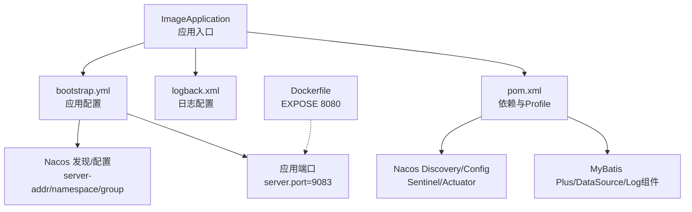
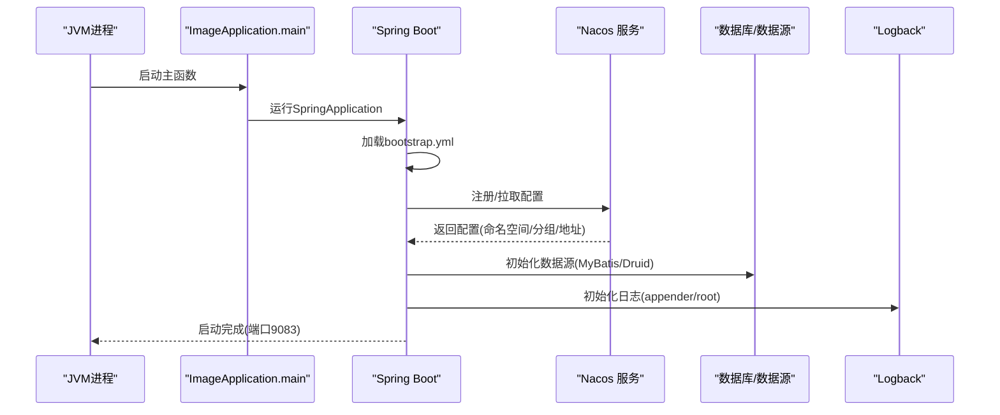
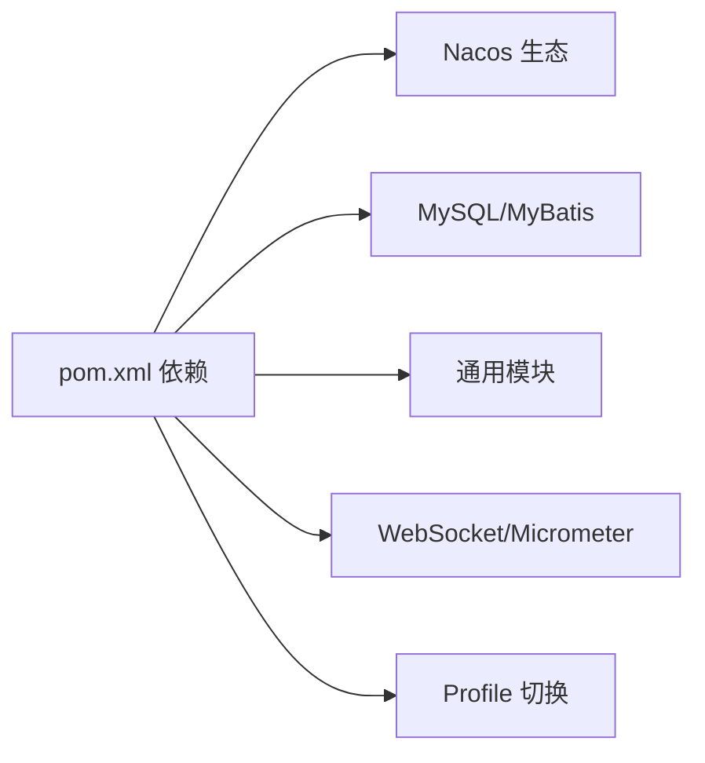
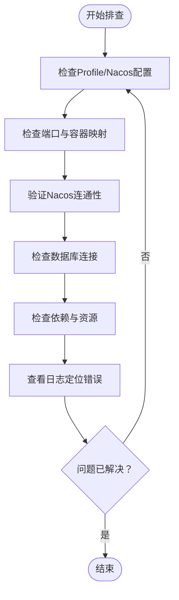

# 启动问题排查

<cite>
**本文引用的文件**
- [ImageApplication.java](file://src/main/java/cn/staitech/ImageApplication.java)
- [bootstrap.yml](file://src/main/resources/bootstrap.yml)
- [pom.xml](file://pom.xml)
- [Dockerfile](file://Dockerfile)
- [logback.xml](file://src/main/resources/logback.xml)
- [GuavaCacheConfig.java](file://src/main/java/cn/staitech/file/config/GuavaCacheConfig.java)
- [RedisConnectFactoryConfig.java](file://src/main/java/cn/staitech/file/config/RedisConnectFactoryConfig.java)
</cite>

## 目录
1. [简介](#简介)
2. [项目结构](#项目结构)
3. [核心组件](#核心组件)
4. [架构总览](#架构总览)
5. [详细组件分析](#详细组件分析)
6. [依赖分析](#依赖分析)
7. [性能考虑](#性能考虑)
8. [故障排查指南](#故障排查指南)
9. [结论](#结论)
10. [附录](#附录)

## 简介
本文件面向PACMVS图像服务模块的启动问题排查，聚焦于应用启动失败的常见原因与解决方案，覆盖端口冲突、配置文件错误、依赖缺失、Nacos服务发现与配置中心、数据库连接、日志配置等关键点。文档提供启动日志的关键错误识别方法、完整的启动检查清单与分步故障排除流程，帮助开发者快速定位并解决问题。

## 项目结构
该模块为Spring Boot应用，采用Spring Cloud Alibaba生态，使用Nacos作为服务注册与配置中心，并通过Maven Profile切换不同环境配置。Docker镜像构建脚本将JAR暴露8080端口，但应用默认监听端口由配置文件指定。

图表来源
- [ImageApplication.java:39-44](file://src/main/java/cn/staitech/ImageApplication.java#L39-L44)
- [bootstrap.yml:2-3](file://src/main/resources/bootstrap.yml#L2-L3)
- [bootstrap.yml:17-36](file://src/main/resources/bootstrap.yml#L17-L36)
- [pom.xml:23-205](file://pom.xml#L23-L205)
- [Dockerfile:12](file://Dockerfile#L12)

章节来源
- [ImageApplication.java:39-44](file://src/main/java/cn/staitech/ImageApplication.java#L39-L44)
- [bootstrap.yml:1-37](file://src/main/resources/bootstrap.yml#L1-L37)
- [pom.xml:348-384](file://pom.xml#L348-L384)
- [Dockerfile:1-16](file://Dockerfile#L1-L16)

## 核心组件
- 应用入口与注解装配
  - 启动类启用调度、WebSocket、自定义安全与Swagger、Feign客户端、事务管理、Elasticsearch仓库、服务发现与指标标签。
  - 关键注解：@SpringBootApplication、@EnableDiscoveryClient、@EnableFeignClients、@EnableScheduling、@EnableWebSocket、@EnableTransactionManagement。
- 配置中心与服务发现
  - 通过bootstrap.yml配置Nacos服务地址、命名空间、分组以及共享配置。
  - 端口默认9083，Docker镜像EXPOSE 8080，需确保容器映射一致。
- 日志系统
  - 使用Logback，按级别滚动输出至独立文件，开启Nacos与SQL调试日志以辅助排查。
- 依赖与Profile
  - Maven Profile提供开发/测试/生产三套环境，包含Nacos地址、命名空间与分组等变量。

章节来源
- [ImageApplication.java:27-36](file://src/main/java/cn/staitech/ImageApplication.java#L27-L36)
- [bootstrap.yml:17-36](file://src/main/resources/bootstrap.yml#L17-L36)
- [logback.xml:105-115](file://src/main/resources/logback.xml#L105-L115)
- [pom.xml:348-384](file://pom.xml#L348-L384)

## 架构总览
应用启动涉及以下关键链路：JVM初始化 → Spring Boot启动 → 加载bootstrap.yml → 连接Nacos注册与配置 → 初始化数据源与业务组件 → 暴露HTTP端口与监控。

图表来源
- [ImageApplication.java:39-44](file://src/main/java/cn/staitech/ImageApplication.java#L39-L44)
- [bootstrap.yml:17-36](file://src/main/resources/bootstrap.yml#L17-L36)
- [logback.xml:109-115](file://src/main/resources/logback.xml#L109-L115)

## 详细组件分析

### 启动入口与装配
- 职责：设置时区、启动Spring Boot应用、注册Micrometer标签。
- 关键点：排除Seata自动配置；启用Elasticsearch仓库扫描；开启定时任务与WebSocket。
- 故障风险：注解遗漏或顺序不当可能导致组件未初始化。

章节来源
- [ImageApplication.java:39-50](file://src/main/java/cn/staitech/ImageApplication.java#L39-L50)

### Nacos服务发现与配置中心
- 配置要点
  - 服务注册地址：server-addr
  - 命名空间：namespace
  - 分组：group
  - 共享配置：shared-configs
  - Profile变量：@serverAddr@、@nacosNamespace@、@nacosGroup@由Maven Profile注入
- 启动校验
  - Nacos地址可达性
  - 命名空间与分组正确
  - 共享配置文件存在且可读
  - Profile激活值与期望环境一致

章节来源
- [bootstrap.yml:17-36](file://src/main/resources/bootstrap.yml#L17-L36)
- [pom.xml:348-384](file://pom.xml#L348-L384)

### 端口与容器暴露
- 应用默认端口：9083
- Docker镜像暴露端口：8080
- 常见问题：容器映射与应用端口不一致导致访问失败

章节来源
- [bootstrap.yml:2-3](file://src/main/resources/bootstrap.yml#L2-L3)
- [Dockerfile:12](file://Dockerfile#L12)

### 日志配置与调试
- 输出策略：控制台+按级别滚动文件(info/warn/error/debug)
- 调试开关：开启Nacos客户端与SQL语句日志
- 排查建议：优先查看error与debug日志文件，定位异常堆栈

章节来源
- [logback.xml:105-115](file://src/main/resources/logback.xml#L105-L115)

### 数据库与数据源
- 依赖：MySQL驱动、MyBatis Plus、通用数据源组件
- 建议：确认数据库连通性、账号权限、Schema初始化状态
- 排查：关注SQL执行日志与连接池初始化日志

章节来源
- [pom.xml:60-70](file://pom.xml#L60-L70)
- [pom.xml:132-143](file://pom.xml#L132-L143)
- [logback.xml:107](file://src/main/resources/logback.xml#L107)

### 缓存与Redis连接工厂
- Guava缓存：基础内存缓存，容量与过期策略
- Redis连接工厂：Lettuce连接验证开启，确保连接有效性

章节来源
- [GuavaCacheConfig.java:19-25](file://src/main/java/cn/staitech/file/config/GuavaCacheConfig.java#L19-L25)
- [RedisConnectFactoryConfig.java:20-23](file://src/main/java/cn/staitech/file/config/RedisConnectFactoryConfig.java#L20-L23)

## 依赖分析
- 外部依赖
  - Nacos Discovery/Config/Sentinel/Actuator
  - MySQL驱动、MyBatis Plus、通用数据源/数据范围/日志组件
  - WebSocket、Prometheus Micrometer
- 内部依赖
  - 通用模块：common-datasource、common-datascope、common-log、common-swagger
- Profile差异
  - 开发/测试/生产三套环境，分别指向不同Nacos地址与命名空间

图表来源
- [pom.xml:23-205](file://pom.xml#L23-L205)
- [pom.xml:348-384](file://pom.xml#L348-L384)

章节来源
- [pom.xml:23-205](file://pom.xml#L23-L205)
- [pom.xml:348-384](file://pom.xml#L348-L384)

## 性能考虑
- 日志级别：生产环境建议INFO以上，避免过多DEBUG开销
- 缓存策略：Guava缓存容量与过期时间需结合业务QPS评估
- 连接池：数据库与Redis连接池参数应与并发量匹配
- 容器资源：容器CPU/内存限制与JVM参数协调

## 故障排查指南

### 启动前检查清单
- 环境与Profile
  - 是否正确激活目标Profile（开发/测试/生产）
  - Nacos地址、命名空间、分组是否与Profile一致
- 端口与网络
  - 应用端口9083是否被占用
  - 容器映射是否与应用端口一致（Docker EXPOSE 8080 vs 应用端口9083）
- Nacos连通性
  - 可否telnet/ping Nacos地址
  - 命名空间与分组是否存在
  - 共享配置文件是否存在且可读
- 数据库
  - 地址、账号、密码、Schema是否正确
  - 连接池初始化是否报错
- 依赖与资源
  - 必要系统库（OpenSlide/OpenCV）是否就绪
  - 自定义JAR是否随打包进入BOOT-INF/lib
- 日志
  - 日志目录是否存在且可写
  - 是否开启Nacos与SQL调试日志

### 启动日志关键信息识别
- Nacos相关
  - 配置拉取失败、命名空间/分组错误、连接超时
- 数据库相关
  - 连接失败、驱动缺失、SQL执行异常
- 端口冲突
  - 绑定端口失败、端口已被占用
- 依赖缺失
  - 类找不到、系统库加载失败
- 日志输出
  - 查看error与debug日志文件定位异常堆栈

章节来源
- [logback.xml:105-115](file://src/main/resources/logback.xml#L105-L115)

### 分步故障排除流程
1. 确认Profile与Nacos配置
   - 检查bootstrap.yml中的server-addr/namespace/group
   - 验证Maven Profile是否生效（@activatedProperties@）
2. 校验端口与容器映射
   - 检查应用端口9083是否被占用
   - 容器运行时映射是否正确（宿主端口:9083 或 8080:8080）
3. 排查Nacos连通性
   - 使用工具验证Nacos地址可达
   - 在日志中查找Nacos客户端初始化与配置拉取结果
4. 校验数据库连接
   - 确认数据库连通性与权限
   - 查看SQL与连接池初始化日志
5. 检查依赖与资源
   - 确认系统库与自定义JAR已打包
   - 观察类加载与初始化异常
6. 查看日志
   - 定位ERROR级别异常堆栈
   - 打开Nacos与SQL调试日志辅助分析

## 结论
启动失败通常由配置错误、网络不可达、端口冲突或依赖缺失引起。建议按照“Profile/Nacos → 端口/容器 → 网络 → 数据库 → 依赖 → 日志”的顺序逐项排查，并利用Nacos与SQL调试日志快速定位根因。通过完善启动前检查清单与标准化排查流程，可显著提升问题解决效率。

## 附录

### 关键配置与文件路径速查
- 应用入口：[ImageApplication.java](file://src/main/java/cn/staitech/ImageApplication.java)
- 启动配置：[bootstrap.yml](file://src/main/resources/bootstrap.yml)
- 日志配置：[logback.xml](file://src/main/resources/logback.xml)
- 依赖与Profile：[pom.xml](file://pom.xml)
- 容器端口：[Dockerfile](file://Dockerfile)