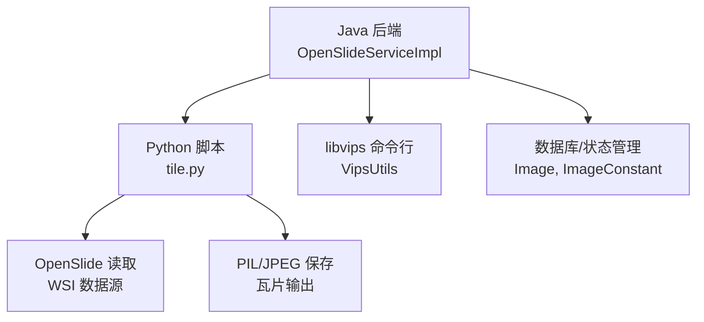
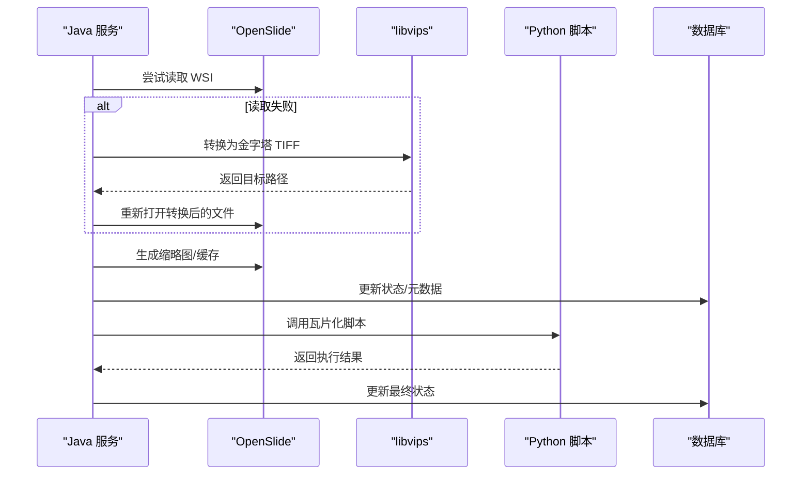
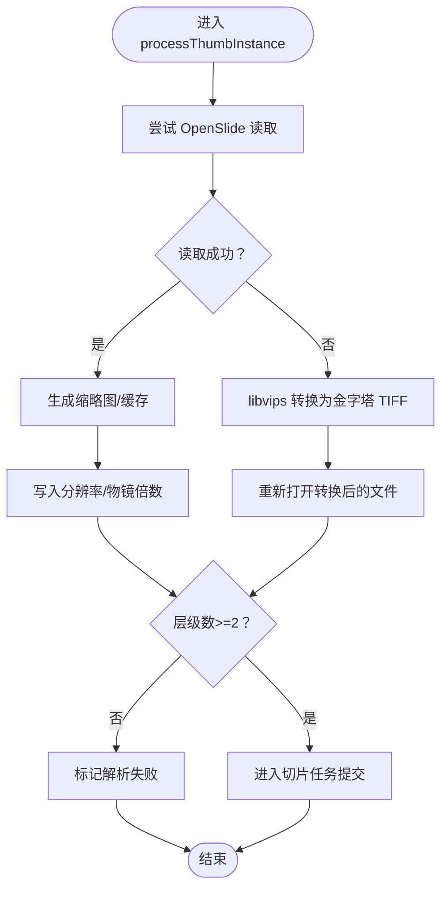
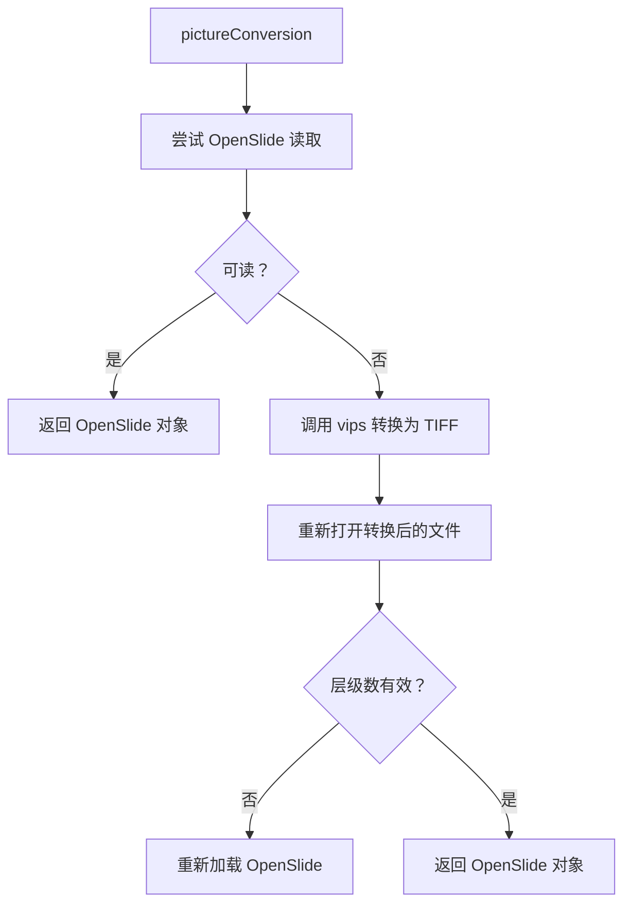
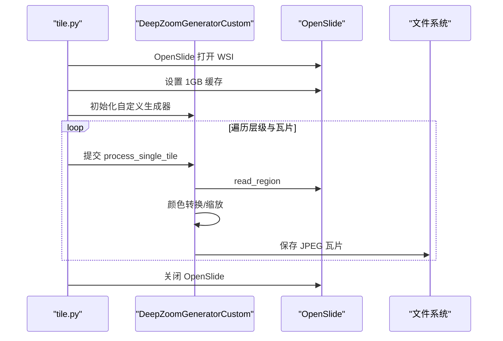
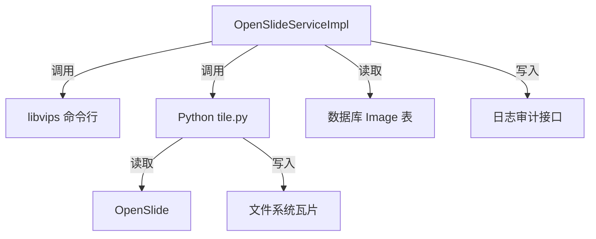

# 图像处理错误排查

<cite>
**本文引用的文件**
- [OpenSlideServiceImpl.java](file://src/main/java/cn/staitech/file/service/impl/OpenSlideServiceImpl.java)
- [OpenSlideService.java](file://src/main/java/cn/staitech/file/service/OpenSlideService.java)
- [ImageUtils.java](file://src/main/java/cn/staitech/file/util/ImageUtils.java)
- [VipsUtils.java](file://src/main/java/cn/staitech/file/util/VipsUtils.java)
- [deepzoom_custom.py](file://python-script/deepzoom_custom.py)
- [tile.py](file://python-script/tile.py)
- [Image.java](file://src/main/java/cn/staitech/file/domain/Image.java)
- [ImageConstant.java](file://src/main/java/cn/staitech/file/constant/ImageConstant.java)
- [pom.xml](file://pom.xml)
- [bootstrap.yml](file://src/main/resources/bootstrap.yml)
- [docker 模块脚本 tile.py](file://docker/staitech/modules/image/script/tile.py)
- [docker 模块脚本 deepzoom_custom.py](file://docker/staitech/modules/image/script/deepzoom_custom.py)
</cite>

## 目录
1. [简介](#简介)
2. [项目结构](#项目结构)
3. [核心组件](#核心组件)
4. [架构总览](#架构总览)
5. [详细组件分析](#详细组件分析)
6. [依赖分析](#依赖分析)
7. [性能考虑](#性能考虑)
8. [故障排查指南](#故障排查指南)
9. [结论](#结论)
10. [附录](#附录)

## 简介
本指南聚焦于 PACMVS 项目在图像处理流程中的常见错误排查，覆盖 OpenSlide 读取失败、libvips 转换错误、Python 脚本执行异常等场景，并结合医学图像格式兼容性、图像质量检查、像素格式转换诊断、内存溢出防护、预处理技巧、批处理优化与错误重试机制，提供完整的问题定位与质量保障方案。

## 项目结构
项目采用 Spring Boot 微服务架构，图像处理由 Java 后端协调 Python 脚本完成：
- Java 层负责缩略图生成、元数据解析、状态流转与失败归档，以及调用 Python 切片脚本。
- Python 层基于 OpenSlide 和 PIL 进行瓦片化、颜色空间转换与磁盘输出。
- libvips 通过命令行工具桥接 Java 与 OpenSlide 的金字塔 TIFF 转换。

图表来源
- [OpenSlideServiceImpl.java:140-202](file://src/main/java/cn/staitech/file/service/impl/OpenSlideServiceImpl.java#L140-L202)
- [tile.py:84-99](file://python-script/tile.py#L84-L99)
- [VipsUtils.java:22-35](file://src/main/java/cn/staitech/file/util/VipsUtils.java#L22-L35)

章节来源
- [OpenSlideServiceImpl.java:140-202](file://src/main/java/cn/staitech/file/service/impl/OpenSlideServiceImpl.java#L140-L202)
- [ImageUtils.java:52-97](file://src/main/java/cn/staitech/file/util/ImageUtils.java#L52-L97)
- [VipsUtils.java:22-35](file://src/main/java/cn/staitech/file/util/VipsUtils.java#L22-L35)
- [tile.py:84-99](file://python-script/tile.py#L84-L99)

## 核心组件
- OpenSlide 服务接口与实现：负责缩略图生成、元数据提取、状态更新、失败归档与 Python 切片任务提交。
- 图像工具类：封装 OpenSlide 可读性检测、金字塔 TIFF 转换、目录检查与扩展名校验。
- libvips 工具类：封装 vips 命令行转换，生成带金字塔与瓦片的 TIFF。
- Python 切片脚本：基于 OpenSlide 的深度瓦片生成器，多线程流式输出，具备缓存与并发控制。
- 数据模型与常量：统一状态码、格式标识与路径基址，支撑流程控制与日志审计。

章节来源
- [OpenSlideService.java:14-38](file://src/main/java/cn/staitech/file/service/OpenSlideService.java#L14-L38)
- [OpenSlideServiceImpl.java:47-72](file://src/main/java/cn/staitech/file/service/impl/OpenSlideServiceImpl.java#L47-L72)
- [ImageUtils.java:20-97](file://src/main/java/cn/staitech/file/util/ImageUtils.java#L20-L97)
- [VipsUtils.java:11-35](file://src/main/java/cn/staitech/file/util/VipsUtils.java#L11-L35)
- [Image.java:27-216](file://src/main/java/cn/staitech/file/domain/Image.java#L27-L216)
- [ImageConstant.java:9-67](file://src/main/java/cn/staitech/file/constant/ImageConstant.java#L9-L67)

## 架构总览
整体流程：Java 侧先尝试用 OpenSlide 直接读取 WSI，若失败则通过 libvips 转换为金字塔 TIFF 再读取；随后生成缩略图与缓存，再调用 Python 脚本进行瓦片化；过程中根据状态码更新数据库并记录审计日志；失败时将源文件移动至失败目录。

图表来源
- [OpenSlideServiceImpl.java:149-202](file://src/main/java/cn/staitech/file/service/impl/OpenSlideServiceImpl.java#L149-L202)
- [ImageUtils.java:52-97](file://src/main/java/cn/staitech/file/util/ImageUtils.java#L52-L97)
- [VipsUtils.java:22-35](file://src/main/java/cn/staitech/file/util/VipsUtils.java#L22-L35)
- [tile.py:84-99](file://python-script/tile.py#L84-L99)

## 详细组件分析

### OpenSlide 服务实现（错误处理与状态机）
- 缩略图生成：创建 256×256 与 1024×1024 缩略图，检查并创建输出目录，失败时关闭 OpenSlide 并标记解析失败。
- 元数据写入：针对 SVS/NDPI 等格式读取分辨率与物镜倍数，特殊描述字段兼容处理。
- 状态机：解析中/解析失败/处理中/处理失败/可用，失败时移动源文件到失败目录。
- Python 调用：捕获非零退出码并抛出异常，确保状态一致。

图表来源
- [OpenSlideServiceImpl.java:149-202](file://src/main/java/cn/staitech/file/service/impl/OpenSlideServiceImpl.java#L149-L202)
- [OpenSlideServiceImpl.java:277-312](file://src/main/java/cn/staitech/file/service/impl/OpenSlideServiceImpl.java#L277-L312)
- [OpenSlideServiceImpl.java:319-339](file://src/main/java/cn/staitech/file/service/impl/OpenSlideServiceImpl.java#L319-L339)

章节来源
- [OpenSlideServiceImpl.java:140-202](file://src/main/java/cn/staitech/file/service/impl/OpenSlideServiceImpl.java#L140-L202)
- [OpenSlideServiceImpl.java:277-312](file://src/main/java/cn/staitech/file/service/impl/OpenSlideServiceImpl.java#L277-L312)
- [OpenSlideServiceImpl.java:319-339](file://src/main/java/cn/staitech/file/service/impl/OpenSlideServiceImpl.java#L319-L339)
- [OpenSlideServiceImpl.java:399-454](file://src/main/java/cn/staitech/file/service/impl/OpenSlideServiceImpl.java#L399-L454)

### 图像工具类（OpenSlide 可读性与转换）
- OpenSlide 可读性检测：优先直接读取，失败则转换为 TIFF 并重新加载；若层级数异常则回退重新加载。
- libvips 转换：使用 vips 命令行生成 bigtiff、tile、金字塔与 LZW 压缩。
- 目录检查与扩展名校验：确保输出目录存在，扩展名白名单控制。

图表来源
- [ImageUtils.java:52-97](file://src/main/java/cn/staitech/file/util/ImageUtils.java#L52-L97)
- [VipsUtils.java:22-35](file://src/main/java/cn/staitech/file/util/VipsUtils.java#L22-L35)

章节来源
- [ImageUtils.java:52-97](file://src/main/java/cn/staitech/file/util/ImageUtils.java#L52-L97)
- [VipsUtils.java:22-35](file://src/main/java/cn/staitech/file/util/VipsUtils.java#L22-L35)

### Python 切片脚本（瓦片化与并发控制）
- 自定义深度瓦片生成器：适配前端需求，按 tile_size 计算层级，限制边界区域渲染。
- 多线程流式处理：使用线程池与有界队列控制并发，避免内存峰值过高。
- 颜色配置文件处理：优先进行 sRGB 转换，异常时回退到原图。
- OpenSlide 缓存：设置 1GB 缓存容量，提升读取性能。

图表来源
- [tile.py:84-99](file://python-script/tile.py#L84-L99)
- [deepzoom_custom.py:129-177](file://python-script/deepzoom_custom.py#L129-L177)

章节来源
- [tile.py:15-83](file://python-script/tile.py#L15-L83)
- [deepzoom_custom.py:8-127](file://python-script/deepzoom_custom.py#L8-L127)

### 数据模型与常量（状态与路径）
- Image：承载图像路径、缩略图、宏图、标签图、分辨率、层级数、状态等字段。
- ImageConstant：统一状态码、格式标识、最大文件大小、缩略图基路径等。

章节来源
- [Image.java:27-216](file://src/main/java/cn/staitech/file/domain/Image.java#L27-L216)
- [ImageConstant.java:9-67](file://src/main/java/cn/staitech/file/constant/ImageConstant.java#L9-L67)

## 依赖分析
- OpenSlide 与 libvips：Java 通过命令行调用 libvips，Python 通过 OpenSlide 读取 WSI。
- 线程池：Java 使用两个线程池分别处理 OpenSlide 任务与 Python 任务，避免阻塞。
- 配置：Spring Boot 多环境配置，Nacos 服务发现与配置中心。

图表来源
- [OpenSlideServiceImpl.java:457-477](file://src/main/java/cn/staitech/file/service/impl/OpenSlideServiceImpl.java#L457-L477)
- [pom.xml:164-180](file://pom.xml#L164-L180)

章节来源
- [pom.xml:164-180](file://pom.xml#L164-L180)
- [bootstrap.yml:1-37](file://src/main/resources/bootstrap.yml#L1-L37)

## 性能考虑
- 并发与限流：Python 脚本使用线程池与有界队列，控制最大挂起任务数，避免内存峰值。
- OpenSlide 缓存：设置 1GB 缓存，显著降低重复读取开销。
- 缩略图尺寸：256×256 与 1024×1024 两级，兼顾前端展示与缓存。
- libvips 参数：bigtiff、tile、金字塔、LZW 压缩，平衡存储与访问效率。

章节来源
- [tile.py:32-83](file://python-script/tile.py#L32-L83)
- [OpenSlideServiceImpl.java:242-256](file://src/main/java/cn/staitech/file/service/impl/OpenSlideServiceImpl.java#L242-L256)
- [VipsUtils.java:22-35](file://src/main/java/cn/staitech/file/util/VipsUtils.java#L22-L35)

## 故障排查指南

### OpenSlide 读取失败
- 现象：抛出异常，标记解析失败，关闭 OpenSlide。
- 排查要点：
  - 检查源文件是否存在与可读。
  - 查看 OpenSlide 可读性检测日志与转换回退路径。
  - 确认 WSI 是否为受支持格式（SVS/NDPI/TIFF 等）。
- 处理建议：
  - 若 OpenSlide 读取失败，自动触发 libvips 转换为金字塔 TIFF。
  - 如仍失败，检查 libvips 命令行可用性与权限。

章节来源
- [OpenSlideServiceImpl.java:187-200](file://src/main/java/cn/staitech/file/service/impl/OpenSlideServiceImpl.java#L187-L200)
- [ImageUtils.java:66-95](file://src/main/java/cn/staitech/file/util/ImageUtils.java#L66-L95)

### libvips 转换错误
- 现象：vips 命令执行失败，返回非零退出码。
- 排查要点：
  - 检查 vips 可执行文件路径与环境变量。
  - 确认输入文件路径与权限。
  - 观察转换参数（tile、pyramid、compression）是否匹配目标平台。
- 处理建议：
  - 在 Java 层捕获异常并回退到 OpenSlide 直读。
  - 记录转换前后的文件路径以便复现。

章节来源
- [VipsUtils.java:22-35](file://src/main/java/cn/staitech/file/util/VipsUtils.java#L22-L35)
- [OpenSlideServiceImpl.java:457-477](file://src/main/java/cn/staitech/file/service/impl/OpenSlideServiceImpl.java#L457-L477)

### Python 脚本执行异常
- 现象：Python 脚本返回非零退出码，Java 标记切片处理失败。
- 排查要点：
  - 检查 Python 可执行文件与脚本路径配置。
  - 查看脚本输出日志，定位具体瓦片处理错误。
  - 确认 OpenSlide 缓存与线程池配置是否合理。
- 处理建议：
  - 重试机制：在 Java 层捕获异常后，将图像状态置为“处理失败”，后续可按需重试。
  - 失败归档：将源文件移动到失败目录，保留现场便于复盘。

章节来源
- [OpenSlideServiceImpl.java:319-339](file://src/main/java/cn/staitech/file/service/impl/OpenSlideServiceImpl.java#L319-L339)
- [OpenSlideServiceImpl.java:399-454](file://src/main/java/cn/staitech/file/service/impl/OpenSlideServiceImpl.java#L399-L454)

### 医学图像格式兼容性
- 支持格式：SVS、NDPI、TIFF、TIF、ZVI、SCN、BMP、GIF、JPG/JPEG、PNG。
- 兼容策略：
  - 优先 OpenSlide 直读；不支持时通过 libvips 转换。
  - 针对 SVS/NDPI 的分辨率与物镜倍数读取差异，统一写入到 Image 实体。
  - 对于含 ImageDescription 的特殊情况，解析内部 JSON 字段补充元数据。

章节来源
- [ImageUtils.java:24-25](file://src/main/java/cn/staitech/file/util/ImageUtils.java#L24-L25)
- [OpenSlideServiceImpl.java:87-130](file://src/main/java/cn/staitech/file/service/impl/OpenSlideServiceImpl.java#L87-L130)

### 图像质量检查方法
- 缩略图一致性：对比 256×256 与 1024×1024 缩略图尺寸与内容，确保生成成功。
- 层级数校验：层级数应大于等于 2，否则标记解析失败。
- 瓦片完整性：统计输出瓦片数量与层级数是否匹配预期。
- 颜色空间：若存在 ICC 配置文件，应进行 sRGB 转换；异常时回退原图并记录告警。

章节来源
- [OpenSlideServiceImpl.java:184-188](file://src/main/java/cn/staitech/file/service/impl/OpenSlideServiceImpl.java#L184-L188)
- [tile.py:15-83](file://python-script/tile.py#L15-L83)
- [deepzoom_custom.py:161-174](file://python-script/deepzoom_custom.py#L161-L174)

### 像素格式转换问题诊断
- 常见问题：透明像素（RGBA）导致显示异常；颜色配置文件缺失或损坏。
- 诊断步骤：
  - 检查瓦片模式是否为 RGBA，必要时合成背景色。
  - 尝试禁用颜色转换，确认是否为 ICC 配置文件问题。
- 修复建议：
  - 强制 sRGB 转换并保存 JPEG。
  - 记录转换失败原因，保留原图以便人工复核。

章节来源
- [deepzoom_custom.py:138-177](file://python-script/deepzoom_custom.py#L138-L177)

### 内存溢出防护措施
- Python 端：
  - 有界队列与线程池上限，避免大量并发任务堆积。
  - OpenSlide 缓存容量设置为 1GB，减少重复读取。
- Java 端：
  - 缩略图尺寸控制在 256×256/1024×1024。
  - 失败时及时关闭 OpenSlide，避免句柄泄漏。

章节来源
- [tile.py:32-83](file://python-script/tile.py#L32-L83)
- [OpenSlideServiceImpl.java:242-256](file://src/main/java/cn/staitech/file/service/impl/OpenSlideServiceImpl.java#L242-L256)
- [OpenSlideServiceImpl.java:191-199](file://src/main/java/cn/staitech/file/service/impl/OpenSlideServiceImpl.java#L191-L199)

### 图像预处理技巧
- 扩展名白名单：仅允许受支持格式上传，避免未知格式引发异常。
- 目录检查：确保输出目录存在，避免 IO 异常。
- 转换策略：优先直读，失败即转为金字塔 TIFF，兼顾兼容性与性能。

章节来源
- [ImageUtils.java:24-25](file://src/main/java/cn/staitech/file/util/ImageUtils.java#L24-L25)
- [ImageUtils.java:37-43](file://src/main/java/cn/staitech/file/util/ImageUtils.java#L37-L43)
- [ImageUtils.java:52-97](file://src/main/java/cn/staitech/file/util/ImageUtils.java#L52-L97)

### 批处理优化
- Java 批处理：使用 CompletableFuture 并行处理多个图像，等待全部完成后统一更新状态。
- Python 批处理：按层级与瓦片遍历，线程池并发提交任务，有界队列控制背压。
- 状态驱动：仅对处于“处理中”状态的图像执行切片任务，避免重复处理。

章节来源
- [OpenSlideServiceImpl.java:277-312](file://src/main/java/cn/staitech/file/service/impl/OpenSlideServiceImpl.java#L277-L312)
- [OpenSlideServiceImpl.java:347-378](file://src/main/java/cn/staitech/file/service/impl/OpenSlideServiceImpl.java#L347-L378)
- [tile.py:15-83](file://python-script/tile.py#L15-L83)

### 错误重试机制
- Java 层：捕获 Python 脚本异常，标记“处理失败”，可结合外部调度器定期重试。
- 文件归档：失败时将源文件移动到失败目录，保留现场并避免重复处理。
- 日志审计：记录每次状态变更与异常详情，便于追踪与回溯。

章节来源
- [OpenSlideServiceImpl.java:319-339](file://src/main/java/cn/staitech/file/service/impl/OpenSlideServiceImpl.java#L319-L339)
- [OpenSlideServiceImpl.java:399-454](file://src/main/java/cn/staitech/file/service/impl/OpenSlideServiceImpl.java#L399-L454)
- [OpenSlideServiceImpl.java:487-535](file://src/main/java/cn/staitech/file/service/impl/OpenSlideServiceImpl.java#L487-L535)

## 结论
通过 OpenSlide 直读 + libvips 转换双轨策略、Python 流式瓦片化与并发控制、完善的错误捕获与失败归档，PACMVS 的图像处理流程在兼容性与稳定性方面具备较强鲁棒性。建议在生产环境中持续监控日志、定期清理失败目录、优化线程池与缓存参数，并建立自动化重试与告警机制，以进一步提升吞吐与可靠性。

## 附录
- 环境配置参考：
  - Spring Boot 多环境与 Nacos 配置中心。
  - OpenSlide 与 OpenCV 本地依赖配置。
- Docker 模块脚本：
  - Python 脚本与自定义深度瓦片生成器在容器内保持一致行为。

章节来源
- [bootstrap.yml:1-37](file://src/main/resources/bootstrap.yml#L1-L37)
- [pom.xml:164-180](file://pom.xml#L164-L180)
- [docker 模块脚本 tile.py:1-99](file://docker/staitech/modules/image/script/tile.py#L1-L99)
- [docker 模块脚本 deepzoom_custom.py:1-177](file://docker/staitech/modules/image/script/deepzoom_custom.py#L1-L177)