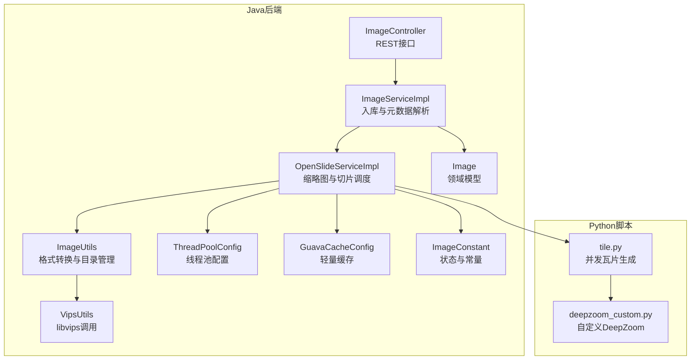
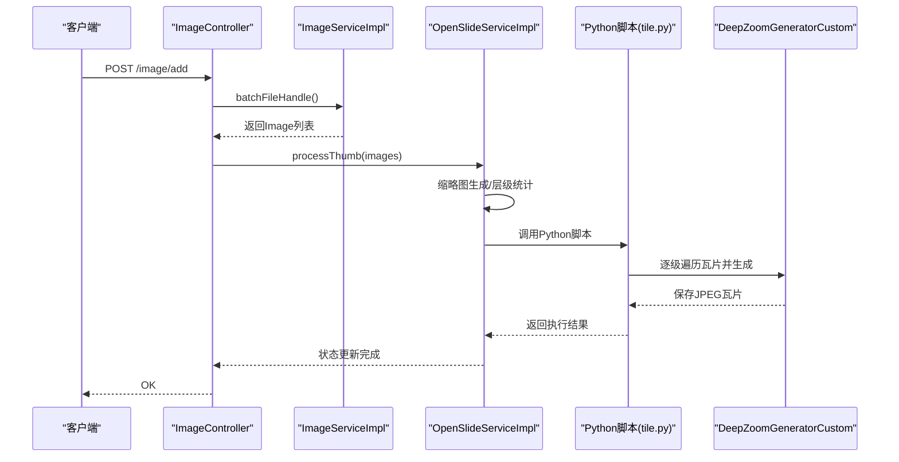
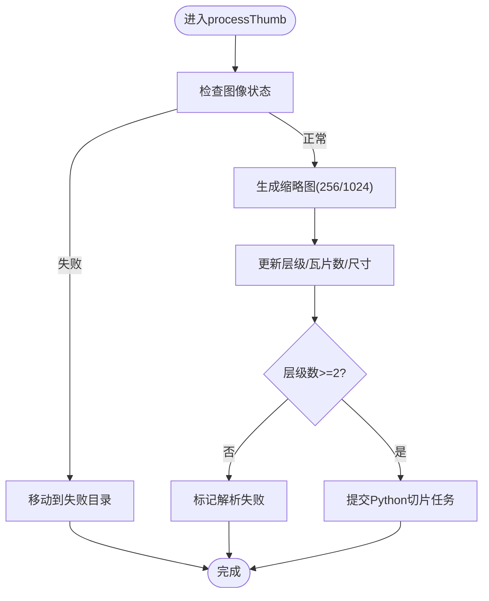
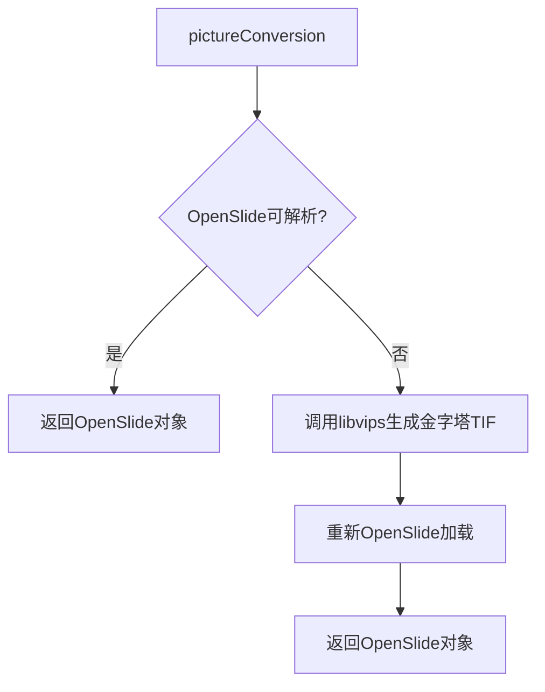
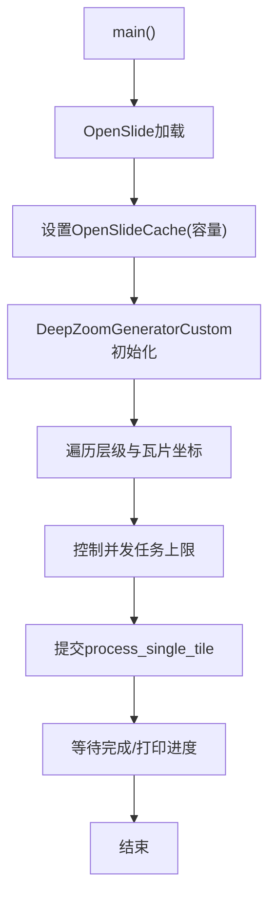
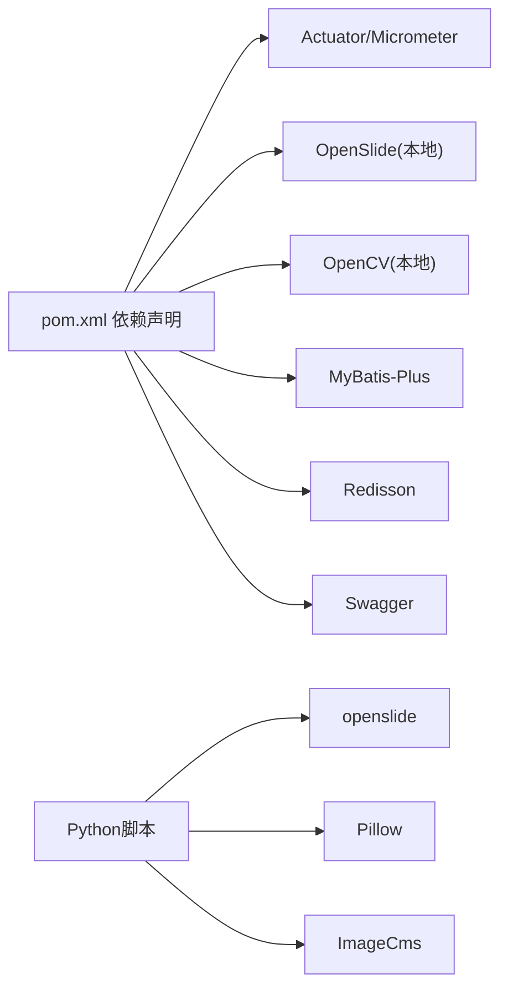
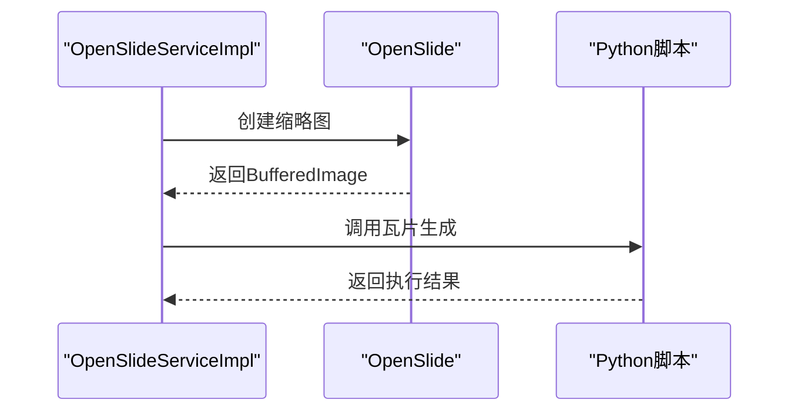

# 性能问题排查

<cite>
**本文引用的文件**
- [OpenSlideServiceImpl.java](file://src/main/java/cn/staitech/file/service/impl/OpenSlideServiceImpl.java)
- [ImageServiceImpl.java](file://src/main/java/cn/staitech/file/service/impl/ImageServiceImpl.java)
- [ImageUtils.java](file://src/main/java/cn/staitech/file/util/ImageUtils.java)
- [VipsUtils.java](file://src/main/java/cn/staitech/file/util/VipsUtils.java)
- [ThreadPoolConfig.java](file://src/main/java/cn/staitech/file/config/ThreadPoolConfig.java)
- [GuavaCacheConfig.java](file://src/main/java/cn/staitech/file/config/GuavaCacheConfig.java)
- [ImageController.java](file://src/main/java/cn/staitech/file/controller/ImageController.java)
- [Image.java](file://src/main/java/cn/staitech/file/domain/Image.java)
- [ImageConstant.java](file://src/main/java/cn/staitech/file/constant/ImageConstant.java)
- [bootstrap.yml](file://src/main/resources/bootstrap.yml)
- [pom.xml](file://pom.xml)
- [tile.py](file://docker/staitech/modules/image/script/tile.py)
- [deepzoom_custom.py](file://docker/staitech/modules/image/script/deepzoom_custom.py)
</cite>

## 目录
1. [简介](#简介)
2. [项目结构](#项目结构)
3. [核心组件](#核心组件)
4. [架构总览](#架构总览)
5. [详细组件分析](#详细组件分析)
6. [依赖分析](#依赖分析)
7. [性能考量](#性能考量)
8. [故障排查指南](#故障排查指南)
9. [结论](#结论)
10. [附录](#附录)

## 简介
本文件面向PACMVS图像处理子系统的性能问题排查与优化，聚焦以下方面：
- 图像预处理与OpenSlide解析效率
- libvips调用与TIF金字塔生成优化
- Python切片脚本并发与缓存策略
- 线程池配置与任务调度
- CPU、内存、磁盘I/O监控与性能测试
- 缓存策略与并发处理改进建议

目标是帮助运维与开发人员快速定位瓶颈、制定优化方案并形成可复用的诊断流程。

## 项目结构
项目采用Spring Boot微服务结构，核心模块围绕“图像入库—元数据解析—缩略图生成—瓦片切分”展开，涉及Java后端服务与Python脚本协同工作。

**图表来源**
- [ImageController.java:1-72](file://src/main/java/cn/staitech/file/controller/ImageController.java#L1-L72)
- [ImageServiceImpl.java:1-548](file://src/main/java/cn/staitech/file/service/impl/ImageServiceImpl.java#L1-L548)
- [OpenSlideServiceImpl.java:1-563](file://src/main/java/cn/staitech/file/service/impl/OpenSlideServiceImpl.java#L1-L563)
- [ImageUtils.java:1-148](file://src/main/java/cn/staitech/file/util/ImageUtils.java#L1-L148)
- [VipsUtils.java:1-37](file://src/main/java/cn/staitech/file/util/VipsUtils.java#L1-L37)
- [ThreadPoolConfig.java:1-66](file://src/main/java/cn/staitech/file/config/ThreadPoolConfig.java#L1-L66)
- [GuavaCacheConfig.java:1-27](file://src/main/java/cn/staitech/file/config/GuavaCacheConfig.java#L1-L27)
- [Image.java:1-216](file://src/main/java/cn/staitech/file/domain/Image.java#L1-L216)
- [ImageConstant.java:1-67](file://src/main/java/cn/staitech/file/constant/ImageConstant.java#L1-L67)
- [tile.py:1-99](file://docker/staitech/modules/image/script/tile.py#L1-L99)
- [deepzoom_custom.py:1-177](file://docker/staitech/modules/image/script/deepzoom_custom.py#L1-L177)

**章节来源**
- [ImageController.java:1-72](file://src/main/java/cn/staitech/file/controller/ImageController.java#L1-L72)
- [ImageServiceImpl.java:1-548](file://src/main/java/cn/staitech/file/service/impl/ImageServiceImpl.java#L1-L548)
- [OpenSlideServiceImpl.java:1-563](file://src/main/java/cn/staitech/file/service/impl/OpenSlideServiceImpl.java#L1-L563)
- [ImageUtils.java:1-148](file://src/main/java/cn/staitech/file/util/ImageUtils.java#L1-L148)
- [VipsUtils.java:1-37](file://src/main/java/cn/staitech/file/util/VipsUtils.java#L1-L37)
- [ThreadPoolConfig.java:1-66](file://src/main/java/cn/staitech/file/config/ThreadPoolConfig.java#L1-L66)
- [GuavaCacheConfig.java:1-27](file://src/main/java/cn/staitech/file/config/GuavaCacheConfig.java#L1-L27)
- [Image.java:1-216](file://src/main/java/cn/staitech/file/domain/Image.java#L1-L216)
- [ImageConstant.java:1-67](file://src/main/java/cn/staitech/file/constant/ImageConstant.java#L1-L67)
- [tile.py:1-99](file://docker/staitech/modules/image/script/tile.py#L1-L99)
- [deepzoom_custom.py:1-177](file://docker/staitech/modules/image/script/deepzoom_custom.py#L1-L177)

## 核心组件
- 图像入库与元数据解析：负责文件校验、命名解析、URL生成与状态流转。
- OpenSlide处理服务：负责缩略图生成、层级统计、瓦片切分任务提交与失败处理。
- 图像工具集：负责格式转换（必要时调用libvips生成金字塔TIF）、目录检查与辅助工具。
- 线程池配置：分别针对OpenSlide任务与Python脚本任务提供独立线程池，支持有界队列与拒绝策略。
- Python切片脚本：基于OpenSlide深度瓦片生成，内置并发与缓存控制。
- 轻量缓存：Guava本地缓存用于少量热点数据，降低重复计算成本。

**章节来源**
- [ImageServiceImpl.java:1-548](file://src/main/java/cn/staitech/file/service/impl/ImageServiceImpl.java#L1-L548)
- [OpenSlideServiceImpl.java:1-563](file://src/main/java/cn/staitech/file/service/impl/OpenSlideServiceImpl.java#L1-L563)
- [ImageUtils.java:1-148](file://src/main/java/cn/staitech/file/util/ImageUtils.java#L1-L148)
- [ThreadPoolConfig.java:1-66](file://src/main/java/cn/staitech/file/config/ThreadPoolConfig.java#L1-L66)
- [tile.py:1-99](file://docker/staitech/modules/image/script/tile.py#L1-L99)

## 架构总览
整体处理链路如下：
- 前端/客户端调用REST接口提交文件清单
- 后端入库解析并生成缩略图
- 成功后触发Python脚本进行多层级瓦片生成
- 中间穿插状态更新、失败重试与审计日志

**图表来源**
- [ImageController.java:1-72](file://src/main/java/cn/staitech/file/controller/ImageController.java#L1-L72)
- [ImageServiceImpl.java:1-548](file://src/main/java/cn/staitech/file/service/impl/ImageServiceImpl.java#L1-L548)
- [OpenSlideServiceImpl.java:1-563](file://src/main/java/cn/staitech/file/service/impl/OpenSlideServiceImpl.java#L1-L563)
- [tile.py:1-99](file://docker/staitech/modules/image/script/tile.py#L1-L99)
- [deepzoom_custom.py:1-177](file://docker/staitech/modules/image/script/deepzoom_custom.py#L1-L177)

## 详细组件分析

### OpenSlide处理服务（性能关键）
- 并发与任务调度
  - 使用两个线程池：OpenSlide线程池与Python线程池，均采用有界队列与自定义拒绝策略，避免内存压力。
  - 缩略图生成与瓦片任务通过CompletableFuture并行提交，最后统一等待完成。
- OpenSlide对象生命周期
  - 明确在finally中关闭，防止资源泄漏。
- 失败处理
  - 缩略图失败或层级不足标记为解析失败，移动至失败目录并记录审计日志。
- Python脚本调用
  - 通过ProcessBuilder启动，标准错误合并到标准输出，便于集中打印与排障。

**图表来源**
- [OpenSlideServiceImpl.java:1-563](file://src/main/java/cn/staitech/file/service/impl/OpenSlideServiceImpl.java#L1-L563)

**章节来源**
- [OpenSlideServiceImpl.java:1-563](file://src/main/java/cn/staitech/file/service/impl/OpenSlideServiceImpl.java#L1-L563)

### 图像工具与libvips调用
- 格式转换
  - 若OpenSlide无法直接解析，先通过libvips将JPG/PNG转换为带金字塔的TIFF，再由OpenSlide加载。
  - 转换命令包含大文件支持、瓦片尺寸、金字塔与压缩参数。
- 目录管理
  - 自动创建缩略图、缓存、标签、宏图等目录，避免运行时IO错误。

**图表来源**
- [ImageUtils.java:1-148](file://src/main/java/cn/staitech/file/util/ImageUtils.java#L1-L148)
- [VipsUtils.java:1-37](file://src/main/java/cn/staitech/file/util/VipsUtils.java#L1-L37)

**章节来源**
- [ImageUtils.java:1-148](file://src/main/java/cn/staitech/file/util/ImageUtils.java#L1-L148)
- [VipsUtils.java:1-37](file://src/main/java/cn/staitech/file/util/VipsUtils.java#L1-L37)

### Python切片脚本（并发与缓存）
- 并发策略
  - 使用ThreadPoolExecutor，线程数为CPU核数的2倍+1，配合有界队列限制待处理任务数，避免内存峰值过高。
- 缓存策略
  - 通过OpenSlideCache设置容量（示例1GB），显著降低重复读取开销。
- 流式输出
  - 逐级遍历瓦片，边生成边落盘，减少内存占用。

**图表来源**
- [tile.py:1-99](file://docker/staitech/modules/image/script/tile.py#L1-L99)
- [deepzoom_custom.py:1-177](file://docker/staitech/modules/image/script/deepzoom_custom.py#L1-L177)

**章节来源**
- [tile.py:1-99](file://docker/staitech/modules/image/script/tile.py#L1-L99)
- [deepzoom_custom.py:1-177](file://docker/staitech/modules/image/script/deepzoom_custom.py#L1-L177)

### 线程池配置与任务调度
- OpenSlide线程池
  - 核心线程=CPU+1，最大线程=CPU*2，队列长度10万，拒绝策略记录错误后由调用线程执行，保证不丢任务。
- Python线程池
  - 核心/最大线程按CPU/16动态分配（最小1/2），同样有界队列与拒绝策略。
- 建议
  - 根据实际硬件与任务特征（IO密集/计算密集）调整线程数与队列长度，避免频繁拒绝或上下文切换开销过大。

**章节来源**
- [ThreadPoolConfig.java:1-66](file://src/main/java/cn/staitech/file/config/ThreadPoolConfig.java#L1-L66)

### 轻量缓存与状态管理
- Guava本地缓存
  - 最大条目100，写入后1小时过期，适合少量热点元数据缓存。
- 状态机
  - 图像状态覆盖上传、解析、处理、可用、失败等阶段，便于追踪与重试。

**章节来源**
- [GuavaCacheConfig.java:1-27](file://src/main/java/cn/staitech/file/config/GuavaCacheConfig.java#L1-L27)
- [ImageConstant.java:1-67](file://src/main/java/cn/staitech/file/constant/ImageConstant.java#L1-L67)

## 依赖分析
- Java后端依赖
  - Spring Boot Actuator、Micrometer Prometheus用于监控暴露
  - OpenSlide、OpenCV本地依赖（system scope）
  - MyBatis-Plus、Redisson、Swagger等
- Python脚本依赖
  - openslide、Pillow、ImageCms等

**图表来源**
- [pom.xml:1-385](file://pom.xml#L1-L385)
- [tile.py:1-99](file://docker/staitech/modules/image/script/tile.py#L1-L99)

**章节来源**
- [pom.xml:1-385](file://pom.xml#L1-L385)

## 性能考量

### CPU使用率
- 观察点
  - OpenSlide缩略图生成、Python瓦片生成、libvips转换均可能成为CPU热点。
- 优化建议
  - 合理设置线程池大小，避免过度并发导致上下文切换开销上升。
  - Python脚本线程数=CPU*2+1已较激进，可根据磁盘吞吐与内存占用调低。
  - libvips命令中的压缩与瓦片尺寸影响编码开销，可按需调整。

### 内存占用
- 观察点
  - OpenSlide缓存容量、Python线程池队列长度、瓦片生成过程中的中间图像对象。
- 优化建议
  - 严格控制OpenSlideCache容量（示例1GB），避免内存溢出。
  - 有界队列+合理拒绝策略，防止堆积导致OOM。
  - Pillow缩放与颜色转换可能产生临时对象，尽量复用或及时释放。

### 磁盘I/O
- 观察点
  - 瓦片写盘、缩略图写盘、libvips转换输出。
- 优化建议
  - 使用SSD或高性能存储，避免机械盘成为瓶颈。
  - 合理设置瓦片尺寸与金字塔层级，平衡I/O与渲染性能。
  - 生成完成后清理临时文件，释放空间。

### 监控与指标
- 指标建议
  - CPU使用率、内存RSS/堆外、磁盘读写速率、队列长度、任务完成时延、Python进程CPU/IO。
- 工具与集成
  - Spring Boot Actuator + Micrometer + Prometheus，结合Grafana可视化。
  - Python脚本内打印进度与耗时，便于定位慢任务。

**章节来源**
- [bootstrap.yml:1-37](file://src/main/resources/bootstrap.yml#L1-L37)
- [pom.xml:1-385](file://pom.xml#L1-L385)

## 故障排查指南

### 常见问题与定位步骤
- 缩略图生成失败
  - 检查OpenSlide对象是否成功创建与关闭，确认层级数是否满足阈值。
  - 查看失败目录移动日志与审计日志。
- Python脚本执行失败
  - 检查进程退出码、标准输出/错误流日志。
  - 确认OpenSlideCache容量与磁盘空间。
- 线程池拒绝任务
  - 查看拒绝日志，评估队列长度与线程数是否合理。
- libvips转换异常
  - 检查vips命令行参数与输出，确认磁盘空间与权限。

### 性能测试与基准
- 方法建议
  - 准备多张不同尺寸与格式的WSI样本，批量触发缩略图与瓦片生成。
  - 记录各阶段耗时（缩略图、libvips转换、Python瓦片生成、状态更新）。
  - 在不同线程池配置与缓存容量下重复测试，绘制性能曲线。
- 工具建议
  - JMeter/Locust压测接口，Prometheus+Grafana采集指标，Linux perf/htop观察系统资源。

### 优化建议清单
- OpenSlide侧
  - 优先使用原生支持格式（SVS/NDPI），减少libvips转换。
  - 合理设置缩略图尺寸，避免过大导致内存与I/O压力。
- Python侧
  - 根据磁盘与CPU能力调整线程数与并发上限。
  - 适当增大OpenSlideCache容量，减少重复读取。
- Java侧
  - 动态调整线程池大小与队列长度，避免频繁拒绝。
  - 对热点元数据使用Guava缓存，减少重复计算。
- 存储侧
  - 使用高性能存储，确保瓦片写盘稳定。
  - 分离日志与数据目录，避免相互影响。

**章节来源**
- [OpenSlideServiceImpl.java:1-563](file://src/main/java/cn/staitech/file/service/impl/OpenSlideServiceImpl.java#L1-L563)
- [ImageUtils.java:1-148](file://src/main/java/cn/staitech/file/util/ImageUtils.java#L1-L148)
- [tile.py:1-99](file://docker/staitech/modules/image/script/tile.py#L1-L99)
- [ThreadPoolConfig.java:1-66](file://src/main/java/cn/staitech/file/config/ThreadPoolConfig.java#L1-L66)
- [GuavaCacheConfig.java:1-27](file://src/main/java/cn/staitech/file/config/GuavaCacheConfig.java#L1-L27)

## 结论
本项目在图像处理链路上形成了“Java后端+Python脚本”的协同架构，通过OpenSlide与libvips实现高效解析与金字塔生成，辅以线程池与缓存策略保障稳定性。性能优化应围绕CPU、内存、磁盘I/O三要素，结合监控指标与基准测试，持续迭代线程池与缓存配置，最终达成稳定高效的图像处理流水线。

## 附录

### 关键流程时序（代码级）

**图表来源**
- [OpenSlideServiceImpl.java:1-563](file://src/main/java/cn/staitech/file/service/impl/OpenSlideServiceImpl.java#L1-L563)
- [tile.py:1-99](file://docker/staitech/modules/image/script/tile.py#L1-L99)