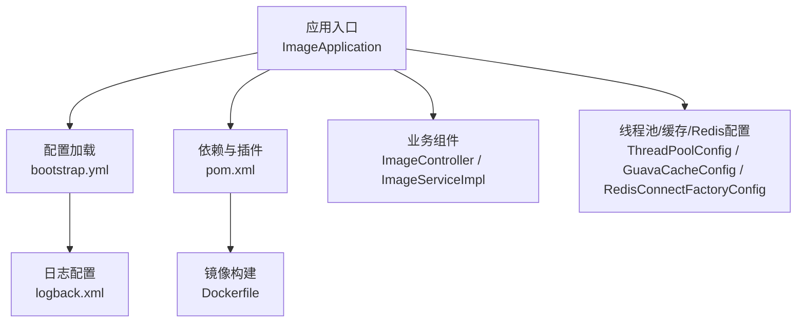
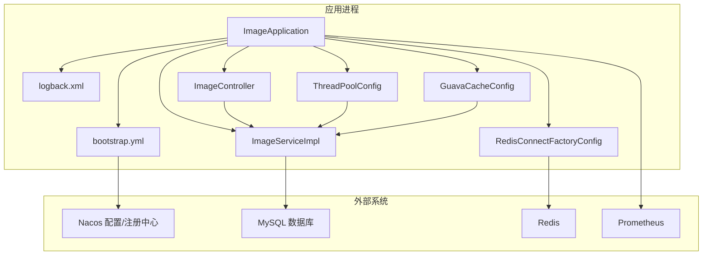
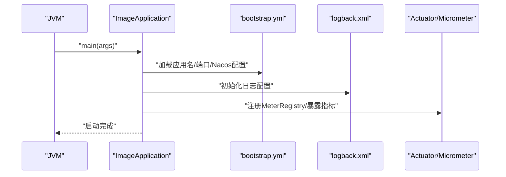
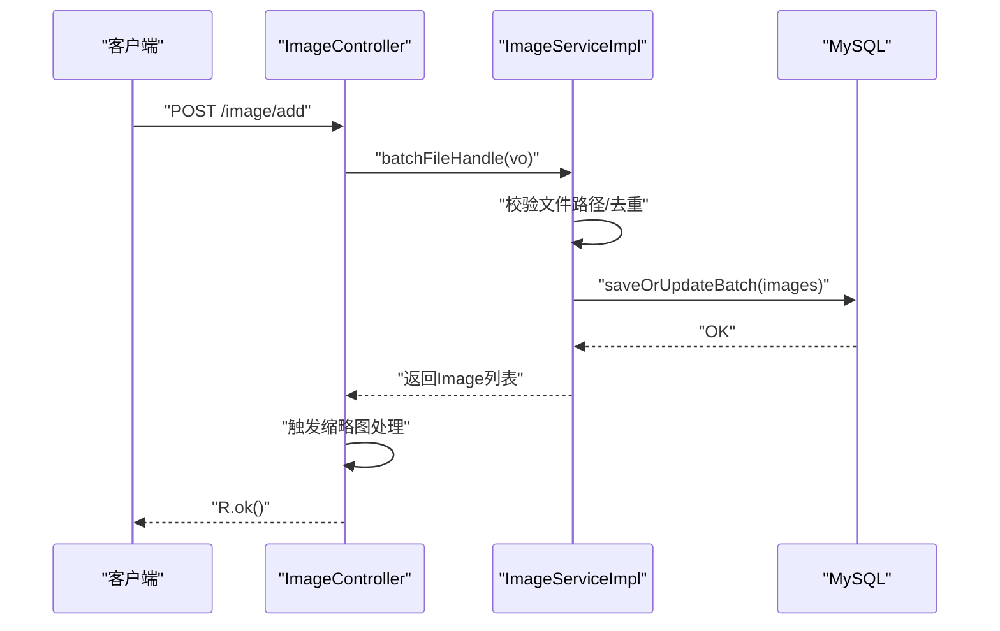
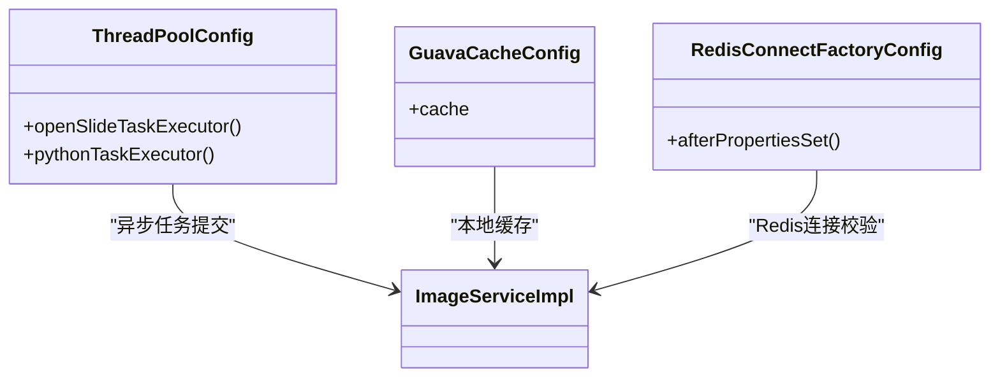
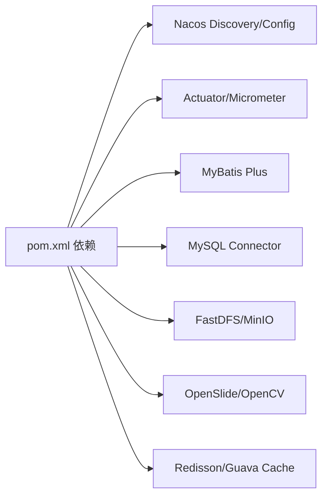

# 故障排查

<cite>
**本文引用的文件**
- [ImageApplication.java](file://src/main/java/cn/staitech/ImageApplication.java)
- [bootstrap.yml](file://src/main/resources/bootstrap.yml)
- [logback.xml](file://src/main/resources/logback.xml)
- [pom.xml](file://pom.xml)
- [Dockerfile](file://Dockerfile)
- [RedisConnectFactoryConfig.java](file://src/main/java/cn/staitech/file/config/RedisConnectFactoryConfig.java)
- [GuavaCacheConfig.java](file://src/main/java/cn/staitech/file/config/GuavaCacheConfig.java)
- [ThreadPoolConfig.java](file://src/main/java/cn/staitech/file/config/ThreadPoolConfig.java)
- [ImageServiceImpl.java](file://src/main/java/cn/staitech/file/service/impl/ImageServiceImpl.java)
- [ImageController.java](file://src/main/java/cn/staitech/file/controller/ImageController.java)
- [README.md](file://README.md)
</cite>

## 目录
1. [简介](#简介)
2. [项目结构](#项目结构)
3. [核心组件](#核心组件)
4. [架构总览](#架构总览)
5. [详细组件分析](#详细组件分析)
6. [依赖分析](#依赖分析)
7. [性能考虑](#性能考虑)
8. [故障排查指南](#故障排查指南)
9. [结论](#结论)
10. [附录](#附录)

## 简介
本故障排查文档面向技术支持人员与开发者，围绕 PACMVS 原始切片解析服务（staitech-modules-image）在启动失败、性能问题与数据库连接问题方面的常见问题，提供系统化的诊断方法、日志分析策略、调试工具使用指南与监控指标建议。文档同时给出关键流程的时序图与架构图，帮助快速定位根因并实施修复。

## 项目结构
该项目为基于 Spring Boot 的微服务模块，采用多配置文件与 Nacos 配置中心进行环境隔离与动态配置管理；日志通过 Logback 分级落盘；Actuator 与 Micrometer Prometheus 提供可观测性；Dockerfile 提供容器化构建与运行。

图表来源
- [ImageApplication.java:37-50](file://src/main/java/cn/staitech/ImageApplication.java#L37-L50)
- [bootstrap.yml:1-37](file://src/main/resources/bootstrap.yml#L1-L37)
- [logback.xml:1-116](file://src/main/resources/logback.xml#L1-L116)
- [pom.xml:229-346](file://pom.xml#L229-L346)
- [Dockerfile:1-16](file://Dockerfile#L1-L16)
- [ImageController.java:26-72](file://src/main/java/cn/staitech/file/controller/ImageController.java#L26-L72)
- [ImageServiceImpl.java:39-548](file://src/main/java/cn/staitech/file/service/impl/ImageServiceImpl.java#L39-L548)
- [ThreadPoolConfig.java:10-66](file://src/main/java/cn/staitech/file/config/ThreadPoolConfig.java#L10-L66)
- [GuavaCacheConfig.java:10-27](file://src/main/java/cn/staitech/file/config/GuavaCacheConfig.java#L10-L27)
- [RedisConnectFactoryConfig.java:10-26](file://src/main/java/cn/staitech/file/config/RedisConnectFactoryConfig.java#L10-L26)

章节来源
- [ImageApplication.java:20-50](file://src/main/java/cn/staitech/ImageApplication.java#L20-L50)
- [bootstrap.yml:1-37](file://src/main/resources/bootstrap.yml#L1-L37)
- [logback.xml:1-116](file://src/main/resources/logback.xml#L1-L116)
- [pom.xml:229-346](file://pom.xml#L229-L346)
- [Dockerfile:1-16](file://Dockerfile#L1-L16)

## 核心组件
- 应用入口与配置
  - 启动类启用调度、WebSocket、安全注解、Feign 客户端、事务管理、Elasticsearch 仓库扫描、Nacos 注册发现与配置中心集成。
  - Actuator 暴露指标，Prometheus 注册器接入 Micrometer。
- 配置中心与环境
  - bootstrap.yml 通过占位符激活 Nacos 服务发现与配置中心，支持 dev/test/prod 三套 profile。
- 日志系统
  - Logback 按 INFO/WARN/ERROR/DEBUG 分文件滚动输出，控制台与文件同时输出；Nacos 与 Druid SQL 日志单独开启。
- 业务组件
  - 控制层提供“服务器选片”“重解析”“失败检查”等接口。
  - 服务层负责文件路径校验、数据库去重、文件名解析、路径生成与入库。
- 并发与缓存
  - 自定义线程池（OpenSlide/Python），拒绝策略回退至调用线程执行。
  - Guava Cache 本地缓存，限制容量与过期时间。
  - Redis 连接工厂启用连接校验。

章节来源
- [ImageApplication.java:27-50](file://src/main/java/cn/staitech/ImageApplication.java#L27-L50)
- [bootstrap.yml:14-37](file://src/main/resources/bootstrap.yml#L14-L37)
- [logback.xml:105-116](file://src/main/resources/logback.xml#L105-L116)
- [ImageController.java:26-72](file://src/main/java/cn/staitech/file/controller/ImageController.java#L26-L72)
- [ImageServiceImpl.java:63-140](file://src/main/java/cn/staitech/file/service/impl/ImageServiceImpl.java#L63-L140)
- [ThreadPoolConfig.java:18-64](file://src/main/java/cn/staitech/file/config/ThreadPoolConfig.java#L18-L64)
- [GuavaCacheConfig.java:19-26](file://src/main/java/cn/staitech/file/config/GuavaCacheConfig.java#L19-L26)
- [RedisConnectFactoryConfig.java:18-24](file://src/main/java/cn/staitech/file/config/RedisConnectFactoryConfig.java#L18-L24)

## 架构总览
下图展示应用启动、配置加载、日志输出、业务处理与外部依赖的关系。

图表来源
- [ImageApplication.java:37-50](file://src/main/java/cn/staitech/ImageApplication.java#L37-L50)
- [bootstrap.yml:17-37](file://src/main/resources/bootstrap.yml#L17-L37)
- [logback.xml:105-116](file://src/main/resources/logback.xml#L105-L116)
- [ImageController.java:30-48](file://src/main/java/cn/staitech/file/controller/ImageController.java#L30-L48)
- [ImageServiceImpl.java:42-140](file://src/main/java/cn/staitech/file/service/impl/ImageServiceImpl.java#L42-L140)
- [ThreadPoolConfig.java:18-64](file://src/main/java/cn/staitech/file/config/ThreadPoolConfig.java#L18-L64)
- [GuavaCacheConfig.java:19-26](file://src/main/java/cn/staitech/file/config/GuavaCacheConfig.java#L19-L26)
- [RedisConnectFactoryConfig.java:18-24](file://src/main/java/cn/staitech/file/config/RedisConnectFactoryConfig.java#L18-L24)

## 详细组件分析

### 启动流程与关键点
- 启动类启用多个功能开关与注解，若缺少必要依赖或配置，可能导致启动失败。
- Actuator 与 Micrometer 已接入，需确认暴露端点与网络策略。
- Nacos 配置中心需可达且凭据正确，否则配置加载失败。

图表来源
- [ImageApplication.java:39-50](file://src/main/java/cn/staitech/ImageApplication.java#L39-L50)
- [bootstrap.yml:11-37](file://src/main/resources/bootstrap.yml#L11-L37)
- [logback.xml:105-116](file://src/main/resources/logback.xml#L105-L116)

章节来源
- [ImageApplication.java:37-50](file://src/main/java/cn/staitech/ImageApplication.java#L37-L50)
- [bootstrap.yml:11-37](file://src/main/resources/bootstrap.yml#L11-L37)

### 业务处理流程（服务器选片）
- 接口接收批量文件路径，先做文件存在性与可读性校验，再进行数据库去重与入库。
- 入库后触发缩略图处理与异步任务队列。
- 若文件名不符合规范，会标记解析失败状态。

图表来源
- [ImageController.java:42-48](file://src/main/java/cn/staitech/file/controller/ImageController.java#L42-L48)
- [ImageServiceImpl.java:63-140](file://src/main/java/cn/staitech/file/service/impl/ImageServiceImpl.java#L63-L140)

章节来源
- [ImageController.java:42-48](file://src/main/java/cn/staitech/file/controller/ImageController.java#L42-L48)
- [ImageServiceImpl.java:63-140](file://src/main/java/cn/staitech/file/service/impl/ImageServiceImpl.java#L63-L140)

### 并发与缓存
- OpenSlide/Python 线程池大小与队列长度按 CPU 核数动态计算，拒绝策略回退至调用线程执行，避免丢任务。
- Guava Cache 限制 100 条，1 小时过期，适合轻量热点数据。
- Redis 连接工厂启用连接校验，降低无效连接带来的异常。

图表来源
- [ThreadPoolConfig.java:18-64](file://src/main/java/cn/staitech/file/config/ThreadPoolConfig.java#L18-L64)
- [GuavaCacheConfig.java:19-26](file://src/main/java/cn/staitech/file/config/GuavaCacheConfig.java#L19-L26)
- [RedisConnectFactoryConfig.java:18-24](file://src/main/java/cn/staitech/file/config/RedisConnectFactoryConfig.java#L18-L24)

章节来源
- [ThreadPoolConfig.java:18-64](file://src/main/java/cn/staitech/file/config/ThreadPoolConfig.java#L18-L64)
- [GuavaCacheConfig.java:19-26](file://src/main/java/cn/staitech/file/config/GuavaCacheConfig.java#L19-L26)
- [RedisConnectFactoryConfig.java:18-24](file://src/main/java/cn/staitech/file/config/RedisConnectFactoryConfig.java#L18-L24)

## 依赖分析
- 配置中心与注册发现：Nacos Discovery/Config。
- 监控与指标：Actuator + Micrometer + Prometheus。
- 数据库：MyBatis Plus + MySQL Connector。
- 存储：FastDFS/MinIO（对象存储）、本地文件系统（缩略图/标签等）。
- 图像处理：OpenSlide/Opencv（系统级 JAR 与本地库）。
- 缓存与并发：Redisson、Guava Cache、自定义线程池。

图表来源
- [pom.xml:23-205](file://pom.xml#L23-L205)

章节来源
- [pom.xml:23-205](file://pom.xml#L23-L205)

## 性能考虑
- 线程池参数
  - OpenSlide 线程池：CPU+1 到 CPU*2，阻塞队列 10 万，拒绝策略回退调用线程，适合 IO 密集型任务。
  - Python 线程池：按 CPU/16 动态分配，保证最小并发，避免过多线程争抢。
- 缓存策略
  - Guava Cache 1 小时过期，容量 100，适合短期热点数据；注意与分布式缓存一致性。
- 日志开销
  - INFO/WARN/ERROR/DEBUG 分文件滚动，避免单文件过大；生产环境建议关闭 DEBUG 或限制级别。
- 指标采集
  - Actuator + Prometheus，建议结合 Grafana 展示 CPU/内存/线程池队列长度/HTTP 请求耗时。

章节来源
- [ThreadPoolConfig.java:18-64](file://src/main/java/cn/staitech/file/config/ThreadPoolConfig.java#L18-L64)
- [GuavaCacheConfig.java:19-26](file://src/main/java/cn/staitech/file/config/GuavaCacheConfig.java#L19-L26)
- [logback.xml:16-103](file://src/main/resources/logback.xml#L16-L103)
- [ImageApplication.java:47-50](file://src/main/java/cn/staitech/ImageApplication.java#L47-L50)

## 故障排查指南

### 一、启动失败
常见症状
- 应用启动卡住、端口占用、Nacos 连接超时、配置加载失败。

诊断步骤
1. 检查端口占用与防火墙策略（默认端口由配置文件指定）。
2. 校验 Nacos 地址、命名空间与分组配置是否正确。
3. 查看控制台与日志文件中的 Nacos 加载日志（Logback 已开启相关 logger）。
4. 确认 Actuator 指标端点是否可访问。
5. Docker 环境下检查镜像构建与 ENTRYPOINT 参数。

定位要点
- 启动类注解与排除配置（如 Seata 自动配置排除）。
- 配置文件占位符是否被正确替换。
- 日志级别与输出位置。

章节来源
- [ImageApplication.java:27-50](file://src/main/java/cn/staitech/ImageApplication.java#L27-L50)
- [bootstrap.yml:17-37](file://src/main/resources/bootstrap.yml#L17-L37)
- [logback.xml:105-116](file://src/main/resources/logback.xml#L105-L116)
- [Dockerfile:12-16](file://Dockerfile#L12-L16)

### 二、性能问题
常见症状
- 接口响应慢、线程池队列堆积、CPU 占用高、缩略图生成延迟。

诊断步骤
1. 采集 Prometheus 指标，观察 HTTP 请求耗时、线程池队列长度、GC 次数与停顿。
2. 检查 OpenSlide/Python 线程池参数是否合理，必要时调整核心线程数与队列长度。
3. 关注业务日志中“任务被拒绝执行”的告警。
4. 评估本地缓存命中率与过期策略，避免频繁重建缓存。
5. 检查磁盘 IO 与对象存储上传/下载耗时。

优化建议
- 合理设置线程池大小，避免过度并发导致上下文切换。
- 对热点数据引入分布式缓存（如 Redis）以减少重复计算。
- 调整日志级别，避免 DEBUG 在生产环境开启。

章节来源
- [ThreadPoolConfig.java:18-64](file://src/main/java/cn/staitech/file/config/ThreadPoolConfig.java#L18-L64)
- [GuavaCacheConfig.java:19-26](file://src/main/java/cn/staitech/file/config/GuavaCacheConfig.java#L19-L26)
- [logback.xml:105-116](file://src/main/resources/logback.xml#L105-L116)

### 三、数据库连接问题
常见症状
- 启动时报数据库连接异常、SQL 执行超时、连接池耗尽。

诊断步骤
1. 确认数据库地址、账号、密码与驱动版本。
2. 检查连接池配置（最大连接数、空闲超时、连接超时）。
3. 查看 Druid SQL 日志（Logback 已开启），定位慢 SQL 与异常语句。
4. 观察数据库负载与锁等待情况。
5. 核对 MyBatis Plus Mapper XML 是否正确加载（资源打包策略已在 POM 中配置）。

章节来源
- [logback.xml:107-107](file://src/main/resources/logback.xml#L107-L107)
- [pom.xml:229-302](file://pom.xml#L229-L302)

### 四、日志分析方法与关键定位
- 日志位置：按日志配置输出到 logs/staitech-image 下的 info/warn/error/debug 文件。
- 关键日志类别
  - Nacos 客户端与配置加载：com.alibaba.cloud.nacos.client
  - SQL 语句与执行：druid.sql.Statement
  - 应用业务日志：按包名输出，关注文件路径校验、去重、解析失败等。
- 错误信息解读
  - “文件路径无效或不可访问”：检查文件绝对路径、权限与挂载。
  - “文件已经存在”：数据库去重逻辑触发，确认是否重复提交。
  - “任务被拒绝执行”：线程池饱和，需扩容或降压。
  - “无法创建目录”：磁盘权限或路径非法。

章节来源
- [logback.xml:4-116](file://src/main/resources/logback.xml#L4-L116)
- [ImageServiceImpl.java:67-77](file://src/main/java/cn/staitech/file/service/impl/ImageServiceImpl.java#L67-L77)
- [ImageServiceImpl.java:118-122](file://src/main/java/cn/staitech/file/service/impl/ImageServiceImpl.java#L118-L122)
- [ThreadPoolConfig.java:28-38](file://src/main/java/cn/staitech/file/config/ThreadPoolConfig.java#L28-L38)

### 五、调试工具与监控指标
- Actuator 指标端点：健康检查、线程池状态、JVM 信息、HTTP 指标。
- Prometheus：抓取 /actuator/prometheus。
- Grafana：可视化展示 CPU/内存/线程池队列/HTTP 请求耗时/数据库连接池。
- 本地调试：在 IDE 中以 bootstrap.yml 指定的 profile 启动，便于断点与日志查看。

章节来源
- [ImageApplication.java:47-50](file://src/main/java/cn/staitech/ImageApplication.java#L47-L50)
- [pom.xml:192-194](file://pom.xml#L192-L194)

### 六、系统状态检查清单
- 网络连通性：Nacos、MySQL、Redis、对象存储。
- 文件系统：本地文件路径可写、缩略图/标签目录存在。
- 配置生效：Nacos 配置已拉取，profile 正确。
- 进程健康：Actuator 健康检查通过，无 OOM/死锁迹象。
- 指标健康：Prometheus 抓取正常，Grafana 可视化可用。

章节来源
- [bootstrap.yml:17-37](file://src/main/resources/bootstrap.yml#L17-L37)
- [ImageServiceImpl.java:208-214](file://src/main/java/cn/staitech/file/service/impl/ImageServiceImpl.java#L208-L214)
- [ImageApplication.java:47-50](file://src/main/java/cn/staitech/ImageApplication.java#L47-L50)

## 结论
本项目通过 Nacos 配置中心、Logback 日志体系、Actuator/Micrometer 指标体系与本地线程池/缓存策略，提供了较为完善的可观测性与可维护性。针对启动失败、性能瓶颈与数据库连接问题，建议优先检查配置中心连通性与日志输出、评估线程池与缓存参数、并结合 Prometheus/Grafana 进行端到端监控。遇到异常时，依据日志中的关键类别与错误提示快速定位根因，配合线程池拒绝策略与缓存策略进行优化。

## 附录
- 快速参考
  - 启动命令：Java -jar app.jar（Docker 环境下通过 ENTRYPOINT 执行）
  - 配置文件：bootstrap.yml（Nacos 配置中心 + 本地资源目录）
  - 日志目录：logs/staitech-image
  - 指标端点：/actuator/prometheus
- 参考文档
  - [README.md:1-11](file://README.md#L1-L11)