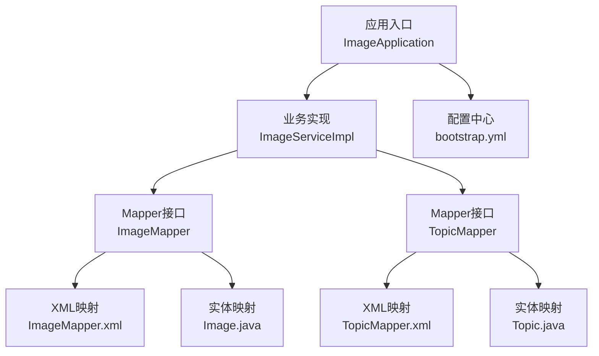
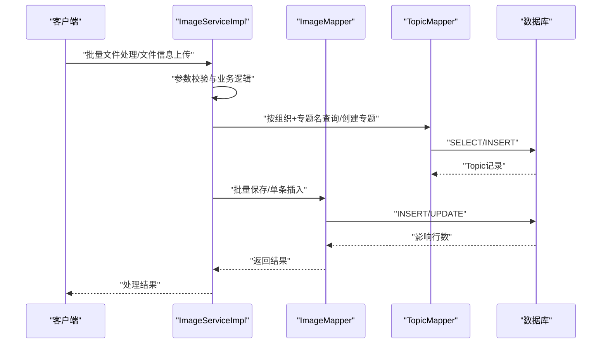
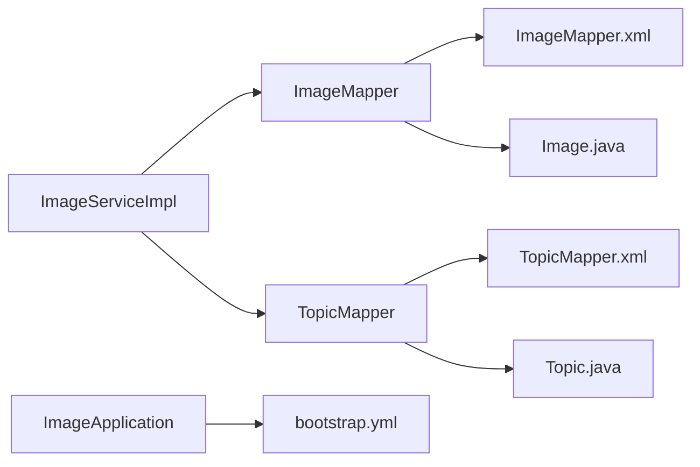

# 数据库问题排查

<cite>
**本文引用的文件**
- [ImageApplication.java](file://src/main/java/cn/staitech/ImageApplication.java)
- [bootstrap.yml](file://src/main/resources/bootstrap.yml)
- [ImageMapper.java](file://src/main/java/cn/staitech/file/mapper/ImageMapper.java)
- [TopicMapper.java](file://src/main/java/cn/staitech/file/mapper/TopicMapper.java)
- [ImageMapper.xml](file://src/main/resources/mapper/ImageMapper.xml)
- [TopicMapper.xml](file://src/main/resources/mapper/TopicMapper.xml)
- [Image.java](file://src/main/java/cn/staitech/file/domain/Image.java)
- [Topic.java](file://src/main/java/cn/staitech/file/domain/Topic.java)
- [ImageServiceImpl.java](file://src/main/java/cn/staitech/file/service/impl/ImageServiceImpl.java)
- [update_v2.5.2.sql](file://sql/update_v2.5.2.sql)
</cite>

## 目录
1. [简介](#简介)
2. [项目结构](#项目结构)
3. [核心组件](#核心组件)
4. [架构概览](#架构概览)
5. [详细组件分析](#详细组件分析)
6. [依赖分析](#依赖分析)
7. [性能考虑](#性能考虑)
8. [故障排查指南](#故障排查指南)
9. [结论](#结论)
10. [附录](#附录)

## 简介
本文件面向PACMVS项目中与数据库相关的问题排查与优化，聚焦以下方面：
- 数据库连接失败、SQL执行异常、表结构不一致等常见问题的诊断与修复
- MyBatis映射配置检查要点与常见错误定位
- 数据库连接池监控与慢查询分析思路
- 数据库性能优化建议、索引使用分析与事务处理优化
- 数据一致性检查方法、备份恢复流程与数据库版本升级指南

本项目基于Spring Boot与MyBatis-Plus，采用注解式实体映射与XML映射文件结合的方式进行数据库交互。当前仓库未包含数据库连接配置文件，排查时需结合运行环境中的外部配置（如Nacos）与实际部署环境。

## 项目结构
与数据库相关的关键模块与文件如下：
- 应用入口与事务管理：[ImageApplication.java](file://src/main/java/cn/staitech/ImageApplication.java)
- 配置中心接入：[bootstrap.yml](file://src/main/resources/bootstrap.yml)
- 实体与表映射：[Image.java](file://src/main/java/cn/staitech/file/domain/Image.java)、[Topic.java](file://src/main/java/cn/staitech/file/domain/Topic.java)
- Mapper接口：[ImageMapper.java](file://src/main/java/cn/staitech/file/mapper/ImageMapper.java)、[TopicMapper.java](file://src/main/java/cn/staitech/file/mapper/TopicMapper.java)
- XML映射文件：[ImageMapper.xml](file://src/main/resources/mapper/ImageMapper.xml)、[TopicMapper.xml](file://src/main/resources/mapper/TopicMapper.xml)
- 业务实现与事务控制：[ImageServiceImpl.java](file://src/main/java/cn/staitech/file/service/impl/ImageServiceImpl.java)
- 数据库版本变更脚本：[update_v2.5.2.sql](file://sql/update_v2.5.2.sql)

图表来源
- [ImageApplication.java:32-36](file://src/main/java/cn/staitech/ImageApplication.java#L32-L36)
- [ImageServiceImpl.java:41-42](file://src/main/java/cn/staitech/file/service/impl/ImageServiceImpl.java#L41-L42)
- [ImageMapper.java:14](file://src/main/java/cn/staitech/file/mapper/ImageMapper.java#L14)
- [TopicMapper.java:6](file://src/main/java/cn/staitech/file/mapper/TopicMapper.java#L6)
- [ImageMapper.xml:4](file://src/main/resources/mapper/ImageMapper.xml#L4)
- [TopicMapper.xml:5](file://src/main/resources/mapper/TopicMapper.xml#L5)
- [Image.java:26](file://src/main/java/cn/staitech/file/domain/Image.java#L26)
- [Topic.java:23](file://src/main/java/cn/staitech/file/domain/Topic.java#L23)
- [bootstrap.yml:14-16](file://src/main/resources/bootstrap.yml#L14-L16)

章节来源
- [ImageApplication.java:32-36](file://src/main/java/cn/staitech/ImageApplication.java#L32-L36)
- [bootstrap.yml:14-16](file://src/main/resources/bootstrap.yml#L14-L16)

## 核心组件
- 应用入口与事务管理
  - 启用事务管理与调度功能，便于在业务层通过注解控制事务边界与隔离级别。
  - 参考：[ImageApplication.java:32-36](file://src/main/java/cn/staitech/ImageApplication.java#L32-L36)

- 实体与表映射
  - Image实体映射至tb_image表，包含大量字段（如路径、尺寸、分辨率、状态、组织与专题关联等），用于存储图像元数据。
  - Topic实体映射至tb_topic表，存储专题信息。
  - 参考：[Image.java:26](file://src/main/java/cn/staitech/file/domain/Image.java#L26)、[Topic.java:23](file://src/main/java/cn/staitech/file/domain/Topic.java#L23)

- Mapper与XML映射
  - ImageMapper继承MyBatis-Plus的BaseMapper，提供通用CRUD能力；XML中定义了ResultMap与列清单，确保字段映射与批量操作的可维护性。
  - TopicMapper当前XML为空，通常由BaseMapper提供默认SQL。
  - 参考：[ImageMapper.java:14](file://src/main/java/cn/staitech/file/mapper/ImageMapper.java#L14)、[ImageMapper.xml:4-46](file://src/main/resources/mapper/ImageMapper.xml#L4-L46)、[TopicMapper.java:6](file://src/main/java/cn/staitech/file/mapper/TopicMapper.java#L6)、[TopicMapper.xml:5](file://src/main/resources/mapper/TopicMapper.xml#L5)

- 业务实现与事务控制
  - ImageServiceImpl在批量处理与单条插入场景中使用@Transactional，保证数据一致性；同时包含文件路径校验、专题查询与创建、字段解析等逻辑。
  - 参考：[ImageServiceImpl.java:41-42](file://src/main/java/cn/staitech/file/service/impl/ImageServiceImpl.java#L41-L42)、[ImageServiceImpl.java:64-140](file://src/main/java/cn/staitech/file/service/impl/ImageServiceImpl.java#L64-L140)、[ImageServiceImpl.java:174-232](file://src/main/java/cn/staitech/file/service/impl/ImageServiceImpl.java#L174-L232)

- 数据库版本变更
  - update_v2.5.2.sql对tb_image增加process_flag字段、调整wax_code与时间字段默认值，体现版本演进中的结构变更。
  - 参考：[update_v2.5.2.sql:1-10](file://sql/update_v2.5.2.sql#L1-L10)

章节来源
- [ImageApplication.java:32-36](file://src/main/java/cn/staitech/ImageApplication.java#L32-L36)
- [Image.java:26](file://src/main/java/cn/staitech/file/domain/Image.java#L26)
- [Topic.java:23](file://src/main/java/cn/staitech/file/domain/Topic.java#L23)
- [ImageMapper.java:14](file://src/main/java/cn/staitech/file/mapper/ImageMapper.java#L14)
- [ImageMapper.xml:4-46](file://src/main/resources/mapper/ImageMapper.xml#L4-L46)
- [TopicMapper.java:6](file://src/main/java/cn/staitech/file/mapper/TopicMapper.java#L6)
- [TopicMapper.xml:5](file://src/main/resources/mapper/TopicMapper.xml#L5)
- [ImageServiceImpl.java:41-42](file://src/main/java/cn/staitech/file/service/impl/ImageServiceImpl.java#L41-L42)
- [ImageServiceImpl.java:64-140](file://src/main/java/cn/staitech/file/service/impl/ImageServiceImpl.java#L64-L140)
- [ImageServiceImpl.java:174-232](file://src/main/java/cn/staitech/file/service/impl/ImageServiceImpl.java#L174-L232)
- [update_v2.5.2.sql:1-10](file://sql/update_v2.5.2.sql#L1-L10)

## 架构概览
下图展示应用与数据库交互的整体流程，包括事务边界、Mapper调用与XML映射的关系。

图表来源
- [ImageServiceImpl.java:64-140](file://src/main/java/cn/staitech/file/service/impl/ImageServiceImpl.java#L64-L140)
- [ImageServiceImpl.java:174-232](file://src/main/java/cn/staitech/file/service/impl/ImageServiceImpl.java#L174-L232)
- [ImageMapper.java:14](file://src/main/java/cn/staitech/file/mapper/ImageMapper.java#L14)
- [TopicMapper.java:6](file://src/main/java/cn/staitech/file/mapper/TopicMapper.java#L6)

## 详细组件分析

### MyBatis映射配置检查
- XML命名空间与ResultMap
  - ImageMapper.xml的namespace必须与接口全限定名一致，且ResultMap的id/type与实体类匹配，避免字段映射缺失或类型不一致导致的异常。
  - 参考：[ImageMapper.xml:4](file://src/main/resources/mapper/ImageMapper.xml#L4)、[Image.java:26](file://src/main/java/cn/staitech/file/domain/Image.java#L26)

- 列清单与字段一致性
  - XML中定义的列清单应与tb_image表结构保持一致，新增或修改字段需同步更新XML映射与实体类。
  - 参考：[ImageMapper.xml:48-63](file://src/main/resources/mapper/ImageMapper.xml#L48-L63)、[update_v2.5.2.sql:1-10](file://sql/update_v2.5.2.sql#L1-L10)

- TopicMapper的XML现状
  - TopicMapper.xml当前为空，意味着所有SQL由BaseMapper提供，若后续需要自定义SQL，需在XML中补充对应语句与ResultMap。
  - 参考：[TopicMapper.xml:5](file://src/main/resources/mapper/TopicMapper.xml#L5)

- 常见问题定位
  - 字段名不匹配：检查ResultMap中column与实体字段映射是否一致。
  - JDBC类型不匹配：核对jdbcType与数据库字段类型是否兼容。
  - 列清单遗漏：批量操作时若列清单不完整，可能导致部分字段被清空或更新为默认值。
  - 参考：[ImageMapper.xml:5-46](file://src/main/resources/mapper/ImageMapper.xml#L5-L46)

章节来源
- [ImageMapper.xml:4-46](file://src/main/resources/mapper/ImageMapper.xml#L4-L46)
- [ImageMapper.xml:48-63](file://src/main/resources/mapper/ImageMapper.xml#L48-L63)
- [TopicMapper.xml:5](file://src/main/resources/mapper/TopicMapper.xml#L5)
- [update_v2.5.2.sql:1-10](file://sql/update_v2.5.2.sql#L1-L10)

### 数据库连接失败排查
- 配置中心接入
  - bootstrap.yml启用Nacos配置中心，数据库连接参数可能由Nacos下发，需确认命名空间、分组与共享配置是否正确。
  - 参考：[bootstrap.yml:14-37](file://src/main/resources/bootstrap.yml#L14-L37)

- 连接参数核对
  - 确认驱动类、URL、用户名、密码、连接池参数（最大连接数、空闲超时、连接超时等）是否在运行配置中生效。
  - 若使用容器化部署，检查环境变量与挂载配置文件是否正确。

- 健康检查
  - 通过数据库客户端或运维工具验证实例可达性与账号权限。
  - 在应用侧增加连接测试接口或启动阶段的ping检测。

章节来源
- [bootstrap.yml:14-37](file://src/main/resources/bootstrap.yml#L14-L37)

### SQL执行异常与表结构不一致
- 结构不一致
  - update_v2.5.2.sql展示了对tb_image的结构变更（新增字段、修改默认值）。若线上表结构与脚本不一致，可能导致DDL失败或运行期异常。
  - 参考：[update_v2.5.2.sql:1-10](file://sql/update_v2.5.2.sql#L1-L10)

- 字段映射异常
  - 当XML列清单或实体类字段缺失时，批量写入可能触发非预期的字段更新或空值覆盖。
  - 建议：在变更后执行一次全量字段对比校验。

- 事务与并发
  - 业务层使用@Transactional包裹关键流程，若出现死锁或长时间占用，需结合慢查询日志与锁等待分析定位。
  - 参考：[ImageServiceImpl.java:41-42](file://src/main/java/cn/staitech/file/service/impl/ImageServiceImpl.java#L41-L42)

章节来源
- [update_v2.5.2.sql:1-10](file://sql/update_v2.5.2.sql#L1-L10)
- [ImageServiceImpl.java:41-42](file://src/main/java/cn/staitech/file/service/impl/ImageServiceImpl.java#L41-L42)

### 事务处理优化
- 事务边界设计
  - 将文件校验、专题查询/创建、数据库写入放在同一事务内，避免中间状态不一致。
  - 参考：[ImageServiceImpl.java:64-140](file://src/main/java/cn/staitech/file/service/impl/ImageServiceImpl.java#L64-L140)、[ImageServiceImpl.java:174-232](file://src/main/java/cn/staitech/file/service/impl/ImageServiceImpl.java#L174-L232)

- 事务隔离与锁竞争
  - 对高并发场景，适当降低隔离级别或拆分长事务，减少锁持有时间。
  - 使用合适的索引避免全表扫描引发的锁膨胀。

- 回滚策略
  - 明确rollbackFor范围，确保业务异常能正确回滚；对非业务异常（如网络抖动）可选择不回滚以避免误伤。
  - 参考：[ImageServiceImpl.java:64](file://src/main/java/cn/staitech/file/service/impl/ImageServiceImpl.java#L64)

章节来源
- [ImageServiceImpl.java:64-140](file://src/main/java/cn/staitech/file/service/impl/ImageServiceImpl.java#L64-L140)
- [ImageServiceImpl.java:174-232](file://src/main/java/cn/staitech/file/service/impl/ImageServiceImpl.java#L174-L232)
- [ImageServiceImpl.java:64](file://src/main/java/cn/staitech/file/service/impl/ImageServiceImpl.java#L64)

### 慢查询分析
- 关注点
  - 高频批量写入：检查批量大小与批次提交频率，避免单次事务过大。
  - 条件查询：确认where条件是否命中索引，避免隐式转换与函数使用导致的索引失效。
  - 跨表关联：Topic查询与Image写入的组合是否产生额外锁等待。

- 分析步骤
  - 开启慢查询日志与binlog（如需），定位耗时SQL。
  - 使用EXPLAIN分析执行计划，确认索引使用情况。
  - 结合业务日志与埋点，统计关键路径耗时。

[本节为通用分析方法，无需特定文件引用]

### 数据一致性检查
- 结构一致性
  - 对比实体类、XML映射与数据库表结构，确保字段数量、类型与注释一致。
  - 参考：[Image.java:26](file://src/main/java/cn/staitech/file/domain/Image.java#L26)、[ImageMapper.xml:5-46](file://src/main/resources/mapper/ImageMapper.xml#L5-L46)、[update_v2.5.2.sql:1-10](file://sql/update_v2.5.2.sql#L1-L10)

- 业务一致性
  - 校验组织ID+文件路径唯一性、专题名唯一性等约束是否满足。
  - 参考：[ImageServiceImpl.java:99-122](file://src/main/java/cn/staitech/file/service/impl/ImageServiceImpl.java#L99-L122)、[Topic.java:35](file://src/main/java/cn/staitech/file/domain/Topic.java#L35)

- 数据完整性
  - 对关键字段（如状态、路径、分辨率等）进行抽样校验，确保业务逻辑与存储一致。

章节来源
- [Image.java:26](file://src/main/java/cn/staitech/file/domain/Image.java#L26)
- [ImageMapper.xml:5-46](file://src/main/resources/mapper/ImageMapper.xml#L5-L46)
- [update_v2.5.2.sql:1-10](file://sql/update_v2.5.2.sql#L1-L10)
- [ImageServiceImpl.java:99-122](file://src/main/java/cn/staitech/file/service/impl/ImageServiceImpl.java#L99-L122)
- [Topic.java:35](file://src/main/java/cn/staitech/file/domain/Topic.java#L35)

### 备份与恢复流程
- 备份策略
  - 全量备份：定期执行mysqldump或物理备份，保留多份历史快照。
  - 增量备份：开启binlog，按时间点恢复。
  - 验证备份：周期性校验备份文件可恢复性。

- 恢复流程
  - 制定恢复演练计划，明确恢复顺序（先结构后数据、先基础表后业务表）。
  - 恢复后验证：检查关键业务接口可用性与数据一致性。

[本节为通用流程说明，无需特定文件引用]

### 数据库版本升级指南
- 升级前准备
  - 备份当前数据库与配置。
  - 在测试环境验证SQL脚本，确保兼容性与幂等性。

- 执行步骤
  - 按顺序执行SQL脚本，逐条确认执行结果。
  - 更新实体类与XML映射，确保字段与类型一致。
  - 重启应用并进行冒烟测试。

- 幂等性与回滚
  - 对可能重复执行的脚本，增加条件判断（如字段是否存在）。
  - 准备回滚脚本，以便快速恢复。

章节来源
- [update_v2.5.2.sql:1-10](file://sql/update_v2.5.2.sql#L1-L10)

## 依赖分析
- 组件耦合
  - ImageServiceImpl依赖ImageMapper与TopicMapper，二者均通过MyBatis-Plus与数据库交互。
  - XML映射文件与实体类共同决定字段映射与SQL生成。

- 外部依赖
  - 配置中心（Nacos）提供运行时配置，数据库连接参数可能来源于此。
  - 参考：[bootstrap.yml:14-37](file://src/main/resources/bootstrap.yml#L14-L37)

图表来源
- [ImageServiceImpl.java:41-42](file://src/main/java/cn/staitech/file/service/impl/ImageServiceImpl.java#L41-L42)
- [ImageMapper.java:14](file://src/main/java/cn/staitech/file/mapper/ImageMapper.java#L14)
- [TopicMapper.java:6](file://src/main/java/cn/staitech/file/mapper/TopicMapper.java#L6)
- [ImageMapper.xml:4](file://src/main/resources/mapper/ImageMapper.xml#L4)
- [TopicMapper.xml:5](file://src/main/resources/mapper/TopicMapper.xml#L5)
- [Image.java:26](file://src/main/java/cn/staitech/file/domain/Image.java#L26)
- [Topic.java:23](file://src/main/java/cn/staitech/file/domain/Topic.java#L23)
- [bootstrap.yml:14-16](file://src/main/resources/bootstrap.yml#L14-L16)

章节来源
- [ImageServiceImpl.java:41-42](file://src/main/java/cn/staitech/file/service/impl/ImageServiceImpl.java#L41-L42)
- [ImageMapper.java:14](file://src/main/java/cn/staitech/file/mapper/ImageMapper.java#L14)
- [TopicMapper.java:6](file://src/main/java/cn/staitech/file/mapper/TopicMapper.java#L6)
- [ImageMapper.xml:4](file://src/main/resources/mapper/ImageMapper.xml#L4)
- [TopicMapper.xml:5](file://src/main/resources/mapper/TopicMapper.xml#L5)
- [Image.java:26](file://src/main/java/cn/staitech/file/domain/Image.java#L26)
- [Topic.java:23](file://src/main/java/cn/staitech/file/domain/Topic.java#L23)
- [bootstrap.yml:14-16](file://src/main/resources/bootstrap.yml#L14-L16)

## 性能考虑
- 索引使用分析
  - 高频查询条件（如组织ID、文件路径、专题名）应建立合适索引，避免全表扫描。
  - 对于批量写入，合理设置批量大小与提交频率，减少事务开销。

- 连接池监控
  - 监控活跃连接数、等待时间、超时次数，及时发现连接池瓶颈。
  - 根据QPS与峰值调整最大连接数与空闲回收策略。

- 事务优化
  - 缩短事务时间，避免在事务内执行IO密集或远程调用。
  - 对只读查询使用只读事务，减少写锁争用。

[本节为通用性能建议，无需特定文件引用]

## 故障排查指南
- 数据库连接失败
  - 检查Nacos配置是否正确下发连接参数。
  - 使用数据库客户端验证实例连通性与账号权限。
  - 查看应用启动日志中的连接异常堆栈。

- SQL执行异常
  - 核对XML映射与实体类字段是否一致。
  - 检查批量写入时列清单是否完整。
  - 对DDL变更（如update_v2.5.2.sql）确认执行结果与表结构一致。

- 表结构不一致
  - 对比实体类、XML映射与数据库表结构，补齐缺失字段或修正类型。
  - 对历史数据进行迁移或清洗，确保新旧版本兼容。

- 事务与锁问题
  - 分析慢查询与锁等待，优化索引与事务边界。
  - 对高并发场景拆分长事务，降低锁持有时间。

章节来源
- [bootstrap.yml:14-37](file://src/main/resources/bootstrap.yml#L14-L37)
- [ImageMapper.xml:5-46](file://src/main/resources/mapper/ImageMapper.xml#L5-L46)
- [update_v2.5.2.sql:1-10](file://sql/update_v2.5.2.sql#L1-L10)
- [ImageServiceImpl.java:64-140](file://src/main/java/cn/staitech/file/service/impl/ImageServiceImpl.java#L64-L140)

## 结论
本文件围绕PACMVS图像服务模块的数据库相关问题提供了系统化的排查与优化建议。重点在于：
- 通过实体、XML映射与数据库表结构的三向一致性保障SQL执行稳定
- 借助事务边界与索引策略提升性能与可靠性
- 基于配置中心与版本脚本规范完成数据库升级与回滚
- 建立备份与恢复流程，确保生产环境可演进、可恢复

[本节为总结性内容，无需特定文件引用]

## 附录
- 快速检查清单
  - 实体类字段与XML映射是否一一对应
  - tb_image与tb_topic表结构与脚本是否一致
  - Nacos配置是否正确下发数据库连接参数
  - 事务边界是否覆盖关键业务路径
  - 高频查询是否命中索引
  - 是否具备备份与回滚方案

[本节为辅助性内容，无需特定文件引用]