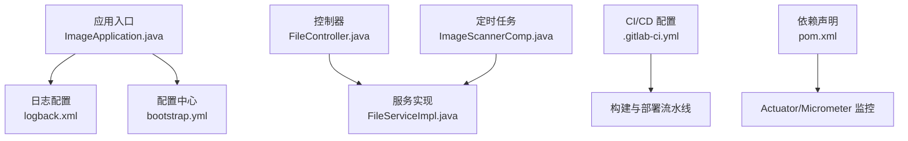
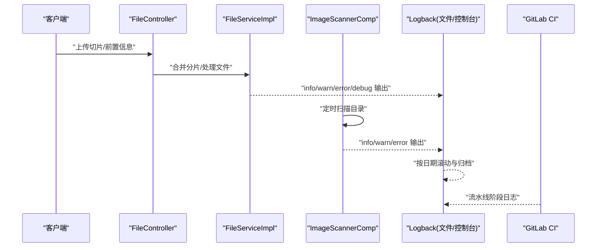
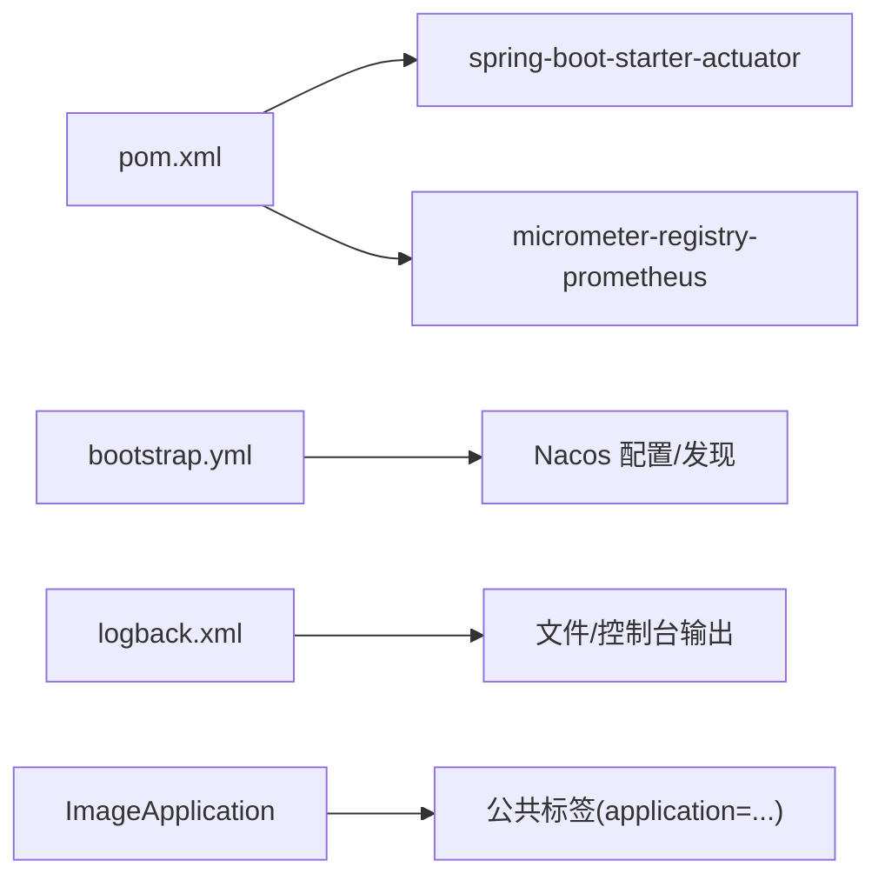

# 日志分析与诊断

<cite>
**本文引用的文件**
- [logback.xml](file://src/main/resources/logback.xml)
- [ImageApplication.java](file://src/main/java/cn/staitech/ImageApplication.java)
- [bootstrap.yml](file://src/main/resources/bootstrap.yml)
- [FileController.java](file://src/main/java/cn/staitech/file/controller/FileController.java)
- [FileServiceImpl.java](file://src/main/java/cn/staitech/file/service/impl/FileServiceImpl.java)
- [ImageScannerComp.java](file://src/main/java/cn/staitech/file/scheduled/ImageScannerComp.java)
- [.gitlab-ci.yml](file://.gitlab-ci.yml)
- [pom.xml](file://pom.xml)
</cite>

## 目录
1. [简介](#简介)
2. [项目结构](#项目结构)
3. [核心组件](#核心组件)
4. [架构总览](#架构总览)
5. [详细组件分析](#详细组件分析)
6. [依赖分析](#依赖分析)
7. [性能考虑](#性能考虑)
8. [故障排查指南](#故障排查指南)
9. [结论](#结论)
10. [附录](#附录)

## 简介
本文件面向运维与开发团队，系统化梳理 PACMVS 图像服务模块的日志体系与诊断方法，覆盖以下主题：
- Logback 日志配置与日志级别策略
- 日志文件滚动与归档管理
- 关键日志信息识别与分析技巧（错误、警告、调试）
- 基于日志定位根因的方法论（异常堆栈、性能瓶颈、系统状态）
- CI/CD 日志分析与自动化监控集成思路
- 日志聚合与可观测性建议

## 项目结构
本项目采用 Spring Boot 标准结构，日志配置位于资源目录，应用入口与监控配置在主程序类中，业务层通过 SLF4J 记录运行日志，定时任务负责目录扫描与批量处理。

图表来源
- [ImageApplication.java:37-50](file://src/main/java/cn/staitech/ImageApplication.java#L37-L50)
- [logback.xml:2-116](file://src/main/resources/logback.xml#L2-L116)
- [bootstrap.yml:1-37](file://src/main/resources/bootstrap.yml#L1-L37)
- [FileController.java:58-85](file://src/main/java/cn/staitech/file/controller/FileController.java#L58-L85)
- [FileServiceImpl.java:53-146](file://src/main/java/cn/staitech/file/service/impl/FileServiceImpl.java#L53-L146)
- [ImageScannerComp.java:34-74](file://src/main/java/cn/staitech/file/scheduled/ImageScannerComp.java#L34-L74)
- [.gitlab-ci.yml:16-49](file://.gitlab-ci.yml#L16-L49)
- [pom.xml:47-51](file://pom.xml#L47-L51)

章节来源
- [ImageApplication.java:37-50](file://src/main/java/cn/staitech/ImageApplication.java#L37-L50)
- [logback.xml:2-116](file://src/main/resources/logback.xml#L2-L116)
- [bootstrap.yml:1-37](file://src/main/resources/bootstrap.yml#L1-L37)

## 核心组件
- 日志配置与输出
  - 控制台输出与多文件输出（info/warn/error/debug），按日期滚动，保留60天
  - 根日志级别默认 info，Nacos 客户端与 SQL 语句日志提升至 debug
- 应用入口与监控
  - 设置时区、注册 Micrometer 公共标签，便于指标关联
- 业务日志
  - 控制器捕获异常并记录错误日志，服务层记录分片合并、状态变更、缩略图生成等关键事件
- 定时任务日志
  - 目录扫描、异常处理、文件过滤与批量处理过程均有日志输出
- CI/CD 日志
  - 构建、测试、部署阶段的流水线日志可用于问题回溯与回归验证

章节来源
- [logback.xml:9-115](file://src/main/resources/logback.xml#L9-L115)
- [ImageApplication.java:39-50](file://src/main/java/cn/staitech/ImageApplication.java#L39-L50)
- [FileController.java:80-84](file://src/main/java/cn/staitech/file/controller/FileController.java#L80-L84)
- [FileServiceImpl.java:53-146](file://src/main/java/cn/staitech/file/service/impl/FileServiceImpl.java#L53-L146)
- [ImageScannerComp.java:34-74](file://src/main/java/cn/staitech/file/scheduled/ImageScannerComp.java#L34-L74)
- [.gitlab-ci.yml:24-49](file://.gitlab-ci.yml#L24-L49)

## 架构总览
日志在系统中的流向如下：应用启动加载 Logback 配置；业务请求进入控制器与服务层，按级别输出到控制台与对应日志文件；定时任务周期性扫描目录并处理图像；CI/CD 流水线输出构建与部署日志。

图表来源
- [FileController.java:58-85](file://src/main/java/cn/staitech/file/controller/FileController.java#L58-L85)
- [FileServiceImpl.java:53-146](file://src/main/java/cn/staitech/file/service/impl/FileServiceImpl.java#L53-L146)
- [ImageScannerComp.java:34-74](file://src/main/java/cn/staitech/file/scheduled/ImageScannerComp.java#L34-L74)
- [logback.xml:16-115](file://src/main/resources/logback.xml#L16-L115)
- [.gitlab-ci.yml:24-49](file://.gitlab-ci.yml#L24-L49)

## 详细组件分析

### Logback 日志配置与级别策略
- 配置要点
  - 日志路径与输出模式通过属性统一管理
  - 控制台与多文件 appender 分离，便于实时观察与长期归档
  - 基于时间的滚动策略，按日切割，保留60天
  - 通过 LevelFilter 将不同级别限定到独立文件，避免交叉污染
  - 根级别默认 info，Nacos 客户端与 SQL 语句开启 debug 以便排查配置与数据库问题
- 日志文件管理
  - info/warn/error/debug 各自独立文件，便于按需检索
  - 建议结合日志聚合平台对四类文件进行索引与可视化

章节来源
- [logback.xml:2-116](file://src/main/resources/logback.xml#L2-L116)

### 应用入口与监控集成
- 时区设置与应用标签
  - 启动时设置 Asia/Shanghai，确保日志时间与业务一致
  - 注册 Micrometer 公共标签 application=staitech-image，便于指标关联
- Actuator 与监控
  - 引入 spring-boot-starter-actuator，结合 Micrometer-Prometheus 可导出指标，辅助性能分析

章节来源
- [ImageApplication.java:39-50](file://src/main/java/cn/staitech/ImageApplication.java#L39-L50)
- [pom.xml:47-51](file://pom.xml#L47-L51)

### 控制器层日志（异常与业务流程）
- 关键行为
  - 前置信息校验失败与异常捕获，统一记录错误日志并抛出
  - 上传切片接口返回统一响应体，便于日志与监控联动
- 诊断要点
  - 结合请求参数与错误日志快速定位输入校验失败场景
  - 异常堆栈可通过日志定位到具体方法与行号

章节来源
- [FileController.java:58-85](file://src/main/java/cn/staitech/file/controller/FileController.java#L58-L85)

### 服务层日志（分片合并、状态与缩略图）
- 关键行为
  - 分片合并：创建文件、写入、进度统计、状态更新、触发缩略图生成
  - 并发控制：使用原子引用数组记录分片完成状态
  - 定时清理：超时未更新的上传中状态自动置为失败并删除临时文件
- 诊断要点
  - DEBUG：分片写入与状态更新，适合排查并发与顺序问题
  - INFO：进度与状态变更，适合监控吞吐与成功率
  - WARN/ERROR：非法参数、IO 异常、缩略图生成失败，用于定位根因

章节来源
- [FileServiceImpl.java:53-146](file://src/main/java/cn/staitech/file/service/impl/FileServiceImpl.java#L53-L146)

### 定时任务日志（目录扫描与批量处理）
- 关键行为
  - 根目录校验、组织目录解析、扫描仪目录与当日目录遍历
  - 重试目录与时间窗口过滤、批量入库与缩略图生成
- 诊断要点
  - ERROR/WARN：目录不存在、权限不足、文件格式不符等
  - INFO：处理进度与结果汇总，便于核对批量作业执行情况

章节来源
- [ImageScannerComp.java:34-74](file://src/main/java/cn/staitech/file/scheduled/ImageScannerComp.java#L34-L74)

### CI/CD 日志分析
- 流水线阶段
  - build/test/deploy 三个阶段分别输出编译、单元测试、部署日志
- 分析方法
  - 失败节点优先：定位构建失败、测试失败或部署失败的具体步骤
  - 时间轴回溯：结合构建号与日志时间点，复盘问题引入范围
  - 与业务日志联动：将流水线失败与应用日志中的错误/警告关联

章节来源
- [.gitlab-ci.yml:16-49](file://.gitlab-ci.yml#L16-L49)

## 依赖分析
- 日志与监控依赖
  - Logback：文件滚动与级别过滤
  - Actuator + Micrometer：指标暴露，便于性能与健康度观测
- 配置中心
  - Nacos：动态配置与命名空间/分组隔离，debug 日志有助于排查配置拉取问题

图表来源
- [pom.xml:47-51](file://pom.xml#L47-L51)
- [bootstrap.yml:17-37](file://src/main/resources/bootstrap.yml#L17-L37)
- [logback.xml:105-115](file://src/main/resources/logback.xml#L105-L115)
- [ImageApplication.java:47-50](file://src/main/java/cn/staitech/ImageApplication.java#L47-L50)

章节来源
- [pom.xml:47-51](file://pom.xml#L47-L51)
- [bootstrap.yml:17-37](file://src/main/resources/bootstrap.yml#L17-L37)
- [logback.xml:105-115](file://src/main/resources/logback.xml#L105-L115)
- [ImageApplication.java:47-50](file://src/main/java/cn/staitech/ImageApplication.java#L47-L50)

## 性能考虑
- 日志级别与开销
  - DEBUG 量级较大，建议仅在问题定位阶段临时开启
  - INFO/WARN/ERROR 覆盖主要运行轨迹，兼顾可观测性与性能
- IO 与滚动策略
  - 按日滚动减少单文件体积，配合保留60天避免磁盘压力
- 监控指标
  - 结合 Actuator 指标与 Micrometer，关注请求耗时、线程池、数据库连接等关键指标

## 故障排查指南

### 快速定位步骤
- 明确现象与时间窗：根据业务高峰或异常告警时间点，缩小日志检索范围
- 选择日志文件：优先查看 error.log，其次 warn.log，最后 debug.log
- 关联请求链路：从控制器入口日志入手，追踪到服务层与定时任务
- 关注关键字段：时间戳、线程名、类名与行号、方法签名、业务 ID（如 imageId）

### 常见问题与日志特征
- 分片上传失败
  - 现象：进度未增长、最终失败
  - 日志特征：服务层 error 写入异常、DEBUG/INFO 中进度与状态变更
  - 排查要点：IO 权限、磁盘空间、并发控制数组一致性
- 缩略图生成异常
  - 现象：状态停留在“解析中”
  - 日志特征：服务层 error 生成缩略图异常
  - 排查要点：OpenSlide/依赖库版本、输入文件格式
- 目录扫描缺失
  - 现象：定时任务未发现新文件
  - 日志特征：定时任务 error/warn 目录不存在/权限不足
  - 排查要点：扫描路径配置、文件修改时间窗口、重试目录策略

### 异常堆栈跟踪
- 定位方法
  - 在 error/warn 文件中查找异常类型与消息
  - 对照控制器与服务层方法签名，确认调用链
  - 若涉及第三方库，结合依赖版本与已知问题进行比对

### 性能瓶颈分析
- 观察点
  - 分片写入耗时：关注服务层 DEBUG/INFO 的进度与状态更新频率
  - 并发冲突：检查分片状态数组更新是否频繁竞争
  - IO 压力：结合系统监控与日志中的文件操作频率
- 建议
  - 降低 DEBUG 级别，聚焦 INFO/WARN
  - 优化磁盘与网络存储，减少随机写放大

### 系统状态监控
- 关键指标
  - 上传成功率、平均耗时、失败率
  - 定时任务执行时延与遗漏率
- 工具建议
  - Prometheus + Grafana：采集 Micrometer 指标并可视化
  - 日志聚合：ELK/EFK 或 Loki + Promtail，实现日志检索与告警

章节来源
- [FileServiceImpl.java:53-146](file://src/main/java/cn/staitech/file/service/impl/FileServiceImpl.java#L53-L146)
- [ImageScannerComp.java:34-74](file://src/main/java/cn/staitech/file/scheduled/ImageScannerComp.java#L34-L74)
- [logback.xml:105-115](file://src/main/resources/logback.xml#L105-L115)

## 结论
本项目通过 Logback 的多文件分级输出与基于时间的滚动策略，实现了清晰、可追溯的日志体系。结合控制器与服务层的关键日志点、定时任务的全链路输出，以及 CI/CD 流水线日志，能够高效定位问题根因并支撑性能优化与自动化监控集成。建议在生产环境保持 INFO/WARN/ERROR 的默认级别，必要时临时开启 DEBUG，并配合 Micrometer 指标与日志聚合平台，形成完整的可观测性闭环。

## 附录

### 日志级别与文件映射
- info → info.log
- warn → warn.log
- error → error.log
- debug → debug.log

章节来源
- [logback.xml:16-115](file://src/main/resources/logback.xml#L16-L115)

### 关键日志字段参考
- 时间戳：用于时间轴回溯
- 线程名：用于并发场景定位
- 类名与方法签名：用于定位代码位置
- 行号：用于精确定位
- 业务 ID：如 imageId，用于关联业务状态

章节来源
- [logback.xml:6](file://src/main/resources/logback.xml#L6)
- [FileController.java:80-84](file://src/main/java/cn/staitech/file/controller/FileController.java#L80-L84)
- [FileServiceImpl.java:53-146](file://src/main/java/cn/staitech/file/service/impl/FileServiceImpl.java#L53-L146)
- [ImageScannerComp.java:34-74](file://src/main/java/cn/staitech/file/scheduled/ImageScannerComp.java#L34-L74)