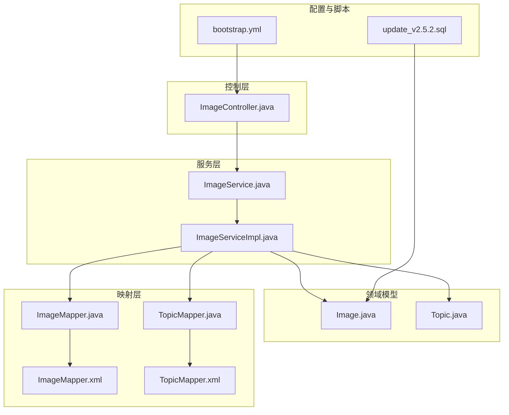
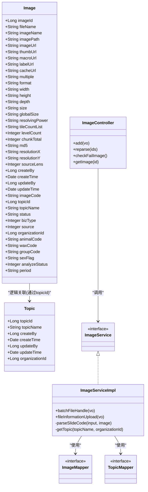
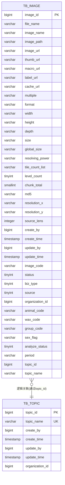
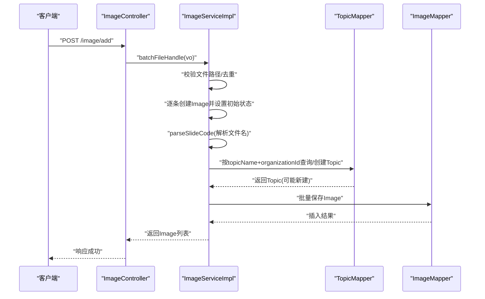
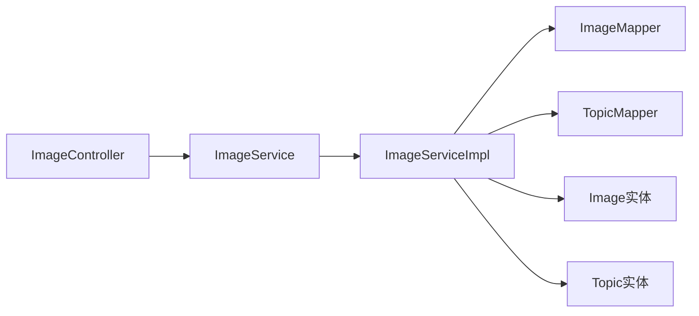

# 数据模型

<cite>
**本文引用的文件**
- [Image.java](file://src/main/java/cn/staitech/file/domain/Image.java)
- [Topic.java](file://src/main/java/cn/staitech/file/domain/Topic.java)
- [ImageMapper.java](file://src/main/java/cn/staitech/file/mapper/ImageMapper.java)
- [TopicMapper.java](file://src/main/java/cn/staitech/file/mapper/TopicMapper.java)
- [ImageMapper.xml](file://src/main/resources/mapper/ImageMapper.xml)
- [TopicMapper.xml](file://src/main/resources/mapper/TopicMapper.xml)
- [ImageService.java](file://src/main/java/cn/staitech/file/service/ImageService.java)
- [ImageServiceImpl.java](file://src/main/java/cn/staitech/file/service/impl/ImageServiceImpl.java)
- [ImageController.java](file://src/main/java/cn/staitech/file/controller/ImageController.java)
- [ImageConstant.java](file://src/main/java/cn/staitech/file/constant/ImageConstant.java)
- [ImageUtils.java](file://src/main/java/cn/staitech/file/util/ImageUtils.java)
- [bootstrap.yml](file://src/main/resources/bootstrap.yml)
- [update_v2.5.2.sql](file://sql/update_v2.5.2.sql)
</cite>

## 目录
1. [简介](#简介)
2. [项目结构](#项目结构)
3. [核心组件](#核心组件)
4. [架构概览](#架构概览)
5. [详细组件分析](#详细组件分析)
6. [依赖分析](#依赖分析)
7. [性能考虑](#性能考虑)
8. [故障排查指南](#故障排查指南)
9. [结论](#结论)
10. [附录](#附录)

## 简介
本文件面向数据库管理员与后端开发者，系统化梳理 PACMVS 项目中与“图像”和“专题”相关的数据模型设计。重点覆盖以下方面：
- 实体定义与字段说明（Image、Topic）
- 主键/外键关系、索引设计与约束
- 数据验证规则与业务规则
- 数据访问模式与典型流程
- 数据库模式图与示例数据
- 缓存策略、性能考量与数据生命周期管理

## 项目结构
围绕“图像/专题”数据模型的相关模块分布如下：
- 领域模型：cn.staitech.file.domain（Image、Topic）
- 映射接口：cn.staitech.file.mapper（ImageMapper、TopicMapper）
- 映射文件：resources/mapper（ImageMapper.xml、TopicMapper.xml）
- 服务层：cn.staitech.file.service（ImageService）与实现（ImageServiceImpl）
- 控制器：cn.staitech.file.controller（ImageController）
- 常量与工具：cn.staitech.file.constant（ImageConstant）、cn.staitech.file.util（ImageUtils）
- 配置：resources/bootstrap.yml
- 数据库变更脚本：sql/update_v2.5.2.sql

**图表来源**
- [Image.java:27-216](file://src/main/java/cn/staitech/file/domain/Image.java#L27-L216)
- [Topic.java:24-61](file://src/main/java/cn/staitech/file/domain/Topic.java#L24-L61)
- [ImageMapper.java:14-16](file://src/main/java/cn/staitech/file/mapper/ImageMapper.java#L14-L16)
- [TopicMapper.java:6-8](file://src/main/java/cn/staitech/file/mapper/TopicMapper.java#L6-L8)
- [ImageMapper.xml:5-46](file://src/main/resources/mapper/ImageMapper.xml#L5-L46)
- [TopicMapper.xml:5-7](file://src/main/resources/mapper/TopicMapper.xml#L5-L7)
- [ImageService.java:17-23](file://src/main/java/cn/staitech/file/service/ImageService.java#L17-L23)
- [ImageServiceImpl.java:42-547](file://src/main/java/cn/staitech/file/service/impl/ImageServiceImpl.java#L42-L547)
- [ImageController.java:30-71](file://src/main/java/cn/staitech/file/controller/ImageController.java#L30-L71)
- [bootstrap.yml:1-37](file://src/main/resources/bootstrap.yml#L1-L37)
- [update_v2.5.2.sql:1-10](file://sql/update_v2.5.2.sql#L1-L10)

**章节来源**
- [Image.java:27-216](file://src/main/java/cn/staitech/file/domain/Image.java#L27-L216)
- [Topic.java:24-61](file://src/main/java/cn/staitech/file/domain/Topic.java#L24-L61)
- [ImageMapper.xml:5-46](file://src/main/resources/mapper/ImageMapper.xml#L5-L46)
- [bootstrap.yml:1-37](file://src/main/resources/bootstrap.yml#L1-L37)

## 核心组件
本节聚焦“图像”和“专题”两个核心实体及其关系。

- 实体与表映射
  - Image 实体映射至 tb_image 表
  - Topic 实体映射至 tb_topic 表
- 关系
  - Image.topicId 与 Topic.topicId 存在逻辑关联（服务层在解析文件名时会查询 Topic 并回填 topicId），但未见显式外键约束定义。
- 字段与类型
  - Image 包含图像元数据、切片信息、状态、来源、组织与解析结果等字段
  - Topic 包含主题名称与组织维度信息
- 约束与索引
  - 主键：自增 Long 类型
  - Topic.topicName 在实体层面标注为唯一约束（需数据库层面建立唯一索引）
  - 未发现 tb_image 与 tb_topic 的外键定义

**章节来源**
- [Image.java:27-216](file://src/main/java/cn/staitech/file/domain/Image.java#L27-L216)
- [Topic.java:24-61](file://src/main/java/cn/staitech/file/domain/Topic.java#L24-L61)
- [ImageMapper.xml:5-46](file://src/main/resources/mapper/ImageMapper.xml#L5-L46)
- [update_v2.5.2.sql:1-10](file://sql/update_v2.5.2.sql#L1-L10)

## 架构概览
下图展示“图像/专题”数据模型在应用中的交互关系与典型流程。

**图表来源**
- [Image.java:27-216](file://src/main/java/cn/staitech/file/domain/Image.java#L27-L216)
- [Topic.java:24-61](file://src/main/java/cn/staitech/file/domain/Topic.java#L24-L61)
- [ImageMapper.java:14-16](file://src/main/java/cn/staitech/file/mapper/ImageMapper.java#L14-L16)
- [TopicMapper.java:6-8](file://src/main/java/cn/staitech/file/mapper/TopicMapper.java#L6-L8)
- [ImageService.java:17-23](file://src/main/java/cn/staitech/file/service/ImageService.java#L17-L23)
- [ImageServiceImpl.java:42-547](file://src/main/java/cn/staitech/file/service/impl/ImageServiceImpl.java#L42-L547)
- [ImageController.java:30-71](file://src/main/java/cn/staitech/file/controller/ImageController.java#L30-L71)

## 详细组件分析

### 实体定义与字段说明

- Image（tb_image）
  - 关键字段与类型（摘自映射文件与实体注解）
    - 主键：image_id（BIGINT）
    - 文本类：file_name、image_name、image_path、image_url、thumb_url、macro_url、label_url、cache_url、multiple、format、width、height、depth、size、global_size、resolving_power、tile_count_list、image_code、topic_name、animal_code、wax_code、group_code、sex_flag、period
    - 数值类：level_count（TINYINT）、chunk_total（SMALLINT）、source_lens（INTEGER）、biz_type（TINYINT）、source（TINYINT）、status（TINYINT）、analyze_status（TINYINT）
    - 时间类：create_time、update_time（TIMESTAMP）
    - 关联类：topic_id（BIGINT）、organization_id（BIGINT）、create_by、update_by（BIGINT）
  - 状态与来源
    - status：上传/解析/处理状态枚举（详见常量）
    - source：图像来源（上传/服务器读取）
    - biz_type：业务类型（原始切片/预测切片）
  - 解析字段
    - analyze_status：文件名解析状态（成功/失败）
    - topicName、animalCode、waxCode、groupCode、sexFlag、period：由文件名解析填充

- Topic（tb_topic）
  - 关键字段与类型
    - 主键：topic_id（BIGINT）
    - 文本类：topic_name（唯一约束）
    - 组织类：organization_id（BIGINT）
    - 时间与人员：create_by、update_by（BIGINT）、create_time、update_time（TIMESTAMP）

- 关系
  - Image.topicId 与 Topic.topicId 存在逻辑关联：服务层在解析文件名时会查询 Topic 并回填 topicId；若不存在则自动创建。

**章节来源**
- [Image.java:27-216](file://src/main/java/cn/staitech/file/domain/Image.java#L27-L216)
- [Topic.java:24-61](file://src/main/java/cn/staitech/file/domain/Topic.java#L24-L61)
- [ImageMapper.xml:5-46](file://src/main/resources/mapper/ImageMapper.xml#L5-L46)
- [ImageServiceImpl.java:349-484](file://src/main/java/cn/staitech/file/service/impl/ImageServiceImpl.java#L349-L484)
- [ImageServiceImpl.java:527-546](file://src/main/java/cn/staitech/file/service/impl/ImageServiceImpl.java#L527-L546)

### 数据库模式图

**图表来源**
- [Image.java:27-216](file://src/main/java/cn/staitech/file/domain/Image.java#L27-L216)
- [Topic.java:24-61](file://src/main/java/cn/staitech/file/domain/Topic.java#L24-L61)
- [ImageMapper.xml:5-46](file://src/main/resources/mapper/ImageMapper.xml#L5-L46)
- [update_v2.5.2.sql:1-10](file://sql/update_v2.5.2.sql#L1-L10)

### 数据验证规则与业务规则

- 文件名解析规则（文件名字段解析）
  - 支持两种输入格式：
    - “专题号 动物号-蜡块号 组别性别[其他]”
    - “专题号~动物号~蜡块号~组别性别~其他_时间戳…”
  - 解析产物：
    - topicName → 查询 Topic 并回填 topicId（若缺失则自动创建）
    - animalCode、waxCode、groupCode、sexFlag、period
    - analyze_status：成功/失败
  - 未匹配或格式错误时，analyze_status 设为失败，同时记录日志

- 状态机（status）
  - 上传中、上传失败、解析中、解析失败、可用、信息解析中、信息解析失败、处理中、处理失败
  - 服务层在批量导入与补充信息时设置初始状态

- 来源与业务类型
  - source：1=手动上传，2=服务器读取
  - biz_type：1=原始切片（默认），2=预测切片

- 文件与尺寸限制
  - 允许扩展名集合（工具类）
  - 最大文件大小（配置与常量）

- 组织隔离
  - 通过 organization_id 进行组织级隔离
  - 路径生成包含组织ID前缀

**章节来源**
- [ImageServiceImpl.java:349-484](file://src/main/java/cn/staitech/file/service/impl/ImageServiceImpl.java#L349-L484)
- [ImageServiceImpl.java:527-546](file://src/main/java/cn/staitech/file/service/impl/ImageServiceImpl.java#L527-L546)
- [ImageConstant.java:9-67](file://src/main/java/cn/staitech/file/constant/ImageConstant.java#L9-L67)
- [ImageUtils.java:23-31](file://src/main/java/cn/staitech/file/util/ImageUtils.java#L23-L31)
- [bootstrap.yml:7-10](file://src/main/resources/bootstrap.yml#L7-L10)

### 数据访问模式

- 批量导入（服务器选片）
  - ImageController 接收 FileInsertVO，调用 ImageService.batchFileHandle
  - 服务层：
    - 校验文件路径有效性
    - 去重（按 imagePath + organizationId）
    - 逐条创建 Image，设置初始状态与来源
    - 解析文件名并填充 Topic 关联
    - 批量保存

- 补充信息（手动上传）
  - ImageController 接收 FileInformationVO，调用 ImageService.fileInformationUpload
  - 服务层：
    - 校验并提取文件名
    - 解析文件名字段
    - 初始化本地路径与URL
    - 插入数据库

- 查询与重解析
  - 查询失败状态与解析失败的切片
  - 触发重解析流程

**图表来源**
- [ImageController.java:42-48](file://src/main/java/cn/staitech/file/controller/ImageController.java#L42-L48)
- [ImageServiceImpl.java:63-140](file://src/main/java/cn/staitech/file/service/impl/ImageServiceImpl.java#L63-L140)
- [ImageServiceImpl.java:527-546](file://src/main/java/cn/staitech/file/service/impl/ImageServiceImpl.java#L527-L546)
- [ImageMapper.java:14-16](file://src/main/java/cn/staitech/file/mapper/ImageMapper.java#L14-L16)
- [TopicMapper.java:6-8](file://src/main/java/cn/staitech/file/mapper/TopicMapper.java#L6-L8)

### 示例数据

- 示例：tb_topic
  - topic_id: 1
  - topic_name: "R24-224"
  - organization_id: 1001
  - create_by/update_by: 1
  - create_time/update_time: 当前时间

- 示例：tb_image
  - image_id: 10001
  - image_name: "R24-224-RD～2424912～2～4M～~TN～RC-1_083944]"
  - file_name: "R24-224-RD～2424912～2～4M～~TN～RC-1"
  - topic_name: "R24-224"
  - topic_id: 1
  - organization_id: 1001
  - status: "2"（解析中）
  - analyze_status: 1（成功）
  - animal_code: "2424912"
  - wax_code: "2"
  - group_code: "4"
  - sex_flag: "M"
  - period: "TN"
  - create_by/update_by: 1
  - create_time/update_time: 当前时间

**章节来源**
- [ImageServiceImpl.java:421-484](file://src/main/java/cn/staitech/file/service/impl/ImageServiceImpl.java#L421-L484)
- [ImageServiceImpl.java:527-546](file://src/main/java/cn/staitech/file/service/impl/ImageServiceImpl.java#L527-L546)

## 依赖分析

- 组件耦合
  - ImageController 仅依赖 ImageService 接口
  - ImageServiceImpl 同时依赖 ImageMapper 与 TopicMapper，体现对“专题”实体的读写
- 外部依赖
  - MyBatis-Plus 基于注解与 XML 映射
  - OpenSlide 用于切片解析与转换（工具层）
- 可能的循环依赖
  - 未见直接循环依赖迹象

**图表来源**
- [ImageController.java:30-71](file://src/main/java/cn/staitech/file/controller/ImageController.java#L30-L71)
- [ImageService.java:17-23](file://src/main/java/cn/staitech/file/service/ImageService.java#L17-L23)
- [ImageServiceImpl.java:42-547](file://src/main/java/cn/staitech/file/service/impl/ImageServiceImpl.java#L42-L547)
- [ImageMapper.java:14-16](file://src/main/java/cn/staitech/file/mapper/ImageMapper.java#L14-L16)
- [TopicMapper.java:6-8](file://src/main/java/cn/staitech/file/mapper/TopicMapper.java#L6-L8)

**章节来源**
- [ImageController.java:30-71](file://src/main/java/cn/staitech/file/controller/ImageController.java#L30-L71)
- [ImageService.java:17-23](file://src/main/java/cn/staitech/file/service/ImageService.java#L17-L23)
- [ImageServiceImpl.java:42-547](file://src/main/java/cn/staitech/file/service/impl/ImageServiceImpl.java#L42-L547)

## 性能考虑

- 索引建议
  - 唯一索引：tb_topic.topic_name（唯一约束）
  - 常用查询列：
    - tb_image.organization_id
    - tb_image.topic_id
    - tb_image.status
    - tb_image.analyze_status
    - tb_image.image_path（用于去重）
- 批量操作
  - 批量插入/更新：使用 MyBatis-Plus 的批量方法以减少往返
- IO 与缓存
  - 生成缩略图/宏图/标签图与缓存缩略图路径，降低前端渲染压力
  - 服务层生成静态资源 URL 基于固定目录结构，便于 CDN 缓存
- 配置
  - Spring Boot 多文件上传大小上限已在配置中设置

**章节来源**
- [ImageMapper.xml:5-46](file://src/main/resources/mapper/ImageMapper.xml#L5-L46)
- [ImageServiceImpl.java:275-305](file://src/main/java/cn/staitech/file/service/impl/ImageServiceImpl.java#L275-L305)
- [bootstrap.yml:7-10](file://src/main/resources/bootstrap.yml#L7-L10)

## 故障排查指南

- 常见问题与定位
  - 文件名解析失败：检查文件名格式是否符合两种支持格式；查看 analyze_status 与日志
  - 专题缺失：解析时未找到对应 topicName，服务层会尝试创建；确认 organizationId 与 topicName 是否一致
  - 重复文件：按 imagePath + organizationId 去重；若提示已存在，确认路径是否正确
  - 状态异常：根据状态枚举核对当前状态流转是否符合预期
- 相关常量与状态
  - 状态枚举与来源枚举、解析状态枚举均定义于常量类
  - 数据库变更脚本中新增 process_flag 并调整时间字段默认值

**章节来源**
- [ImageServiceImpl.java:63-140](file://src/main/java/cn/staitech/file/service/impl/ImageServiceImpl.java#L63-L140)
- [ImageServiceImpl.java:349-484](file://src/main/java/cn/staitech/file/service/impl/ImageServiceImpl.java#L349-L484)
- [ImageConstant.java:20-52](file://src/main/java/cn/staitech/file/constant/ImageConstant.java#L20-L52)
- [update_v2.5.2.sql:1-10](file://sql/update_v2.5.2.sql#L1-L10)

## 结论
本数据模型围绕“图像/专题”两大实体展开，采用 MyBatis-Plus 注解与 XML 映射实现清晰的数据访问层。服务层承担了文件名解析、组织隔离与状态管理等关键职责。建议在数据库层面完善唯一索引与常用查询列索引，结合批量操作与静态资源缓存策略，进一步提升整体性能与可维护性。

## 附录

### 字段与类型对照（摘自映射文件）

- tb_image
  - image_id: BIGINT
  - file_name: VARCHAR
  - image_name: VARCHAR
  - image_path: VARCHAR
  - image_url: VARCHAR
  - thumb_url: VARCHAR
  - macro_url: VARCHAR
  - label_url: VARCHAR
  - cache_url: VARCHAR
  - multiple: VARCHAR
  - format: VARCHAR
  - width: VARCHAR
  - height: VARCHAR
  - depth: VARCHAR
  - size: VARCHAR
  - global_size: VARCHAR
  - resolving_power: VARCHAR
  - tile_count_list: VARCHAR
  - level_count: TINYINT
  - chunk_total: SMALLINT
  - md5: VARCHAR
  - resolution_x: VARCHAR
  - resolution_y: VARCHAR
  - source_lens: INTEGER
  - create_by: BIGINT
  - create_time: TIMESTAMP
  - update_by: BIGINT
  - update_time: TIMESTAMP
  - image_code: VARCHAR
  - status: TINYINT
  - organization_id: BIGINT
  - biz_type: TINYINT
  - source: TINYINT
  - topic_id: BIGINT
  - topic_name: VARCHAR
  - animal_code: VARCHAR
  - wax_code: VARCHAR
  - group_code: VARCHAR
  - sex_flag: VARCHAR
  - analyze_status: TINYINT
  - period: VARCHAR

- tb_topic
  - topic_id: BIGINT
  - topic_name: VARCHAR（唯一）
  - create_by: BIGINT
  - create_time: TIMESTAMP
  - update_by: BIGINT
  - update_time: TIMESTAMP
  - organization_id: BIGINT

**章节来源**
- [ImageMapper.xml:5-46](file://src/main/resources/mapper/ImageMapper.xml#L5-L46)
- [TopicMapper.xml:5-7](file://src/main/resources/mapper/TopicMapper.xml#L5-L7)