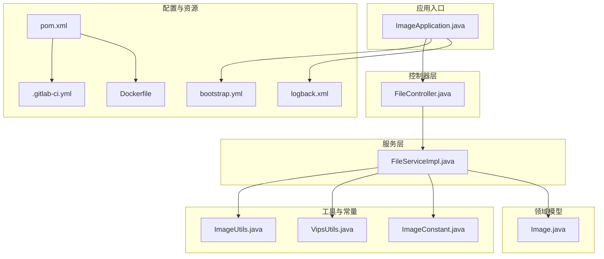
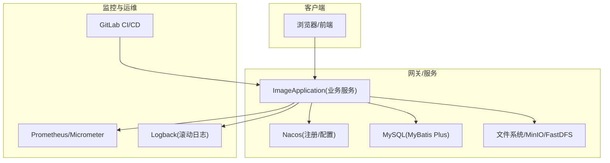
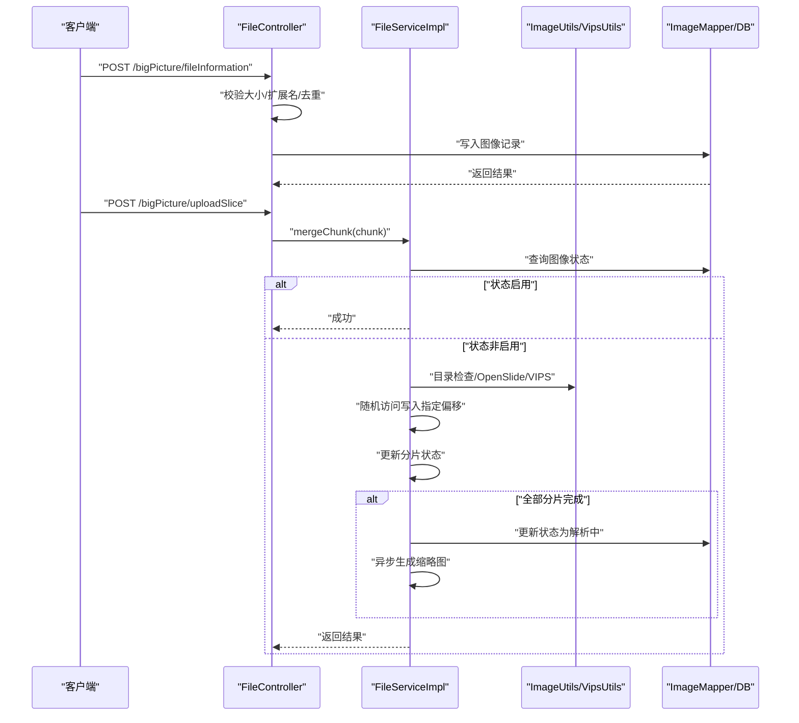
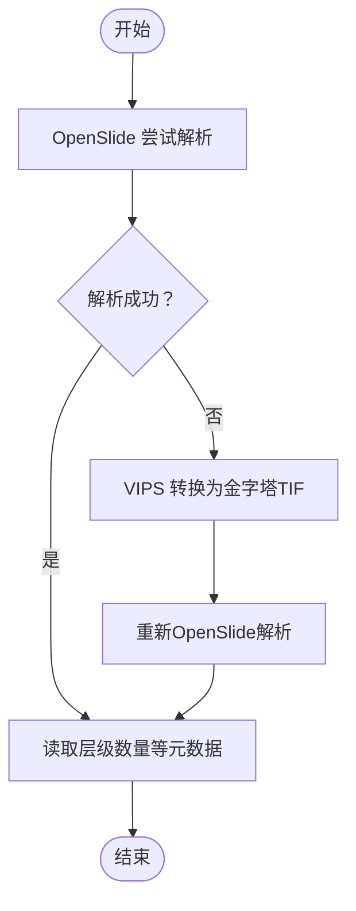
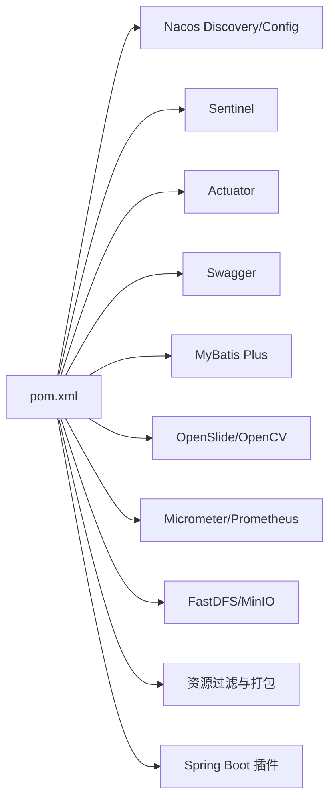
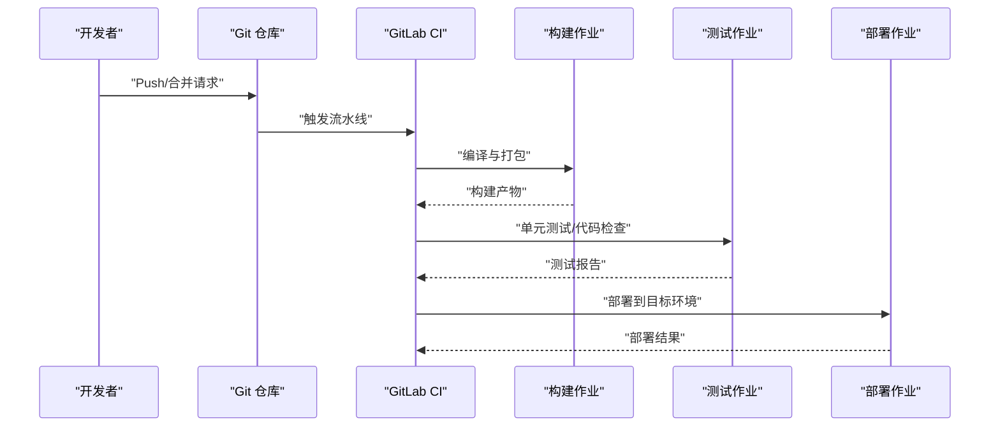

# 代码质量保证

<cite>
**本文引用的文件**
- [CONTRIBUTING.md](file://CONTRIBUTING.md)
- [.gitlab-ci.yml](file://.gitlab-ci.yml)
- [pom.xml](file://pom.xml)
- [Dockerfile](file://Dockerfile)
- [README.md](file://README.md)
- [bootstrap.yml](file://src/main/resources/bootstrap.yml)
- [ImageApplication.java](file://src/main/java/cn/staitech/ImageApplication.java)
- [FileController.java](file://src/main/java/cn/staitech/file/controller/FileController.java)
- [FileServiceImpl.java](file://src/main/java/cn/staitech/file/service/impl/FileServiceImpl.java)
- [ImageUtils.java](file://src/main/java/cn/staitech/file/util/ImageUtils.java)
- [VipsUtils.java](file://src/main/java/cn/staitech/file/util/VipsUtils.java)
- [ImageConstant.java](file://src/main/java/cn/staitech/file/constant/ImageConstant.java)
- [Image.java](file://src/main/java/cn/staitech/file/domain/Image.java)
- [logback.xml](file://src/main/resources/logback.xml)
</cite>

## 目录
1. [引言](#引言)
2. [项目结构](#项目结构)
3. [核心组件](#核心组件)
4. [架构总览](#架构总览)
5. [详细组件分析](#详细组件分析)
6. [依赖分析](#依赖分析)
7. [性能考虑](#性能考虑)
8. [故障排查指南](#故障排查指南)
9. [结论](#结论)
10. [附录](#附录)

## 引言
本文件面向 PACMVS 项目的 Java 图像模块，旨在建立统一的代码质量保证体系，覆盖编码规范、注释与格式化、单元测试策略、代码审查流程、持续集成与自动化测试、代码重构与遗留代码处理等方面。文档以仓库现有配置与源码为基础，结合最佳实践，形成可落地的质量标准与流程规范，帮助团队提升交付质量与协作效率。

## 项目结构
项目采用 Spring Boot 单体微服务结构，核心模块位于 src/main/java 下，按功能域划分 controller、service、mapper、util、vo、domain、config 等包。资源配置于 src/main/resources，包含日志、引导配置与 MyBatis Mapper XML。根目录提供 Maven 构建脚本、GitLab CI 配置与容器化构建文件。

图表来源
- [ImageApplication.java:1-53](file://src/main/java/cn/staitech/ImageApplication.java#L1-L53)
- [FileController.java:1-130](file://src/main/java/cn/staitech/file/controller/FileController.java#L1-L130)
- [FileServiceImpl.java:1-178](file://src/main/java/cn/staitech/file/service/impl/FileServiceImpl.java#L1-L178)
- [ImageUtils.java:1-148](file://src/main/java/cn/staitech/file/util/ImageUtils.java#L1-L148)
- [VipsUtils.java:1-37](file://src/main/java/cn/staitech/file/util/VipsUtils.java#L1-L37)
- [ImageConstant.java:1-67](file://src/main/java/cn/staitech/file/constant/ImageConstant.java#L1-L67)
- [Image.java:1-216](file://src/main/java/cn/staitech/file/domain/Image.java#L1-L216)
- [bootstrap.yml:1-37](file://src/main/resources/bootstrap.yml#L1-L37)
- [logback.xml:1-116](file://src/main/resources/logback.xml#L1-L116)
- [pom.xml:1-385](file://pom.xml#L1-L385)
- [.gitlab-ci.yml:1-50](file://.gitlab-ci.yml#L1-L50)
- [Dockerfile:1-16](file://Dockerfile#L1-L16)

章节来源
- [pom.xml:1-385](file://pom.xml#L1-L385)
- [bootstrap.yml:1-37](file://src/main/resources/bootstrap.yml#L1-L37)
- [logback.xml:1-116](file://src/main/resources/logback.xml#L1-L116)
- [.gitlab-ci.yml:1-50](file://.gitlab-ci.yml#L1-L50)
- [Dockerfile:1-16](file://Dockerfile#L1-L16)

## 核心组件
- 应用入口与装配
  - 启动类启用调度、WebSocket、安全配置、Swagger、Feign、事务与服务发现等能力，并设置时区与指标标签。
- 控制器层
  - 提供大文件分片上传与前置信息接口，包含参数校验、业务日志与统一返回封装。
- 服务层
  - 实现分片合并、并发控制、超时清理与缩略图生成触发逻辑。
- 工具与常量
  - 文件扩展名校验、目录检查、OpenSlide 验证与 VIPS 转换、状态常量与阈值定义。
- 领域模型
  - 图像实体映射数据库字段，包含状态、来源、元数据与解析状态等。

章节来源
- [ImageApplication.java:1-53](file://src/main/java/cn/staitech/ImageApplication.java#L1-L53)
- [FileController.java:1-130](file://src/main/java/cn/staitech/file/controller/FileController.java#L1-L130)
- [FileServiceImpl.java:1-178](file://src/main/java/cn/staitech/file/service/impl/FileServiceImpl.java#L1-L178)
- [ImageUtils.java:1-148](file://src/main/java/cn/staitech/file/util/ImageUtils.java#L1-L148)
- [VipsUtils.java:1-37](file://src/main/java/cn/staitech/file/util/VipsUtils.java#L1-L37)
- [ImageConstant.java:1-67](file://src/main/java/cn/staitech/file/constant/ImageConstant.java#L1-L67)
- [Image.java:1-216](file://src/main/java/cn/staitech/file/domain/Image.java#L1-L216)

## 架构总览
系统采用 Spring Boot + MyBatis Plus 的后端架构，结合 Nacos 注册与配置中心、Sentinel 流控、Prometheus 指标采集、WebSocket 推送与定时任务扫描，实现大文件分片上传、原始切片解析与缩略图生成的完整链路。

图表来源
- [ImageApplication.java:1-53](file://src/main/java/cn/staitech/ImageApplication.java#L1-L53)
- [bootstrap.yml:1-37](file://src/main/resources/bootstrap.yml#L1-L37)
- [logback.xml:1-116](file://src/main/resources/logback.xml#L1-L116)
- [.gitlab-ci.yml:1-50](file://.gitlab-ci.yml#L1-L50)

## 详细组件分析

### 组件A：分片上传与合并（FileController → FileServiceImpl）
- 功能流程
  - 前置信息校验（大小、扩展名、去重），通过后写入图像记录。
  - 分片上传时根据图像ID与分片序号定位目标文件，使用随机访问文件写入指定偏移，维护并发状态数组，全部完成后触发解析与缩略图生成。
- 关键点
  - 并发控制：使用共享映射与原子引用数组标记分片完成状态。
  - 错误恢复：超时未更新的上传中记录自动清理并回滚。
  - 日志与审计：统一返回封装与业务日志记录。

图表来源
- [FileController.java:58-127](file://src/main/java/cn/staitech/file/controller/FileController.java#L58-L127)
- [FileServiceImpl.java:53-146](file://src/main/java/cn/staitech/file/service/impl/FileServiceImpl.java#L53-L146)
- [ImageUtils.java:37-97](file://src/main/java/cn/staitech/file/util/ImageUtils.java#L37-L97)
- [VipsUtils.java:22-35](file://src/main/java/cn/staitech/file/util/VipsUtils.java#L22-L35)

章节来源
- [FileController.java:1-130](file://src/main/java/cn/staitech/file/controller/FileController.java#L1-L130)
- [FileServiceImpl.java:1-178](file://src/main/java/cn/staitech/file/service/impl/FileServiceImpl.java#L1-L178)
- [ImageUtils.java:1-148](file://src/main/java/cn/staitech/file/util/ImageUtils.java#L1-L148)
- [VipsUtils.java:1-37](file://src/main/java/cn/staitech/file/util/VipsUtils.java#L1-L37)

### 组件B：OpenSlide 验证与 VIPS 转换（ImageUtils → VipsUtils）
- 流程
  - 优先尝试 OpenSlide 解析；若失败则调用 VIPS 将非金字塔 TIF 转换为金字塔 TIF，再进行元数据校验。
- 关键点
  - 资源释放：异常路径确保 OpenSlide 资源释放。
  - 命令行调用：通过系统进程执行 VIPS 命令，需确保运行环境具备相应依赖。

图表来源
- [ImageUtils.java:52-97](file://src/main/java/cn/staitech/file/util/ImageUtils.java#L52-L97)
- [VipsUtils.java:22-35](file://src/main/java/cn/staitech/file/util/VipsUtils.java#L22-L35)

章节来源
- [ImageUtils.java:1-148](file://src/main/java/cn/staitech/file/util/ImageUtils.java#L1-L148)
- [VipsUtils.java:1-37](file://src/main/java/cn/staitech/file/util/VipsUtils.java#L1-L37)

### 组件C：日志与配置（logback.xml、bootstrap.yml）
- 日志
  - 控制台与多文件滚动输出，按 INFO/WARN/ERROR/DEBUG 分类落盘，保留 60 天。
- 配置
  - 应用端口、上传文件大小限制、Nacos 注册与配置中心地址、活动 Profile 占位符。

章节来源
- [logback.xml:1-116](file://src/main/resources/logback.xml#L1-L116)
- [bootstrap.yml:1-37](file://src/main/resources/bootstrap.yml#L1-L37)

## 依赖分析
- 构建与运行
  - Maven 资源过滤与打包策略，排除二进制文件并包含本地系统依赖 JAR。
  - Spring Boot 插件打包布局与依赖解压配置。
- 运行时依赖
  - Nacos 注册/配置、Sentinel、Actuator、Swagger、MyBatis Plus、Redisson、FastDFS、MinIO、OpenSlide、OpenCV、Micrometer 等。
- 环境配置
  - 多环境 Profile（开发/测试/生产）通过 Maven 属性注入。

图表来源
- [pom.xml:23-205](file://pom.xml#L23-L205)
- [pom.xml:305-344](file://pom.xml#L305-L344)

章节来源
- [pom.xml:1-385](file://pom.xml#L1-L385)

## 性能考虑
- 分片写入
  - 使用随机访问文件定位写入偏移，避免顺序拼接带来的多次 IO。
- 并发控制
  - 基于共享映射与原子引用数组的轻量级并发状态管理，减少锁粒度。
- 资源释放
  - OpenSlide 在异常路径及时释放，降低内存与句柄泄漏风险。
- 指标与日志
  - Micrometer 指标统一采集，Logback 分级别滚动输出，便于性能观测与问题定位。

章节来源
- [FileServiceImpl.java:53-146](file://src/main/java/cn/staitech/file/service/impl/FileServiceImpl.java#L53-L146)
- [ImageUtils.java:64-95](file://src/main/java/cn/staitech/file/util/ImageUtils.java#L64-L95)
- [logback.xml:1-116](file://src/main/resources/logback.xml#L1-L116)

## 故障排查指南
- 分片上传失败
  - 检查图像状态是否为启用；确认分片序号与总数一致性；查看随机访问写入日志与并发状态更新。
- OpenSlide 解析失败
  - 查看转换日志与 VIPS 命令执行情况；确认目标文件存在且可读；检查 OpenSlide 资源释放日志。
- 定时任务清理未生效
  - 核对上传中且超时未更新的记录筛选条件；确认文件系统路径与删除权限。
- 日志与指标
  - 检查日志滚动文件是否存在；确认指标标签与采集端点可达。

章节来源
- [FileServiceImpl.java:153-176](file://src/main/java/cn/staitech/file/service/impl/FileServiceImpl.java#L153-L176)
- [ImageUtils.java:64-95](file://src/main/java/cn/staitech/file/util/ImageUtils.java#L64-L95)
- [logback.xml:1-116](file://src/main/resources/logback.xml#L1-L116)

## 结论
本项目在架构上具备清晰的分层与职责边界，在质量保障方面已具备基础的 CI/CD、日志与配置能力。建议后续补充单元测试与覆盖率要求、代码审查清单与缺陷分类标准、以及针对分片上传与 OpenSlide 解析场景的专项测试策略，以进一步完善质量闭环。

## 附录

### A. 编码规范与代码风格
- 命名约定
  - 类名：帕斯卡命名（如 ImageApplication、FileServiceImpl）。
  - 方法/变量：驼峰命名（如 mergeChunk、DEFAULT_ALLOWED_EXTENSION）。
  - 常量：全大写下划线（如 ALLOWED_FILE_MAXSIZE、IMAGE_STATUS_UPLOADING）。
  - 包名：反向域名+功能域（如 cn.staitech.file.controller）。
- 注释规范
  - 类/方法注释：使用标准 JavaDoc，描述用途、参数、返回值与异常。
  - 关键逻辑注释：解释复杂分支与并发控制要点。
- 代码格式化
  - 统一使用 IDE 自动格式化（推荐使用 EditorConfig 或 Checkstyle 规则）。
  - 行宽建议不超过 120 字符，合理使用空行与缩进。
- 特殊处理
  - Lombok 注解使用需保持简洁，避免过度封装导致可读性下降。
  - 异常处理：捕获具体异常并记录上下文，避免吞异常或空 catch。

章节来源
- [ImageApplication.java:1-53](file://src/main/java/cn/staitech/ImageApplication.java#L1-L53)
- [FileController.java:1-130](file://src/main/java/cn/staitech/file/controller/FileController.java#L1-L130)
- [FileServiceImpl.java:1-178](file://src/main/java/cn/staitech/file/service/impl/FileServiceImpl.java#L1-L178)
- [ImageUtils.java:1-148](file://src/main/java/cn/staitech/file/util/ImageUtils.java#L1-L148)
- [ImageConstant.java:1-67](file://src/main/java/cn/staitech/file/constant/ImageConstant.java#L1-L67)

### B. 单元测试策略与覆盖率
- 测试范围
  - 服务层：分片合并、并发状态更新、超时清理、OpenSlide/VIPS 调用路径。
  - 工具类：扩展名校验、目录检查、路径格式化。
  - 控制器：参数校验、统一返回封装、异常分支。
- Mock 与测试数据
  - 使用 MockMvc/@SpringBootTest 测试控制器；使用 Mockito Mock 外部依赖（如 ImageMapper、OpenSlide、VIPS 进程）。
  - 使用临时文件与内存存储模拟文件系统行为。
- 覆盖率目标
  - 服务层与工具类行覆盖率不低于 80%，分支覆盖率不低于 60%。
- 测试组织
  - 按功能域分包（如 file.service、file.util、file.controller）。
  - 使用参数化测试覆盖边界条件（如空文件名、负分片数、超大文件）。

章节来源
- [FileServiceImpl.java:1-178](file://src/main/java/cn/staitech/file/service/impl/FileServiceImpl.java#L1-L178)
- [ImageUtils.java:1-148](file://src/main/java/cn/staitech/file/util/ImageUtils.java#L1-L148)
- [FileController.java:1-130](file://src/main/java/cn/staitech/file/controller/FileController.java#L1-L130)

### C. 代码审查流程与质量检查
- 审查清单
  - 代码可读性：命名规范、注释完整性、复杂度控制。
  - 安全性：输入校验、异常处理、敏感信息脱敏。
  - 性能：IO 写入策略、并发控制、资源释放。
  - 兼容性：跨平台命令（VIPS）与系统库依赖。
- 缺陷分类
  - 致命：崩溃、死循环、资源泄漏。
  - 严重：功能错误、数据不一致、性能瓶颈。
  - 一般：命名不规范、注释缺失、边界未覆盖。
- 修复跟踪
  - 使用 Issue/缺陷单跟踪，关联 PR 与提交，明确责任人与截止日期。

章节来源
- [CONTRIBUTING.md:1-41](file://CONTRIBUTING.md#L1-L41)
- [ImageUtils.java:64-95](file://src/main/java/cn/staitech/file/util/ImageUtils.java#L64-L95)
- [FileServiceImpl.java:53-146](file://src/main/java/cn/staitech/file/service/impl/FileServiceImpl.java#L53-L146)

### D. 持续集成与自动化测试
- CI/CD 流水线
  - 阶段：build → test → deploy。
  - 作业：编译、单元测试（占位）、代码检查（占位）、安全扫描（依赖扫描模板）。
- 构建优化
  - 使用 Maven 缓存依赖；并行构建；跳过测试阶段以加速迭代。
- 部署自动化
  - Docker 多阶段构建镜像；容器暴露端口与健康检查；结合 GitLab Runner 执行部署作业。

图表来源
- [.gitlab-ci.yml:16-49](file://.gitlab-ci.yml#L16-L49)
- [Dockerfile:1-16](file://Dockerfile#L1-L16)
- [pom.xml:305-344](file://pom.xml#L305-L344)

章节来源
- [.gitlab-ci.yml:1-50](file://.gitlab-ci.yml#L1-L50)
- [README.md:1-11](file://README.md#L1-L11)
- [Dockerfile:1-16](file://Dockerfile#L1-L16)
- [pom.xml:305-344](file://pom.xml#L305-L344)

### E. 代码重构指导与遗留代码处理
- 重构原则
  - 保持功能不变，逐步拆分长函数、消除重复代码、引入接口隔离。
  - 对外部系统调用（如 VIPS、OpenSlide）抽象为接口，便于替换与测试。
- 遗留代码处理
  - 识别阻塞性问题（资源未释放、异常吞没、硬编码）优先修复。
  - 为遗留逻辑补充单元测试与文档注释，逐步迁移至新架构。
- 分片上传与解析
  - 将随机访问写入封装为独立组件；将 OpenSlide/VIPS 调用封装为适配器；引入幂等与重试机制。

章节来源
- [FileServiceImpl.java:53-146](file://src/main/java/cn/staitech/file/service/impl/FileServiceImpl.java#L53-L146)
- [ImageUtils.java:52-97](file://src/main/java/cn/staitech/file/util/ImageUtils.java#L52-L97)
- [VipsUtils.java:22-35](file://src/main/java/cn/staitech/file/util/VipsUtils.java#L22-L35)