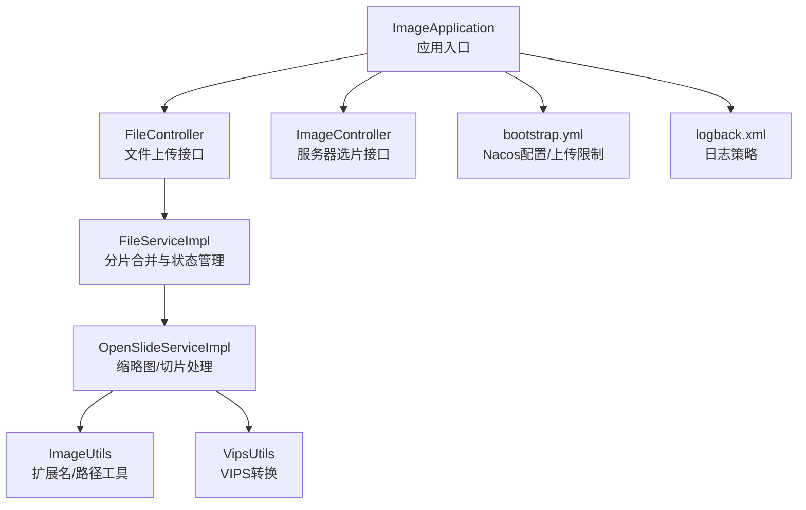
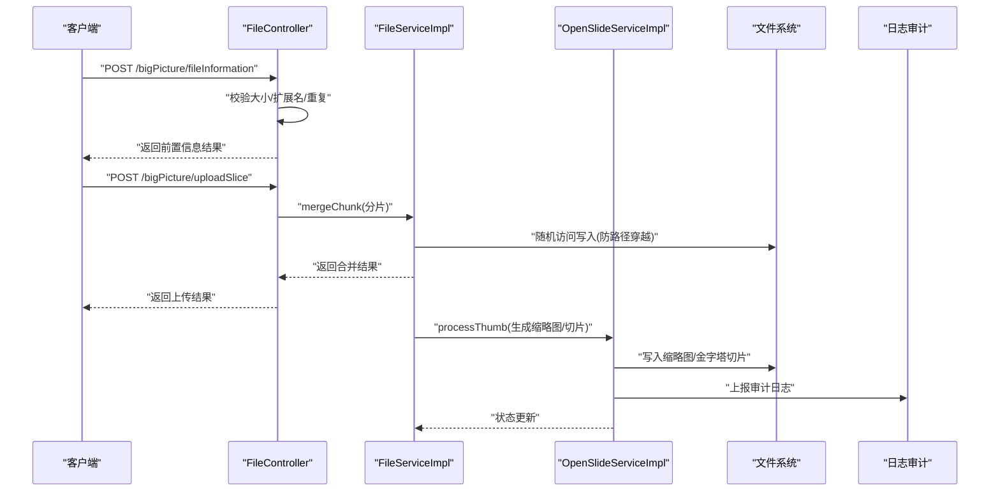
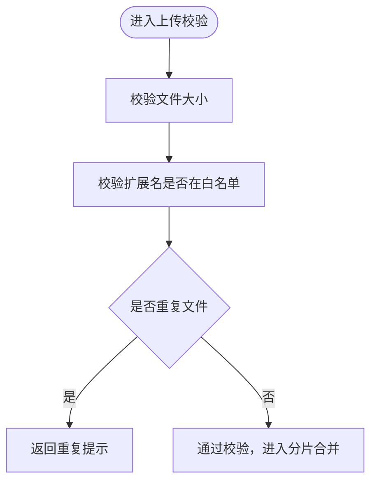
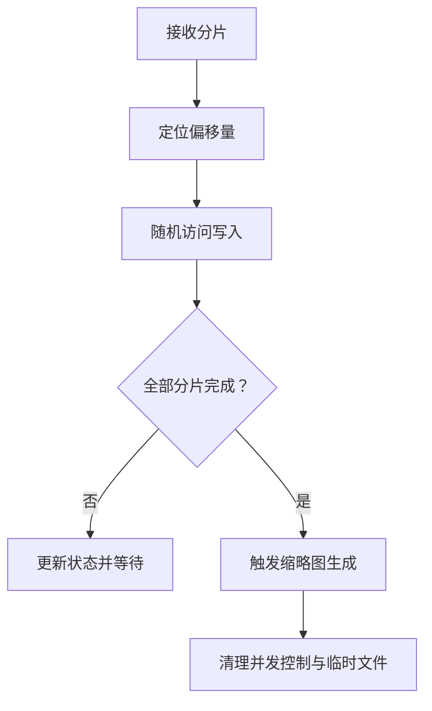
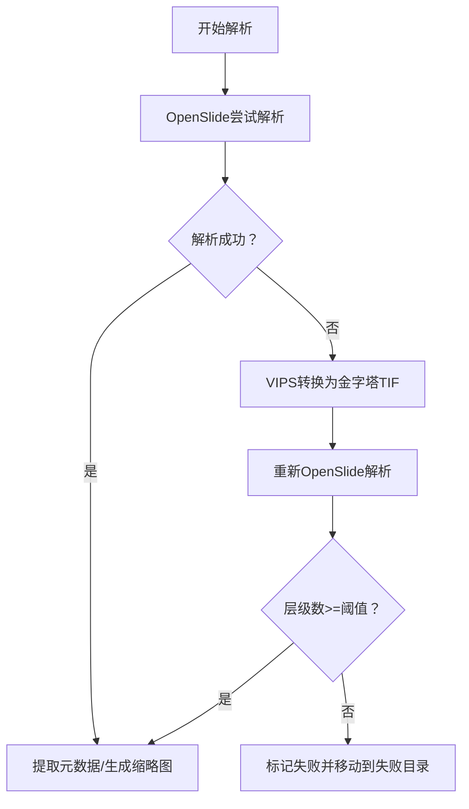
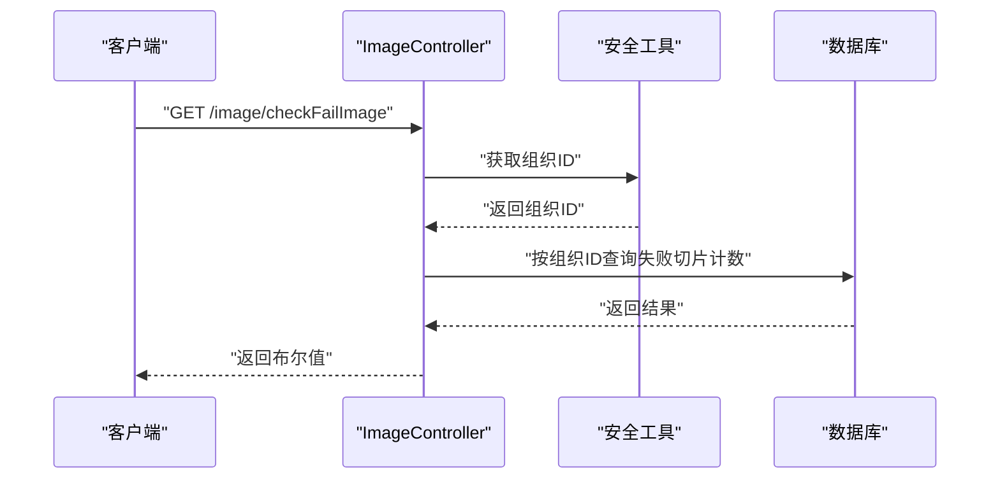
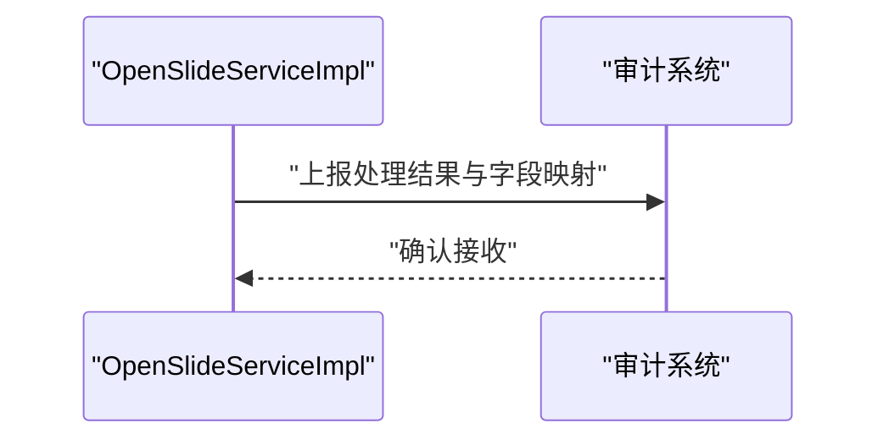
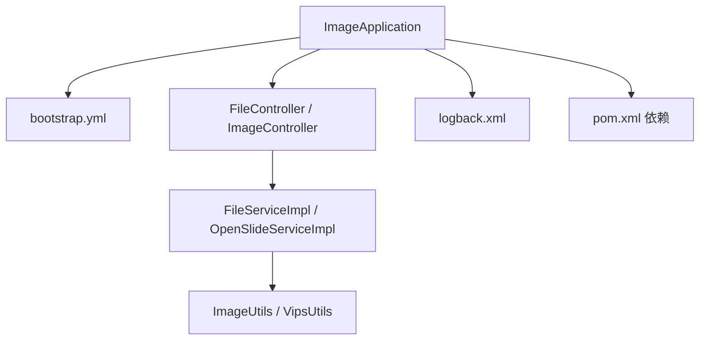

# 安全最佳实践

<cite>
**本文引用的文件**
- [ImageApplication.java](file://src/main/java/cn/staitech/ImageApplication.java)
- [bootstrap.yml](file://src/main/resources/bootstrap.yml)
- [FileController.java](file://src/main/java/cn/staitech/file/controller/FileController.java)
- [ImageController.java](file://src/main/java/cn/staitech/file/controller/ImageController.java)
- [FileServiceImpl.java](file://src/main/java/cn/staitech/file/service/impl/FileServiceImpl.java)
- [OpenSlideServiceImpl.java](file://src/main/java/cn/staitech/file/service/impl/OpenSlideServiceImpl.java)
- [ImageUtils.java](file://src/main/java/cn/staitech/file/util/ImageUtils.java)
- [VipsUtils.java](file://src/main/java/cn/staitech/file/util/VipsUtils.java)
- [ImageConstant.java](file://src/main/java/cn/staitech/file/constant/ImageConstant.java)
- [Image.java](file://src/main/java/cn/staitech/file/domain/Image.java)
- [logback.xml](file://src/main/resources/logback.xml)
- [pom.xml](file://pom.xml)
</cite>

## 目录
1. [简介](#简介)
2. [项目结构](#项目结构)
3. [核心组件](#核心组件)
4. [架构总览](#架构总览)
5. [详细组件分析](#详细组件分析)
6. [依赖分析](#依赖分析)
7. [性能考虑](#性能考虑)
8. [故障排查指南](#故障排查指南)
9. [结论](#结论)
10. [附录](#附录)

## 简介
本文件面向PACMVS项目“图像模块”（原始切片解析服务），围绕安全最佳实践进行系统化梳理，覆盖输入验证与数据清理、文件上传安全、路径遍历防护、恶意文件检测、权限控制、数据保护、配置安全、安全审计与事件响应等方面，帮助开发者建立从入口到落盘的全链路安全防线。

## 项目结构
该项目采用Spring Boot微服务架构，结合Nacos配置与发现、Sentinel限流熔断、OpenSlide/Python脚本进行图像解析与切片生成。核心模块包括：
- 应用入口与装配：应用启动类启用调度、WebSocket、自定义安全与Swagger等能力
- 控制层：文件上传、服务器选片等对外接口
- 服务层：分片合并、缩略图生成、切片任务提交、日志审计
- 工具与常量：文件扩展名校验、路径与组织ID格式化、VIPS转换
- 配置与日志：Nacos配置中心、多级别日志输出策略

图表来源
- [ImageApplication.java:37-52](file://src/main/java/cn/staitech/ImageApplication.java#L37-L52)
- [FileController.java:38-129](file://src/main/java/cn/staitech/file/controller/FileController.java#L38-L129)
- [ImageController.java:27-71](file://src/main/java/cn/staitech/file/controller/ImageController.java#L27-L71)
- [FileServiceImpl.java:53-146](file://src/main/java/cn/staitech/file/service/impl/FileServiceImpl.java#L53-L146)
- [OpenSlideServiceImpl.java:47-563](file://src/main/java/cn/staitech/file/service/impl/OpenSlideServiceImpl.java#L47-L563)
- [ImageUtils.java:20-148](file://src/main/java/cn/staitech/file/util/ImageUtils.java#L20-L148)
- [VipsUtils.java:11-37](file://src/main/java/cn/staitech/file/util/VipsUtils.java#L11-L37)
- [bootstrap.yml:1-37](file://src/main/resources/bootstrap.yml#L1-L37)
- [logback.xml:1-116](file://src/main/resources/logback.xml#L1-L116)

章节来源
- [ImageApplication.java:37-52](file://src/main/java/cn/staitech/ImageApplication.java#L37-L52)
- [bootstrap.yml:1-37](file://src/main/resources/bootstrap.yml#L1-L37)

## 核心组件
- 输入验证与清理
  - 扩展名白名单：仅允许特定格式（如SVS、NDPI、TIF、PNG、JPG等）
  - 文件大小上限：限制单文件最大尺寸
  - 重复文件检测：基于文件名去重
- 文件上传安全
  - 上传大小与请求体积限制
  - 分片写入采用随机访问定位，避免路径穿越
  - 并发控制与超时清理
- 路径遍历防护
  - 组织ID格式化与固定目录层级
  - 严格限定缩略图/切片输出根路径
- 恶意文件检测
  - OpenSlide解析校验，失败时自动转换为金字塔TIF
  - 层级数量阈值判定可用性
- 权限控制
  - 通过通用安全工具获取组织ID，过滤非本机构数据
  - 控制器层对查询/重解析接口进行组织维度过滤
- 数据保护
  - 传输：通过Nacos与服务间通信
  - 存储：本地文件系统，失败目录隔离
- 配置安全
  - 上传大小限制、Python脚本路径、可执行程序名由配置注入
  - Nacos共享配置按环境激活
- 安全审计
  - 图像处理全流程日志审计上报
  - 多级别日志滚动输出

章节来源
- [FileController.java:61-84](file://src/main/java/cn/staitech/file/controller/FileController.java#L61-L84)
- [ImageUtils.java:105-114](file://src/main/java/cn/staitech/file/util/ImageUtils.java#L105-L114)
- [ImageConstant.java:52](file://src/main/java/cn/staitech/file/constant/ImageConstant.java#L52)
- [FileServiceImpl.java:53-146](file://src/main/java/cn/staitech/file/service/impl/FileServiceImpl.java#L53-L146)
- [OpenSlideServiceImpl.java:149-202](file://src/main/java/cn/staitech/file/service/impl/OpenSlideServiceImpl.java#L149-L202)
- [ImageController.java:59-62](file://src/main/java/cn/staitech/file/controller/ImageController.java#L59-L62)
- [bootstrap.yml:6-10](file://src/main/resources/bootstrap.yml#L6-L10)
- [OpenSlideServiceImpl.java:487-535](file://src/main/java/cn/staitech/file/service/impl/OpenSlideServiceImpl.java#L487-L535)
- [logback.xml:105-116](file://src/main/resources/logback.xml#L105-L116)

## 架构总览
下图展示从客户端到文件系统的端到端流程，以及关键安全控制点：

图表来源
- [FileController.java:61-127](file://src/main/java/cn/staitech/file/controller/FileController.java#L61-L127)
- [FileServiceImpl.java:53-146](file://src/main/java/cn/staitech/file/service/impl/FileServiceImpl.java#L53-L146)
- [OpenSlideServiceImpl.java:277-339](file://src/main/java/cn/staitech/file/service/impl/OpenSlideServiceImpl.java#L277-L339)
- [OpenSlideServiceImpl.java:487-535](file://src/main/java/cn/staitech/file/service/impl/OpenSlideServiceImpl.java#L487-L535)

## 详细组件分析

### 输入验证与数据清理
- 扩展名白名单校验：仅允许预定义格式，拒绝未知或高风险扩展名
- 文件大小上限：前端/后端双重限制，防止超大文件占用资源
- 重复文件检测：基于文件名去重，减少冗余与潜在攻击面
- 路径与组织ID格式化：确保文件落盘路径稳定、可控

图表来源
- [FileController.java:61-84](file://src/main/java/cn/staitech/file/controller/FileController.java#L61-L84)
- [ImageUtils.java:105-114](file://src/main/java/cn/staitech/file/util/ImageUtils.java#L105-L114)
- [ImageConstant.java:52](file://src/main/java/cn/staitech/file/constant/ImageConstant.java#L52)

章节来源
- [FileController.java:61-84](file://src/main/java/cn/staitech/file/controller/FileController.java#L61-L84)
- [ImageUtils.java:105-114](file://src/main/java/cn/staitech/file/util/ImageUtils.java#L105-L114)
- [ImageConstant.java:52](file://src/main/java/cn/staitech/file/constant/ImageConstant.java#L52)

### 文件上传安全与路径遍历防护
- 分片写入采用随机访问定位，按分片序号与大小计算偏移，避免路径穿越
- 目录创建严格基于组织ID格式化路径，限定在本地文件系统根目录下
- 超时清理：对长时间未更新的上传任务自动失败并清理临时文件

图表来源
- [FileServiceImpl.java:104-146](file://src/main/java/cn/staitech/file/service/impl/FileServiceImpl.java#L104-L146)
- [OpenSlideServiceImpl.java:319-339](file://src/main/java/cn/staitech/file/service/impl/OpenSlideServiceImpl.java#L319-L339)

章节来源
- [FileServiceImpl.java:53-146](file://src/main/java/cn/staitech/file/service/impl/FileServiceImpl.java#L53-L146)
- [OpenSlideServiceImpl.java:319-339](file://src/main/java/cn/staitech/file/service/impl/OpenSlideServiceImpl.java#L319-L339)

### 恶意文件检测与图像解析
- OpenSlide解析：若无法解析，自动调用VIPS将非金字塔TIF转换为金字塔TIF，再进行解析
- 层级数量阈值：少于阈值则标记为解析失败，避免低质量/异常切片入库
- 失败目录隔离：解析失败文件移动到失败目录，避免污染正常数据

图表来源
- [OpenSlideServiceImpl.java:149-202](file://src/main/java/cn/staitech/file/service/impl/OpenSlideServiceImpl.java#L149-L202)
- [VipsUtils.java:22-35](file://src/main/java/cn/staitech/file/util/VipsUtils.java#L22-L35)
- [OpenSlideServiceImpl.java:399-454](file://src/main/java/cn/staitech/file/service/impl/OpenSlideServiceImpl.java#L399-L454)

章节来源
- [OpenSlideServiceImpl.java:149-202](file://src/main/java/cn/staitech/file/service/impl/OpenSlideServiceImpl.java#L149-L202)
- [VipsUtils.java:22-35](file://src/main/java/cn/staitech/file/util/VipsUtils.java#L22-L35)
- [OpenSlideServiceImpl.java:399-454](file://src/main/java/cn/staitech/file/service/impl/OpenSlideServiceImpl.java#L399-L454)

### 权限控制与API访问控制
- 组织维度过滤：通过安全工具获取组织ID，在查询接口中强制按组织过滤
- API访问控制：结合通用安全注解启用自定义配置与客户端，配合网关/鉴权组件统一管控
- 上传接口鉴权：建议在网关层或全局拦截器中加入登录态与角色校验

图表来源
- [ImageController.java:59-62](file://src/main/java/cn/staitech/file/controller/ImageController.java#L59-L62)

章节来源
- [ImageController.java:59-62](file://src/main/java/cn/staitech/file/controller/ImageController.java#L59-L62)
- [ImageApplication.java:29-36](file://src/main/java/cn/staitech/ImageApplication.java#L29-L36)

### 数据保护与传输安全
- 传输安全：通过Nacos与服务间通信，建议在生产环境启用TLS与双向认证
- 存储安全：本地文件系统落盘，建议对存储卷进行最小权限授权与定期扫描
- 敏感字段：日志中避免输出完整路径与敏感元数据，必要时脱敏

章节来源
- [bootstrap.yml:18-34](file://src/main/resources/bootstrap.yml#L18-L34)
- [logback.xml:105-116](file://src/main/resources/logback.xml#L105-L116)

### 配置安全管理
- 上传限制：通过配置文件限制单文件与请求体积
- 脚本路径与可执行程序：通过配置项注入，避免硬编码
- 环境变量：通过Maven属性与Nacos共享配置按环境激活

章节来源
- [bootstrap.yml:6-10](file://src/main/resources/bootstrap.yml#L6-L10)
- [OpenSlideServiceImpl.java:53-58](file://src/main/java/cn/staitech/file/service/impl/OpenSlideServiceImpl.java#L53-L58)
- [bootstrap.yml:14-16](file://src/main/resources/bootstrap.yml#L14-L16)

### 安全审计与事件响应
- 审计日志：图像处理全流程记录到审计系统，包含模块、页面、字段映射等
- 日志策略：INFO/WARN/ERROR/DEBUG分级输出，便于问题定位与合规留存
- 事件响应：失败目录隔离与状态回滚，异常时及时告警与人工介入

图表来源
- [OpenSlideServiceImpl.java:487-535](file://src/main/java/cn/staitech/file/service/impl/OpenSlideServiceImpl.java#L487-L535)

章节来源
- [OpenSlideServiceImpl.java:487-535](file://src/main/java/cn/staitech/file/service/impl/OpenSlideServiceImpl.java#L487-L535)
- [logback.xml:105-116](file://src/main/resources/logback.xml#L105-L116)

## 依赖分析
- 外部依赖
  - Nacos：配置中心与服务发现
  - Sentinel：流量治理与熔断降级
  - OpenSlide/Python：图像解析与切片生成
  - MinIO/FastDFS：对象存储（根据项目需求选择）
- 内部模块
  - 控制层与服务层解耦，工具类集中于util包，常量集中于constant包
  - 日志与监控通过Logback与Actuator集成

图表来源
- [ImageApplication.java:37-52](file://src/main/java/cn/staitech/ImageApplication.java#L37-L52)
- [bootstrap.yml:1-37](file://src/main/resources/bootstrap.yml#L1-L37)
- [logback.xml:1-116](file://src/main/resources/logback.xml#L1-L116)
- [pom.xml:23-200](file://pom.xml#L23-L200)

章节来源
- [pom.xml:23-200](file://pom.xml#L23-L200)

## 性能考虑
- 并发与状态管理：使用原子引用数组跟踪分片完成状态，降低锁粒度
- 异步处理：缩略图与切片生成通过线程池异步执行，提升吞吐
- I/O优化：分片写入采用随机访问，避免顺序写导致的磁盘碎片与寻道开销
- 资源回收：OpenSlide对象在finally中释放，防止内存泄漏

章节来源
- [FileServiceImpl.java:33-146](file://src/main/java/cn/staitech/file/service/impl/FileServiceImpl.java#L33-L146)
- [OpenSlideServiceImpl.java:149-202](file://src/main/java/cn/staitech/file/service/impl/OpenSlideServiceImpl.java#L149-L202)

## 故障排查指南
- 上传失败
  - 检查文件大小与扩展名是否符合要求
  - 查看分片合并日志与并发控制状态
  - 确认目标目录可写与磁盘空间充足
- 解析失败
  - 观察OpenSlide解析日志与VIPS转换日志
  - 检查失败目录隔离是否生效
- 审计未上报
  - 核对审计接口URL与网络连通性
  - 检查日志级别与过滤器配置

章节来源
- [FileController.java:61-84](file://src/main/java/cn/staitech/file/controller/FileController.java#L61-L84)
- [FileServiceImpl.java:148-177](file://src/main/java/cn/staitech/file/service/impl/FileServiceImpl.java#L148-L177)
- [OpenSlideServiceImpl.java:399-454](file://src/main/java/cn/staitech/file/service/impl/OpenSlideServiceImpl.java#L399-L454)
- [OpenSlideServiceImpl.java:487-535](file://src/main/java/cn/staitech/file/service/impl/OpenSlideServiceImpl.java#L487-L535)
- [logback.xml:105-116](file://src/main/resources/logback.xml#L105-L116)

## 结论
本项目在输入校验、文件上传、路径遍历防护、恶意文件检测、权限控制、数据保护与审计方面形成了较为完善的闭环。建议在生产环境中进一步强化传输加密、密钥与配置文件保护、访问控制策略与应急响应预案，持续提升整体安全性与合规性。

## 附录
- 最佳实践清单
  - 上传限制：严格限制文件大小与扩展名，开启重复检测
  - 路径安全：组织ID格式化、固定根目录、禁止相对路径
  - 解析健壮性：OpenSlide失败自动转换，层级阈值判定
  - 权限边界：按组织ID过滤数据，接口层统一鉴权
  - 配置安全：敏感参数通过配置中心注入，避免硬编码
  - 审计与日志：分级输出、字段脱敏、异常告警
  - 监控与告警：结合Actuator与Prometheus/Sentinel进行实时观测