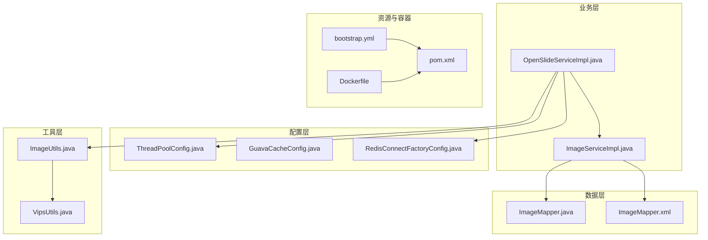
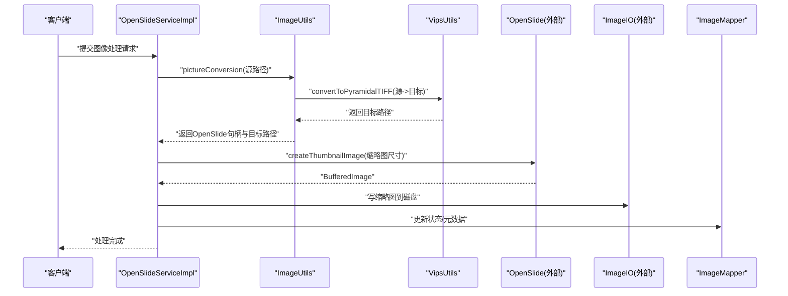
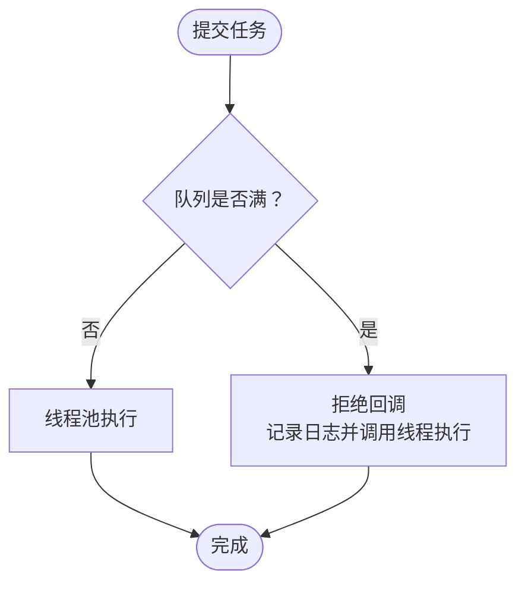
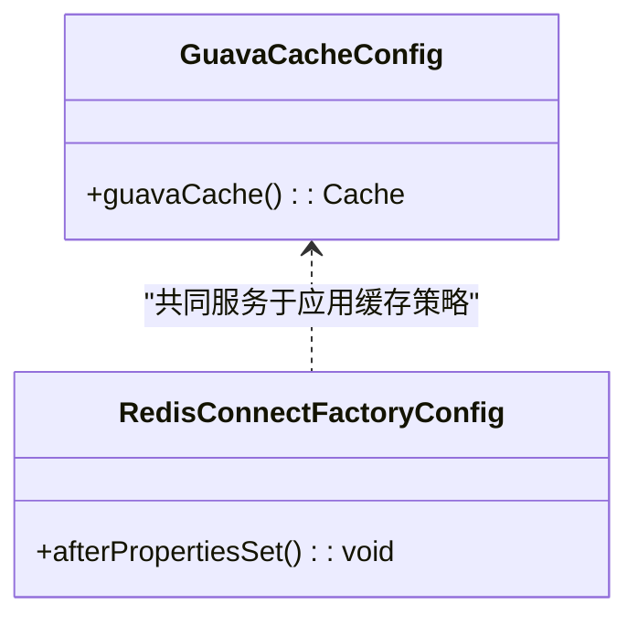
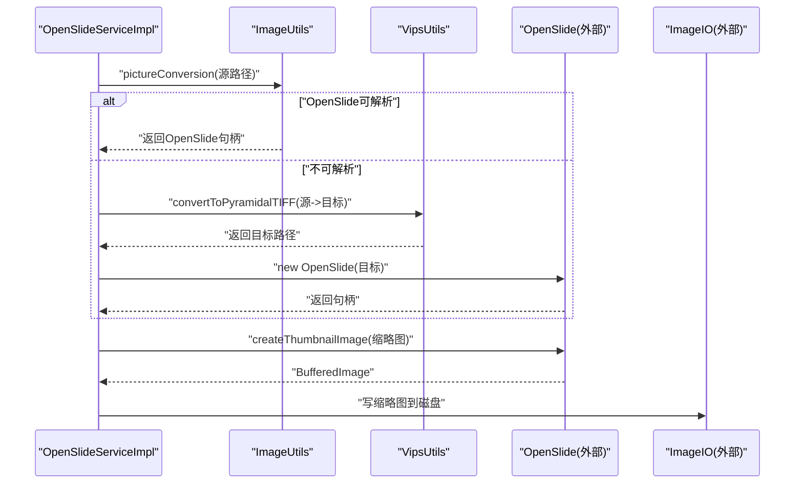
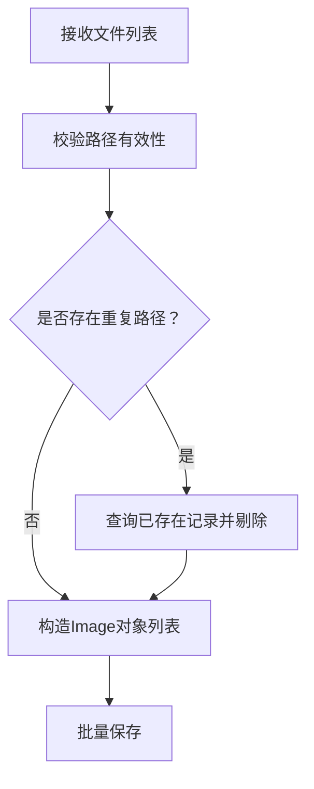
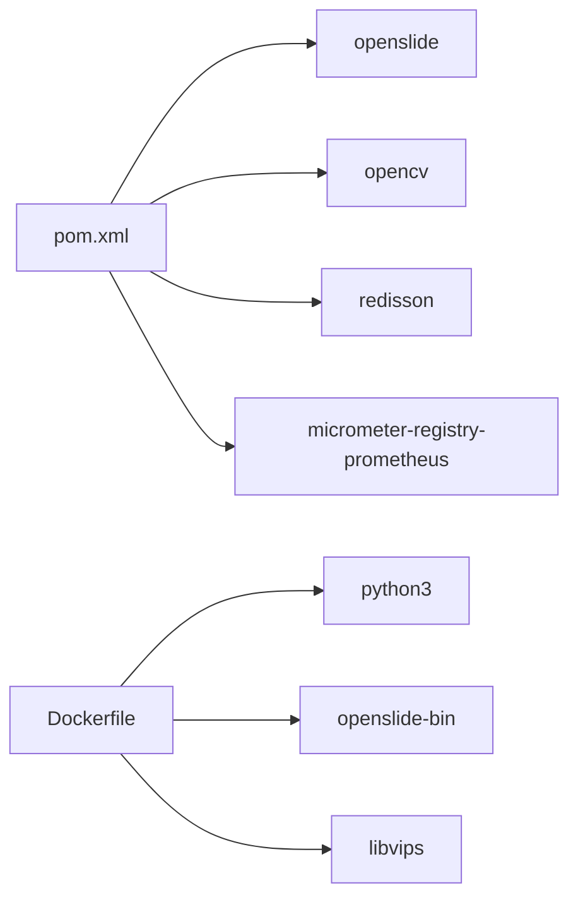

# 性能优化

<cite>
**本文引用的文件**
- [GuavaCacheConfig.java](file://src/main/java/cn/staitech/file/config/GuavaCacheConfig.java)
- [ThreadPoolConfig.java](file://src/main/java/cn/staitech/file/config/ThreadPoolConfig.java)
- [RedisConnectFactoryConfig.java](file://src/main/java/cn/staitech/file/config/RedisConnectFactoryConfig.java)
- [VipsUtils.java](file://src/main/java/cn/staitech/file/util/VipsUtils.java)
- [ImageUtils.java](file://src/main/java/cn/staitech/file/util/ImageUtils.java)
- [ImageServiceImpl.java](file://src/main/java/cn/staitech/file/service/impl/ImageServiceImpl.java)
- [OpenSlideServiceImpl.java](file://src/main/java/cn/staitech/file/service/impl/OpenSlideServiceImpl.java)
- [ImageConstant.java](file://src/main/java/cn/staitech/file/constant/ImageConstant.java)
- [ImageMapper.java](file://src/main/java/cn/staitech/file/mapper/ImageMapper.java)
- [ImageMapper.xml](file://src/main/resources/mapper/ImageMapper.xml)
- [bootstrap.yml](file://src/main/resources/bootstrap.yml)
- [Dockerfile](file://docker/staitech/modules/image/Dockerfile)
- [pom.xml](file://pom.xml)
</cite>

## 目录
1. [简介](#简介)
2. [项目结构](#项目结构)
3. [核心组件](#核心组件)
4. [架构总览](#架构总览)
5. [详细组件分析](#详细组件分析)
6. [依赖分析](#依赖分析)
7. [性能考虑](#性能考虑)
8. [故障排查指南](#故障排查指南)
9. [结论](#结论)
10. [附录](#附录)

## 简介
本文件面向PACMVS图像处理子系统的性能优化，聚焦以下方面：
- 图像处理性能优化：libvips高效使用、OpenSlide与OpenCV的协同、I/O与内存管理
- 缓存策略优化：Guava Cache参数调优、Redis连接与可用性保障
- 线程池配置优化：ThreadPoolTaskExecutor参数调整、异步任务调度与并发控制
- 数据库查询优化：索引与批量操作、连接池配置
- 性能监控指标、瓶颈识别与测试策略
- 面向开发者的可操作实践建议

## 项目结构
项目采用Spring Boot工程，模块化组织如下：
- 配置层：线程池、缓存、Redis连接工厂等
- 工具层：图像工具、libvips封装
- 业务层：图像解析、OpenSlide处理、切片生成
- 数据层：MyBatis Mapper与XML映射
- 资源与容器：Nacos配置、Prometheus监控、Docker镜像构建

图表来源
- [ThreadPoolConfig.java:13-64](file://src/main/java/cn/staitech/file/config/ThreadPoolConfig.java#L13-L64)
- [GuavaCacheConfig.java:17-26](file://src/main/java/cn/staitech/file/config/GuavaCacheConfig.java#L17-L26)
- [RedisConnectFactoryConfig.java:11-24](file://src/main/java/cn/staitech/file/config/RedisConnectFactoryConfig.java#L11-L24)
- [VipsUtils.java:11-36](file://src/main/java/cn/staitech/file/util/VipsUtils.java#L11-L36)
- [ImageUtils.java:19-148](file://src/main/java/cn/staitech/file/util/ImageUtils.java#L19-L148)
- [ImageServiceImpl.java:40-547](file://src/main/java/cn/staitech/file/service/impl/ImageServiceImpl.java#L40-L547)
- [OpenSlideServiceImpl.java:45-562](file://src/main/java/cn/staitech/file/service/impl/OpenSlideServiceImpl.java#L45-L562)
- [ImageMapper.java:13-16](file://src/main/java/cn/staitech/file/mapper/ImageMapper.java#L13-L16)
- [ImageMapper.xml:4-64](file://src/main/resources/mapper/ImageMapper.xml#L4-L64)
- [bootstrap.yml:1-37](file://src/main/resources/bootstrap.yml#L1-L37)
- [Dockerfile:1-46](file://docker/staitech/modules/image/Dockerfile#L1-L46)
- [pom.xml:23-205](file://pom.xml#L23-L205)

章节来源
- [ThreadPoolConfig.java:13-64](file://src/main/java/cn/staitech/file/config/ThreadPoolConfig.java#L13-L64)
- [GuavaCacheConfig.java:17-26](file://src/main/java/cn/staitech/file/config/GuavaCacheConfig.java#L17-L26)
- [RedisConnectFactoryConfig.java:11-24](file://src/main/java/cn/staitech/file/config/RedisConnectFactoryConfig.java#L11-L24)
- [VipsUtils.java:11-36](file://src/main/java/cn/staitech/file/util/VipsUtils.java#L11-L36)
- [ImageUtils.java:19-148](file://src/main/java/cn/staitech/file/util/ImageUtils.java#L19-L148)
- [ImageServiceImpl.java:40-547](file://src/main/java/cn/staitech/file/service/impl/ImageServiceImpl.java#L40-L547)
- [OpenSlideServiceImpl.java:45-562](file://src/main/java/cn/staitech/file/service/impl/OpenSlideServiceImpl.java#L45-L562)
- [ImageMapper.java:13-16](file://src/main/java/cn/staitech/file/mapper/ImageMapper.java#L13-L16)
- [ImageMapper.xml:4-64](file://src/main/resources/mapper/ImageMapper.xml#L4-L64)
- [bootstrap.yml:1-37](file://src/main/resources/bootstrap.yml#L1-L37)
- [Dockerfile:1-46](file://docker/staitech/modules/image/Dockerfile#L1-L46)
- [pom.xml:23-205](file://pom.xml#L23-L205)

## 核心组件
- 线程池配置：OpenSlide与Python脚本分别使用独立线程池，阻塞队列容量大，拒绝策略记录日志并回退至调用线程执行，避免丢任务
- 缓存配置：Guava Cache默认1小时过期、最大条目100，适合轻量元数据缓存
- Redis连接：Lettuce连接工厂启用连接校验，提升稳定性
- 图像处理：libvips通过外部命令调用生成金字塔TIF；OpenSlide读取多级切片元数据；ImageIO写缩略图
- 数据访问：MyBatis Plus批量保存、条件查询；XML映射字段完整

章节来源
- [ThreadPoolConfig.java:18-39](file://src/main/java/cn/staitech/file/config/ThreadPoolConfig.java#L18-L39)
- [ThreadPoolConfig.java:44-63](file://src/main/java/cn/staitech/file/config/ThreadPoolConfig.java#L44-L63)
- [GuavaCacheConfig.java:19-25](file://src/main/java/cn/staitech/file/config/GuavaCacheConfig.java#L19-L25)
- [RedisConnectFactoryConfig.java:18-24](file://src/main/java/cn/staitech/file/config/RedisConnectFactoryConfig.java#L18-L24)
- [VipsUtils.java:22-35](file://src/main/java/cn/staitech/file/util/VipsUtils.java#L22-L35)
- [OpenSlideServiceImpl.java:242-256](file://src/main/java/cn/staitech/file/service/impl/OpenSlideServiceImpl.java#L242-L256)
- [ImageMapper.xml:4-64](file://src/main/resources/mapper/ImageMapper.xml#L4-L64)

## 架构总览
整体处理链路：HTTP入口 -> 业务服务 -> OpenSlide解析 -> libvips转换 -> Python切片脚本 -> 结果入库与状态更新。

图表来源
- [OpenSlideServiceImpl.java:149-202](file://src/main/java/cn/staitech/file/service/impl/OpenSlideServiceImpl.java#L149-L202)
- [OpenSlideServiceImpl.java:242-256](file://src/main/java/cn/staitech/file/service/impl/OpenSlideServiceImpl.java#L242-L256)
- [ImageUtils.java:52-97](file://src/main/java/cn/staitech/file/util/ImageUtils.java#L52-L97)
- [VipsUtils.java:22-35](file://src/main/java/cn/staitech/file/util/VipsUtils.java#L22-L35)
- [ImageMapper.java:13-16](file://src/main/java/cn/staitech/file/mapper/ImageMapper.java#L13-L16)

## 详细组件分析

### 线程池配置与并发控制
- OpenSlide线程池：核心线程=CPU核数+1，最大=2×CPU核数，空闲回收30秒，队列10万，命名线程工厂，拒绝时由调用线程执行，保证不丢任务
- Python脚本线程池：核心/最大按CPU核数/16计算，确保最小1与最小2，队列同样10万，拒绝策略同上
- 并发建议：根据CPU密集型与I/O混合比例，适当降低Python线程池规模；对磁盘I/O敏感场景，限制同时写盘任务数

图表来源
- [ThreadPoolConfig.java:18-39](file://src/main/java/cn/staitech/file/config/ThreadPoolConfig.java#L18-L39)
- [ThreadPoolConfig.java:44-63](file://src/main/java/cn/staitech/file/config/ThreadPoolConfig.java#L44-L63)

章节来源
- [ThreadPoolConfig.java:18-39](file://src/main/java/cn/staitech/file/config/ThreadPoolConfig.java#L18-L39)
- [ThreadPoolConfig.java:44-63](file://src/main/java/cn/staitech/file/config/ThreadPoolConfig.java#L44-L63)

### 缓存策略与Redis连接
- Guava缓存：最大条目100、写入后1小时过期，适合轻量元数据缓存
- Redis连接：Lettuce启用连接校验，提升连接可用性
- 命中率优化建议：结合业务热点（如专题/组织信息）引入本地+远程双层缓存；对热点键设置更短TTL但配合预热；定期清理冷数据

图表来源
- [GuavaCacheConfig.java:17-26](file://src/main/java/cn/staitech/file/config/GuavaCacheConfig.java#L17-L26)
- [RedisConnectFactoryConfig.java:11-24](file://src/main/java/cn/staitech/file/config/RedisConnectFactoryConfig.java#L11-L24)

章节来源
- [GuavaCacheConfig.java:17-26](file://src/main/java/cn/staitech/file/config/GuavaCacheConfig.java#L17-L26)
- [RedisConnectFactoryConfig.java:11-24](file://src/main/java/cn/staitech/file/config/RedisConnectFactoryConfig.java#L11-L24)

### libvips与OpenSlide/OpenCV协同
- libvips：通过外部命令生成金字塔TIF，压缩与瓦片参数固定
- OpenSlide：读取多级切片元数据，生成缩略图；对异常切片进行二次转换再解析
- OpenCV：依赖声明位于pom，当前代码未直接使用

图表来源
- [ImageUtils.java:52-97](file://src/main/java/cn/staitech/file/util/ImageUtils.java#L52-L97)
- [VipsUtils.java:22-35](file://src/main/java/cn/staitech/file/util/VipsUtils.java#L22-L35)
- [OpenSlideServiceImpl.java:149-202](file://src/main/java/cn/staitech/file/service/impl/OpenSlideServiceImpl.java#L149-L202)
- [OpenSlideServiceImpl.java:242-256](file://src/main/java/cn/staitech/file/service/impl/OpenSlideServiceImpl.java#L242-L256)

章节来源
- [ImageUtils.java:52-97](file://src/main/java/cn/staitech/file/util/ImageUtils.java#L52-L97)
- [VipsUtils.java:22-35](file://src/main/java/cn/staitech/file/util/VipsUtils.java#L22-L35)
- [OpenSlideServiceImpl.java:149-202](file://src/main/java/cn/staitech/file/service/impl/OpenSlideServiceImpl.java#L149-L202)
- [OpenSlideServiceImpl.java:242-256](file://src/main/java/cn/staitech/file/service/impl/OpenSlideServiceImpl.java#L242-L256)

### 数据库查询与批量操作
- MyBatis Plus：批量保存、条件查询；对重复路径进行去重后再入库
- XML映射：字段齐全，便于后续索引优化与统计查询
- 建议：对高频查询字段建立合适索引；批量入库使用批处理接口；避免N+1查询

图表来源
- [ImageServiceImpl.java:65-140](file://src/main/java/cn/staitech/file/service/impl/ImageServiceImpl.java#L65-L140)
- [ImageMapper.xml:4-64](file://src/main/resources/mapper/ImageMapper.xml#L4-L64)

章节来源
- [ImageServiceImpl.java:65-140](file://src/main/java/cn/staitech/file/service/impl/ImageServiceImpl.java#L65-L140)
- [ImageMapper.xml:4-64](file://src/main/resources/mapper/ImageMapper.xml#L4-L64)

### 容器与运行环境
- Dockerfile安装Python3、pip、openslide-bin，拷贝libvips与JNI库，暴露端口9083
- bootstrap.yml配置Tomcat端口、文件上传大小、Nacos注册与配置中心

章节来源
- [Dockerfile:1-46](file://docker/staitech/modules/image/Dockerfile#L1-L46)
- [bootstrap.yml:1-37](file://src/main/resources/bootstrap.yml#L1-L37)

## 依赖分析
- 外部库：OpenSlide、OpenCV、libvips、Redisson、Prometheus Micrometer
- 运行时：JDK 8、Python3、openslide-bin

图表来源
- [pom.xml:164-194](file://pom.xml#L164-L194)
- [Dockerfile:6-36](file://docker/staitech/modules/image/Dockerfile#L6-L36)

章节来源
- [pom.xml:164-194](file://pom.xml#L164-L194)
- [Dockerfile:6-36](file://docker/staitech/modules/image/Dockerfile#L6-L36)

## 性能考虑
- libvips使用
  - 固定压缩与瓦片尺寸，建议根据图像分辨率动态选择瓦片大小与压缩级别
  - 避免频繁进程启动，优先复用转换结果或缓存中间产物
- OpenSlide与I/O
  - 缩略图生成后立即写盘，注意磁盘吞吐；可考虑异步写盘与限速
  - 对异常切片二次转换会增加开销，建议提前校验格式与大小
- 线程池
  - CPU密集型与I/O混合需平衡线程数；对Python脚本线程池建议按CPU核数/16保守配置
  - 队列过大可能放大GC压力，建议结合任务耗时与内存占用评估
- 缓存
  - Guava缓存容量小，建议结合业务热点引入Redis或Caffeine
  - Lettuce启用连接校验，建议配合健康检查与超时重试
- 数据库
  - 批量入库与去重查询可进一步优化；对高频字段建立索引
  - 控制单事务大小，避免长时间锁表
- 监控
  - Prometheus Micrometer已引入，建议补充自定义指标（任务耗时、队列长度、缓存命中率）

[本节为通用指导，无需列出章节来源]

## 故障排查指南
- OpenSlide解析失败
  - 现象：levelCount过低或宽高为空
  - 处理：触发二次转换为金字塔TIF；必要时移动到失败目录
- Python脚本执行失败
  - 现象：退出码非0
  - 处理：记录错误日志并更新状态为“切片处理失败”
- 线程池拒绝任务
  - 现象：日志记录拒绝事件
  - 处理：调用线程回退执行；评估线程池参数与队列容量
- Redis连接问题
  - 现象：连接不可用
  - 处理：启用连接校验；检查网络与超时配置

章节来源
- [OpenSlideServiceImpl.java:188-200](file://src/main/java/cn/staitech/file/service/impl/OpenSlideServiceImpl.java#L188-L200)
- [OpenSlideServiceImpl.java:329-338](file://src/main/java/cn/staitech/file/service/impl/OpenSlideServiceImpl.java#L329-L338)
- [ThreadPoolConfig.java:28-37](file://src/main/java/cn/staitech/file/config/ThreadPoolConfig.java#L28-L37)
- [ThreadPoolConfig.java:54-62](file://src/main/java/cn/staitech/file/config/ThreadPoolConfig.java#L54-L62)
- [RedisConnectFactoryConfig.java:18-24](file://src/main/java/cn/staitech/file/config/RedisConnectFactoryConfig.java#L18-L24)

## 结论
本项目在图像处理链路上已具备良好的并发与容错能力：独立线程池隔离I/O与CPU密集任务、Guava缓存与Lettuce连接校验保障稳定性、libvips与OpenSlide组合满足多格式切片解析需求。建议围绕缓存命中率、线程池参数、数据库索引与批量策略、以及监控指标体系进一步优化，以获得更稳健的吞吐与更低的延迟。

[本节为总结，无需列出章节来源]

## 附录
- 常量与状态码参考：图像状态、来源、解析状态、目录常量
- 配置参考：Nacos注册与配置中心、Tomcat端口与文件上传大小

章节来源
- [ImageConstant.java:9-67](file://src/main/java/cn/staitech/file/constant/ImageConstant.java#L9-L67)
- [bootstrap.yml:1-37](file://src/main/resources/bootstrap.yml#L1-L37)