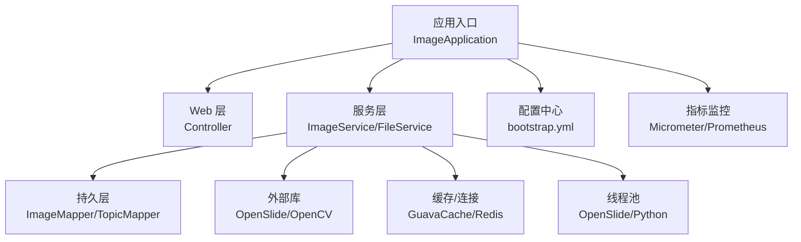
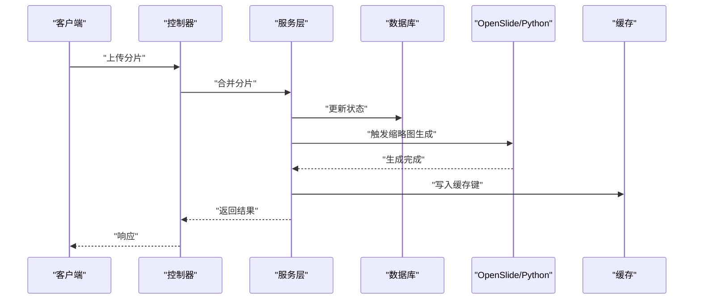
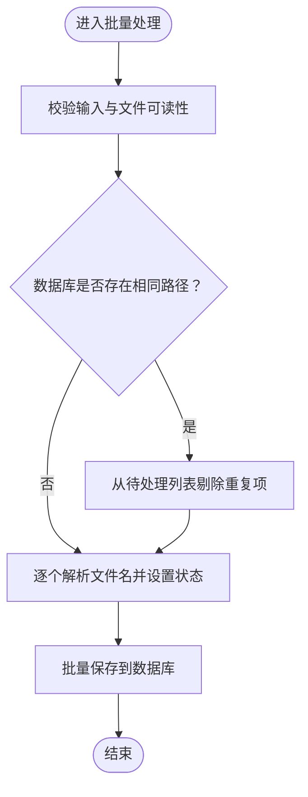
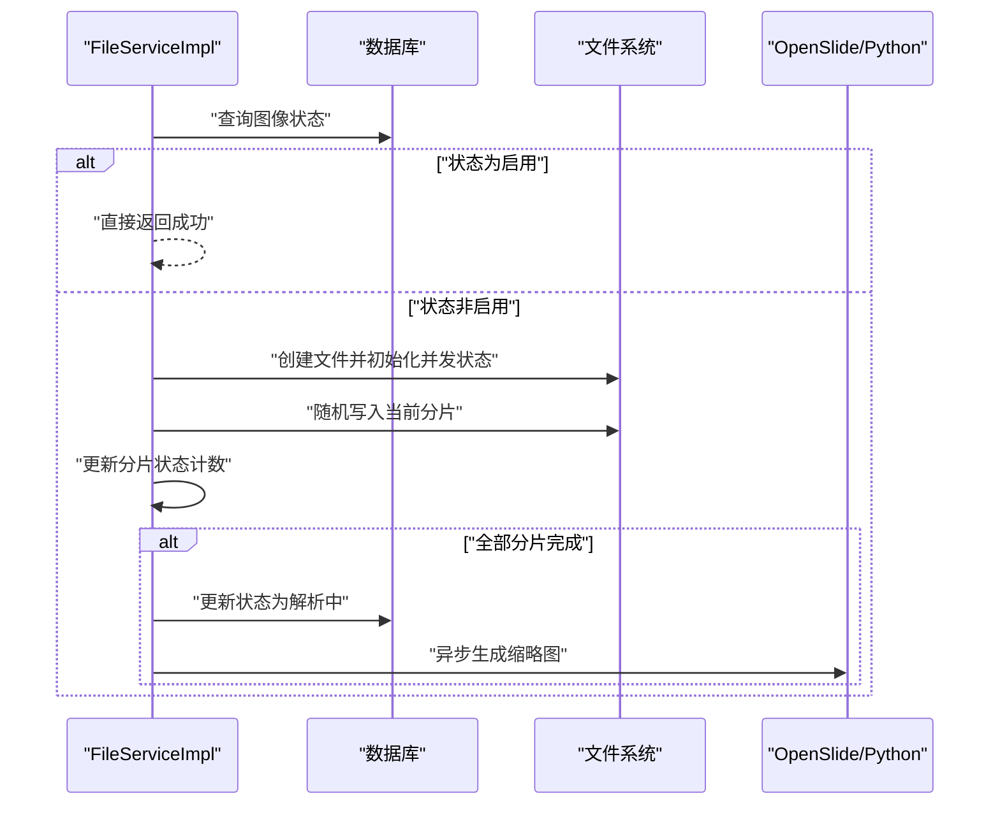
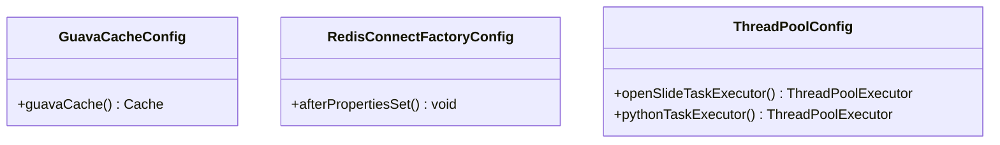
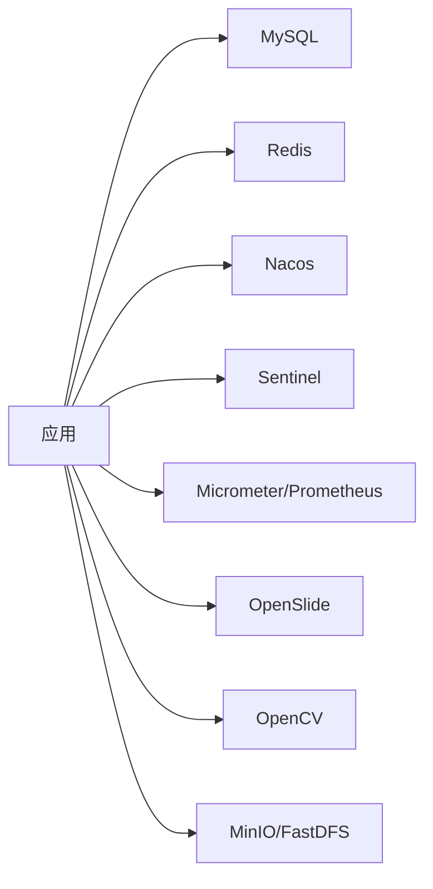

# 最佳实践

<cite>
**本文引用的文件**
- [ImageApplication.java](file://src/main/java/cn/staitech/ImageApplication.java)
- [bootstrap.yml](file://src/main/resources/bootstrap.yml)
- [pom.xml](file://pom.xml)
- [GuavaCacheConfig.java](file://src/main/java/cn/staitech/file/config/GuavaCacheConfig.java)
- [RedisConnectFactoryConfig.java](file://src/main/java/cn/staitech/file/config/RedisConnectFactoryConfig.java)
- [ThreadPoolConfig.java](file://src/main/java/cn/staitech/file/config/ThreadPoolConfig.java)
- [ImageServiceImpl.java](file://src/main/java/cn/staitech/file/service/impl/ImageServiceImpl.java)
- [FileServiceImpl.java](file://src/main/java/cn/staitech/file/service/impl/FileServiceImpl.java)
- [.gitlab-ci.yml](file://.gitlab-ci.yml)
- [README.md](file://README.md)
- [CONTRIBUTING.md](file://CONTRIBUTING.md)
</cite>

## 目录
1. [简介](#简介)
2. [项目结构](#项目结构)
3. [核心组件](#核心组件)
4. [架构总览](#架构总览)
5. [详细组件分析](#详细组件分析)
6. [依赖分析](#依赖分析)
7. [性能考虑](#性能考虑)
8. [故障排查指南](#故障排查指南)
9. [结论](#结论)
10. [附录](#附录)

## 简介
本最佳实践文档面向开发者与架构师，围绕 PACMVS 图像处理模块（Java）在性能优化、安全最佳实践与代码质量保障方面提供系统化指导。重点覆盖以下方向：
- 性能优化：图像处理流水线、缓存策略、线程池与异步任务、数据库与IO优化
- 安全最佳实践：输入验证、权限控制、数据保护与合规
- 代码质量：重构建议、测试策略、持续改进方法
- 运维与可观测性：指标采集、日志审计、CI/CD 流水线

## 项目结构
该项目基于 Spring Boot，采用模块化分层设计，包含应用入口、配置、控制器、服务、持久层、工具与资源文件。核心模块如下：
- 应用入口与配置：应用启动类、Spring Cloud/Nacos 配置、Actuator/Micrometer 指标
- 文件与图像处理：文件分片合并、图像元数据解析、缩略图生成调度
- 缓存与连接：Guava 本地缓存、Redis 连接工厂校验
- 线程池与异步：OpenSlide 与 Python 脚本处理线程池
- 数据访问：MyBatis Plus Mapper/XML、MySQL 连接
- 外部依赖：OpenSlide、OpenCV、MinIO/FastDFS、Sentinel、Prometheus

图表来源
- [ImageApplication.java:37-52](file://src/main/java/cn/staitech/ImageApplication.java#L37-L52)
- [bootstrap.yml:1-37](file://src/main/resources/bootstrap.yml#L1-L37)

章节来源
- [ImageApplication.java:27-52](file://src/main/java/cn/staitech/ImageApplication.java#L27-L52)
- [bootstrap.yml:1-37](file://src/main/resources/bootstrap.yml#L1-L37)
- [pom.xml:23-205](file://pom.xml#L23-L205)

## 核心组件
- 应用启动与装配：启用调度、WebSocket、自定义安全与Swagger、Nacos注册与配置、事务管理、Elasticsearch仓库扫描、Micrometer指标标签
- 配置中心与环境：通过 bootstrap.yml 指定端口、Nacos 地址、共享配置、文件上传大小限制
- 服务编排：ImageServiceImpl 负责批量文件入库、文件名解析、路径生成与状态流转；FileServiceImpl 负责分片合并、并发控制、超时清理与缩略图触发
- 缓存与连接：GuavaCacheConfig 提供本地缓存；RedisConnectFactoryConfig 对 Lettuce 连接进行校验；ThreadPoolConfig 提供两类线程池
- 外部能力：OpenSlide 与 OpenCV 通过系统依赖引入，配合 Python 脚本生成切片

章节来源
- [ImageApplication.java:27-52](file://src/main/java/cn/staitech/ImageApplication.java#L27-L52)
- [bootstrap.yml:1-37](file://src/main/resources/bootstrap.yml#L1-L37)
- [ImageServiceImpl.java:63-140](file://src/main/java/cn/staitech/file/service/impl/ImageServiceImpl.java#L63-L140)
- [FileServiceImpl.java:53-146](file://src/main/java/cn/staitech/file/service/impl/FileServiceImpl.java#L53-L146)
- [GuavaCacheConfig.java:19-25](file://src/main/java/cn/staitech/file/config/GuavaCacheConfig.java#L19-L25)
- [RedisConnectFactoryConfig.java:18-24](file://src/main/java/cn/staitech/file/config/RedisConnectFactoryConfig.java#L18-L24)
- [ThreadPoolConfig.java:18-64](file://src/main/java/cn/staitech/file/config/ThreadPoolConfig.java#L18-L64)

## 架构总览
系统采用微服务风格，结合本地缓存与远程缓存、线程池异步处理、定时任务与事件驱动，形成“上传-解析-切片-缩略图-可用”的闭环。

图表来源
- [FileServiceImpl.java:134-144](file://src/main/java/cn/staitech/file/service/impl/FileServiceImpl.java#L134-L144)
- [ImageServiceImpl.java:128-134](file://src/main/java/cn/staitech/file/service/impl/ImageServiceImpl.java#L128-L134)

## 详细组件分析

### 图像服务组件（ImageServiceImpl）
职责与流程
- 批量文件入库：校验输入、去重检查、状态设置、元数据解析、路径生成与保存
- 文件信息上传：校验文件名、解析切片编号、构造目录、入库并返回结果
- 元数据解析：支持两种命名规范，兼容解析失败回退；联动专题表创建
- 路径与URL生成：按组织ID与主题生成多类型路径（缩略图、宏图、标签、缓存）

图表来源
- [ImageServiceImpl.java:65-140](file://src/main/java/cn/staitech/file/service/impl/ImageServiceImpl.java#L65-L140)

章节来源
- [ImageServiceImpl.java:63-140](file://src/main/java/cn/staitech/file/service/impl/ImageServiceImpl.java#L63-L140)
- [ImageServiceImpl.java:173-232](file://src/main/java/cn/staitech/file/service/impl/ImageServiceImpl.java#L173-L232)
- [ImageServiceImpl.java:421-484](file://src/main/java/cn/staitech/file/service/impl/ImageServiceImpl.java#L421-L484)

### 文件分片服务组件（FileServiceImpl）
职责与流程
- 并发控制：基于内存映射的状态数组与原子引用，保证分片顺序与完整性
- 分片写入：随机访问文件定位写入，支持大文件分片续传
- 状态流转：全部分片完成后更新状态并触发缩略图生成
- 超时清理：定时任务检测长时间未更新的上传中状态并回收

图表来源
- [FileServiceImpl.java:53-146](file://src/main/java/cn/staitech/file/service/impl/FileServiceImpl.java#L53-L146)

章节来源
- [FileServiceImpl.java:53-146](file://src/main/java/cn/staitech/file/service/impl/FileServiceImpl.java#L53-L146)
- [FileServiceImpl.java:153-176](file://src/main/java/cn/staitech/file/service/impl/FileServiceImpl.java#L153-L176)

### 缓存与连接配置
- GuavaCacheConfig：本地缓存，限制容量与过期时间，适合轻量热点数据
- RedisConnectFactoryConfig：对 Lettuce 连接开启连接校验，提升稳定性
- ThreadPoolConfig：两类线程池分别用于 OpenSlide 与 Python 脚本，含拒绝策略与命名线程工厂

图表来源
- [GuavaCacheConfig.java:19-25](file://src/main/java/cn/staitech/file/config/GuavaCacheConfig.java#L19-L25)
- [RedisConnectFactoryConfig.java:18-24](file://src/main/java/cn/staitech/file/config/RedisConnectFactoryConfig.java#L18-L24)
- [ThreadPoolConfig.java:18-64](file://src/main/java/cn/staitech/file/config/ThreadPoolConfig.java#L18-L64)

章节来源
- [GuavaCacheConfig.java:19-25](file://src/main/java/cn/staitech/file/config/GuavaCacheConfig.java#L19-L25)
- [RedisConnectFactoryConfig.java:18-24](file://src/main/java/cn/staitech/file/config/RedisConnectFactoryConfig.java#L18-L24)
- [ThreadPoolConfig.java:18-64](file://src/main/java/cn/staitech/file/config/ThreadPoolConfig.java#L18-L64)

## 依赖分析
- 外部库：OpenSlide、OpenCV 通过系统依赖引入，需确保运行环境具备对应本地库
- 存储：MySQL、MinIO/FastDFS、Redis（Redisson）、Prometheus（Micrometer）
- 云原生：Nacos 注册与配置、Sentinel 流控、Actuator 指标暴露
- 工具库：Hutool、Lombok、Velocity、JNA

图表来源
- [pom.xml:23-205](file://pom.xml#L23-L205)

章节来源
- [pom.xml:23-205](file://pom.xml#L23-L205)

## 性能考虑
- 图像处理优化
  - 利用线程池异步化 OpenSlide 与 Python 脚本处理，避免阻塞主线程
  - 分片写入采用随机访问文件定位，减少磁盘寻道开销
  - 缓存热点元数据（如专题信息、组织路径），降低重复查询
- 缓存策略优化
  - 本地缓存适用于低延迟、高命中场景；远端缓存用于跨实例共享
  - 合理设置过期时间与淘汰策略，避免内存膨胀
- 数据库优化
  - 批量插入与更新，减少往返次数
  - 为常用查询字段建立索引（如组织ID+路径组合索引）
  - 控制单次查询范围，避免全表扫描
- IO与网络
  - 上传文件大小限制与分片大小权衡吞吐与稳定性
  - 使用连接池与连接校验，降低连接抖动

章节来源
- [ThreadPoolConfig.java:18-64](file://src/main/java/cn/staitech/file/config/ThreadPoolConfig.java#L18-L64)
- [FileServiceImpl.java:104-120](file://src/main/java/cn/staitech/file/service/impl/FileServiceImpl.java#L104-L120)
- [GuavaCacheConfig.java:19-25](file://src/main/java/cn/staitech/file/config/GuavaCacheConfig.java#L19-L25)
- [bootstrap.yml:6-10](file://src/main/resources/bootstrap.yml#L6-L10)

## 故障排查指南
- 上传超时与状态异常
  - 触发定时任务清理长时间未更新的上传中状态，删除临时文件并回滚状态
- 分片合并失败
  - 检查并发状态数组一致性、随机写入偏移量与块大小、文件句柄与权限
- 缩略图生成失败
  - 核查 OpenSlide/Python 脚本依赖、输入文件完整性与磁盘空间
- 缓存与连接问题
  - 本地缓存容量与过期策略是否合理；Redis 连接校验是否生效

章节来源
- [FileServiceImpl.java:153-176](file://src/main/java/cn/staitech/file/service/impl/FileServiceImpl.java#L153-L176)
- [FileServiceImpl.java:104-120](file://src/main/java/cn/staitech/file/service/impl/FileServiceImpl.java#L104-L120)
- [RedisConnectFactoryConfig.java:18-24](file://src/main/java/cn/staitech/file/config/RedisConnectFactoryConfig.java#L18-L24)

## 结论
本项目在图像处理与分片上传方面具备清晰的分层与异步化设计，结合本地缓存与线程池提升了吞吐与稳定性。建议在后续迭代中进一步完善：
- 引入分布式缓存与限流降级策略
- 加强输入校验与权限控制，确保数据安全
- 增强单元测试与集成测试覆盖率
- 优化数据库索引与批处理策略
- 强化日志审计与告警机制

## 附录

### 安全最佳实践清单
- 输入验证
  - 文件路径合法性校验、文件存在性与可读性检查
  - 文件名格式校验与白名单策略
- 权限控制
  - 用户身份获取与鉴权，避免默认用户ID滥用
- 数据保护
  - 传输加密（TLS）、最小权限原则、敏感信息脱敏
- 合规与审计
  - 日志审计与操作追踪，遵循贡献者准则与行为规范

章节来源
- [ImageServiceImpl.java:67-77](file://src/main/java/cn/staitech/file/service/impl/ImageServiceImpl.java#L67-L77)
- [ImageServiceImpl.java:276-282](file://src/main/java/cn/staitech/file/service/impl/ImageServiceImpl.java#L276-L282)
- [CONTRIBUTING.md:13-41](file://CONTRIBUTING.md#L13-L41)

### 代码质量与重构建议
- 重构建议
  - 抽象通用工具方法（路径生成、并发状态管理）
  - 将魔法数字与常量集中管理
  - 引入领域模型与值对象，增强可读性
- 测试策略
  - 单元测试：覆盖关键分支与边界条件
  - 集成测试：模拟分片合并、缩略图生成与数据库交互
  - 压力测试：评估线程池与IO瓶颈
- 持续改进
  - CI/CD 自动化：构建、测试、部署与发布
  - 指标与告警：Prometheus + Grafana 监控

章节来源
- [.gitlab-ci.yml:1-200](file://.gitlab-ci.yml#L1-L200)
- [README.md:7-11](file://README.md#L7-L11)