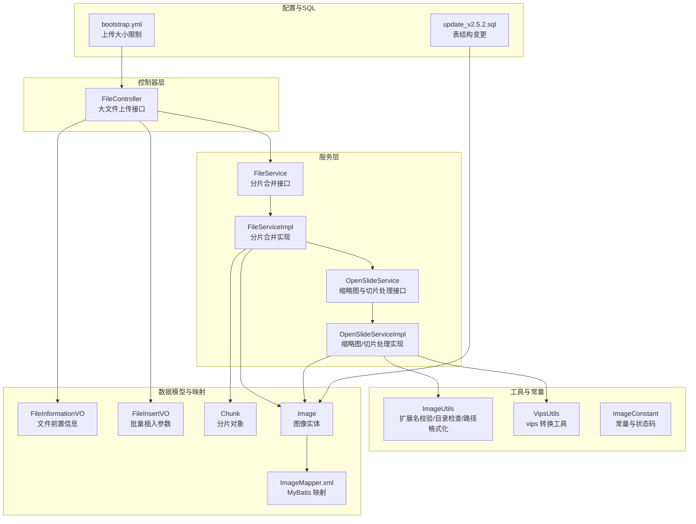
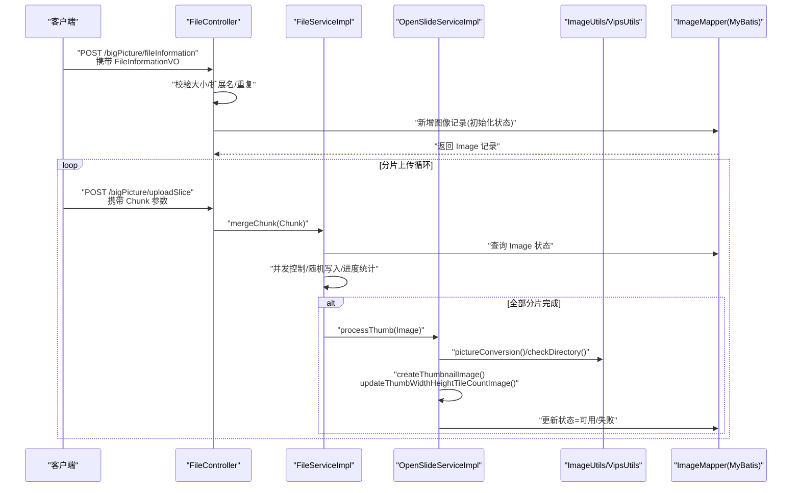
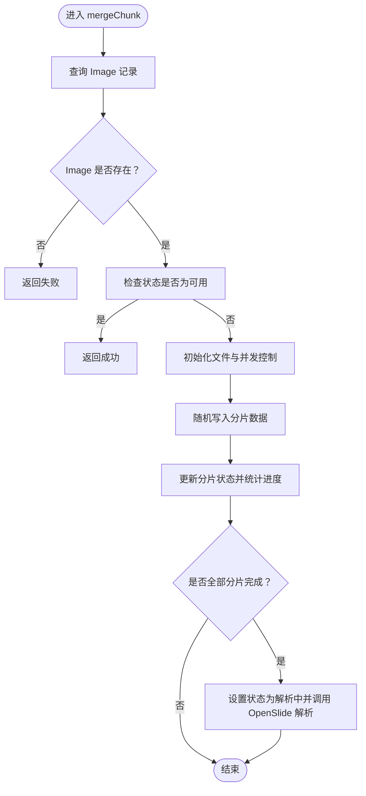
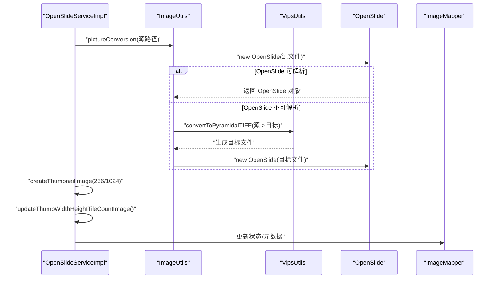
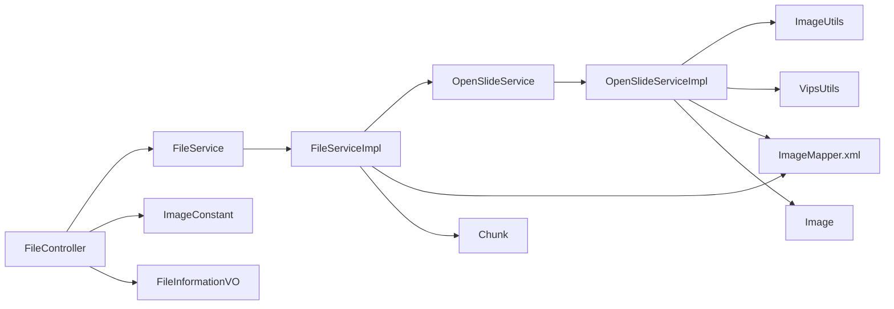

# 切片文件管理

<cite>
**本文引用的文件**
- [FileController.java](file://src/main/java/cn/staitech/file/controller/FileController.java)
- [FileService.java](file://src/main/java/cn/staitech/file/service/FileService.java)
- [FileServiceImpl.java](file://src/main/java/cn/staitech/file/service/impl/FileServiceImpl.java)
- [OpenSlideService.java](file://src/main/java/cn/staitech/file/service/OpenSlideService.java)
- [OpenSlideServiceImpl.java](file://src/main/java/cn/staitech/file/service/impl/OpenSlideServiceImpl.java)
- [ImageUtils.java](file://src/main/java/cn/staitech/file/util/ImageUtils.java)
- [VipsUtils.java](file://src/main/java/cn/staitech/file/util/VipsUtils.java)
- [ImageConstant.java](file://src/main/java/cn/staitech/file/constant/ImageConstant.java)
- [FileInformationVO.java](file://src/main/java/cn/staitech/file/vo/FileInformationVO.java)
- [FileInsertVO.java](file://src/main/java/cn/staitech/file/vo/FileInsertVO.java)
- [Chunk.java](file://src/main/java/cn/staitech/file/vo/Chunk.java)
- [Image.java](file://src/main/java/cn/staitech/file/domain/Image.java)
- [ImageMapper.xml](file://src/main/resources/mapper/ImageMapper.xml)
- [bootstrap.yml](file://src/main/resources/bootstrap.yml)
- [update_v2.5.2.sql](file://sql/update_v2.5.2.sql)
</cite>

## 目录
1. [简介](#简介)
2. [项目结构](#项目结构)
3. [核心组件](#核心组件)
4. [架构总览](#架构总览)
5. [详细组件分析](#详细组件分析)
6. [依赖分析](#依赖分析)
7. [性能考虑](#性能考虑)
8. [故障排查指南](#故障排查指南)
9. [结论](#结论)
10. [附录](#附录)

## 简介
本文件面向 PACMVS 项目的“切片文件管理”能力，围绕文件上传、元数据解析、文件验证与存储管理进行系统化说明。重点覆盖以下方面：
- 文件上传流程：前置信息校验、分片上传与合并、上传进度与超时处理
- 元数据解析：OpenSlide 解析、缩略图生成、分辨率与层级信息提取
- 文件验证：格式支持列表、大小限制、重复检测
- 存储策略：命名规范、路径组织、失败迁移
- 数据模型：FileInsertVO、Image 实体的字段与业务规则
- API 调用示例与错误处理建议
- 配置项：文件大小限制、分片大小、上传开关等

## 项目结构
项目采用典型的分层架构，按职责划分为控制器、服务、工具与常量、数据模型与映射等模块。

图表来源
- [FileController.java:37-129](file://src/main/java/cn/staitech/file/controller/FileController.java#L37-L129)
- [FileService.java:6-9](file://src/main/java/cn/staitech/file/service/FileService.java#L6-L9)
- [FileServiceImpl.java:31-177](file://src/main/java/cn/staitech/file/service/impl/FileServiceImpl.java#L31-L177)
- [OpenSlideService.java:14-39](file://src/main/java/cn/staitech/file/service/OpenSlideService.java#L14-L39)
- [OpenSlideServiceImpl.java:47-562](file://src/main/java/cn/staitech/file/service/impl/OpenSlideServiceImpl.java#L47-L562)
- [ImageUtils.java:20-148](file://src/main/java/cn/staitech/file/util/ImageUtils.java#L20-L148)
- [VipsUtils.java:11-37](file://src/main/java/cn/staitech/file/util/VipsUtils.java#L11-L37)
- [ImageConstant.java:9-67](file://src/main/java/cn/staitech/file/constant/ImageConstant.java#L9-L67)
- [FileInformationVO.java:14-46](file://src/main/java/cn/staitech/file/vo/FileInformationVO.java#L14-L46)
- [FileInsertVO.java:14-26](file://src/main/java/cn/staitech/file/vo/FileInsertVO.java#L14-L26)
- [Chunk.java:9-47](file://src/main/java/cn/staitech/file/vo/Chunk.java#L9-L47)
- [Image.java:27-216](file://src/main/java/cn/staitech/file/domain/Image.java#L27-L216)
- [ImageMapper.xml:4-64](file://src/main/resources/mapper/ImageMapper.xml#L4-L64)
- [bootstrap.yml:6-10](file://src/main/resources/bootstrap.yml#L6-L10)
- [update_v2.5.2.sql:1-10](file://sql/update_v2.5.2.sql#L1-L10)

章节来源
- [FileController.java:37-129](file://src/main/java/cn/staitech/file/controller/FileController.java#L37-L129)
- [bootstrap.yml:6-10](file://src/main/resources/bootstrap.yml#L6-L10)

## 核心组件
- 控制器层：FileController 提供“文件前置信息上传”和“分片上传”两个核心接口，负责参数校验、调用服务层并返回统一响应。
- 服务层：
  - FileService/Impl：实现分片合并逻辑，支持并发控制、随机写入、进度统计与状态切换。
  - OpenSlideService/Impl：负责缩略图生成、元数据解析（分辨率、层级、瓦片数）、切片任务提交与失败迁移。
- 工具与常量：ImageUtils 统一扩展名与大小限制、目录检查、路径格式化；VipsUtils 调用 vips 执行 pyramidal TIFF 转换；ImageConstant 定义状态码、文件大小上限、存储目录等。
- 数据模型：FileInformationVO/FileInsertVO 描述上传前置信息与批量插入参数；Chunk 描述分片对象；Image 为数据库实体，承载图像元数据与状态。

章节来源
- [FileController.java:37-129](file://src/main/java/cn/staitech/file/controller/FileController.java#L37-L129)
- [FileService.java:6-9](file://src/main/java/cn/staitech/file/service/FileService.java#L6-L9)
- [FileServiceImpl.java:31-177](file://src/main/java/cn/staitech/file/service/impl/FileServiceImpl.java#L31-L177)
- [OpenSlideService.java:14-39](file://src/main/java/cn/staitech/file/service/OpenSlideService.java#L14-L39)
- [OpenSlideServiceImpl.java:47-562](file://src/main/java/cn/staitech/file/service/impl/OpenSlideServiceImpl.java#L47-L562)
- [ImageUtils.java:20-148](file://src/main/java/cn/staitech/file/util/ImageUtils.java#L20-L148)
- [VipsUtils.java:11-37](file://src/main/java/cn/staitech/file/util/VipsUtils.java#L11-L37)
- [ImageConstant.java:9-67](file://src/main/java/cn/staitech/file/constant/ImageConstant.java#L9-L67)
- [FileInformationVO.java:14-46](file://src/main/java/cn/staitech/file/vo/FileInformationVO.java#L14-L46)
- [FileInsertVO.java:14-26](file://src/main/java/cn/staitech/file/vo/FileInsertVO.java#L14-L26)
- [Chunk.java:9-47](file://src/main/java/cn/staitech/file/vo/Chunk.java#L9-L47)
- [Image.java:27-216](file://src/main/java/cn/staitech/file/domain/Image.java#L27-L216)

## 架构总览
下图展示从客户端到服务端的关键交互与数据流转：

图表来源
- [FileController.java:58-127](file://src/main/java/cn/staitech/file/controller/FileController.java#L58-L127)
- [FileServiceImpl.java:53-146](file://src/main/java/cn/staitech/file/service/impl/FileServiceImpl.java#L53-L146)
- [OpenSlideServiceImpl.java:139-339](file://src/main/java/cn/staitech/file/service/impl/OpenSlideServiceImpl.java#L139-L339)
- [ImageUtils.java:52-97](file://src/main/java/cn/staitech/file/util/ImageUtils.java#L52-L97)
- [ImageMapper.xml:4-64](file://src/main/resources/mapper/ImageMapper.xml#L4-L64)

## 详细组件分析

### 数据传输对象与实体类

#### FileInformationVO 字段与校验规则
- 字段说明
  - imageId：图像标识（可选）
  - imageName：文件名（必填，长度限制）
  - md5：文件 MD5（必填）
  - chunkTotal：分片总数（可选）
  - size：文件大小（必填，字符串形式）
  - organizationId：机构 ID（必填）
  - projectTypeId：项目分类 ID（可选）
  - uuid：唯一标识（可选）
  - userId：用户 ID（可选）
- 校验规则
  - 非空与长度约束由注解保证
  - 与文件大小上限、扩展名白名单在控制器中统一校验

章节来源
- [FileInformationVO.java:14-46](file://src/main/java/cn/staitech/file/vo/FileInformationVO.java#L14-L46)
- [FileController.java:61-84](file://src/main/java/cn/staitech/file/controller/FileController.java#L61-L84)

#### FileInsertVO 字段与用途
- 字段说明
  - fileList：图片文件绝对路径数组（必填）
  - organizationId：机构 ID（必填）
  - roundId：轮次 ID（可选）
  - bizType：业务类型（1 原始切片，默认；2 预测切片；隐藏字段）
- 用途
  - 支持批量导入场景，作为后端入库的入口参数

章节来源
- [FileInsertVO.java:14-26](file://src/main/java/cn/staitech/file/vo/FileInsertVO.java#L14-L26)

#### Chunk 分片对象
- 字段说明
  - chunkNumber：当前分片序号（从 0 开始）
  - chunkSize：分片大小
  - filename：文件名
  - totalChunks：总分片数
  - imageId：图像 ID
  - file：分片文件（MultipartFile）

章节来源
- [Chunk.java:9-47](file://src/main/java/cn/staitech/file/vo/Chunk.java#L9-L47)

#### Image 实体类（数据库映射）
- 关键属性与业务含义
  - imageId：图像主键
  - fileName/imageName：文件名与显示名
  - imagePath/imageUrl/thumbUrl/macroUrl/labelUrl/cacheUrl：物理路径与各类 URL
  - format/width/height/depth/size/globalSize/resolvingPower：格式与尺寸、分辨率、全局大小
  - tileCountList/levelCount/chunkTotal/md5：瓦片计数、层级数、分片总数、MD5
  - resolutionX/resolutionY/sourceLens：分辨率参数
  - createBy/createTime/updateBy/updateTime：审计字段
  - imageCode/topicId/topicName：编号与专题关联
  - status：状态（上传中/失败/解析中/失败/可用/信息解析中/失败/处理中/失败）
  - bizType/source：业务类型与来源（手动上传/服务器读取）
  - organizationId：机构 ID
  - animalCode/waxCode/groupCode/sexFlag/period：样本信息
  - analyzeStatus：文件名解析状态（0 失败/1 成功）
- MyBatis 映射
  - 通过 XML 结果集映射到 Java 属性，确保字段一致

章节来源
- [Image.java:27-216](file://src/main/java/cn/staitech/file/domain/Image.java#L27-L216)
- [ImageMapper.xml:4-64](file://src/main/resources/mapper/ImageMapper.xml#L4-L64)

### 文件上传与分片合并流程

#### 前置信息上传
- 接口：POST /bigPicture/fileInformation
- 校验逻辑
  - 文件大小上限：超过限制返回失败
  - 扩展名白名单：不在允许列表则拒绝
  - 重复检测：根据文件名与开关决定是否允许重复
- 结果：向数据库写入初始记录，状态通常为“上传中”

章节来源
- [FileController.java:58-85](file://src/main/java/cn/staitech/file/controller/FileController.java#L58-L85)
- [ImageUtils.java:105-114](file://src/main/java/cn/staitech/file/util/ImageUtils.java#L105-L114)
- [ImageConstant.java:52-53](file://src/main/java/cn/staitech/file/constant/ImageConstant.java#L52-L53)

#### 分片上传与合并
- 接口：POST /bigPicture/uploadSlice
- 流程要点
  - 构造 Chunk 对象并调用 FileServiceImpl.mergeChunk
  - 并发控制：基于图像 ID 的状态数组，避免重复写入
  - 随机写入：根据分片序号与大小定位文件指针，写入对应偏移
  - 进度统计：累计已接收分片数，达到总数后触发解析
  - 超时处理：定时任务清理长时间“上传中”且超时的记录

图表来源
- [FileServiceImpl.java:53-146](file://src/main/java/cn/staitech/file/service/impl/FileServiceImpl.java#L53-L146)

章节来源
- [FileController.java:97-127](file://src/main/java/cn/staitech/file/controller/FileController.java#L97-L127)
- [FileService.java:6-9](file://src/main/java/cn/staitech/file/service/FileService.java#L6-L9)
- [FileServiceImpl.java:31-177](file://src/main/java/cn/staitech/file/service/impl/FileServiceImpl.java#L31-L177)

### 元数据解析与缩略图生成

#### OpenSlide 解析与缩略图
- 解析流程
  - 调用 ImageUtils.pictureConversion，优先使用 OpenSlide 验证；若失败则通过 VipsUtils 转换为 pyramidal TIFF 再验证
  - 生成缩略图（256×256 与 1024×1024），并计算层级数、每层瓦片数、宽高与倍数
  - 写入分辨率参数（X/Y 与物镜倍数），依据不同格式（SVS/NDPI）读取属性
- 状态管理
  - 解析成功：状态推进至“处理中”，提交切片任务
  - 解析失败：状态置为“解析失败”，并将文件移动到失败目录

图表来源
- [OpenSlideServiceImpl.java:139-232](file://src/main/java/cn/staitech/file/service/impl/OpenSlideServiceImpl.java#L139-L232)
- [ImageUtils.java:52-97](file://src/main/java/cn/staitech/file/util/ImageUtils.java#L52-L97)
- [VipsUtils.java:22-35](file://src/main/java/cn/staitech/file/util/VipsUtils.java#L22-L35)

章节来源
- [OpenSlideService.java:14-39](file://src/main/java/cn/staitech/file/service/OpenSlideService.java#L14-L39)
- [OpenSlideServiceImpl.java:47-562](file://src/main/java/cn/staitech/file/service/impl/OpenSlideServiceImpl.java#L47-L562)

### 存储策略、命名规范与路径组织

#### 存储目录与命名
- 组织目录：以机构 ID 固定宽度格式化为 CXXX
- 切片目录：Slides（成功）、Failed（失败）、Retry（重试）
- 缩略图与缓存：基于配置的基础目录与相对路径生成
- 路径生成：提供四位数组织路径与格式化函数

章节来源
- [ImageConstant.java:34-53](file://src/main/java/cn/staitech/file/constant/ImageConstant.java#L34-L53)
- [ImageUtils.java:132-145](file://src/main/java/cn/staitech/file/util/ImageUtils.java#L132-L145)

#### 失败迁移
- 当解析或切片失败时，将源文件移动到对应失败目录，确保后续人工复检与重试

章节来源
- [OpenSlideServiceImpl.java:394-454](file://src/main/java/cn/staitech/file/service/impl/OpenSlideServiceImpl.java#L394-L454)

### 文件格式支持与大小限制

#### 支持的文件格式
- 白名单：SVS、NDPI、TIFF、TIF、ZVI、SCN、BMP、GIF、JPG/JPEG、PNG

章节来源
- [ImageUtils.java:23-25](file://src/main/java/cn/staitech/file/util/ImageUtils.java#L23-L25)
- [ImageConstant.java:10-11](file://src/main/java/cn/staitech/file/constant/ImageConstant.java#L10-L11)

#### 大小限制
- 单文件最大：5GB
- 上传开关：可通过配置控制是否校验重复文件

章节来源
- [ImageConstant.java:52-53](file://src/main/java/cn/staitech/file/constant/ImageConstant.java#L52-L53)
- [FileController.java:45-46](file://src/main/java/cn/staitech/file/controller/FileController.java#L45-L46)

### API 调用示例与错误处理

#### 前置信息上传
- 方法：POST /bigPicture/fileInformation
- 请求体：FileInformationVO
- 响应：统一返回对象，包含结果与消息
- 错误处理：
  - 超过大小限制：返回“不允许上传5G以上的文件”
  - 扩展名不支持：返回“上传的图像格式暂不支持”
  - 重复文件：根据开关返回“该文件已经存在，请重新上传”

章节来源
- [FileController.java:58-85](file://src/main/java/cn/staitech/file/controller/FileController.java#L58-L85)
- [ImageConstant.java:13-18](file://src/main/java/cn/staitech/file/constant/ImageConstant.java#L13-L18)

#### 分片上传
- 方法：POST /bigPicture/uploadSlice
- 参数：imageId、chunk、chunkTotal、chunkSize、file
- 响应：成功/失败提示
- 错误处理：
  - 分片写入异常：返回“文件分片上传失败”
  - 超时清理：定时任务将超时“上传中”记录置为“上传失败”，并删除临时文件

章节来源
- [FileController.java:97-127](file://src/main/java/cn/staitech/file/controller/FileController.java#L97-L127)
- [FileServiceImpl.java:152-176](file://src/main/java/cn/staitech/file/service/impl/FileServiceImpl.java#L152-L176)

## 依赖分析

图表来源
- [FileController.java:47-50](file://src/main/java/cn/staitech/file/controller/FileController.java#L47-L50)
- [FileService.java:6-9](file://src/main/java/cn/staitech/file/service/FileService.java#L6-L9)
- [FileServiceImpl.java:35-38](file://src/main/java/cn/staitech/file/service/impl/FileServiceImpl.java#L35-L38)
- [OpenSlideService.java:14-39](file://src/main/java/cn/staitech/file/service/OpenSlideService.java#L14-L39)
- [OpenSlideServiceImpl.java:60-72](file://src/main/java/cn/staitech/file/service/impl/OpenSlideServiceImpl.java#L60-L72)
- [ImageUtils.java:20-148](file://src/main/java/cn/staitech/file/util/ImageUtils.java#L20-L148)
- [VipsUtils.java:11-37](file://src/main/java/cn/staitech/file/util/VipsUtils.java#L11-L37)
- [ImageMapper.xml:4-64](file://src/main/resources/mapper/ImageMapper.xml#L4-L64)
- [ImageConstant.java:9-67](file://src/main/java/cn/staitech/file/constant/ImageConstant.java#L9-L67)
- [FileInformationVO.java:14-46](file://src/main/java/cn/staitech/file/vo/FileInformationVO.java#L14-L46)
- [Chunk.java:9-47](file://src/main/java/cn/staitech/file/vo/Chunk.java#L9-L47)
- [Image.java:27-216](file://src/main/java/cn/staitech/file/domain/Image.java#L27-L216)

章节来源
- [FileController.java:37-129](file://src/main/java/cn/staitech/file/controller/FileController.java#L37-L129)
- [FileServiceImpl.java:31-177](file://src/main/java/cn/staitech/file/service/impl/FileServiceImpl.java#L31-L177)
- [OpenSlideServiceImpl.java:47-562](file://src/main/java/cn/staitech/file/service/impl/OpenSlideServiceImpl.java#L47-L562)

## 性能考虑
- 并发控制：基于图像 ID 的原子引用数组，避免重复写入与竞态
- 随机写入：按分片序号与大小定位文件指针，减少磁盘顺序写带来的性能损耗
- 异步处理：缩略图与切片任务分别在线程池中异步执行，提升吞吐
- 目录检查：统一的目录创建逻辑，避免频繁 IO 操作
- 超时清理：定时任务回收长时间未更新的“上传中”记录，释放资源

[本节为通用性能讨论，无需列出具体文件来源]

## 故障排查指南
- 常见错误与定位
  - “上传的图像格式暂不支持”：确认文件扩展名在白名单中
  - “不允许上传5G以上的文件”：调整文件或拆分分片
  - “该文件已经存在，请重新上传”：关闭重复检测开关或更换文件名
  - “文件分片上传失败”：检查分片参数与网络稳定性
  - “解析失败/处理失败”：查看失败目录迁移情况与日志
- 日志与审计
  - OpenSlide 解析过程与异常均记录日志
  - 审计接口调用用于记录关键操作与状态变化

章节来源
- [FileController.java:61-85](file://src/main/java/cn/staitech/file/controller/FileController.java#L61-L85)
- [FileServiceImpl.java:152-176](file://src/main/java/cn/staitech/file/service/impl/FileServiceImpl.java#L152-L176)
- [OpenSlideServiceImpl.java:394-454](file://src/main/java/cn/staitech/file/service/impl/OpenSlideServiceImpl.java#L394-L454)

## 结论
本方案通过“前置信息校验 + 分片上传 + 并发控制 + OpenSlide 解析 + 异步切片”的完整链路，实现了对多格式切片文件的稳定管理。配合清晰的存储策略与失败迁移机制，能够满足大规模数字病理切片的高效接入与长期维护需求。

[本节为总结性内容，无需列出具体文件来源]

## 附录

### 配置项一览
- 上传大小限制
  - 单文件最大：5GB
  - 请求体与单文件大小：Spring 配置为 500MB
- 上传开关
  - 是否校验重复文件：可通过配置控制
- Python 脚本路径与可执行程序
  - Python 脚本路径与可执行程序名称可配置

章节来源
- [ImageConstant.java:52-53](file://src/main/java/cn/staitech/file/constant/ImageConstant.java#L52-L53)
- [bootstrap.yml:6-10](file://src/main/resources/bootstrap.yml#L6-L10)
- [OpenSlideServiceImpl.java:53-58](file://src/main/java/cn/staitech/file/service/impl/OpenSlideServiceImpl.java#L53-L58)

### 表结构变更摘要
- 新增处理状态字段并调整默认值
- 修改蜡块号字段类型
- 调整创建/更新时间默认行为

章节来源
- [update_v2.5.2.sql:1-10](file://sql/update_v2.5.2.sql#L1-L10)