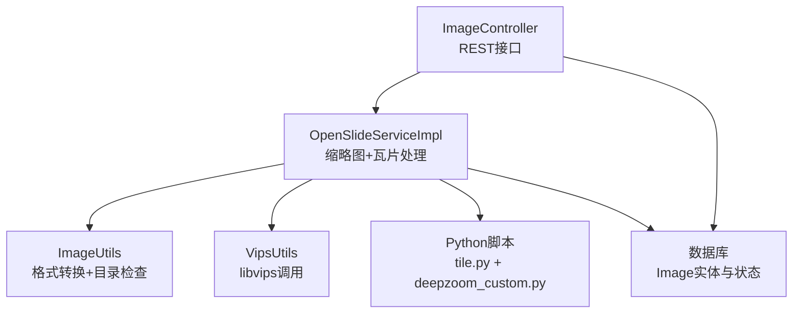
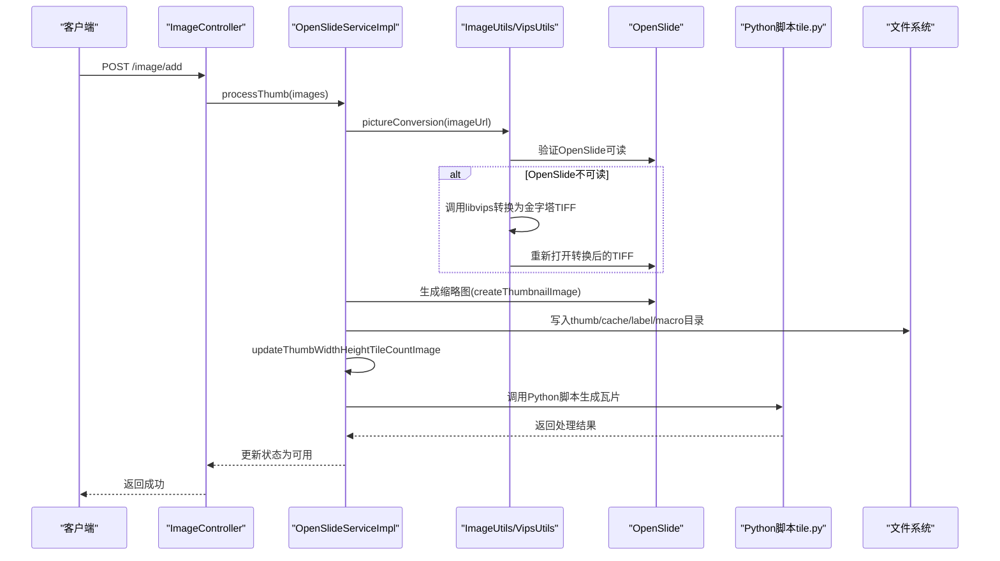
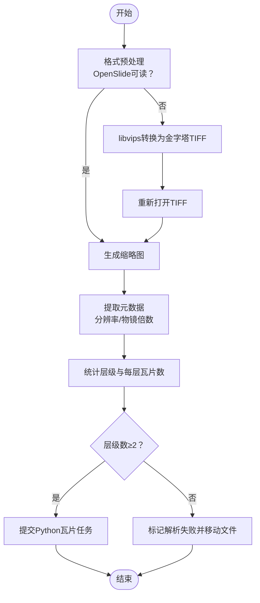
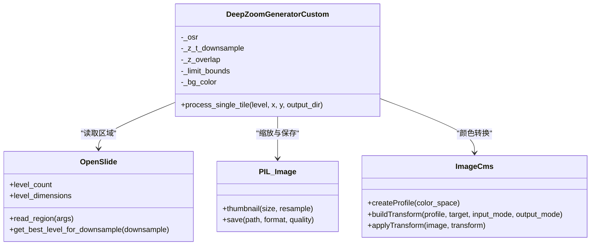
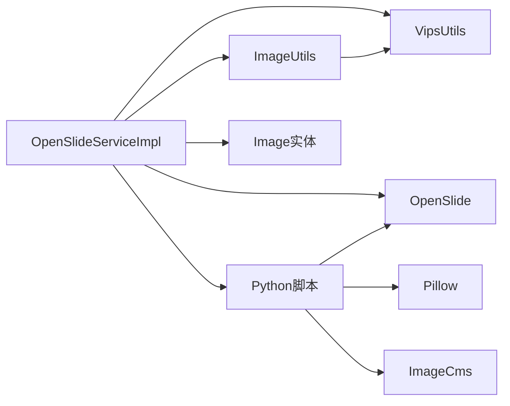

# 图像处理服务

<cite>
**本文引用的文件**
- [OpenSlideService.java](file://src/main/java/cn/staitech/file/service/OpenSlideService.java)
- [OpenSlideServiceImpl.java](file://src/main/java/cn/staitech/file/service/impl/OpenSlideServiceImpl.java)
- [VipsUtils.java](file://src/main/java/cn/staitech/file/util/VipsUtils.java)
- [ImageUtils.java](file://src/main/java/cn/staitech/file/util/ImageUtils.java)
- [Image.java](file://src/main/java/cn/staitech/file/domain/Image.java)
- [ImageConstant.java](file://src/main/java/cn/staitech/file/constant/ImageConstant.java)
- [ImageController.java](file://src/main/java/cn/staitech/file/controller/ImageController.java)
- [ThreadPoolConfig.java](file://src/main/java/cn/staitech/file/config/ThreadPoolConfig.java)
- [tile.py](file://python-script/tile.py)
- [deepzoom_custom.py](file://python-script/deepzoom_custom.py)
- [tile.py（docker）](file://docker/staitech/modules/image/script/tile.py)
- [deepzoom_custom.py（docker）](file://docker/staitech/modules/image/script/deepzoom_custom.py)
- [bootstrap.yml](file://src/main/resources/bootstrap.yml)
- [Dockerfile](file://Dockerfile)
</cite>

## 目录
1. [简介](#简介)
2. [项目结构](#项目结构)
3. [核心组件](#核心组件)
4. [架构总览](#架构总览)
5. [组件详解](#组件详解)
6. [依赖关系分析](#依赖关系分析)
7. [性能与内存管理](#性能与内存管理)
8. [故障排查指南](#故障排查指南)
9. [结论](#结论)
10. [附录](#附录)

## 简介
本文件面向PACMVS项目的图像处理服务，聚焦于OpenSlideService的实现原理与图像处理流水线，涵盖以下主题：
- OpenSlide库的集成方式与图像元数据提取
- 图像金字塔生成、缩略图创建与DeepZoom格式支持
- libvips集成与图像格式转换（JPEG→Pyramidal TIFF）
- Python脚本tile.py与deepzoom_custom.py的功能与调用方式
- 图像处理参数配置、内存管理与并发处理最佳实践
- 图像质量控制、色彩空间转换与批处理机制

## 项目结构
项目采用Spring Boot工程组织，主要模块如下：
- 控制层：接收外部请求，触发图像处理流程
- 服务层：负责OpenSlide处理、缩略图生成、瓦片切分与状态管理
- 工具层：封装libvips调用、图像格式转换与通用工具
- Python脚本：基于OpenSlide深度瓦片生成（DeepZoom/Zoomify风格）
- 配置层：线程池、文件上传大小限制等运行时配置

图表来源
- [ImageController.java:30-71](file://src/main/java/cn/staitech/file/controller/ImageController.java#L30-L71)
- [OpenSlideServiceImpl.java:47-562](file://src/main/java/cn/staitech/file/service/impl/OpenSlideServiceImpl.java#L47-L562)
- [ImageUtils.java:20-147](file://src/main/java/cn/staitech/file/util/ImageUtils.java#L20-L147)
- [VipsUtils.java:11-36](file://src/main/java/cn/staitech/file/util/VipsUtils.java#L11-L36)
- [tile.py:1-103](file://python-script/tile.py#L1-L103)
- [deepzoom_custom.py:1-153](file://python-script/deepzoom_custom.py#L1-L153)

章节来源
- [ImageController.java:30-71](file://src/main/java/cn/staitech/file/controller/ImageController.java#L30-L71)
- [OpenSlideServiceImpl.java:47-562](file://src/main/java/cn/staitech/file/service/impl/OpenSlideServiceImpl.java#L47-L562)
- [ImageUtils.java:20-147](file://src/main/java/cn/staitech/file/util/ImageUtils.java#L20-L147)
- [VipsUtils.java:11-36](file://src/main/java/cn/staitech/file/util/VipsUtils.java#L11-L36)
- [tile.py:1-103](file://python-script/tile.py#L1-L103)
- [deepzoom_custom.py:1-153](file://python-script/deepzoom_custom.py#L1-L153)

## 核心组件
- OpenSlideService接口与OpenSlideServiceImpl实现：定义并实现缩略图生成、重解析、瓦片切分等流程
- ImageUtils：封装OpenSlide格式验证、非OpenSlide格式转换（借助libvips）、目录创建等
- VipsUtils：提供libvips命令行调用，将JPEG转换为金字塔TIFF（带瓦片、压缩等参数）
- Python脚本tile.py与deepzoom_custom.py：基于OpenSlide深度瓦片生成，支持并发与内存控制
- Image实体与常量：承载图像元数据、状态机与路径约定
- 线程池配置：分别隔离OpenSlide缩略图处理与Python瓦片任务

章节来源
- [OpenSlideService.java:14-38](file://src/main/java/cn/staitech/file/service/OpenSlideService.java#L14-L38)
- [OpenSlideServiceImpl.java:47-562](file://src/main/java/cn/staitech/file/service/impl/OpenSlideServiceImpl.java#L47-L562)
- [ImageUtils.java:20-147](file://src/main/java/cn/staitech/file/util/ImageUtils.java#L20-L147)
- [VipsUtils.java:11-36](file://src/main/java/cn/staitech/file/util/VipsUtils.java#L11-L36)
- [Image.java:27-215](file://src/main/java/cn/staitech/file/domain/Image.java#L27-L215)
- [ImageConstant.java:9-66](file://src/main/java/cn/staitech/file/constant/ImageConstant.java#L9-L66)
- [ThreadPoolConfig.java:13-64](file://src/main/java/cn/staitech/file/config/ThreadPoolConfig.java#L13-L64)

## 架构总览
整体处理链路分为两阶段：
- 后端Java阶段：缩略图生成、元数据提取、状态流转、触发Python瓦片生成
- Python阶段：深度瓦片生成（DeepZoom/Zoomify风格），并发控制与内存管理

图表来源
- [ImageController.java:42-48](file://src/main/java/cn/staitech/file/controller/ImageController.java#L42-L48)
- [OpenSlideServiceImpl.java:140-378](file://src/main/java/cn/staitech/file/service/impl/OpenSlideServiceImpl.java#L140-L378)
- [ImageUtils.java:52-97](file://src/main/java/cn/staitech/file/util/ImageUtils.java#L52-L97)
- [VipsUtils.java:22-35](file://src/main/java/cn/staitech/file/util/VipsUtils.java#L22-L35)
- [tile.py:84-103](file://python-script/tile.py#L84-L103)

## 组件详解

### OpenSlideService与OpenSlideServiceImpl
- 职责边界
  - 缩略图生成：根据输入图像生成多尺寸缩略图（含缓存级缩略图）
  - 元数据提取：读取OpenSlide属性，填充分辨率、物镜倍数等
  - 状态管理：维护图像状态机，失败时迁移至失败目录
  - 瓦片生成：调用Python脚本进行深度瓦片生成
- 关键流程
  - 格式预处理：优先使用OpenSlide可读格式；否则通过libvips转换为金字塔TIFF
  - 缩略图生成：按固定尺寸生成基础缩略图与缓存缩略图
  - 层级统计：计算每层瓦片数量与总层级数，作为后续瓦片生成依据
  - 并发处理：缩略图与瓦片生成分别由独立线程池异步执行
- 错误处理
  - 缩略图生成失败或层级数不足时，标记解析失败并移动文件至失败目录
  - Python脚本执行失败时，记录错误并更新状态

图表来源
- [OpenSlideServiceImpl.java:140-232](file://src/main/java/cn/staitech/file/service/impl/OpenSlideServiceImpl.java#L140-L232)
- [OpenSlideServiceImpl.java:319-378](file://src/main/java/cn/staitech/file/service/impl/OpenSlideServiceImpl.java#L319-L378)
- [ImageUtils.java:52-97](file://src/main/java/cn/staitech/file/util/ImageUtils.java#L52-L97)

章节来源
- [OpenSlideService.java:14-38](file://src/main/java/cn/staitech/file/service/OpenSlideService.java#L14-L38)
- [OpenSlideServiceImpl.java:47-562](file://src/main/java/cn/staitech/file/service/impl/OpenSlideServiceImpl.java#L47-L562)

### 图像金字塔生成与缩略图创建
- 金字塔生成
  - 通过libvips命令行接口生成金字塔TIFF，包含瓦片尺寸、压缩方式、BigTIFF等参数
  - 保证瓦片化以便Web/Viewer高效加载
- 缩略图创建
  - 使用OpenSlide的createThumbnailImage生成指定尺寸缩略图
  - 生成基础缩略图与缓存级缩略图，分别用于前端展示与标注缓存
- 元数据提取
  - 从OpenSlide属性中读取分辨率（X/Y）、物镜倍数（Objective Power/SourceLens）
  - 特殊兼容某些厂商导出的嵌套JSON描述字段

章节来源
- [VipsUtils.java:22-35](file://src/main/java/cn/staitech/file/util/VipsUtils.java#L22-L35)
- [OpenSlideServiceImpl.java:242-256](file://src/main/java/cn/staitech/file/service/impl/OpenSlideServiceImpl.java#L242-L256)
- [OpenSlideServiceImpl.java:87-130](file://src/main/java/cn/staitech/file/service/impl/OpenSlideServiceImpl.java#L87-L130)

### DeepZoom格式支持与瓦片生成
- Python脚本职责
  - 使用OpenSlide深度瓦片生成器（DeepZoomGenerator）遍历层级与瓦片
  - 自定义生成器（DeepZoomGeneratorCustom）改进层级计算逻辑，适配前端显示
  - 支持颜色配置文件（ICC Profile）转换至sRGB，确保跨设备一致性
- 并发与内存控制
  - 使用线程池并发生成瓦片，限制最大挂起任务数，避免内存峰值
  - OpenSlide缓存设置，控制内存占用上限
- 输出格式
  - 生成Zoomify风格的瓦片文件（按level-x-y.jpg命名）

图表来源
- [deepzoom_custom.py:8-153](file://python-script/deepzoom_custom.py#L8-L153)
- [tile.py:15-103](file://python-script/tile.py#L15-L103)

章节来源
- [deepzoom_custom.py:8-153](file://python-script/deepzoom_custom.py#L8-L153)
- [tile.py:15-103](file://python-script/tile.py#L15-L103)

### libvips集成与图像格式转换
- 调用方式
  - 通过Runtime.exec执行vips命令，传入目标格式、瓦片尺寸、压缩方式、BigTIFF等参数
- 转换策略
  - 当OpenSlide无法直接解析源图像时，自动转换为金字塔TIFF，确保后续流程可用
- 性能建议
  - 合理设置瓦片尺寸（如256）与压缩方式（如LZW），平衡存储与解码性能

章节来源
- [VipsUtils.java:22-35](file://src/main/java/cn/staitech/file/util/VipsUtils.java#L22-L35)
- [ImageUtils.java:52-97](file://src/main/java/cn/staitech/file/util/ImageUtils.java#L52-L97)

### Python脚本调用方式
- 调用入口
  - 通过ProcessBuilder启动Python脚本，传入图像路径与输出目录
- 参数约定
  - tile.py：接收图像路径与输出目录两个参数，内部创建OpenSlide缓存并并发生成瓦片
- 日志与错误
  - 脚本输出实时打印；非零退出码视为失败并抛出异常

章节来源
- [OpenSlideServiceImpl.java:457-477](file://src/main/java/cn/staitech/file/service/impl/OpenSlideServiceImpl.java#L457-L477)
- [tile.py:84-103](file://python-script/tile.py#L84-L103)

### 图像处理参数配置
- 文件上传限制
  - 通过bootstrap.yml配置multipart大小限制（示例为500MB）
- Python执行参数
  - 可配置Python可执行程序与脚本路径（默认值见实现）
- 线程池参数
  - OpenSlide线程池：CPU核数相关，阻塞队列容量大，拒绝策略回退到调用线程执行
  - Python线程池：CPU核数分母控制线程规模，避免过多I/O任务抢占

章节来源
- [bootstrap.yml:7-10](file://src/main/resources/bootstrap.yml#L7-L10)
- [OpenSlideServiceImpl.java:53-58](file://src/main/java/cn/staitech/file/service/impl/OpenSlideServiceImpl.java#L53-L58)
- [ThreadPoolConfig.java:18-64](file://src/main/java/cn/staitech/file/config/ThreadPoolConfig.java#L18-L64)

## 依赖关系分析
- 组件耦合
  - OpenSlideServiceImpl依赖ImageUtils与VipsUtils进行格式转换与目录管理
  - 通过线程池隔离不同阶段的任务，降低相互影响
- 外部依赖
  - OpenSlide库：读取WSI元数据与生成缩略图
  - libvips：格式转换与金字塔生成
  - Python生态：OpenSlide、Pillow、ImageCms用于瓦片生成与颜色管理
- 状态与路径
  - Image实体承载状态、路径与元数据，贯穿整个处理流程

图表来源
- [OpenSlideServiceImpl.java:47-562](file://src/main/java/cn/staitech/file/service/impl/OpenSlideServiceImpl.java#L47-L562)
- [ImageUtils.java:20-147](file://src/main/java/cn/staitech/file/util/ImageUtils.java#L20-L147)
- [VipsUtils.java:11-36](file://src/main/java/cn/staitech/file/util/VipsUtils.java#L11-L36)
- [tile.py:1-103](file://python-script/tile.py#L1-L103)

章节来源
- [OpenSlideServiceImpl.java:47-562](file://src/main/java/cn/staitech/file/service/impl/OpenSlideServiceImpl.java#L47-L562)
- [Image.java:27-215](file://src/main/java/cn/staitech/file/domain/Image.java#L27-L215)

## 性能与内存管理
- OpenSlide缓存
  - 在Python脚本中设置OpenSlideCache容量（示例1GB），减少重复读取开销
- 并发控制
  - Python侧使用ThreadPoolExecutor与有界队列控制并发任务数量，避免内存峰值
  - Java侧线程池参数与拒绝策略保障稳定性
- 图像质量与色彩
  - 瓦片保存质量参数可控（示例90），颜色配置文件转换至sRGB提升一致性
- 存储与I/O
  - 缩略图与瓦片按层级与坐标组织，便于增量访问与缓存命中

章节来源
- [tile.py:92-98](file://python-script/tile.py#L92-L98)
- [ThreadPoolConfig.java:18-64](file://src/main/java/cn/staitech/file/config/ThreadPoolConfig.java#L18-L64)
- [deepzoom_custom.py:161-176](file://python-script/deepzoom_custom.py#L161-L176)

## 故障排查指南
- 缩略图生成失败
  - 检查OpenSlide是否可读；若不可读，确认libvips转换是否成功
  - 确认缩略图输出目录存在且可写
- 层级数不足
  - 若层级数小于最小阈值，标记解析失败并移动文件至失败目录
- Python脚本执行失败
  - 查看脚本输出日志；确认Python可执行程序与脚本路径配置正确
  - 检查磁盘空间与权限
- 状态异常
  - 通过接口查询失败图像并重解析；检查状态机流转是否符合预期

章节来源
- [OpenSlideServiceImpl.java:183-200](file://src/main/java/cn/staitech/file/service/impl/OpenSlideServiceImpl.java#L183-L200)
- [OpenSlideServiceImpl.java:259-268](file://src/main/java/cn/staitech/file/service/impl/OpenSlideServiceImpl.java#L259-L268)
- [OpenSlideServiceImpl.java:457-477](file://src/main/java/cn/staitech/file/service/impl/OpenSlideServiceImpl.java#L457-L477)
- [ImageConstant.java:20-32](file://src/main/java/cn/staitech/file/constant/ImageConstant.java#L20-L32)

## 结论
本图像处理服务通过OpenSlide与libvips实现对WSI的元数据提取与金字塔构建，并结合Python脚本完成深度瓦片生成。Java侧负责状态管理与并发调度，Python侧负责高性能瓦片生成与颜色管理。整体方案在可扩展性、性能与可靠性方面具备良好平衡。

## 附录
- Docker打包
  - 使用Maven构建JAR，基于Alpine JRE运行，暴露端口供容器编排
- 配置要点
  - 上传大小、Python执行路径、线程池规模需结合硬件资源调整

章节来源
- [Dockerfile:1-16](file://Dockerfile#L1-L16)
- [bootstrap.yml:1-37](file://src/main/resources/bootstrap.yml#L1-L37)