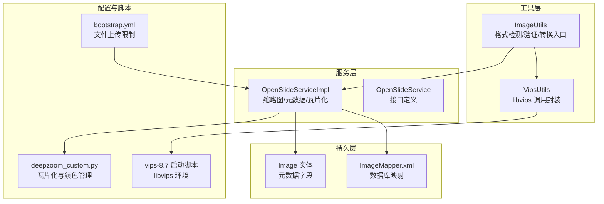
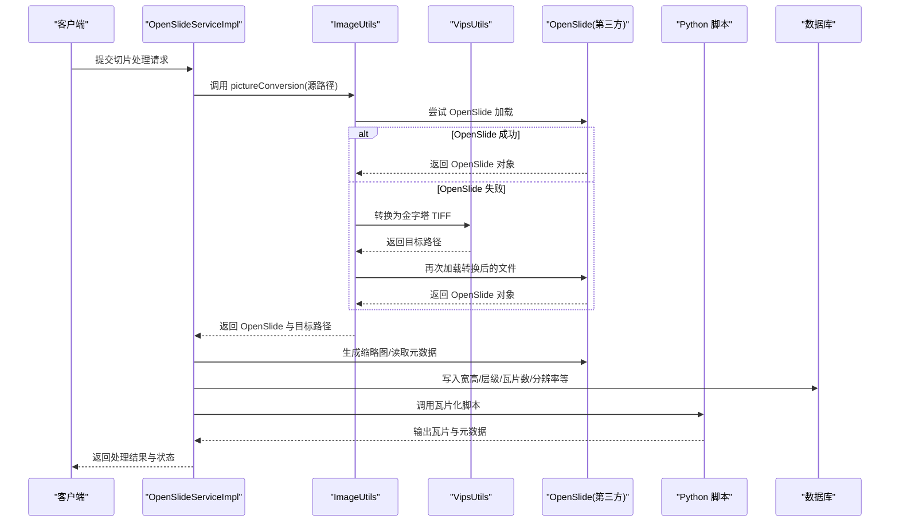
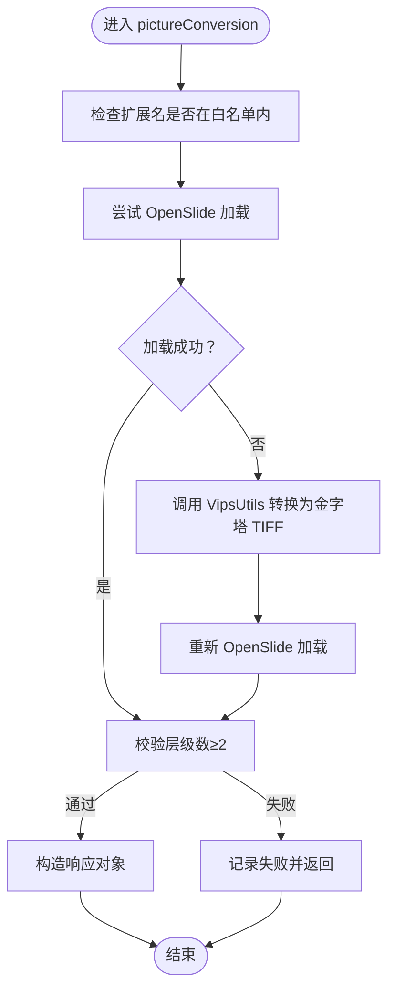
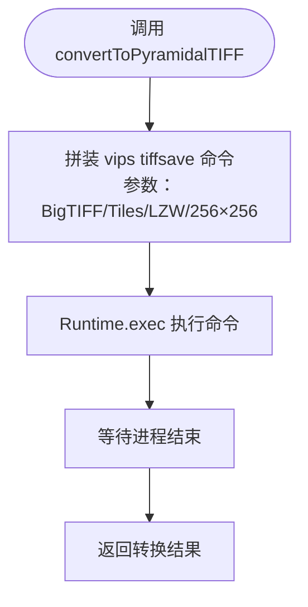
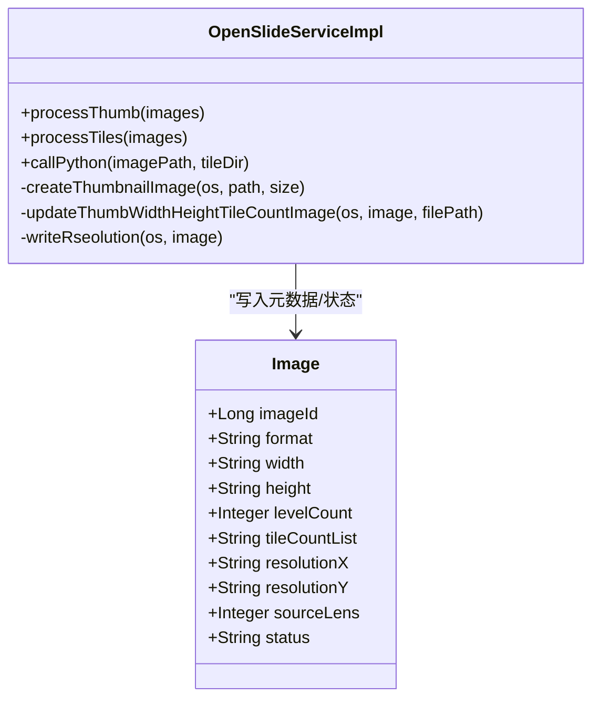
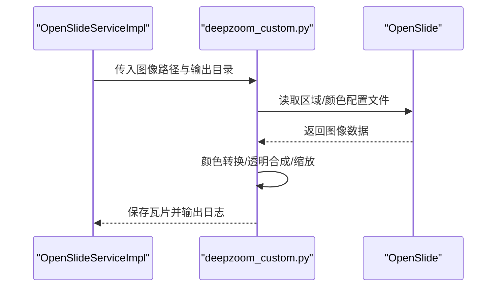
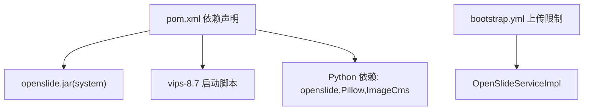

# 图像格式支持

<cite>
**本文引用的文件**
- [ImageUtils.java](file://src/main/java/cn/staitech/file/util/ImageUtils.java)
- [VipsUtils.java](file://src/main/java/cn/staitech/file/util/VipsUtils.java)
- [OpenSlideServiceImpl.java](file://src/main/java/cn/staitech/file/service/impl/OpenSlideServiceImpl.java)
- [OpenSlideService.java](file://src/main/java/cn/staitech/file/service/OpenSlideService.java)
- [Image.java](file://src/main/java/cn/staitech/file/domain/Image.java)
- [ImageConstant.java](file://src/main/java/cn/staitech/file/constant/ImageConstant.java)
- [ImageConversionsionResp.java](file://src/main/java/cn/staitech/file/vo/ImageConversionsionResp.java)
- [pom.xml](file://pom.xml)
- [bootstrap.yml](file://src/main/resources/bootstrap.yml)
- [ImageMapper.xml](file://src/main/resources/mapper/ImageMapper.xml)
- [deepzoom_custom.py](file://python-script/deepzoom_custom.py)
- [deepzoom_custom.py](file://docker/staitech/modules/image/script/deepzoom_custom.py)
- [vips-8.7](file://docker/staitech/modules/image/libvips/bin/vips-8.7)
</cite>

## 目录
1. [简介](#简介)
2. [项目结构](#项目结构)
3. [核心组件](#核心组件)
4. [架构总览](#架构总览)
5. [详细组件分析](#详细组件分析)
6. [依赖分析](#依赖分析)
7. [性能考虑](#性能考虑)
8. [故障排查指南](#故障排查指南)
9. [结论](#结论)
10. [附录](#附录)

## 简介
本文件面向 PACMVS 项目的“图像格式支持”能力，系统化阐述项目对医学数字切片格式的支持范围（SVS、NDPI、Aperio、Hamamatsu 等），以及在代码层面的格式检测、文件头解析、格式验证、跨格式转换与读取的技术实现。重点覆盖以下方面：
- 支持的医学数字切片格式与兼容性
- ImageUtils 的格式检测与验证机制
- VipsUtils 如何通过 libvips 执行跨格式图像转换
- OpenSlide 生态在元数据提取与金字塔读取中的作用
- 切片瓦片化流程与颜色管理
- 配置参数、性能差异与最佳实践
- 转换示例、错误处理与兼容性测试方法

## 项目结构
该项目为 Spring Boot 微服务模块，围绕“原始切片解析与处理”构建，核心涉及：
- 工具层：ImageUtils（格式检测/验证）、VipsUtils（libvips 调用）
- 服务层：OpenSlideServiceImpl（缩略图生成、元数据写入、瓦片化任务调度）
- 持久层：MyBatis 映射 ImageMapper.xml，实体类 Image
- 配置层：bootstrap.yml（文件上传限制、运行参数）
- 依赖层：pom.xml（openslide、opencv、libvips 等本地依赖）

图表来源
- [ImageUtils.java:1-148](file://src/main/java/cn/staitech/file/util/ImageUtils.java#L1-L148)
- [VipsUtils.java:1-37](file://src/main/java/cn/staitech/file/util/VipsUtils.java#L1-L37)
- [OpenSlideServiceImpl.java:1-563](file://src/main/java/cn/staitech/file/service/impl/OpenSlideServiceImpl.java#L1-L563)
- [OpenSlideService.java:1-40](file://src/main/java/cn/staitech/file/service/OpenSlideService.java#L1-L40)
- [Image.java:1-216](file://src/main/java/cn/staitech/file/domain/Image.java#L1-L216)
- [ImageMapper.xml:1-65](file://src/main/resources/mapper/ImageMapper.xml#L1-L65)
- [bootstrap.yml:1-37](file://src/main/resources/bootstrap.yml#L1-L37)
- [deepzoom_custom.py:1-153](file://python-script/deepzoom_custom.py#L1-L153)
- [vips-8.7:1-131](file://docker/staitech/modules/image/libvips/bin/vips-8.7#L1-L131)

章节来源
- [pom.xml:1-385](file://pom.xml#L1-L385)
- [bootstrap.yml:1-37](file://src/main/resources/bootstrap.yml#L1-L37)

## 核心组件
- ImageUtils：负责扩展名白名单校验、OpenSlide 可用性验证、非 OpenSlide 可识别格式的转换（借助 VipsUtils）与最终的元数据校验与返回。
- VipsUtils：封装 libvips 的 tiffsave 命令，将常见格式转换为金字塔式 TIFF（BigTIFF、Tile、LZW 压缩、256×256 瓦片）。
- OpenSlideServiceImpl：基于 openslide 的缩略图生成、元数据写入（分辨率、物镜倍数）、瓦片化任务提交与状态流转。
- Image 实体与 ImageMapper：承载切片元数据（宽高、层级数、瓦片计数、分辨率、格式等）并持久化。
- 配置与脚本：bootstrap.yml 控制上传大小；deepzoom_custom.py 实现瓦片化与颜色管理；vips-8.7 提供 libvips 环境变量与启动。

章节来源
- [ImageUtils.java:1-148](file://src/main/java/cn/staitech/file/util/ImageUtils.java#L1-L148)
- [VipsUtils.java:1-37](file://src/main/java/cn/staitech/file/util/VipsUtils.java#L1-L37)
- [OpenSlideServiceImpl.java:1-563](file://src/main/java/cn/staitech/file/service/impl/OpenSlideServiceImpl.java#L1-L563)
- [Image.java:1-216](file://src/main/java/cn/staitech/file/domain/Image.java#L1-L216)
- [ImageMapper.xml:1-65](file://src/main/resources/mapper/ImageMapper.xml#L1-L65)
- [bootstrap.yml:1-37](file://src/main/resources/bootstrap.yml#L1-L37)
- [deepzoom_custom.py:1-153](file://python-script/deepzoom_custom.py#L1-L153)
- [vips-8.7:1-131](file://docker/staitech/modules/image/libvips/bin/vips-8.7#L1-L131)

## 架构总览
从“输入切片 → 格式检测 → 元数据提取 → 缩略图生成 → 瓦片化”的整体流程如下：

图表来源
- [OpenSlideServiceImpl.java:140-202](file://src/main/java/cn/staitech/file/service/impl/OpenSlideServiceImpl.java#L140-L202)
- [ImageUtils.java:52-97](file://src/main/java/cn/staitech/file/util/ImageUtils.java#L52-L97)
- [VipsUtils.java:22-35](file://src/main/java/cn/staitech/file/util/VipsUtils.java#L22-L35)
- [deepzoom_custom.py:1-153](file://python-script/deepzoom_custom.py#L1-L153)

## 详细组件分析

### ImageUtils：格式检测与验证
- 扩展名白名单：支持 svs、ndpi、tiff、tif、zvi、scn、bmp、gif、jpg/jpeg、png 等。
- OpenSlide 可用性验证：优先尝试以 OpenSlide 直接加载；若失败则调用 VipsUtils 将其转换为金字塔 TIFF 并重新加载。
- 元数据校验：确保层级数大于等于阈值（MIN_LEVEL_COUNT=2），否则标记为解析失败。
- 辅助功能：目录检查、文件名去后缀、组织ID格式化等。

图表来源
- [ImageUtils.java:52-97](file://src/main/java/cn/staitech/file/util/ImageUtils.java#L52-L97)
- [OpenSlideServiceImpl.java:77](file://src/main/java/cn/staitech/file/service/impl/OpenSlideServiceImpl.java#L77-L77)

章节来源
- [ImageUtils.java:25-114](file://src/main/java/cn/staitech/file/util/ImageUtils.java#L25-L114)
- [OpenSlideServiceImpl.java:77](file://src/main/java/cn/staitech/file/service/impl/OpenSlideServiceImpl.java#L77-L77)

### VipsUtils：libvips 跨格式转换
- 命令封装：通过 vips tiffsave 将输入图像转换为 BigTIFF、带瓦片的金字塔 TIFF，采用 LZW 压缩与 256×256 瓦片尺寸。
- 返回值：布尔值表示转换是否成功；配合 ImageUtils 在 OpenSlide 失败时兜底转换。

图表来源
- [VipsUtils.java:22-35](file://src/main/java/cn/staitech/file/util/VipsUtils.java#L22-L35)

章节来源
- [VipsUtils.java:11-37](file://src/main/java/cn/staitech/file/util/VipsUtils.java#L11-L37)
- [vips-8.7:1-131](file://docker/staitech/modules/image/libvips/bin/vips-8.7#L1-L131)

### OpenSlide 生态：元数据提取与瓦片化
- 缩略图生成：使用 OpenSlide.createThumbnailImage 生成多尺寸缩略图（如 256、1024）。
- 元数据写入：从 OpenSlide 属性中提取分辨率（mpp-x/mpp-y）、物镜倍数（openslide.objective-power 或 hamamatsu.SourceLens），并写入 Image 实体。
- 瓦片化任务：调用 Python 脚本 deepzoom_custom.py，基于 openslide.deepzoom 生成瓦片与元数据，支持颜色配置文件转换与透明背景合成。
- 状态管理：根据处理结果更新 Image 状态（解析中/解析失败/处理中/可用/处理失败）。

图表来源
- [OpenSlideServiceImpl.java:140-202](file://src/main/java/cn/staitech/file/service/impl/OpenSlideServiceImpl.java#L140-L202)
- [OpenSlideServiceImpl.java:212-232](file://src/main/java/cn/staitech/file/service/impl/OpenSlideServiceImpl.java#L212-L232)
- [OpenSlideServiceImpl.java:87-130](file://src/main/java/cn/staitech/file/service/impl/OpenSlideServiceImpl.java#L87-L130)
- [Image.java:1-216](file://src/main/java/cn/staitech/file/domain/Image.java#L1-L216)

章节来源
- [OpenSlideServiceImpl.java:140-202](file://src/main/java/cn/staitech/file/service/impl/OpenSlideServiceImpl.java#L140-L202)
- [OpenSlideServiceImpl.java:212-232](file://src/main/java/cn/staitech/file/service/impl/OpenSlideServiceImpl.java#L212-L232)
- [OpenSlideServiceImpl.java:87-130](file://src/main/java/cn/staitech/file/service/impl/OpenSlideServiceImpl.java#L87-L130)

### Python 瓦片化与颜色管理
- deepzoom_custom.py：继承 openslide.deepzoom.DeepZoomGenerator，自定义级别计算逻辑，按 tile_size 计算金字塔层级；读取区域、颜色配置文件转换（sRGB）、透明背景合成、缩放与保存为 JPEG。
- 调用方式：OpenSlideServiceImpl 通过 ProcessBuilder 调用 Python 脚本，传入图像路径与输出目录，读取标准输出并根据退出码判定成功与否。

图表来源
- [OpenSlideServiceImpl.java:457-477](file://src/main/java/cn/staitech/file/service/impl/OpenSlideServiceImpl.java#L457-L477)
- [deepzoom_custom.py:1-153](file://python-script/deepzoom_custom.py#L1-L153)

章节来源
- [OpenSlideServiceImpl.java:457-477](file://src/main/java/cn/staitech/file/service/impl/OpenSlideServiceImpl.java#L457-L477)
- [deepzoom_custom.py:1-153](file://python-script/deepzoom_custom.py#L1-L153)

## 依赖分析
- OpenSlide 本地依赖：通过 systemPath 指向本地 openslide.jar，确保在容器或本机环境中正确加载 openslide 功能。
- libvips：通过 vips-8.7 启动脚本设置 LD_LIBRARY_PATH、PKG_CONFIG_PATH 等环境变量，保证 vips 命令可用。
- Python 环境：deepzoom_custom.py 依赖 openslide、Pillow、colorama 等库，需在运行环境中安装。
- 文件上传限制：bootstrap.yml 中配置 multipart 最大文件大小与请求大小，避免超大文件导致内存溢出。

图表来源
- [pom.xml:164-180](file://pom.xml#L164-L180)
- [vips-8.7:1-131](file://docker/staitech/modules/image/libvips/bin/vips-8.7#L1-L131)
- [bootstrap.yml:7-10](file://src/main/resources/bootstrap.yml#L7-L10)

章节来源
- [pom.xml:164-180](file://pom.xml#L164-L180)
- [bootstrap.yml:7-10](file://src/main/resources/bootstrap.yml#L7-L10)

## 性能考虑
- 金字塔与瓦片：使用 BigTIFF 与 256×256 瓦片，有利于前端按需加载与内存占用控制。
- 压缩策略：LZW 压缩在质量与体积间取得平衡，适合诊断级图像；若对速度更敏感可评估 JPEG2000（需确认 libvips 支持）。
- 多线程：OpenSlide 与 Python 任务分别由独立线程池执行，提升吞吐；建议结合任务队列与背压策略。
- 颜色管理：颜色配置文件转换会带来额外 CPU 开销，建议在必要时启用；对无配置文件的图像可跳过转换。
- IO 与磁盘：瓦片化输出目录需具备充足空间与良好吞吐；建议使用 SSD 或高性能存储。

## 故障排查指南
- OpenSlide 加载失败
  - 现象：pictureConversion 抛错或返回空 OpenSlide 对象。
  - 处理：触发 VipsUtils 转换为金字塔 TIFF；若仍失败，检查文件完整性与权限。
- 层级数不足
  - 现象：levelCount < 2，标记为解析失败。
  - 处理：确认转换是否成功、瓦片化是否生成有效层级。
- 缩略图生成异常
  - 现象：缩略图为空或尺寸异常。
  - 处理：检查 OpenSlide 对象是否关闭、目录是否存在且可写。
- 瓦片化失败
  - 现象：Python 脚本退出码非 0。
  - 处理：查看标准输出日志、确认 Python 环境与依赖安装完整；检查输入路径与输出目录权限。
- 颜色管理报错
  - 现象：颜色配置文件转换异常。
  - 处理：降级为直接保存或跳过颜色转换；检查图像 ICC Profile 是否损坏。
- libvips 环境问题
  - 现象：vips 命令不可用或库加载失败。
  - 处理：确认 vips-8.7 启动脚本生效、LD_LIBRARY_PATH 正确设置。

章节来源
- [OpenSlideServiceImpl.java:188-200](file://src/main/java/cn/staitech/file/service/impl/OpenSlideServiceImpl.java#L188-L200)
- [OpenSlideServiceImpl.java:457-477](file://src/main/java/cn/staitech/file/service/impl/OpenSlideServiceImpl.java#L457-L477)
- [VipsUtils.java:22-35](file://src/main/java/cn/staitech/file/util/VipsUtils.java#L22-L35)
- [vips-8.7:1-131](file://docker/staitech/modules/image/libvips/bin/vips-8.7#L1-L131)

## 结论
本模块通过 ImageUtils 的格式检测与兜底转换、VipsUtils 的 libvips 集成、OpenSlide 的元数据与金字塔读取能力，以及 Python 脚本的瓦片化与颜色管理，形成了完整的医学数字切片格式支持链路。针对 SVS、NDPI 等主流格式，系统实现了从“可读取 → 可解析 → 可瓦片化”的闭环。建议在生产环境中结合磁盘与网络条件优化瓦片尺寸与压缩策略，并完善日志与监控以快速定位问题。

## 附录

### 支持的医学数字切片格式与兼容性
- SVS（Aperio）：通过 openslide.mpp-x/y 与 openslide.objective-power 提取分辨率与物镜倍数。
- NDPI（Hamamatsu）：通过 hamamatsu.SourceLens 提取物镜倍数。
- 其他常见格式：tiff、tif、zvi、scn、bmp、gif、jpg/jpeg、png 等，优先由 OpenSlide 直接支持；不被 OpenSlide 识别的格式将通过 VipsUtils 转换为金字塔 TIFF。

章节来源
- [ImageConstant.java:10-12](file://src/main/java/cn/staitech/file/constant/ImageConstant.java#L10-L12)
- [OpenSlideServiceImpl.java:102-125](file://src/main/java/cn/staitech/file/service/impl/OpenSlideServiceImpl.java#L102-L125)

### ImageUtils 格式检测逻辑要点
- 白名单扩展名：DEFAULT_ALLOWED_EXTENSION。
- OpenSlide 加载与失败回退：失败时调用 VipsUtils 转换并重新加载。
- 元数据校验：层级数阈值 MIN_LEVEL_COUNT=2。

章节来源
- [ImageUtils.java:25](file://src/main/java/cn/staitech/file/util/ImageUtils.java#L25)
- [ImageUtils.java:64-96](file://src/main/java/cn/staitech/file/util/ImageUtils.java#L64-L96)
- [OpenSlideServiceImpl.java:77](file://src/main/java/cn/staitech/file/service/impl/OpenSlideServiceImpl.java#L77-L77)

### VipsUtils 转换参数与行为
- 命令参数：BigTIFF、Tile、Tile-width/height=256、Pyramid、Compression=LZW。
- 返回值：布尔值表示转换是否成功。

章节来源
- [VipsUtils.java:22-35](file://src/main/java/cn/staitech/file/util/VipsUtils.java#L22-L35)

### OpenSlide 元数据写入与瓦片化
- 元数据字段：resolutionX/resolutionY/sourceLens/levelCount/tileCountList/width/height。
- 瓦片化：调用 Python 脚本 deepzoom_custom.py，按 tile_size 计算层级并生成 JPEG 瓦片。

章节来源
- [OpenSlideServiceImpl.java:87-130](file://src/main/java/cn/staitech/file/service/impl/OpenSlideServiceImpl.java#L87-L130)
- [OpenSlideServiceImpl.java:212-232](file://src/main/java/cn/staitech/file/service/impl/OpenSlideServiceImpl.java#L212-L232)
- [OpenSlideServiceImpl.java:457-477](file://src/main/java/cn/staitech/file/service/impl/OpenSlideServiceImpl.java#L457-L477)

### 配置参数与最佳实践
- 文件上传限制：bootstrap.yml 中 max-file-size/max-request-size。
- Python 脚本路径与可执行文件：OpenSlideServiceImpl 中 pythonScriptPath 与 pythonExecutable。
- 最佳实践：
  - 优先使用 OpenSlide 原生支持格式；对非原生格式启用 VipsUtils 转换。
  - 瓦片尺寸与压缩策略按前端渲染需求调整；颜色管理按组织规范启用。
  - 线程池并发与队列容量结合硬件资源与业务峰值评估。

章节来源
- [bootstrap.yml:7-10](file://src/main/resources/bootstrap.yml#L7-L10)
- [OpenSlideServiceImpl.java:55-58](file://src/main/java/cn/staitech/file/service/impl/OpenSlideServiceImpl.java#L55-L58)

### 格式转换示例与兼容性测试方法
- 示例流程
  - 输入：非 OpenSlide 原生格式（如某些 scn/zvi）。
  - 步骤：ImageUtils 调用 VipsUtils 转换为金字塔 TIFF；OpenSlide 重新加载；生成缩略图与瓦片。
- 兼容性测试
  - 准备多种格式样本（SVS、NDPI、Aperio、Hamamatsu、通用 tiff）。
  - 验证：层级数≥2、缩略图生成成功、瓦片化输出完整、元数据字段正确写入。
  - 异常场景：OpenSlide 加载失败、颜色配置文件缺失、Python 环境异常。

章节来源
- [ImageUtils.java:64-96](file://src/main/java/cn/staitech/file/util/ImageUtils.java#L64-L96)
- [OpenSlideServiceImpl.java:140-202](file://src/main/java/cn/staitech/file/service/impl/OpenSlideServiceImpl.java#L140-L202)
- [OpenSlideServiceImpl.java:457-477](file://src/main/java/cn/staitech/file/service/impl/OpenSlideServiceImpl.java#L457-L477)