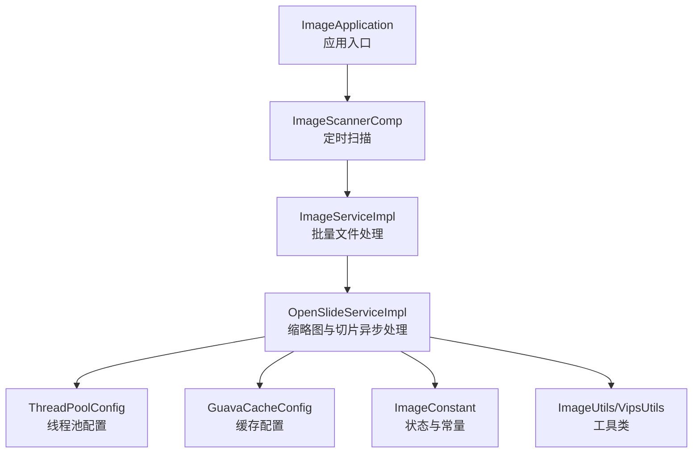
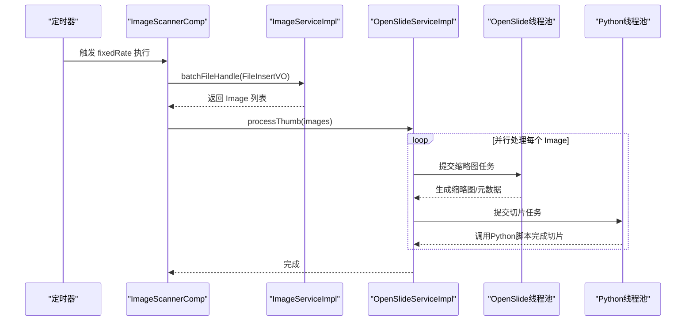
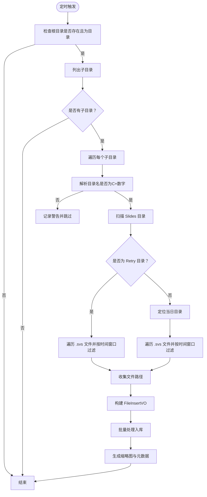
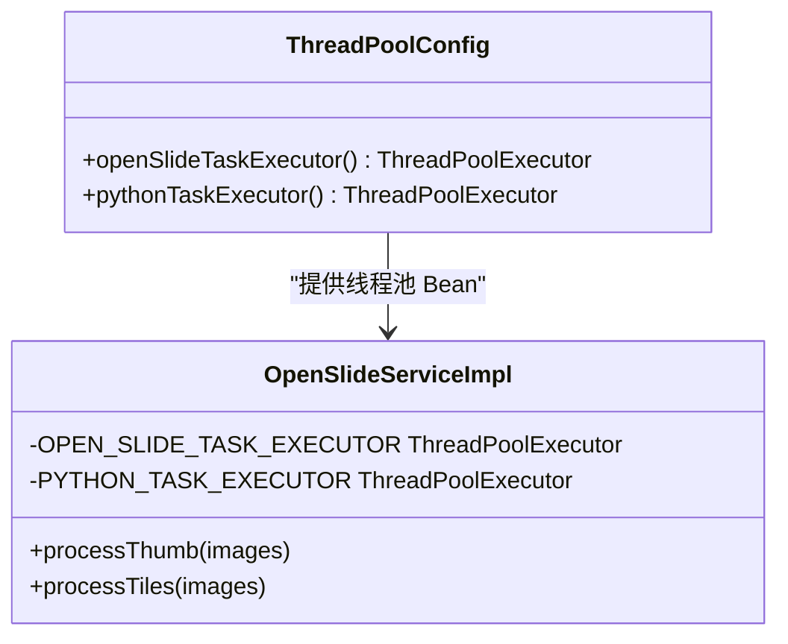
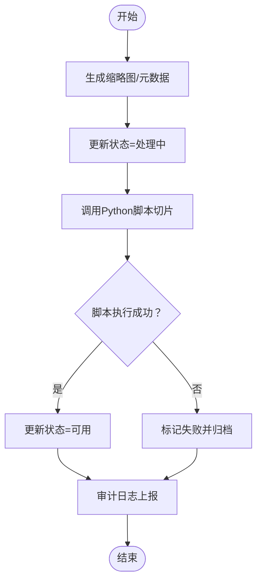
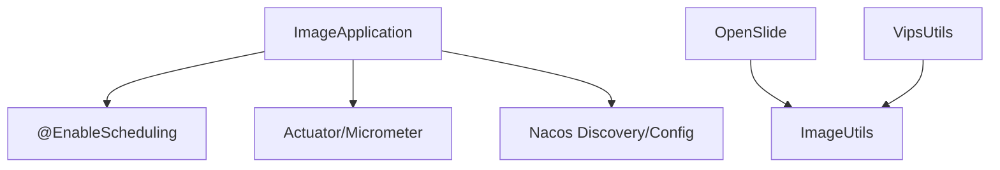

# 异步处理系统

<cite>
**本文引用的文件**
- [ImageScannerComp.java](file://src/main/java/cn/staitech/file/scheduled/ImageScannerComp.java)
- [ThreadPoolConfig.java](file://src/main/java/cn/staitech/file/config/ThreadPoolConfig.java)
- [GuavaCacheConfig.java](file://src/main/java/cn/staitech/file/config/GuavaCacheConfig.java)
- [ImageServiceImpl.java](file://src/main/java/cn/staitech/file/service/impl/ImageServiceImpl.java)
- [OpenSlideServiceImpl.java](file://src/main/java/cn/staitech/file/service/impl/OpenSlideServiceImpl.java)
- [ImageConstant.java](file://src/main/java/cn/staitech/file/constant/ImageConstant.java)
- [Image.java](file://src/main/java/cn/staitech/file/domain/Image.java)
- [ImageUtils.java](file://src/main/java/cn/staitech/file/util/ImageUtils.java)
- [VipsUtils.java](file://src/main/java/cn/staitech/file/util/VipsUtils.java)
- [bootstrap.yml](file://src/main/resources/bootstrap.yml)
- [ImageApplication.java](file://src/main/java/cn/staitech/ImageApplication.java)
- [pom.xml](file://pom.xml)
</cite>

## 目录
1. [简介](#简介)
2. [项目结构](#项目结构)
3. [核心组件](#核心组件)
4. [架构总览](#架构总览)
5. [详细组件分析](#详细组件分析)
6. [依赖分析](#依赖分析)
7. [性能考量](#性能考量)
8. [故障排查指南](#故障排查指南)
9. [结论](#结论)
10. [附录](#附录)

## 简介
本文件面向 PACMVS 项目的异步处理系统，围绕以下目标展开：
- 深入解释 ImageScannerComp 定时扫描组件的工作原理与调度策略
- 详述 ThreadPoolConfig 线程池配置参数、任务队列管理与并发控制机制
- 说明 GuavaCacheConfig 缓存配置、缓存策略与性能优化方案
- 涵盖异步任务生命周期管理、错误恢复机制与监控指标
- 提供任务优先级设置、资源限制与负载均衡的配置指南
- 解释异步处理与同步处理的协调机制与数据一致性保障

## 项目结构
该项目采用基于功能域的分层组织方式，异步处理相关的关键模块集中在以下包与类：
- 定时扫描：cn.staitech.file.scheduled.ImageScannerComp
- 线程池配置：cn.staitech.file.config.ThreadPoolConfig
- 缓存配置：cn.staitech.file.config.GuavaCacheConfig
- 业务服务：cn.staitech.file.service.impl.ImageServiceImpl、OpenSlideServiceImpl
- 常量与实体：cn.staitech.file.constant.ImageConstant、cn.staitech.file.domain.Image
- 工具类：cn.staitech.file.util.ImageUtils、VipsUtils
- 启动与配置：cn.staitech.ImageApplication、bootstrap.yml、pom.xml

图表来源
- [ImageApplication.java:27-36](file://src/main/java/cn/staitech/ImageApplication.java#L27-L36)
- [ImageScannerComp.java:34-74](file://src/main/java/cn/staitech/file/scheduled/ImageScannerComp.java#L34-L74)
- [ImageServiceImpl.java:64-140](file://src/main/java/cn/staitech/file/service/impl/ImageServiceImpl.java#L64-L140)
- [OpenSlideServiceImpl.java:68-72](file://src/main/java/cn/staitech/file/service/impl/OpenSlideServiceImpl.java#L68-L72)
- [ThreadPoolConfig.java:18-64](file://src/main/java/cn/staitech/file/config/ThreadPoolConfig.java#L18-L64)
- [GuavaCacheConfig.java:19-25](file://src/main/java/cn/staitech/file/config/GuavaCacheConfig.java#L19-L25)
- [ImageConstant.java:20-38](file://src/main/java/cn/staitech/file/constant/ImageConstant.java#L20-L38)
- [ImageUtils.java:52-97](file://src/main/java/cn/staitech/file/util/ImageUtils.java#L52-L97)
- [VipsUtils.java:22-35](file://src/main/java/cn/staitech/file/util/VipsUtils.java#L22-L35)

章节来源
- [ImageApplication.java:27-36](file://src/main/java/cn/staitech/ImageApplication.java#L27-L36)
- [bootstrap.yml:14-37](file://src/main/resources/bootstrap.yml#L14-L37)
- [pom.xml:23-200](file://pom.xml#L23-L200)

## 核心组件
- ImageScannerComp：基于固定周期的定时扫描，解析机构目录、扫描“Slides/Retry”等子目录，收集 .svs 图像文件，构建批量插入请求并触发后续异步处理链。
- ThreadPoolConfig：定义两个专用线程池：
  - OpenSlide-Thread-Pool：用于缩略图生成与元数据解析等 I/O 密集型任务
  - Python-Thread-Pool：用于调用 Python 切片脚本，执行耗时的磁盘 IO 与计算
- GuavaCacheConfig：提供轻量内存缓存，限制容量与过期时间，提升热点数据访问性能。
- OpenSlideServiceImpl：实现缩略图生成、切片任务提交、失败文件归档与审计日志上报，贯穿异步生命周期。
- ImageServiceImpl：负责批量文件插入、去重校验、状态流转与数据库持久化。

章节来源
- [ImageScannerComp.java:34-74](file://src/main/java/cn/staitech/file/scheduled/ImageScannerComp.java#L34-L74)
- [ThreadPoolConfig.java:18-64](file://src/main/java/cn/staitech/file/config/ThreadPoolConfig.java#L18-L64)
- [GuavaCacheConfig.java:19-25](file://src/main/java/cn/staitech/file/config/GuavaCacheConfig.java#L19-L25)
- [OpenSlideServiceImpl.java:277-339](file://src/main/java/cn/staitech/file/service/impl/OpenSlideServiceImpl.java#L277-L339)
- [ImageServiceImpl.java:64-140](file://src/main/java/cn/staitech/file/service/impl/ImageServiceImpl.java#L64-L140)

## 架构总览
异步处理系统由“定时扫描 → 批量入库 → 异步缩略图 → 异步切片”构成的流水线，配合线程池隔离与缓存优化，确保高吞吐与稳定性。

图表来源
- [ImageScannerComp.java:34-74](file://src/main/java/cn/staitech/file/scheduled/ImageScannerComp.java#L34-L74)
- [ImageServiceImpl.java:64-140](file://src/main/java/cn/staitech/file/service/impl/ImageServiceImpl.java#L64-L140)
- [OpenSlideServiceImpl.java:277-339](file://src/main/java/cn/staitech/file/service/impl/OpenSlideServiceImpl.java#L277-L339)
- [ThreadPoolConfig.java:18-64](file://src/main/java/cn/staitech/file/config/ThreadPoolConfig.java#L18-L64)

## 详细组件分析

### ImageScannerComp 定时扫描组件
- 调度策略
  - 使用固定周期调度，当前配置为每小时一次；开发调试时可切换为更短周期以便观察。
  - 从本地根目录扫描以“C”开头的机构目录，解析数字作为组织 ID。
- 目录扫描逻辑
  - 限定扫描 Slides 子目录，过滤 Retry 与当日目录，仅收集 .svs 文件。
  - 对重试目录中的文件进行时间窗口过滤（仅处理早于一小时前的文件），避免重复处理。
- 生命周期
  - 收集到文件路径后，构造 FileInsertVO，调用批量处理与缩略图生成，形成完整的异步链路入口。

图表来源
- [ImageScannerComp.java:34-74](file://src/main/java/cn/staitech/file/scheduled/ImageScannerComp.java#L34-L74)
- [ImageScannerComp.java:82-168](file://src/main/java/cn/staitech/file/scheduled/ImageScannerComp.java#L82-L168)

章节来源
- [ImageScannerComp.java:34-74](file://src/main/java/cn/staitech/file/scheduled/ImageScannerComp.java#L34-L74)
- [ImageScannerComp.java:82-168](file://src/main/java/cn/staitech/file/scheduled/ImageScannerComp.java#L82-L168)

### ThreadPoolConfig 线程池配置与并发控制
- OpenSlide-Thread-Pool
  - 核心线程数：CPU 核数 + 1
  - 最大线程数：CPU 核数 × 2
  - 队列：ArrayBlockingQueue(100000)，有界队列，防止内存膨胀
  - 拒绝策略：调用线程执行（CallerRunsPolicy 变体），降低丢任务风险
- Python-Thread-Pool
  - 核心/最大线程数：按 CPU 核数的极小比例分配，确保 I/O 密集场景下不过度并发
  - 队列与拒绝策略同上
- 并发控制要点
  - 通过注入不同线程池隔离不同类型任务，避免相互影响
  - 有界队列 + 拒绝策略，结合日志告警，便于容量规划与限流

图表来源
- [ThreadPoolConfig.java:18-64](file://src/main/java/cn/staitech/file/config/ThreadPoolConfig.java#L18-L64)
- [OpenSlideServiceImpl.java:68-72](file://src/main/java/cn/staitech/file/service/impl/OpenSlideServiceImpl.java#L68-L72)

章节来源
- [ThreadPoolConfig.java:18-64](file://src/main/java/cn/staitech/file/config/ThreadPoolConfig.java#L18-L64)
- [OpenSlideServiceImpl.java:277-339](file://src/main/java/cn/staitech/file/service/impl/OpenSlideServiceImpl.java#L277-L339)

### GuavaCacheConfig 缓存配置与性能优化
- 配置要点
  - 最大容量：100
  - 写入后过期：1 小时
- 适用场景
  - 缓存热点元数据、临时状态或轻量计算结果，减少重复计算与 I/O
- 性能建议
  - 结合业务热点数据维度评估容量与过期时间
  - 对于高并发场景，建议配合本地缓存与分布式缓存策略

章节来源
- [GuavaCacheConfig.java:19-25](file://src/main/java/cn/staitech/file/config/GuavaCacheConfig.java#L19-L25)

### 异步任务生命周期与错误恢复
- 生命周期阶段
  - 缩略图生成：生成缩略图与元数据，更新状态为“处理中”
  - 切片任务：调用 Python 脚本生成金字塔切片，完成后更新为“可用”
  - 失败处理：状态标记为失败，文件移动至 Failed 目录，审计日志上报
- 错误恢复
  - 缩略图/元数据解析失败：回滚状态并归档
  - 切片失败：标记失败并归档，支持重试接口 reparse
- 数据一致性
  - 所有状态更新均通过数据库持久化，保证最终一致
  - 事务边界覆盖批量入库与状态变更，避免中间态污染

图表来源
- [OpenSlideServiceImpl.java:277-339](file://src/main/java/cn/staitech/file/service/impl/OpenSlideServiceImpl.java#L277-L339)
- [OpenSlideServiceImpl.java:399-454](file://src/main/java/cn/staitech/file/service/impl/OpenSlideServiceImpl.java#L399-L454)
- [ImageConstant.java:20-31](file://src/main/java/cn/staitech/file/constant/ImageConstant.java#L20-L31)

章节来源
- [OpenSlideServiceImpl.java:277-339](file://src/main/java/cn/staitech/file/service/impl/OpenSlideServiceImpl.java#L277-L339)
- [OpenSlideServiceImpl.java:399-454](file://src/main/java/cn/staitech/file/service/impl/OpenSlideServiceImpl.java#L399-L454)
- [ImageConstant.java:20-31](file://src/main/java/cn/staitech/file/constant/ImageConstant.java#L20-L31)

### 与同步处理的协调与数据一致性
- 同步入口：ImageScannerComp 的扫描与批量入库在定时任务中串行执行，确保扫描与入库的顺序性
- 异步处理：缩略图与切片在独立线程池中并行执行，通过状态字段与数据库持久化实现最终一致
- 事务边界：ImageServiceImpl 的批量入库使用事务，避免重复处理与脏数据

章节来源
- [ImageScannerComp.java:60-63](file://src/main/java/cn/staitech/file/scheduled/ImageScannerComp.java#L60-L63)
- [ImageServiceImpl.java:64-140](file://src/main/java/cn/staitech/file/service/impl/ImageServiceImpl.java#L64-L140)

## 依赖分析
- 启动与调度
  - 应用入口启用调度、发现、事务与监控能力
- 外部依赖
  - OpenSlide、OpenCV、Vips 工具链用于图像解析与转换
  - Prometheus Micrometer 用于指标暴露
- 配置中心
  - Nacos 配置与服务发现集成

图表来源
- [ImageApplication.java:27-36](file://src/main/java/cn/staitech/ImageApplication.java#L27-L36)
- [ImageApplication.java:47-50](file://src/main/java/cn/staitech/ImageApplication.java#L47-L50)
- [ImageUtils.java:52-97](file://src/main/java/cn/staitech/file/util/ImageUtils.java#L52-L97)
- [VipsUtils.java:22-35](file://src/main/java/cn/staitech/file/util/VipsUtils.java#L22-L35)
- [pom.xml:23-200](file://pom.xml#L23-L200)

章节来源
- [ImageApplication.java:27-36](file://src/main/java/cn/staitech/ImageApplication.java#L27-L36)
- [pom.xml:23-200](file://pom.xml#L23-L200)

## 性能考量
- 线程池容量
  - OpenSlide-Thread-Pool：I/O 密集，核心线程数与队列容量适配磁盘与 OpenSlide 解析开销
  - Python-Thread-Pool：限制并发，避免磁盘与 Python 进程竞争
- 任务队列
  - 有界队列 + 拒绝策略，防止内存溢出；可通过日志监控队列积压
- 缓存
  - GuavaCacheConfig 适合短期热点数据；建议结合业务热点评估容量与过期时间
- I/O 优化
  - ImageUtils 中对 OpenSlide 元数据进行二次加载与校验，避免无效解析
  - VipsUtils 将非金字塔格式转换为金字塔 TIFF，提升前端渲染性能

章节来源
- [ThreadPoolConfig.java:18-64](file://src/main/java/cn/staitech/file/config/ThreadPoolConfig.java#L18-L64)
- [GuavaCacheConfig.java:19-25](file://src/main/java/cn/staitech/file/config/GuavaCacheConfig.java#L19-L25)
- [ImageUtils.java:52-97](file://src/main/java/cn/staitech/file/util/ImageUtils.java#L52-L97)
- [VipsUtils.java:22-35](file://src/main/java/cn/staitech/file/util/VipsUtils.java#L22-L35)

## 故障排查指南
- 定时扫描无结果
  - 检查根目录配置与权限，确认 Slides/Retry/当日目录结构
  - 查看扫描日志，关注“目录不存在/目录为空”的告警
- 缩略图生成失败
  - 检查 OpenSlide 解析与元数据读取，确认文件格式与路径
  - 关注状态是否更新为“解析失败”，并检查 Failed 目录
- 切片任务失败
  - 检查 Python 脚本路径与可执行权限，确认返回码
  - 关注状态是否更新为“处理失败”，并检查 Failed 目录
- 线程池积压
  - 监控队列长度与拒绝次数，评估线程池容量与任务耗时
- 审计与可观测性
  - 通过 Micrometer 暴露指标，结合日志审计接口定位问题

章节来源
- [ImageScannerComp.java:40-49](file://src/main/java/cn/staitech/file/scheduled/ImageScannerComp.java#L40-L49)
- [OpenSlideServiceImpl.java:188-200](file://src/main/java/cn/staitech/file/service/impl/OpenSlideServiceImpl.java#L188-L200)
- [OpenSlideServiceImpl.java:329-338](file://src/main/java/cn/staitech/file/service/impl/OpenSlideServiceImpl.java#L329-L338)
- [OpenSlideServiceImpl.java:457-477](file://src/main/java/cn/staitech/file/service/impl/OpenSlideServiceImpl.java#L457-L477)
- [ImageApplication.java:47-50](file://src/main/java/cn/staitech/ImageApplication.java#L47-L50)

## 结论
本异步处理系统通过“定时扫描 + 批量入库 + 异步缩略图 + 异步切片”的流水线，结合专用线程池与轻量缓存，在保证数据一致性的同时实现了高吞吐与高可用。建议在生产环境中持续监控线程池队列与任务耗时，动态调整线程池容量与缓存策略，并完善重试与告警机制以提升稳定性。

## 附录
- 配置与环境
  - 应用端口、Nacos 服务发现与配置中心参数见 bootstrap.yml
  - 依赖项（OpenSlide、OpenCV、Vips、Micrometer）见 pom.xml
- 数据模型
  - Image 实体包含状态、尺寸、分辨率、路径等字段，支撑异步处理与前端展示

章节来源
- [bootstrap.yml:14-37](file://src/main/resources/bootstrap.yml#L14-L37)
- [pom.xml:23-200](file://pom.xml#L23-L200)
- [Image.java:27-216](file://src/main/java/cn/staitech/file/domain/Image.java#L27-L216)