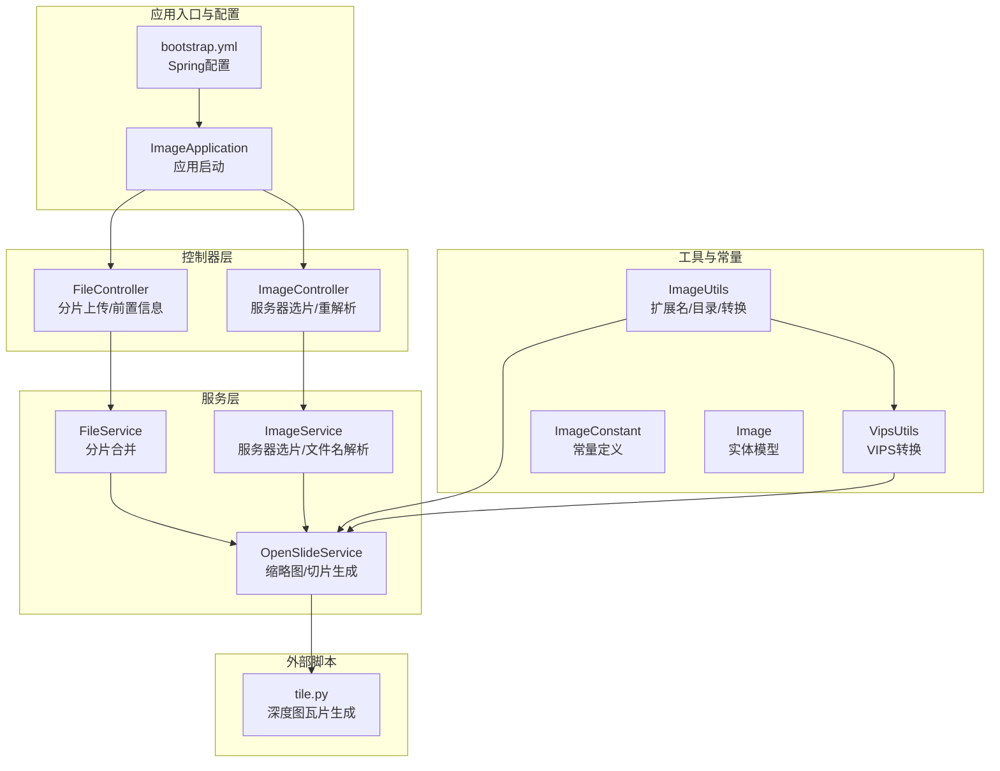
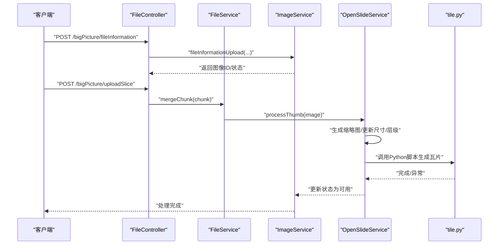
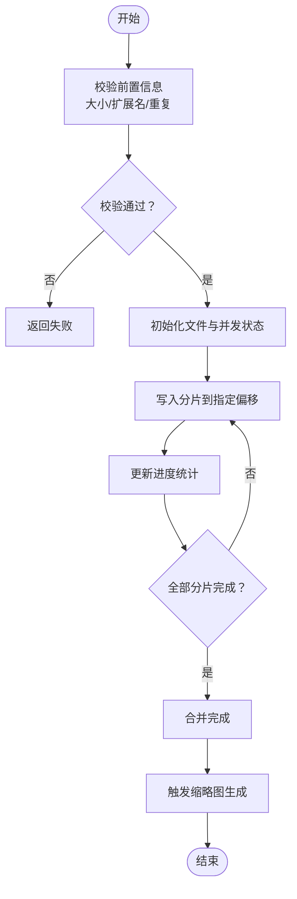
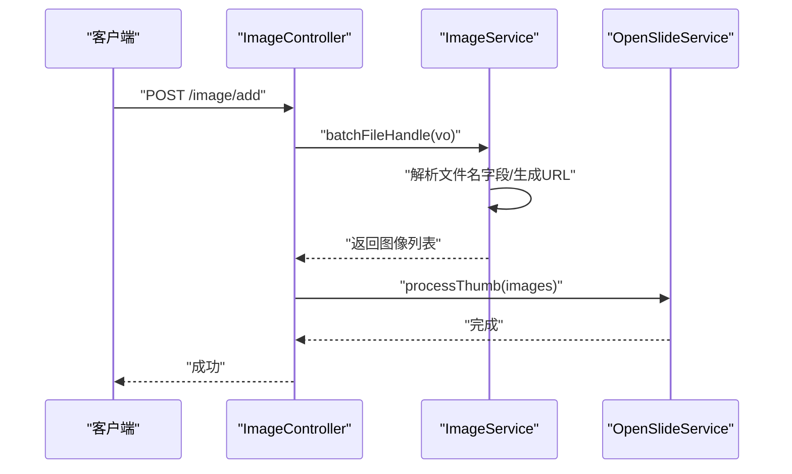
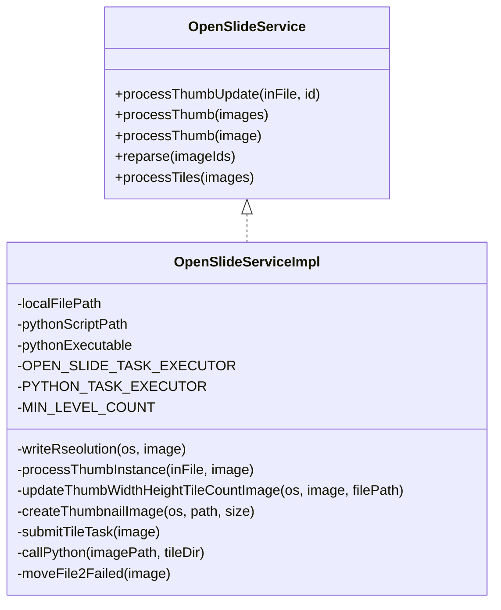
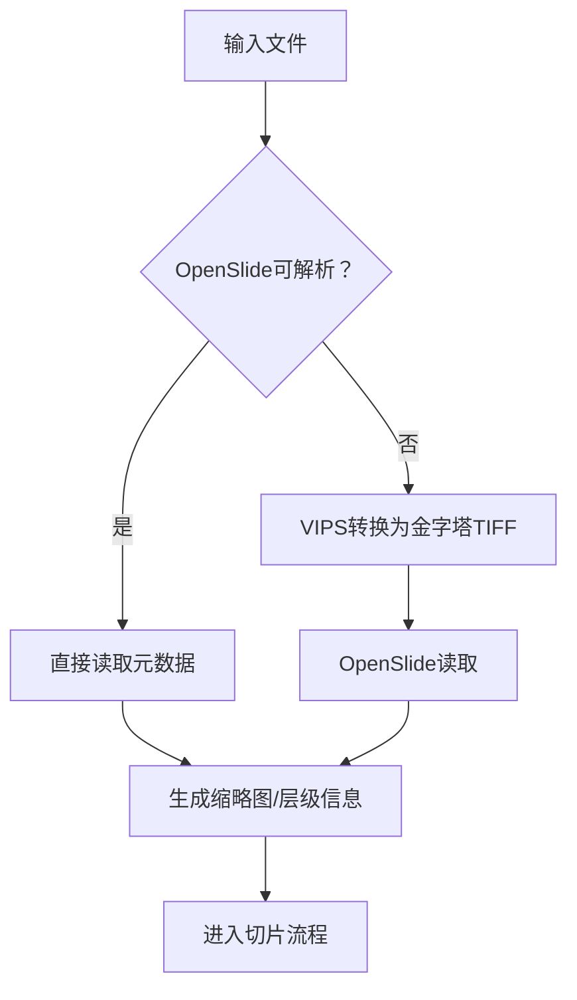
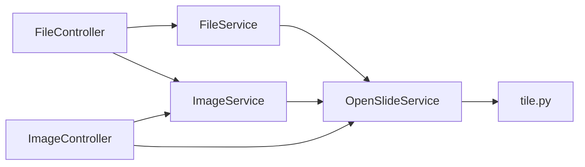
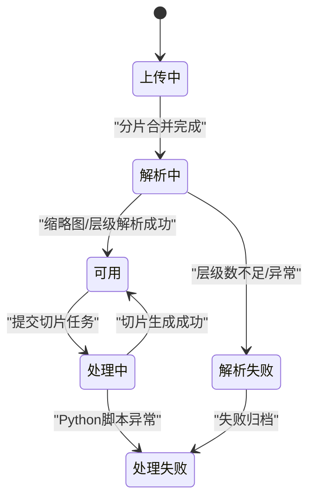

# 核心功能模块

<cite>
**本文引用的文件**
- [ImageApplication.java](file://src/main/java/cn/staitech/ImageApplication.java)
- [FileController.java](file://src/main/java/cn/staitech/file/controller/FileController.java)
- [ImageController.java](file://src/main/java/cn/staitech/file/controller/ImageController.java)
- [OpenSlideService.java](file://src/main/java/cn/staitech/file/service/OpenSlideService.java)
- [OpenSlideServiceImpl.java](file://src/main/java/cn/staitech/file/service/impl/OpenSlideServiceImpl.java)
- [ImageService.java](file://src/main/java/cn/staitech/file/service/ImageService.java)
- [ImageServiceImpl.java](file://src/main/java/cn/staitech/file/service/impl/ImageServiceImpl.java)
- [FileService.java](file://src/main/java/cn/staitech/file/service/FileService.java)
- [FileServiceImpl.java](file://src/main/java/cn/staitech/file/service/impl/FileServiceImpl.java)
- [ImageUtils.java](file://src/main/java/cn/staitech/file/util/ImageUtils.java)
- [VipsUtils.java](file://src/main/java/cn/staitech/file/util/VipsUtils.java)
- [Image.java](file://src/main/java/cn/staitech/file/domain/Image.java)
- [ImageConstant.java](file://src/main/java/cn/staitech/file/constant/ImageConstant.java)
- [bootstrap.yml](file://src/main/resources/bootstrap.yml)
- [tile.py](file://python-script/tile.py)
</cite>

## 目录
1. [简介](#简介)
2. [项目结构](#项目结构)
3. [核心组件](#核心组件)
4. [架构总览](#架构总览)
5. [详细组件分析](#详细组件分析)
6. [依赖关系分析](#依赖关系分析)
7. [性能考量](#性能考量)
8. [故障排查指南](#故障排查指南)
9. [结论](#结论)
10. [附录](#附录)

## 简介
本文件聚焦 PACMVS 图像服务模块的核心能力：切片文件管理、图像处理与 OpenSlide 集成、图像金字塔与缩略图生成、以及多格式图像支持策略。文档面向开发者，提供模块职责、数据流、关键算法、配置项与扩展建议，帮助快速理解与二次开发。

## 项目结构
- 应用入口与配置
  - 应用启动类负责启用调度、WebSocket、安全与监控等能力。
  - Spring Boot 配置集中于 bootstrap.yml，包含端口、文件上传大小限制、Nacos 注册与配置中心等。
- 控制器层
  - 文件上传控制器：支持分片上传与前置信息登记。
  - 图像控制器：提供服务器选片、重解析失败切片、查询原始切片等接口。
- 服务层
  - 文件服务：实现断点续传与分片合并。
  - 图像服务：负责服务器选片批量入库、文件名解析、URL 生成与专题关联。
  - OpenSlide 服务：负责缩略图生成、金字塔切片生成、失败文件归档与日志审计。
- 工具与常量
  - 图像工具：文件扩展名校验、目录检查、OpenSlide 兼容转换（VIPS）。
  - 常量：状态码、文件大小限制、缩略图基础目录等。
- Python 切片脚本
  - 基于 OpenSlide 的深度图生成器，按层级并发输出 Zoomify 格式瓦片。

图表来源
- [ImageApplication.java:37-52](file://src/main/java/cn/staitech/ImageApplication.java#L37-L52)
- [bootstrap.yml:1-37](file://src/main/resources/bootstrap.yml#L1-L37)
- [FileController.java:38-129](file://src/main/java/cn/staitech/file/controller/FileController.java#L38-L129)
- [ImageController.java:27-71](file://src/main/java/cn/staitech/file/controller/ImageController.java#L27-L71)
- [FileService.java:1-10](file://src/main/java/cn/staitech/file/service/FileService.java#L1-L10)
- [ImageService.java:17-23](file://src/main/java/cn/staitech/file/service/ImageService.java#L17-L23)
- [OpenSlideService.java:14-39](file://src/main/java/cn/staitech/file/service/OpenSlideService.java#L14-L39)
- [ImageUtils.java:20-148](file://src/main/java/cn/staitech/file/util/ImageUtils.java#L20-L148)
- [VipsUtils.java:11-37](file://src/main/java/cn/staitech/file/util/VipsUtils.java#L11-L37)
- [Image.java:27-216](file://src/main/java/cn/staitech/file/domain/Image.java#L27-L216)
- [ImageConstant.java:9-67](file://src/main/java/cn/staitech/file/constant/ImageConstant.java#L9-L67)
- [tile.py:1-103](file://python-script/tile.py#L1-L103)

章节来源
- [ImageApplication.java:37-52](file://src/main/java/cn/staitech/ImageApplication.java#L37-L52)
- [bootstrap.yml:1-37](file://src/main/resources/bootstrap.yml#L1-L37)

## 核心组件
- 切片文件管理
  - 分片上传与合并：基于随机访问写入与并发状态控制，支持断点续传与超时回收。
  - 前置信息登记：校验扩展名与大小，去重校验，生成图像实体并落库。
- 图像处理服务
  - 服务器选片：批量导入本地文件，解析文件名字段，生成缩略图与缓存路径，建立专题关联。
  - OpenSlide 集成：兼容 OpenSlide 解析，不支持格式通过 VIPS 转换为金字塔 TIFF。
- 图像格式支持
  - 支持格式：SVS、NDPI、TIFF/TIF、ZVI、SCN、BMP、GIF、JPG/JPEG、PNG。
  - 不支持格式：自动转换为可解析的金字塔 TIFF。
- 关键技术特性
  - OpenSlide 集成：读取分辨率、物镜倍数、层级数与瓦片计数。
  - 图像金字塔与缩略图：生成 256×256 与 1024×1024 缩略图，缓存标注场景使用。
  - Python 切片：基于 OpenSlide DeepZoom 生成 Zoomify 瓦片，多线程并发控制。

章节来源
- [FileController.java:58-85](file://src/main/java/cn/staitech/file/controller/FileController.java#L58-L85)
- [FileController.java:97-127](file://src/main/java/cn/staitech/file/controller/FileController.java#L97-L127)
- [FileServiceImpl.java:53-146](file://src/main/java/cn/staitech/file/service/impl/FileServiceImpl.java#L53-L146)
- [ImageServiceImpl.java:63-140](file://src/main/java/cn/staitech/file/service/impl/ImageServiceImpl.java#L63-L140)
- [ImageUtils.java:52-97](file://src/main/java/cn/staitech/file/util/ImageUtils.java#L52-L97)
- [VipsUtils.java:22-35](file://src/main/java/cn/staitech/file/util/VipsUtils.java#L22-L35)
- [OpenSlideServiceImpl.java:140-202](file://src/main/java/cn/staitech/file/service/impl/OpenSlideServiceImpl.java#L140-L202)
- [OpenSlideServiceImpl.java:277-312](file://src/main/java/cn/staitech/file/service/impl/OpenSlideServiceImpl.java#L277-L312)
- [OpenSlideServiceImpl.java:347-378](file://src/main/java/cn/staitech/file/service/impl/OpenSlideServiceImpl.java#L347-L378)
- [tile.py:17-83](file://python-script/tile.py#L17-L83)

## 架构总览
整体采用“控制器-服务-工具-外部脚本”的分层架构。文件上传与服务器选片两条主路径最终汇聚到 OpenSlide 服务，由 OpenSlide 服务协调缩略图生成与 Python 切片脚本执行，形成从原始切片到金字塔瓦片的完整处理链路。

图表来源
- [FileController.java:58-85](file://src/main/java/cn/staitech/file/controller/FileController.java#L58-L85)
- [FileController.java:97-127](file://src/main/java/cn/staitech/file/controller/FileController.java#L97-L127)
- [FileServiceImpl.java:134-142](file://src/main/java/cn/staitech/file/service/impl/FileServiceImpl.java#L134-L142)
- [ImageController.java:42-48](file://src/main/java/cn/staitech/file/controller/ImageController.java#L42-L48)
- [OpenSlideServiceImpl.java:319-339](file://src/main/java/cn/staitech/file/service/impl/OpenSlideServiceImpl.java#L319-L339)
- [tile.py:84-100](file://python-script/tile.py#L84-L100)

## 详细组件分析

### 切片文件管理（分片上传与合并）
- 设计要点
  - 并发控制：使用原子引用数组记录分片写入状态，避免重复写入与竞态。
  - 断点续传：基于分片序号与大小计算写入偏移，支持网络抖动恢复。
  - 超时回收：定时任务检测长时间“上传中”状态并回滚清理。
- 关键流程
  - 前置信息校验：大小限制、扩展名白名单、重复校验。
  - 分片写入：随机访问文件定位写入，更新进度。
  - 合并完成：触发缩略图生成与后续处理。
- 错误处理
  - 文件不存在、权限不足、IO 异常均进行回滚与清理。
  - 超时任务自动置为失败并删除临时文件。

图表来源
- [FileController.java:58-85](file://src/main/java/cn/staitech/file/controller/FileController.java#L58-L85)
- [FileController.java:97-127](file://src/main/java/cn/staitech/file/controller/FileController.java#L97-L127)
- [FileServiceImpl.java:53-146](file://src/main/java/cn/staitech/file/service/impl/FileServiceImpl.java#L53-L146)

章节来源
- [FileController.java:58-85](file://src/main/java/cn/staitech/file/controller/FileController.java#L58-L85)
- [FileController.java:97-127](file://src/main/java/cn/staitech/file/controller/FileController.java#L97-L127)
- [FileServiceImpl.java:53-146](file://src/main/java/cn/staitech/file/service/impl/FileServiceImpl.java#L53-L146)

### 服务器选片与文件名解析
- 批量导入
  - 校验文件路径有效性与可读性，过滤已存在记录，逐条创建图像实体。
  - 解析文件名字段：专题号、动物号、蜡块号、组号与性别、解剖期限等。
- URL 生成
  - 生成缩略图、宏图、标签图、缓存缩略图等相对路径，统一挂载到静态目录。
- 专题关联
  - 若专题不存在则自动创建并绑定组织上下文。

图表来源
- [ImageController.java:42-48](file://src/main/java/cn/staitech/file/controller/ImageController.java#L42-L48)
- [ImageServiceImpl.java:63-140](file://src/main/java/cn/staitech/file/service/impl/ImageServiceImpl.java#L63-L140)
- [OpenSlideServiceImpl.java:277-312](file://src/main/java/cn/staitech/file/service/impl/OpenSlideServiceImpl.java#L277-L312)

章节来源
- [ImageController.java:42-48](file://src/main/java/cn/staitech/file/controller/ImageController.java#L42-L48)
- [ImageServiceImpl.java:63-140](file://src/main/java/cn/staitech/file/service/impl/ImageServiceImpl.java#L63-L140)
- [ImageServiceImpl.java:349-484](file://src/main/java/cn/staitech/file/service/impl/ImageServiceImpl.java#L349-L484)

### OpenSlide 集成与图像金字塔生成
- OpenSlide 解析
  - 读取分辨率（X/Y）、物镜倍数、层级数与每层瓦片数，更新图像元数据。
  - 层级数小于阈值判定为解析失败。
- 缩略图生成
  - 生成 256×256 与 1024×1024 缩略图，分别用于浏览与标注缓存。
- Python 切片
  - 基于 DeepZoom 生成 Zoomify 瓦片，多线程并发控制，限制待处理任务数量。
- 失败处理
  - 解析失败或切片失败移动到失败目录，记录审计日志。

图表来源
- [OpenSlideService.java:14-39](file://src/main/java/cn/staitech/file/service/OpenSlideService.java#L14-L39)
- [OpenSlideServiceImpl.java:47-563](file://src/main/java/cn/staitech/file/service/impl/OpenSlideServiceImpl.java#L47-L563)

章节来源
- [OpenSlideServiceImpl.java:87-130](file://src/main/java/cn/staitech/file/service/impl/OpenSlideServiceImpl.java#L87-L130)
- [OpenSlideServiceImpl.java:149-202](file://src/main/java/cn/staitech/file/service/impl/OpenSlideServiceImpl.java#L149-L202)
- [OpenSlideServiceImpl.java:212-232](file://src/main/java/cn/staitech/file/service/impl/OpenSlideServiceImpl.java#L212-L232)
- [OpenSlideServiceImpl.java:242-256](file://src/main/java/cn/staitech/file/service/impl/OpenSlideServiceImpl.java#L242-L256)
- [OpenSlideServiceImpl.java:319-339](file://src/main/java/cn/staitech/file/service/impl/OpenSlideServiceImpl.java#L319-L339)
- [tile.py:17-83](file://python-script/tile.py#L17-L83)

### 图像格式支持与转换
- 支持格式
  - 白名单：SVS、NDPI、TIFF/TIF、ZVI、SCN、BMP、GIF、JPG/JPEG、PNG。
- 不支持格式
  - 自动通过 VIPS 转换为金字塔 TIFF，再由 OpenSlide 读取。
- 目录与路径
  - 目录不存在时自动创建，保证写入与读取稳定。

图表来源
- [ImageUtils.java:52-97](file://src/main/java/cn/staitech/file/util/ImageUtils.java#L52-L97)
- [VipsUtils.java:22-35](file://src/main/java/cn/staitech/file/util/VipsUtils.java#L22-L35)
- [ImageUtils.java:37-43](file://src/main/java/cn/staitech/file/util/ImageUtils.java#L37-L43)

章节来源
- [ImageUtils.java:23-31](file://src/main/java/cn/staitech/file/util/ImageUtils.java#L23-L31)
- [ImageUtils.java:105-114](file://src/main/java/cn/staitech/file/util/ImageUtils.java#L105-L114)
- [ImageUtils.java:52-97](file://src/main/java/cn/staitech/file/util/ImageUtils.java#L52-L97)
- [VipsUtils.java:22-35](file://src/main/java/cn/staitech/file/util/VipsUtils.java#L22-L35)

## 依赖关系分析
- 组件耦合
  - FileController 依赖 FileService 与 ImageService。
  - ImageController 依赖 ImageService 与 OpenSlideService。
  - FileService 与 ImageService 在 OpenSlideService 中协同工作。
- 外部依赖
  - OpenSlide Java 绑定与 Python 脚本。
  - Nacos 注册与配置中心（由 bootstrap.yml 配置）。
- 线程与并发
  - OpenSlide 与 Python 任务分别由独立线程池执行，避免阻塞。

图表来源
- [FileController.java:47-50](file://src/main/java/cn/staitech/file/controller/FileController.java#L47-L50)
- [ImageController.java:32-34](file://src/main/java/cn/staitech/file/controller/ImageController.java#L32-L34)
- [FileServiceImpl.java:36-38](file://src/main/java/cn/staitech/file/service/impl/FileServiceImpl.java#L36-L38)
- [OpenSlideServiceImpl.java:67-72](file://src/main/java/cn/staitech/file/service/impl/OpenSlideServiceImpl.java#L67-L72)
- [tile.py:1-14](file://python-script/tile.py#L1-L14)

章节来源
- [bootstrap.yml:17-34](file://src/main/resources/bootstrap.yml#L17-L34)

## 性能考量
- 并发与限流
  - Python 切片阶段使用线程池与有界队列控制并发任务数量，避免内存峰值过高。
  - OpenSlide 任务与 Python 任务分离，降低相互影响。
- 缓存与缩略图
  - 生成 1024×1024 缩略图用于缓存与标注场景，减少高分辨率读取压力。
- I/O 优化
  - 分片写入采用随机访问定位，避免重复 IO。
  - 目录预创建减少运行时创建开销。
- 资源回收
  - OpenSlide 对象在 finally 中关闭，防止资源泄漏。
  - 失败文件移动到失败目录，避免污染主存储。

章节来源
- [OpenSlideServiceImpl.java:319-339](file://src/main/java/cn/staitech/file/service/impl/OpenSlideServiceImpl.java#L319-L339)
- [tile.py:32-78](file://python-script/tile.py#L32-L78)
- [FileServiceImpl.java:104-120](file://src/main/java/cn/staitech/file/service/impl/FileServiceImpl.java#L104-L120)
- [OpenSlideServiceImpl.java:191-200](file://src/main/java/cn/staitech/file/service/impl/OpenSlideServiceImpl.java#L191-L200)

## 故障排查指南
- 常见问题与定位
  - OpenSlide 解析失败：检查文件是否为支持格式或是否需转换为金字塔 TIFF。
  - Python 脚本执行失败：确认 Python 可执行路径与脚本路径配置正确，查看进程退出码。
  - 缩略图生成失败：确认目标目录可写，层级数是否满足阈值要求。
  - 分片上传超时：检查定时任务是否清理“上传中”状态，确认网络稳定性。
- 日志与审计
  - OpenSlide 服务记录图像处理日志并上报审计系统，便于追踪失败原因。
- 失败文件处理
  - 自动移动到失败目录，支持人工复检与重试。

章节来源
- [OpenSlideServiceImpl.java:260-268](file://src/main/java/cn/staitech/file/service/impl/OpenSlideServiceImpl.java#L260-L268)
- [OpenSlideServiceImpl.java:399-454](file://src/main/java/cn/staitech/file/service/impl/OpenSlideServiceImpl.java#L399-L454)
- [OpenSlideServiceImpl.java:487-535](file://src/main/java/cn/staitech/file/service/impl/OpenSlideServiceImpl.java#L487-L535)
- [FileServiceImpl.java:152-177](file://src/main/java/cn/staitech/file/service/impl/FileServiceImpl.java#L152-L177)

## 结论
本模块围绕“原始切片解析与金字塔生成”构建，通过 OpenSlide 与 Python 脚本实现跨格式兼容与高效瓦片化，结合分片上传与服务器选片能力，形成从文件管理到可视化渲染的完整闭环。建议在生产环境关注并发参数、磁盘空间与缓存策略，以获得更稳定的吞吐与更低的延迟。

## 附录

### 配置项与参数说明
- 应用配置（bootstrap.yml）
  - 服务器端口、文件上传大小限制、Nacos 注册与配置中心参数。
- OpenSlide 服务配置（OpenSlideServiceImpl）
  - 本地文件根路径、Python 脚本路径、Python 可执行命令。
  - 缩略图尺寸与线程池配置（由注入的执行器决定）。
- 常量定义（ImageConstant）
  - 文件大小上限、缩略图基础目录、状态码、来源类型、文件名解析状态等。

章节来源
- [bootstrap.yml:1-37](file://src/main/resources/bootstrap.yml#L1-L37)
- [OpenSlideServiceImpl.java:53-58](file://src/main/java/cn/staitech/file/service/impl/OpenSlideServiceImpl.java#L53-L58)
- [ImageConstant.java:52-53](file://src/main/java/cn/staitech/file/constant/ImageConstant.java#L52-L53)

### 数据模型与状态流转
- 实体模型（Image）
  - 包含图像路径、URL、尺寸、分辨率、层级数、瓦片计数、状态、来源、组织与专题等字段。
- 状态流转（OpenSlideService）
  - 从“解析中/处理中”到“可用/失败”，失败时移动到失败目录并记录审计。

图表来源
- [Image.java:183-184](file://src/main/java/cn/staitech/file/domain/Image.java#L183-L184)
- [OpenSlideServiceImpl.java:277-312](file://src/main/java/cn/staitech/file/service/impl/OpenSlideServiceImpl.java#L277-L312)
- [OpenSlideServiceImpl.java:347-378](file://src/main/java/cn/staitech/file/service/impl/OpenSlideServiceImpl.java#L347-L378)