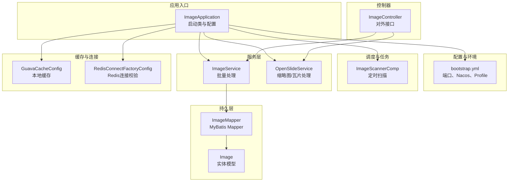
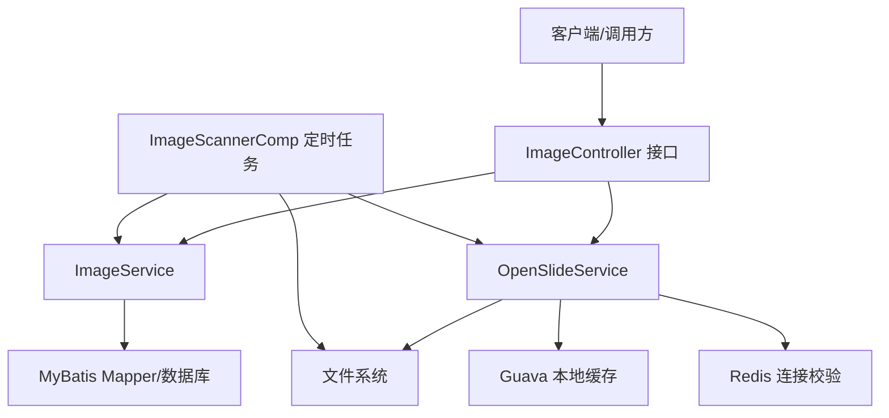
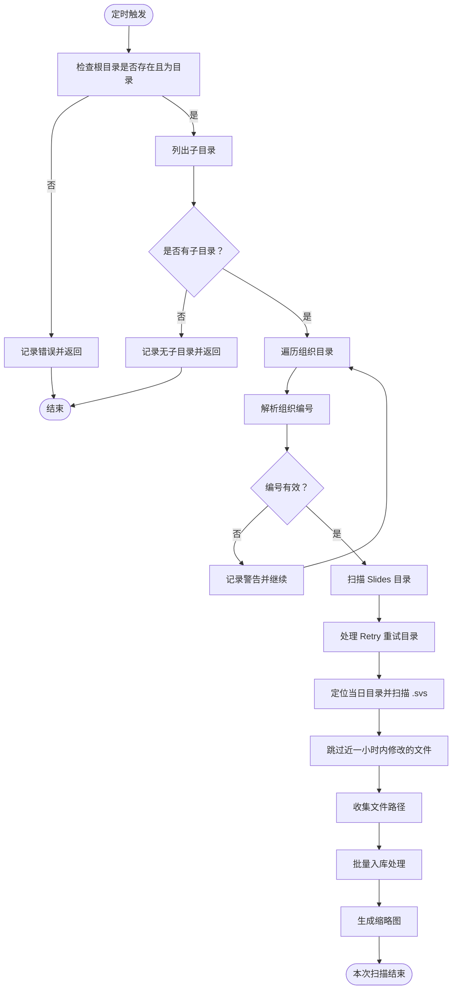
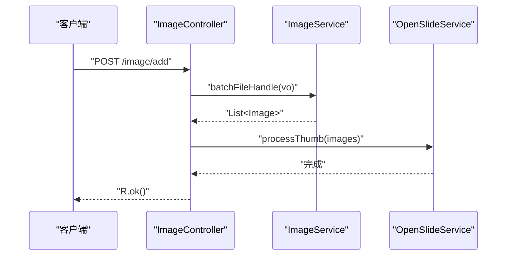
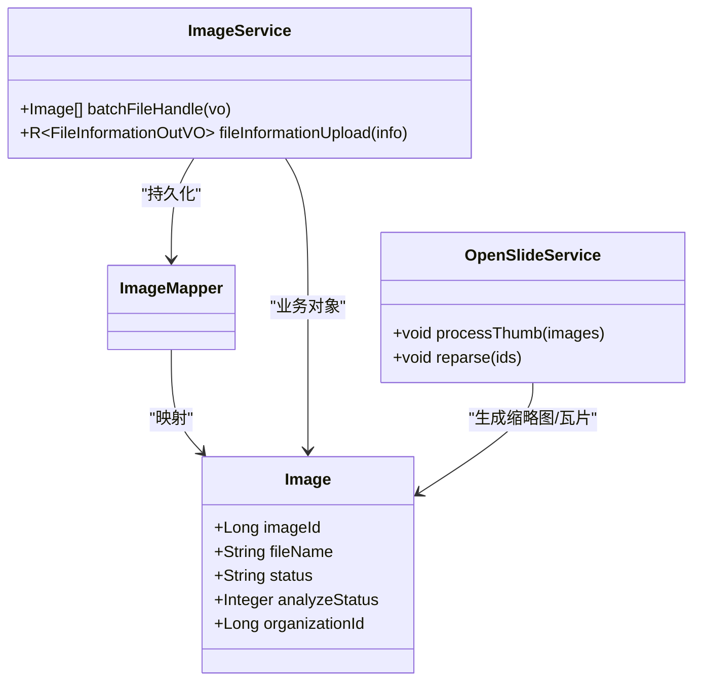
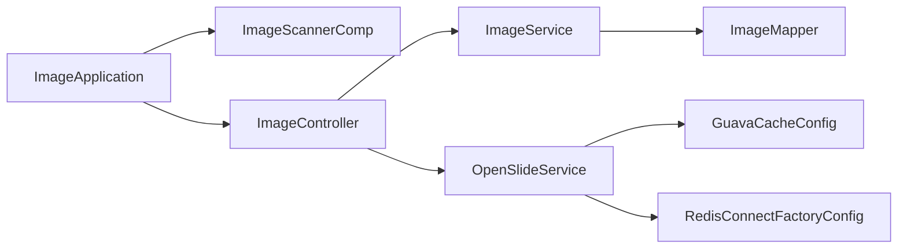

# 健康检查

<cite>
**本文引用的文件**
- [ImageApplication.java](file://src/main/java/cn/staitech/ImageApplication.java)
- [bootstrap.yml](file://src/main/resources/bootstrap.yml)
- [ImageScannerComp.java](file://src/main/java/cn/staitech/file/scheduled/ImageScannerComp.java)
- [ImageController.java](file://src/main/java/cn/staitech/file/controller/ImageController.java)
- [GuavaCacheConfig.java](file://src/main/java/cn/staitech/file/config/GuavaCacheConfig.java)
- [RedisConnectFactoryConfig.java](file://src/main/java/cn/staitech/file/config/RedisConnectFactoryConfig.java)
- [ImageService.java](file://src/main/java/cn/staitech/file/service/ImageService.java)
- [OpenSlideService.java](file://src/main/java/cn/staitech/file/service/OpenSlideService.java)
- [ImageMapper.java](file://src/main/java/cn/staitech/file/mapper/ImageMapper.java)
- [Image.java](file://src/main/java/cn/staitech/file/domain/Image.java)
</cite>

## 目录
1. [简介](#简介)
2. [项目结构](#项目结构)
3. [核心组件](#核心组件)
4. [架构总览](#架构总览)
5. [详细组件分析](#详细组件分析)
6. [依赖分析](#依赖分析)
7. [性能考量](#性能考量)
8. [故障排查指南](#故障排查指南)
9. [结论](#结论)
10. [附录](#附录)

## 简介
本文件面向运维与开发团队，系统化梳理 PACMVS 图像服务模块的健康检查机制与运行保障方案。重点覆盖以下方面：
- 服务可用性检查与指标采集
- 数据库连接与事务健康
- 缓存与外部连接校验（Redis）
- 文件系统扫描与异常恢复
- 定时扫描任务 ImageScannerComp 的健康监控与异常恢复
- API 接口的健康检查端点与响应格式
- 系统自检脚本、依赖服务状态检测与资源使用监控
- 故障自动恢复策略、降级处理与紧急停机流程

## 项目结构
该模块基于 Spring Boot 构建，启用调度、Web、事务与服务发现能力，通过 Nacos 进行配置与注册中心集成。核心职责围绕“原始切片解析”展开，包含定时扫描、文件处理、缩略图生成与对外接口。

图表来源
- [ImageApplication.java:37-52](file://src/main/java/cn/staitech/ImageApplication.java#L37-L52)
- [bootstrap.yml:1-37](file://src/main/resources/bootstrap.yml#L1-L37)
- [ImageScannerComp.java:19-74](file://src/main/java/cn/staitech/file/scheduled/ImageScannerComp.java#L19-L74)
- [ImageService.java:17-23](file://src/main/java/cn/staitech/file/service/ImageService.java#L17-L23)
- [OpenSlideService.java:14-39](file://src/main/java/cn/staitech/file/service/OpenSlideService.java#L14-L39)
- [ImageMapper.java:13-16](file://src/main/java/cn/staitech/file/mapper/ImageMapper.java#L13-L16)
- [Image.java:27-216](file://src/main/java/cn/staitech/file/domain/Image.java#L27-L216)
- [GuavaCacheConfig.java:17-26](file://src/main/java/cn/staitech/file/config/GuavaCacheConfig.java#L17-L26)
- [RedisConnectFactoryConfig.java:11-25](file://src/main/java/cn/staitech/file/config/RedisConnectFactoryConfig.java#L11-L25)
- [ImageController.java:30-71](file://src/main/java/cn/staitech/file/controller/ImageController.java#L30-L71)

章节来源
- [ImageApplication.java:27-52](file://src/main/java/cn/staitech/ImageApplication.java#L27-L52)
- [bootstrap.yml:1-37](file://src/main/resources/bootstrap.yml#L1-L37)

## 核心组件
- 启动与监控
  - 启用调度、事务、Web、服务发现与 Feign 客户端，集成 Micrometer 指标标签。
- 定时扫描任务
  - 固定周期扫描本地切片目录，过滤重试目录与近期文件，批量入库并生成缩略图。
- 服务层
  - ImageService：批量文件处理与信息查询。
  - OpenSlideService：缩略图生成、瓦片处理与重解析。
- 数据层
  - MyBatis Mapper + 实体 Image，记录切片状态、解析状态与元数据。
- 缓存与连接
  - Guava 本地缓存配置；Redis 连接工厂开启连接校验。
- 控制器
  - 提供“服务器选片”、“重新解析”、“失败切片检查”等接口。

章节来源
- [ImageApplication.java:37-52](file://src/main/java/cn/staitech/ImageApplication.java#L37-L52)
- [ImageScannerComp.java:34-74](file://src/main/java/cn/staitech/file/scheduled/ImageScannerComp.java#L34-L74)
- [ImageService.java:17-23](file://src/main/java/cn/staitech/file/service/ImageService.java#L17-L23)
- [OpenSlideService.java:14-39](file://src/main/java/cn/staitech/file/service/OpenSlideService.java#L14-L39)
- [ImageMapper.java:13-16](file://src/main/java/cn/staitech/file/mapper/ImageMapper.java#L13-L16)
- [Image.java:27-216](file://src/main/java/cn/staitech/file/domain/Image.java#L27-L216)
- [GuavaCacheConfig.java:17-26](file://src/main/java/cn/staitech/file/config/GuavaCacheConfig.java#L17-L26)
- [RedisConnectFactoryConfig.java:11-25](file://src/main/java/cn/staitech/file/config/RedisConnectFactoryConfig.java#L11-L25)
- [ImageController.java:30-71](file://src/main/java/cn/staitech/file/controller/ImageController.java#L30-L71)

## 架构总览
系统以 ImageApplication 为入口，通过 bootstrap.yml 注入 Nacos 配置与 Profile，启用调度与 Web 层。定时任务负责扫描文件系统，服务层协调数据库与外部处理，控制器对外暴露健康检查与业务接口。

图表来源
- [ImageController.java:30-71](file://src/main/java/cn/staitech/file/controller/ImageController.java#L30-L71)
- [ImageService.java:17-23](file://src/main/java/cn/staitech/file/service/ImageService.java#L17-L23)
- [OpenSlideService.java:14-39](file://src/main/java/cn/staitech/file/service/OpenSlideService.java#L14-L39)
- [ImageMapper.java:13-16](file://src/main/java/cn/staitech/file/mapper/ImageMapper.java#L13-L16)
- [ImageScannerComp.java:34-74](file://src/main/java/cn/staitech/file/scheduled/ImageScannerComp.java#L34-L74)
- [GuavaCacheConfig.java:17-26](file://src/main/java/cn/staitech/file/config/GuavaCacheConfig.java#L17-L26)
- [RedisConnectFactoryConfig.java:11-25](file://src/main/java/cn/staitech/file/config/RedisConnectFactoryConfig.java#L11-L25)

## 详细组件分析

### 定时扫描任务（ImageScannerComp）健康监控与异常恢复
- 执行频率
  - 固定周期执行一次（默认 1 小时），便于控制 IO 与 CPU 开销。
- 目录扫描策略
  - 根据配置定位本地切片根目录，仅处理符合命名规范的组织目录。
  - 切片目录下按扫描仪子目录与当日日期子目录进行递归扫描。
  - 重试目录（Retry）中的 .svs 文件会被优先收集，但会跳过近一小时内修改的文件。
- 异常处理
  - 对单个目录访问异常进行日志记录并跳过，避免影响整体扫描。
  - 组织目录名称解析失败时记录错误并继续下一个目录。
- 健康监控建议
  - 结合日志级别与告警阈值，对“根目录不存在/无子目录/当日目录不存在”等场景设置告警。
  - 对扫描耗时、处理文件数、重试队列变化进行指标采集。
- 异常恢复机制
  - 重试目录机制可自动兜底近期失败文件。
  - 若扫描中断，下次调度将继续从上次位置开始（由文件修改时间过滤保证幂等）。

图表来源
- [ImageScannerComp.java:34-74](file://src/main/java/cn/staitech/file/scheduled/ImageScannerComp.java#L34-L74)
- [ImageScannerComp.java:82-168](file://src/main/java/cn/staitech/file/scheduled/ImageScannerComp.java#L82-L168)

章节来源
- [ImageScannerComp.java:34-74](file://src/main/java/cn/staitech/file/scheduled/ImageScannerComp.java#L34-L74)
- [ImageScannerComp.java:82-168](file://src/main/java/cn/staitech/file/scheduled/ImageScannerComp.java#L82-L168)

### API 接口健康检查端点与响应格式
- 接口定义
  - “服务器选片”：接收文件插入请求，批量入库并生成缩略图。
  - “重新解析”：针对指定切片 ID 列表执行重解析。
  - “检查是否存在解析失败的切片”：返回布尔值表示是否仍有失败切片。
  - “查询原始切片”：按 ID 查询切片详情。
- 响应格式
  - 统一采用通用响应包装对象，包含状态码、消息与数据体。
  - 失败场景返回明确错误码与提示，便于自动化监控识别。

图表来源
- [ImageController.java:42-48](file://src/main/java/cn/staitech/file/controller/ImageController.java#L42-L48)
- [ImageService.java:19](file://src/main/java/cn/staitech/file/service/ImageService.java#L19)
- [OpenSlideService.java:25](file://src/main/java/cn/staitech/file/service/OpenSlideService.java#L25)

章节来源
- [ImageController.java:30-71](file://src/main/java/cn/staitech/file/controller/ImageController.java#L30-L71)
- [ImageService.java:17-23](file://src/main/java/cn/staitech/file/service/ImageService.java#L17-L23)
- [OpenSlideService.java:14-39](file://src/main/java/cn/staitech/file/service/OpenSlideService.java#L14-L39)

### 数据库连接与事务健康
- 连接与事务
  - 启用事务管理，结合 MyBatis Plus 进行数据访问。
  - 通过 ImageMapper 与 Image 实体映射 tb_image 表，记录切片状态与解析状态。
- 健康检查要点
  - 监控数据库连接池状态、慢查询与锁等待。
  - 关注批量入库与缩略图生成过程中的异常回滚与重试。
  - 对状态字段（如解析状态、可用状态）进行一致性校验。

图表来源
- [Image.java:27-216](file://src/main/java/cn/staitech/file/domain/Image.java#L27-L216)
- [ImageMapper.java:13-16](file://src/main/java/cn/staitech/file/mapper/ImageMapper.java#L13-L16)
- [ImageService.java:17-23](file://src/main/java/cn/staitech/file/service/ImageService.java#L17-L23)
- [OpenSlideService.java:14-39](file://src/main/java/cn/staitech/file/service/OpenSlideService.java#L14-L39)

章节来源
- [Image.java:27-216](file://src/main/java/cn/staitech/file/domain/Image.java#L27-L216)
- [ImageMapper.java:13-16](file://src/main/java/cn/staitech/file/mapper/ImageMapper.java#L13-L16)
- [ImageService.java:17-23](file://src/main/java/cn/staitech/file/service/ImageService.java#L17-L23)
- [OpenSlideService.java:14-39](file://src/main/java/cn/staitech/file/service/OpenSlideService.java#L14-L39)

### 缓存与外部连接健康
- 本地缓存
  - Guava Cache 配置了容量上限与写入过期时间，适合短期热点数据缓存。
- Redis 连接
  - Lettuce 连接工厂开启连接校验，降低无效连接带来的资源浪费。
- 健康检查建议
  - 对缓存命中率、过期与淘汰事件进行指标采集。
  - 对 Redis 连接可用性、命令延迟与连接池使用率进行监控。

章节来源
- [GuavaCacheConfig.java:17-26](file://src/main/java/cn/staitech/file/config/GuavaCacheConfig.java#L17-L26)
- [RedisConnectFactoryConfig.java:11-25](file://src/main/java/cn/staitech/file/config/RedisConnectFactoryConfig.java#L11-L25)

### 文件系统检查
- 目录结构
  - 根目录、Slides、Retry、当日日期子目录等约定清晰。
- 访问与权限
  - 对目录不存在、无子目录、当日目录缺失等情况进行日志记录与跳过处理。
- 健康检查建议
  - 监控磁盘空间、IO 延迟与文件句柄占用。
  - 对重试目录堆积与近期文件异常进行告警。

章节来源
- [ImageScannerComp.java:34-74](file://src/main/java/cn/staitech/file/scheduled/ImageScannerComp.java#L34-L74)
- [ImageScannerComp.java:82-168](file://src/main/java/cn/staitech/file/scheduled/ImageScannerComp.java#L82-L168)

## 依赖分析
- 启动类启用调度、Web、事务与服务发现，集成 Micrometer 指标。
- 定时任务依赖文件系统与服务层；服务层依赖数据库与外部处理；控制器依赖服务层。
- 缓存与 Redis 连接作为横切关注点，贯穿服务层与控制器。

图表来源
- [ImageApplication.java:37-52](file://src/main/java/cn/staitech/ImageApplication.java#L37-L52)
- [ImageScannerComp.java:19-74](file://src/main/java/cn/staitech/file/scheduled/ImageScannerComp.java#L19-L74)
- [ImageController.java:30-71](file://src/main/java/cn/staitech/file/controller/ImageController.java#L30-L71)
- [ImageService.java:17-23](file://src/main/java/cn/staitech/file/service/ImageService.java#L17-L23)
- [OpenSlideService.java:14-39](file://src/main/java/cn/staitech/file/service/OpenSlideService.java#L14-L39)
- [GuavaCacheConfig.java:17-26](file://src/main/java/cn/staitech/file/config/GuavaCacheConfig.java#L17-L26)
- [RedisConnectFactoryConfig.java:11-25](file://src/main/java/cn/staitech/file/config/RedisConnectFactoryConfig.java#L11-L25)

章节来源
- [ImageApplication.java:27-52](file://src/main/java/cn/staitech/ImageApplication.java#L27-L52)
- [ImageScannerComp.java:19-74](file://src/main/java/cn/staitech/file/scheduled/ImageScannerComp.java#L19-L74)
- [ImageController.java:30-71](file://src/main/java/cn/staitech/file/controller/ImageController.java#L30-L71)
- [ImageService.java:17-23](file://src/main/java/cn/staitech/file/service/ImageService.java#L17-L23)
- [OpenSlideService.java:14-39](file://src/main/java/cn/staitech/file/service/OpenSlideService.java#L14-L39)
- [GuavaCacheConfig.java:17-26](file://src/main/java/cn/staitech/file/config/GuavaCacheConfig.java#L17-L26)
- [RedisConnectFactoryConfig.java:11-25](file://src/main/java/cn/staitech/file/config/RedisConnectFactoryConfig.java#L11-L25)

## 性能考量
- 定时扫描频率与批处理规模需平衡吞吐与资源占用。
- 缩略图生成与瓦片处理可能产生高并发 IO，建议配合限流与队列缓冲。
- 数据库批量写入与索引维护需关注写入延迟与锁竞争。
- 缓存命中率与过期策略直接影响响应时间与 CPU 占用。

## 故障排查指南
- 服务可用性
  - 检查应用端口与 Nacos 注册状态；确认调度与 Web 组件正常启动。
- 文件系统
  - 根目录与 Slides/Retry/当日目录是否存在；权限是否足够；磁盘空间是否充足。
- 数据库
  - 观察慢查询与连接池使用率；核对状态字段一致性与索引覆盖。
- 缓存与 Redis
  - 缓存命中率异常、连接不可用或命令超时需重点排查。
- 定时任务
  - 查看扫描日志与重试目录堆积情况；确认最近一小时文件过滤逻辑是否生效。
- API 健康
  - 使用“检查是否存在解析失败的切片”接口快速判断系统整体健康状况。

章节来源
- [ImageScannerComp.java:34-74](file://src/main/java/cn/staitech/file/scheduled/ImageScannerComp.java#L34-L74)
- [ImageController.java:56-63](file://src/main/java/cn/staitech/file/controller/ImageController.java#L56-L63)

## 结论
本模块通过定时扫描、统一响应包装与基础缓存/连接校验，构建了较为完善的健康检查与异常恢复框架。建议在现有基础上补充指标采集与告警策略，完善失败重试与降级预案，确保在高负载与异常情况下仍能稳定运行。

## 附录

### 系统自检脚本与依赖服务状态检测
- 自检清单
  - 应用进程存活与端口监听
  - Nacos 注册与配置拉取
  - 数据库连通性与可用性
  - Redis 连接可用性
  - 文件系统根目录与关键子目录存在性
  - 定时任务日志与最近执行时间
- 资源监控
  - CPU、内存、磁盘 IO、网络带宽
  - 数据库连接池、Redis 连接池使用率
  - 缓存命中率与过期事件

### 故障自动恢复策略
- 文件系统异常
  - 目录缺失：等待人工介入或自动创建；重试目录兜底。
  - 权限不足：提升权限或切换账户；记录审计日志。
- 数据库异常
  - 连接抖动：退避重试与熔断；必要时降级只读。
  - 死锁/慢查询：隔离事务、优化索引与 SQL。
- 缓存/Redis 异常
  - 连接校验失败：重建连接；临时关闭缓存功能。
- 定时任务异常
  - 单次失败：记录并跳过；下次调度继续。
  - 长期阻塞：增加超时与中断机制。

### 降级处理机制
- 读路径降级：对非关键接口返回缓存数据或简化数据。
- 写路径降级：对非关键写入延迟处理或丢弃。
- 缩略图/瓦片生成降级：仅保留必要层级或关闭部分功能。

### 紧急停机流程
- 快速停止
  - 停止应用进程，释放数据库与文件句柄。
- 清理现场
  - 检查重试目录堆积与临时文件残留。
- 恢复步骤
  - 修复问题后重启应用，验证定时任务与接口健康。