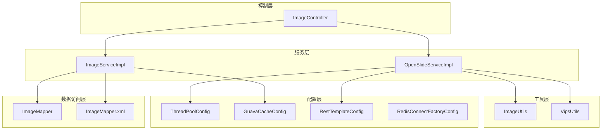
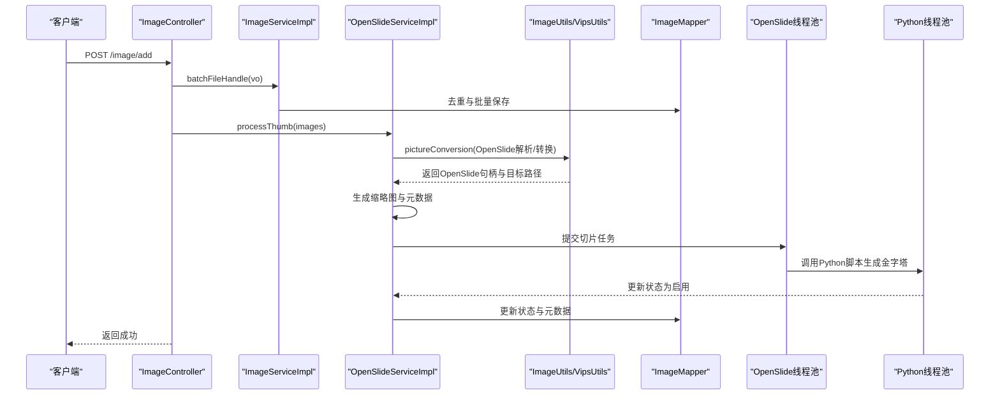
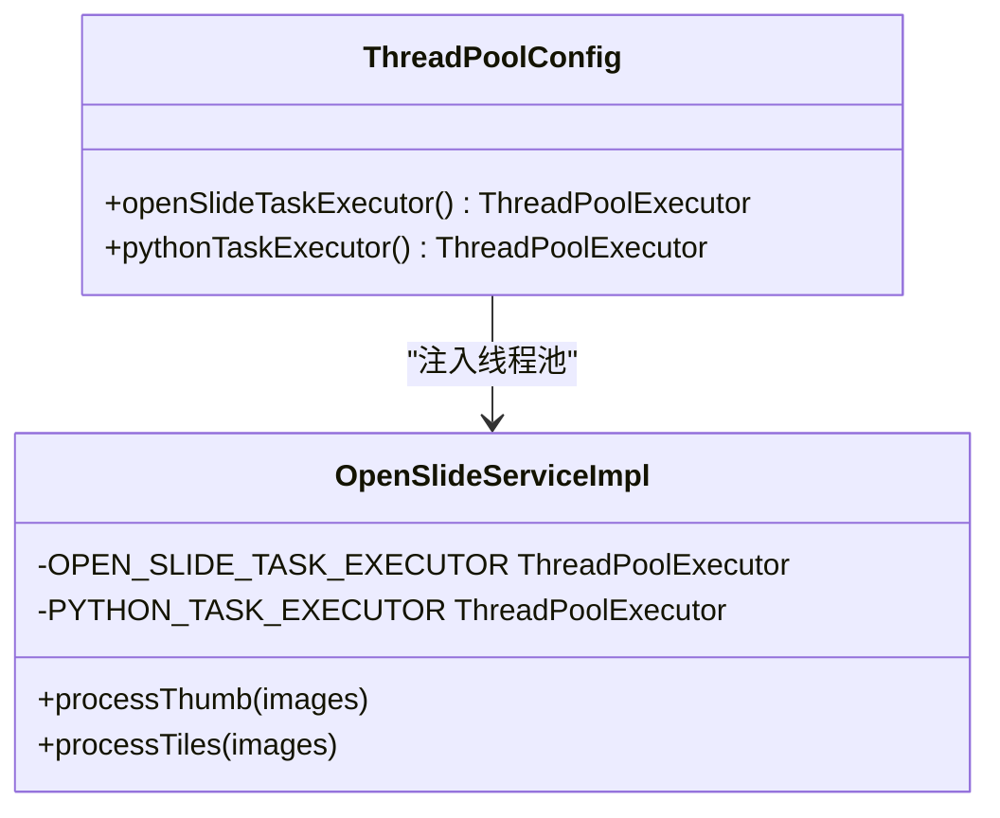
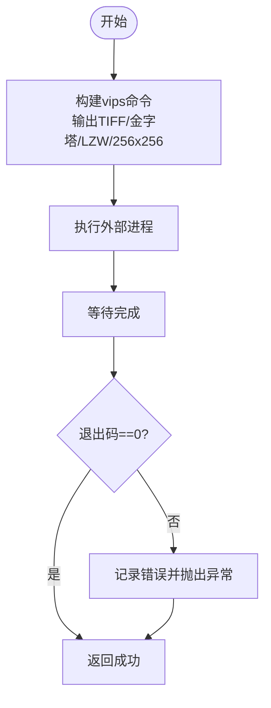
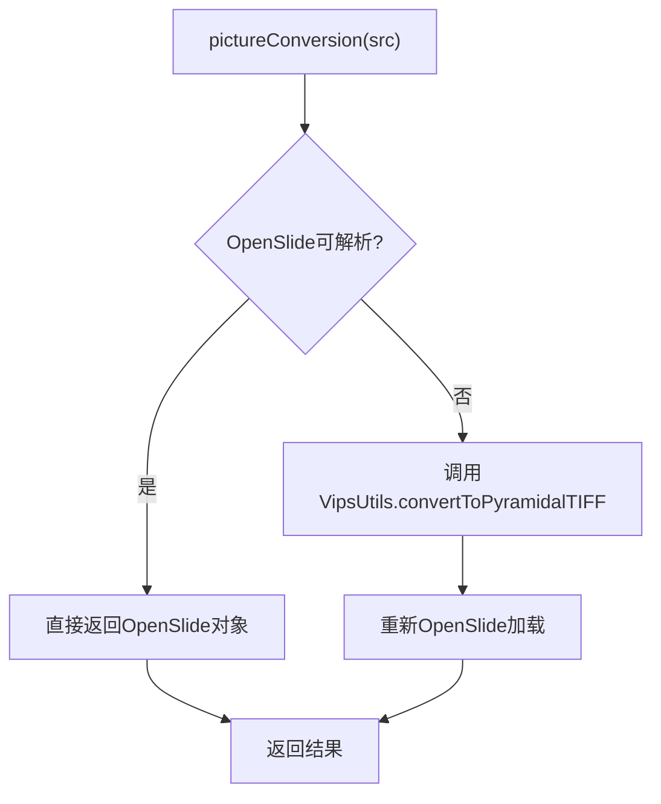
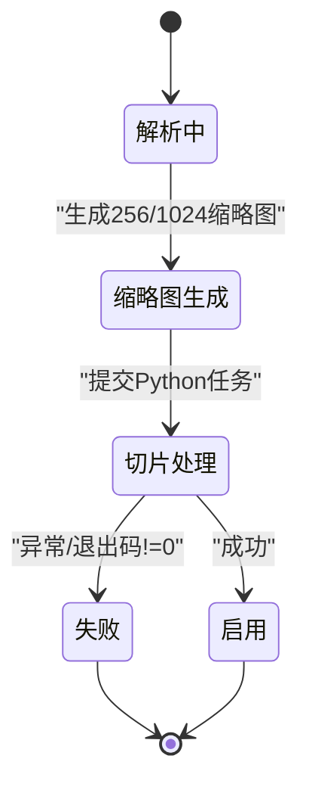
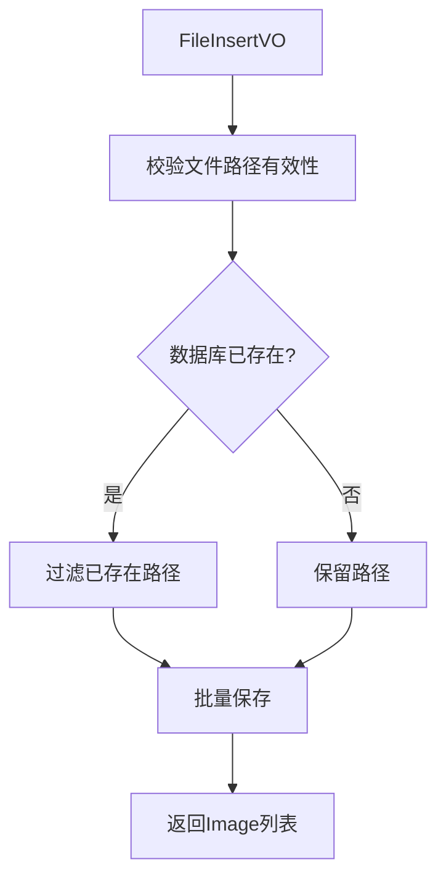
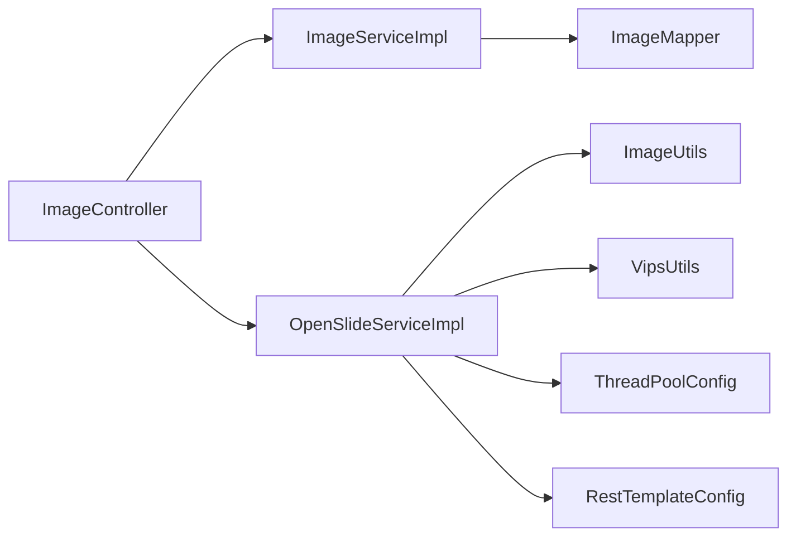

# 性能优化

<cite>
**本文引用的文件**
- [ThreadPoolConfig.java](file://src/main/java/cn/staitech/file/config/ThreadPoolConfig.java)
- [VipsUtils.java](file://src/main/java/cn/staitech/file/util/VipsUtils.java)
- [ImageUtils.java](file://src/main/java/cn/staitech/file/util/ImageUtils.java)
- [GuavaCacheConfig.java](file://src/main/java/cn/staitech/file/config/GuavaCacheConfig.java)
- [OpenSlideServiceImpl.java](file://src/main/java/cn/staitech/file/service/impl/OpenSlideServiceImpl.java)
- [ImageServiceImpl.java](file://src/main/java/cn/staitech/file/service/impl/ImageServiceImpl.java)
- [ImageMapper.java](file://src/main/java/cn/staitech/file/mapper/ImageMapper.java)
- [ImageMapper.xml](file://src/main/resources/mapper/ImageMapper.xml)
- [RestTemplateConfig.java](file://src/main/java/cn/staitech/file/config/RestTemplateConfig.java)
- [RedisConnectFactoryConfig.java](file://src/main/java/cn/staitech/file/config/RedisConnectFactoryConfig.java)
- [ImageController.java](file://src/main/java/cn/staitech/file/controller/ImageController.java)
- [bootstrap.yml](file://src/main/resources/bootstrap.yml)
- [pom.xml](file://pom.xml)
</cite>

## 目录
1. [简介](#简介)
2. [项目结构](#项目结构)
3. [核心组件](#核心组件)
4. [架构总览](#架构总览)
5. [详细组件分析](#详细组件分析)
6. [依赖分析](#依赖分析)
7. [性能考虑](#性能考虑)
8. [故障排查指南](#故障排查指南)
9. [结论](#结论)
10. [附录](#附录)

## 简介
本文件面向 PACMVS 图像处理子系统，聚焦于大规模图像处理场景下的性能优化，涵盖以下方面：
- 图像处理性能优化：libvips 工具链使用优化、图像金字塔生成与内存优化、I/O 与磁盘写入优化
- 并发与线程池：ThreadPoolConfig 的线程池参数设计、任务调度与拒绝策略对吞吐与稳定性的影响
- 缓存与数据库：GuavaCacheConfig 的缓存策略、MyBatis 映射与批量写入优化
- 网络传输：RestTemplate 超时与负载均衡配置、远程审计接口调用优化
- 基准测试与监控：性能指标建议、瓶颈识别方法与系统级监控集成
- 大规模场景案例：批处理流程、队列容量与线程数调优、失败重试与降级策略

## 项目结构
项目采用 Spring Boot + MyBatis Plus 的典型分层结构，核心模块包括：
- 控制层：接收请求并编排业务流程
- 服务层：实现图像解析、缩略图生成、切片任务提交与状态管理
- 工具层：libvips 调用、OpenSlide 解析、文件路径与扩展名校验
- 配置层：线程池、缓存、HTTP 客户端、Redis 连接工厂
- 数据访问层：MyBatis Mapper XML 映射与实体定义

**图表来源**
- [ImageController.java:1-72](file://src/main/java/cn/staitech/file/controller/ImageController.java#L1-L72)
- [ImageServiceImpl.java:1-548](file://src/main/java/cn/staitech/file/service/impl/ImageServiceImpl.java#L1-L548)
- [OpenSlideServiceImpl.java:1-563](file://src/main/java/cn/staitech/file/service/impl/OpenSlideServiceImpl.java#L1-L563)
- [ImageMapper.java:1-16](file://src/main/java/cn/staitech/file/mapper/ImageMapper.java#L1-L16)
- [ImageMapper.xml:1-65](file://src/main/resources/mapper/ImageMapper.xml#L1-L65)
- [ThreadPoolConfig.java:1-66](file://src/main/java/cn/staitech/file/config/ThreadPoolConfig.java#L1-L66)
- [GuavaCacheConfig.java:1-27](file://src/main/java/cn/staitech/file/config/GuavaCacheConfig.java#L1-L27)
- [RestTemplateConfig.java:1-51](file://src/main/java/cn/staitech/file/config/RestTemplateConfig.java#L1-L51)
- [RedisConnectFactoryConfig.java:1-26](file://src/main/java/cn/staitech/file/config/RedisConnectFactoryConfig.java#L1-L26)

**章节来源**
- [ImageController.java:1-72](file://src/main/java/cn/staitech/file/controller/ImageController.java#L1-L72)
- [ImageServiceImpl.java:1-548](file://src/main/java/cn/staitech/file/service/impl/ImageServiceImpl.java#L1-L548)
- [OpenSlideServiceImpl.java:1-563](file://src/main/java/cn/staitech/file/service/impl/OpenSlideServiceImpl.java#L1-L563)
- [ImageMapper.java:1-16](file://src/main/java/cn/staitech/file/mapper/ImageMapper.java#L1-L16)
- [ImageMapper.xml:1-65](file://src/main/resources/mapper/ImageMapper.xml#L1-L65)
- [ThreadPoolConfig.java:1-66](file://src/main/java/cn/staitech/file/config/ThreadPoolConfig.java#L1-L66)
- [GuavaCacheConfig.java:1-27](file://src/main/java/cn/staitech/file/config/GuavaCacheConfig.java#L1-L27)
- [RestTemplateConfig.java:1-51](file://src/main/java/cn/staitech/file/config/RestTemplateConfig.java#L1-L51)
- [RedisConnectFactoryConfig.java:1-26](file://src/main/java/cn/staitech/file/config/RedisConnectFactoryConfig.java#L1-L26)

## 核心组件
- 线程池配置：分别针对 OpenSlide 与 Python 脚本执行的专用线程池，具备有界队列与拒绝策略，保障系统在高并发下的稳定性
- 图像工具：ImageUtils 封装 OpenSlide 解析与转换流程；VipsUtils 调用 vips 命令生成金字塔 TIF
- 服务编排：OpenSlideServiceImpl 负责缩略图生成、切片任务提交与状态流转；ImageServiceImpl 负责文件信息入库与去重
- 缓存与网络：GuavaCacheConfig 提供轻量本地缓存；RestTemplateConfig 配置超时与 JSON 转换器；Redis 连接工厂启用连接校验
- 数据持久化：MyBatis Mapper 映射 Image 实体字段，支持批量写入与条件查询

**章节来源**
- [ThreadPoolConfig.java:18-39](file://src/main/java/cn/staitech/file/config/ThreadPoolConfig.java#L18-L39)
- [ThreadPoolConfig.java:44-64](file://src/main/java/cn/staitech/file/config/ThreadPoolConfig.java#L44-L64)
- [ImageUtils.java:52-97](file://src/main/java/cn/staitech/file/util/ImageUtils.java#L52-L97)
- [VipsUtils.java:22-35](file://src/main/java/cn/staitech/file/util/VipsUtils.java#L22-L35)
- [OpenSlideServiceImpl.java:277-312](file://src/main/java/cn/staitech/file/service/impl/OpenSlideServiceImpl.java#L277-L312)
- [OpenSlideServiceImpl.java:348-378](file://src/main/java/cn/staitech/file/service/impl/OpenSlideServiceImpl.java#L348-L378)
- [ImageServiceImpl.java:65-140](file://src/main/java/cn/staitech/file/service/impl/ImageServiceImpl.java#L65-L140)
- [GuavaCacheConfig.java:19-25](file://src/main/java/cn/staitech/file/config/GuavaCacheConfig.java#L19-L25)
- [RestTemplateConfig.java:26-48](file://src/main/java/cn/staitech/file/config/RestTemplateConfig.java#L26-L48)
- [RedisConnectFactoryConfig.java:18-24](file://src/main/java/cn/staitech/file/config/RedisConnectFactoryConfig.java#L18-L24)
- [ImageMapper.xml:4-46](file://src/main/resources/mapper/ImageMapper.xml#L4-L46)

## 架构总览
整体处理流程从控制器入口开始，先入库并解析文件元信息，再异步生成缩略图与金字塔切片，期间通过线程池并发执行，同时记录审计日志。

**图表来源**
- [ImageController.java:42-48](file://src/main/java/cn/staitech/file/controller/ImageController.java#L42-L48)
- [ImageServiceImpl.java:65-140](file://src/main/java/cn/staitech/file/service/impl/ImageServiceImpl.java#L65-L140)
- [OpenSlideServiceImpl.java:277-339](file://src/main/java/cn/staitech/file/service/impl/OpenSlideServiceImpl.java#L277-L339)
- [ImageUtils.java:52-97](file://src/main/java/cn/staitech/file/util/ImageUtils.java#L52-L97)
- [VipsUtils.java:22-35](file://src/main/java/cn/staitech/file/util/VipsUtils.java#L22-L35)
- [ImageMapper.java:1-16](file://src/main/java/cn/staitech/file/mapper/ImageMapper.java#L1-L16)

## 详细组件分析

### 线程池配置与并发调优（ThreadPoolConfig）
- OpenSlide 线程池
  - 核心线程数：CPU 核数 + 1
  - 最大线程数：CPU 核数 × 2
  - 队列：有界阻塞队列（容量 100000），防止 OOM
  - 拒绝策略：记录错误并回退到调用线程执行，保证任务不丢失
- Python 脚本线程池
  - 核心/最大线程数：按 CPU 核数的 1/16 计算，且保证最小值，避免过多子进程占用系统资源
  - 同样采用有界队列与拒绝策略
- 调优要点
  - 根据 CPU 密集型与 I/O 密集型比例调整线程数
  - 队列容量需结合峰值并发与 GC 压力评估
  - 拒绝策略应结合业务容忍度选择丢弃或调用线程执行

**图表来源**
- [ThreadPoolConfig.java:18-64](file://src/main/java/cn/staitech/file/config/ThreadPoolConfig.java#L18-L64)
- [OpenSlideServiceImpl.java:67-72](file://src/main/java/cn/staitech/file/service/impl/OpenSlideServiceImpl.java#L67-L72)

**章节来源**
- [ThreadPoolConfig.java:18-39](file://src/main/java/cn/staitech/file/config/ThreadPoolConfig.java#L18-L39)
- [ThreadPoolConfig.java:44-64](file://src/main/java/cn/staitech/file/config/ThreadPoolConfig.java#L44-L64)
- [OpenSlideServiceImpl.java:277-339](file://src/main/java/cn/staitech/file/service/impl/OpenSlideServiceImpl.java#L277-L339)

### libvips 工具链与图像金字塔生成优化（VipsUtils）
- 命令行参数
  - 输出格式：TIFF（bigtiff）
  - 切片尺寸：256×256
  - 压缩方式：LZW
  - 金字塔：开启
- 优化建议
  - 并行化：libvips 本身多线程，结合线程池并发调用可提升吞吐
  - I/O：优先使用 SSD 存储，减少随机写放大
  - 压缩：LZW 在 PACMVS 场景下通常更利于后续瓦片渲染
  - 错误处理：捕获进程退出码与标准输出，便于定位问题

**图表来源**
- [VipsUtils.java:22-35](file://src/main/java/cn/staitech/file/util/VipsUtils.java#L22-L35)

**章节来源**
- [VipsUtils.java:22-35](file://src/main/java/cn/staitech/file/util/VipsUtils.java#L22-L35)

### 图像解析与转换（ImageUtils）
- OpenSlide 解析失败时自动触发 vips 转换，确保后续流程可用
- 元数据二次加载与 levelCount 校验，避免空层级导致后续失败
- 文件路径与扩展名校验，减少无效 I/O

**图表来源**
- [ImageUtils.java:52-97](file://src/main/java/cn/staitech/file/util/ImageUtils.java#L52-L97)

**章节来源**
- [ImageUtils.java:52-97](file://src/main/java/cn/staitech/file/util/ImageUtils.java#L52-L97)

### 缩略图生成与元数据采集（OpenSlideServiceImpl）
- 缩略图生成：创建 256×256 与 1024×1024 两种尺寸，分别用于缓存与展示
- 元数据：分辨率、物镜倍数、层级数、瓦片计数列表
- 状态机：解析中 → 缩略图生成 → 切片处理 → 启用
- 失败处理：状态置为失败并移动至失败目录，记录审计日志

**图表来源**
- [OpenSlideServiceImpl.java:277-339](file://src/main/java/cn/staitech/file/service/impl/OpenSlideServiceImpl.java#L277-L339)

**章节来源**
- [OpenSlideServiceImpl.java:140-202](file://src/main/java/cn/staitech/file/service/impl/OpenSlideServiceImpl.java#L140-L202)
- [OpenSlideServiceImpl.java:277-339](file://src/main/java/cn/staitech/file/service/impl/OpenSlideServiceImpl.java#L277-L339)

### 批量入库与去重（ImageServiceImpl）
- 去重策略：基于文件路径与组织 ID 查询，过滤已存在条目
- 批量保存：使用 MyBatis Plus 批量写入，降低数据库往返
- 字段解析：从文件名解析专题号、动物号、蜡块号、组别与性别等

**图表来源**
- [ImageServiceImpl.java:65-140](file://src/main/java/cn/staitech/file/service/impl/ImageServiceImpl.java#L65-L140)

**章节来源**
- [ImageServiceImpl.java:65-140](file://src/main/java/cn/staitech/file/service/impl/ImageServiceImpl.java#L65-L140)
- [ImageMapper.xml:4-46](file://src/main/resources/mapper/ImageMapper.xml#L4-L46)

### 缓存策略（GuavaCacheConfig）
- 本地缓存：最大条目 100，写入后 1 小时过期
- 适用场景：轻量热点数据、临时中间结果，避免频繁计算或重复 I/O
- 注意：缓存粒度与失效策略需与业务生命周期匹配，避免脏读

**章节来源**
- [GuavaCacheConfig.java:19-25](file://src/main/java/cn/staitech/file/config/GuavaCacheConfig.java#L19-L25)

### 网络传输与远程审计（RestTemplateConfig、RedisConnectFactoryConfig）
- RestTemplate 超时：连接、读取、请求超时合理设置，避免长时间阻塞
- JSON 转换器：明确支持媒体类型，减少序列化开销
- Redis 连接校验：启用连接有效性检测，降低无效连接带来的失败重试成本

**章节来源**
- [RestTemplateConfig.java:26-48](file://src/main/java/cn/staitech/file/config/RestTemplateConfig.java#L26-L48)
- [RedisConnectFactoryConfig.java:18-24](file://src/main/java/cn/staitech/file/config/RedisConnectFactoryConfig.java#L18-L24)

## 依赖分析
- 控制器依赖服务层；服务层依赖工具层与配置层；数据访问层依赖 MyBatis 映射
- 线程池通过 Spring 注入到服务层，Python 脚本通过进程调用执行
- 审计日志通过 RestTemplate 发送远程接口，状态更新通过数据库持久化

**图表来源**
- [ImageController.java:31-34](file://src/main/java/cn/staitech/file/controller/ImageController.java#L31-L34)
- [ImageServiceImpl.java:46-49](file://src/main/java/cn/staitech/file/service/impl/ImageServiceImpl.java#L46-L49)
- [OpenSlideServiceImpl.java:67-72](file://src/main/java/cn/staitech/file/service/impl/OpenSlideServiceImpl.java#L67-L72)
- [ThreadPoolConfig.java:18-64](file://src/main/java/cn/staitech/file/config/ThreadPoolConfig.java#L18-L64)
- [RestTemplateConfig.java:26-48](file://src/main/java/cn/staitech/file/config/RestTemplateConfig.java#L26-L48)

**章节来源**
- [ImageController.java:31-34](file://src/main/java/cn/staitech/file/controller/ImageController.java#L31-L34)
- [ImageServiceImpl.java:46-49](file://src/main/java/cn/staitech/file/service/impl/ImageServiceImpl.java#L46-L49)
- [OpenSlideServiceImpl.java:67-72](file://src/main/java/cn/staitech/file/service/impl/OpenSlideServiceImpl.java#L67-L72)
- [ThreadPoolConfig.java:18-64](file://src/main/java/cn/staitech/file/config/ThreadPoolConfig.java#L18-L64)
- [RestTemplateConfig.java:26-48](file://src/main/java/cn/staitech/file/config/RestTemplateConfig.java#L26-L48)

## 性能考虑

### libvips 与图像金字塔
- 命令参数已启用 bigtiff、tile、金字塔与 LZW 压缩，建议结合磁盘 I/O 与内存压力评估是否需要调整 tile 尺寸与压缩等级
- 并行化：将 vips 调用纳入线程池并发执行，注意队列容量与拒绝策略

**章节来源**
- [VipsUtils.java:22-35](file://src/main/java/cn/staitech/file/util/VipsUtils.java#L22-L35)
- [ThreadPoolConfig.java:44-64](file://src/main/java/cn/staitech/file/config/ThreadPoolConfig.java#L44-L64)

### 线程池与并发
- OpenSlide 线程池：CPU 密集型，核心线程数与队列容量需结合 CPU 核心数与任务耗时评估
- Python 线程池：子进程调用，线程数不宜过大，避免系统资源争用
- 建议：通过压测观察队列长度、拒绝次数与任务完成时间，动态调整线程数与队列容量

**章节来源**
- [ThreadPoolConfig.java:18-39](file://src/main/java/cn/staitech/file/config/ThreadPoolConfig.java#L18-L39)
- [ThreadPoolConfig.java:44-64](file://src/main/java/cn/staitech/file/config/ThreadPoolConfig.java#L44-L64)

### 缓存与数据库
- GuavaCacheConfig：适合短期热点数据，避免频繁数据库查询
- ImageServiceImpl 批量入库：减少往返，建议配合数据库连接池与索引优化
- 建议：对高频查询字段建立合适索引，避免全表扫描

**章节来源**
- [GuavaCacheConfig.java:19-25](file://src/main/java/cn/staitech/file/config/GuavaCacheConfig.java#L19-L25)
- [ImageServiceImpl.java:65-140](file://src/main/java/cn/staitech/file/service/impl/ImageServiceImpl.java#L65-L140)
- [ImageMapper.xml:4-46](file://src/main/resources/mapper/ImageMapper.xml#L4-L46)

### 网络传输
- RestTemplate 超时与 JSON 转换器：避免长时间阻塞，提高接口稳定性
- Redis 连接工厂：启用连接校验，降低无效连接带来的失败成本

**章节来源**
- [RestTemplateConfig.java:26-48](file://src/main/java/cn/staitech/file/config/RestTemplateConfig.java#L26-L48)
- [RedisConnectFactoryConfig.java:18-24](file://src/main/java/cn/staitech/file/config/RedisConnectFactoryConfig.java#L18-L24)

### 大规模场景调优案例
- 批处理流程：前端传入文件列表，后端先去重再并发处理，最后批量入库
- 队列容量与线程数：根据峰值并发与 GC 压力设定，避免 OOM 与长时间排队
- 失败重试：失败目录与状态标记，支持重跑与人工干预
- 监控指标：队列长度、线程池活跃度、任务耗时、数据库 QPS、Python 脚本退出码分布

**章节来源**
- [ImageServiceImpl.java:65-140](file://src/main/java/cn/staitech/file/service/impl/ImageServiceImpl.java#L65-L140)
- [OpenSlideServiceImpl.java:277-339](file://src/main/java/cn/staitech/file/service/impl/OpenSlideServiceImpl.java#L277-L339)
- [OpenSlideServiceImpl.java:399-454](file://src/main/java/cn/staitech/file/service/impl/OpenSlideServiceImpl.java#L399-L454)

## 故障排查指南
- Python 脚本执行失败
  - 检查退出码与日志输出，确认脚本路径与可执行权限
  - 调整线程池与队列容量，避免资源争用
- OpenSlide 解析失败
  - 触发 vips 转换流程，确认目标路径与权限
  - 校验 levelCount 与元数据，必要时重新加载
- 数据库写入异常
  - 检查批量写入与索引，关注重复键冲突与锁等待
- 审计日志失败
  - 检查 RestTemplate 超时与远程接口可达性

**章节来源**
- [OpenSlideServiceImpl.java:457-477](file://src/main/java/cn/staitech/file/service/impl/OpenSlideServiceImpl.java#L457-L477)
- [OpenSlideServiceImpl.java:188-200](file://src/main/java/cn/staitech/file/service/impl/OpenSlideServiceImpl.java#L188-L200)
- [ImageServiceImpl.java:99-122](file://src/main/java/cn/staitech/file/service/impl/ImageServiceImpl.java#L99-L122)
- [RestTemplateConfig.java:26-48](file://src/main/java/cn/staitech/file/config/RestTemplateConfig.java#L26-L48)

## 结论
通过合理的线程池配置、libvips 金字塔生成策略、本地缓存与数据库批量写入优化，以及网络传输与连接校验，可在大规模图像处理场景下显著提升吞吐与稳定性。建议结合监控指标持续压测与调参，形成可复用的性能优化方案。

## 附录

### 性能基准测试方法
- 基准指标
  - 吞吐：单位时间内处理的图像数量
  - 延迟：从入库到启用的端到端时延
  - 队列长度与拒绝次数：衡量线程池饱和度
  - 数据库 QPS 与响应时间：评估写入瓶颈
  - Python 脚本执行时间与退出码分布：评估切片生成效率
- 测试步骤
  - 准备不同规模与格式的图像样本
  - 分别测试单机与多实例部署
  - 调整线程池与队列容量，记录各项指标
  - 对比缓存开启/关闭、不同压缩参数与 tile 尺寸的效果

### 瓶颈识别技术
- 线程池瓶颈：队列堆积、拒绝次数上升、任务耗时波动
- I/O 瓶颈：磁盘写入延迟升高、Python 脚本执行时间增长
- 数据库瓶颈：慢查询、锁等待、连接池耗尽
- 网络瓶颈：远程接口超时、重试增多

### 监控与告警
- 指标采集：线程池活跃度、队列长度、任务耗时、数据库 QPS、Python 退出码分布
- 告警阈值：队列长度超过阈值、拒绝次数上升、任务耗时超时、数据库慢查询占比
- 可视化：Prometheus + Grafana 或 Micrometer 集成

**章节来源**
- [pom.xml:192-194](file://pom.xml#L192-L194)
- [bootstrap.yml:1-37](file://src/main/resources/bootstrap.yml#L1-L37)