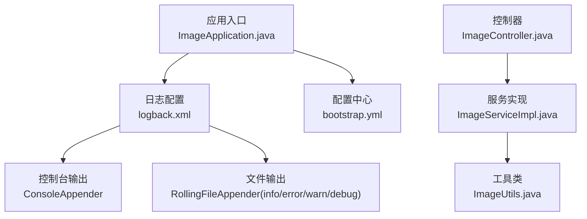
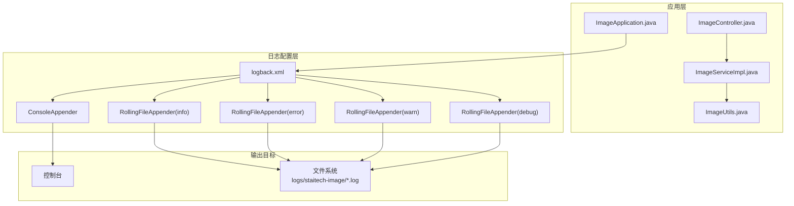
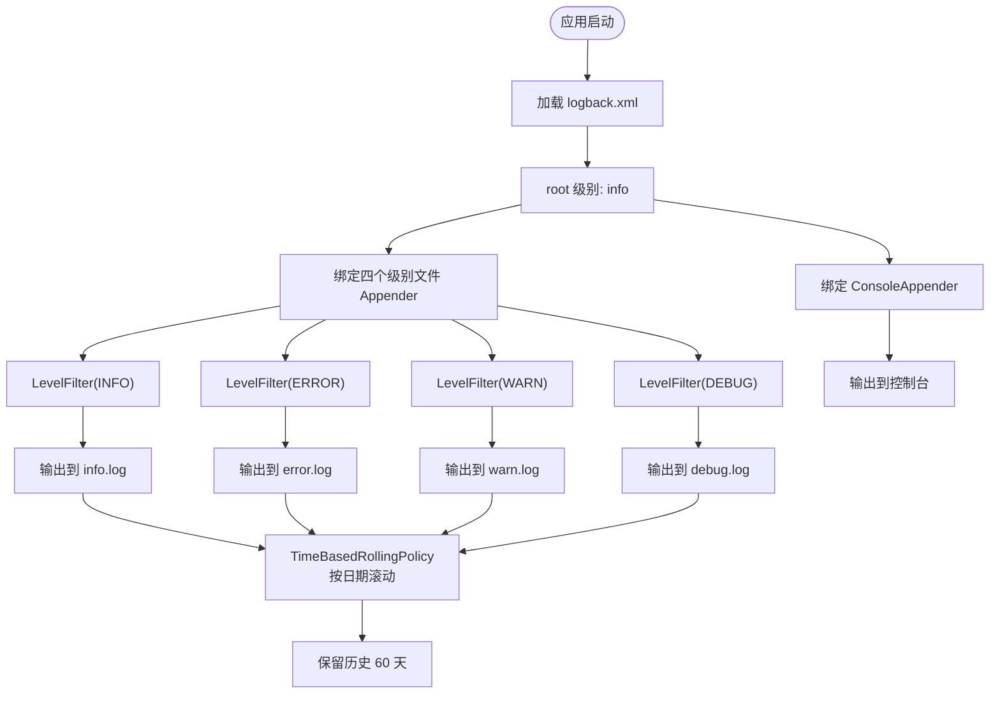
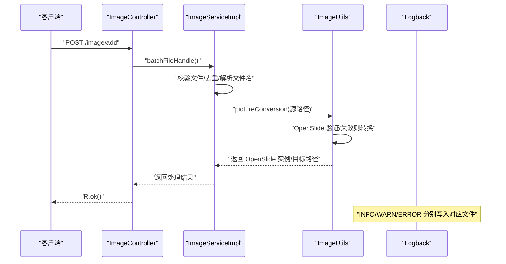
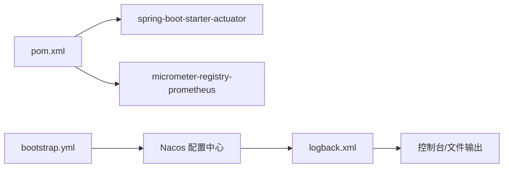

# 日志管理

<cite>
**本文引用的文件**
- [logback.xml](file://src/main/resources/logback.xml)
- [ImageApplication.java](file://src/main/java/cn/staitech/ImageApplication.java)
- [bootstrap.yml](file://src/main/resources/bootstrap.yml)
- [ImageUtils.java](file://src/main/java/cn/staitech/file/util/ImageUtils.java)
- [ImageServiceImpl.java](file://src/main/java/cn/staitech/file/service/impl/ImageServiceImpl.java)
- [ImageController.java](file://src/main/java/cn/staitech/file/controller/ImageController.java)
- [pom.xml](file://pom.xml)
</cite>

## 目录
1. [简介](#简介)
2. [项目结构](#项目结构)
3. [核心组件](#核心组件)
4. [架构总览](#架构总览)
5. [详细组件分析](#详细组件分析)
6. [依赖分析](#依赖分析)
7. [性能考虑](#性能考虑)
8. [故障排查指南](#故障排查指南)
9. [结论](#结论)
10. [附录](#附录)

## 简介
本文件面向开发者与运维人员，系统化说明 PACMVS 图像模块的日志管理方案，重点围绕 Logback 的配置与使用，涵盖以下内容：
- 日志级别策略（INFO、ERROR、WARN、DEBUG）
- 输出目标（控制台与文件）
- 文件滚动策略（按日期滚动）、保留期限与文件大小限制
- 日志格式与关键字段
- 图像处理流程中的日志记录、错误追踪与性能分析建议
- 日志分析方法、关键定位技巧与常见问题排查

## 项目结构
与日志相关的关键位置如下：
- 日志配置：resources/logback.xml
- 应用入口：ImageApplication.java
- 配置中心接入：bootstrap.yml
- 图像处理与日志记录：ImageUtils.java、ImageServiceImpl.java、ImageController.java
- 依赖声明：pom.xml（包含 Micrometer、Actuator 等）

图表来源
- [ImageApplication.java:37-45](file://src/main/java/cn/staitech/ImageApplication.java#L37-L45)
- [logback.xml:1-116](file://src/main/resources/logback.xml#L1-L116)
- [bootstrap.yml:1-37](file://src/main/resources/bootstrap.yml#L1-L37)
- [ImageController.java:30-48](file://src/main/java/cn/staitech/file/controller/ImageController.java#L30-L48)
- [ImageServiceImpl.java:39-42](file://src/main/java/cn/staitech/file/service/impl/ImageServiceImpl.java#L39-L42)
- [ImageUtils.java:19-96](file://src/main/java/cn/staitech/file/util/ImageUtils.java#L19-L96)

章节来源
- [ImageApplication.java:37-45](file://src/main/java/cn/staitech/ImageApplication.java#L37-L45)
- [logback.xml:1-116](file://src/main/resources/logback.xml#L1-L116)
- [bootstrap.yml:1-37](file://src/main/resources/bootstrap.yml#L1-L37)

## 核心组件
- 日志配置（Logback）
  - 日志路径与格式：通过属性统一定义日志路径与输出格式，便于集中维护。
  - 控制台输出：ConsoleAppender 将日志输出到标准输出，便于本地开发调试。
  - 文件输出：RollingFileAppender 分别针对 INFO、ERROR、WARN、DEBUG 级别输出到独立文件，采用基于时间的滚动策略。
  - 滚动策略：TimeBasedRollingPolicy，按“日期”滚动，文件名包含日期后缀，保留历史天数为 60 天。
  - 级别过滤：每个文件 Appender 使用 LevelFilter 仅接收对应级别的日志，避免交叉污染。
  - 根日志器：root 级别为 info，并同时绑定控制台与四个级别文件输出，形成“多路输出”。

- 图像处理日志记录
  - 图像验证与转换：在图像解析与转换流程中，使用 info 记录关键步骤，使用 error 记录异常与失败场景。
  - 文件信息处理：对目录创建失败、数据库写入失败、文件名解析失败等进行日志记录，便于快速定位问题。

- 性能与可观测性
  - 应用启动时设置时区，避免日志时间显示偏差。
  - 引入 Micrometer 与 Actuator，支持指标导出与健康检查，辅助性能分析与故障定位。

章节来源
- [logback.xml:2-115](file://src/main/resources/logback.xml#L2-L115)
- [ImageUtils.java:67-96](file://src/main/java/cn/staitech/file/util/ImageUtils.java#L67-L96)
- [ImageServiceImpl.java:211-231](file://src/main/java/cn/staitech/file/service/impl/ImageServiceImpl.java#L211-L231)
- [ImageApplication.java:41-42](file://src/main/java/cn/staitech/ImageApplication.java#L41-L42)
- [pom.xml:47-51](file://pom.xml#L47-L51)
- [pom.xml:192-194](file://pom.xml#L192-L194)

## 架构总览
下图展示日志从应用到输出的目标（控制台与多文件）的整体流向，以及与配置的关系。

图表来源
- [ImageApplication.java:37-45](file://src/main/java/cn/staitech/ImageApplication.java#L37-L45)
- [logback.xml:9-115](file://src/main/resources/logback.xml#L9-L115)
- [ImageController.java:44-47](file://src/main/java/cn/staitech/file/controller/ImageController.java#L44-L47)
- [ImageServiceImpl.java:65-140](file://src/main/java/cn/staitech/file/service/impl/ImageServiceImpl.java#L65-L140)
- [ImageUtils.java:67-96](file://src/main/java/cn/staitech/file/util/ImageUtils.java#L67-L96)

## 详细组件分析

### Logback 配置详解
- 属性与格式
  - 日志路径：通过属性统一管理，便于替换与迁移。
  - 日志格式：包含时间、线程、级别、Logger 名称、方法与行号、消息与换行，便于快速定位。
- Appender 与级别策略
  - 控制台：ConsoleAppender，输出到标准输出。
  - 文件：四个 RollingFileAppender，分别对应 INFO、ERROR、WARN、DEBUG。
  - 滚动策略：TimeBasedRollingPolicy，按“日期”滚动，文件名带日期后缀。
  - 保留期：maxHistory=60，即最多保留 60 天的历史日志。
  - 过滤器：LevelFilter，仅接收对应级别的日志，其余级别被拒绝。
- 根日志器
  - root 级别为 info，并绑定控制台与四个级别文件输出，形成“多路输出”的日志体系。

图表来源
- [logback.xml:2-115](file://src/main/resources/logback.xml#L2-L115)

章节来源
- [logback.xml:2-115](file://src/main/resources/logback.xml#L2-L115)

### 日志格式与字段说明
- 时间戳：精确到毫秒，便于排序与性能分析。
- 线程名：便于多线程环境下的问题定位。
- 日志级别：INFO/WARN/ERROR/DEBUG，配合级别文件输出，便于分层检索。
- Logger 名称：限定长度，便于快速识别来源类。
- 方法与行号：结合格式中的“方法,行号”，可直接定位到源码位置。
- 消息体：包含上下文参数，如文件路径、切片地址、错误信息等。

章节来源
- [logback.xml](file://src/main/resources/logback.xml#L6)

### 图像处理流程中的日志记录
- OpenSlide 验证与转换
  - 开始验证、验证通过、验证失败、关闭资源、转换与重新加载等关键节点均记录 info 或 error。
  - 示例路径：[ImageUtils.java:67-96](file://src/main/java/cn/staitech/file/util/ImageUtils.java#L67-L96)
- 文件信息处理
  - 目录创建失败、数据库写入失败、文件名解析失败等场景记录 error 或 warn。
  - 示例路径：[ImageServiceImpl.java:211-231](file://src/main/java/cn/staitech/file/service/impl/ImageServiceImpl.java#L211-L231)
- 控制器调用链
  - 接口入口、批量处理、缩略图处理、重解析等流程均有日志记录，便于端到端追踪。
  - 示例路径：[ImageController.java:44-47](file://src/main/java/cn/staitech/file/controller/ImageController.java#L44-L47)

图表来源
- [ImageController.java:44-47](file://src/main/java/cn/staitech/file/controller/ImageController.java#L44-L47)
- [ImageServiceImpl.java:65-140](file://src/main/java/cn/staitech/file/service/impl/ImageServiceImpl.java#L65-L140)
- [ImageUtils.java:67-96](file://src/main/java/cn/staitech/file/util/ImageUtils.java#L67-L96)
- [logback.xml:16-103](file://src/main/resources/logback.xml#L16-L103)

章节来源
- [ImageController.java:44-47](file://src/main/java/cn/staitech/file/controller/ImageController.java#L44-L47)
- [ImageServiceImpl.java:65-140](file://src/main/java/cn/staitech/file/service/impl/ImageServiceImpl.java#L65-L140)
- [ImageUtils.java:67-96](file://src/main/java/cn/staitech/file/util/ImageUtils.java#L67-L96)

### 日志滚动策略与保留期限
- 滚动策略：基于时间的 TimeBasedRollingPolicy，按“日期”滚动，文件名包含日期后缀。
- 保留期限：maxHistory=60，即最多保留 60 天的历史日志文件。
- 文件大小限制：当前配置未设置单文件大小限制，若需限制单文件大小，可在现有配置基础上增加“SizeBasedTriggeringPolicy”与“totalSizeCap”以实现更精细的滚动控制。

章节来源
- [logback.xml:19-24](file://src/main/resources/logback.xml#L19-L24)
- [logback.xml:41-46](file://src/main/resources/logback.xml#L41-L46)
- [logback.xml:63-68](file://src/main/resources/logback.xml#L63-L68)
- [logback.xml:86-91](file://src/main/resources/logback.xml#L86-L91)

### 控制台与文件输出的组合使用
- 控制台输出：ConsoleAppender，适合本地开发与调试，便于实时观察。
- 文件输出：INFO/WARN/ERROR/DEBUG 四个文件分别记录对应级别，避免互相干扰。
- 根日志器：root 级别为 info，既保证生产环境的轻量化输出，又通过文件保留更详细的日志。

章节来源
- [logback.xml:9-13](file://src/main/resources/logback.xml#L9-L13)
- [logback.xml:16-103](file://src/main/resources/logback.xml#L16-L103)
- [logback.xml:109-115](file://src/main/resources/logback.xml#L109-L115)

## 依赖分析
- 配置中心与日志
  - bootstrap.yml 中配置了 Nacos 配置中心，日志配置可由外部集中管理，便于动态调整。
  - 参考路径：[bootstrap.yml:17-34](file://src/main/resources/bootstrap.yml#L17-L34)
- 观测性与指标
  - 引入 Actuator 与 Micrometer Prometheus，可用于导出指标，辅助性能分析与故障定位。
  - 参考路径：[pom.xml:47-51](file://pom.xml#L47-L51)，[pom.xml:192-194](file://pom.xml#L192-L194)

图表来源
- [pom.xml:47-51](file://pom.xml#L47-L51)
- [pom.xml:192-194](file://pom.xml#L192-L194)
- [bootstrap.yml:17-34](file://src/main/resources/bootstrap.yml#L17-L34)
- [logback.xml:1-116](file://src/main/resources/logback.xml#L1-L116)

章节来源
- [pom.xml:47-51](file://pom.xml#L47-L51)
- [pom.xml:192-194](file://pom.xml#L192-L194)
- [bootstrap.yml:17-34](file://src/main/resources/bootstrap.yml#L17-L34)
- [logback.xml:1-116](file://src/main/resources/logback.xml#L1-L116)

## 性能考虑
- 日志级别与输出目标
  - 生产环境 root 级别为 info，避免 DEBUG 信息带来的 IO 压力。
  - 控制台输出仅用于开发调试，生产环境建议关闭或限制输出频率。
- 滚动策略与保留期
  - 按日期滚动与 60 天保留期平衡了日志完整性与磁盘占用。
  - 如需进一步控制磁盘占用，可在现有配置上增加单文件大小限制与总大小上限。
- 观测性
  - 结合 Micrometer 与 Actuator 导出指标，可对关键业务指标进行监控，减少对日志的过度依赖。

章节来源
- [logback.xml:109-115](file://src/main/resources/logback.xml#L109-L115)
- [pom.xml:47-51](file://pom.xml#L47-L51)
- [pom.xml:192-194](file://pom.xml#L192-L194)

## 故障排查指南
- 快速定位步骤
  - 确认日志级别：生产环境应关注 ERROR/WARN 文件，必要时临时提升至 DEBUG。
  - 关键字段：优先查看“方法,行号”与“消息体”，结合业务上下文快速定位。
  - 时间线：按时间戳排序，串联接口调用链与图像处理流程。
- 常见问题与建议
  - OpenSlide 解析失败：查看 info 与 error 文件中关于验证与转换的日志，确认源文件路径与权限。
    - 参考路径：[ImageUtils.java:67-96](file://src/main/java/cn/staitech/file/util/ImageUtils.java#L67-L96)
  - 目录创建失败：检查 error 文件中关于目录创建的日志，确认磁盘空间与权限。
    - 参考路径：[ImageServiceImpl.java:211-214](file://src/main/java/cn/staitech/file/service/impl/ImageServiceImpl.java#L211-L214)
  - 数据库写入失败：检查 error 文件中关于数据库写入的日志，核对连接与事务配置。
    - 参考路径：[ImageServiceImpl.java:219-221](file://src/main/java/cn/staitech/file/service/impl/ImageServiceImpl.java#L219-L221)
  - 文件名解析失败：查看 error 文件中关于文件名解析的日志，确认命名规范与输入格式。
    - 参考路径：[ImageServiceImpl.java:363-372](file://src/main/java/cn/staitech/file/service/impl/ImageServiceImpl.java#L363-L372)
- 调试建议
  - 临时开启 DEBUG 级别：在 logback.xml 中将 root 级别调整为 debug，或为特定包设置 debug。
  - 本地验证：在本地开发环境通过控制台输出快速验证流程，再回归生产环境的文件输出。

章节来源
- [ImageUtils.java:67-96](file://src/main/java/cn/staitech/file/util/ImageUtils.java#L67-L96)
- [ImageServiceImpl.java:211-231](file://src/main/java/cn/staitech/file/service/impl/ImageServiceImpl.java#L211-L231)
- [ImageServiceImpl.java:363-372](file://src/main/java/cn/staitech/file/service/impl/ImageServiceImpl.java#L363-L372)
- [logback.xml:109-115](file://src/main/resources/logback.xml#L109-L115)

## 结论
本项目的日志管理以 Logback 为核心，采用“多级别文件输出 + 控制台输出”的组合策略，结合按日期滚动与 60 天保留期，满足生产环境的可追溯性与可维护性需求。通过在图像处理关键节点记录 info 与 error，配合清晰的日志格式与字段，能够高效定位问题并支撑性能分析。建议在生产环境中保持 root 级别为 info，并根据需要引入单文件大小限制与总大小上限，以进一步优化磁盘占用与滚动行为。

## 附录
- 日志路径与格式
  - 日志路径：通过属性统一管理，便于替换与迁移。
  - 日志格式：包含时间、线程、级别、Logger 名称、方法与行号、消息与换行。
- 级别过滤与输出
  - INFO/WARN/ERROR/DEBUG 分别输出到独立文件，使用 LevelFilter 精确过滤。
- 滚动策略
  - TimeBasedRollingPolicy，按日期滚动，maxHistory=60。
- 观测性
  - Actuator 与 Micrometer Prometheus 支持指标导出，辅助性能分析与故障定位。

章节来源
- [logback.xml:4-6](file://src/main/resources/logback.xml#L4-L6)
- [logback.xml:28-35](file://src/main/resources/logback.xml#L28-L35)
- [logback.xml:50-57](file://src/main/resources/logback.xml#L50-L57)
- [logback.xml:72-79](file://src/main/resources/logback.xml#L72-L79)
- [logback.xml:95-102](file://src/main/resources/logback.xml#L95-L102)
- [logback.xml:19-24](file://src/main/resources/logback.xml#L19-L24)
- [logback.xml:41-46](file://src/main/resources/logback.xml#L41-L46)
- [logback.xml:63-68](file://src/main/resources/logback.xml#L63-L68)
- [logback.xml:86-91](file://src/main/resources/logback.xml#L86-L91)
- [pom.xml:47-51](file://pom.xml#L47-L51)
- [pom.xml:192-194](file://pom.xml#L192-L194)