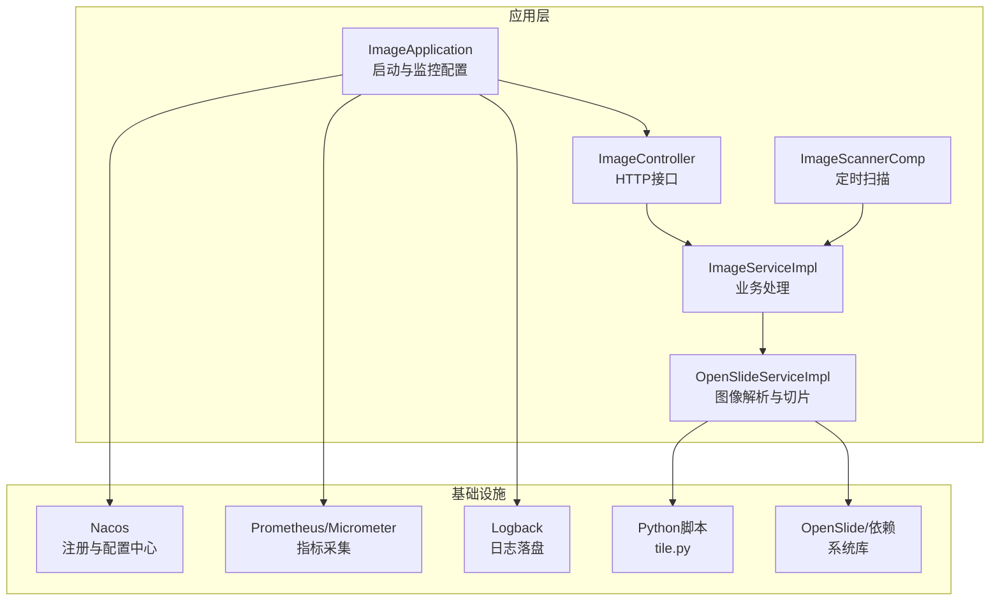
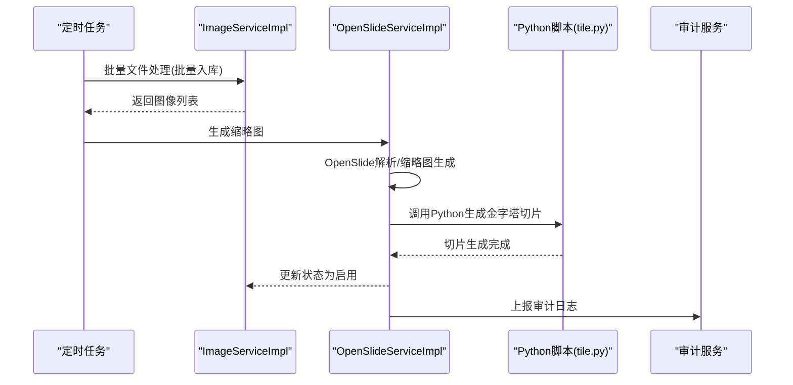
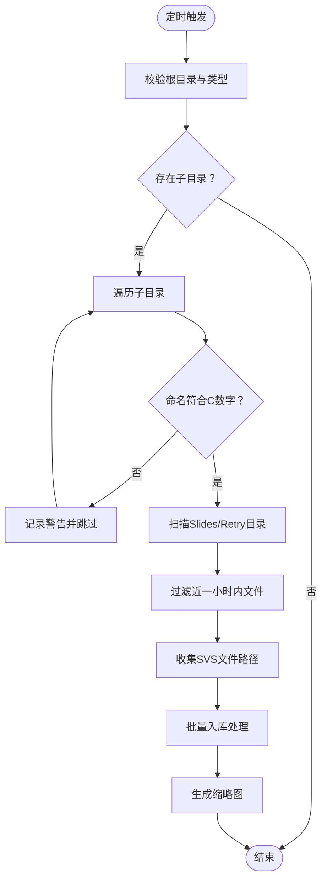
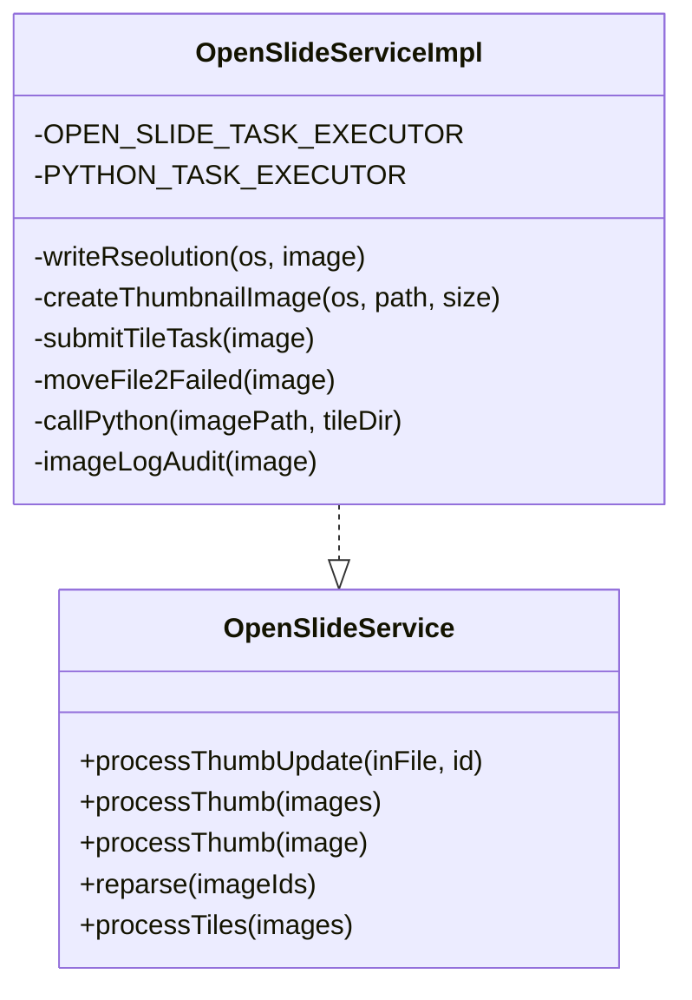
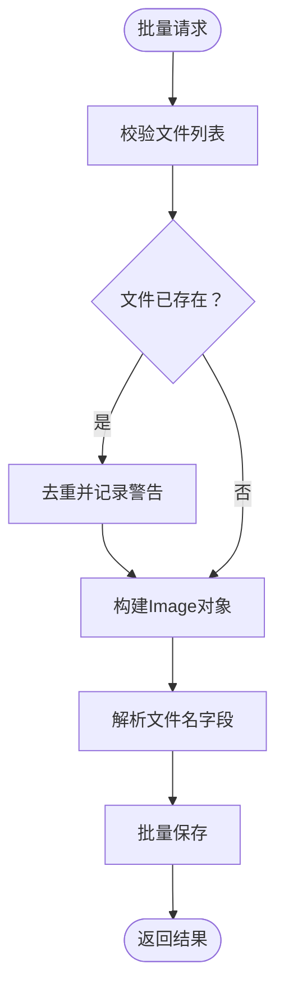
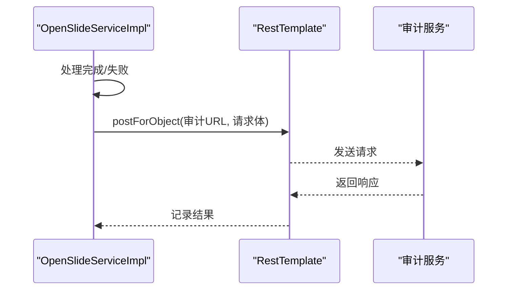
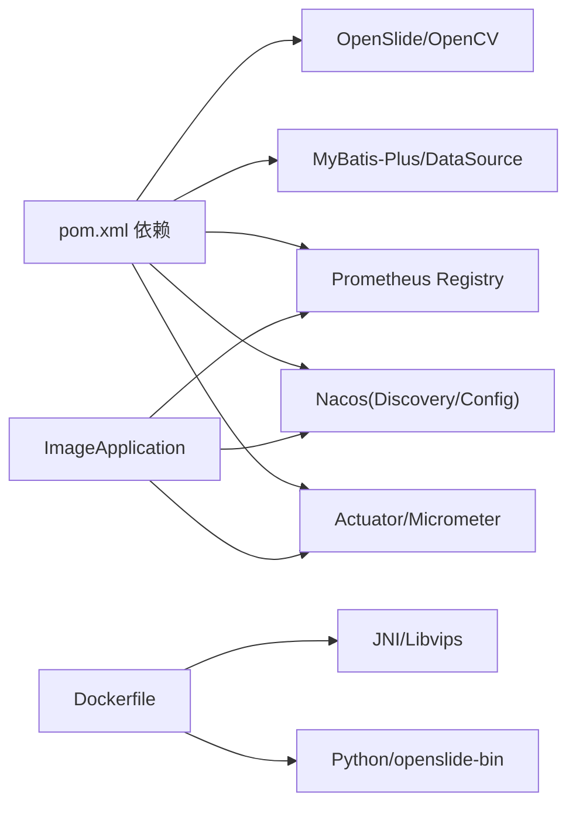

# 监控与运维

<cite>
**本文引用的文件**   
- [ImageApplication.java](file://src/main/java/cn/staitech/ImageApplication.java)
- [bootstrap.yml](file://src/main/resources/bootstrap.yml)
- [logback.xml](file://src/main/resources/logback.xml)
- [ImageScannerComp.java](file://src/main/java/cn/staitech/file/scheduled/ImageScannerComp.java)
- [ImageController.java](file://src/main/java/cn/staitech/file/controller/ImageController.java)
- [ImageServiceImpl.java](file://src/main/java/cn/staitech/file/service/impl/ImageServiceImpl.java)
- [OpenSlideServiceImpl.java](file://src/main/java/cn/staitech/file/service/impl/OpenSlideServiceImpl.java)
- [OpenSlideService.java](file://src/main/java/cn/staitech/file/service/OpenSlideService.java)
- [ImageUtils.java](file://src/main/java/cn/staitech/file/util/ImageUtils.java)
- [ImageConstant.java](file://src/main/java/cn/staitech/file/constant/ImageConstant.java)
- [Dockerfile](file://docker/staitech/modules/image/Dockerfile)
- [pom.xml](file://pom.xml)
</cite>

## 目录
1. [简介](#简介)
2. [项目结构](#项目结构)
3. [核心组件](#核心组件)
4. [架构总览](#架构总览)
5. [详细组件分析](#详细组件分析)
6. [依赖关系分析](#依赖关系分析)
7. [性能考量](#性能考量)
8. [故障排查指南](#故障排查指南)
9. [结论](#结论)
10. [附录](#附录)

## 简介
本文件面向PACMVS图像解析服务的运维团队，提供系统监控与运维实践指南。内容覆盖系统监控指标采集、告警配置、性能监控策略、日志管理与审计日志、定时任务调度、系统健康检查与异常处理机制，并给出运维脚本、监控仪表板配置建议与性能优化建议，帮助运维人员完成日常维护与故障处理。

## 项目结构
- 应用入口与监控基础
  - 应用入口启用调度、Websocket、Actuator、Micrometer、Nacos、Feign等能力，便于统一监控与治理。
  - Actuator暴露运行时指标，Micrometer注册Prometheus指标，便于对接监控系统。
- 配置与部署
  - bootstrap.yml集中管理端口、Nacos注册与配置、多环境Profile。
  - Dockerfile内置Python、OpenSlide依赖，挂载附件/切片目录，容器化部署。
- 业务模块
  - 定时扫描：周期性扫描本地切片目录，批量入库与生成缩略图。
  - 图像处理：OpenSlide解析、缩略图生成、金字塔切片生成、失败文件归档。
  - 日志与审计：统一Logback滚动日志；调用审计服务上报图像处理事件。

图表来源
- [ImageApplication.java:37-52](file://src/main/java/cn/staitech/ImageApplication.java#L37-L52)
- [ImageController.java:30-72](file://src/main/java/cn/staitech/file/controller/ImageController.java#L30-L72)
- [ImageServiceImpl.java:64-140](file://src/main/java/cn/staitech/file/service/impl/ImageServiceImpl.java#L64-L140)
- [OpenSlideServiceImpl.java:277-339](file://src/main/java/cn/staitech/file/service/impl/OpenSlideServiceImpl.java#L277-L339)
- [ImageScannerComp.java:34-74](file://src/main/java/cn/staitech/file/scheduled/ImageScannerComp.java#L34-L74)

章节来源
- [ImageApplication.java:27-52](file://src/main/java/cn/staitech/ImageApplication.java#L27-L52)
- [bootstrap.yml:1-37](file://src/main/resources/bootstrap.yml#L1-L37)
- [Dockerfile:1-46](file://docker/staitech/modules/image/Dockerfile#L1-L46)

## 核心组件
- 应用入口与监控
  - 启用调度、WebSocket、Actuator、Micrometer、Nacos、Feign、事务管理等。
  - 通过MeterRegistryCustomizer设置commonTags，统一打点标签。
- 配置中心与环境
  - bootstrap.yml定义端口、Nacos注册与配置、共享配置、多环境Profile。
- 日志系统
  - logback.xml按级别滚动输出info/warn/error/debug日志，控制台与文件双通道。
- 业务处理
  - ImageServiceImpl：批量文件处理、文件名解析、路径生成、状态机推进。
  - OpenSlideServiceImpl：缩略图生成、金字塔切片生成、失败文件归档、审计上报。
- 定时任务
  - ImageScannerComp：周期扫描指定目录，筛选SVS文件，批量入库与生成缩略图。
- 工具与常量
  - ImageUtils：文件扩展名校验、目录检查、OpenSlide验证与转换、路径工具。
  - ImageConstant：状态码、存储目录、解剖期常量等。

章节来源
- [ImageApplication.java:27-52](file://src/main/java/cn/staitech/ImageApplication.java#L27-L52)
- [bootstrap.yml:1-37](file://src/main/resources/bootstrap.yml#L1-L37)
- [logback.xml:1-116](file://src/main/resources/logback.xml#L1-L116)
- [ImageServiceImpl.java:64-140](file://src/main/java/cn/staitech/file/service/impl/ImageServiceImpl.java#L64-L140)
- [OpenSlideServiceImpl.java:277-339](file://src/main/java/cn/staitech/file/service/impl/OpenSlideServiceImpl.java#L277-L339)
- [ImageScannerComp.java:34-74](file://src/main/java/cn/staitech/file/scheduled/ImageScannerComp.java#L34-L74)
- [ImageUtils.java:23-148](file://src/main/java/cn/staitech/file/util/ImageUtils.java#L23-L148)
- [ImageConstant.java:9-67](file://src/main/java/cn/staitech/file/constant/ImageConstant.java#L9-L67)

## 架构总览
- 监控与治理
  - Actuator + Micrometer + Prometheus：暴露JVM与应用指标，统一采集。
  - Nacos：服务注册与配置下发，支持多环境切换。
- 数据流
  - 定时扫描发现SVS文件 → 入库并标记解析中 → OpenSlide解析与缩略图生成 → 生成金字塔切片 → 成功启用或失败归档 → 审计上报。
- 日志与审计
  - Logback滚动日志；审计服务通过RestTemplate上报图像处理事件。

图表来源
- [ImageScannerComp.java:62-63](file://src/main/java/cn/staitech/file/scheduled/ImageScannerComp.java#L62-L63)
- [ImageServiceImpl.java:137-140](file://src/main/java/cn/staitech/file/service/impl/ImageServiceImpl.java#L137-L140)
- [OpenSlideServiceImpl.java:319-339](file://src/main/java/cn/staitech/file/service/impl/OpenSlideServiceImpl.java#L319-L339)

## 详细组件分析

### 定时扫描组件（ImageScannerComp）
- 触发策略
  - 固定速率执行，用于周期性扫描本地切片目录。
- 扫描逻辑
  - 校验根目录与子目录命名规范，筛选Slides/Retry目录，过滤近一小时内的文件，收集SVS文件路径。
- 处理流程
  - 将文件集合交给ImageServiceImpl批量处理，再由OpenSlideServiceImpl生成缩略图与切片。
- 异常处理
  - 目录不存在、权限不足、解析异常均记录日志并跳过当前目录。

图表来源
- [ImageScannerComp.java:34-74](file://src/main/java/cn/staitech/file/scheduled/ImageScannerComp.java#L34-L74)
- [ImageScannerComp.java:82-168](file://src/main/java/cn/staitech/file/scheduled/ImageScannerComp.java#L82-L168)

章节来源
- [ImageScannerComp.java:34-172](file://src/main/java/cn/staitech/file/scheduled/ImageScannerComp.java#L34-L172)

### 图像处理组件（OpenSlideServiceImpl）
- 缩略图生成
  - 通过OpenSlide验证与转换，生成256×256与1024×1024缩略图，更新宽高、层级数、瓦片数列表。
- 金字塔切片生成
  - 调用Python脚本tile.py生成切片，完成后更新状态为启用。
- 失败处理
  - 解析失败或切片失败时，将文件移动至Failed目录并记录日志。
- 审计上报
  - 通过RestTemplate调用审计服务，上报图像处理事件。

图表来源
- [OpenSlideService.java:14-40](file://src/main/java/cn/staitech/file/service/OpenSlideService.java#L14-L40)
- [OpenSlideServiceImpl.java:47-563](file://src/main/java/cn/staitech/file/service/impl/OpenSlideServiceImpl.java#L47-L563)

章节来源
- [OpenSlideServiceImpl.java:149-202](file://src/main/java/cn/staitech/file/service/impl/OpenSlideServiceImpl.java#L149-L202)
- [OpenSlideServiceImpl.java:319-339](file://src/main/java/cn/staitech/file/service/impl/OpenSlideServiceImpl.java#L319-L339)
- [OpenSlideServiceImpl.java:399-454](file://src/main/java/cn/staitech/file/service/impl/OpenSlideServiceImpl.java#L399-L454)
- [OpenSlideServiceImpl.java:487-535](file://src/main/java/cn/staitech/file/service/impl/OpenSlideServiceImpl.java#L487-L535)

### 业务处理组件（ImageServiceImpl）
- 批量处理
  - 校验文件有效性、去重、解析文件名字段、生成路径与URL、批量入库。
- 文件名解析
  - 支持两种格式：空格分隔与波浪号分隔，解析专题号、动物号、蜡块号、组号与性别、解剖期等。
- 路径与URL生成
  - 基于组织ID生成四数字目录，构造缩略图、宏图、标签图、缓存缩略图等URL。

图表来源
- [ImageServiceImpl.java:64-140](file://src/main/java/cn/staitech/file/service/impl/ImageServiceImpl.java#L64-L140)
- [ImageServiceImpl.java:421-484](file://src/main/java/cn/staitech/file/service/impl/ImageServiceImpl.java#L421-L484)

章节来源
- [ImageServiceImpl.java:64-140](file://src/main/java/cn/staitech/file/service/impl/ImageServiceImpl.java#L64-L140)
- [ImageServiceImpl.java:275-305](file://src/main/java/cn/staitech/file/service/impl/ImageServiceImpl.java#L275-L305)
- [ImageServiceImpl.java:421-484](file://src/main/java/cn/staitech/file/service/impl/ImageServiceImpl.java#L421-L484)

### 日志与审计（Logback与审计上报）
- 日志
  - info/warn/error/debug按天滚动，保留60天；控制台与文件双通道输出。
- 审计
  - OpenSlideServiceImpl在关键节点调用审计服务，上报模块、页面、字段映射与操作对象。

图表来源
- [OpenSlideServiceImpl.java:487-535](file://src/main/java/cn/staitech/file/service/impl/OpenSlideServiceImpl.java#L487-L535)
- [logback.xml:105-116](file://src/main/resources/logback.xml#L105-L116)

章节来源
- [logback.xml:1-116](file://src/main/resources/logback.xml#L1-116)
- [OpenSlideServiceImpl.java:487-535](file://src/main/java/cn/staitech/file/service/impl/OpenSlideServiceImpl.java#L487-L535)

## 依赖关系分析
- 监控与治理
  - Actuator、Micrometer、Prometheus Registry在pom中引入，应用入口启用。
- 配置与注册
  - Nacos Discovery/Config在bootstrap.yml中配置，支持多环境Profile。
- 本地化与系统库
  - Dockerfile安装Python、pip、openslide-bin，拷贝JNI与libvips库，挂载切片目录。
- 业务依赖
  - OpenSlide、OpenCV、Redisson、MyBatis-Plus、MinIO/FastDFS等。

图表来源
- [pom.xml:47-205](file://pom.xml#L47-L205)
- [Dockerfile:6-36](file://docker/staitech/modules/image/Dockerfile#L6-L36)
- [ImageApplication.java:47-50](file://src/main/java/cn/staitech/ImageApplication.java#L47-L50)

章节来源
- [pom.xml:47-205](file://pom.xml#L47-L205)
- [Dockerfile:1-46](file://docker/staitech/modules/image/Dockerfile#L1-L46)
- [ImageApplication.java:47-50](file://src/main/java/cn/staitech/ImageApplication.java#L47-L50)

## 性能考量
- 并发与异步
  - OpenSlide与Python任务分别使用独立线程池，避免阻塞影响整体吞吐。
- I/O与磁盘
  - 切片与缩略图生成涉及大量磁盘I/O，建议将本地文件路径与输出路径置于高性能磁盘，合理规划目录层级。
- 解析与转换
  - OpenSlide解析失败时自动转换为可识别的金字塔TIF，提升兼容性但增加CPU开销，需平衡并发与资源。
- 状态机与幂等
  - 通过状态字段严格控制流程，避免重复处理；批量入库前进行去重判断，减少数据库压力。
- 网络与外部依赖
  - Python脚本与OpenSlide依赖需在容器内可用，确保网络可达与依赖版本一致。

章节来源
- [OpenSlideServiceImpl.java:67-72](file://src/main/java/cn/staitech/file/service/impl/OpenSlideServiceImpl.java#L67-L72)
- [ImageServiceImpl.java:98-122](file://src/main/java/cn/staitech/file/service/impl/ImageServiceImpl.java#L98-L122)
- [ImageUtils.java:52-97](file://src/main/java/cn/staitech/file/util/ImageUtils.java#L52-L97)

## 故障排查指南
- 常见问题定位
  - 定时扫描无文件：确认根目录与子目录命名、Slides/Retry目录存在性与权限。
  - 解析失败：查看OpenSlide日志与失败目录迁移情况；核对文件名格式与专题号有效性。
  - 切片失败：检查Python脚本路径与可执行权限、磁盘空间与输出目录权限。
  - 审计上报失败：检查RestTemplate目标地址可达性与网络策略。
- 日志定位
  - 使用info/warn/error/debug滚动日志快速定位异常阶段与堆栈信息。
- 快速恢复
  - 对于失败文件，可使用“重新解析”接口针对失败ID重试；必要时手动移动回正常目录后重新入库。

章节来源
- [ImageScannerComp.java:40-44](file://src/main/java/cn/staitech/file/scheduled/ImageScannerComp.java#L40-L44)
- [OpenSlideServiceImpl.java:399-454](file://src/main/java/cn/staitech/file/service/impl/OpenSlideServiceImpl.java#L399-L454)
- [OpenSlideServiceImpl.java:259-268](file://src/main/java/cn/staitech/file/service/impl/OpenSlideServiceImpl.java#L259-L268)
- [logback.xml:105-116](file://src/main/resources/logback.xml#L105-L116)

## 结论
本项目通过Actuator与Micrometer实现统一监控，结合Nacos完成配置与注册，利用Logback与审计服务保障可观测性与合规性。定时扫描与异步处理链路清晰，具备良好的扩展性与稳定性。建议在生产环境中完善Prometheus/Grafana监控面板、告警阈值与自动化排障脚本，持续优化I/O与并发配置以提升吞吐与稳定性。

## 附录

### 监控指标与告警建议
- 指标采集
  - JVM：heap、gc、threads、classes、uptime。
  - 应用：请求QPS/耗时、错误率、Active Jobs、Queue Length、OpenSlide/Python任务耗时。
  - 文件系统：磁盘使用率、IO等待、inode使用。
- 告警阈值示例
  - 错误率>1%持续5分钟
  - 切片任务平均耗时>预设阈值
  - 磁盘使用率>85%
  - 审计上报失败>阈值
- 仪表板建议
  - 请求与错误趋势、任务队列长度、OpenSlide/Python任务耗时分布、失败文件数量趋势、磁盘与IO指标。

章节来源
- [ImageApplication.java:47-50](file://src/main/java/cn/staitech/ImageApplication.java#L47-L50)
- [pom.xml:192-194](file://pom.xml#L192-L194)

### 运维脚本与最佳实践
- 容器部署
  - 使用Dockerfile构建镜像，挂载附件/切片目录，确保Python与OpenSlide依赖可用。
- 健康检查
  - 对外暴露健康端点，结合K8s/liveness/readiness探针。
- 日志轮转
  - 保持日志滚动策略与保留周期，定期清理超限日志。
- 失败处理
  - 自动化脚本定期扫描Failed目录并重试或人工介入。

章节来源
- [Dockerfile:16-46](file://docker/staitech/modules/image/Dockerfile#L16-L46)
- [logback.xml:16-103](file://src/main/resources/logback.xml#L16-L103)