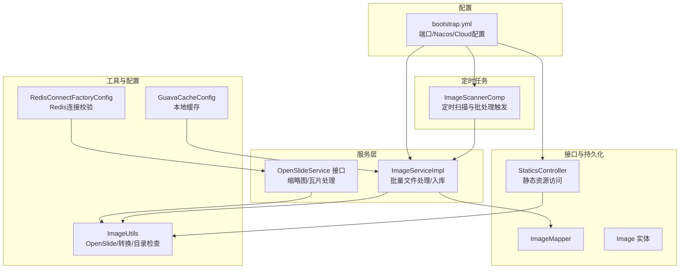
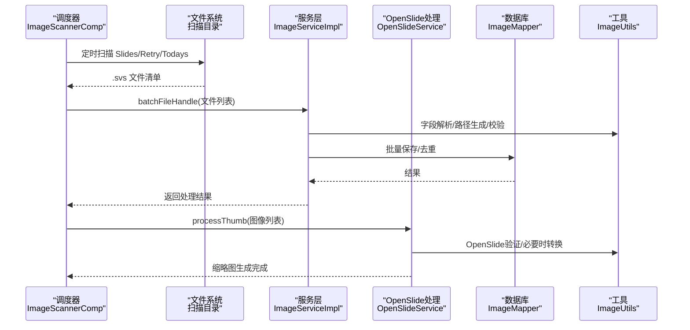
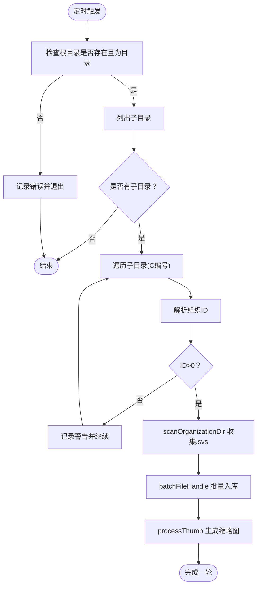
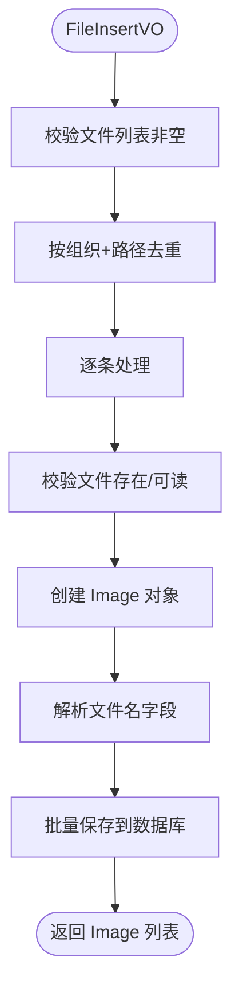
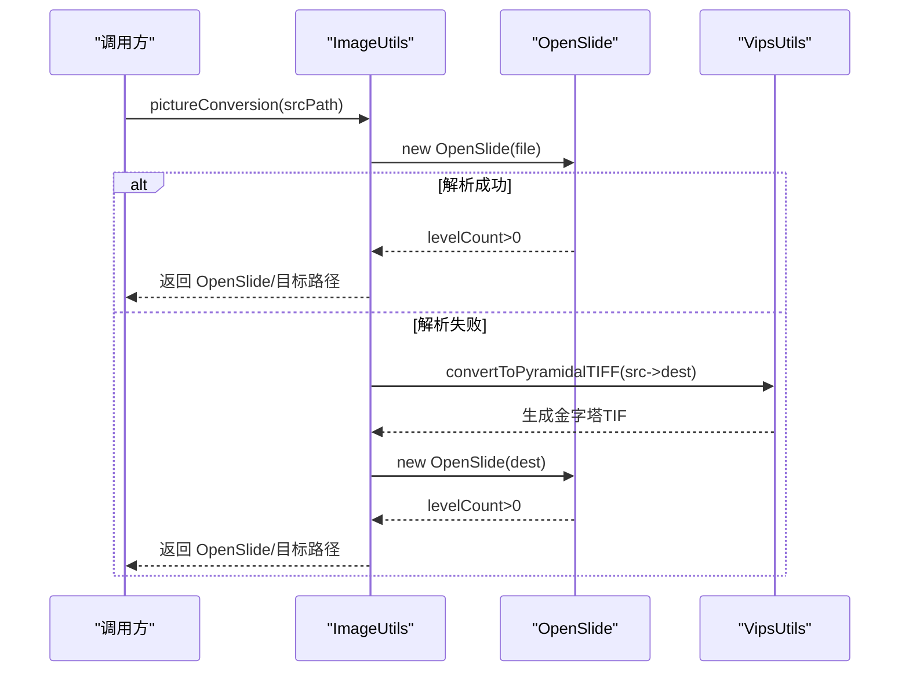
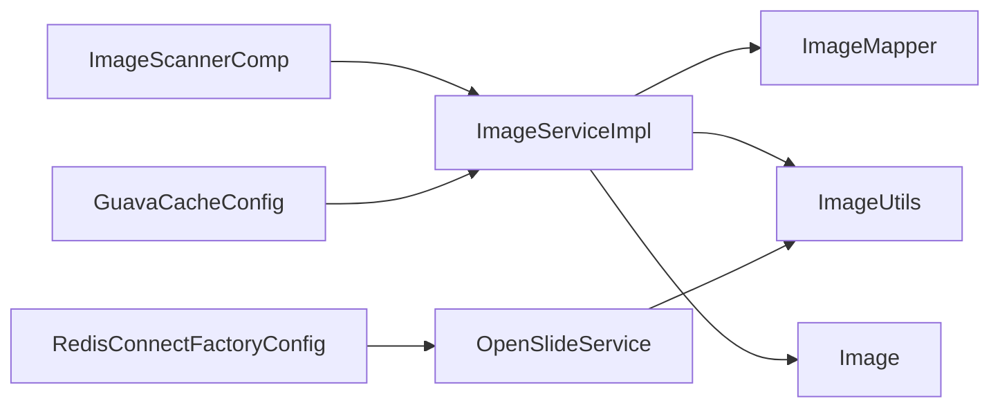

# 系统监控

<cite>
**本文引用的文件**
- [ImageScannerComp.java](file://src/main/java/cn/staitech/file/scheduled/ImageScannerComp.java)
- [ImageServiceImpl.java](file://src/main/java/cn/staitech/file/service/impl/ImageServiceImpl.java)
- [OpenSlideService.java](file://src/main/java/cn/staitech/file/service/OpenSlideService.java)
- [ImageUtils.java](file://src/main/java/cn/staitech/file/util/ImageUtils.java)
- [GuavaCacheConfig.java](file://src/main/java/cn/staitech/file/config/GuavaCacheConfig.java)
- [RedisConnectFactoryConfig.java](file://src/main/java/cn/staitech/file/config/RedisConnectFactoryConfig.java)
- [bootstrap.yml](file://src/main/resources/bootstrap.yml)
- [Image.java](file://src/main/java/cn/staitech/file/domain/Image.java)
- [ImageMapper.java](file://src/main/java/cn/staitech/file/mapper/ImageMapper.java)
- [StaticsController.java](file://src/main/java/cn/staitech/file/controller/StaticsController.java)
</cite>

## 目录
1. [简介](#简介)
2. [项目结构](#项目结构)
3. [核心组件](#核心组件)
4. [架构总览](#架构总览)
5. [详细组件分析](#详细组件分析)
6. [依赖分析](#依赖分析)
7. [性能考虑](#性能考虑)
8. [故障排查指南](#故障排查指南)
9. [结论](#结论)
10. [附录](#附录)

## 简介
本文件面向运维与开发团队，系统化梳理 PACMVS 图像处理服务的监控与可观测性现状与改进建议。重点覆盖以下方面：
- 性能监控指标采集机制：CPU、内存、磁盘、网络 I/O 的采集与上报建议
- 定时任务调度机制（ImageScannerComp）：执行频率、异常处理与重试策略
- 健康检查与状态监控：接口与运行态观测
- 可视化与告警：监控面板与阈值建议
- 图像处理性能监控、缓存命中率监控、数据库连接池监控的具体实现与优化建议
- 运维基线与异常检测指导

## 项目结构
本项目采用基于功能域的分层组织方式，核心模块包括：
- scheduled：定时任务（图像扫描）
- service：业务服务（图像处理、OpenSlide处理）
- util：工具类（图像解析、转换）
- config：Spring 配置（缓存、Redis 连接工厂）
- controller：对外接口（静态资源访问）
- domain/mapper：领域模型与持久层映射
- resources：应用配置（bootstrap.yml）

图表来源
- [ImageScannerComp.java:1-172](file://src/main/java/cn/staitech/file/scheduled/ImageScannerComp.java#L1-L172)
- [ImageServiceImpl.java:1-548](file://src/main/java/cn/staitech/file/service/impl/ImageServiceImpl.java#L1-L548)
- [OpenSlideService.java:1-40](file://src/main/java/cn/staitech/file/service/OpenSlideService.java#L1-L40)
- [ImageUtils.java:1-148](file://src/main/java/cn/staitech/file/util/ImageUtils.java#L1-L148)
- [GuavaCacheConfig.java:1-27](file://src/main/java/cn/staitech/file/config/GuavaCacheConfig.java#L1-L27)
- [RedisConnectFactoryConfig.java:1-26](file://src/main/java/cn/staitech/file/config/RedisConnectFactoryConfig.java#L1-L26)
- [bootstrap.yml:1-37](file://src/main/resources/bootstrap.yml#L1-L37)
- [Image.java:1-216](file://src/main/java/cn/staitech/file/domain/Image.java#L1-L216)
- [ImageMapper.java:1-16](file://src/main/java/cn/staitech/file/mapper/ImageMapper.java#L1-L16)
- [StaticsController.java:1-46](file://src/main/java/cn/staitech/file/controller/StaticsController.java#L1-L46)

章节来源
- [bootstrap.yml:1-37](file://src/main/resources/bootstrap.yml#L1-L37)

## 核心组件
- ImageScannerComp：基于固定周期的定时扫描器，负责扫描指定目录树，筛选 .svs 文件并触发批量入库与缩略图生成流程。
- ImageServiceImpl：负责文件路径校验、去重、字段解析（专题/动物/蜡块/组别/性别/解剖期限）、入库与URL生成。
- OpenSlideService：抽象图像处理接口，包含缩略图生成、瓦片处理、重解析等能力。
- ImageUtils：封装 OpenSlide 验证、必要时的 pyramidal TIFF 转换、目录创建与文件名校验等。
- GuavaCacheConfig：本地缓存配置（容量、过期策略）。
- RedisConnectFactoryConfig：Redis 连接工厂启用连接校验。
- StaticsController：静态资源访问控制器，支持缩略图等二进制资源读取。

章节来源
- [ImageScannerComp.java:1-172](file://src/main/java/cn/staitech/file/scheduled/ImageScannerComp.java#L1-L172)
- [ImageServiceImpl.java:1-548](file://src/main/java/cn/staitech/file/service/impl/ImageServiceImpl.java#L1-L548)
- [OpenSlideService.java:1-40](file://src/main/java/cn/staitech/file/service/OpenSlideService.java#L1-L40)
- [ImageUtils.java:1-148](file://src/main/java/cn/staitech/file/util/ImageUtils.java#L1-L148)
- [GuavaCacheConfig.java:1-27](file://src/main/java/cn/staitech/file/config/GuavaCacheConfig.java#L1-L27)
- [RedisConnectFactoryConfig.java:1-26](file://src/main/java/cn/staitech/file/config/RedisConnectFactoryConfig.java#L1-L26)
- [StaticsController.java:1-46](file://src/main/java/cn/staitech/file/controller/StaticsController.java#L1-L46)

## 架构总览
系统监控视角的关键交互如下：

图表来源
- [ImageScannerComp.java:34-74](file://src/main/java/cn/staitech/file/scheduled/ImageScannerComp.java#L34-L74)
- [ImageServiceImpl.java:64-140](file://src/main/java/cn/staitech/file/service/impl/ImageServiceImpl.java#L64-L140)
- [OpenSlideService.java:25-36](file://src/main/java/cn/staitech/file/service/OpenSlideService.java#L25-L36)
- [ImageMapper.java:1-16](file://src/main/java/cn/staitech/file/mapper/ImageMapper.java#L1-L16)
- [ImageUtils.java:64-96](file://src/main/java/cn/staitech/file/util/ImageUtils.java#L64-L96)

## 详细组件分析

### 定时任务调度机制（ImageScannerComp）
- 执行频率：固定周期（默认 1 小时，注释中提供分钟级示例）。可通过配置调整。
- 触发条件：到达周期点后执行扫描。
- 扫描范围：按组织目录（C001/C012 等）遍历 Slides 下的 Today 子目录与 Retry 目录，过滤 .svs 文件。
- 时间窗口：仅处理“早于一小时前”的文件，避免并发写入导致的读取异常。
- 异常处理：对单个目录解析失败进行日志记录并跳过；对安全异常进行捕获与记录。
- 重试策略：Retry 目录中的 .svs 若超过一小时则跳过，避免无限重试；当前未实现自动重试队列或指数退避。

图表来源
- [ImageScannerComp.java:34-74](file://src/main/java/cn/staitech/file/scheduled/ImageScannerComp.java#L34-L74)
- [ImageScannerComp.java:82-168](file://src/main/java/cn/staitech/file/scheduled/ImageScannerComp.java#L82-L168)

章节来源
- [ImageScannerComp.java:1-172](file://src/main/java/cn/staitech/file/scheduled/ImageScannerComp.java#L1-L172)

### 图像处理与入库（ImageServiceImpl）
- 批量处理：校验文件路径有效性、去重（按组织+路径）、逐条解析文件名字段、设置状态与URL。
- 字段解析：支持两种格式（空格分隔与波浪号分隔），解析失败回退到备用解析逻辑。
- URL生成：缩略图/宏图/标签图/缓存缩略图路径生成。
- 数据持久化：MyBatis Plus 批量保存，异常时返回失败信息。

图表来源
- [ImageServiceImpl.java:64-140](file://src/main/java/cn/staitech/file/service/impl/ImageServiceImpl.java#L64-L140)
- [ImageServiceImpl.java:421-484](file://src/main/java/cn/staitech/file/service/impl/ImageServiceImpl.java#L421-L484)
- [ImageMapper.java:1-16](file://src/main/java/cn/staitech/file/mapper/ImageMapper.java#L1-L16)

章节来源
- [ImageServiceImpl.java:1-548](file://src/main/java/cn/staitech/file/service/impl/ImageServiceImpl.java#L1-L548)
- [Image.java:1-216](file://src/main/java/cn/staitech/file/domain/Image.java#L1-L216)

### OpenSlide 处理与图像工具（OpenSlideService + ImageUtils）
- OpenSlide 验证：尝试直接解析，若失败则转为 pyramidal TIFF 并再次验证。
- 目录与文件管理：检查并创建目标目录，确保后续写入成功。
- 转换流程：当 OpenSlide 无法解析时，调用 Vips 工具生成金字塔 TIFF，再由 OpenSlide 加载。

图表来源
- [ImageUtils.java:52-96](file://src/main/java/cn/staitech/file/util/ImageUtils.java#L52-L96)

章节来源
- [OpenSlideService.java:1-40](file://src/main/java/cn/staitech/file/service/OpenSlideService.java#L1-L40)
- [ImageUtils.java:1-148](file://src/main/java/cn/staitech/file/util/ImageUtils.java#L1-L148)

### 缓存与连接池监控
- 本地缓存：Guava Cache 最大容量与过期策略配置，可用于减少重复解析与IO。
- Redis 连接：Lettuce 连接工厂启用连接校验，降低无效连接带来的开销与风险。

章节来源
- [GuavaCacheConfig.java:1-27](file://src/main/java/cn/staitech/file/config/GuavaCacheConfig.java#L1-L27)
- [RedisConnectFactoryConfig.java:1-26](file://src/main/java/cn/staitech/file/config/RedisConnectFactoryConfig.java#L1-L26)

### 健康检查与状态监控
- 静态资源访问：通过 StaticsController 提供缩略图等二进制资源读取，便于前端/浏览器侧健康探测。
- 日志与异常：各组件广泛使用 SLF4J 记录 INFO/WARN/ERROR，便于集中化日志采集与告警。

章节来源
- [StaticsController.java:1-46](file://src/main/java/cn/staitech/file/controller/StaticsController.java#L1-L46)

## 依赖分析
- 组件内聚：服务层与工具层职责清晰，扫描器与服务层通过接口解耦。
- 外部依赖：OpenSlide、Vips、MyBatis Plus、Lettuce、Nacos 等。
- 潜在耦合点：扫描器与服务层的调用链较长，建议在关键节点增加监控埋点与超时控制。

图表来源
- [ImageScannerComp.java:1-172](file://src/main/java/cn/staitech/file/scheduled/ImageScannerComp.java#L1-L172)
- [ImageServiceImpl.java:1-548](file://src/main/java/cn/staitech/file/service/impl/ImageServiceImpl.java#L1-L548)
- [ImageMapper.java:1-16](file://src/main/java/cn/staitech/file/mapper/ImageMapper.java#L1-L16)
- [Image.java:1-216](file://src/main/java/cn/staitech/file/domain/Image.java#L1-L216)
- [OpenSlideService.java:1-40](file://src/main/java/cn/staitech/file/service/OpenSlideService.java#L1-L40)
- [GuavaCacheConfig.java:1-27](file://src/main/java/cn/staitech/file/config/GuavaCacheConfig.java#L1-L27)
- [RedisConnectFactoryConfig.java:1-26](file://src/main/java/cn/staitech/file/config/RedisConnectFactoryConfig.java#L1-L26)

## 性能考虑
- CPU 使用率
  - 图像解析与缩略图生成依赖 OpenSlide/Vips，属于 CPU 密集型。建议：
    - 合理设置扫描频率，避免与高峰期冲突
    - 对 .svs 文件进行预筛选，减少无效 IO
    - 在高负载时限制并发线程数（结合线程池配置）
- 内存占用
  - 批量入库与 OpenSlide 对象持有需关注堆内存峰值。建议：
    - 控制批量大小，及时释放中间对象
    - 启用 JVM 垃圾回收器调优与堆上限设置
- 磁盘空间
  - 缩略图/瓦片/金字塔 TIF 占用较大，建议：
    - 预留充足磁盘空间并设置磁盘配额
    - 定期清理临时文件与过期缓存
- 网络 I/O
  - 若涉及远程存储或 Nacos 配置中心，建议：
    - 优化连接池与超时参数
    - 启用连接复用与健康检查

## 故障排查指南
- 扫描任务未执行
  - 检查定时注解是否生效、配置项 file.scanPath 与 file.path 是否正确
  - 查看日志中“根目录不存在/目录为空/目录名格式不符”等提示
- 文件未入库或重复
  - 校验文件路径可读性与组织ID解析
  - 关注“文件已存在”日志，确认去重逻辑是否按预期工作
- 缩略图生成失败
  - 检查 OpenSlide 解析与转换流程日志
  - 确认目标目录可写、磁盘空间充足
- Redis 连接异常
  - 检查 Lettuce 连接工厂配置与目标实例状态

章节来源
- [ImageScannerComp.java:40-73](file://src/main/java/cn/staitech/file/scheduled/ImageScannerComp.java#L40-L73)
- [ImageServiceImpl.java:98-122](file://src/main/java/cn/staitech/file/service/impl/ImageServiceImpl.java#L98-L122)
- [ImageUtils.java:64-96](file://src/main/java/cn/staitech/file/util/ImageUtils.java#L64-L96)
- [RedisConnectFactoryConfig.java:18-24](file://src/main/java/cn/staitech/file/config/RedisConnectFactoryConfig.java#L18-L24)

## 结论
当前系统具备基础的定时扫描与图像处理能力，但缺乏统一的监控埋点与可视化面板。建议在现有基础上补充：
- JVM/OS 指标采集（CPU/内存/磁盘/网络）
- 关键链路耗时与吞吐统计
- 健康检查接口与就绪探针
- 告警阈值与分级策略
- 缓存命中率与数据库连接池利用率监控

## 附录

### 监控指标与采集建议
- 系统指标
  - CPU 使用率、内存使用、磁盘空间、网络 I/O
  - 建议使用 Micrometer + Prometheus 或云监控平台采集
- 应用指标
  - 扫描周期耗时、批量入库耗时、缩略图生成耗时
  - 建议在扫描器与服务层关键方法处埋点
- 缓存与连接池
  - 本地缓存命中率、Redis 连接数与可用性
  - 建议通过 Micrometer registry 暴露指标

### 健康检查与状态监控
- 接口
  - 静态资源访问接口可用于快速探测服务可用性
- 状态
  - 通过日志级别与外部探针结合判断服务健康

章节来源
- [StaticsController.java:32-44](file://src/main/java/cn/staitech/file/controller/StaticsController.java#L32-L44)

### 告警阈值建议（示例）
- 扫描周期延迟：超过 1.5 倍周期即告警
- 批量入库失败率：单次批次失败率超过 5%
- 缩略图生成失败率：单次任务失败率超过 3%
- 磁盘剩余空间：<10% 告警，<5% 紧急
- Redis 连接不可用：连续 3 次失败告警

### 运维基线与异常检测
- 基线
  - 正常扫描周期：1 小时；正常入库耗时：每万文件约 X 分钟
- 异常检测
  - 基于历史均值与标准差的动态阈值
  - 对比同机房/同集群的同类任务指标