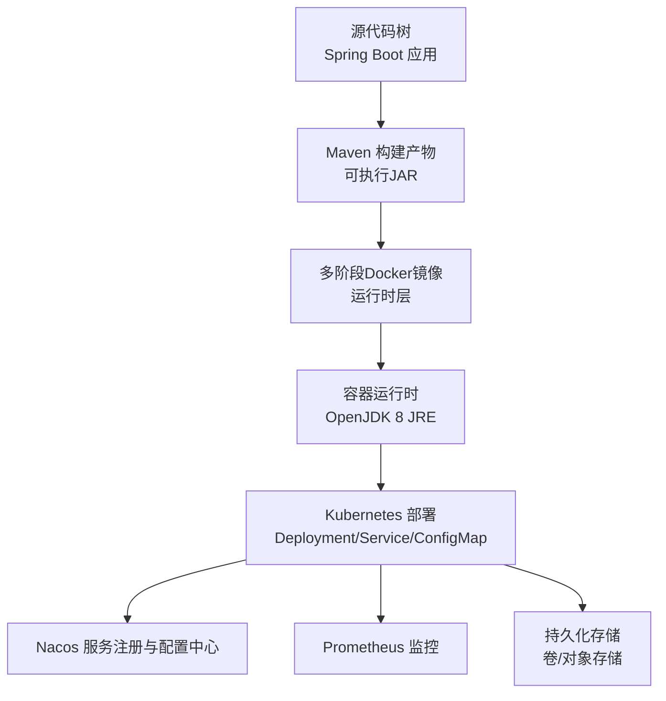
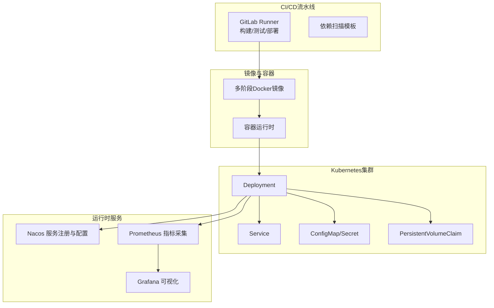
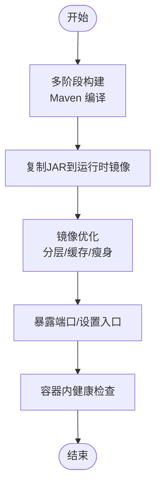
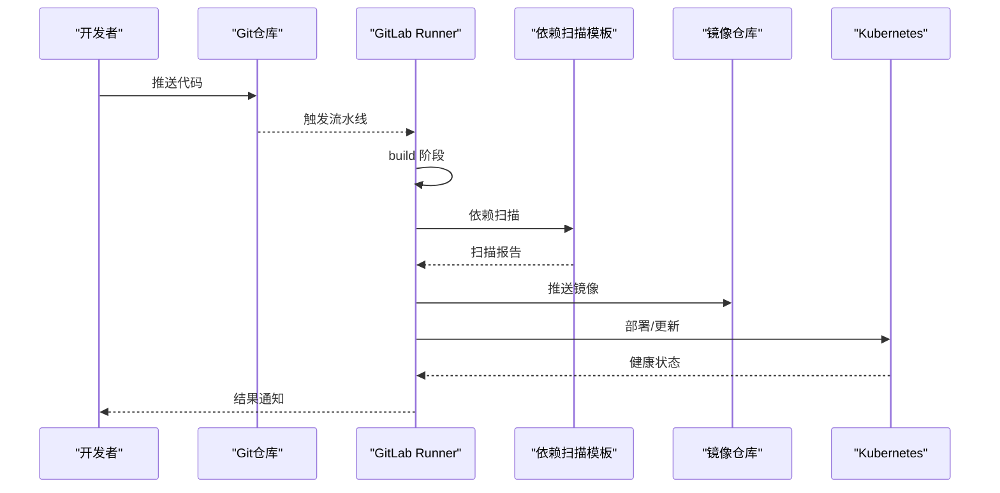
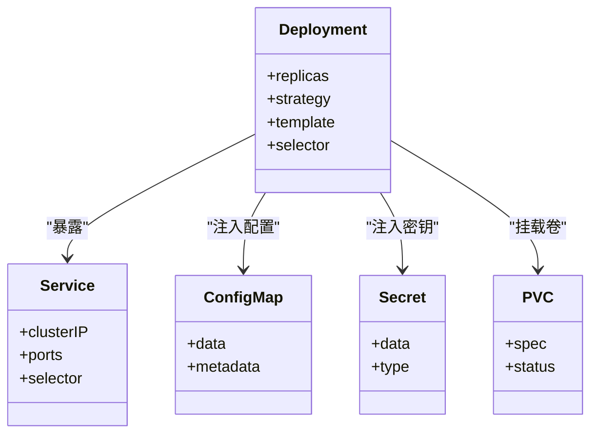
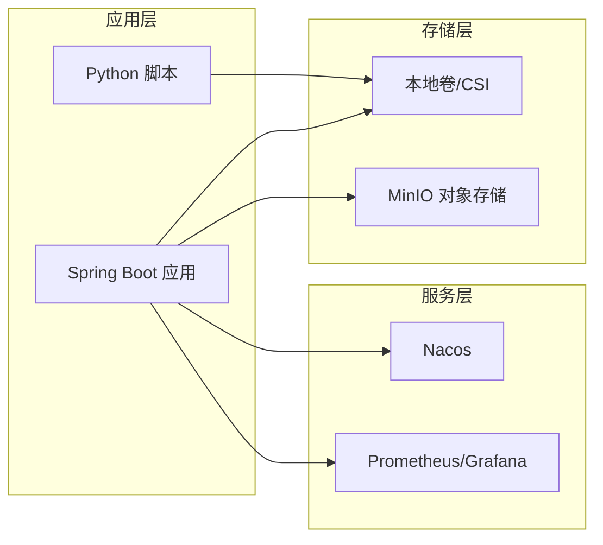
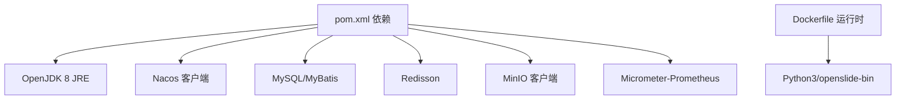

# 基础设施设计

<cite>
**本文引用的文件**
- [.gitlab-ci.yml](file://.gitlab-ci.yml)
- [Dockerfile](file://Dockerfile)
- [docker/staitech/modules/image/Dockerfile](file://docker/staitech/modules/image/Dockerfile)
- [pom.xml](file://pom.xml)
- [README.md](file://README.md)
- [src/main/resources/bootstrap.yml](file://src/main/resources/bootstrap.yml)
- [python-script/deepzoom_custom.py](file://python-script/deepzoom_custom.py)
- [python-script/tile.py](file://python-script/tile.py)
</cite>

## 目录
1. [简介](#简介)
2. [项目结构](#项目结构)
3. [核心组件](#核心组件)
4. [架构总览](#架构总览)
5. [详细组件分析](#详细组件分析)
6. [依赖关系分析](#依赖关系分析)
7. [性能考虑](#性能考虑)
8. [故障排查指南](#故障排查指南)
9. [结论](#结论)
10. [附录](#附录)

## 简介
本文件面向DevOps工程师，系统化梳理该Java图像处理服务的基础设施设计，覆盖容器化部署架构（含多阶段构建与镜像优化）、GitLab CI/CD流水线设计思路（构建、测试、部署与回滚）、Kubernetes部署配置与资源管理建议、网络拓扑与存储策略、监控与可观测性、高可用与弹性伸缩、以及灾难恢复方案。文档以仓库现有配置为基础，结合最佳实践给出可落地的实施建议。

## 项目结构
该项目采用Spring Boot工程，包含以下与基础设施相关的关键要素：
- Maven多模块父工程（artifactId为staitech-modules），当前模块为图像处理子模块
- 多阶段Dockerfile用于构建运行时镜像
- GitLab CI模板集成安全扫描
- Python脚本用于WSI（全切片数字成像）瓦片生成
- Nacos服务发现与配置中心集成
- Prometheus指标导出能力

图表来源
- [Dockerfile:1-16](file://Dockerfile#L1-L16)
- [pom.xml:1-385](file://pom.xml#L1-L385)
- [src/main/resources/bootstrap.yml:1-37](file://src/main/resources/bootstrap.yml#L1-L37)

章节来源
- [pom.xml:1-385](file://pom.xml#L1-L385)
- [Dockerfile:1-16](file://Dockerfile#L1-L16)
- [README.md:1-11](file://README.md#L1-L11)

## 核心组件
- 容器镜像构建
  - 多阶段构建：使用Maven基础镜像进行编译，再拷贝至轻量级OpenJDK 8 JRE运行时镜像，减少镜像体积与攻击面
  - 运行时暴露端口与入口命令已配置
- CI/CD流水线
  - 采用GitLab模板定义三阶段流水线（build/test/deploy）
  - 包含安全扫描模板集成
- 服务注册与配置
  - 通过Nacos实现服务注册与配置中心，支持多环境profile切换
- 监控与可观测性
  - 引入Micrometer与Prometheus适配器，便于指标采集与展示
- 存储与文件处理
  - Python脚本负责WSI瓦片生成，涉及磁盘卷挂载与缓存设置
- Kubernetes部署
  - 建议基于Deployment/Service/ConfigMap/Secret/PVC等资源进行编排

章节来源
- [Dockerfile:1-16](file://Dockerfile#L1-L16)
- [.gitlab-ci.yml:16-50](file://.gitlab-ci.yml#L16-L50)
- [src/main/resources/bootstrap.yml:1-37](file://src/main/resources/bootstrap.yml#L1-L37)
- [pom.xml:192-194](file://pom.xml#L192-L194)

## 架构总览
整体架构围绕“容器化应用 + CI/CD + 服务治理 + 监控 + 存储”展开，强调可移植性与可扩展性。

图表来源
- [.gitlab-ci.yml:21-23](file://.gitlab-ci.yml#L21-L23)
- [Dockerfile:1-16](file://Dockerfile#L1-L16)
- [src/main/resources/bootstrap.yml:17-37](file://src/main/resources/bootstrap.yml#L17-L37)
- [pom.xml:192-194](file://pom.xml#L192-L194)

## 详细组件分析

### 容器化部署架构与多阶段构建
- 构建阶段
  - 使用Maven官方Alpine镜像作为编译环境，工作目录复制源码并执行打包
- 运行阶段
  - 使用OpenJDK 8 JRE Alpine镜像，仅拷贝最终JAR，最小化运行时依赖
- 端口与入口
  - 暴露应用端口，ENTRYPOINT与CMD组合启动JAR
- 镜像优化建议
  - 固定依赖版本，启用只读根文件系统，设置非root用户运行
  - 合理分层，避免重复下载依赖；利用缓存策略提升CI效率
  - 使用健康检查与就绪探针，配合K8s滚动更新策略

图表来源
- [Dockerfile:1-16](file://Dockerfile#L1-L16)

章节来源
- [Dockerfile:1-16](file://Dockerfile#L1-L16)

### GitLab CI/CD流水线设计
- 阶段划分
  - build：编译与打包
  - test：单元测试与代码质量扫描（lint）
  - deploy：生产环境部署
- 安全集成
  - 引入依赖扫描模板，自动检测已知漏洞
- 回滚策略
  - 建议在Kubernetes中使用滚动回滚或金丝雀发布，结合版本标签与镜像digest
- 自动化建议
  - 将构建产物（JAR/镜像）归档，便于审计与快速回滚
  - 在部署前增加预检清单（如配置校验、容量评估）

图表来源
- [.gitlab-ci.yml:16-50](file://.gitlab-ci.yml#L16-L50)
- [.gitlab-ci.yml:21-23](file://.gitlab-ci.yml#L21-L23)

章节来源
- [.gitlab-ci.yml:16-50](file://.gitlab-ci.yml#L16-L50)
- [README.md:7-11](file://README.md#L7-L11)

### Kubernetes部署配置与资源管理
- Deployment
  - 设置副本数、滚动更新策略（maxUnavailable/maxSurge）
  - 资源请求与限制，结合HPA实现弹性伸缩
- Service
  - ClusterIP/NodePort/LB选择，配合Ingress暴露
- ConfigMap/Secret
  - Nacos连接参数、应用配置通过ConfigMap注入，敏感信息使用Secret
- 存储
  - 卷挂载用于附件/上传/切片缓存目录
  - 对象存储（MinIO）用于大文件与瓦片缓存
- Pod安全
  - 非root用户、只读根文件系统、最小权限RBAC

图表来源
- [src/main/resources/bootstrap.yml:17-37](file://src/main/resources/bootstrap.yml#L17-L37)
- [pom.xml:158-163](file://pom.xml#L158-L163)

章节来源
- [src/main/resources/bootstrap.yml:1-37](file://src/main/resources/bootstrap.yml#L1-L37)
- [pom.xml:158-163](file://pom.xml#L158-L163)

### 网络拓扑与存储策略
- 网络
  - 内部服务间通过ClusterIP访问Nacos与应用
  - 外部通过Ingress/NLB暴露，TLS终止于边缘网关
- 存储
  - 本地卷：附件/上传/切片缓存（根据业务需求可替换为CSI）
  - 对象存储：MinIO用于大文件与瓦片缓存，支持横向扩展
- Python脚本与卷
  - Dockerfile中声明了多个卷挂载点，确保数据持久化与共享

图表来源
- [docker/staitech/modules/image/Dockerfile:17-20](file://docker/staitech/modules/image/Dockerfile#L17-L20)
- [pom.xml:158-163](file://pom.xml#L158-L163)

章节来源
- [docker/staitech/modules/image/Dockerfile:17-20](file://docker/staitech/modules/image/Dockerfile#L17-L20)
- [pom.xml:158-163](file://pom.xml#L158-L163)

### 监控基础设施与可观测性
- 指标采集
  - Micrometer + Prometheus，暴露JVM与应用指标
- 日志
  - 建议统一日志采集（如EFK/ELK），结合Nacos配置中心集中管理
- 告警
  - Prometheus Alertmanager + Grafana告警规则
- 性能分析
  - 针对WSI处理场景，关注CPU/内存/IO与缓存命中率

章节来源
- [pom.xml:192-194](file://pom.xml#L192-L194)

### 高可用、弹性伸缩与灾难恢复
- 高可用
  - 多副本部署，跨节点亲和/反亲和，避免单点故障
  - Nacos高可用集群，配置中心与注册中心双活
- 弹性伸缩
  - HPA基于CPU/内存或自定义指标动态扩容
  - Pod PDB保障关键时段的可用性
- 灾难恢复
  - 定期备份ConfigMap/Secret与持久化数据
  - 多集群容灾，镜像与配置的版本化管理

## 依赖关系分析
- Maven依赖
  - Spring Cloud Alibaba生态（Nacos Discovery/Config/Sentinel）
  - MyBatis-Plus、Redisson、MinIO、OpenSlide/Opencv等
- 运行时依赖
  - OpenJDK 8 JRE、Python3、pip、openslide-bin
- 镜像依赖
  - 多阶段构建减少运行时依赖，提升安全性

图表来源
- [pom.xml:23-205](file://pom.xml#L23-L205)
- [Dockerfile:1-16](file://Dockerfile#L1-L16)
- [docker/staitech/modules/image/Dockerfile:6-14](file://docker/staitech/modules/image/Dockerfile#L6-L14)

章节来源
- [pom.xml:23-205](file://pom.xml#L23-L205)
- [Dockerfile:1-16](file://Dockerfile#L1-L16)
- [docker/staitech/modules/image/Dockerfile:6-14](file://docker/staitech/modules/image/Dockerfile#L6-L14)

## 性能考虑
- WSI瓦片生成
  - Python脚本采用线程池与有界队列控制并发，合理设置最大工作线程数
  - OpenSlide缓存容量按内存与数据规模调优
- 应用性能
  - JVM参数调优（堆大小、GC策略），结合Prometheus指标观测
  - I/O密集场景建议使用SSD或高性能存储后端
- 网络与带宽
  - 对象存储就近接入，减少跨地域传输延迟

章节来源
- [python-script/tile.py:33-78](file://python-script/tile.py#L33-L78)
- [python-script/tile.py:95-98](file://python-script/tile.py#L95-L98)

## 故障排查指南
- 启动失败
  - 检查容器日志与K8s事件，确认端口占用与权限问题
  - 校验Nacos连接参数与命名空间/组配置
- 性能瓶颈
  - 关注Prometheus指标与GC日志，定位CPU/内存/IO热点
  - 调整Python脚本并发参数与OpenSlide缓存容量
- 配置问题
  - 确认bootstrap.yml中的profile与Nacos地址正确
  - 检查ConfigMap/Secret是否正确挂载与生效

章节来源
- [src/main/resources/bootstrap.yml:17-37](file://src/main/resources/bootstrap.yml#L17-L37)
- [python-script/tile.py:33-78](file://python-script/tile.py#L33-L78)

## 结论
本项目具备良好的容器化与CI/CD基础，结合Nacos与Prometheus可实现服务治理与可观测性。建议在Kubernetes层面完善资源管理、存储与网络策略，并通过HPA与多副本实现弹性与高可用。同时，强化安全扫描与配置版本化管理，确保生产环境稳定与可追溯。

## 附录
- Python脚本功能要点
  - 自定义DeepZoom生成器，适配前端瓦片规格
  - 流式处理与并发控制，降低内存峰值
- 配置注入方式
  - 通过Maven Profile与Nacos实现环境隔离与动态配置

章节来源
- [python-script/deepzoom_custom.py:127-153](file://python-script/deepzoom_custom.py#L127-L153)
- [python-script/tile.py:84-100](file://python-script/tile.py#L84-L100)
- [src/main/resources/bootstrap.yml:14-16](file://src/main/resources/bootstrap.yml#L14-L16)