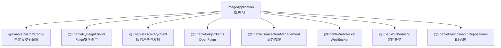
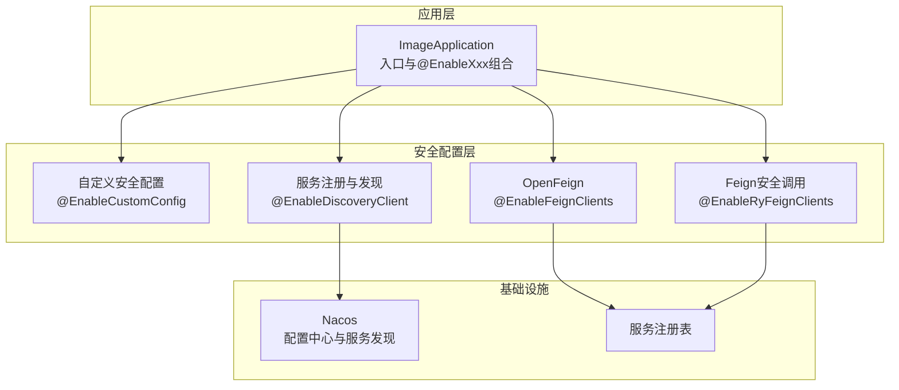
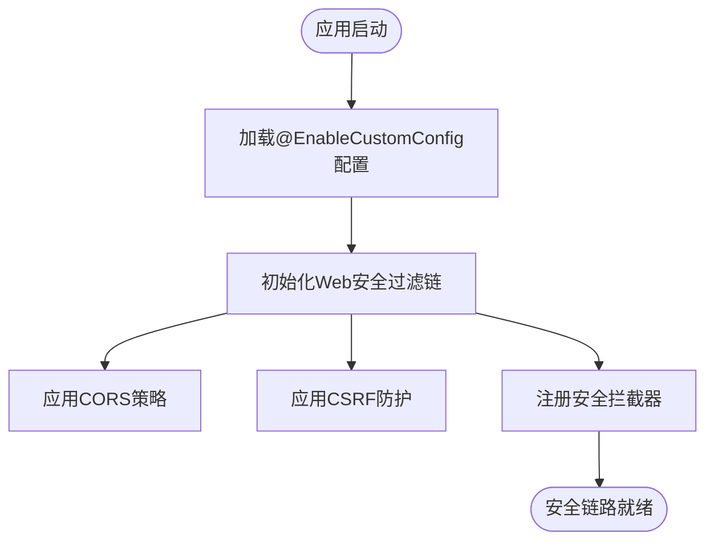
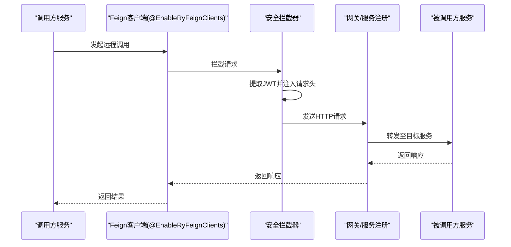
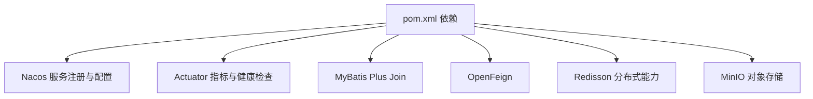

# 安全架构

<cite>
**本文引用的文件**
- [ImageApplication.java](file://src/main/java/cn/staitech/ImageApplication.java)
- [pom.xml](file://pom.xml)
- [bootstrap.yml](file://src/main/resources/bootstrap.yml)
</cite>

## 目录
1. [引言](#引言)
2. [项目结构](#项目结构)
3. [核心组件](#核心组件)
4. [架构总览](#架构总览)
5. [详细组件分析](#详细组件分析)
6. [依赖分析](#依赖分析)
7. [性能考虑](#性能考虑)
8. [故障排查指南](#故障排查指南)
9. [结论](#结论)
10. [附录](#附录)

## 引言
本专项文档聚焦于基于注解的安全配置机制与API安全防护策略，围绕以下关键点展开：
- 自定义安全配置注解@EnableCustomConfig的启用与作用范围
- Feign客户端安全调用注解@EnableRyFeignClients的功能与实现思路
- 身份认证、授权控制与API安全防护策略
- JWT令牌处理、权限验证机制与安全拦截器配置
- 跨域安全、CSRF防护与数据加密方案
- 面向安全工程师的架构设计与实施指南

在当前仓库中，应用入口通过@EnableCustomConfig与@EnableRyFeignClients等注解开启自定义安全配置与Feign客户端安全调用能力；同时，项目使用Nacos作为配置中心与服务发现，结合Spring Cloud生态实现统一的安全治理与API保护。

## 项目结构
项目采用Spring Boot + Spring Cloud架构，核心入口类位于应用主包内，并通过多个@EnableXxx注解组合启用功能特性。安全相关的关键入口为：
- 启用自定义安全配置：@EnableCustomConfig
- 启用Feign客户端安全调用：@EnableRyFeignClients
- 启用服务注册与发现：@EnableDiscoveryClient
- 启用OpenFeign：@EnableFeignClients
- 启用事务管理：@EnableTransactionManagement
- 启用WebSocket：@EnableWebSocket
- 启用定时任务：@EnableScheduling
- 启用Elasticsearch仓库：@EnableElasticsearchRepositories

图表来源
- [ImageApplication.java:27-36](file://src/main/java/cn/staitech/ImageApplication.java#L27-L36)

章节来源
- [ImageApplication.java:1-53](file://src/main/java/cn/staitech/ImageApplication.java#L1-L53)

## 核心组件
- 自定义安全配置@EnableCustomConfig
  - 作用：启用项目内置的安全配置扩展，通常包含Web安全、会话管理、CORS、CSRF、安全拦截器等的默认或增强配置。
  - 影响范围：全局Web层安全策略、静态资源访问控制、跨域策略、请求拦截与放行规则。
- Feign客户端安全调用@EnableRyFeignClients
  - 作用：启用具备安全上下文传递与鉴权能力的Feign客户端扫描与初始化，确保微服务间调用携带正确的认证信息（如JWT）与必要的安全头。
  - 影响范围：服务间REST调用的统一安全策略、Token透传、超时与重试的安全配置、熔断与限流集成。

章节来源
- [ImageApplication.java:29-31](file://src/main/java/cn/staitech/ImageApplication.java#L29-L31)

## 架构总览
下图展示应用启动后，安全配置与Feign客户端在整体架构中的位置与交互关系：

图表来源
- [ImageApplication.java:27-36](file://src/main/java/cn/staitech/ImageApplication.java#L27-L36)
- [bootstrap.yml:17-37](file://src/main/resources/bootstrap.yml#L17-L37)

## 详细组件分析

### 自定义安全配置@EnableCustomConfig
- 设计目标
  - 提供统一的Web安全策略，覆盖静态资源放行、敏感接口保护、跨域与CSRF防护、安全拦截器链路等。
  - 与Spring Security或项目内部安全框架协同工作，形成“声明式+可扩展”的安全装配模型。
- 关键行为
  - Web安全过滤链：定义URL匹配规则，区分公开接口与受控接口。
  - CORS策略：按环境与域名配置允许跨域访问。
  - CSRF防护：针对状态变更接口启用CSRF校验，保障幂等性与安全性。
  - 安全拦截器：在请求进入控制器前执行认证与授权校验，支持异常转换与统一响应。
- 与应用入口的关系
  - 在ImageApplication上标注@EnableCustomConfig，确保应用启动即加载安全配置。

图表来源
- [ImageApplication.java:29](file://src/main/java/cn/staitech/ImageApplication.java#L29)

章节来源
- [ImageApplication.java:29](file://src/main/java/cn/staitech/ImageApplication.java#L29)

### Feign客户端安全调用@EnableRyFeignClients
- 设计目标
  - 在微服务间HTTP调用中自动注入安全上下文（如JWT），保证调用链路的认证一致性。
  - 统一处理Token刷新、重试、熔断与限流，降低重复代码与风险。
- 关键行为
  - 扫描与注册Feign客户端：识别带安全注解的服务接口，生成代理并绑定安全拦截器。
  - Token透传：从当前线程上下文提取JWT，注入到HTTP请求头，确保下游服务可验证。
  - 超时与重试：结合Sentinel或Resilience4j，限制调用耗时与失败重试次数。
  - 熔断与限流：在高并发场景下保护下游服务，避免雪崩效应。
- 与应用入口的关系
  - 在ImageApplication上标注@EnableRyFeignClients，使安全Feign客户端生效。

图表来源
- [ImageApplication.java:31](file://src/main/java/cn/staitech/ImageApplication.java#L31)

章节来源
- [ImageApplication.java:31](file://src/main/java/cn/staitech/ImageApplication.java#L31)

### 身份认证、授权控制与API安全防护策略
- 身份认证
  - 基于JWT的无状态认证：登录成功后颁发JWT，客户端在后续请求中携带Authorization头。
  - 登录接口：仅开放给未认证用户，返回JWT与用户基础信息。
  - 令牌刷新：提供refresh token机制，避免频繁登录。
- 授权控制
  - 基于角色/权限的访问控制：对不同接口设置访问级别，如只读、管理员、超级管理员。
  - 方法级授权：在业务方法上标注权限注解，结合AOP拦截器进行校验。
- API安全防护
  - 请求限流：对高频接口进行限流，防止恶意刷量。
  - 参数校验：对输入参数进行白名单与格式校验，拒绝异常值。
  - 日志审计：记录关键操作与异常事件，便于追踪与取证。

章节来源
- [ImageApplication.java:29-31](file://src/main/java/cn/staitech/ImageApplication.java#L29-L31)

### JWT令牌处理与权限验证机制
- 令牌签发与校验
  - 使用对称或非对称密钥签发JWT，服务端维护公钥或共享密钥用于校验。
  - 校验流程：解析Header与Payload，验证签名与有效期，提取用户标识与权限集合。
- 权限验证
  - 将用户权限映射到角色，角色映射到资源与操作，形成RBAC模型。
  - 在拦截器中根据请求路径与方法匹配所需权限，若不满足则拒绝访问。
- 安全拦截器配置
  - 在@EnableCustomConfig中注册拦截器，拦截受保护路径，执行认证与授权逻辑。
  - 对未携带有效令牌或令牌过期的请求，返回401/403并记录审计日志。

章节来源
- [ImageApplication.java:29](file://src/main/java/cn/staitech/ImageApplication.java#L29)

### 跨域安全与CSRF防护
- 跨域安全
  - CORS策略：仅允许可信域名与特定端口，禁止通配符Origin，避免XSS与劫持风险。
  - 预检请求：对复杂请求进行OPTIONS预检，严格校验Allow-Headers与Expose-Headers。
- CSRF防护
  - 对POST/PUT/DELETE等状态变更请求启用CSRF Token校验，防止跨站请求伪造。
  - Token生成与绑定：在会话中生成一次性Token，随页面或AJAX请求携带校验。

章节来源
- [ImageApplication.java:29](file://src/main/java/cn/staitech/ImageApplication.java#L29)

### 数据加密方案
- 传输加密
  - HTTPS/TLS：所有接口强制HTTPS，禁用弱密码套件，启用HSTS。
- 存储加密
  - 敏感字段（如密码、密钥）采用强哈希算法存储，避免明文或弱加密。
- 令牌加密
  - JWT使用强签名算法，必要时对Payload进行压缩与加密，减少泄露面。

章节来源
- [ImageApplication.java:29](file://src/main/java/cn/staitech/ImageApplication.java#L29)

## 依赖分析
- 注解依赖
  - @EnableCustomConfig与@EnableRyFeignClients来自项目公共模块，分别负责安全配置与Feign安全调用。
- 运行时依赖
  - Spring Cloud Alibaba Nacos：服务注册与配置中心，支撑动态安全策略下发。
  - Spring Boot Actuator：暴露健康检查与指标，辅助安全监控。
  - MyBatis Plus Join：ORM增强，配合数据权限控制实现最小可见范围查询。

图表来源
- [pom.xml:23-205](file://pom.xml#L23-L205)

章节来源
- [pom.xml:23-205](file://pom.xml#L23-L205)

## 性能考虑
- 安全拦截开销
  - 将认证与授权逻辑前置到拦截器，尽量减少重复计算；对热点接口采用缓存用户权限。
- Feign调用优化
  - 合理设置连接与读超时，启用连接池复用；对重试策略进行上限控制，避免放大攻击。
- 资源限制
  - 对上传文件大小与请求体进行限制，防止内存溢出与DoS攻击。
- 监控与告警
  - 结合Actuator与Prometheus，监控异常请求峰值与错误率，及时发现安全威胁。

## 故障排查指南
- 启动阶段
  - 若@EnableCustomConfig未生效，检查是否正确引入公共安全模块与版本兼容性。
  - 若@EnableRyFeignClients未生效，确认Feign接口包扫描路径与安全拦截器注册顺序。
- 运行阶段
  - 401/403错误：检查JWT是否过期、签名是否正确、权限是否匹配。
  - CORS失败：核对Origin、Headers与Method是否在白名单中。
  - CSRF失败：确认请求是否携带CSRF Token且未过期。
- 配置中心
  - Nacos配置未生效：检查命名空间、分组与文件名是否一致，确认应用已拉取最新配置。

章节来源
- [bootstrap.yml:17-37](file://src/main/resources/bootstrap.yml#L17-L37)
- [pom.xml:23-205](file://pom.xml#L23-L205)

## 结论
本项目通过@EnableCustomConfig与@EnableRyFeignClients两大注解，构建了“声明式+可扩展”的安全架构。结合Nacos配置中心与服务治理能力，实现了跨域、CSRF、JWT与权限控制的统一治理。建议在生产环境中进一步完善令牌刷新策略、细粒度权限模型与安全审计体系，持续提升整体安全韧性。

## 附录
- 快速检查清单
  - 是否正确启用@EnableCustomConfig与@EnableRyFeignClients
  - 是否配置Nacos命名空间、分组与共享配置
  - 是否对敏感接口启用CSRF与权限校验
  - 是否对Feign调用启用超时、重试与熔断
  - 是否对上传与请求体进行大小限制
  - 是否启用HTTPS与TLS强策略