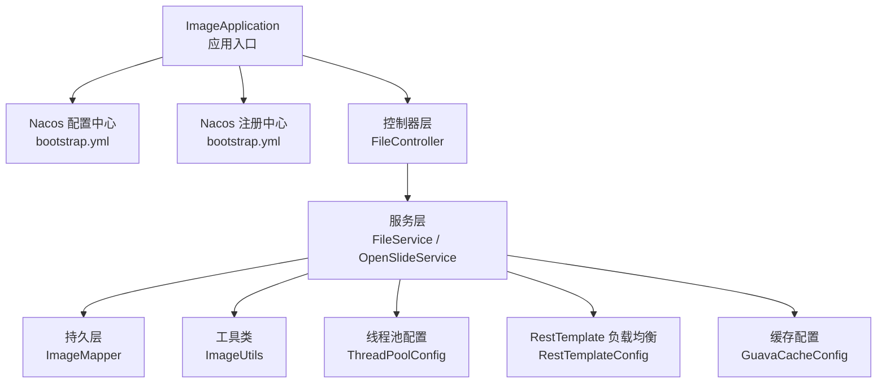
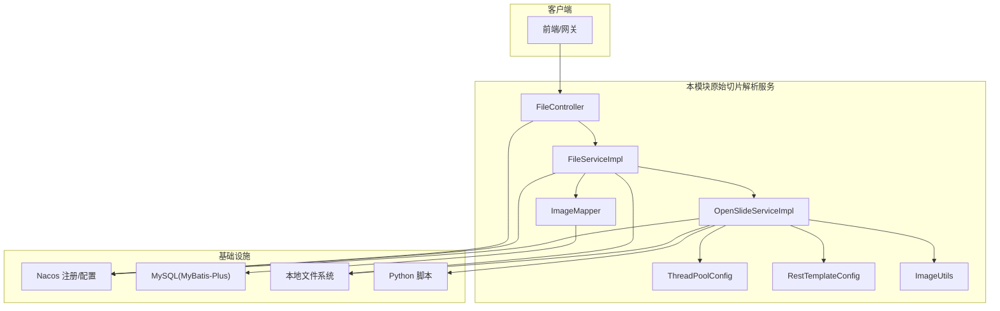
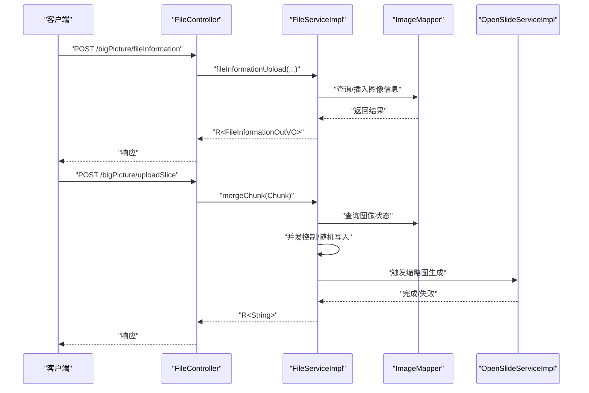
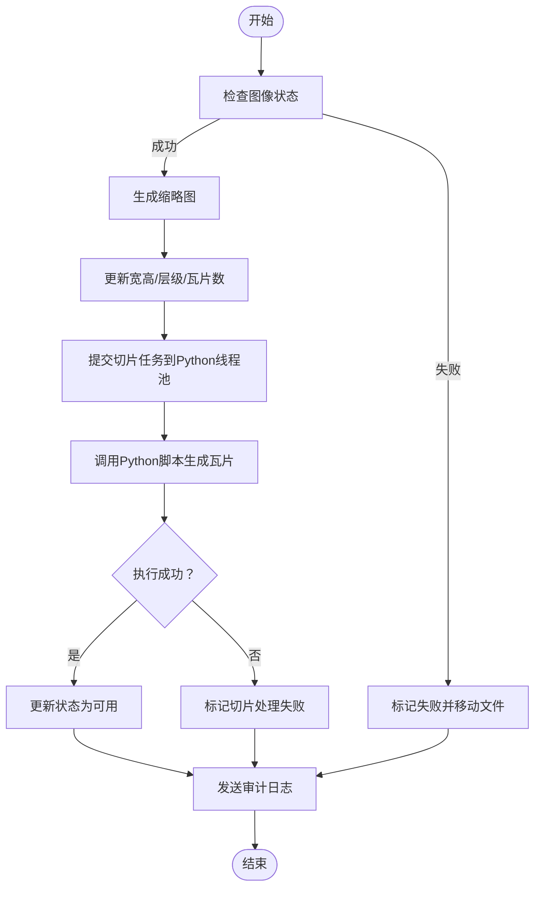
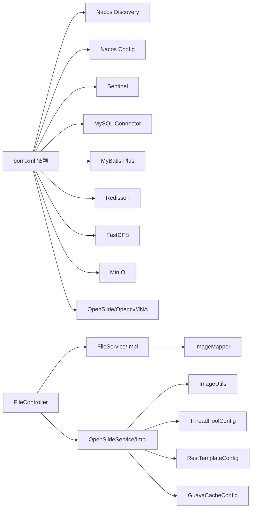

# 微服务架构

<cite>
**本文引用的文件**
- [ImageApplication.java](file://src/main/java/cn/staitech/ImageApplication.java)
- [bootstrap.yml](file://src/main/resources/bootstrap.yml)
- [pom.xml](file://pom.xml)
- [FileController.java](file://src/main/java/cn/staitech/file/controller/FileController.java)
- [FileService.java](file://src/main/java/cn/staitech/file/service/FileService.java)
- [FileServiceImpl.java](file://src/main/java/cn/staitech/file/service/impl/FileServiceImpl.java)
- [OpenSlideService.java](file://src/main/java/cn/staitech/file/service/OpenSlideService.java)
- [OpenSlideServiceImpl.java](file://src/main/java/cn/staitech/file/service/impl/OpenSlideServiceImpl.java)
- [RestTemplateConfig.java](file://src/main/java/cn/staitech/file/config/RestTemplateConfig.java)
- [ThreadPoolConfig.java](file://src/main/java/cn/staitech/file/config/ThreadPoolConfig.java)
- [GuavaCacheConfig.java](file://src/main/java/cn/staitech/file/config/GuavaCacheConfig.java)
- [ImageConstant.java](file://src/main/java/cn/staitech/file/constant/ImageConstant.java)
- [Image.java](file://src/main/java/cn/staitech/file/domain/Image.java)
- [ImageMapper.java](file://src/main/java/cn/staitech/file/mapper/ImageMapper.java)
- [ImageUtils.java](file://src/main/java/cn/staitech/file/util/ImageUtils.java)
- [README.md](file://README.md)
</cite>

## 目录
1. [引言](#引言)
2. [项目结构](#项目结构)
3. [核心组件](#核心组件)
4. [架构总览](#架构总览)
5. [详细组件分析](#详细组件分析)
6. [依赖分析](#依赖分析)
7. [性能考虑](#性能考虑)
8. [故障排查指南](#故障排查指南)
9. [结论](#结论)
10. [附录](#附录)

## 引言
本项目是一个基于Spring Cloud Alibaba生态的微服务模块，聚焦于“原始切片解析服务”。其核心目标是接收前端上传的大文件切片，进行本地合并、缩略图生成、金字塔切片生成与状态流转，并通过Nacos完成服务注册与配置管理，通过Sentinel进行流量治理，通过RestTemplate结合负载均衡实现服务间通信。本文档从架构设计、组件职责、数据流与处理逻辑、依赖关系、性能与可靠性等方面进行全面阐述，帮助架构师与开发者快速理解并实施该微服务。

## 项目结构
该项目采用标准Spring Boot工程结构，核心模块集中在cn.staitech.file包下，包含控制器、服务、持久层、工具类、配置类与常量定义。应用入口通过@EnableDiscoveryClient、@EnableFeignClients等注解开启服务发现与声明式客户端能力，并通过bootstrap.yml接入Nacos配置与注册中心。

图表来源
- [ImageApplication.java:37-52](file://src/main/java/cn/staitech/ImageApplication.java#L37-L52)
- [bootstrap.yml:17-37](file://src/main/resources/bootstrap.yml#L17-L37)
- [FileController.java:38-130](file://src/main/java/cn/staitech/file/controller/FileController.java#L38-L130)
- [FileServiceImpl.java:31-178](file://src/main/java/cn/staitech/file/service/impl/FileServiceImpl.java#L31-L178)
- [OpenSlideServiceImpl.java:47-563](file://src/main/java/cn/staitech/file/service/impl/OpenSlideServiceImpl.java#L47-L563)
- [RestTemplateConfig.java:22-51](file://src/main/java/cn/staitech/file/config/RestTemplateConfig.java#L22-L51)
- [ThreadPoolConfig.java:13-66](file://src/main/java/cn/staitech/file/config/ThreadPoolConfig.java#L13-L66)
- [GuavaCacheConfig.java:16-27](file://src/main/java/cn/staitech/file/config/GuavaCacheConfig.java#L16-L27)

章节来源
- [ImageApplication.java:37-52](file://src/main/java/cn/staitech/ImageApplication.java#L37-L52)
- [bootstrap.yml:17-37](file://src/main/resources/bootstrap.yml#L17-L37)
- [pom.xml:23-205](file://pom.xml#L23-L205)

## 核心组件
- 应用入口与装配
  - 启用服务发现、Feign客户端、定时任务、WebSocket、事务管理、Elasticsearch仓库、指标标签等。
  - 排除Seata自动配置，避免与本模块业务耦合。
- 配置与注册
  - 通过bootstrap.yml配置Nacos服务发现与配置中心地址、命名空间、分组、共享配置等。
- 控制器
  - 提供大文件上传前置信息与切片上传接口，进行基础校验与状态返回。
- 服务层
  - 文件分片合并：并发控制、随机写入、进度统计、最终触发缩略图与切片处理。
  - OpenSlide服务：缩略图生成、金字塔层级统计、切片任务提交、日志审计调用。
- 工具与配置
  - 图像工具：扩展名校验、格式转换、目录检查、组织ID路径生成。
  - 线程池：OpenSlide与Python脚本执行分离线程池，拒绝策略记录日志并回退到调用线程。
  - RestTemplate：启用负载均衡，统一超时配置，JSON消息转换器。
  - Guava缓存：轻量本地缓存，限制容量与过期时间。

章节来源
- [ImageApplication.java:27-52](file://src/main/java/cn/staitech/ImageApplication.java#L27-L52)
- [bootstrap.yml:17-37](file://src/main/resources/bootstrap.yml#L17-L37)
- [FileController.java:38-130](file://src/main/java/cn/staitech/file/controller/FileController.java#L38-L130)
- [FileServiceImpl.java:53-178](file://src/main/java/cn/staitech/file/service/impl/FileServiceImpl.java#L53-L178)
- [OpenSlideServiceImpl.java:149-563](file://src/main/java/cn/staitech/file/service/impl/OpenSlideServiceImpl.java#L149-L563)
- [ImageUtils.java:20-148](file://src/main/java/cn/staitech/file/util/ImageUtils.java#L20-L148)
- [ThreadPoolConfig.java:13-66](file://src/main/java/cn/staitech/file/config/ThreadPoolConfig.java#L13-L66)
- [RestTemplateConfig.java:22-51](file://src/main/java/cn/staitech/file/config/RestTemplateConfig.java#L22-L51)
- [GuavaCacheConfig.java:16-27](file://src/main/java/cn/staitech/file/config/GuavaCacheConfig.java#L16-L27)

## 架构总览
本模块围绕“上传-解析-切片-可用”的状态机运转，结合Nacos实现服务注册与配置下发，通过RestTemplate实现跨服务调用（如日志审计），通过线程池与异步任务提升吞吐，通过缓存与超时控制保障稳定性。

图表来源
- [FileController.java:38-130](file://src/main/java/cn/staitech/file/controller/FileController.java#L38-L130)
- [FileServiceImpl.java:53-178](file://src/main/java/cn/staitech/file/service/impl/FileServiceImpl.java#L53-L178)
- [OpenSlideServiceImpl.java:47-563](file://src/main/java/cn/staitech/file/service/impl/OpenSlideServiceImpl.java#L47-L563)
- [ThreadPoolConfig.java:13-66](file://src/main/java/cn/staitech/file/config/ThreadPoolConfig.java#L13-L66)
- [RestTemplateConfig.java:22-51](file://src/main/java/cn/staitech/file/config/RestTemplateConfig.java#L22-L51)
- [ImageUtils.java:20-148](file://src/main/java/cn/staitech/file/util/ImageUtils.java#L20-L148)
- [ImageMapper.java:13-16](file://src/main/java/cn/staitech/file/mapper/ImageMapper.java#L13-L16)
- [bootstrap.yml:17-37](file://src/main/resources/bootstrap.yml#L17-L37)

## 详细组件分析

### 组件A：上传与分片合并（FileController、FileServiceImpl）
- 设计理念
  - 前置校验：文件大小、扩展名、重复性（可配置开关）。
  - 并发控制：基于内存Map与原子引用数组记录各分片状态，确保顺序写入与最终一致性。
  - 状态机：上传中、上传失败、解析中、解析失败、可用等状态流转。
  - 异步处理：当全部分片到达后，触发缩略图生成与切片处理。
- 关键流程
  - 前置信息接口：校验后写入数据库并返回结果。
  - 切片上传接口：构造Chunk对象，调用合并逻辑。
  - 合并逻辑：创建文件、按分片序号与大小定位写入、更新状态、触发后续流程。
- 错误处理
  - 文件不存在、负数分片数、写入异常均返回失败并清理临时资源。
  - 定时任务清理超时上传（2小时未更新）的切片。

图表来源
- [FileController.java:58-127](file://src/main/java/cn/staitech/file/controller/FileController.java#L58-L127)
- [FileServiceImpl.java:53-146](file://src/main/java/cn/staitech/file/service/impl/FileServiceImpl.java#L53-L146)
- [OpenSlideServiceImpl.java:277-312](file://src/main/java/cn/staitech/file/service/impl/OpenSlideServiceImpl.java#L277-L312)
- [ImageMapper.java:13-16](file://src/main/java/cn/staitech/file/mapper/ImageMapper.java#L13-L16)

章节来源
- [FileController.java:38-130](file://src/main/java/cn/staitech/file/controller/FileController.java#L38-L130)
- [FileServiceImpl.java:53-178](file://src/main/java/cn/staitech/file/service/impl/FileServiceImpl.java#L53-L178)
- [ImageConstant.java:9-67](file://src/main/java/cn/staitech/file/constant/ImageConstant.java#L9-L67)

### 组件B：OpenSlide服务（缩略图与切片处理）
- 设计理念
  - 通过OpenSlide读取多层级金字塔元数据，生成不同尺寸缩略图。
  - 将切片任务提交到独立线程池，调用Python脚本生成瓦片目录结构。
  - 失败处理：移动文件到失败目录，更新状态并记录审计日志。
- 关键流程
  - processThumb：批量处理，先生成缩略图，再提交切片任务。
  - processTiles：单独处理切片任务，适用于解耦后的重试场景。
  - 日志审计：通过RestTemplate向“图像审计”服务发起POST请求。
- 负载均衡与外部调用
  - RestTemplate启用负载均衡，目标地址为固定服务名，便于Nacos路由与限流。

图表来源
- [OpenSlideServiceImpl.java:277-378](file://src/main/java/cn/staitech/file/service/impl/OpenSlideServiceImpl.java#L277-L378)
- [OpenSlideServiceImpl.java:457-477](file://src/main/java/cn/staitech/file/service/impl/OpenSlideServiceImpl.java#L457-L477)
- [OpenSlideServiceImpl.java:487-535](file://src/main/java/cn/staitech/file/service/impl/OpenSlideServiceImpl.java#L487-L535)

章节来源
- [OpenSlideServiceImpl.java:47-563](file://src/main/java/cn/staitech/file/service/impl/OpenSlideServiceImpl.java#L47-L563)
- [RestTemplateConfig.java:22-51](file://src/main/java/cn/staitech/file/config/RestTemplateConfig.java#L22-L51)

### 组件C：线程池与异步执行（ThreadPoolConfig）
- 设计理念
  - OpenSlide线程池：根据CPU核数动态配置，保证I/O密集型任务吞吐。
  - Python线程池：更小规模，避免大量子进程阻塞。
  - 拒绝策略：记录错误并由调用线程回退执行，避免任务丢失。
- 复杂度与性能
  - 队列容量大，适合突发流量；超时与拒绝策略降低雪崩风险。

章节来源
- [ThreadPoolConfig.java:13-66](file://src/main/java/cn/staitech/file/config/ThreadPoolConfig.java#L13-L66)

### 组件D：配置与注册（bootstrap.yml、pom.xml）
- 设计理念
  - Nacos服务发现与配置中心：集中管理环境、命名空间、分组与共享配置。
  - Spring Cloud Alibaba依赖：引入Nacos Discovery、Nacos Config、Sentinel等。
- 配置要点
  - 环境激活、命名空间、分组、共享配置列表。
  - 服务端口、文件上传大小限制、应用名等。

章节来源
- [bootstrap.yml:17-37](file://src/main/resources/bootstrap.yml#L17-L37)
- [pom.xml:23-205](file://pom.xml#L23-L205)

### 组件E：工具与常量（ImageUtils、ImageConstant）
- 设计理念
  - 扩展名校验、格式转换（JPG/PNG转TIFF）、目录检查、组织ID路径生成。
  - 状态常量、文件大小限制、缩略图基路径等统一管理。
- 复杂度与边界
  - 转换流程包含多次OpenSlide探测与重试，确保元数据有效。

章节来源
- [ImageUtils.java:20-148](file://src/main/java/cn/staitech/file/util/ImageUtils.java#L20-L148)
- [ImageConstant.java:9-67](file://src/main/java/cn/staitech/file/constant/ImageConstant.java#L9-L67)

### 组件F：数据模型（Image、ImageMapper）
- 设计理念
  - MyBatis-Plus实体映射，包含图像元数据、缩略图路径、金字塔层级、状态、来源等。
  - Mapper接口继承BaseMapper，简化CRUD。
- 复杂度与约束
  - 状态字段为字符串，需与常量保持一致；组织ID与路径生成规则影响存储布局。

章节来源
- [Image.java:26-216](file://src/main/java/cn/staitech/file/domain/Image.java#L26-L216)
- [ImageMapper.java:13-16](file://src/main/java/cn/staitech/file/mapper/ImageMapper.java#L13-L16)

## 依赖分析
- 外部依赖
  - Spring Cloud Alibaba：Nacos注册与配置、Sentinel流量治理。
  - MySQL驱动、MyBatis-Plus、分页插件、连接池等。
  - Redisson、FastDFS、MinIO、OpenSlide、OpenCV等第三方库。
- 内部依赖
  - 控制器依赖服务层；服务层依赖持久层、工具类、线程池与RestTemplate。
  - 配置类为服务层提供运行时支撑（线程池、缓存、HTTP客户端）。

图表来源
- [pom.xml:23-205](file://pom.xml#L23-L205)
- [FileController.java:38-130](file://src/main/java/cn/staitech/file/controller/FileController.java#L38-L130)
- [FileServiceImpl.java:31-178](file://src/main/java/cn/staitech/file/service/impl/FileServiceImpl.java#L31-L178)
- [OpenSlideServiceImpl.java:47-563](file://src/main/java/cn/staitech/file/service/impl/OpenSlideServiceImpl.java#L47-L563)

章节来源
- [pom.xml:23-205](file://pom.xml#L23-L205)

## 性能考虑
- 并发与I/O
  - 分片写入采用随机访问文件与原子状态数组，减少锁竞争；建议在高并发场景下评估磁盘吞吐与队列长度。
- 线程池
  - OpenSlide线程池与Python线程池分离，避免相互阻塞；可根据CPU核数与磁盘I/O调优。
- 超时与重试
  - RestTemplate统一超时配置；Python脚本执行失败应结合Sentinel限流与熔断策略。
- 缓存
  - Guava本地缓存适合热点元数据，注意容量与过期策略与业务一致性。
- 数据库
  - MyBatis-Plus与连接池配合，建议监控慢查询与连接池峰值。

## 故障排查指南
- 上传失败
  - 检查文件大小与扩展名校验、重复性开关；查看分片写入日志与状态更新。
- 缩略图生成失败
  - 检查OpenSlide元数据读取、转换流程与目录权限；确认最小层级阈值。
- 切片处理失败
  - 查看Python脚本执行日志与退出码；检查失败目录移动逻辑与审计日志。
- 外部调用异常
  - 检查RestTemplate超时配置与目标服务健康状态；结合Sentinel观察限流/熔断。
- 定时任务
  - 核对超时清理逻辑与数据库状态更新。

章节来源
- [FileServiceImpl.java:152-176](file://src/main/java/cn/staitech/file/service/impl/FileServiceImpl.java#L152-L176)
- [OpenSlideServiceImpl.java:457-477](file://src/main/java/cn/staitech/file/service/impl/OpenSlideServiceImpl.java#L457-L477)
- [OpenSlideServiceImpl.java:487-535](file://src/main/java/cn/staitech/file/service/impl/OpenSlideServiceImpl.java#L487-L535)

## 结论
本模块以“上传-解析-切片-可用”为核心闭环，结合Nacos实现服务治理，通过线程池与异步任务提升吞吐，通过RestTemplate与负载均衡实现跨服务通信。建议在生产环境中完善Sentinel限流/熔断策略、增强可观测性（Prometheus/Micrometer）、优化存储与Python脚本执行策略，并持续演进服务拆分与网关路由策略以适配更大规模的业务场景。

## 附录
- 项目简介与CI/CD
  - 项目模板与Auto DevOps兼容说明。

章节来源
- [README.md:1-11](file://README.md#L1-L11)