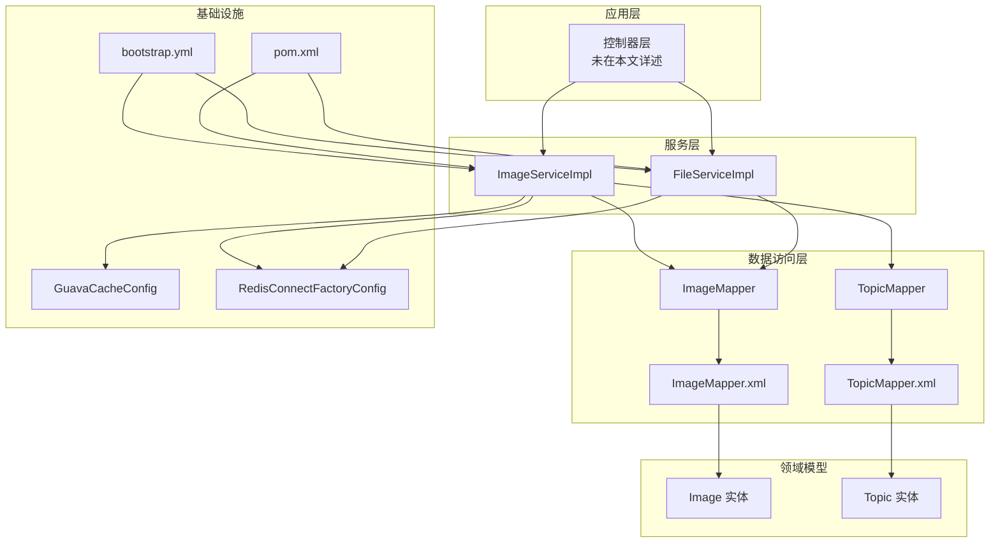
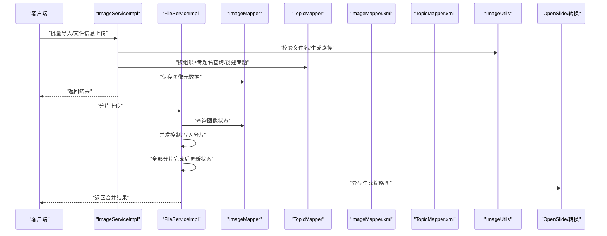
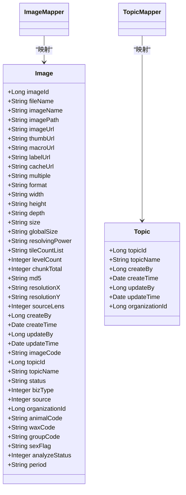
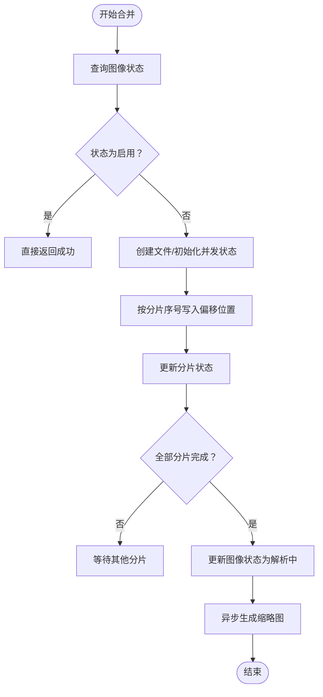
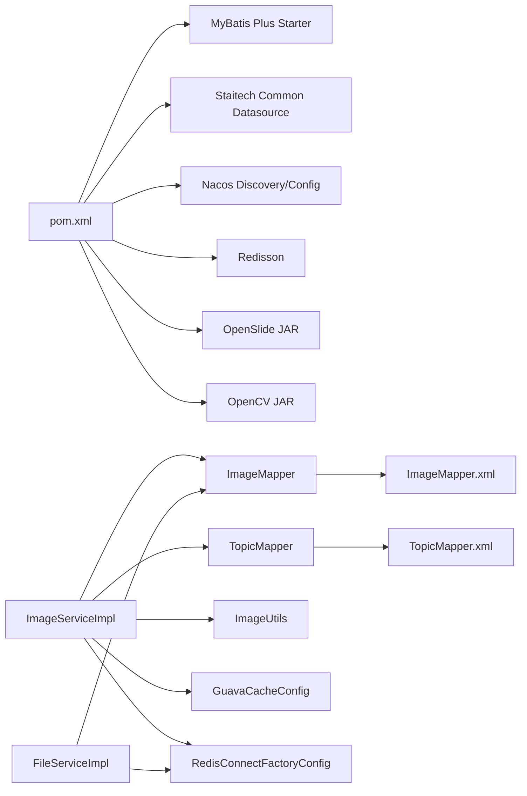
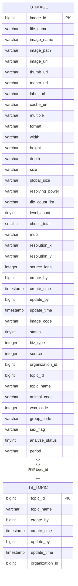

# 数据架构

<cite>
**本文引用的文件**
- [Image.java](file://src/main/java/cn/staitech/file/domain/Image.java)
- [Topic.java](file://src/main/java/cn/staitech/file/domain/Topic.java)
- [ImageMapper.java](file://src/main/java/cn/staitech/file/mapper/ImageMapper.java)
- [TopicMapper.java](file://src/main/java/cn/staitech/file/mapper/TopicMapper.java)
- [ImageMapper.xml](file://src/main/resources/mapper/ImageMapper.xml)
- [TopicMapper.xml](file://src/main/resources/mapper/TopicMapper.xml)
- [ImageServiceImpl.java](file://src/main/java/cn/staitech/file/service/impl/ImageServiceImpl.java)
- [FileServiceImpl.java](file://src/main/java/cn/staitech/file/service/impl/FileServiceImpl.java)
- [ImageConstant.java](file://src/main/java/cn/staitech/file/constant/ImageConstant.java)
- [ImageUtils.java](file://src/main/java/cn/staitech/file/util/ImageUtils.java)
- [GuavaCacheConfig.java](file://src/main/java/cn/staitech/file/config/GuavaCacheConfig.java)
- [RedisConnectFactoryConfig.java](file://src/main/java/cn/staitech/file/config/RedisConnectFactoryConfig.java)
- [bootstrap.yml](file://src/main/resources/bootstrap.yml)
- [pom.xml](file://pom.xml)
</cite>

## 目录
1. [简介](#简介)
2. [项目结构](#项目结构)
3. [核心组件](#核心组件)
4. [架构总览](#架构总览)
5. [详细组件分析](#详细组件分析)
6. [依赖分析](#依赖分析)
7. [性能考虑](#性能考虑)
8. [故障排查指南](#故障排查指南)
9. [结论](#结论)
10. [附录](#附录)

## 简介
本文件面向数据工程师，系统化阐述本项目的数据库设计原理、表结构关系与数据模型定义，重点解释 Image 与 Topic 实体的设计思路（字段含义、约束条件、索引策略），并文档化 MyBatis Plus 的使用方式、Mapper 接口设计与 XML 映射配置。同时覆盖数据访问层的分层架构、事务管理与连接池配置，以及数据一致性保障、缓存策略与性能优化方案，帮助读者快速理解并高效落地实现。

## 项目结构
项目采用标准的 Spring Boot + MyBatis Plus 分层架构：
- domain 层：定义实体类（Image、Topic）
- mapper 层：定义 DAO 接口（ImageMapper、TopicMapper）
- xml 映射：MyBatis XML 映射文件（ImageMapper.xml、TopicMapper.xml）
- service 层：业务服务（ImageServiceImpl、FileServiceImpl）
- config 层：缓存与 Redis 连接工厂配置
- constant：常量定义（状态码、路径、格式等）
- util：工具类（文件路径、OpenSlide 转换等）
- resources：配置与 SQL 资源
- pom.xml：依赖与构建配置

图表来源
- [ImageServiceImpl.java:1-548](file://src/main/java/cn/staitech/file/service/impl/ImageServiceImpl.java#L1-L548)
- [FileServiceImpl.java:1-178](file://src/main/java/cn/staitech/file/service/impl/FileServiceImpl.java#L1-L178)
- [ImageMapper.java:1-16](file://src/main/java/cn/staitech/file/mapper/ImageMapper.java#L1-L16)
- [TopicMapper.java:1-10](file://src/main/java/cn/staitech/file/mapper/TopicMapper.java#L1-L10)
- [ImageMapper.xml:1-65](file://src/main/resources/mapper/ImageMapper.xml#L1-L65)
- [TopicMapper.xml:1-7](file://src/main/resources/mapper/TopicMapper.xml#L1-L7)
- [Image.java:1-216](file://src/main/java/cn/staitech/file/domain/Image.java#L1-L216)
- [Topic.java:1-61](file://src/main/java/cn/staitech/file/domain/Topic.java#L1-L61)
- [GuavaCacheConfig.java:1-27](file://src/main/java/cn/staitech/file/config/GuavaCacheConfig.java#L1-L27)
- [RedisConnectFactoryConfig.java:1-26](file://src/main/java/cn/staitech/file/config/RedisConnectFactoryConfig.java#L1-L26)
- [bootstrap.yml:1-37](file://src/main/resources/bootstrap.yml#L1-L37)
- [pom.xml:1-385](file://pom.xml#L1-L385)

章节来源
- [bootstrap.yml:1-37](file://src/main/resources/bootstrap.yml#L1-L37)
- [pom.xml:1-385](file://pom.xml#L1-L385)

## 核心组件
- 实体模型
  - Image：图像主表，记录切片元数据、解析状态、来源、组织与专题关联等
  - Topic：专题表，记录专题名称与组织关联
- 数据访问层
  - ImageMapper/TopicMapper：基于 MyBatis Plus 的 BaseMapper 接口
  - ImageMapper.xml/TopicMapper.xml：XML 结果映射与列清单
- 服务层
  - ImageServiceImpl：批量导入、文件信息上传、文件名解析、路径生成、状态流转
  - FileServiceImpl：分片合并、并发控制、超时清理、缩略图异步生成触发
- 配置与工具
  - GuavaCacheConfig：本地缓存配置
  - RedisConnectFactoryConfig：Redis 连接工厂校验
  - ImageConstant：状态码、来源、路径、格式等常量
  - ImageUtils：文件名校验、路径生成、OpenSlide 转换

章节来源
- [Image.java:1-216](file://src/main/java/cn/staitech/file/domain/Image.java#L1-L216)
- [Topic.java:1-61](file://src/main/java/cn/staitech/file/domain/Topic.java#L1-L61)
- [ImageMapper.java:1-16](file://src/main/java/cn/staitech/file/mapper/ImageMapper.java#L1-L16)
- [TopicMapper.java:1-10](file://src/main/java/cn/staitech/file/mapper/TopicMapper.java#L1-L10)
- [ImageMapper.xml:1-65](file://src/main/resources/mapper/ImageMapper.xml#L1-L65)
- [TopicMapper.xml:1-7](file://src/main/resources/mapper/TopicMapper.xml#L1-L7)
- [ImageServiceImpl.java:1-548](file://src/main/java/cn/staitech/file/service/impl/ImageServiceImpl.java#L1-L548)
- [FileServiceImpl.java:1-178](file://src/main/java/cn/staitech/file/service/impl/FileServiceImpl.java#L1-L178)
- [GuavaCacheConfig.java:1-27](file://src/main/java/cn/staitech/file/config/GuavaCacheConfig.java#L1-L27)
- [RedisConnectFactoryConfig.java:1-26](file://src/main/java/cn/staitech/file/config/RedisConnectFactoryConfig.java#L1-L26)
- [ImageConstant.java:1-67](file://src/main/java/cn/staitech/file/constant/ImageConstant.java#L1-L67)
- [ImageUtils.java:1-148](file://src/main/java/cn/staitech/file/util/ImageUtils.java#L1-L148)

## 架构总览
系统围绕“图像切片”与“专题”两大核心实体展开，采用 MyBatis Plus 简化 CRUD，结合服务层的状态机与并发控制，实现从文件上传、分片合并、元数据解析到缩略图生成的完整流程。事务边界集中在服务层，确保数据一致性；缓存与 Redis 用于提升热点数据访问效率。

图表来源
- [ImageServiceImpl.java:63-140](file://src/main/java/cn/staitech/file/service/impl/ImageServiceImpl.java#L63-L140)
- [FileServiceImpl.java:53-146](file://src/main/java/cn/staitech/file/service/impl/FileServiceImpl.java#L53-L146)
- [ImageMapper.java:13-16](file://src/main/java/cn/staitech/file/mapper/ImageMapper.java#L13-L16)
- [TopicMapper.java:6-8](file://src/main/java/cn/staitech/file/mapper/TopicMapper.java#L6-L8)
- [ImageMapper.xml:4-65](file://src/main/resources/mapper/ImageMapper.xml#L4-L65)
- [TopicMapper.xml:5-7](file://src/main/resources/mapper/TopicMapper.xml#L5-L7)
- [ImageUtils.java:123-145](file://src/main/java/cn/staitech/file/util/ImageUtils.java#L123-L145)

## 详细组件分析

### 实体设计与数据模型

#### Image 实体
- 设计要点
  - 主键自增：imageId
  - 关联字段：topicId、topicName（通过 XML 映射）
  - 状态字段：status（多阶段状态机）
  - 来源字段：source（上传/服务器读取）
  - 组织字段：organizationId
  - 文件元信息：fileName、imageName、imagePath、imageUrl、format、size、width、height、depth、globalSize、resolvingPower、resolutionX、resolutionY、sourceLens
  - 切片金字塔：levelCount、tileCountList、chunkTotal、cacheUrl、multiple
  - 标注与缩略图：thumbUrl、macroUrl、labelUrl、cacheUrl
  - 文件名解析：animalCode、waxCode、groupCode、sexFlag、period、analyzeStatus
  - 审计字段：createBy、createTime、updateBy、updateTime
- 字段含义与约束
  - 状态字段：通过常量统一管理，涵盖上传中、上传失败、解析中、解析失败、可用、信息解析中、信息解析失败、处理中、处理失败等
  - 来源字段：区分手动上传与服务器读取
  - 组织字段：用于多租户隔离
  - 文件名解析：支持两种解析策略，失败时回退并标记 analyzeStatus
- 索引策略建议
  - 唯一索引：组织+文件名（fileName）或（organizationId, imageName）组合，避免重复入库
  - 范围/过滤索引：organizationId、topicId、status、source、create_time、update_time
  - 文本搜索：fileName、imageCode、md5（如需检索）
  - 多列联合索引：(organizationId, status, source) 用于快速筛选组织内状态数据
- 复杂度与性能
  - 字段较多，适合宽表存储，便于前端一次性拉取；可通过分页与条件查询控制单次查询规模
  - 大字段（如 tileCountList、globalSize）建议在高频查询场景下谨慎使用

章节来源
- [Image.java:26-216](file://src/main/java/cn/staitech/file/domain/Image.java#L26-L216)
- [ImageConstant.java:20-31](file://src/main/java/cn/staitech/file/constant/ImageConstant.java#L20-L31)

#### Topic 实体
- 设计要点
  - 主键自增：topicId
  - 唯一约束：topicName（在同一组织下唯一）
  - 关联字段：organizationId
  - 审计字段：createBy、createTime、updateBy、updateTime
- 索引策略建议
  - 唯一索引：(organizationId, topicName)
  - 普通索引：organizationId（用于按组织查询）

章节来源
- [Topic.java:23-61](file://src/main/java/cn/staitech/file/domain/Topic.java#L23-L61)

### MyBatis Plus 使用与映射配置

#### Mapper 接口设计
- ImageMapper/TopicMapper 均继承 MyBatis Plus 的 BaseMapper，天然具备常用 CRUD 方法
- 通过 @Repository 注解纳入 Spring 容器管理

章节来源
- [ImageMapper.java:13-16](file://src/main/java/cn/staitech/file/mapper/ImageMapper.java#L13-L16)
- [TopicMapper.java:6-8](file://src/main/java/cn/staitech/file/mapper/TopicMapper.java#L6-L8)

#### XML 映射配置
- ImageMapper.xml
  - 定义 BaseResultMap，将数据库列与 Java 字段一一映射，覆盖 Image 实体的所有字段
  - 定义 Base_Column_List，便于通用查询列清单
- TopicMapper.xml
  - 当前为空，表示 Topic 使用默认映射（由 BaseMapper 提供）

章节来源
- [ImageMapper.xml:4-65](file://src/main/resources/mapper/ImageMapper.xml#L4-L65)
- [TopicMapper.xml:5-7](file://src/main/resources/mapper/TopicMapper.xml#L5-L7)

#### 类图（实体与映射）

图表来源
- [Image.java:26-216](file://src/main/java/cn/staitech/file/domain/Image.java#L26-L216)
- [Topic.java:23-61](file://src/main/java/cn/staitech/file/domain/Topic.java#L23-L61)
- [ImageMapper.java:13-16](file://src/main/java/cn/staitech/file/mapper/ImageMapper.java#L13-L16)
- [TopicMapper.java:6-8](file://src/main/java/cn/staitech/file/mapper/TopicMapper.java#L6-L8)
- [ImageMapper.xml:4-65](file://src/main/resources/mapper/ImageMapper.xml#L4-L65)
- [TopicMapper.xml:5-7](file://src/main/resources/mapper/TopicMapper.xml#L5-L7)

### 数据访问层分层架构与事务管理

#### 分层架构
- 控制器层：接收请求，调用服务层
- 服务层：业务编排、状态机、并发控制、异步任务
- 数据访问层：Mapper + XML 映射，MyBatis Plus 简化 CRUD
- 领域模型：Image/Topic 实体，注解驱动表映射

#### 事务管理
- ImageServiceImpl：批量导入与文件信息上传均声明 @Transactional，确保原子性
- FileServiceImpl：分片合并过程在内存中维护并发状态，最终统一更新状态并触发异步处理
- 事务边界：服务层方法为事务边界，避免跨服务传播导致的复杂性

章节来源
- [ImageServiceImpl.java:41-42](file://src/main/java/cn/staitech/file/service/impl/ImageServiceImpl.java#L41-L42)
- [ImageServiceImpl.java:63-140](file://src/main/java/cn/staitech/file/service/impl/ImageServiceImpl.java#L63-L140)
- [FileServiceImpl.java:53-146](file://src/main/java/cn/staitech/file/service/impl/FileServiceImpl.java#L53-L146)

### 连接池与基础设施配置
- 连接池与数据源：项目依赖“staitech-common-datasource”，具体连接池参数由通用模块提供
- Redis：通过 RedisConnectFactoryConfig 校验并启用连接验证
- 缓存：GuavaCacheConfig 提供本地缓存，最大容量与过期策略可配置
- Nacos：配置中心与服务发现，环境通过 bootstrap.yml 激活

章节来源
- [pom.xml:66-76](file://pom.xml#L66-L76)
- [RedisConnectFactoryConfig.java:18-24](file://src/main/java/cn/staitech/file/config/RedisConnectFactoryConfig.java#L18-L24)
- [GuavaCacheConfig.java:19-25](file://src/main/java/cn/staitech/file/config/GuavaCacheConfig.java#L19-L25)
- [bootstrap.yml:17-37](file://src/main/resources/bootstrap.yml#L17-L37)

### 数据一致性与并发控制

#### 并发控制
- FileServiceImpl 使用 FILE_MAP_SYN 维护每张图像的分片状态数组，防止重复写入与竞态
- 合并完成后统一更新状态并触发异步处理，避免中间态暴露

图表来源
- [FileServiceImpl.java:53-146](file://src/main/java/cn/staitech/file/service/impl/FileServiceImpl.java#L53-L146)

#### 一致性保障
- 事务：批量导入与文件信息上传在服务层开启事务
- 状态机：通过状态字段与常量统一管理流程，避免脏读与脏写
- 唯一性：组织+文件名（或组织+专题名）唯一约束，防止重复入库

章节来源
- [ImageConstant.java:20-31](file://src/main/java/cn/staitech/file/constant/ImageConstant.java#L20-L31)
- [ImageServiceImpl.java:99-122](file://src/main/java/cn/staitech/file/service/impl/ImageServiceImpl.java#L99-L122)

### 缓存策略与性能优化

#### 缓存策略
- 本地缓存：GuavaCacheConfig 提供本地缓存，适用于轻量热点数据
- Redis：通过 RedisConnectFactoryConfig 校验连接，可用于分布式缓存或锁
- 工具类：ImageUtils 提供路径与文件名校验，减少 IO 与解析开销

#### 性能优化建议
- 查询优化：为高频查询字段建立合适索引（见“索引策略建议”）
- 分页与投影：大表查询使用分页与必要字段投影，避免 SELECT *
- 批量操作：批量导入使用批量插入/更新，降低往返次数
- 异步处理：缩略图生成与 MD5 计算异步化，避免阻塞主线程
- 文件系统：合理组织文件目录结构，避免单目录过大

章节来源
- [GuavaCacheConfig.java:19-25](file://src/main/java/cn/staitech/file/config/GuavaCacheConfig.java#L19-L25)
- [RedisConnectFactoryConfig.java:18-24](file://src/main/java/cn/staitech/file/config/RedisConnectFactoryConfig.java#L18-L24)
- [ImageUtils.java:37-43](file://src/main/java/cn/staitech/file/util/ImageUtils.java#L37-L43)

## 依赖分析

图表来源
- [pom.xml:132-143](file://pom.xml#L132-L143)
- [pom.xml:66-76](file://pom.xml#L66-L76)
- [pom.xml:164-180](file://pom.xml#L164-L180)
- [ImageServiceImpl.java:47-49](file://src/main/java/cn/staitech/file/service/impl/ImageServiceImpl.java#L47-L49)
- [FileServiceImpl.java:35-38](file://src/main/java/cn/staitech/file/service/impl/FileServiceImpl.java#L35-L38)
- [ImageMapper.xml:4-65](file://src/main/resources/mapper/ImageMapper.xml#L4-L65)
- [TopicMapper.xml:5-7](file://src/main/resources/mapper/TopicMapper.xml#L5-L7)
- [ImageUtils.java:123-145](file://src/main/java/cn/staitech/file/util/ImageUtils.java#L123-L145)
- [GuavaCacheConfig.java:19-25](file://src/main/java/cn/staitech/file/config/GuavaCacheConfig.java#L19-L25)
- [RedisConnectFactoryConfig.java:18-24](file://src/main/java/cn/staitech/file/config/RedisConnectFactoryConfig.java#L18-L24)

章节来源
- [pom.xml:132-143](file://pom.xml#L132-L143)
- [pom.xml:66-76](file://pom.xml#L66-L76)
- [ImageServiceImpl.java:47-49](file://src/main/java/cn/staitech/file/service/impl/ImageServiceImpl.java#L47-L49)
- [FileServiceImpl.java:35-38](file://src/main/java/cn/staitech/file/service/impl/FileServiceImpl.java#L35-L38)

## 性能考虑
- 索引设计：针对高频过滤字段建立索引，避免全表扫描
- 查询优化：使用分页与投影，避免一次性加载过多字段
- 批量操作：批量插入/更新，减少网络往返
- 异步化：缩略图生成与 MD5 计算异步执行，提升吞吐
- 文件系统：合理组织目录层级，避免单目录过大影响 IO
- 缓存：本地缓存与 Redis 结合，热点数据就近缓存

## 故障排查指南
- 上传超时
  - 现象：状态长时间停留在“上传中”
  - 处理：定时任务会清理超过时限的上传记录，删除临时文件并置为失败
- 分片合并失败
  - 现象：分片写入异常或并发状态不一致
  - 处理：检查 FILE_MAP_SYN 是否被清理，确认分片序号与大小是否匹配
- 文件名解析失败
  - 现象：analyzeStatus 标记失败
  - 处理：检查文件名格式是否符合预期，回退解析策略
- OpenSlide 解析失败
  - 现象：OpenSlide 抛错或 levelCount 不合法
  - 处理：触发转换流程，生成可识别的 pyramidal TIFF

章节来源
- [FileServiceImpl.java:152-176](file://src/main/java/cn/staitech/file/service/impl/FileServiceImpl.java#L152-L176)
- [ImageServiceImpl.java:421-484](file://src/main/java/cn/staitech/file/service/impl/ImageServiceImpl.java#L421-L484)
- [ImageUtils.java:64-96](file://src/main/java/cn/staitech/file/util/ImageUtils.java#L64-L96)

## 结论
本项目以 MyBatis Plus 为核心，围绕 Image 与 Topic 两大实体构建了完整的图像切片数据模型。通过清晰的状态机、严格的事务边界与并发控制，实现了从上传、解析到缩略图生成的稳定流程。配合本地缓存与 Redis，兼顾了性能与一致性。建议在生产环境中完善索引策略、监控慢查询，并持续优化异步处理链路。

## 附录

### 数据模型 ER 图

图表来源
- [ImageMapper.xml:4-65](file://src/main/resources/mapper/ImageMapper.xml#L4-L65)
- [TopicMapper.xml:5-7](file://src/main/resources/mapper/TopicMapper.xml#L5-L7)