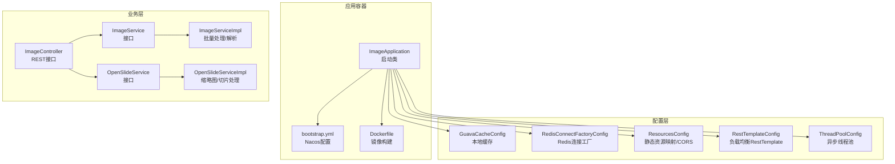
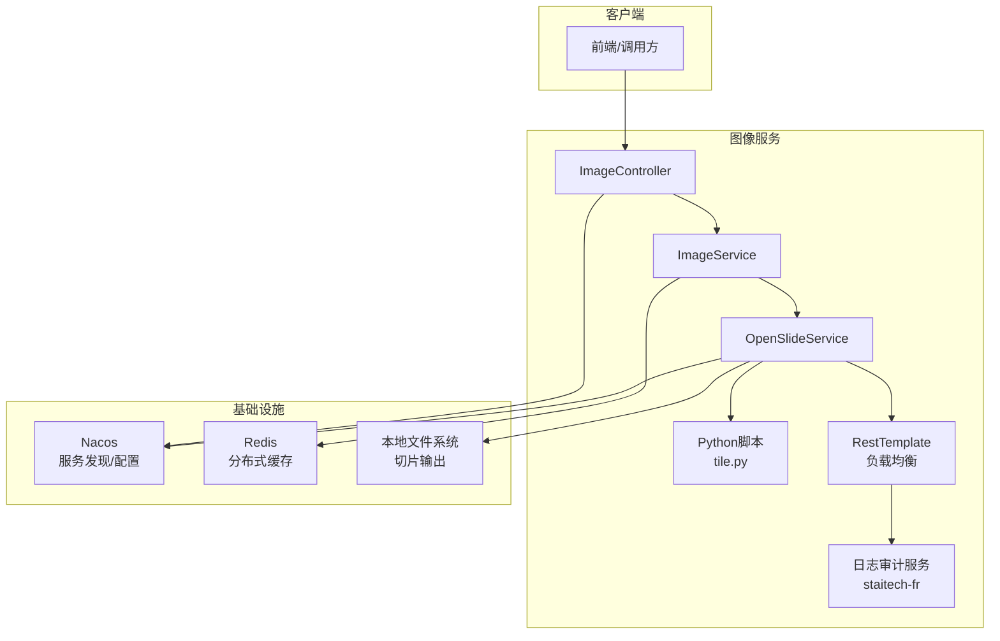
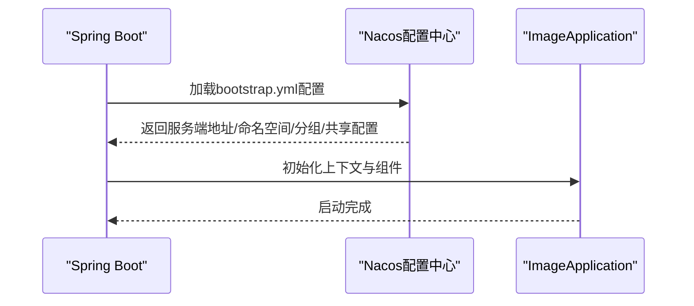
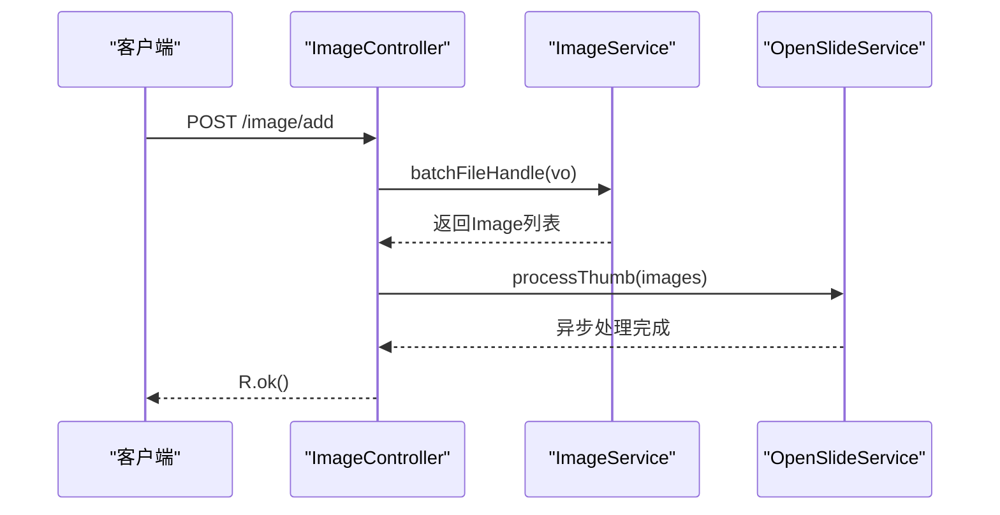
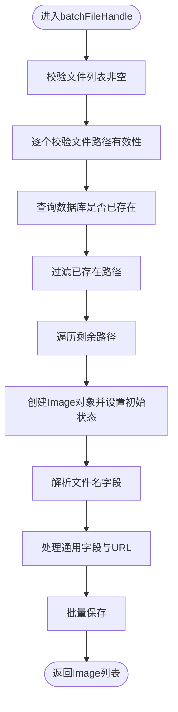
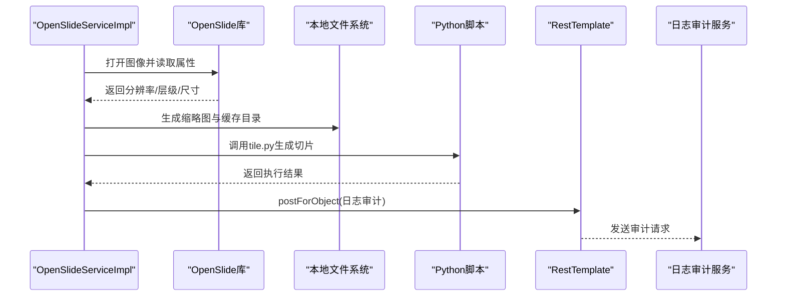
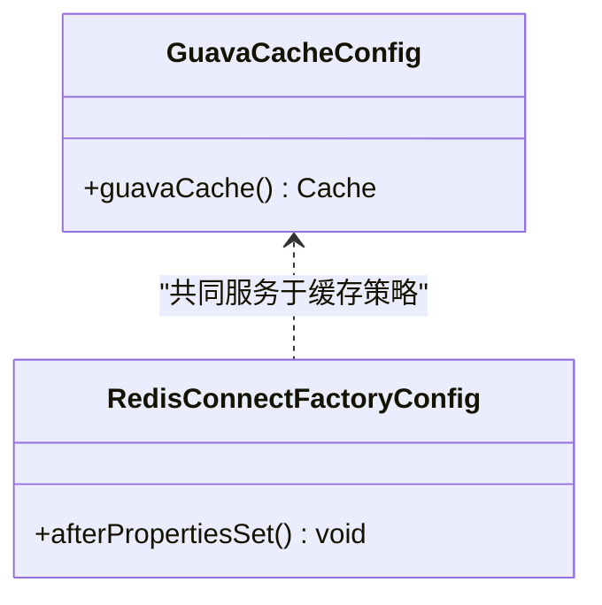
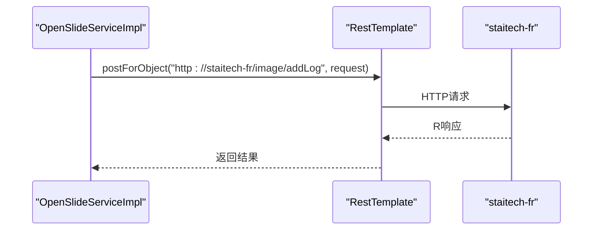
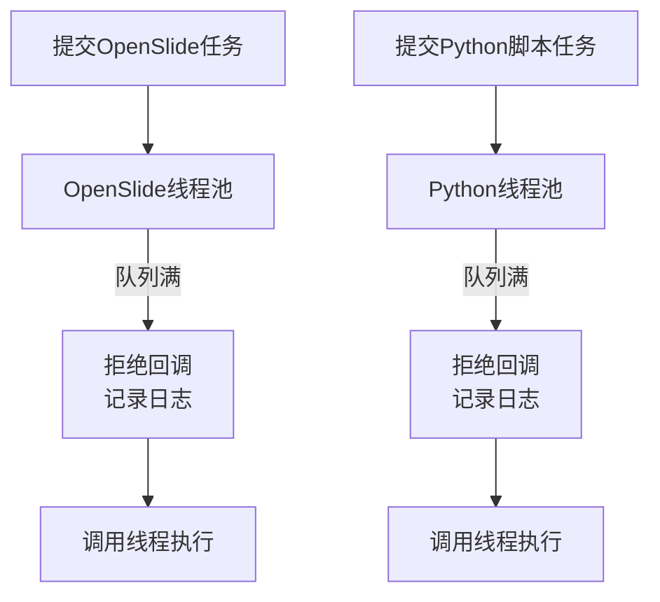
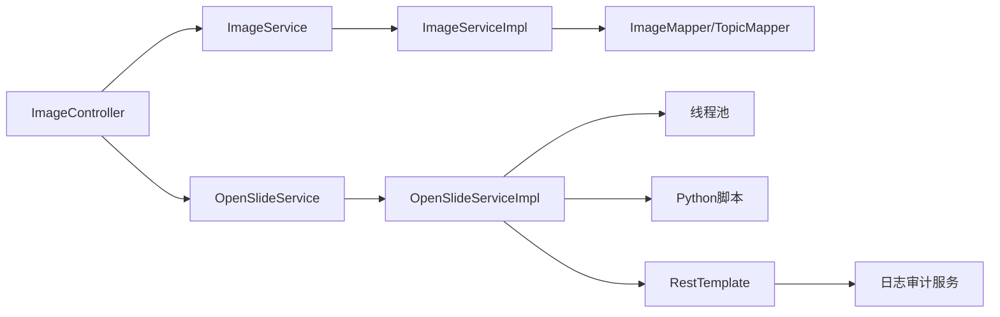

# 系统架构设计

<cite>
**本文档引用的文件**
- [ImageApplication.java](file://src/main/java/cn/staitech/ImageApplication.java)
- [bootstrap.yml](file://src/main/resources/bootstrap.yml)
- [pom.xml](file://pom.xml)
- [Dockerfile](file://Dockerfile)
- [GuavaCacheConfig.java](file://src/main/java/cn/staitech/file/config/GuavaCacheConfig.java)
- [RedisConnectFactoryConfig.java](file://src/main/java/cn/staitech/file/config/RedisConnectFactoryConfig.java)
- [ResourcesConfig.java](file://src/main/java/cn/staitech/file/config/ResourcesConfig.java)
- [RestTemplateConfig.java](file://src/main/java/cn/staitech/file/config/RestTemplateConfig.java)
- [ThreadPoolConfig.java](file://src/main/java/cn/staitech/file/config/ThreadPoolConfig.java)
- [ImageController.java](file://src/main/java/cn/staitech/file/controller/ImageController.java)
- [ImageService.java](file://src/main/java/cn/staitech/file/service/ImageService.java)
- [ImageServiceImpl.java](file://src/main/java/cn/staitech/file/service/impl/ImageServiceImpl.java)
- [OpenSlideService.java](file://src/main/java/cn/staitech/file/service/OpenSlideService.java)
- [OpenSlideServiceImpl.java](file://src/main/java/cn/staitech/file/service/impl/OpenSlideServiceImpl.java)
</cite>

## 目录
1. [引言](#引言)
2. [项目结构](#项目结构)
3. [核心组件](#核心组件)
4. [架构总览](#架构总览)
5. [详细组件分析](#详细组件分析)
6. [依赖关系分析](#依赖关系分析)
7. [性能考虑](#性能考虑)
8. [故障排查指南](#故障排查指南)
9. [结论](#结论)
10. [附录](#附录)

## 引言
本架构设计文档面向PACMVS系统的图像切片解析服务模块，聚焦于基于Spring Cloud Alibaba的微服务架构设计与落地实践。文档阐述服务发现与配置管理（Nacos）、流量治理（Sentinel）、缓存策略、分布式配置、负载均衡与线程池调度等关键技术点，结合系统边界、基础设施与部署拓扑，为架构师与高级开发者提供深入的技术洞察与设计决策依据。

## 项目结构
该模块采用标准Spring Boot工程结构，核心层次划分如下：
- 启动类与配置：应用入口、Nacos配置与服务发现、Actuator监控标签
- 控制器层：对外提供REST接口，承接业务编排
- 服务层：核心业务逻辑与异步任务编排
- 配置层：缓存、Redis连接工厂、资源映射、RestTemplate与线程池配置
- 工具与常量：图像处理工具、常量定义
- 数据访问层：MyBatis Plus Mapper与XML映射文件
- 资源与脚本：Python切片脚本、OpenSlide/Opencv本地库

图表来源
- [ImageApplication.java:37-50](file://src/main/java/cn/staitech/ImageApplication.java#L37-L50)
- [bootstrap.yml:17-37](file://src/main/resources/bootstrap.yml#L17-L37)
- [Dockerfile:1-16](file://Dockerfile#L1-L16)
- [GuavaCacheConfig.java:19-25](file://src/main/java/cn/staitech/file/config/GuavaCacheConfig.java#L19-L25)
- [RedisConnectFactoryConfig.java:11-24](file://src/main/java/cn/staitech/file/config/RedisConnectFactoryConfig.java#L11-L24)
- [ResourcesConfig.java:17-50](file://src/main/java/cn/staitech/file/config/ResourcesConfig.java#L17-L50)
- [RestTemplateConfig.java:24-48](file://src/main/java/cn/staitech/file/config/RestTemplateConfig.java#L24-L48)
- [ThreadPoolConfig.java:18-64](file://src/main/java/cn/staitech/file/config/ThreadPoolConfig.java#L18-L64)
- [ImageController.java:30-71](file://src/main/java/cn/staitech/file/controller/ImageController.java#L30-L71)
- [ImageService.java:17-23](file://src/main/java/cn/staitech/file/service/ImageService.java#L17-L23)
- [ImageServiceImpl.java:42-140](file://src/main/java/cn/staitech/file/service/impl/ImageServiceImpl.java#L42-L140)
- [OpenSlideService.java:14-39](file://src/main/java/cn/staitech/file/service/OpenSlideService.java#L14-L39)
- [OpenSlideServiceImpl.java:47-339](file://src/main/java/cn/staitech/file/service/impl/OpenSlideServiceImpl.java#L47-L339)

章节来源
- [ImageApplication.java:37-50](file://src/main/java/cn/staitech/ImageApplication.java#L37-L50)
- [bootstrap.yml:17-37](file://src/main/resources/bootstrap.yml#L17-L37)
- [pom.xml:29-45](file://pom.xml#L29-L45)
- [Dockerfile:1-16](file://Dockerfile#L1-L16)

## 核心组件
- 应用启动与服务发现
  - 启用服务发现、Feign客户端、定时任务、WebSocket、事务管理、Elasticsearch仓库扫描与Actuator指标标签
  - 通过注解启用Nacos服务注册与配置中心
- 配置中心与服务发现
  - Nacos服务注册地址、命名空间、分组、配置中心地址、共享配置加载
- 负载均衡与HTTP客户端
  - RestTemplate启用@LoadBalanced，结合服务名进行服务间调用
- 缓存策略
  - 本地Guava缓存与Redisson分布式缓存并存，分别用于热点数据与跨实例共享
- 线程池与异步处理
  - OpenSlide与Python脚本执行独立线程池，支持拒绝策略与调用线程回退
- 静态资源与CORS
  - 本地文件映射与跨域策略，便于前端直连静态资源

章节来源
- [ImageApplication.java:27-36](file://src/main/java/cn/staitech/ImageApplication.java#L27-L36)
- [bootstrap.yml:17-37](file://src/main/resources/bootstrap.yml#L17-L37)
- [RestTemplateConfig.java:24-48](file://src/main/java/cn/staitech/file/config/RestTemplateConfig.java#L24-L48)
- [GuavaCacheConfig.java:19-25](file://src/main/java/cn/staitech/file/config/GuavaCacheConfig.java#L19-L25)
- [RedisConnectFactoryConfig.java:11-24](file://src/main/java/cn/staitech/file/config/RedisConnectFactoryConfig.java#L11-L24)
- [ThreadPoolConfig.java:18-64](file://src/main/java/cn/staitech/file/config/ThreadPoolConfig.java#L18-L64)
- [ResourcesConfig.java:17-50](file://src/main/java/cn/staitech/file/config/ResourcesConfig.java#L17-L50)

## 架构总览
系统采用“单体微服务”形态，内部通过多线程与外部脚本协同完成图像解析与切片生成。核心流程包括：文件入库与元数据解析、缩略图生成、切片任务提交与状态流转、失败重试与日志审计。

图表来源
- [ImageController.java:30-71](file://src/main/java/cn/staitech/file/controller/ImageController.java#L30-L71)
- [ImageServiceImpl.java:64-140](file://src/main/java/cn/staitech/file/service/impl/ImageServiceImpl.java#L64-L140)
- [OpenSlideServiceImpl.java:278-339](file://src/main/java/cn/staitech/file/service/impl/OpenSlideServiceImpl.java#L278-L339)
- [RestTemplateConfig.java:24-48](file://src/main/java/cn/staitech/file/config/RestTemplateConfig.java#L24-L48)
- [bootstrap.yml:17-37](file://src/main/resources/bootstrap.yml#L17-L37)

## 详细组件分析

### 应用启动与运行时配置
- 启动类启用服务发现、Feign、定时任务、WebSocket、事务与Actuator指标标签
- 通过bootstrap.yml接入Nacos配置中心，按环境加载命名空间、分组与共享配置
- Dockerfile采用多阶段构建，最终以JRE 8运行jar包

图表来源
- [ImageApplication.java:37-50](file://src/main/java/cn/staitech/ImageApplication.java#L37-L50)
- [bootstrap.yml:17-37](file://src/main/resources/bootstrap.yml#L17-L37)
- [Dockerfile:1-16](file://Dockerfile#L1-L16)

章节来源
- [ImageApplication.java:37-50](file://src/main/java/cn/staitech/ImageApplication.java#L37-L50)
- [bootstrap.yml:17-37](file://src/main/resources/bootstrap.yml#L17-L37)
- [Dockerfile:1-16](file://Dockerfile#L1-L16)

### 控制器与业务编排
- 控制器提供“服务器选片”、“重新解析”、“检查失败切片”、“查询原始切片”等接口
- 编排逻辑：先入库解析，再触发OpenSlide缩略图生成，最后提交切片任务

图表来源
- [ImageController.java:42-48](file://src/main/java/cn/staitech/file/controller/ImageController.java#L42-L48)
- [ImageServiceImpl.java:64-140](file://src/main/java/cn/staitech/file/service/impl/ImageServiceImpl.java#L64-L140)
- [OpenSlideServiceImpl.java:278-312](file://src/main/java/cn/staitech/file/service/impl/OpenSlideServiceImpl.java#L278-L312)

章节来源
- [ImageController.java:30-71](file://src/main/java/cn/staitech/file/controller/ImageController.java#L30-L71)

### 图像解析与入库
- 校验文件路径有效性，去重判断，批量保存
- 解析文件名规则，填充专题、动物、蜡块、组别与性别等字段
- 生成缩略图URL与层级计数，写入数据库

图表来源
- [ImageServiceImpl.java:64-140](file://src/main/java/cn/staitech/file/service/impl/ImageServiceImpl.java#L64-L140)
- [ImageServiceImpl.java:349-484](file://src/main/java/cn/staitech/file/service/impl/ImageServiceImpl.java#L349-L484)

章节来源
- [ImageServiceImpl.java:42-140](file://src/main/java/cn/staitech/file/service/impl/ImageServiceImpl.java#L42-L140)

### OpenSlide缩略图与切片处理
- 缩略图生成：根据OpenSlide属性计算层级与瓦片数，生成256×256与1024×1024缩略图
- 切片任务：调用Python脚本生成多级金字塔切片，完成后更新状态
- 失败处理：异常时标记失败状态并移动文件至失败目录
- 日志审计：通过RestTemplate调用日志审计服务记录关键字段

图表来源
- [OpenSlideServiceImpl.java:149-202](file://src/main/java/cn/staitech/file/service/impl/OpenSlideServiceImpl.java#L149-L202)
- [OpenSlideServiceImpl.java:319-339](file://src/main/java/cn/staitech/file/service/impl/OpenSlideServiceImpl.java#L319-L339)
- [OpenSlideServiceImpl.java:457-477](file://src/main/java/cn/staitech/file/service/impl/OpenSlideServiceImpl.java#L457-L477)
- [OpenSlideServiceImpl.java:487-535](file://src/main/java/cn/staitech/file/service/impl/OpenSlideServiceImpl.java#L487-L535)

章节来源
- [OpenSlideServiceImpl.java:47-339](file://src/main/java/cn/staitech/file/service/impl/OpenSlideServiceImpl.java#L47-L339)

### 缓存策略与Redis连接工厂
- 本地缓存：Guava Cache用于轻量热点数据，限制容量与过期时间
- 分布式缓存：Redisson连接工厂启用连接校验，保障连接稳定性
- 配置方式：通过配置类注入Bean，供业务按需使用

图表来源
- [GuavaCacheConfig.java:19-25](file://src/main/java/cn/staitech/file/config/GuavaCacheConfig.java#L19-L25)
- [RedisConnectFactoryConfig.java:11-24](file://src/main/java/cn/staitech/file/config/RedisConnectFactoryConfig.java#L11-L24)

章节来源
- [GuavaCacheConfig.java:16-26](file://src/main/java/cn/staitech/file/config/GuavaCacheConfig.java#L16-L26)
- [RedisConnectFactoryConfig.java:10-25](file://src/main/java/cn/staitech/file/config/RedisConnectFactoryConfig.java#L10-L25)

### 负载均衡与RestTemplate
- RestTemplate启用@LoadBalanced，结合服务名进行服务间调用
- 超时配置与JSON消息转换器增强HTTP客户端健壮性
- 与日志审计服务（staitech-fr）协作，实现跨服务日志上报

图表来源
- [RestTemplateConfig.java:24-48](file://src/main/java/cn/staitech/file/config/RestTemplateConfig.java#L24-L48)
- [OpenSlideServiceImpl.java:487-535](file://src/main/java/cn/staitech/file/service/impl/OpenSlideServiceImpl.java#L487-L535)

章节来源
- [RestTemplateConfig.java:22-49](file://src/main/java/cn/staitech/file/config/RestTemplateConfig.java#L22-L49)
- [OpenSlideServiceImpl.java:479-481](file://src/main/java/cn/staitech/file/service/impl/OpenSlideServiceImpl.java#L479-L481)

### 线程池与异步处理
- OpenSlide线程池：CPU密集型任务，核心线程数与队列容量适配I/O密集的OpenSlide读取
- Python脚本线程池：独立线程池，避免与OpenSlide争抢资源
- 拒绝策略：记录错误并回退到调用线程执行，保证任务不丢失

图表来源
- [ThreadPoolConfig.java:18-64](file://src/main/java/cn/staitech/file/config/ThreadPoolConfig.java#L18-L64)
- [OpenSlideServiceImpl.java:283-307](file://src/main/java/cn/staitech/file/service/impl/OpenSlideServiceImpl.java#L283-L307)
- [OpenSlideServiceImpl.java:353-373](file://src/main/java/cn/staitech/file/service/impl/OpenSlideServiceImpl.java#L353-L373)

章节来源
- [ThreadPoolConfig.java:10-66](file://src/main/java/cn/staitech/file/config/ThreadPoolConfig.java#L10-L66)
- [OpenSlideServiceImpl.java:67-72](file://src/main/java/cn/staitech/file/service/impl/OpenSlideServiceImpl.java#L67-L72)

## 依赖关系分析
- 技术栈依赖
  - Spring Cloud Alibaba：Nacos服务发现与配置、Sentinel流量治理
  - MyBatis Plus：ORM与多表联结
  - Redisson：分布式缓存
  - Micrometer + Prometheus：监控指标
  - OpenSlide/Opencv：图像读取与处理
  - Python脚本：切片生成
- 组件耦合
  - 控制器依赖服务接口，服务实现依赖Mapper与工具类
  - OpenSlide服务依赖线程池与外部Python脚本
  - 日志审计通过RestTemplate跨服务调用

图表来源
- [ImageController.java:30-71](file://src/main/java/cn/staitech/file/controller/ImageController.java#L30-L71)
- [ImageServiceImpl.java:42-140](file://src/main/java/cn/staitech/file/service/impl/ImageServiceImpl.java#L42-L140)
- [OpenSlideServiceImpl.java:47-339](file://src/main/java/cn/staitech/file/service/impl/OpenSlideServiceImpl.java#L47-L339)
- [RestTemplateConfig.java:24-48](file://src/main/java/cn/staitech/file/config/RestTemplateConfig.java#L24-L48)

章节来源
- [pom.xml:29-45](file://pom.xml#L29-L45)
- [ImageServiceImpl.java:47-547](file://src/main/java/cn/staitech/file/service/impl/ImageServiceImpl.java#L47-L547)
- [OpenSlideServiceImpl.java:47-563](file://src/main/java/cn/staitech/file/service/impl/OpenSlideServiceImpl.java#L47-L563)

## 性能考虑
- I/O密集型与CPU密集型分离：OpenSlide读取与Python切片分别使用独立线程池，避免相互阻塞
- 超时与重试：HTTP客户端设置合理超时，外部脚本执行失败快速失败并记录
- 缓存策略：本地Guava缓存降低热点查询压力，Redisson保障分布式一致性
- 监控与指标：Micrometer集成Prometheus，便于观测延迟与吞吐

## 故障排查指南
- 缩略图生成失败
  - 检查OpenSlide属性读取与层级数阈值，确认图像格式支持
  - 查看日志中“原始切片信息获取失败”的错误堆栈
- 切片任务失败
  - 核查Python脚本路径与可执行权限，关注退出码
  - 检查目标输出目录权限与磁盘空间
- 失败文件归档
  - 系统会自动将失败文件移动到失败目录，若原子移动不支持则回退到复制+删除
- 日志审计失败
  - 检查RestTemplate调用目标服务可达性与网络策略

章节来源
- [OpenSlideServiceImpl.java:188-200](file://src/main/java/cn/staitech/file/service/impl/OpenSlideServiceImpl.java#L188-L200)
- [OpenSlideServiceImpl.java:420-454](file://src/main/java/cn/staitech/file/service/impl/OpenSlideServiceImpl.java#L420-L454)
- [OpenSlideServiceImpl.java:528-535](file://src/main/java/cn/staitech/file/service/impl/OpenSlideServiceImpl.java#L528-L535)

## 结论
本模块以Spring Boot为基础，结合Spring Cloud Alibaba实现服务发现与配置管理，通过本地缓存与Redisson提升性能与一致性，利用线程池与外部Python脚本实现高并发的图像解析与切片生成。整体架构清晰、职责分明，具备良好的扩展性与运维可观测性。建议在生产环境中完善Sentinel限流与熔断策略、增强日志审计的幂等与重试机制，并持续优化线程池参数与脚本执行策略。

## 附录
- 系统边界
  - 边界内：图像解析、缩略图生成、切片任务、日志审计、静态资源映射
  - 边界外：Nacos、Redis、Python脚本环境、日志审计服务
- 基础设施要求
  - JDK 8、MySQL（MyBatis Plus）、Redis、Nacos、OpenSlide/Opencv本地库、Python环境
- 部署拓扑
  - 单容器镜像，容器内运行Spring Boot应用，挂载本地文件系统用于切片输出，通过Nacos进行服务注册与配置拉取