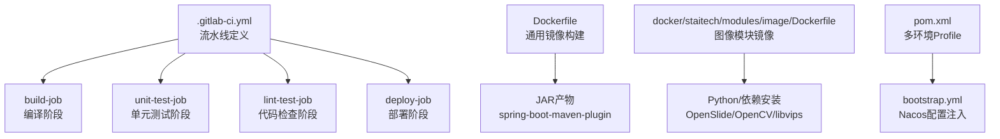
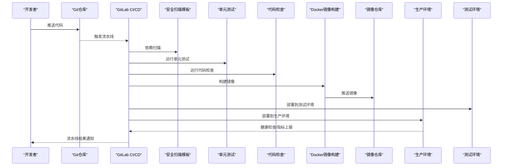
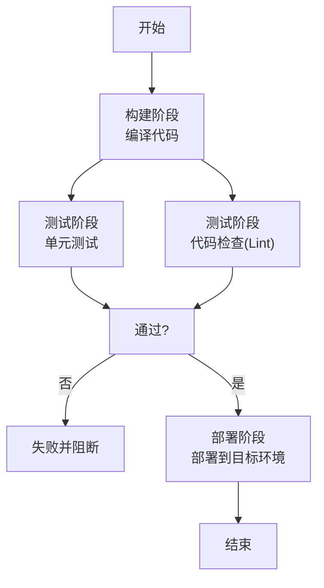
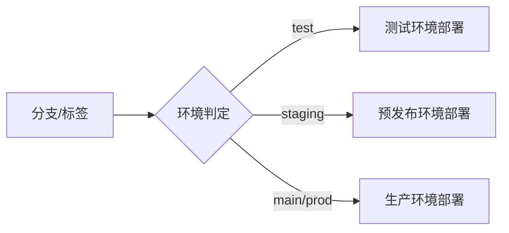
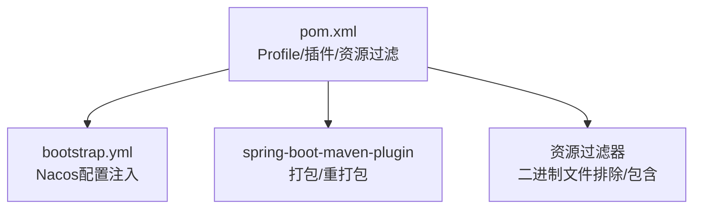

# CI/CD流水线

<cite>
**本文引用的文件**
- [.gitlab-ci.yml](file://.gitlab-ci.yml)
- [Dockerfile](file://Dockerfile)
- [docker/staitech/modules/image/Dockerfile](file://docker/staitech/modules/image/Dockerfile)
- [pom.xml](file://pom.xml)
- [README.md](file://README.md)
- [src/main/resources/bootstrap.yml](file://src/main/resources/bootstrap.yml)
- [python-script/deepzoom_custom.py](file://python-script/deepzoom_custom.py)
- [python-script/tile.py](file://python-script/tile.py)
</cite>

## 目录
1. [简介](#简介)
2. [项目结构](#项目结构)
3. [核心组件](#核心组件)
4. [架构总览](#架构总览)
5. [详细组件分析](#详细组件分析)
6. [依赖关系分析](#依赖关系分析)
7. [性能考虑](#性能考虑)
8. [故障排查指南](#故障排查指南)
9. [结论](#结论)
10. [附录](#附录)

## 简介
本文件面向CI/CD流水线配置与自动化部署，结合仓库中的现有模板与配置，系统化说明GitLab CI/CD的阶段划分、质量检查、测试执行、Docker镜像构建与推送、多环境部署（测试、预发布、生产）、回滚与蓝绿部署建议、监控告警与通知集成，以及故障恢复与手动干预流程。为便于非技术读者理解，文档采用分层讲解与可视化图示相结合的方式呈现。

## 项目结构
该仓库包含标准Spring Boot应用与两套Dockerfile：一套用于通用Java应用打包与运行，另一套用于图像模块（含OpenSlide、OpenCV、libvips等依赖）。同时提供基础的GitLab CI模板与Maven配置，支持多环境Profile与Nacos配置中心集成。

图表来源
- [.gitlab-ci.yml:16-50](file://.gitlab-ci.yml#L16-L50)
- [Dockerfile:1-16](file://Dockerfile#L1-L16)
- [docker/staitech/modules/image/Dockerfile:1-46](file://docker/staitech/modules/image/Dockerfile#L1-L46)
- [pom.xml:348-385](file://pom.xml#L348-L385)
- [src/main/resources/bootstrap.yml:13-37](file://src/main/resources/bootstrap.yml#L13-L37)

章节来源
- [.gitlab-ci.yml:16-50](file://.gitlab-ci.yml#L16-L50)
- [Dockerfile:1-16](file://Dockerfile#L1-L16)
- [docker/staitech/modules/image/Dockerfile:1-46](file://docker/staitech/modules/image/Dockerfile#L1-L46)
- [pom.xml:348-385](file://pom.xml#L348-L385)
- [src/main/resources/bootstrap.yml:13-37](file://src/main/resources/bootstrap.yml#L13-L37)

## 核心组件
- GitLab CI/CD流水线：定义了build、test、deploy三个阶段，并引入安全扫描模板；当前测试与构建脚本为占位符，需替换为真实命令。
- Maven工程与多环境Profile：通过POM中profiles切换不同环境的Nacos命名空间、地址与组，配合bootstrap.yml动态注入配置。
- Docker镜像：提供两套镜像构建方案，分别适用于通用Java服务与图像处理模块。
- Python脚本：图像瓦片生成工具，供离线或辅助处理使用。

章节来源
- [.gitlab-ci.yml:16-50](file://.gitlab-ci.yml#L16-L50)
- [pom.xml:348-385](file://pom.xml#L348-L385)
- [src/main/resources/bootstrap.yml:13-37](file://src/main/resources/bootstrap.yml#L13-L37)
- [Dockerfile:1-16](file://Dockerfile#L1-L16)
- [docker/staitech/modules/image/Dockerfile:1-46](file://docker/staitech/modules/image/Dockerfile#L1-L46)
- [python-script/deepzoom_custom.py:1-153](file://python-script/deepzoom_custom.py#L1-L153)
- [python-script/tile.py:1-103](file://python-script/tile.py#L1-L103)

## 架构总览
下图展示从代码提交到多环境部署的整体流程，包括质量门禁、测试执行、镜像构建与推送、以及环境部署与回滚策略。

图表来源
- [.gitlab-ci.yml:21-50](file://.gitlab-ci.yml#L21-L50)
- [Dockerfile:1-16](file://Dockerfile#L1-L16)

## 详细组件分析

### GitLab CI/CD流水线结构与阶段
- 阶段定义：build、test、deploy按序执行；test阶段内并行执行单元测试与代码检查。
- 质量门禁：引入依赖扫描模板，增强安全基线。
- 部署目标：当前部署作业指向production环境，可扩展为多环境矩阵。

图表来源
- [.gitlab-ci.yml:16-50](file://.gitlab-ci.yml#L16-L50)

章节来源
- [.gitlab-ci.yml:16-50](file://.gitlab-ci.yml#L16-L50)

### 代码质量检查与单元测试
- 单元测试：当前脚本为占位符，建议替换为实际的测试命令与覆盖率统计。
- Lint检查：当前脚本为占位符，建议接入静态分析工具（如SpotBugs、Checkstyle、PMD等）。
- 安全扫描：通过include模板引入依赖扫描，建议在流水线中增加“质量门禁”步骤以阻止低分版本进入生产。

章节来源
- [.gitlab-ci.yml:30-42](file://.gitlab-ci.yml#L30-L42)
- [.gitlab-ci.yml:21-23](file://.gitlab-ci.yml#L21-L23)

### Docker镜像自动构建与推送
- 通用镜像（Dockerfile）：基于Maven多阶段构建，先在builder镜像中打包JAR，再拷贝至轻量JRE运行时，暴露端口并设置入口命令。
- 图像模块镜像（docker/staitech/modules/image/Dockerfile）：安装Python、pip与OpenSlide二进制，复制OpenCV与libvips库，拷贝自研JAR与脚本，暴露专用端口并设置入口命令。
- 推送策略：可在部署阶段添加镜像标签与推送步骤，建议结合Git标签或流水线变量实现版本化管理。

图表来源
- [Dockerfile:1-16](file://Dockerfile#L1-L16)
- [docker/staitech/modules/image/Dockerfile:1-46](file://docker/staitech/modules/image/Dockerfile#L1-L46)

章节来源
- [Dockerfile:1-16](file://Dockerfile#L1-L16)
- [docker/staitech/modules/image/Dockerfile:1-46](file://docker/staitech/modules/image/Dockerfile#L1-L46)

### 多环境部署（测试、预发布、生产）
- 环境隔离：通过POM的profiles与bootstrap.yml的占位符，动态注入不同环境的Nacos命名空间、地址与组，实现配置解耦。
- 部署策略：当前部署作业固定在production环境，建议在流水线中引入变量矩阵，按分支或标签选择目标环境（如test、staging、prod）。

图表来源
- [pom.xml:348-385](file://pom.xml#L348-L385)
- [src/main/resources/bootstrap.yml:13-37](file://src/main/resources/bootstrap.yml#L13-L37)

章节来源
- [pom.xml:348-385](file://pom.xml#L348-L385)
- [src/main/resources/bootstrap.yml:13-37](file://src/main/resources/bootstrap.yml#L13-L37)
- [.gitlab-ci.yml:44-50](file://.gitlab-ci.yml#L44-L50)

### 回滚策略与蓝绿部署
- 回滚策略：建议在部署阶段记录镜像版本与部署时间戳，结合容器编排平台的滚动回滚能力实现快速回退。
- 蓝绿部署：通过双实例或双命名空间部署，先在备用环境启动新版本，健康检查通过后切换流量，随后回收旧实例。

[本节为概念性指导，无需文件引用]

### 监控告警集成与部署通知
- 指标与日志：应用已引入Prometheus Micrometer，建议在部署阶段启用探针与指标导出，结合监控平台进行告警。
- 通知：可在流水线中配置成功/失败通知（邮件、Webhook、IM等），并与问题跟踪系统联动。

[本节为概念性指导，无需文件引用]

### 故障恢复与手动干预
- 故障恢复：在部署阶段增加健康检查与就绪探针，失败时自动触发回滚或通知人工介入。
- 手动干预：为高风险变更提供“暂停节点”，允许运维人员确认后再继续。

[本节为概念性指导，无需文件引用]

## 依赖关系分析
- Maven插件与资源过滤：spring-boot-maven-plugin负责打包与重打包，资源过滤器确保二进制文件不被过滤，同时将本地lib目录的JAR复制到可执行包内。
- Profile与配置注入：POM中定义多个环境Profile，bootstrap.yml通过占位符注入Nacos地址、命名空间与组，实现配置集中管理。

图表来源
- [pom.xml:229-346](file://pom.xml#L229-L346)
- [src/main/resources/bootstrap.yml:13-37](file://src/main/resources/bootstrap.yml#L13-L37)

章节来源
- [pom.xml:229-346](file://pom.xml#L229-L346)
- [src/main/resources/bootstrap.yml:13-37](file://src/main/resources/bootstrap.yml#L13-L37)

## 性能考虑
- 并行测试：利用流水线并行能力提升测试效率，但需注意共享资源（数据库、缓存）的隔离与清理。
- 缓存优化：Maven与依赖缓存可显著缩短构建时间，建议在CI Runner中启用缓存策略。
- 镜像体积：多阶段构建与精简运行时有助于减小镜像体积，提升拉取与启动速度。

[本节为通用指导，无需文件引用]

## 故障排查指南
- 流水线失败定位：优先查看失败阶段与具体作业日志，确认构建命令、测试命令与部署命令是否正确配置。
- 配置注入问题：核对bootstrap.yml中的占位符是否被POM Profile正确替换，确认Nacos地址与命名空间可用。
- 镜像构建异常：检查Dockerfile中依赖安装与权限设置，确保网络可达与镜像仓库凭证有效。
- Python脚本相关：若涉及图像处理功能，确认OpenSlide、OpenCV与libvips库路径与权限正确。

章节来源
- [.gitlab-ci.yml:24-50](file://.gitlab-ci.yml#L24-L50)
- [src/main/resources/bootstrap.yml:13-37](file://src/main/resources/bootstrap.yml#L13-L37)
- [docker/staitech/modules/image/Dockerfile:6-46](file://docker/staitech/modules/image/Dockerfile#L6-L46)
- [python-script/tile.py:1-103](file://python-script/tile.py#L1-L103)

## 结论
本仓库提供了CI/CD流水线的基础框架与多环境配置能力。建议在现有模板基础上补充真实的构建、测试与质量门禁命令，完善镜像构建与推送流程，并结合容器编排平台实施蓝绿/金丝雀部署与回滚策略，最终形成稳定、可观测、可追溯的自动化交付体系。

[本节为总结性内容，无需文件引用]

## 附录
- Auto DevOps兼容性：项目README指出与Auto DevOps兼容，若启用Auto DevOps可进一步简化流水线配置。

章节来源
- [README.md:7-11](file://README.md#L7-L11)