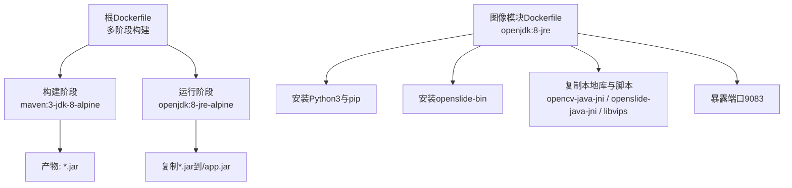
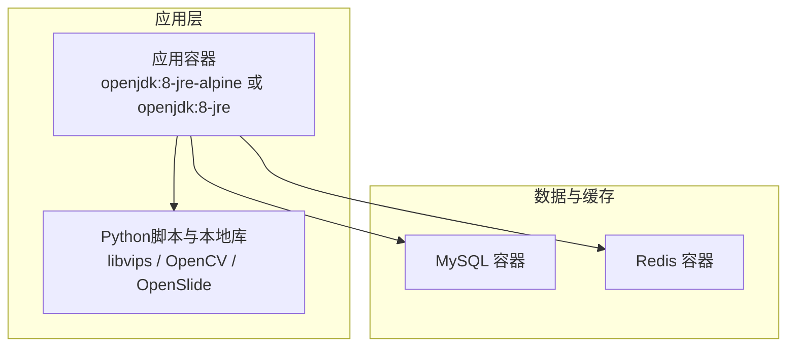
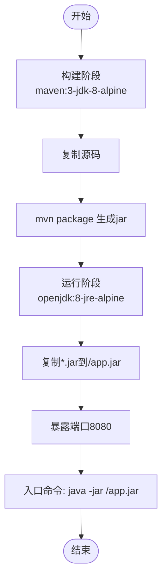
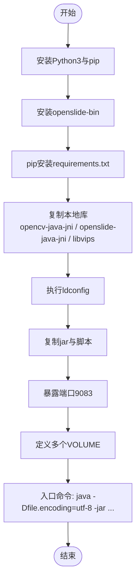
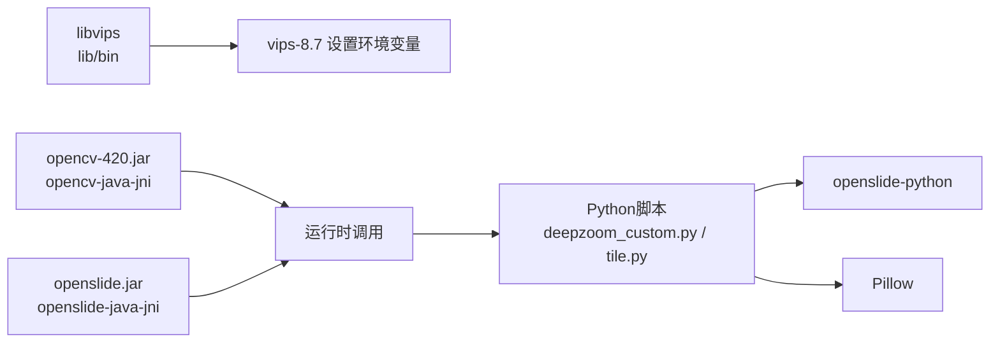
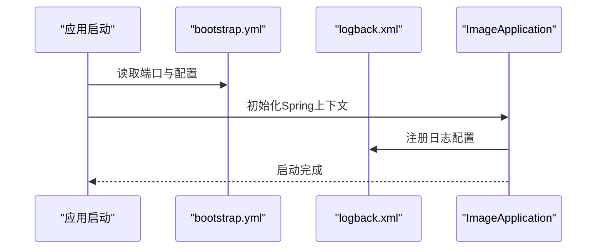
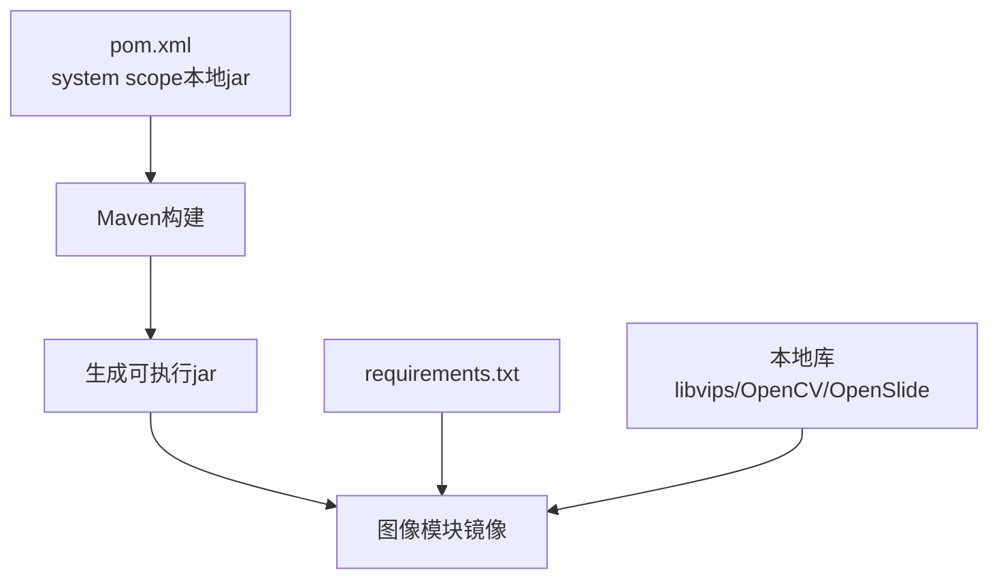
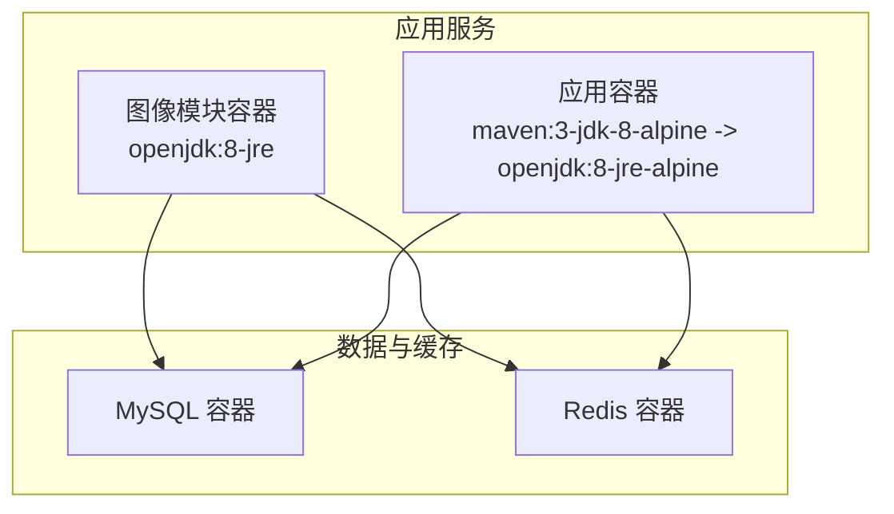

# 容器化部署

<cite>
**本文引用的文件**
- [Dockerfile](file://Dockerfile)
- [docker/staitech/modules/image/Dockerfile](file://docker/staitech/modules/image/Dockerfile)
- [pom.xml](file://pom.xml)
- [src/main/resources/bootstrap.yml](file://src/main/resources/bootstrap.yml)
- [src/main/java/cn/staitech/ImageApplication.java](file://src/main/java/cn/staitech/ImageApplication.java)
- [src/main/resources/logback.xml](file://src/main/resources/logback.xml)
- [docker/staitech/modules/image/script/deepzoom_custom.py](file://docker/staitech/modules/image/script/deepzoom_custom.py)
- [docker/staitech/modules/image/script/tile.py](file://docker/staitech/modules/image/script/tile.py)
- [docker/staitech/modules/image/script/requirements.txt](file://docker/staitech/modules/image/script/requirements.txt)
- [docker/staitech/modules/image/libvips/bin/vips-8.7](file://docker/staitech/modules/image/libvips/bin/vips-8.7)
- [python-script/deepzoom_custom.py](file://python-script/deepzoom_custom.py)
- [python-script/tile.py](file://python-script/tile.py)
</cite>

## 目录
1. [简介](#简介)
2. [项目结构](#项目结构)
3. [核心组件](#核心组件)
4. [架构总览](#架构总览)
5. [详细组件分析](#详细组件分析)
6. [依赖关系分析](#依赖关系分析)
7. [性能考量](#性能考量)
8. [故障排查指南](#故障排查指南)
9. [结论](#结论)
10. [附录](#附录)

## 简介
本指南面向开发者与运维人员，提供该Java图像处理服务的完整容器化部署方案。内容涵盖：
- Docker镜像构建流程与多阶段构建策略
- JDK与运行时环境配置
- 本地库libvips、OpenCV、OpenSlide的集成与依赖管理
- Docker Compose编排示例（应用、数据库、缓存）
- 容器启动参数、端口映射与卷挂载
- 健康检查、日志管理与资源限制
- 本地开发环境的容器化部署建议

## 项目结构
该项目采用多模块与多镜像策略：
- 根镜像：基于Maven与Alpine Linux的多阶段构建，先在Builder阶段编译打包，再将产物复制到轻量JRE运行时镜像
- 图像处理专用镜像：在openjdk:8-jre基础上安装Python、pip、openslide-bin，并将本地库与脚本复制到容器内，暴露专用端口用于文件服务

**图表来源**
- [Dockerfile:1-16](file://Dockerfile#L1-L16)
- [docker/staitech/modules/image/Dockerfile:1-46](file://docker/staitech/modules/image/Dockerfile#L1-L46)

**章节来源**
- [Dockerfile:1-16](file://Dockerfile#L1-L16)
- [docker/staitech/modules/image/Dockerfile:1-46](file://docker/staitech/modules/image/Dockerfile#L1-L46)

## 核心组件
- 构建与运行时镜像
  - 根镜像采用两阶段构建：Builder阶段使用maven:3-jdk-8-alpine编译，运行时阶段使用openjdk:8-jre-alpine，最终只保留最小运行时，减小镜像体积与攻击面
  - 图像模块镜像直接基于openjdk:8-jre，额外安装Python3、pip与openslide-bin，复制本地库与脚本，便于执行图像瓦片化等任务
- 本地库与脚本
  - libvips、OpenCV、OpenSlide本地库通过复制至/usr/lib与/usr/bin，并在镜像中执行ldconfig以更新动态链接缓存
  - Python脚本位于docker/staitech/modules/image/script，提供深度瓦片化与颜色空间处理能力
- 配置与日志
  - 应用端口在bootstrap.yml中定义；日志由logback.xml统一管理，支持按级别滚动输出
  - Spring Boot Actuator与Prometheus集成，便于监控与指标导出

**章节来源**
- [Dockerfile:1-16](file://Dockerfile#L1-L16)
- [docker/staitech/modules/image/Dockerfile:1-46](file://docker/staitech/modules/image/Dockerfile#L1-L46)
- [src/main/resources/bootstrap.yml:1-37](file://src/main/resources/bootstrap.yml#L1-L37)
- [src/main/resources/logback.xml:1-116](file://src/main/resources/logback.xml#L1-L116)
- [pom.xml:190-205](file://pom.xml#L190-L205)

## 架构总览
下图展示了容器化部署的整体架构：应用容器、数据库容器、缓存容器以及本地库与脚本的协作。

**图表来源**
- [Dockerfile:1-16](file://Dockerfile#L1-L16)
- [docker/staitech/modules/image/Dockerfile:1-46](file://docker/staitech/modules/image/Dockerfile#L1-L46)
- [src/main/resources/bootstrap.yml:1-37](file://src/main/resources/bootstrap.yml#L1-L37)

## 详细组件分析

### 组件A：根镜像构建流程（多阶段）
- 构建阶段
  - 基础镜像：maven:3-jdk-8-alpine
  - 工作目录：/usr/src/app
  - 复制源码并执行mvn package生成可执行jar
- 运行阶段
  - 基础镜像：openjdk:8-jre-alpine
  - 将构建产物复制到/app.jar
  - 暴露端口8080
  - 入口命令：java -jar /app.jar

**图表来源**
- [Dockerfile:1-16](file://Dockerfile#L1-L16)

**章节来源**
- [Dockerfile:1-16](file://Dockerfile#L1-L16)

### 组件B：图像模块镜像（openjdk:8-jre）
- 环境准备
  - 替换apt源为阿里云镜像，安装Python3与pip，软链python3为python
  - 安装openslide-bin并通过pip安装requirements.txt中的依赖
- 本地库与脚本
  - 复制opencv-java-jni、openslide-java-jni、libvips至/usr/lib与/usr/bin
  - 执行ldconfig更新动态链接缓存
  - 暴露端口9083，入口命令为java -jar staitech-modules-image.jar
- 卷挂载
  - 定义多个VOLUME用于附件、上传、WSI与工作目录

**图表来源**
- [docker/staitech/modules/image/Dockerfile:1-46](file://docker/staitech/modules/image/Dockerfile#L1-L46)
- [docker/staitech/modules/image/script/requirements.txt:1-58](file://docker/staitech/modules/image/script/requirements.txt#L1-L58)

**章节来源**
- [docker/staitech/modules/image/Dockerfile:1-46](file://docker/staitech/modules/image/Dockerfile#L1-L46)
- [docker/staitech/modules/image/script/requirements.txt:1-58](file://docker/staitech/modules/image/script/requirements.txt#L1-L58)

### 组件C：本地库与脚本集成
- libvips
  - 在镜像中复制lib与bin目录，并通过vips-8.7脚本设置环境变量（如LD_LIBRARY_PATH），确保动态库可用
- OpenCV与OpenSlide
  - 通过system scope依赖与本地jar包集成，同时在镜像中复制对应JNI库与pkgconfig文件，保证运行时调用
- Python脚本
  - deepzoom_custom.py与tile.py提供瓦片化与颜色空间处理能力，配合OpenSlide与Pillow使用

**图表来源**
- [docker/staitech/modules/image/libvips/bin/vips-8.7:1-131](file://docker/staitech/modules/image/libvips/bin/vips-8.7#L1-L131)
- [pom.xml:164-190](file://pom.xml#L164-L190)
- [docker/staitech/modules/image/script/deepzoom_custom.py:1-177](file://docker/staitech/modules/image/script/deepzoom_custom.py#L1-L177)
- [docker/staitech/modules/image/script/tile.py:1-99](file://docker/staitech/modules/image/script/tile.py#L1-L99)

**章节来源**
- [docker/staitech/modules/image/libvips/bin/vips-8.7:1-131](file://docker/staitech/modules/image/libvips/bin/vips-8.7#L1-L131)
- [pom.xml:164-190](file://pom.xml#L164-L190)
- [docker/staitech/modules/image/script/deepzoom_custom.py:1-177](file://docker/staitech/modules/image/script/deepzoom_custom.py#L1-L177)
- [docker/staitech/modules/image/script/tile.py:1-99](file://docker/staitech/modules/image/script/tile.py#L1-L99)

### 组件D：应用启动与配置
- 端口与配置
  - 应用端口在bootstrap.yml中定义为9083；根镜像默认8080，需根据实际选择
  - Spring Profile与Nacos配置通过占位符注入，支持多环境切换
- 日志
  - logback.xml配置控制台与文件滚动输出，按INFO/WARN/ERROR/DEBUG级别分文件存储
- JVM与监控
  - ImageApplication设置时区与注册Prometheus指标标签
  - pom.xml引入micrometer-registry-prometheus，便于容器内监控采集

**图表来源**
- [src/main/resources/bootstrap.yml:1-37](file://src/main/resources/bootstrap.yml#L1-L37)
- [src/main/resources/logback.xml:1-116](file://src/main/resources/logback.xml#L1-L116)
- [src/main/java/cn/staitech/ImageApplication.java:1-53](file://src/main/java/cn/staitech/ImageApplication.java#L1-L53)
- [pom.xml:190-205](file://pom.xml#L190-L205)

**章节来源**
- [src/main/resources/bootstrap.yml:1-37](file://src/main/resources/bootstrap.yml#L1-L37)
- [src/main/resources/logback.xml:1-116](file://src/main/resources/logback.xml#L1-L116)
- [src/main/java/cn/staitech/ImageApplication.java:1-53](file://src/main/java/cn/staitech/ImageApplication.java#L1-L53)
- [pom.xml:190-205](file://pom.xml#L190-L205)

## 依赖关系分析
- Maven与本地库
  - pom.xml通过system scope引入openslide与opencv的本地jar包，并在资源过滤中排除二进制文件，确保打包时正确包含
  - spring-boot-maven-plugin配置requiresUnpack以支持特定依赖解压
- Python依赖
  - requirements.txt集中声明了与图像处理相关的Python库，包括openslide-python、Pillow、numpy等
- 运行时依赖
  - 图像模块镜像通过复制本地库与执行ldconfig，确保libvips、OpenCV、OpenSlide在容器内可用

**图表来源**
- [pom.xml:164-190](file://pom.xml#L164-L190)
- [docker/staitech/modules/image/script/requirements.txt:1-58](file://docker/staitech/modules/image/script/requirements.txt#L1-L58)
- [docker/staitech/modules/image/Dockerfile:31-36](file://docker/staitech/modules/image/Dockerfile#L31-L36)

**章节来源**
- [pom.xml:164-190](file://pom.xml#L164-L190)
- [docker/staitech/modules/image/script/requirements.txt:1-58](file://docker/staitech/modules/image/script/requirements.txt#L1-L58)
- [docker/staitech/modules/image/Dockerfile:31-36](file://docker/staitech/modules/image/Dockerfile#L31-L36)

## 性能考量
- 镜像体积与启动速度
  - 多阶段构建显著减少运行时镜像大小，缩短拉取与启动时间
- 动态库加载
  - 在图像模块镜像中执行ldconfig，确保libvips等本地库被正确识别，避免运行时加载失败
- 并发与内存
  - Python脚本使用线程池与有界队列控制并发任务数量，结合OpenSlide缓存容量设置，降低内存峰值
- 监控与指标
  - Prometheus集成与Actuator启用，便于容器内观测CPU、内存、GC与业务指标

**章节来源**
- [docker/staitech/modules/image/Dockerfile:36](file://docker/staitech/modules/image/Dockerfile#L36)
- [docker/staitech/modules/image/script/tile.py:30-79](file://docker/staitech/modules/image/script/tile.py#L30-L79)
- [pom.xml:190-205](file://pom.xml#L190-L205)

## 故障排查指南
- 启动端口冲突
  - 根镜像默认8080，图像模块镜像默认9083；确认compose或docker run的端口映射与配置一致
- 本地库加载失败
  - 确认镜像中已复制libvips、OpenCV、OpenSlide，并执行ldconfig；检查LD_LIBRARY_PATH环境变量
- Python依赖问题
  - 确认requirements.txt已安装；若网络受限，可使用国内镜像源
- 日志定位
  - 查看logback.xml配置的日志滚动文件，按级别筛选问题；关注Nacos客户端与SQL相关日志
- 健康检查与资源限制
  - 可在compose中添加healthcheck与deploy.resources限制CPU/内存，结合Prometheus抓取指标

**章节来源**
- [src/main/resources/bootstrap.yml:1-37](file://src/main/resources/bootstrap.yml#L1-L37)
- [docker/staitech/modules/image/Dockerfile:31-36](file://docker/staitech/modules/image/Dockerfile#L31-L36)
- [docker/staitech/modules/image/script/requirements.txt:1-58](file://docker/staitech/modules/image/script/requirements.txt#L1-L58)
- [src/main/resources/logback.xml:1-116](file://src/main/resources/logback.xml#L1-L116)

## 结论
本指南提供了从镜像构建到服务编排的完整容器化方案。通过多阶段构建与本地库集成，结合Python脚本与监控指标，可在容器环境中稳定运行图像处理服务。建议在生产环境中进一步完善健康检查、日志聚合与资源限制策略，并针对不同环境优化镜像与依赖管理。

## 附录

### A. Docker Compose编排示例（概念性）
以下为概念性编排示意，展示应用、数据库与缓存的协同关系。请根据实际环境调整镜像、端口、卷与环境变量。

[此图为概念性说明，不直接映射具体源码文件]

### B. 容器启动参数与卷挂载要点
- 端口映射
  - 应用容器：8080（根镜像）或9083（图像模块）
- 卷挂载
  - 图像模块镜像定义了多个VOLUME，建议在compose中显式挂载至宿主机持久化目录
- 环境变量
  - 通过spring.profiles.active与Nacos配置项注入，实现多环境隔离

**章节来源**
- [docker/staitech/modules/image/Dockerfile:16-20](file://docker/staitech/modules/image/Dockerfile#L16-L20)
- [src/main/resources/bootstrap.yml:14-37](file://src/main/resources/bootstrap.yml#L14-L37)

### C. 本地开发环境容器化建议
- 使用根镜像构建后，将生成的jar复制到运行时镜像，适合快速迭代
- 图像模块镜像适合本地调试图像处理脚本与本地库，便于验证libvips、OpenCV、OpenSlide的可用性
- 建议在本地使用Compose编排数据库与缓存，统一管理网络与卷

**章节来源**
- [Dockerfile:1-16](file://Dockerfile#L1-L16)
- [docker/staitech/modules/image/Dockerfile:1-46](file://docker/staitech/modules/image/Dockerfile#L1-L46)