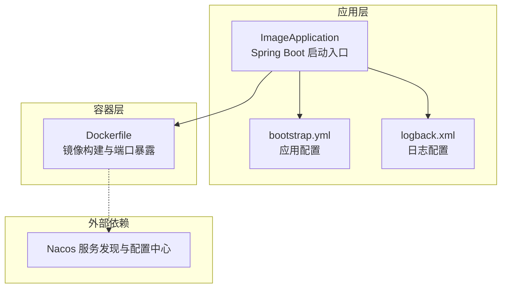
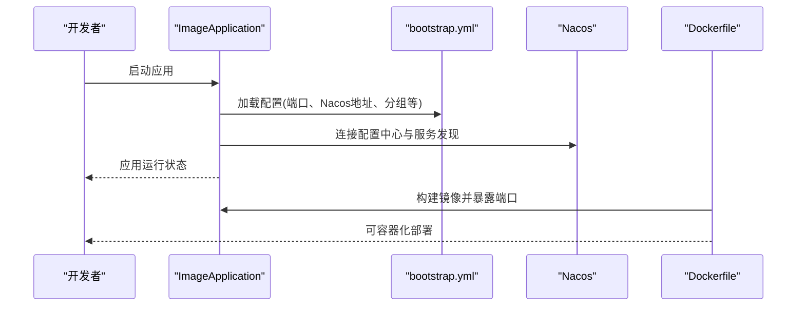
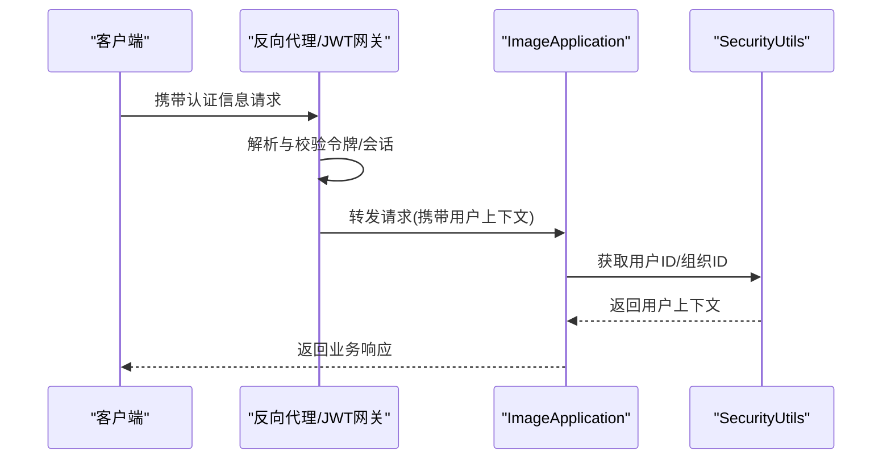
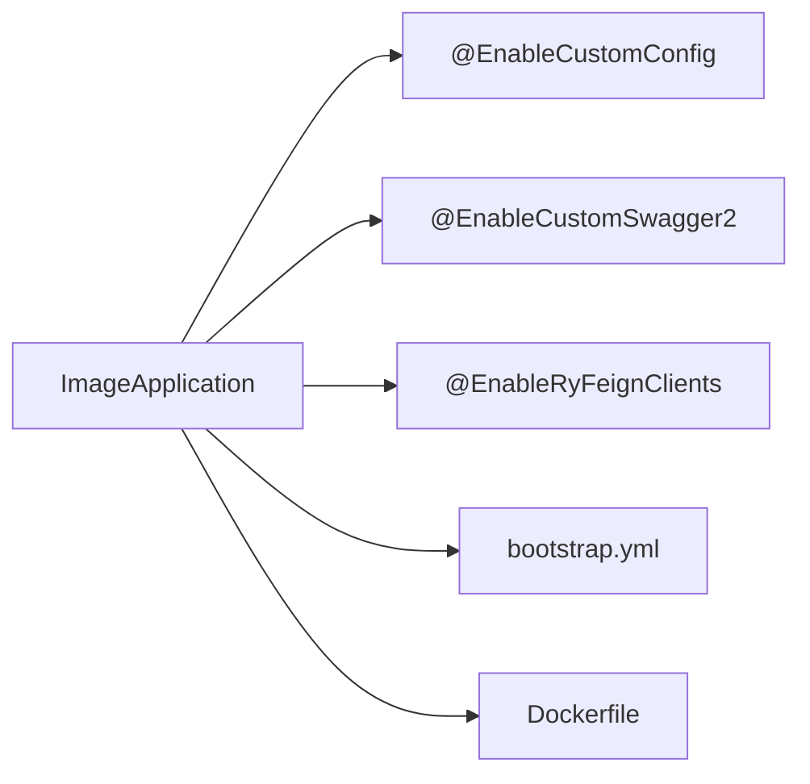

# 安全与网络配置

<cite>
**本文引用的文件**
- [ImageApplication.java](file://src/main/java/cn/staitech/ImageApplication.java)
- [bootstrap.yml](file://src/main/resources/bootstrap.yml)
- [Dockerfile](file://Dockerfile)
- [SecurityUtils.java](file://src/main/java/cn/staitech/file/security/utils/SecurityUtils.java)
- [FileController.java](file://src/main/java/cn/staitech/file/controller/FileController.java)
- [ImageController.java](file://src/main/java/cn/staitech/file/controller/ImageController.java)
- [ImageServiceImpl.java](file://src/main/java/cn/staitech/file/service/impl/ImageServiceImpl.java)
- [OpenSlideServiceImpl.java](file://src/main/java/cn/staitech/file/service/impl/OpenSlideServiceImpl.java)
- [logback.xml](file://src/main/resources/logback.xml)
</cite>

## 目录
1. [引言](#引言)
2. [项目结构](#项目结构)
3. [核心组件](#核心组件)
4. [架构总览](#架构总览)
5. [详细组件分析](#详细组件分析)
6. [依赖分析](#依赖分析)
7. [性能考虑](#性能考虑)
8. [故障排除指南](#故障排除指南)
9. [结论](#结论)
10. [附录](#附录)

## 引言
本指南面向安全与网络配置主题，结合当前代码库的实际实现，系统性地梳理与安全相关的配置点与最佳实践建议。重点覆盖以下方面：
- SSL/TLS与HTTPS：基于现有配置现状进行合规性评估与加固建议
- 网络安全：端口暴露、容器化部署与外部依赖（Nacos）的访问控制
- 负载均衡与反向代理：通过容器编排与外部网关实现
- 认证与授权：基于通用安全工具类的用户上下文提取与鉴权思路
- 安全加固：输入校验、SQL注入与XSS防护的工程化实践
- 日志审计与监控：日志配置与指标采集

说明：当前仓库未直接提供SSL/TLS证书与反向代理配置文件，因此本指南在这些领域以“现状评估+加固建议”的形式呈现，帮助读者在现有基础上完成安全加固。

## 项目结构
后端采用Spring Boot应用，通过@EnableCustomConfig等注解启用安全与通用能力；配置由bootstrap.yml集中管理；Dockerfile定义容器镜像与端口暴露；日志由logback.xml统一配置。

图表来源
- [ImageApplication.java:1-53](file://src/main/java/cn/staitech/ImageApplication.java#L1-L53)
- [bootstrap.yml:1-37](file://src/main/resources/bootstrap.yml#L1-L37)
- [Dockerfile:1-16](file://Dockerfile#L1-L16)

章节来源
- [ImageApplication.java:1-53](file://src/main/java/cn/staitech/ImageApplication.java#L1-L53)
- [bootstrap.yml:1-37](file://src/main/resources/bootstrap.yml#L1-L37)
- [Dockerfile:1-16](file://Dockerfile#L1-L16)

## 核心组件
- 启动入口与安全注解：通过@EnableCustomConfig、@EnableRyFeignClients等启用安全与通用能力，为后续认证授权与安全工具类提供基础。
- 配置中心与服务发现：使用Nacos作为配置中心与服务注册中心，需确保网络隔离与访问控制。
- 日志与指标：集成日志配置与Micrometer指标标签，便于审计与监控。

章节来源
- [ImageApplication.java:27-36](file://src/main/java/cn/staitech/ImageApplication.java#L27-L36)
- [bootstrap.yml:17-37](file://src/main/resources/bootstrap.yml#L17-L37)
- [ImageApplication.java:47-50](file://src/main/java/cn/staitech/ImageApplication.java#L47-L50)

## 架构总览
下图展示应用启动、配置加载与外部依赖的关系，以及容器化部署的关键节点。

图表来源
- [ImageApplication.java:39-44](file://src/main/java/cn/staitech/ImageApplication.java#L39-L44)
- [bootstrap.yml:2-37](file://src/main/resources/bootstrap.yml#L2-L37)
- [Dockerfile:12-16](file://Dockerfile#L12-L16)

## 详细组件分析

### SSL/TLS与HTTPS配置现状与加固建议
- 现状评估
  - 当前未见显式的SSL/TLS证书与HTTPS端口配置，容器暴露的是HTTP端口。
  - 若需启用HTTPS，应在网关或反向代理层完成TLS终止，并将流量转发至应用的HTTP端口。
- 建议方案
  - 在反向代理（如Nginx）中配置证书与HTTPS监听，应用仍以HTTP运行。
  - 或在应用侧启用HTTPS（需提供keystore与相应参数），但需配合网关或直接对外暴露。
  - 证书管理：使用自动化签发与续期流程（如ACME），并限制私钥存储与访问权限。
  - 强制HTTPS重定向与安全头（HSTS、CSP等）在网关层统一实施。

章节来源
- [Dockerfile:12](file://Dockerfile#L12)
- [bootstrap.yml:2-3](file://src/main/resources/bootstrap.yml#L2-L3)

### 网络安全配置
- 端口与暴露
  - 容器仅暴露HTTP端口，建议仅允许受控内网访问或通过反向代理统一入口。
- 访问控制
  - 通过防火墙策略限制对容器主机的访问，仅放行必要的管理与监控端口。
  - 对Nacos访问进行网络隔离，使用专用VPC与安全组策略。
- 传输安全
  - 内部服务间通信建议启用mTLS或在网关层加密，避免明文传输。

章节来源
- [Dockerfile:12](file://Dockerfile#L12)
- [bootstrap.yml:18-37](file://src/main/resources/bootstrap.yml#L18-L37)

### 负载均衡与反向代理
- 现状
  - 应用未内置LB配置，容器暴露单端口。
- 实施建议
  - 使用Nginx或同类型反向代理：配置上游集群、健康检查与会话保持策略。
  - 健康检查：基于HTTP路径与状态码判断实例可用性。
  - 会话保持：根据业务需求选择基于Cookie或IP的粘性会话策略。
  - 负载均衡算法：轮询、权重、最少连接等按场景选择。

说明：本节为概念性指导，不对应具体源文件。

### 用户认证与授权机制
- 用户上下文
  - 通过安全工具类获取当前用户标识与组织信息，用于数据隔离与权限判定。
- 授权策略
  - 结合业务实体（如图片所属组织）进行访问控制，确保用户只能操作其组织下的资源。
- JWT与会话
  - 若采用JWT，建议在网关层完成令牌解析与校验，应用侧仅做必要校验与上下文注入。

图表来源
- [ImageController.java:60](file://src/main/java/cn/staitech/file/controller/ImageController.java#L60)
- [ImageServiceImpl.java:278](file://src/main/java/cn/staitech/file/service/impl/ImageServiceImpl.java#L278)
- [ImageServiceImpl.java:533](file://src/main/java/cn/staitech/file/service/impl/ImageServiceImpl.java#L533)

章节来源
- [ImageController.java:60](file://src/main/java/cn/staitech/file/controller/ImageController.java#L60)
- [ImageServiceImpl.java:278](file://src/main/java/cn/staitech/file/service/impl/ImageServiceImpl.java#L278)
- [ImageServiceImpl.java:533](file://src/main/java/cn/staitech/file/service/impl/ImageServiceImpl.java#L533)

### 安全加固措施
- 输入验证
  - 在控制器层对请求参数进行白名单校验与长度限制，避免异常输入导致解析错误。
- SQL注入防护
  - 使用ORM映射与参数化查询，避免拼接SQL；对动态表名/列名进行严格白名单校验。
- XSS防护
  - 对输出内容进行HTML转义或使用安全模板；在网关层统一注入CSP头。
- 文件上传与处理
  - 限制文件类型与大小，对上传路径与临时文件进行安全清理。

章节来源
- [bootstrap.yml:6-10](file://src/main/resources/bootstrap.yml#L6-L10)

### 日志审计与安全事件监控
- 日志配置
  - 使用logback.xml统一配置日志级别与输出格式，确保审计日志可追踪。
- 指标与监控
  - 通过Micrometer注册应用指标，结合Prometheus/Grafana进行监控告警。
- 审计要点
  - 记录关键操作（登录、文件上传、资源访问）与异常事件，保留足够上下文信息。

章节来源
- [logback.xml](file://src/main/resources/logback.xml)
- [ImageApplication.java:47-50](file://src/main/java/cn/staitech/ImageApplication.java#L47-L50)

## 依赖分析
应用通过注解启用安全与通用能力，配置由bootstrap.yml集中管理，容器化部署由Dockerfile定义。

图表来源
- [ImageApplication.java:27-36](file://src/main/java/cn/staitech/ImageApplication.java#L27-L36)
- [bootstrap.yml:17-37](file://src/main/resources/bootstrap.yml#L17-L37)
- [Dockerfile:12](file://Dockerfile#L12)

章节来源
- [ImageApplication.java:27-36](file://src/main/java/cn/staitech/ImageApplication.java#L27-L36)
- [bootstrap.yml:17-37](file://src/main/resources/bootstrap.yml#L17-L37)
- [Dockerfile:12](file://Dockerfile#L12)

## 性能考虑
- 端口与网络
  - 减少不必要的端口暴露，降低攻击面；通过反向代理聚合请求，提升缓存与限流效率。
- 日志与指标
  - 控制日志级别与输出频率，避免I/O瓶颈；合理设置指标采样率。
- 上传与处理
  - 合理设置文件大小上限与并发数，防止资源耗尽。

## 故障排除指南
- HTTPS无法访问
  - 检查反向代理证书与端口配置；确认容器端口映射与防火墙策略。
- 认证失败
  - 核对网关令牌解析逻辑与应用侧用户上下文提取是否一致。
- 日志缺失
  - 检查logback.xml配置与日志级别；确认容器日志输出到标准输出/错误。
- Nacos连接异常
  - 校验Nacos地址、命名空间与分组配置；检查网络连通性与访问控制。

章节来源
- [bootstrap.yml:18-37](file://src/main/resources/bootstrap.yml#L18-L37)
- [logback.xml](file://src/main/resources/logback.xml)

## 结论
当前代码库已具备安全注解与通用能力的基础，但在SSL/TLS、反向代理与访问控制方面尚未直接落地。建议在网关层完成TLS终止与访问控制，在应用侧强化输入校验与权限控制，并完善日志与监控体系，以形成完整的安全与网络配置闭环。

## 附录
- 关键实现位置参考
  - 启动与安全注解：[ImageApplication.java:27-36](file://src/main/java/cn/staitech/ImageApplication.java#L27-L36)
  - 配置中心与服务发现：[bootstrap.yml:18-37](file://src/main/resources/bootstrap.yml#L18-L37)
  - 容器端口暴露：[Dockerfile:12](file://Dockerfile#L12)
  - 用户上下文提取：[ImageController.java:60](file://src/main/java/cn/staitech/file/controller/ImageController.java#L60)、[ImageServiceImpl.java:278](file://src/main/java/cn/staitech/file/service/impl/ImageServiceImpl.java#L278)、[ImageServiceImpl.java:533](file://src/main/java/cn/staitech/file/service/impl/ImageServiceImpl.java#L533)
  - 日志配置：[logback.xml](file://src/main/resources/logback.xml)