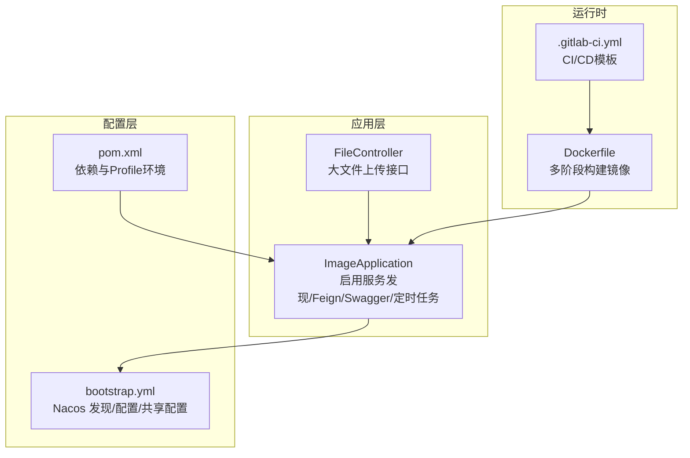
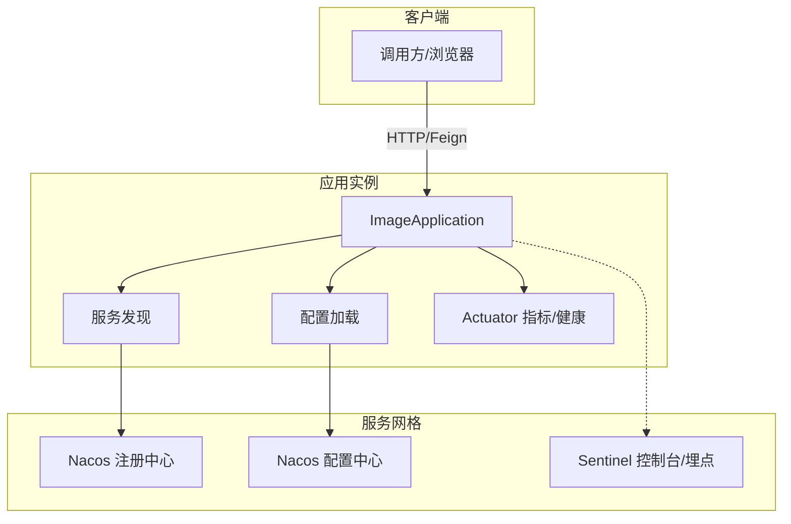
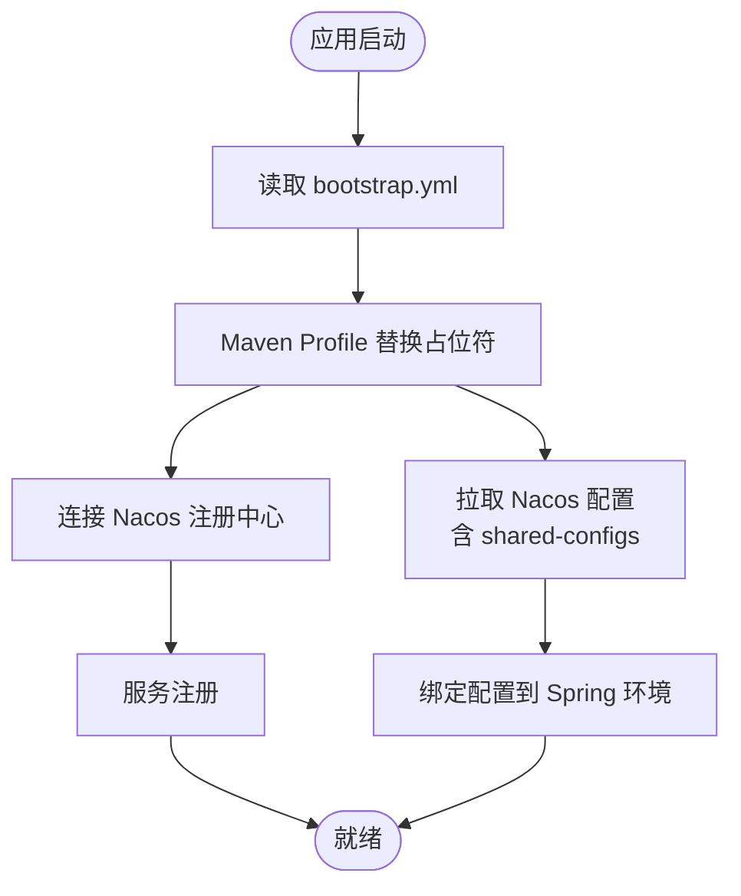
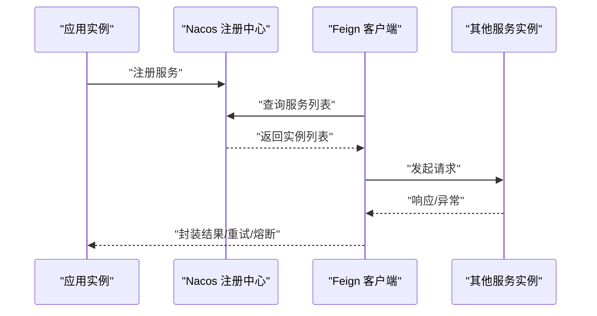
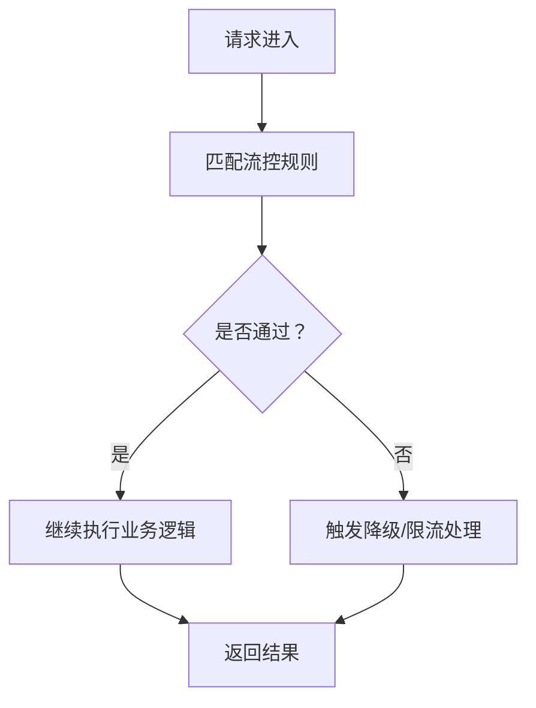
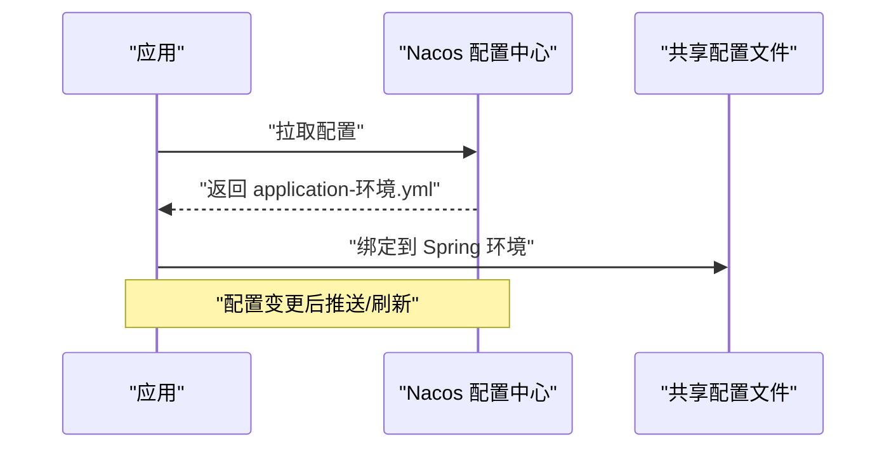
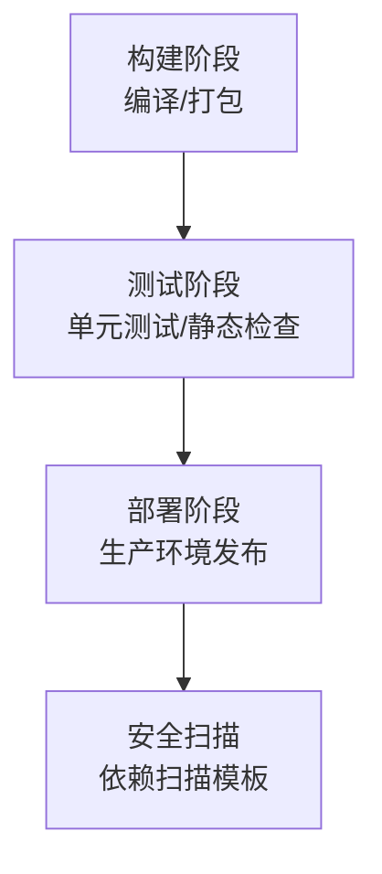
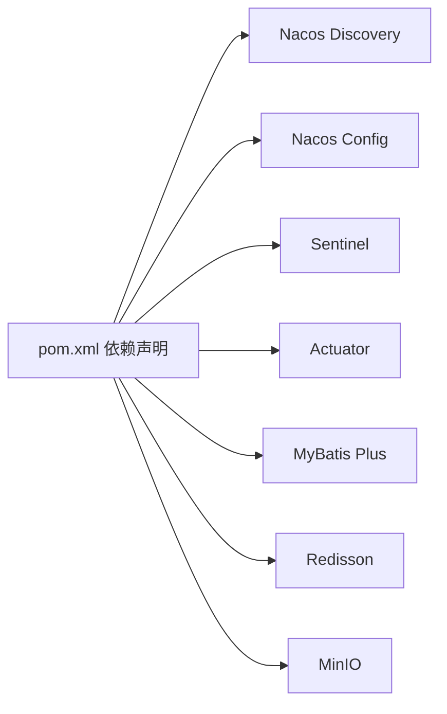

# 微服务配置

<cite>
**本文引用的文件**
- [bootstrap.yml](file://src/main/resources/bootstrap.yml)
- [pom.xml](file://pom.xml)
- [Dockerfile](file://Dockerfile)
- [.gitlab-ci.yml](file://.gitlab-ci.yml)
- [ImageApplication.java](file://src/main/java/cn/staitech/ImageApplication.java)
- [FileController.java](file://src/main/java/cn/staitech/file/controller/FileController.java)
- [ImageService.java](file://src/main/java/cn/staitech/file/service/ImageService.java)
- [README.md](file://README.md)
</cite>

## 目录
1. [简介](#简介)
2. [项目结构](#项目结构)
3. [核心组件](#核心组件)
4. [架构总览](#架构总览)
5. [详细组件分析](#详细组件分析)
6. [依赖分析](#依赖分析)
7. [性能考虑](#性能考虑)
8. [故障排查指南](#故障排查指南)
9. [结论](#结论)
10. [附录](#附录)

## 简介
本指南面向生产环境，系统性梳理基于 Spring Cloud Alibaba 的微服务配置要点，覆盖以下主题：
- Nacos 服务发现与配置中心：命名空间、分组、共享配置与动态刷新
- 服务注册与发现机制、健康检查与故障转移
- Sentinel 流量控制与熔断降级：限流、熔断策略与降级处理
- 配置中心共享配置与动态更新机制
- GitLab CI/CD 流水线：构建、测试、部署与环境管理

本项目已启用 Nacos 服务发现与配置中心、Sentinel、Actuator 等能力，并通过 Maven Profile 区分开发/测试/生产环境，结合 GitLab CI/CD 模板实现基础流水线。

## 项目结构
项目采用标准 Spring Boot 结构，核心配置集中在 bootstrap.yml 中，Maven 通过 Profile 注入 Nacos 地址、命名空间与分组；Dockerfile 提供多阶段构建镜像；.gitlab-ci.yml 提供基础流水线模板。

**图表来源**
- [ImageApplication.java:37-52](file://src/main/java/cn/staitech/ImageApplication.java#L37-L52)
- [bootstrap.yml:17-37](file://src/main/resources/bootstrap.yml#L17-L37)
- [pom.xml:349-384](file://pom.xml#L349-L384)
- [Dockerfile:1-16](file://Dockerfile#L1-L16)
- [.gitlab-ci.yml:16-50](file://.gitlab-ci.yml#L16-L50)

**章节来源**
- [bootstrap.yml:1-37](file://src/main/resources/bootstrap.yml#L1-L37)
- [pom.xml:1-385](file://pom.xml#L1-L385)
- [Dockerfile:1-16](file://Dockerfile#L1-L16)
- [.gitlab-ci.yml:1-50](file://.gitlab-ci.yml#L1-L50)
- [ImageApplication.java:1-53](file://src/main/java/cn/staitech/ImageApplication.java#L1-L53)

## 核心组件
- Nacos 服务发现与配置中心
  - 在 bootstrap.yml 中配置 discovery.server-addr、namespace、group、config.server-addr、file-extension、shared-configs 等
  - 通过 Maven Profile 注入 @serverAddr@、@nacosNamespace@、@nacosGroup@ 等占位符
- Sentinel 流控与熔断
  - pom.xml 引入 spring-cloud-starter-alibaba-sentinel，具备 Sentinel 能力
- Actuator 健康监控
  - pom.xml 引入 spring-boot-starter-actuator，提供健康检查与指标暴露
- 应用入口与注解
  - ImageApplication 启用 @EnableDiscoveryClient、@EnableFeignClients、@EnableScheduling 等

**章节来源**
- [bootstrap.yml:17-37](file://src/main/resources/bootstrap.yml#L17-L37)
- [pom.xml:29-51](file://pom.xml#L29-L51)
- [ImageApplication.java:34-36](file://src/main/java/cn/staitech/ImageApplication.java#L34-L36)

## 架构总览
下图展示应用在生产环境中的关键交互：应用通过 Nacos 进行服务注册与配置拉取，Sentinel 提供流量防护，Actuator 暴露健康与指标，CI/CD 负责构建与部署。

**图表来源**
- [bootstrap.yml:17-37](file://src/main/resources/bootstrap.yml#L17-L37)
- [pom.xml:29-51](file://pom.xml#L29-L51)
- [ImageApplication.java:34-36](file://src/main/java/cn/staitech/ImageApplication.java#L34-L36)

## 详细组件分析

### Nacos 服务发现与配置中心
- 服务发现
  - discovery.server-addr 指向 Nacos 地址
  - namespace/group 用于环境隔离与分组
  - 应用通过 @EnableDiscoveryClient 自动注册
- 配置中心
  - config.server-addr 指向 Nacos
  - file-extension 设置为 yml
  - shared-configs 动态引入 application-${spring.profiles.active}.yml
- 环境变量注入
  - Maven Profile 为 pacmvsdev/test/pathmedics 分别注入不同 serverAddr、namespace、group

**图表来源**
- [bootstrap.yml:17-37](file://src/main/resources/bootstrap.yml#L17-L37)
- [pom.xml:349-384](file://pom.xml#L349-L384)

**章节来源**
- [bootstrap.yml:17-37](file://src/main/resources/bootstrap.yml#L17-L37)
- [pom.xml:349-384](file://pom.xml#L349-L384)
- [ImageApplication.java:34-36](file://src/main/java/cn/staitech/ImageApplication.java#L34-L36)

### 服务注册与发现机制、健康检查与故障转移
- 注册与发现
  - @EnableDiscoveryClient 启用服务发现
  - 应用以 spring.application.name 作为服务名注册
- 健康检查
  - Actuator 提供 /actuator/health 等端点，便于探活
- 故障转移
  - 结合 Feign 客户端与负载均衡器实现调用端故障转移
  - Sentinel 可进一步提供限流/熔断保护

**图表来源**
- [ImageApplication.java:34-36](file://src/main/java/cn/staitech/ImageApplication.java#L34-L36)
- [pom.xml:47-51](file://pom.xml#L47-L51)

**章节来源**
- [ImageApplication.java:34-36](file://src/main/java/cn/staitech/ImageApplication.java#L34-L36)
- [pom.xml:47-51](file://pom.xml#L47-L51)

### Sentinel 流量控制与熔断降级
- 依赖引入
  - pom.xml 引入 spring-cloud-starter-alibaba-sentinel
- 使用建议
  - 在业务接口上使用注解或编程式方式定义限流/熔断规则
  - 针对 FileController 的上传接口可按 QPS/并发/异常比设定规则
  - 结合 Nacos 动态推送规则，实现灰度与快速调整

**图表来源**
- [pom.xml:41-45](file://pom.xml#L41-L45)
- [FileController.java:58-85](file://src/main/java/cn/staitech/file/controller/FileController.java#L58-L85)

**章节来源**
- [pom.xml:41-45](file://pom.xml#L41-L45)
- [FileController.java:58-85](file://src/main/java/cn/staitech/file/controller/FileController.java#L58-L85)

### 配置中心共享配置与动态更新
- 共享配置
  - shared-configs 引入 application-${spring.profiles.active}.${spring.cloud.nacos.config.file-extension}
  - 通过 Maven Profile 注入激活的环境名，实现按环境加载配置
- 动态更新
  - Nacos 支持配置变更推送，应用需配合 @RefreshScope 或重启生效
  - 建议对敏感配置与热更新项单独拆分命名空间与分组

**图表来源**
- [bootstrap.yml:36-37](file://src/main/resources/bootstrap.yml#L36-L37)
- [pom.xml:349-384](file://pom.xml#L349-L384)

**章节来源**
- [bootstrap.yml:36-37](file://src/main/resources/bootstrap.yml#L36-L37)
- [pom.xml:349-384](file://pom.xml#L349-L384)

### GitLab CI/CD 流水线配置与环境管理
- 基础流水线
  - stages: build → test → deploy
  - 包含依赖扫描模板
- 环境管理
  - deploy-job 指定 environment: production
- 建议增强
  - 在 build 阶段加入编译与单元测试
  - 在 deploy 阶段集成容器化部署与环境变量注入

**图表来源**
- [.gitlab-ci.yml:16-50](file://.gitlab-ci.yml#L16-L50)

**章节来源**
- [.gitlab-ci.yml:16-50](file://.gitlab-ci.yml#L16-L50)
- [README.md:7-11](file://README.md#L7-L11)

## 依赖分析
- Spring Cloud Alibaba 组件
  - Nacos Discovery、Nacos Config、Sentinel
- 监控与可观测性
  - Actuator、Micrometer Prometheus
- 数据与工具
  - MyBatis Plus、Redisson、MinIO、OpenCV/OpenSlide 等

**图表来源**
- [pom.xml:29-51](file://pom.xml#L29-L51)
- [pom.xml:132-163](file://pom.xml#L132-L163)

**章节来源**
- [pom.xml:29-51](file://pom.xml#L29-L51)
- [pom.xml:132-163](file://pom.xml#L132-L163)

## 性能考虑
- 上传性能
  - FileController 对大文件分片上传，建议结合 Sentinel 限制并发与 QPS，避免资源争用
- 配置加载
  - shared-configs 会拉取多份配置，建议按环境拆分命名空间与分组，减少冗余
- 健康与指标
  - 启用 Actuator 与 Micrometer Prometheus，结合外部监控平台进行告警与容量规划

**章节来源**
- [FileController.java:97-127](file://src/main/java/cn/staitech/file/controller/FileController.java#L97-L127)
- [pom.xml:47-51](file://pom.xml#L47-L51)
- [pom.xml:192-194](file://pom.xml#L192-L194)

## 故障排查指南
- 无法连接 Nacos
  - 检查 discovery.server-addr 与 config.server-addr 是否正确
  - 确认 Maven Profile 注入的 @serverAddr@、@nacosNamespace@、@nacosGroup@ 是否生效
- 配置未生效
  - 确认 shared-configs 引入的文件名与环境一致
  - 若使用 @RefreshScope，请确认配置推送与刷新链路
- 健康检查失败
  - 访问 /actuator/health 排查注册状态与外部依赖连通性
- CI/CD 部署问题
  - 检查 .gitlab-ci.yml stages 与环境变量注入
  - 确认 Dockerfile 构建产物与目标镜像标签

**章节来源**
- [bootstrap.yml:17-37](file://src/main/resources/bootstrap.yml#L17-L37)
- [pom.xml:349-384](file://pom.xml#L349-L384)
- [.gitlab-ci.yml:16-50](file://.gitlab-ci.yml#L16-L50)
- [Dockerfile:1-16](file://Dockerfile#L1-L16)

## 结论
本项目已具备基于 Spring Cloud Alibaba 的生产化基础能力：Nacos 服务发现与配置中心、Sentinel 流控、Actuator 监控、以及基础 CI/CD 模板。建议在生产落地时补充：
- Sentinel 规则的集中治理与灰度发布
- 配置的命名空间/分组精细化管理与权限控制
- CI/CD 中的构建优化、测试覆盖率与安全扫描
- 健康检查与故障转移策略的完善与演练

## 附录
- 关键配置位置
  - Nacos 发现与配置：[bootstrap.yml:17-37](file://src/main/resources/bootstrap.yml#L17-L37)
  - Maven 环境与占位符：[pom.xml:349-384](file://pom.xml#L349-L384)
  - 应用入口与注解：[ImageApplication.java:34-36](file://src/main/java/cn/staitech/ImageApplication.java#L34-L36)
  - 上传接口示例：[FileController.java:58-85](file://src/main/java/cn/staitech/file/controller/FileController.java#L58-L85)
  - CI/CD 模板：[.gitlab-ci.yml:16-50](file://.gitlab-ci.yml#L16-L50)
  - 容器化构建：[Dockerfile:1-16](file://Dockerfile#L1-16)